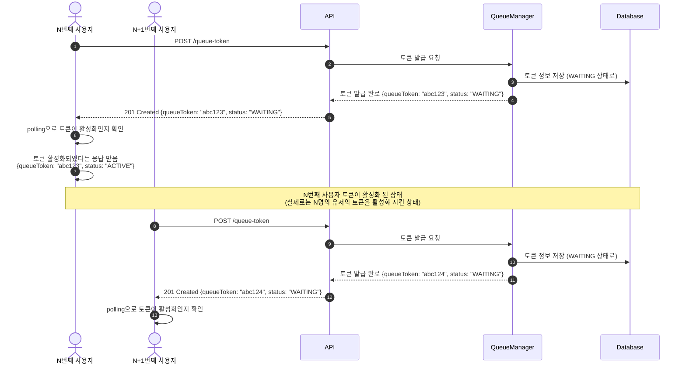
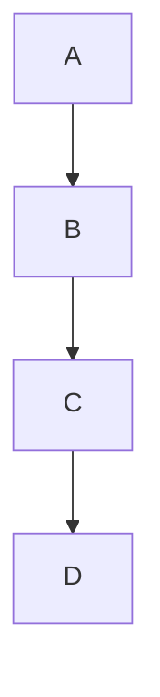
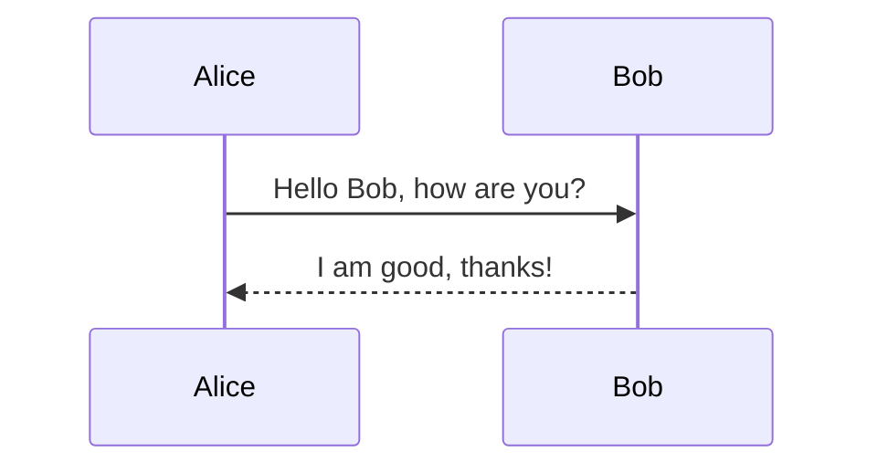
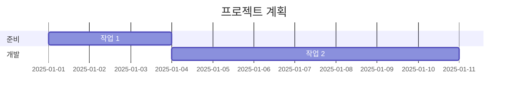
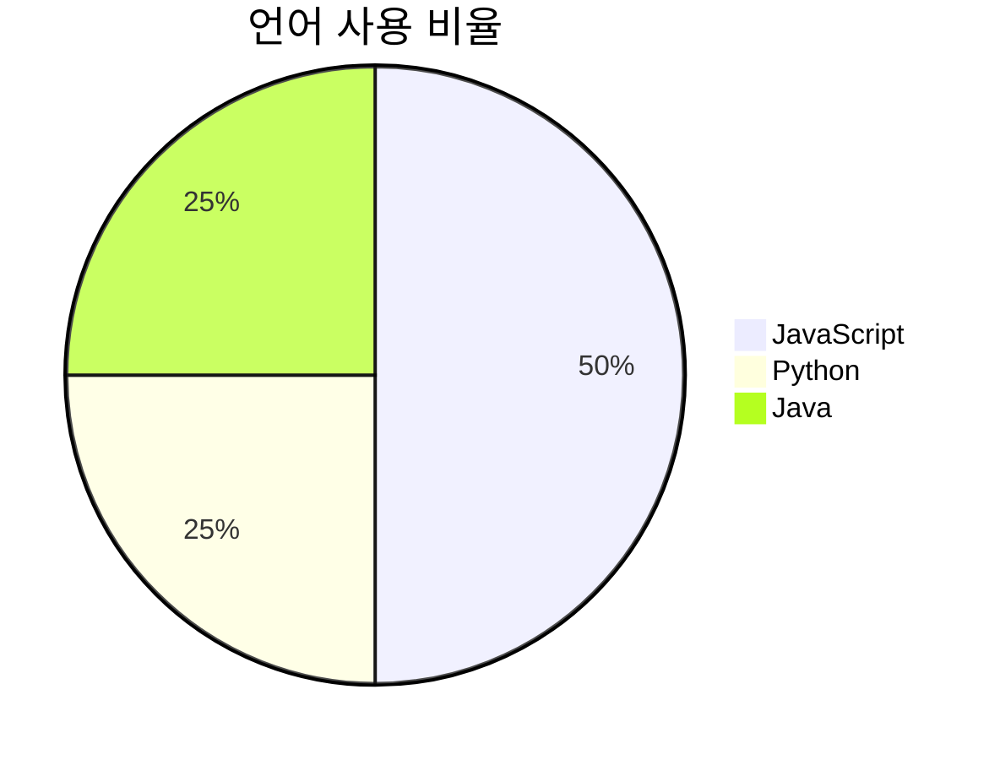

## What is Mermaid?

> Mermaid.js는 다이어그램과 차트를 간단한 텍스트 기반의 스크립트로 생성할 수 있도록 돕는 JavaScript 라이브러리입니다.


## 특징
단순하면서도 강력한 다이어그램 생성 도구로, 개발자와 문서 작성자에게 직관적이고 효율적인 방식으로 시각 자료를 추가할 수 있는 방법을 제공합니다.

github, gitlab, notion 등과 같은 플랫폼에서 **markdown과 함께 사용가능하며 미리보기를 지원합니다.**

### 예시
아래와 같이 markdown 문서에 넣고 코드 블럭을 `mermaid`로 변경해서 사용하면 된다.
```text
sequenceDiagram
    autonumber
    actor User1 as N번째 사용자
    actor User2 as N+1번째 사용자
    participant API
    participant QueueManager
    participant Database

    User1 ->> API: POST /queue-token
    API ->> QueueManager: 토큰 발급 요청
    QueueManager ->> Database: 토큰 정보 저장 (WAITING 상태로)
    QueueManager -->> API: 토큰 발급 완료 {queueToken: "abc123", status: "WAITING"}
    API -->> User1: 201 Created {queueToken: "abc123", status: "WAITING"}
    User1 ->> User1: polling으로 토큰이 활성화인지 확인
    User1 ->> User1: 토큰 활성화되었다는 응답 받음 <br/> {queueToken: "abc123", status: "ACTIVE"}
    Note over User1,Database: N번째 사용자 토큰이 활성화 된 상태 <br/> (실제로는 N명의 유저의 토큰을 활성화 시킨 상태)
    User2 ->> API: POST /queue-token
    API ->> QueueManager: 토큰 발급 요청
    QueueManager ->> Database: 토큰 정보 저장 (WAITING 상태로)
    QueueManager -->> API: 토큰 발급 완료 {queueToken: "abc124", status: "WAITING"}
    API -->> User2: 201 Created {queueToken: "abc124", status: "WAITING"}
    User2 ->> User2: polling으로 토큰이 활성화인지 확인
```

그러면 아래와 같이 미리보기를 지원한다.



## 설치 및 사용법

### 1. CDN을 통한 설치
```html
<script src="https://cdn.jsdelivr.net/npm/mermaid/dist/mermaid.min.js"></script>
```

### 2. 기본 설정
Mermaid를 초기화하여 사용할 수 있습니다.
```javascript
mermaid.initialize({ startOnLoad: true });
```

### 3. HTML에 다이어그램 추가
HTML 내부에 `mermaid` 클래스를 가진 `<div>`를 추가하고 다이어그램 코드를 작성합니다.
```html
<div class="mermaid">
  graph TD
    A[Start] --> B{Is it working?}
    B -- Yes --> C[Great!]
    B -- No --> D[Fix it]
</div>
```

### 4. 실행 결과
Mermaid.js가 위의 코드를 렌더링하여 다음과 같은 다이어그램을 생성합니다:
- `A`에서 `B`로 이동.
- `B`에서 조건에 따라 `C` 또는 `D`로 분기.

## 지원하는 다이어그램 유형

### 1. 플로우차트 (Flowchart)
```text
graph TD
  A --> B
  B --> C
  C --> D
```


### 2. 시퀀스 다이어그램 (Sequence Diagram)
```text
sequenceDiagram
  participant Alice
  participant Bob
  Alice->>Bob: Hello Bob, how are you?
  Bob-->>Alice: I am good, thanks!


### 3. 간트 차트 (Gantt Chart)
```text
gantt
  title 프로젝트 계획
  dateFormat  YYYY-MM-DD
  section 준비
    작업 1           :a1, 2025-01-01, 3d
  section 개발
    작업 2           :a2, after a1, 7d
```


### 4. 파이 차트 (Pie Chart)
```text
pie
  title 언어 사용 비율
  "JavaScript": 50
  "Python": 25
  "Java": 25
```



[출처]  
https://mermaid.js.org/