## Redis

Redis는 **REmote DIctionary Server**의 약자로, 네트워크를 통해 접근하는 인메모리 기반 Key-Value 데이터 저장소입니다. 이름에 Dictionary가 들어가는 이유처럼 기본 모델은 `key -> value`입니다. 다만 단순 문자열만 저장하는 캐시가 아니라 `String`, `List`, `Set`, `Hash`, `Sorted Set`, `Stream` 같은 자료구조를 서버가 직접 이해하고 명령어 단위로 조작할 수 있다는 점이 핵심입니다.

이 글에서 정리할 조건은 다음과 같습니다.

- Redis가 어떤 저장소인지, 왜 빠른지, 싱글 스레드 모델을 채택한 이유를 정리한다.
- 주요 자료구조의 사용처와 시간 복잡도, 공간 복잡도 관점을 정리한다.
- 영속화(RDB/AOF), Pub/Sub, Stream, 배포 구조(Replica/Sentinel/Cluster) 같은 기본 운영 기능을 다룬다.
- 캐시 전략과 다른 저장소와의 비교를 통해 Redis의 활용 방법을 정리한다.
- 핵심 개념을 본문 설명과 Mermaid 다이어그램으로 함께 풀어낸다.
- WebFlux Redis 샘플 프로젝트를 기준으로 실전 API 예제를 연결한다.

Redis는 크게 다음 세 가지 특징으로 이해하면 좋습니다.

- **In-Memory 데이터 저장소**: 데이터를 RAM에 저장하므로 디스크 기반 DB보다 지연 시간이 낮습니다.
- **Key-Value NoSQL DB**: SQL 테이블이 아니라 key로 value를 직접 찾는 구조입니다.
- **다양한 자료구조 지원**: 단순 캐시뿐 아니라 큐, 랭킹, 중복 제거, 세션, 카운터, 메시지 스트림까지 표현할 수 있습니다.

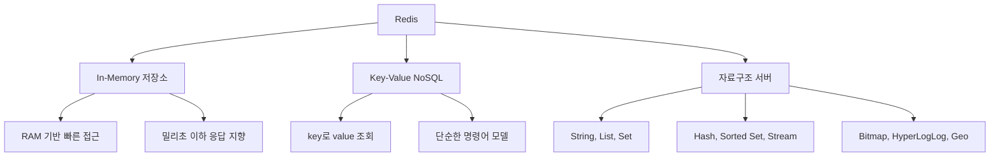

### Redis를 사용하는 대표적인 이유

Redis는 보통 "빠른 캐시"로 먼저 접하지만, 실제 서비스에서는 아래처럼 여러 역할을 맡습니다.

| 사용 사례   | 주로 쓰는 자료구조 | 설명                                                            |
| ----------- | ------------------ | --------------------------------------------------------------- |
| 캐시        | `String`, `Hash`   | DB 조회 결과, API 응답, 세션 정보를 TTL과 함께 저장             |
| 카운터      | `String`           | 조회수, 좋아요 수, 재고 수량을 `INCR`, `DECR`로 원자적으로 변경 |
| 분산 락     | `String`           | `SET key value NX EX seconds`로 잠금 획득 시도                  |
| 작업 큐     | `List`, `Stream`   | 간단한 FIFO 큐는 List, 재처리와 ACK가 필요하면 Stream           |
| 실시간 알림 | `Pub/Sub`          | 구독 중인 클라이언트에게 즉시 메시지 전달                       |
| 랭킹        | `Sorted Set`       | score 기준으로 순위 조회                                        |
| 중복 제거   | `Set`              | 유니크 방문자, 태그, 권한 목록 관리                             |

> - Redis는 빠르지만 모든 데이터를 Redis에 넣는 것이 정답은 아닙니다.
> - 메모리 비용이 높기 때문에 자주 접근하는 Hot Data 위주로 저장해야 합니다.
> - 단일 명령어는 원자적이지만, 여러 명령어를 조합한 비즈니스 로직은 트랜잭션, Lua script, 락 등을 고려해야 합니다.
> - `KEYS`, 큰 범위의 `LRANGE`, 큰 Hash의 `HGETALL`처럼 오래 걸리는 명령은 싱글 이벤트 루프를 막을 수 있습니다.

## In-Memory DB로서의 Redis

Redis가 빠른 가장 직접적인 이유는 데이터를 디스크가 아니라 메모리에 저장한다는 점입니다.

### 장점

- **극도로 빠른 속도**: 일반적인 단순 명령은 매우 낮은 지연 시간으로 처리됩니다.
- **낮은 지연 시간**: 애플리케이션과 Redis가 가까운 네트워크에 있으면 캐시 계층으로 쓰기 좋습니다.
- **높은 처리량**: 명령이 짧고 자료구조 연산이 효율적이면 초당 많은 요청을 처리할 수 있습니다.

### 단점

- **휘발성**: 프로세스가 죽으면 메모리 데이터는 사라질 수 있습니다. 이를 완화하기 위해 RDB snapshot, AOF(Append Only File) 영속화를 사용합니다. 영속화 방식의 상세 원리와 운영 설정은 자료구조를 먼저 다룬 뒤 아래 [Redis 데이터 영속화](#redis-데이터-영속화persistence-rdb와-aof) 절에서 설명합니다.
- **메모리 용량 제한**: 디스크보다 RAM은 비싸고 제한적입니다.
- **Hot Data 중심 설계 필요**: 모든 원본 데이터를 Redis에 저장하기보다는 자주 읽는 데이터, 짧게 살아도 되는 데이터, 빠른 응답이 필요한 데이터를 선별하는 편이 좋습니다.

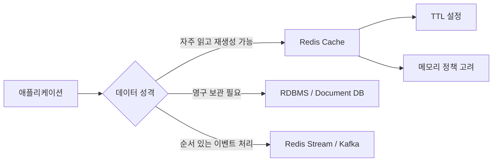

## Redis는 왜 싱글 스레드를 선택했을까?

Redis를 설명할 때 가장 많이 나오는 문장이 "Redis는 싱글 스레드다"입니다. 이 말은 정확히는 **사용자 명령어를 파싱하고 실제 데이터를 읽고 쓰는 핵심 실행 경로가 주로 단일 스레드 이벤트 루프에서 처리된다**는 뜻입니다.

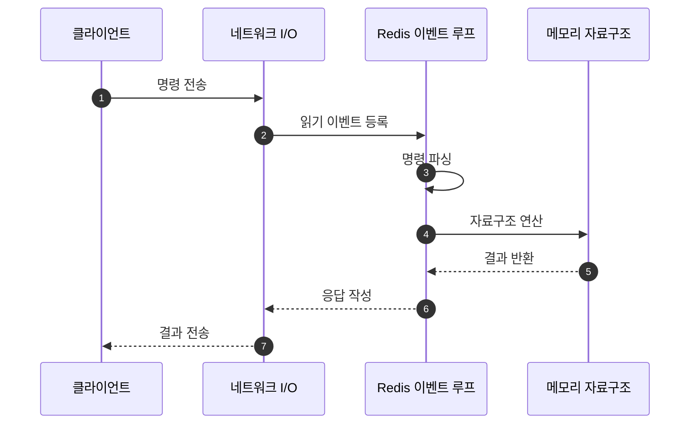

### 싱글 스레드 채택 이유

Redis가 싱글 스레드 모델을 채택한 이유는 단순히 구현이 쉬워서만은 아닙니다.

| 이유                                         | 설명                                                                                                                                                                     |
| -------------------------------------------- | ------------------------------------------------------------------------------------------------------------------------------------------------------------------------ |
| 락 비용 제거                                 | 여러 스레드가 같은 자료구조를 동시에 수정하면 mutex, lock-free 구조, race condition 처리가 필요합니다. Redis는 핵심 명령 실행을 단일 스레드로 처리해 이 비용을 줄입니다. |
| 원자성 보장 단순화                           | 하나의 명령이 실행되는 동안 다른 명령이 끼어들지 않으므로 `INCR`, `DECR`, `LPUSH` 같은 단일 명령의 원자성이 자연스럽게 보장됩니다.                                       |
| CPU보다 메모리/네트워크가 병목인 경우가 많음 | Redis 명령은 대부분 짧고 단순합니다. 많은 워크로드에서 병목은 복잡한 CPU 계산보다 네트워크 왕복, 메모리 접근, 큰 응답 전송입니다.                                        |
| 이벤트 루프와 I/O multiplexing               | `epoll`, `kqueue` 같은 I/O multiplexing으로 많은 커넥션을 하나의 이벤트 루프에서 효율적으로 다룰 수 있습니다.                                                            |
| 예측 가능한 실행 모델                        | 명령 처리 순서가 명확해 디버깅과 성능 추론이 비교적 쉽습니다.                                                                                                            |

### 그러면 Redis는 완전히 싱글 스레드일까?

아닙니다. Redis의 핵심 데이터 조작은 단일 스레드 중심이지만, Redis 전체 프로세스 안팎에는 멀티 스레드 또는 별도 프로세스가 관여하는 부분이 있습니다.

| 영역                                   | 싱글/멀티                       | 설명                                                                                                                                   |
| -------------------------------------- | ------------------------------- | -------------------------------------------------------------------------------------------------------------------------------------- |
| 명령 실행과 데이터 변경                | 주로 싱글 스레드                | `GET`, `SET`, `INCR`, `HSET` 같은 명령의 실제 자료구조 접근과 변경은 메인 이벤트 루프가 처리합니다.                                    |
| 네트워크 I/O                           | Redis 6 이후 선택적 멀티 스레드 | 요청 읽기와 응답 쓰기 일부를 I/O thread로 나눌 수 있습니다. 다만 명령 실행 자체가 여러 스레드에서 동시에 수행되는 것은 아닙니다.       |
| 만료 키 삭제                           | 메인 루프 + 보조 작업           | TTL 만료는 lazy expiration과 active expiration으로 처리됩니다. 큰 객체 삭제는 lazy free 설정에 따라 백그라운드에서 처리할 수 있습니다. |
| 영속화 RDB                             | 별도 프로세스 fork              | RDB snapshot은 보통 자식 프로세스를 fork해 디스크에 기록합니다. 스레드라기보다는 별도 프로세스에 가깝습니다.                           |
| AOF rewrite                            | 별도 프로세스 fork              | AOF 파일 재작성도 자식 프로세스를 사용해 메인 루프 영향을 줄입니다.                                                                    |
| AOF fsync, lazy free 등 background job | 백그라운드 스레드               | 디스크 동기화, 큰 메모리 해제 같은 보조 작업은 background I/O thread가 맡을 수 있습니다.                                               |
| Cluster 노드 간 통신                   | 각 노드 프로세스                | Redis Cluster는 여러 Redis 프로세스가 슬롯을 나눠 갖는 구조입니다.                                                                     |

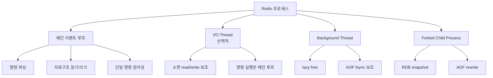

### 싱글 스레드 모델에서 주의할 점

Redis의 장점은 "한 명령을 빨리 끝낸다"는 전제에서 잘 살아납니다. 반대로 한 명령이 오래 걸리면 뒤의 모든 명령이 기다립니다.

| 위험한 패턴               | 이유                                             | 대안                            |
| ------------------------- | ------------------------------------------------ | ------------------------------- |
| `KEYS *`                  | 전체 key space를 훑어 이벤트 루프를 막을 수 있음 | 운영 환경에서는 `SCAN` 사용     |
| 큰 List에 `LRANGE 0 -1`   | 응답 크기와 순회 비용이 큼                       | 페이지 단위 범위 조회           |
| 큰 Hash에 `HGETALL`       | 모든 field/value를 한 번에 가져옴                | `HSCAN`, 필요한 field만 `HMGET` |
| 큰 key 삭제 `DEL big-key` | 메모리 해제가 오래 걸릴 수 있음                  | `UNLINK`, lazy free 고려        |
| Lua script 장시간 실행    | script 실행 중 다른 명령 대기                    | script는 짧고 결정적으로 작성   |

## Redis 자료구조 및 명령어 실행
Redis는 자료구조별로 명령어가 나뉩니다. 자료구조를 잘 고르면 애플리케이션 코드에서 직접 구현해야 할 정렬, 중복 제거, 원자적 증가, 큐 연산을 Redis 명령 하나로 처리할 수 있습니다.

| 자료구조     | 대표 명령어                                | 자주 쓰는 상황                 | 주요 복잡도                                      |
| ------------ | ------------------------------------------ | ------------------------------ | ------------------------------------------------ |
| `String`     | `SET`, `GET`, `INCR`, `MGET`               | 캐시, 카운터, 락, 단일 값 저장 | `GET/SET`: `O(1)`, `MGET`: `O(N)`                |
| `List`       | `LPUSH`, `RPUSH`, `LPOP`, `RPOP`, `LRANGE` | 큐, 스택, 최근 목록            | 양끝 push/pop: `O(1)`, range: `O(S+N)`           |
| `Set`        | `SADD`, `SREM`, `SISMEMBER`, `SINTER`      | 중복 제거, 집합 연산           | 단일 add/remove/check: 평균 `O(1)`               |
| `Sorted Set` | `ZADD`, `ZRANGE`, `ZREVRANGE`, `ZINCRBY`   | 랭킹, 우선순위 큐              | add/remove: `O(log N)`, range: `O(log N + M)`    |
| `Hash`       | `HSET`, `HGET`, `HMGET`, `HGETALL`         | 객체 필드 저장                 | field 단일 접근: 평균 `O(1)`                     |
| `Stream`     | `XADD`, `XREAD`, `XREADGROUP`, `XACK`      | 이벤트 로그, durable queue     | append: 보통 `O(1)`, range/read는 조회 개수 영향 |

> - 복잡도에서 `N`은 대상 원소 수, `M`은 반환되는 원소 수를 의미합니다.
> - Redis 명령의 시간 복잡도는 명령어 문서에 따라 달라지므로 운영에서 많이 쓰는 명령은 반드시 별도로 확인하는 것이 좋습니다.
> - `O(1)` 명령이라도 value 크기가 매우 크면 네트워크 전송과 메모리 할당 비용이 커질 수 있습니다.

## 자료구조별 실제 유스케이스

Redis 자료구조는 "어떤 모양으로 저장할 수 있는가"보다 "어떤 접근 패턴을 서버 명령 하나로 처리할 수 있는가"가 더 중요합니다. 예를 들어 단순히 JSON을 저장할 수 있다는 이유만으로 모든 데이터를 `String`에 넣으면, 특정 필드만 바꾸거나 집합 연산을 해야 할 때 애플리케이션 코드가 복잡해집니다.

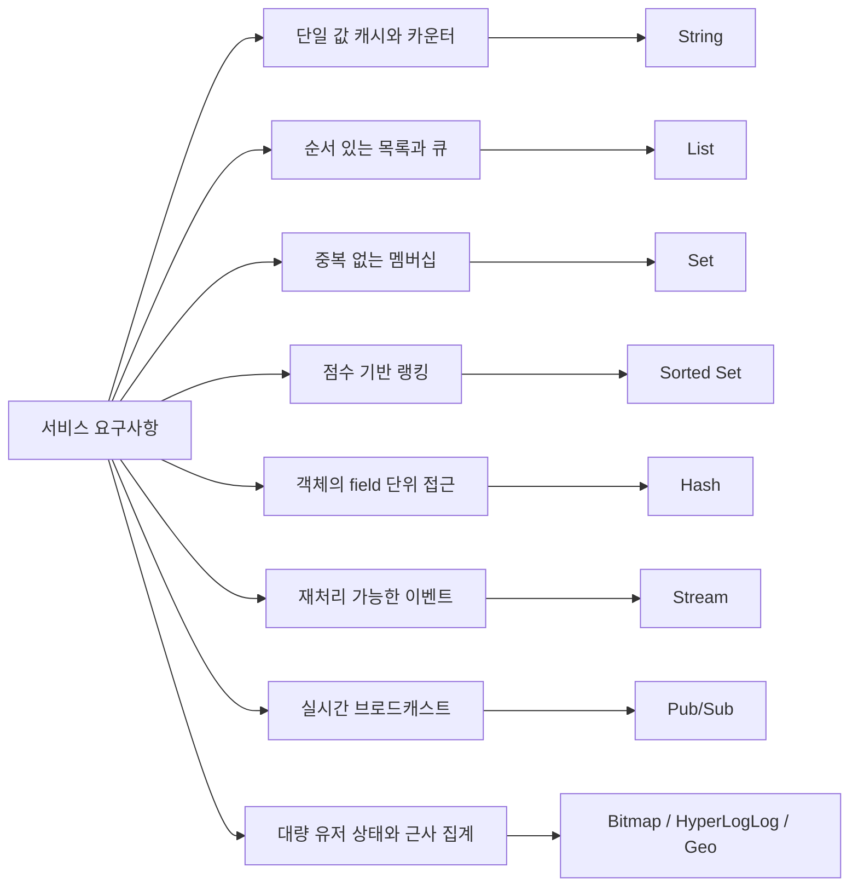

| 자료구조      | 실제 유스케이스                                                                                              | 예시 key                                              | 왜 적합한가                                                                                                    | 주의사항                                                                                                                                   |
| ------------- | ------------------------------------------------------------------------------------------------------------ | ----------------------------------------------------- | -------------------------------------------------------------------------------------------------------------- | ------------------------------------------------------------------------------------------------------------------------------------------ |
| `String`      | API 응답 캐시, 세션 토큰, 인증 코드, 조회수, 좋아요 수, 재고 수량, 분산 락, rate limit counter               | `cache:article:100`, `view:post:100`, `lock:order:1`  | 단일 값 저장이 단순하고 `EX`, `NX`, `INCR`, `DECR` 같은 원자 명령을 바로 사용할 수 있습니다.                   | 값이 너무 크면 네트워크 전송과 삭제 비용이 커집니다. 객체 일부만 자주 바꾸면 `Hash`가 더 나을 수 있습니다.                                 |
| `List`        | 최근 본 상품 목록, 간단한 작업 큐, 알림 목록, 채팅방 최근 메시지, stack/queue                                | `recent:user:1`, `queue:email`                        | 양끝 삽입과 삭제가 빠릅니다. `LPUSH/RPOP`, `RPUSH/LPOP` 조합으로 큐를 만들기 쉽습니다.                         | 메시지 ACK와 재처리가 필요하면 `Stream`이 더 안전합니다. 중간 인덱스 접근과 큰 범위 조회는 조심해야 합니다.                                |
| `Set`         | 유니크 방문자, 게시글 좋아요 사용자 목록, 태그 집합, 권한 목록, 친구 관계, 추천 후보 중복 제거               | `like:post:100`, `role:admin:users`, `tags:article:1` | 중복을 자동 제거하고 멤버 존재 여부를 빠르게 확인할 수 있습니다. 교집합, 합집합, 차집합도 서버에서 처리합니다. | 순서가 없습니다. 랭킹이나 시간순 정렬이 필요하면 `Sorted Set`을 고려해야 합니다.                                                           |
| `Sorted Set`  | 랭킹 보드, 인기 게시글, 우선순위 큐, 만료 인덱스, 스케줄러, 시간 범위 조회                                   | `rank:game:daily`, `popular:posts`, `expire:index`    | member에 score를 붙여 정렬된 상태로 관리합니다. score 기준 상위 N개, 범위 조회, 순위 조회가 쉽습니다.          | score 설계가 중요합니다. 동점 처리, 오래된 데이터 정리, 큰 range 조회 비용을 고려해야 합니다.                                              |
| `Hash`        | 사용자 프로필, 상품 요약 정보, 장바구니 항목 수량, 세션 속성, 설정 묶음                                      | `user:100`, `product:100`, `cart:user:1`              | 하나의 key 아래 field를 나눠 저장하므로 특정 field만 읽고 쓸 수 있습니다. 작은 객체를 묶어 관리하기 좋습니다.  | 기본 TTL은 Hash key 전체에 적용됩니다. field별 TTL이 필요하면 Redis 7.4 이상의 Hash Field Expiration 또는 별도 key 분리를 고려해야 합니다. |
| `Stream`      | 주문 이벤트, 결제 이벤트, 알림 발송 작업, audit log, outbox 후속 처리, 여러 consumer가 나눠 처리하는 작업 큐 | `stream:orders`, `stream:payment-events`              | 메시지를 append-only 로그로 보관하고 consumer group, pending entry, ACK를 지원합니다.                          | Kafka 같은 장기 보관 대용으로 무조건 쓰기보다는 보관 기간, trimming, 장애 복구 전략을 정해야 합니다.                                       |
| `Pub/Sub`     | 실시간 알림 fan-out, WebSocket 서버 간 이벤트 전달, 캐시 무효화 신호, 간단한 내부 broadcast                  | `channel:notice`, `channel:cache-invalidate`          | 구독 중인 클라이언트에게 즉시 메시지를 전달합니다. 구조가 단순하고 지연 시간이 낮습니다.                       | 메시지를 저장하지 않습니다. 구독자가 잠시 끊겨 있으면 메시지를 놓칠 수 있으므로 중요한 이벤트에는 `Stream`이 더 적합합니다.                |
| `Bitmap`      | 일별 출석 체크, 기능 사용 여부, 유저별 플래그, DAU 계산                                                      | `attendance:2025-02-12`, `feature-used:2025-02-12`    | bit 단위로 상태를 저장하므로 많은 boolean 값을 매우 작게 표현할 수 있습니다.                                   | user id처럼 offset으로 쓸 값의 범위가 너무 크면 메모리 낭비가 생길 수 있습니다.                                                            |
| `HyperLogLog` | 대략적인 UV, 검색어별 유니크 사용자 수, 이벤트별 유니크 참여자 수                                            | `uv:2025-02-12`, `uv:post:100`                        | 정확한 목록이 아니라 유니크 개수 추정만 필요할 때 메모리를 크게 절약합니다.                                    | 근사치입니다. 정확한 사용자 목록이나 정확한 카운트가 필요하면 `Set`이 맞습니다.                                                            |
| `Geo`         | 주변 매장 검색, 근처 기사/라이더 조회, 위치 기반 추천                                                        | `geo:stores`, `geo:riders`                            | 좌표를 저장하고 반경 기반 조회를 Redis 명령으로 처리할 수 있습니다.                                            | 복잡한 지리 질의나 정교한 공간 인덱싱은 전문 검색 엔진이나 공간 DB가 더 적합할 수 있습니다.                                                |

### 유스케이스별 선택 예시

#### 1. 게시글 상세 API 캐시

게시글 상세 API 응답을 짧게 캐싱하려면 `String`이 가장 단순합니다.

```sh
SET cache:post:100 '{"id":100,"title":"Redis"}' EX 300
GET cache:post:100
```

- 시간 복잡도: `SET`, `GET` 모두 보통 `O(1)`입니다.
- 공간 복잡도: 저장한 JSON 문자열 크기에 비례해 `O(V)`입니다.
- 대안: 조회 응답 전체가 아니라 조회수, 제목, 작성자처럼 일부 필드만 자주 바뀌면 `Hash`를 사용할 수 있습니다.

#### 2. 조회수와 좋아요 수

동시 요청이 많은 카운터는 `String`의 `INCR`, `DECR`, `INCRBY`가 잘 맞습니다.

```sh
INCR view:post:100
INCRBY like:post:100 1
DECRBY stock:product:100 1
```

애플리케이션에서 `GET -> 계산 -> SET`을 직접 구현하면 race condition이 생길 수 있습니다. Redis의 카운터 명령은 단일 명령으로 원자적으로 실행됩니다.

- 시간 복잡도: `O(1)`입니다.
- 공간 복잡도: key 수에 비례해 `O(N)`입니다.
- 대안: 정확한 증가 이력까지 남겨야 하면 `Stream`에 이벤트를 append하고 별도 집계기를 둘 수 있습니다.

#### 3. 최근 본 상품

사용자별 최근 본 상품은 순서가 중요하고 오래된 항목을 잘라내야 하므로 `List`를 사용할 수 있습니다.

```sh
LPUSH recent:user:1 product:100
LTRIM recent:user:1 0 19
LRANGE recent:user:1 0 19
```

- 시간 복잡도: `LPUSH`는 `O(1)`, `LTRIM`과 `LRANGE`는 범위 크기에 영향을 받습니다.
- 공간 복잡도: 사용자 수와 보관할 상품 수에 비례합니다.
- 대안: 중복 제거와 최신순이 동시에 필요하면 `Sorted Set`에 상품 id를 member, 조회 시각을 score로 저장하는 방식이 더 좋습니다.

#### 4. 게시글 좋아요 사용자 목록

어떤 사용자가 이미 좋아요를 눌렀는지 확인해야 한다면 `Set`이 적합합니다.

```sh
SADD like:post:100 user:1
SISMEMBER like:post:100 user:1
SCARD like:post:100
```

- 시간 복잡도: `SADD`, `SISMEMBER`, `SCARD`는 평균적으로 `O(1)`입니다.
- 공간 복잡도: 좋아요를 누른 사용자 수에 비례해 `O(N)`입니다.
- 대안: 좋아요를 누른 시간순 목록이 필요하면 `Sorted Set`에 timestamp를 score로 저장합니다.

#### 5. 게임 랭킹과 인기 게시글

score 기반 정렬이 필요하면 `Sorted Set`을 사용합니다.

```sh
ZINCRBY rank:game:daily 50 user:1
ZREVRANGE rank:game:daily 0 9 WITHSCORES
ZREVRANK rank:game:daily user:1
```

- 시간 복잡도: score 갱신은 보통 `O(log N)`, 상위 N개 조회는 `O(log N + M)`입니다.
- 공간 복잡도: member 수에 비례해 `O(N)`입니다.
- 대안: 정렬이 필요 없고 단순 참여자 중복 제거만 필요하면 `Set`이 더 단순합니다.

#### 6. 사용자 프로필과 장바구니

객체의 일부 field만 자주 읽거나 갱신한다면 `Hash`가 좋습니다.

```sh
HSET user:100 name "kim" age "30" grade "VIP"
HGET user:100 grade
HSET user:100 grade "VVIP"
```

장바구니도 상품 id를 field로 두면 수량만 갱신하기 쉽습니다.

```sh
HINCRBY cart:user:1 product:100 1
HGETALL cart:user:1
```

- 시간 복잡도: 단일 field 접근은 평균 `O(1)`입니다.
- 공간 복잡도: field 수와 value 크기에 비례합니다.
- 대안: 객체 전체를 한 번에 읽고 쓰는 패턴이면 `String`에 JSON으로 저장하는 편이 더 단순할 수 있습니다.

#### 7. 주문 이벤트 처리

주문 생성 후 결제, 알림, 재고 차감 같은 후속 처리를 여러 consumer가 나눠 처리해야 한다면 `Stream`이 적합합니다.

```sh
XADD stream:orders * orderId 100 userId 1 status CREATED
XGROUP CREATE stream:orders order-processors 0 MKSTREAM
XREADGROUP GROUP order-processors consumer-1 COUNT 10 STREAMS stream:orders >
XACK stream:orders order-processors 1750000000000-0
```

- 시간 복잡도: `XADD`는 보통 `O(1)`, 읽기는 반환 개수에 영향을 받습니다.
- 공간 복잡도: 보관하는 이벤트 수와 field 크기에 비례합니다.
- 대안: 이벤트 유실이 괜찮은 단순 실시간 알림이면 `Pub/Sub`이 더 간단합니다. 장기 보관과 대규모 스트리밍이 중요하면 Kafka가 더 적합할 수 있습니다.

#### 8. 캐시 무효화와 실시간 알림

서버 여러 대에 "이 key를 지워라" 같은 신호만 빠르게 보내면 `Pub/Sub`을 사용할 수 있습니다.

```sh
PUBLISH cache:invalidate "post:100"
SUBSCRIBE cache:invalidate
```

- 시간 복잡도: publish는 구독자 수에 영향을 받습니다.
- 공간 복잡도: 메시지를 저장하지 않으므로 Redis에 누적되는 데이터는 거의 없습니다.
- 대안: 메시지를 반드시 처리해야 하면 `Stream`을 사용합니다.

#### 9. 일별 출석 체크와 유니크 방문자

정확한 사용자 목록이 필요하지 않고 출석 여부만 필요하면 `Bitmap`이 유용합니다.

```sh
SETBIT attendance:2025-02-12 1001 1
GETBIT attendance:2025-02-12 1001
BITCOUNT attendance:2025-02-12
```

정확한 목록 없이 유니크 방문자 수만 대략 알고 싶다면 `HyperLogLog`를 사용할 수 있습니다.

```sh
PFADD uv:2025-02-12 user:1 user:2 user:3
PFCOUNT uv:2025-02-12
```

- 시간 복잡도: 단일 bit 접근은 보통 `O(1)`, `PFADD/PFCOUNT`도 매우 작고 안정적인 비용으로 동작합니다.
- 공간 복잡도: Bitmap은 최대 offset에 영향받고, HyperLogLog는 매우 작은 고정 크기 구조로 근사 집계를 수행합니다.
- 대안: 정확한 사용자 목록과 정확한 수가 필요하면 `Set`을 사용합니다.

### String (문자열)

String은 Redis에서 가장 기본적인 자료구조입니다. 이름은 문자열이지만 실제로는 **binary safe**한 byte sequence입니다. 즉 텍스트뿐 아니라 숫자, JSON, 직렬화된 객체, 이미지 조각 같은 바이너리 데이터도 저장할 수 있습니다.

String의 핵심은 다음과 같습니다.

- 가장 기본적인 Key-Value 저장 타입입니다.
- Redis String은 binary safe이므로 문자열 끝을 `\0` 같은 문자에 의존해 판단하지 않습니다.
- 값 하나의 최대 크기는 512MB입니다.
- 카운터, 분산 락, 캐시, 토큰 저장소처럼 단일 값 중심의 요구사항에 잘 맞습니다.
- 너무 큰 value는 네트워크 전송, 메모리 복사, 삭제 비용이 커지므로 작은 값 중심으로 설계하는 것이 좋습니다.

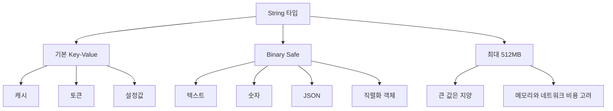

#### String 내부 구조: SDS와 인코딩

Redis는 C 문자열을 그대로 쓰지 않고 SDS(Simple Dynamic String)를 사용합니다.

SDS는 개념적으로 다음 정보를 함께 관리합니다.

| 필드                | 의미                                           |
| ------------------- | ---------------------------------------------- |
| `len`               | 실제 문자열 길이                               |
| `free` 또는 `alloc` | 추가로 사용할 수 있는 여유 공간 또는 할당 크기 |
| `buf`               | 실제 데이터가 저장되는 byte 배열               |

SDS를 쓰면 문자열 길이를 매번 순회하지 않고 `O(1)`에 알 수 있고, append 시 매번 새 메모리를 할당하지 않도록 여유 공간을 둘 수 있습니다. 또한 binary safe이므로 중간에 null byte가 있어도 데이터로 저장할 수 있습니다.

Redis 객체의 String value는 상황에 따라 인코딩이 달라집니다.

| 인코딩   | 사용 상황                    | 특징                                                                 |
| -------- | ---------------------------- | -------------------------------------------------------------------- |
| `int`    | 정수로 표현 가능한 값        | 숫자 연산에 효율적입니다.                                            |
| `embstr` | 짧은 문자열                  | Redis object와 SDS를 연속 메모리에 한 번에 할당해 캐시 친화적입니다. |
| `raw`    | 긴 문자열 또는 수정된 문자열 | Redis object와 SDS가 분리되어 더 유연하게 크기 변경을 처리합니다.    |

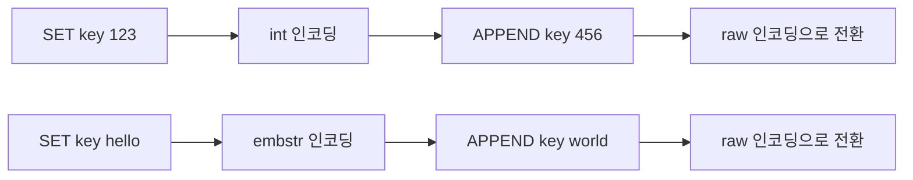

`embstr`는 짧고 읽기 중심인 문자열에 유리하지만 수정이 발생하면 `raw`로 바뀔 수 있습니다. 따라서 같은 String 타입이라도 내부 표현은 값의 크기와 변경 방식에 따라 달라집니다.

#### SET과 GET

`SET`은 key에 value를 저장합니다. key가 없으면 새로 만들고, 이미 있으면 기존 값을 덮어씁니다. 기본 `SET`은 성공하면 `OK`를 반환합니다.

`GET`은 String key의 값을 조회합니다. key가 없으면 `nil`을 반환합니다. key가 존재하지만 타입이 String이 아니면 WRONGTYPE 에러가 발생합니다.

- 명령어 및 반환값 예시
```sh
SET key "hello"         # key에 "hello" 저장 -> 반환값: OK
GET key                 # key 값 조회 -> 반환값: "hello" (키가 없으면 nil 반환)
SETNX lock "1"          # lock 키가 없을 때만 저장 (정상 처리) -> 반환값: 1
SETNX lock "2"          # 이미 lock 키가 존재하여 무시 (추가 안 됨) -> 반환값: 0
SET lock "3" NX         # SET 명령의 NX 옵션 사용 -> 성공 시 OK, 이미 키 존재 시 nil 반환
INCR counter            # 숫자 1 증가 -> 반환값: 11 (기존 값이 10이었다면 증가된 결과인 11 반환)
DECR counter            # 숫자 1 감소 -> 반환값: 10 (감소된 결과인 10 반환)
APPEND key "!!!"        # key 값에 문자열 추가 -> 반환값: 8 (추가 후 최종 문자열 길이인 8 반환)
DEL key                 # key 삭제 -> 반환값: 1 (삭제된 키의 개수인 1 반환, 없으면 0 반환)
```

- 실행 결과 예시


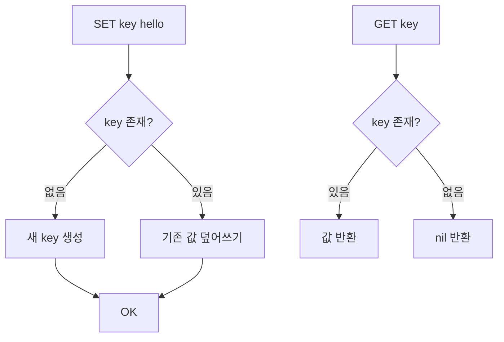

#### INCR와 DECR

`INCR`, `DECR`, `INCRBY`, `DECRBY`는 String value를 숫자로 해석해 증가 또는 감소시킵니다. 이 명령들은 단일 Redis 명령으로 실행되므로 원자적입니다. 여러 요청이 동시에 `INCR page_views`를 호출해도 lost update가 발생하지 않습니다.

```sh
SET page_views 10
INCR page_views
INCRBY page_views 5
DECR page_views
DECRBY page_views 3
GET page_views
```

활용 예시는 다음과 같습니다.

| 명령어   | 의미   | 예시                     |
| -------- | ------ | ------------------------ |
| `INCR`   | 1 증가 | 조회수 증가              |
| `DECR`   | 1 감소 | 임시 카운터 감소         |
| `INCRBY` | N 증가 | 포인트 적립              |
| `DECRBY` | N 감소 | 재고 차감, 다운로드 제한 |

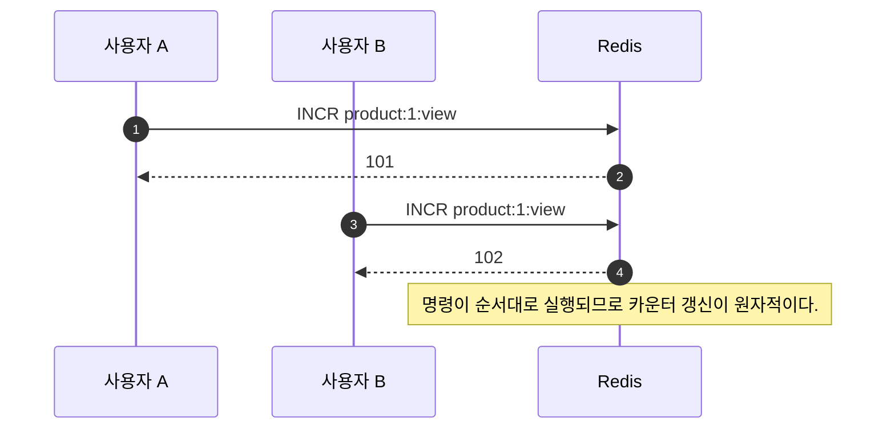

#### MSET과 MGET

`MSET`은 여러 key-value를 한 번에 저장하고, `MGET`은 여러 key 값을 한 번에 조회합니다. 여러 번의 `SET`, `GET` 요청을 각각 보내는 것보다 네트워크 RTT를 줄일 수 있습니다.

```sh
MSET user:1:name "kim" user:2:name "lee" user:3:name "park"
MGET user:1:name user:2:name user:3:name
```

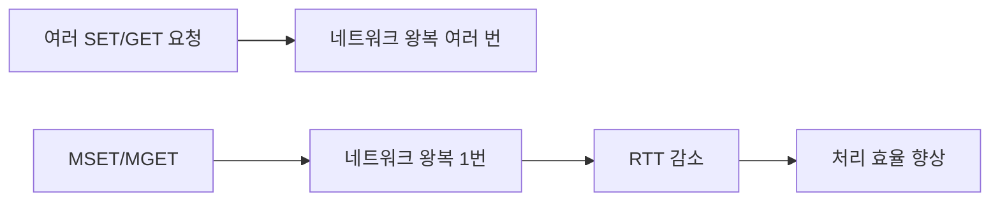

단, `MGET`으로 너무 많은 key를 한 번에 조회하면 응답 payload가 커질 수 있습니다. 대량 key는 적절히 batch 크기를 나누는 편이 안전합니다.

#### SETEX, SETNX, SET 옵션

`SETEX`는 value 저장과 TTL 설정을 한 번에 수행합니다. `SETNX`는 key가 없을 때만 저장합니다. 요즘은 `SET` 명령의 옵션을 함께 사용하는 형태를 더 자주 봅니다.

```sh
# TTL과 함께 저장
SET cache:user:1 "{...}" EX 300

# key가 없을 때만 저장
SET lock:order:1 "request-123" NX EX 10

# key가 있을 때만 갱신
SET cache:user:1 "{...}" XX EX 300

# 밀리초 단위 TTL
SET token:abc "payload" PX 5000
```

| 옵션              | 의미                 |
| ----------------- | -------------------- |
| `EX seconds`      | 초 단위 TTL          |
| `PX milliseconds` | 밀리초 단위 TTL      |
| `NX`              | key가 없을 때만 저장 |
| `XX`              | key가 있을 때만 저장 |

분산 락의 최소 형태는 아래와 같습니다.

```sh
SET lock:payment:1001 "request-id-1" NX EX 10
```

이 명령은 "락 key가 없으면 값을 저장하고 10초 뒤 자동 만료"를 하나의 원자 명령으로 처리합니다. 다만 실제 분산 락은 락 해제 시 value 검증, 만료 시간, clock drift, 장애 상황까지 고려해야 합니다.

### List (리스트)

List는 순서가 있는 문자열 목록입니다. 양 끝에서 삽입과 삭제가 빠르므로 큐나 스택을 만들 때 자주 사용합니다.

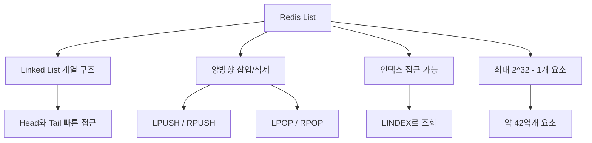

#### List 구현체는 Redis 버전에 따라 달라졌다

바로 위 다이어그램에서 List를 "Linked List 계열"로 표현했지만, Redis 내부 구현은 버전에 따라 꽤 많이 바뀌었습니다. 결론부터 정리하면 **`skiplist`는 Redis List의 구현체가 아니라 Sorted Set의 일반 인코딩**입니다. Redis List는 과거에 `ziplist`와 `linkedlist`를 크기에 따라 바꿔 사용했고, 이후 `quicklist`로 통합되었습니다.

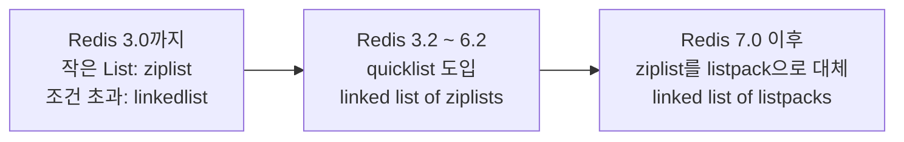

| Redis 버전      | List 인코딩                         | 크기별 전환 여부                                                        | 주요 설정                                            | 설명                                                                                                                                                                                    |
| --------------- | ----------------------------------- | ----------------------------------------------------------------------- | ---------------------------------------------------- | --------------------------------------------------------------------------------------------------------------------------------------------------------------------------------------- |
| Redis 3.0까지   | `ziplist` 또는 `linkedlist`         | 예                                                                      | `list-max-ziplist-entries`, `list-max-ziplist-value` | List가 작고 각 element가 작으면 `ziplist`를 사용했습니다. element 수나 value 크기가 임계값을 넘으면 `linkedlist`로 변환했습니다. 기본값은 보통 entries `512`, value `64 bytes`였습니다. |
| Redis 3.2 ~ 6.2 | `quicklist`                         | 전체 List 인코딩을 `ziplist`와 `linkedlist` 사이에서 바꾸는 방식이 아님 | `list-max-ziplist-size`, `list-compress-depth`       | `quicklist`가 List의 기본 구조가 되었습니다. quicklist는 여러 `ziplist` 노드를 linked list처럼 연결한 구조입니다.                                                                       |
| Redis 7.0 이후  | `quicklist`, 내부 노드는 `listpack` | 전체 List는 주로 `quicklist`; 내부 노드 크기를 조절                     | `list-max-listpack-size`, `list-compress-depth`      | `ziplist`가 더 안전하고 단순한 `listpack`으로 대체되었습니다. 즉 최신 Redis List는 개념적으로 `linked list of listpacks`에 가깝습니다.                                                  |

Redis 3.0까지의 크기 기반 전환은 다음처럼 이해할 수 있습니다.

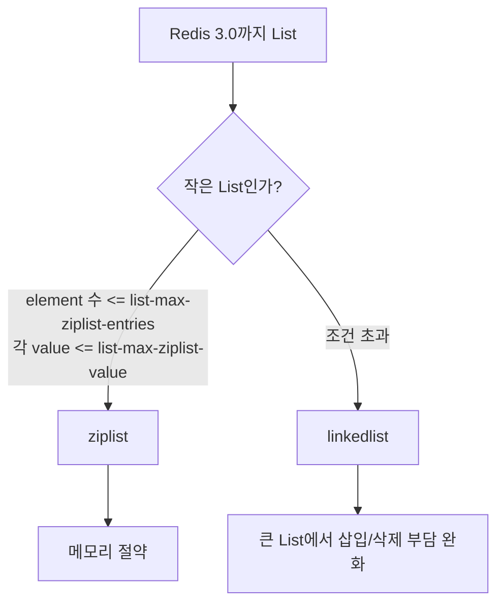

Redis 3.2 이후의 `quicklist`는 양쪽의 장점을 섞은 구조입니다.

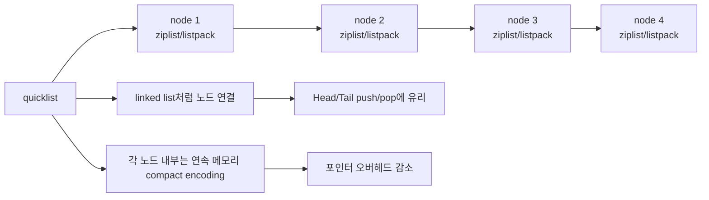

`list-max-ziplist-size` 또는 `list-max-listpack-size`는 "전체 List를 ziplist/listpack으로 만들지 말지"를 결정하는 설정이 아니라, **quicklist 내부의 각 노드가 어느 정도 크기까지 element를 담을지**를 정하는 설정입니다. 음수 값은 대략적인 byte 크기 기준이고, 양수 값은 노드당 element 개수 기준입니다. 예를 들어 Redis 설정의 기본값 `-2`는 보통 내부 노드 목표 크기를 약 8KB로 잡는 의미입니다.

#### quicklist와 listpack/ziplist의 구조적 관계

Redis의 List는 데이터가 커질 때 메모리 파편화를 줄이면서도 양 끝에서의 빠른 데이터 조작(`O(1)`)을 달성하기 위해 **`quicklist`**라는 구조를 사용합니다.

- **구조적 결합**: `quicklist`는 큰 틀에서 **이중 연결 리스트(Doubly Linked List)**로 구성되어 있으며, 연결 리스트의 각 노드는 개별 데이터가 아닌 하나의 **`listpack`** (과거 버전에서는 `ziplist`) 구조체를 담고 있습니다.
- **메모리 파편화 방지**: 일반적인 연결 리스트는 노드가 추가될 때마다 앞뒤 포인터를 위한 추가 메모리 할당 및 파편화가 발생하지만, `quicklist`는 내부 노드들을 연속된 메모리 배열 형태인 `listpack`으로 감싸 포인터 오버헤드를 대폭 줄입니다.
- **조작 효율성**: 양 끝에 요소를 추가하거나 제거할 때(`LPUSH`, `RPOP` 등)는 해당 노드의 `listpack` 내부에서 연속적인 밀기/당기기 연산만 발생하므로 메모리 재할당 비용을 줄이고 `O(1)`에 가깝게 동작합니다.

#### ziplist와 listpack의 구체적 구조적 차이점

Redis 7.0에서 `ziplist`가 `listpack`으로 완전히 대체된 이유는 기존 구조의 치명적인 문제점인 연쇄 업데이트(Cascade Update) 및 이로 인한 보안/성능 위협 때문입니다. 이 둘의 구조적 차이와 메모리 레이아웃은 다음과 같습니다.

##### 메모리 레이아웃 비교

| 구분                 | ziplist Entry 구조                              | listpack Entry 구조                                |
| :------------------- | :---------------------------------------------- | :------------------------------------------------- |
| **레이아웃**         | `[prevlen] [encoding-type/len] [data]`          | `[encoding-type] [data] [backlen]`                 |
| **역방향 탐색 정보** | **이전 엔트리의 길이**(`prevlen`)를 헤더에 기록 | **현재 엔트리의 총 길이**(`backlen`)를 꼬리에 기록 |
| **길이 정보 위치**   | 엔트리의 가장 시작 부분                         | 엔트리의 가장 끝 부분                              |

##### 연쇄 업데이트(Cascade Update)의 원인과 listpack의 해결 방식

###### 1. ziplist의 Cascade Update 원인
`ziplist`는 역방향 탐색 시 이전 엔트리로 돌아가기 위해 헤더의 `prevlen` 필드를 이용합니다.
- `prevlen`은 이전 엔트리의 크기에 따라 가변적입니다. (254바이트 미만이면 **1바이트**, 254바이트 이상이면 **5바이트** 소모)
- 만약 Entry A 바로 뒤에 Entry B, Entry C가 연속해서 배치되어 있을 때, Entry A의 크기가 253바이트에서 254바이트로 1바이트 증가하면, Entry B 헤더의 `prevlen` 크기가 1바이트에서 5바이트로 **4바이트 늘어납니다.**
- 이로 인해 Entry B의 전체 크기가 늘어나서 254바이트를 넘어가게 되면, 그 뒤에 있던 Entry C 헤더의 `prevlen` 역시 1바이트에서 5바이트로 늘어나야 합니다.
- 이처럼 한 번의 쓰기/수정으로 인해 뒤따르는 수많은 엔트리들의 메모리 크기가 연속해서 재조정되는 현상을 **연쇄 업데이트(Cascade Update)**라고 하며, 최악의 경우 **$O(N^2)$**의 메모리 복사 및 재할당 연산이 발생하여 시스템이 멈출 수 있습니다.

###### 2. listpack의 backlen을 통한 해결 방식
`listpack`은 역방향 탐색을 지원하면서도 엔트리 간 결합도를 끊기 위해 `backlen` 구조를 채택했습니다.
- **자기 완결성**: `backlen`은 오직 **현재 엔트리의 총 길이**(`encoding-type` + `data`의 총 바이트 수)만을 기록하며, 이 값은 엔트리의 가장 마지막(꼬리)에 배치됩니다.
- **독립성**: 엔트리를 뒤에서 앞으로 탐색할 때, 현재 엔트리 끝에 있는 `backlen`을 읽어 크기를 파악한 뒤 그 크기만큼 메모리 포인터를 앞으로 이동(건너뛰기)시킵니다. 이동한 곳에는 바로 이전 엔트리의 `backlen`이 위치하게 됩니다.
- **연쇄 업데이트 차단**: 특정 엔트리의 크기가 변경되면 해당 엔트리 내부의 `backlen` 값과 크기만 수정될 뿐, **이웃한 다른 엔트리의 헤더나 데이터 구조에는 아무런 영향을 주지 않습니다.** 따라서 메모리 재할당과 복사 범위가 변경된 단 하나의 엔트리로 국한되어 성능 병목이 원천 차단됩니다.

##### listpack의 내부 인코딩과 Byte-saving Prefix
listpack은 각 엔트리의 데이터 값의 크기와 종류(정수/문자열)에 따라 바이트를 극도로 아낄 수 있는 **Byte-saving Prefix** 기법을 적용하여 설계되었습니다. 엔트리는 크게 `[encoding-type] [data] [backlen]`의 구조를 갖습니다.

- **정수형 인코딩 (Integer Encoding)**:
  - **7비트 양수 정수**: 프리픽스가 `0xxxxxxx`로 시작하며, 1바이트 안에 인코딩 타입과 정수 값(0 ~ 127)을 모두 담아냅니다.
  - **13비트 부호 있는 정수**: 프리픽스가 `110xxxxx xxxxxxxx`로 시작하여, 2바이트로 부호 있는 정수를 인코딩합니다.
  - **16비트/24비트/32비트/64비트 정수**: 각각 고유한 프리픽스 바이트(`11110001` ~ `11110100`) 뒤에 2/3/4/8바이트의 데이터가 오며, 총 3 ~ 9바이트를 소모합니다.
- **문자열형 인코딩 (String Encoding)**:
  - **6비트 이하 길이 문자열**: 프리픽스가 `10xxxxxx`로 시작하며, 1바이트의 프리픽스 자체에 문자열의 실제 길이(최대 63바이트) 정보를 내포하고 바로 뒤에 실제 데이터가 배치됩니다.
  - **12비트 이하 길이 문자열**: 프리픽스가 `1110xxxx xxxxxxxx`로 시작하여 2바이트 프리픽스로 최대 4095바이트 길이의 문자열을 다룹니다.
  - **32비트 이하 길이 문자열**: `11110000` + 4바이트 길이 필드 + 실제 데이터 순서로 인코딩됩니다.
- **가변 길이 backlen**: 역방향 탐색을 지원하기 위한 `backlen` 역시 가변 길이 바이트로 저장되며, 각 바이트의 최상위 비트(MSB)를 플래그로 활용해 길이에 맞춰 1 ~ 5바이트만 소모하도록 최적화되어 있습니다.

##### List의 저장 용량 및 한계
- **최대 저장 개수**: 하나의 List key에는 최대 **$2^{32} - 1$개**(약 42억 개)의 요소를 저장할 수 있습니다.

> - Redis List에 `skiplist`가 쓰인다고 이해하면 안 됩니다. `skiplist`는 Sorted Set의 일반 인코딩입니다.
> - 오래된 Redis에서는 작은 List가 `ziplist`, 큰 List가 `linkedlist`로 바뀌는 크기 기반 전환이 있었습니다.
> - Redis 3.2 이후에는 List가 `quicklist` 중심으로 바뀌었고, Redis 7.0 이후에는 quicklist 내부 compact node가 `ziplist`에서 `listpack`으로 바뀌었습니다.
> - `OBJECT ENCODING key`로 현재 key의 내부 인코딩을 확인할 수 있지만, Redis 버전과 데이터 크기, 설정에 따라 결과가 달라질 수 있습니다.


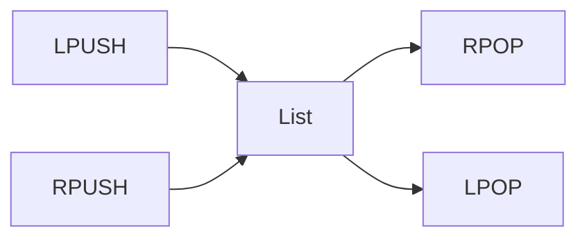

활용 방식은 두 가지로 나눌 수 있습니다.

| 패턴  | 명령 조합                              | 설명                            |
| ----- | -------------------------------------- | ------------------------------- |
| Queue | `LPUSH` + `RPOP` 또는 `RPUSH` + `LPOP` | 먼저 넣은 값을 먼저 꺼냅니다.   |
| Stack | `LPUSH` + `LPOP` 또는 `RPUSH` + `RPOP` | 나중에 넣은 값을 먼저 꺼냅니다. |

#### List 명령어 흐름

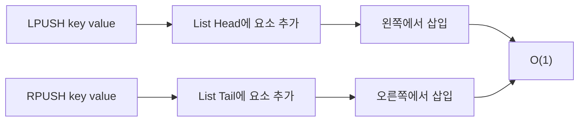

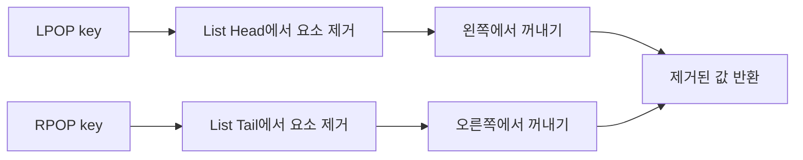

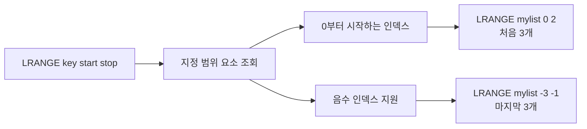

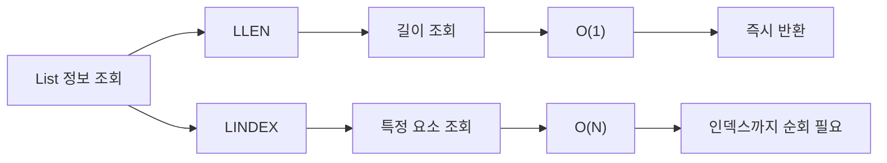

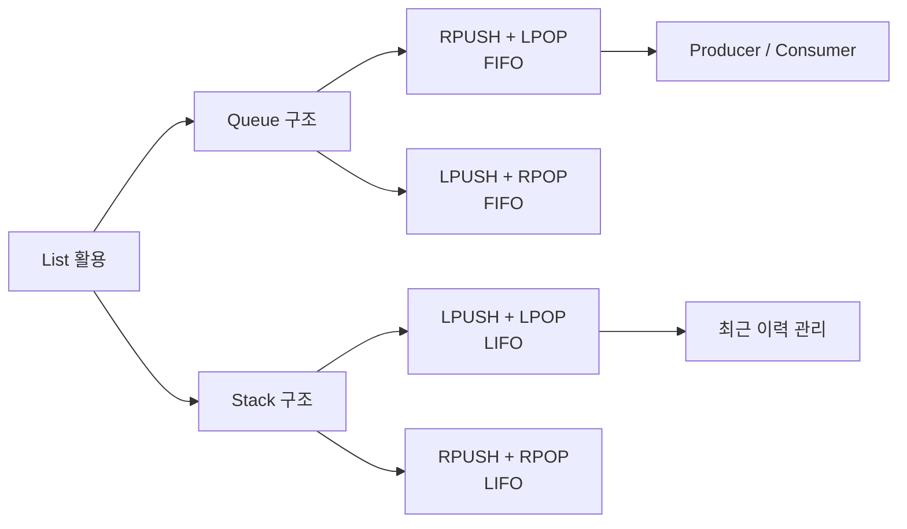

- 명령어 및 반환값 예시
```sh
LPUSH fruits "apple"      # 왼쪽에서 삽입 -> 반환값: 1 (삽입 후 리스트의 최종 길이인 1 반환)
RPUSH fruits "banana"     # 오른쪽에서 삽입 -> 반환값: 2 (삽입 후 리스트의 최종 길이인 2 반환)
LPUSH fruits "grape"      # 왼쪽에서 삽입 -> 반환값: 3 (삽입 후 리스트의 최종 길이인 3 반환)
LRANGE fruits 0 -1        # 모든 요소 조회 -> 반환값: ["grape", "apple", "banana"] (순서대로 전체 요소 반환)
LPOP fruits               # 왼쪽에서 요소 제거 -> 반환값: "grape" (제거된 요소 반환, 리스트가 비었으면 nil 반환)
RPOP fruits               # 오른쪽에서 요소 제거 -> 반환값: "banana" (제거된 요소 반환, 리스트가 비었으면 nil 반환)
LLEN fruits               # 리스트 길이 확인 -> 반환값: 1 (남아있는 요소 개수 1 반환)
```

- 실행 결과 예시


시간 복잡도는 양끝 삽입과 삭제가 `O(1)`입니다. 다만 `LRANGE fruits 0 -1`처럼 전체를 가져오는 명령은 원소 수에 비례합니다.

### Set (집합)

Set은 중복 없는 집합입니다. 순서는 보장하지 않습니다. 특정 값이 이미 존재하는지 확인하거나, 여러 집합의 교집합/합집합/차집합을 구할 때 유용합니다.

```mermaid
flowchart TD
    A["Set"] --> B["중복 제거"]
    A --> C["멤버 존재 확인"]
    A --> D["집합 연산"]
    D --> D1["SINTER"]
    D --> D2["SUNION"]
    D --> D3["SDIFF"]
```

```mermaid
flowchart TD
    A["Redis Set"] --> B["중복 없는 컬렉션"]
    A --> C["순서 없음"]
    A --> D["O(1) 멤버십 체크"]
    A --> E["집합 연산 지원"]
    B --> B1["유일한 값만 저장"]
    C --> C1["삽입 순서 보장 안 됨"]
    D --> D1["매우 빠른 검색"]
    E --> E1["SUNION / SINTER / SDIFF"]
```

#### Set 내부 구조: intset과 hashtable

Redis의 Set은 메모리 효율성과 연산 속도를 조율하기 위해 두 가지 내부 자료구조를 전환해가며 사용합니다.

| 인코딩      | 사용 조건                                                                                               | 특징                                                                                                                                                                                                                           |
| :---------- | :------------------------------------------------------------------------------------------------------ | :----------------------------------------------------------------------------------------------------------------------------------------------------------------------------------------------------------------------------- |
| `intset`    | - 모든 멤버가 64비트 이하의 **정수**<br>- 멤버의 개수가 `set-max-intset-entries` (기본값 512) 이하      | - 메모리 사용량을 최소화한 연속된 정수 배열 구조입니다.<br>- 내부적으로 정렬된 배열을 유지하므로, 멤버십 검증(`SISMEMBER`) 등에 이진 탐색(Binary Search)을 사용하여 시간 복잡도가 `O(log N)`입니다.                            |
| `hashtable` | - 정수가 아닌 **문자열** 멤버가 하나라도 추가됨<br>- 또는 멤버의 개수가 `set-max-intset-entries`를 초과 | - 내부적으로 Redis Dictionary 구조를 사용합니다 (key는 Set 멤버, value는 NULL).<br>- 멤버십 검증, 추가, 삭제가 평균 `O(1)`에 수행됩니다.<br>- 포인터와 딕셔너리 헤더 등의 오버헤드로 인해 `intset`보다 메모리 사용량이 큽니다. |

```mermaid
flowchart TD
    A["SADD myset 10 20"] --> B{"모든 멤버가 정수 &<br/>개수 <= set-max-intset-entries?"}
    B -->|"Yes"| C["intset 인코딩"]
    B -->|"No"| D["hashtable 인코딩"]

    C -->|"정수가 아닌 문자열 추가<br/>(예: SADD myset hello)"| D
    C -->|"멤버 개수가 임계값 초과"| D
```

##### 인코딩 전환 시 주의할 점
- **단방향 업그레이드**: `intset`에서 `hashtable`로 인코딩이 한 번 업그레이드되면, 요소를 삭제하여 다시 `intset` 조건(모든 멤버가 정수이고 개수가 512개 이하)을 만족하게 되더라도 자동으로 `intset`으로 다운그레이드되지 않습니다.
- **성능과 메모리의 Trade-off**: `set-max-intset-entries` 설정을 늘리면 더 많은 정수 데이터를 `intset`으로 유지하여 메모리를 아낄 수 있지만, 검색 시 `O(log N)` 연산 비용이 늘어나 CPU 사용량이 증가할 수 있습니다.

##### Set과 List의 메모리 사용량 및 저장 제한
- **메모리 사용량 비교**: Set은 중복 멤버를 방지하고 빠른 검색(`O(1)`)을 달성하기 위해 `hashtable` 인코딩을 주로 사용합니다. 이 구조는 각 엔트리마다 연결 리스트 포인터와 해시 버킷 등을 생성하여 메모리 낭비가 큽니다. 반면 List는 포인터 오버헤드가 없거나 최소화된 구조(`quicklist` 내 `listpack`)를 활용하므로, 동일 수량의 데이터를 저장할 때 **Set은 List보다 훨씬 더 많은 메모리를 사용합니다.**
- **최대 저장 개수**: 하나의 Set key에는 최대 **$2^{32} - 1$개**(약 42억 개)의 멤버를 저장할 수 있습니다.

#### Set 명령어 흐름

```mermaid
flowchart LR
    A["Set 요소 관리"] --> B["SADD"]
    A --> C["SREM"]
    B --> D["요소 추가"]
    D --> E["중복 무시<br/>유일성 보장"]
    E --> F["추가된 개수 반환"]
    C --> G["요소 제거"]
    G --> H["존재하는 요소만 제거"]
    H --> I["제거된 개수 반환"]
```

```mermaid
flowchart LR
    A["Set 조회"] --> B["SMEMBERS"]
    A --> C["SISMEMBER"]
    B --> D["모든 요소 조회"]
    D --> E["전체 요소 배열 반환"]
    E --> F["O(N)"]
    C --> G["존재 확인"]
    G --> H["1 또는 0 반환"]
    H --> I["O(1)"]
```

```mermaid
flowchart LR
    A["집합 연산"] --> B["SINTER"]
    A --> C["SUNION"]
    A --> D["SDIFF"]
    B --> B1["교집합"]
    B1 --> B2["공통 요소만"]
    B2 --> B3["AND 연산"]
    C --> C1["합집합"]
    C1 --> C2["모든 요소<br/>중복 제거"]
    C2 --> C3["OR 연산"]
    D --> D1["차집합"]
    D1 --> D2["첫 Set에만 있는 요소"]
    D2 --> D3["MINUS 연산"]
```

- 명령어 및 반환값 예시
```sh
SADD colors "red" "blue" "green"  # 값 추가 -> 반환값: 3 (새로 추가된 멤버 수인 3 반환)
SADD colors "red"                 # 이미 존재하는 값 추가 시도 -> 반환값: 0 (추가되지 않음)
SREM colors "blue"                # 값 제거 -> 반환값: 1 (실제 제거된 멤버 수인 1 반환, 없으면 0 반환)
SMEMBERS colors                   # 모든 값 조회 -> 반환값: ["red", "green"] (순서 없는 전체 멤버 배열 반환)
SISMEMBER colors "red"            # 특정 값 존재 확인 (존재함) -> 반환값: 1
SISMEMBER colors "black"          # 특정 값 존재 확인 (존재 안 함) -> 반환값: 0
SCARD colors                      # 집합 크기 확인 -> 반환값: 2
```

- 실행 결과 예시


### Sorted Set (정렬된 집합)

Sorted Set은 member마다 score를 함께 저장하고, score 기준으로 정렬하는 자료구조입니다. 랭킹, 우선순위 큐, 시간 기반 인덱스에 잘 맞습니다.

```mermaid
flowchart LR
    A["member"] --> B["score"]
    B --> C["score 기준 정렬"]
    C --> D["랭킹 조회"]
    C --> E["범위 조회"]
```

```mermaid
flowchart LR
    A["Redis Sorted Set"] --> B["점수 기반 정렬"]
    A --> C["중복 없는 요소"]
    A --> D["O(log N) 삽입/삭제"]
    A --> E["범위 조회 지원"]
    B --> B1["score로 자동 정렬"]
    C --> C1["Set의 유일성"]
    D --> D1["Skip List + Hash Table"]
    E --> E1["순위 / 랭킹 시스템"]
```

#### Sorted Set 내부 구조: ziplist/listpack과 skiplist

Sorted Set은 정렬 상태를 유지하면서 빠른 멤버 탐색과 범위 조회를 수행하기 위해 데이터 크기와 개수에 따라 두 가지 내부 자료구조를 사용합니다.

| 인코딩                    | 사용 조건                                                                                                                        | 특징                                              ㄷ                                                                                                                                                                                                                                                                                                                             |
| :------------------------ | :------------------------------------------------------------------------------------------------------------------------------- | :------------------------------------------------------------------------------------------------------------------------------------------------------------------------------------------------------------------------------------------------------------------------------------------------------------------------------------------------------------------------------- |
| `ziplist` 또는 `listpack` | - 멤버 수가 `zset-max-ziplist-entries` (기본값 128) 이하<br>- 모든 멤버의 크기가 `zset-max-ziplist-value` (기본값 64바이트) 이하 | - 메모리 사용량을 최소화하기 위한 컴팩트한 바이트 배열 구조입니다.<br>- **Redis 7.0 이상**부터는 성능과 보안성이 개선된 **`listpack`**으로 완전히 대체되었습니다.<br>- 탐색 및 조작 시간 복잡도는 `O(N)`입니다.                                                                                                                                                                  |
| `skiplist`                | - 요소 개수가 임계값(`zset-max-ziplist-entries`)을 초과<br>- 또는 요소 크기가 임계값(`zset-max-ziplist-value`)을 초과            | - **Skip List**와 **Hash Table(Dict)** 을 결합하여 사용합니다.<br>- **Skip List**: score 순으로 정렬된 링크드 리스트로, 삽입/삭제/범위 검색이 `O(log N)`에 처리됩니다.<br>- **Hash Table**: member를 key로, score를 value로 매핑하여 특정 멤버의 score 조회(`ZSCORE`)를 평균 `O(1)`에 수행합니다.<br>- 포인터가 많아 메모리 오버헤드가 크지만 대용량 데이터 정렬에 효율적입니다. |

```mermaid
flowchart TD
    A["ZADD myzset 100 member1"] --> B{"멤버 개수 <= 128 &<br/>멤버 크기 <= 64B?"}
    B -->|"Yes"| C["ziplist / listpack 인코딩"]
    B -->|"No"| D["skiplist 인코딩"]

    C -->|"임계값 초과 (개수 또는 크기)"| D
```

##### 인코딩 전환 시 주의할 점
- **단방향 업그레이드**: 타 자료구조와 마찬가지로 `ziplist/listpack`에서 `skiplist`로 업그레이드된 후에는 데이터를 삭제하여 다시 기준치 이하가 되어도 자동으로 다운그레이드되지 않습니다.
- **Skip List와 Hash Table의 병행**: `skiplist` 인코딩 시 Hash Table이 함께 쓰이는 덕분에, 정렬 연산(`O(log N)`)과 단일 멤버 score 조회(`O(1)`) 성능을 모두 얻는 대신 메모리 소모가 크다는 Trade-off가 있습니다.

##### Sorted Set의 저장 제한
- **최대 저장 개수**: 하나의 Sorted Set key에는 최대 **$2^{32} - 1$개**(약 42억 개)의 멤버를 저장할 수 있습니다.

#### Sorted Set 명령어 흐름

```mermaid
flowchart LR
    A["ZADD key score member"] --> B["요소 추가 또는 업데이트"]
    B --> C["새 요소 삽입"]
    B --> D["기존 요소 score 변경"]
    C --> E["O(log N)"]
    D --> E
    E --> F["자동 정렬 위치 조정"]
```

```mermaid
flowchart LR
    A["범위 조회"] --> B["ZRANGE"]
    A --> C["ZREVRANGE"]
    B --> B1["오름차순"]
    B1 --> B2["낮은 score부터 높은 score로"]
    C --> C1["내림차순"]
    C1 --> C2["높은 score부터 낮은 score로"]
    B2 --> D["O(log N + M)"]
    C2 --> D
```

```mermaid
flowchart LR
    A["순위 조회"] --> B["ZRANK"]
    A --> C["ZREVRANK"]
    B --> B1["오름차순 순위"]
    B1 --> B2["낮은 score 0부터 시작"]
    C --> C1["내림차순 순위"]
    C1 --> C2["높은 score 0부터 시작"]
    B2 --> D["O(log N)"]
    C2 --> D
```

```mermaid
flowchart LR
    A["ZINCRBY key increment member"] --> B["score 증가"]
    B --> C["양수/음수 모두 가능"]
    C --> D["증가 또는 감소"]
    B --> E["원자적 연산"]
    E --> F["Race Condition 방지"]
```

```mermaid
flowchart LR
    A["ZREM key member"] --> B["지정 요소 삭제"]
    B --> C["여러 요소 동시 삭제 가능"]
    C --> D["O(M * log N)"]
    B --> E["삭제된 개수 반환"]
    E --> F["존재하는 요소만 카운트"]
```

- 명령어 및 반환값 예시
```sh
ZADD rankings 100 "A"            # A 점수 100 추가 -> 반환값: 1 (새로 추가된 멤버 수인 1 반환)
ZADD rankings 150 "A"            # 이미 존재하는 A의 score 업데이트 -> 반환값: 0 (추가되지 않고 점수만 갱신됨)
ZRANGE rankings 0 -1             # 점수 낮은 순 조회 -> 반환값: ["A", "B"]
ZRANGE rankings 0 -1 WITHSCORES  # 점수와 함께 조회 -> 반환값: ["A", "150", "B", "200"]
ZREM rankings "A"                # 특정 값 삭제 -> 반환값: 1 (실제 삭제된 멤버 수인 1 반환, 없으면 0 반환)
ZCARD rankings                   # 요소 개수 확인 -> 반환값: 1
ZRANK rankings "B"               # 요소 index 반환 (오름차순 0부터 시작) -> 반환값: 0 (B가 0번째 인덱스이므로 0 반환)
ZPOPMIN rankings 1               # 1개만큼 요소 조회 및 삭제 -> 반환값: ["B", "200"] (가장 점수가 낮은 1개 반환 후 삭제)
```

- 실행 결과 예시


대표 복잡도는 `ZADD`가 `O(log N)`, score 범위 조회가 `O(log N + M)`입니다. `M`은 반환되는 원소 수입니다.

### Hash (해시)

Hash는 하나의 Redis key 아래에 여러 field-value를 저장하는 자료구조입니다. 하나의 Hash key에는 최대 **$2^{32} - 1$개**(약 42억 개)의 field-value 쌍을 저장할 수 있습니다. 객체 하나를 Redis에 저장할 때 `String`에 JSON 전체를 넣는 방식과 `Hash`로 field를 나누는 방식 중 선택할 수 있습니다.

```mermaid
flowchart LR
    A["user:1"] --> B["name = kim"]
    A --> C["age = 30"]
    A --> D["role = admin"]
```

```mermaid
flowchart LR
    A["Redis Hash"] --> B["Field-Value 쌍 저장"]
    A --> C["객체 표현에 최적화"]
    A --> D["메모리 효율적"]
    A --> E["부분 업데이트 가능"]
    B --> B1["Key 내부의 Key-Value"]
    C --> C1["사용자 정보 / 상품 정보"]
    D --> D1["압축 인코딩 지원"]
    E --> E1["필드별 개별 접근"]
```

| 방식               | 장점                                          | 단점                                                              |
| ------------------ | --------------------------------------------- | ----------------------------------------------------------------- |
| String에 JSON 저장 | 애플리케이션 객체 그대로 직렬화하기 쉽습니다. | 특정 field만 변경해도 전체 JSON을 다시 써야 합니다.               |
| Hash 사용          | field 단위 조회/수정이 쉽습니다.              | 객체 구조가 복잡하거나 중첩이 많으면 관리가 번거로울 수 있습니다. |

#### Hash 내부 구조: listpack과 hashtable

Redis의 Hash는 내부에 저장된 field-value 쌍의 개수와 크기에 따라 최적의 성능을 낼 수 있도록 내부 인코딩을 자동으로 전환합니다.

| 인코딩      | 사용 조건                                                                                                                                                          | 특징                                                                                                                                                                                                                                                                                                            |
| :---------- | :----------------------------------------------------------------------------------------------------------------------------------------------------------------- | :-------------------------------------------------------------------------------------------------------------------------------------------------------------------------------------------------------------------------------------------------------------------------------------------------------------- |
| `listpack`  | - field-value 쌍의 개수가 `hash-max-listpack-entries` (기본값 512) 이하<br>- 모든 field명과 value의 바이트 크기가 `hash-max-listpack-value` (기본값 64바이트) 이하 | - **Redis 7.2 이상**부터 기존 `ziplist`를 대체하여 기본 compact 인코딩으로 적용되었습니다.<br>- 메모리에 `[field1, value1, field2, value2, ...]` 형태로 연속해서 저장됩니다.<br>- 특정 field를 조회/수정하려면 선형 검색(Linear Search)을 해야 하므로 크기가 작을 때만 메모리 및 연산 속도 면에서 효율적입니다. |
| `hashtable` | - field-value 쌍의 개수가 임계값을 초과<br>- 또는 개별 field/value 크기가 임계값을 초과                                                                            | - 내부적으로 Redis의 dict(딕셔너리) 구조를 사용하여 각 field와 value를 매핑합니다.<br>- field 검색, 추가, 삭제가 평균 `O(1)`에 수행됩니다.<br>- 포인터 구조 등으로 인해 `listpack`에 비해 메모리 오버헤드가 더 큽니다.                                                                                          |

```mermaid
flowchart TD
    A["HSET myhash field value"] --> B{"쌍의 개수 <= 512 &<br/>각 크기 <= 64B?"}
    B -->|"Yes"| C["listpack 인코딩"]
    B -->|"No"| D["hashtable 인코딩"]

    C -->|"임계값 초과"| D
```

##### 인코딩 전환 시 주의할 점
- **단방향 업그레이드**: 데이터가 많이 삭제되어 다시 기준치 이하가 되더라도 자동으로 `hashtable`에서 `listpack`으로 다운그레이드되지 않습니다.
- **설정 옵션 변화**: Redis 7.2 이전 버전에서는 `hash-max-ziplist-entries` 및 `hash-max-ziplist-value`였던 설정명이 Redis 7.2 이상부터 각각 `hash-max-listpack-entries` 및 `hash-max-listpack-value`로 변경되었습니다.

#### Hash 명령어 흐름

```mermaid
flowchart LR
    A["Hash 기본 명령어"] --> B["HSET"]
    A --> C["HGET"]
    B --> D["필드 설정"]
    D --> E["단일/다중 필드 설정"]
    E --> F["O(1) per field"]
    C --> G["필드 조회"]
    G --> H["단일 필드 값 반환"]
    H --> F
```

```mermaid
flowchart LR
    A["다중 필드 작업"] --> B["HMSET"]
    A --> C["HMGET"]
    B --> D["여러 필드 설정"]
    D --> E["HSET으로 대체됨"]
    E --> F["하위 호환성 유지"]
    C --> G["여러 필드 조회"]
    G --> H["배열로 값 반환"]
    H --> I["필드 순서 보존"]
```

```mermaid
flowchart LR
    A["필드 증가 명령어"] --> B["HINCRBY"]
    A --> C["HINCRBYFLOAT"]
    B --> D["정수 증가"]
    D --> E["64비트 정수 범위"]
    C --> F["실수 증가"]
    F --> G["배정밀도 부동소수점"]
    E --> H["원자적 연산"]
    G --> H
```

```mermaid
flowchart LR
    A["Hash 정보 조회"] --> B["HEXISTS"]
    A --> C["HKEYS"]
    A --> D["HVALS"]
    B --> E["필드 존재 확인"]
    E --> F["O(1)"]
    F --> G["빠른 체크"]
    C --> H["모든 필드명"]
    D --> I["모든 값"]
    H --> J["O(N)"]
    I --> J
    J --> K["큰 Hash 주의"]
```

- 명령어 및 반환값 예시
```sh
HSET user:1 name "gil dong"     # 필드(name) 설정 -> 반환값: 1 (새로운 필드가 추가되었으므로 1 반환)
HSET user:1 name "hong"         # 이미 존재하는 필드의 값 갱신 -> 반환값: 0 (기존 값을 덮어썼으나 새 필드가 아니므로 0 반환)
HGET user:1 name                # 특정 필드 값 가져오기 -> 반환값: "hong" (필드가 없으면 nil 반환)
HGETALL user:1                  # 모든 필드와 값 가져오기 -> 반환값: ["name", "hong", "age", "30"]
HDEL user:1 age                 # 특정 필드 삭제 -> 반환값: 1 (실제 삭제된 필드 수인 1 반환, 없으면 0 반환)
HEXISTS user:1 name             # 필드 존재 확인 (존재함) -> 반환값: 1
HEXISTS user:1 age              # 필드 존재 확인 (존재 안 함) -> 반환값: 0
HLEN user:1                     # 필드 개수 확인 -> 반환값: 1
```

- 실행 결과 예시


#### Redis 7.4 Hash Field Expiration

> [!NOTE]
> Redis 7.4 이상 버전에서 추가된 Hash 필드의 만료 시간(Expiration) 설정 등 최신 기능(HEXPIRE, HSETEX 등)에 대한 자세한 동작 원리와 우회 방법, Spring Data Redis 연동 및 실무 고려사항은 [이글]()을 참고하시기 바랍니다.

Redis 7.4부터는 Hash 전체 key가 아니라 **Hash 내부 field 단위로 TTL을 설정**할 수 있습니다. 이전에는 `EXPIRE user:1 60`처럼 Hash key 전체에만 TTL을 걸 수 있었기 때문에, field마다 만료 시간이 달라야 하는 세션, 이벤트, 인증 상태를 표현하려면 별도 key로 분리하거나 애플리케이션이 직접 만료 메타데이터를 관리해야 했습니다.

```mermaid
flowchart TD
    A["Hash field별 TTL 필요"] --> B{"Redis 버전"}
    B -->|"Redis 7.4 이전"| C["우회 전략 필요"]
    C --> C1["field를 별도 key로 분리"]
    C --> C2["Hash + ZSet expireAt 인덱스"]
    C --> C3["애플리케이션 스케줄러로 HDEL"]

    B -->|"Redis 7.4 이후"| D["Hash Field Expiration"]
    D --> D1["HEXPIRE / HPEXPIRE"]
    D --> D2["HTTL / HPTTL"]
    D --> D3["HPERSIST"]
```

대표 명령은 다음과 같습니다.

| 명령어         | Redis 버전 | 설명                                                | 시간 복잡도               |
| -------------- | ---------- | --------------------------------------------------- | ------------------------- |
| `HEXPIRE`      | 7.4+       | field TTL을 초 단위로 설정                          | `O(N)`, N은 지정 field 수 |
| `HPEXPIRE`     | 7.4+       | field TTL을 밀리초 단위로 설정                      | `O(N)`                    |
| `HEXPIREAT`    | 7.4+       | field 만료 시각을 Unix timestamp 초 단위로 설정     | `O(N)`                    |
| `HPEXPIREAT`   | 7.4+       | field 만료 시각을 Unix timestamp 밀리초 단위로 설정 | `O(N)`                    |
| `HTTL`         | 7.4+       | field TTL을 초 단위로 조회                          | `O(N)`                    |
| `HPTTL`        | 7.4+       | field TTL을 밀리초 단위로 조회                      | `O(N)`                    |
| `HEXPIRETIME`  | 7.4+       | field 만료 시각을 초 단위 timestamp로 조회          | `O(N)`                    |
| `HPEXPIRETIME` | 7.4+       | field 만료 시각을 밀리초 단위 timestamp로 조회      | `O(N)`                    |
| `HPERSIST`     | 7.4+       | field TTL 제거                                      | `O(N)`                    |

예를 들어 활성 세션을 하나의 Hash에 모으되, 각 session field마다 TTL을 다르게 줄 수 있습니다.

```sh
HSET active:sessions session:1 "{userId:100}" session:2 "{userId:200}"
HEXPIRE active:sessions 1800 FIELDS 1 session:1
HEXPIRE active:sessions 600 FIELDS 1 session:2
HTTL active:sessions FIELDS 2 session:1 session:2
```

반환값은 field별 배열로 내려옵니다. 설정 계열 명령에서는 `1`이 TTL 설정 성공, `0`이 조건 불만족, `2`가 즉시 삭제, `-2`가 key 또는 field 없음입니다. 조회 계열인 `HTTL`, `HPTTL`에서는 양수가 남은 TTL, `-1`이 field는 있지만 TTL 없음, `-2`가 field 없음입니다.

```mermaid
sequenceDiagram
    autonumber
    participant App as 애플리케이션
    participant Redis as Redis 7.4+

    App->>Redis: HSET active:sessions session:1 payload
    Redis-->>App: 1
    App->>Redis: HEXPIRE active:sessions 1800 FIELDS 1 session:1
    Redis-->>App: [1]
    App->>Redis: HTTL active:sessions FIELDS 1 session:1
    Redis-->>App: [남은 TTL]
    Redis-->>Redis: TTL 만료 시 session:1 field 자동 삭제
```

조건 옵션도 `EXPIRE` 계열과 비슷하게 제공합니다.

| 옵션 | 의미                                    |
| ---- | --------------------------------------- |
| `NX` | TTL이 없는 field에만 만료 설정          |
| `XX` | 이미 TTL이 있는 field에만 만료 갱신     |
| `GT` | 기존 TTL보다 새 TTL이 더 클 때만 갱신   |
| `LT` | 기존 TTL보다 새 TTL이 더 작을 때만 갱신 |

Hash Field Expiration은 다음 use case에 잘 맞습니다.

| Use case              | 예시 key/field                              | 이유                                                       |
| --------------------- | ------------------------------------------- | ---------------------------------------------------------- |
| 활성 세션 추적        | `active:sessions` / `session:{id}`          | `HLEN`으로 활성 세션 수를 세면서 session field는 자동 만료 |
| 시간 창 이벤트 카운터 | `fraud:user:100` / `2026-05-22T10`          | 시간대별 counter field를 일정 기간 뒤 자동 제거            |
| 기기별 상태 캐시      | `user:100:devices` / `device:{id}`          | 사용자별 묶음은 유지하고 기기 상태만 개별 만료             |
| 일회성 인증 상태      | `verify:email:{userId}` / `code`, `attempt` | code와 시도 횟수의 TTL을 field 단위로 관리                 |

```sh
docker run --rm --name redis-hfe-lab -d redis:7.4
docker exec -it redis-hfe-lab redis-cli
```

Redis 7.4 이상 컨테이너에서는 다음처럼 field TTL을 직접 확인할 수 있습니다.

```sh
HSET active:sessions session:1 "{userId:100}" session:2 "{userId:200}"
HEXPIRE active:sessions 30 FIELDS 1 session:1
HTTL active:sessions FIELDS 2 session:1 session:2
HPERSIST active:sessions FIELDS 1 session:1
HTTL active:sessions FIELDS 2 session:1 session:2
```

예상 흐름은 다음과 같습니다.

```text
HSET                                      -> 2
HEXPIRE session:1                        -> [1]
HTTL session:1 session:2                 -> [30에 가까운 양수, -1]
HPERSIST session:1                       -> [1]
다시 HTTL session:1 session:2            -> [-1, -1]
```

> - 샘플 프로젝트의 Redis 컨테이너는 `redis:7.2.4`이므로 `HEXPIRE`는 사용할 수 없습니다. 실습하려면 Redis 7.4 이상 컨테이너를 별도로 띄우거나 docker-compose 이미지를 7.4 이상으로 바꿔야 합니다.
> - `HSET`처럼 field 값을 삭제하거나 덮어쓰는 명령은 해당 field의 기존 TTL을 제거할 수 있습니다. 값을 갱신한 뒤에도 TTL이 필요하면 다시 `HEXPIRE`를 호출해야 합니다.
> - `HINCRBY`처럼 값을 개념적으로 변경하지만 field를 새 값으로 덮어쓰지 않는 연산은 TTL을 유지하는 동작으로 이해하면 됩니다.
> - Redis 7.4의 `HSET` + `HEXPIRE`는 두 명령입니다. 값 저장과 TTL 설정 사이의 실패 구간이 치명적이면 Redis 8.0의 `HSETEX` 또는 Lua script, transaction을 검토해야 합니다.

대안도 함께 비교해보면 선택 기준이 선명해집니다.

| 방식                     | 장점                                              | 단점                                                             |
| ------------------------ | ------------------------------------------------- | ---------------------------------------------------------------- |
| Redis 7.4+ `HEXPIRE`     | Hash 구조를 유지하면서 field별 TTL을 Redis가 관리 | Redis 7.4 이상 필요, 값 저장과 TTL 설정이 두 명령일 수 있음      |
| field를 별도 key로 분리  | 기존 `SET EX`, `EXPIRE`를 그대로 사용 가능        | 논리적 그룹이 흩어지고 전체 field 목록/개수 조회가 번거로움      |
| Hash + ZSet expire index | Redis 7.4 이전에도 Hash 구조 유지 가능            | 스케줄러, 정리 실패, Hash와 ZSet 정합성 관리가 애플리케이션 책임 |
| Redis 8.0+ `HSETEX`      | field 값 저장과 TTL 설정을 단일 명령으로 처리     | Redis 8.0 이상과 클라이언트 지원 여부 확인 필요                  |

#### Redis 8.0 HSETEX, HGETEX, HGETDEL

Redis 8.0은 Redis 7.4의 Hash Field Expiration을 한 단계 더 쓰기 쉽게 만드는 명령을 추가했습니다. 핵심은 자주 함께 쓰는 Hash 작업을 하나의 Redis 명령으로 묶는 것입니다.

```mermaid
flowchart TD
    A["Redis 7.4 Hash Field Expiration"] --> B["HSET + HEXPIRE"]
    A --> C["HGET + HEXPIRE"]
    A --> D["HGET + HDEL"]

    E["Redis 8.0 Hash 편의 명령"] --> F["HSETEX<br/>저장 + TTL 설정"]
    E --> G["HGETEX<br/>조회 + TTL 갱신/제거"]
    E --> H["HGETDEL<br/>조회 + 삭제"]

    B --> F
    C --> G
    D --> H
```

| 명령어    | Redis 버전 | 문법 요약                                 | 설명                                                         | 시간 복잡도               |
| --------- | ---------- | ----------------------------------------- | ------------------------------------------------------------ | ------------------------- |
| `HSETEX`  | 8.0+       | `HSETEX key ... FIELDS n field value ...` | Hash field 값을 저장하면서 TTL도 함께 설정하거나 유지합니다. | `O(N)`, N은 설정 field 수 |
| `HGETEX`  | 8.0+       | `HGETEX key ... FIELDS n field ...`       | Hash field 값을 조회하면서 TTL을 새로 설정하거나 제거합니다. | `O(N)`, N은 조회 field 수 |
| `HGETDEL` | 8.0+       | `HGETDEL key FIELDS n field ...`          | Hash field 값을 반환한 뒤 해당 field를 삭제합니다.           | `O(N)`, N은 지정 field 수 |

`HSETEX`는 "값 저장"과 "field TTL 설정"을 하나의 명령으로 처리합니다. Redis 7.4의 `HSET` + `HEXPIRE` 사이에 생길 수 있는 실패 구간을 줄일 수 있어 세션, 인증 코드, 임시 상태 저장에 유용합니다.

```sh
HSETEX active:sessions EX 1800 FIELDS 1 session:1 "{userId:100}"
HTTL active:sessions FIELDS 1 session:1
HGET active:sessions session:1
```

조건 옵션도 제공합니다.

| 옵션           | 의미                                          |
| -------------- | --------------------------------------------- |
| `FNX`          | 지정한 field가 하나도 존재하지 않을 때만 저장 |
| `FXX`          | 지정한 field가 모두 이미 존재할 때만 저장     |
| `EX`, `PX`     | 초 또는 밀리초 단위 TTL 설정                  |
| `EXAT`, `PXAT` | Unix timestamp 기준 만료 시각 설정            |
| `KEEPTTL`      | 기존 field TTL 유지                           |

예를 들어 일회성 이메일 인증 코드를 저장할 때는 다음처럼 사용할 수 있습니다.

```sh
HSETEX verify:email:100 EX 300 FIELDS 2 code "123456" attempt "0"
HTTL verify:email:100 FIELDS 2 code attempt
```

`HGETEX`는 "조회하면서 TTL을 갱신"해야 하는 sliding session에 잘 맞습니다. 사용자가 세션을 읽을 때마다 만료 시간을 다시 30분으로 연장할 수 있습니다.

```sh
HGETEX active:sessions EX 1800 FIELDS 1 session:1
HTTL active:sessions FIELDS 1 session:1
```

반대로 조회하면서 TTL을 제거하고 영구 field로 바꾸고 싶다면 `PERSIST`를 사용합니다.

```sh
HGETEX active:sessions PERSIST FIELDS 1 session:1
HTTL active:sessions FIELDS 1 session:1
```

`HGETDEL`은 "읽고 지우기"를 하나의 명령으로 처리합니다. 인증 코드, 초대 토큰, nonce처럼 한 번 읽으면 사라져야 하는 값에 잘 맞습니다.

```sh
HSETEX verify:email:100 EX 300 FIELDS 1 code "123456"
HGETDEL verify:email:100 FIELDS 1 code
HGET verify:email:100 code
```

예상 흐름은 다음과 같습니다.

```text
HSETEX verify:email:100 ...     -> 1
HGETDEL ... code                -> ["123456"]
HGET ... code                   -> nil
```

실습은 Redis 8.0 이상 컨테이너에서 확인할 수 있습니다.

```sh
docker run --rm --name redis-hash-8-lab -d redis:8.0
docker exec -it redis-hash-8-lab redis-cli
```

Redis CLI에서 다음 명령을 실행합니다.

```sh
FLUSHDB

HSETEX active:sessions EX 1800 FIELDS 1 session:1 "{userId:100}"
HGETEX active:sessions EX 1800 FIELDS 1 session:1
HTTL active:sessions FIELDS 1 session:1

HSETEX verify:email:100 EX 300 FIELDS 1 code "123456"
HGETDEL verify:email:100 FIELDS 1 code
HGET verify:email:100 code
```

```mermaid
sequenceDiagram
    autonumber
    participant App as 애플리케이션
    participant Redis as Redis 8.0+

    App->>Redis: HSETEX active:sessions EX 1800 FIELDS 1 session:1 payload
    Redis-->>App: 1
    App->>Redis: HGETEX active:sessions EX 1800 FIELDS 1 session:1
    Redis-->>App: [payload], TTL 갱신
    App->>Redis: HGETDEL verify:email:100 FIELDS 1 code
    Redis-->>App: [code], field 삭제
```

세 명령의 반환값은 다음처럼 이해하면 됩니다.

| 명령어    | 반환값                                                                                       |
| --------- | -------------------------------------------------------------------------------------------- |
| `HSETEX`  | 모든 field가 저장되면 `1`, `FNX`/`FXX` 조건이 맞지 않아 저장되지 않으면 `0`                  |
| `HGETEX`  | 요청한 field 순서대로 value 배열 반환, 없는 field는 `nil`                                    |
| `HGETDEL` | 삭제한 field의 value 배열 반환, 없는 field는 `nil`; 삭제 후 Hash가 비면 key도 제거될 수 있음 |

Redis 8.0 명령을 use case 기준으로 고르면 다음처럼 정리할 수 있습니다.

| Use case                              | 추천 명령                 | 이유                                                 |
| ------------------------------------- | ------------------------- | ---------------------------------------------------- |
| 세션 저장과 TTL 설정을 항상 함께 처리 | `HSETEX`                  | `HSET`과 `HEXPIRE` 사이의 실패 구간을 줄임           |
| 세션 조회 시 만료 시간 연장           | `HGETEX EX seconds`       | `HGET`과 `HEXPIRE`를 한 번에 처리                    |
| field를 영구 값으로 전환              | `HGETEX PERSIST`          | 값을 읽으면서 field TTL 제거                         |
| 일회성 인증 코드 소비                 | `HGETDEL`                 | 값을 반환하면서 즉시 삭제                            |
| 여러 field를 같은 TTL로 저장          | `HSETEX ... FIELDS n ...` | 여러 field-value 쌍을 한 번에 저장하고 같은 TTL 적용 |

> - Redis 8.0 명령은 Redis 서버뿐 아니라 클라이언트 라이브러리 지원도 확인해야 합니다. 클라이언트가 고수준 API를 제공하지 않으면 raw command 또는 낮은 수준 connection API를 사용해야 할 수 있습니다.
> - `HSETEX`의 `EX`, `PX`, `EXAT`, `PXAT`, `KEEPTTL`은 서로 함께 사용할 수 없습니다.
> - `HSETEX`의 `FNX`와 `FXX`는 field 존재 조건을 걸기 위한 옵션입니다. 단순히 "일부만 새로 저장"하는 옵션이 아니라 지정 field 묶음 전체의 조건으로 이해해야 합니다.
> - `HGETDEL`은 값을 읽은 뒤 field를 삭제하므로 감사 로그나 재처리가 필요한 데이터에는 맞지 않을 수 있습니다.

대안은 다음과 같습니다.

| 방식                                    | 장점                                                      | 단점                                                               |
| --------------------------------------- | --------------------------------------------------------- | ------------------------------------------------------------------ |
| Redis 8.0 `HSETEX`, `HGETEX`, `HGETDEL` | 단일 명령으로 흔한 Hash TTL 패턴을 단순화                 | Redis 8.0 이상 필요, 클라이언트 지원 확인 필요                     |
| Redis 7.4 `HSET` + `HEXPIRE`            | Redis 7.4에서도 field TTL 사용 가능                       | 두 명령 사이 실패 구간이 있음                                      |
| Lua script                              | Redis 7.4 이전 또는 복잡한 조건도 원자적으로 묶을 수 있음 | script 관리와 테스트가 필요하고 오래 실행되면 Redis를 막을 수 있음 |
| 별도 String key + `SET EX` / `GETDEL`   | 가장 단순하고 오래된 Redis에서도 쓰기 쉬움                | Hash로 묶어 관리하는 장점을 잃음                                   |

#### Spring Data Redis와 Lettuce 지원 버전

Hash Field Expiration을 Spring 애플리케이션에서 사용할 때는 Redis 서버 버전만 보면 부족합니다. 실제로는 **Redis Server**, **Java Redis client(Lettuce)**, **Spring Data Redis 추상화**, **Spring Boot BOM**을 함께 확인해야 합니다.

```mermaid
flowchart LR
    A["애플리케이션 코드"] --> B["Spring Data Redis"]
    B --> C["Lettuce"]
    C --> D["Redis Server"]

    B --> B1["HashOperations API 제공 여부"]
    C --> C1["명령 전송 지원 여부"]
    D --> D1["명령 자체 지원 여부"]
```

| 목표                                          | Redis Server | Lettuce                              | Spring Data Redis                              | Spring Boot 기준       | 사용 가능한 API/명령                                                                                                              |
| --------------------------------------------- | ------------ | ------------------------------------ | ---------------------------------------------- | ---------------------- | --------------------------------------------------------------------------------------------------------------------------------- |
| Hash field TTL 설정/조회/해제                 | Redis 7.4+   | Lettuce 6.4+                         | Spring Data Redis 3.5+                         | Spring Boot 3.5.x 계열 | `HEXPIRE`, `HPEXPIRE`, `HTTL`, `HPTTL`, `HPERSIST`; `HashOperations.expire`, `expireAt`, `persist`, `getTimeToLive`, `expiration` |
| Hash 저장 + TTL, 조회 + TTL 갱신, 조회 + 삭제 | Redis 8.0+   | Lettuce 6.6+                         | Spring Data Redis 4.0+                         | Spring Boot 4.0.x 계열 | `HSETEX`, `HGETEX`, `HGETDEL`; `HashOperations.putAndExpire`, `getAndExpire`, `getAndDelete`                                      |
| Spring Data Redis 3.5에서 Redis 8 명령 사용   | Redis 8.0+   | Lettuce 6.6+                         | Spring Data Redis 3.5.x                        | Spring Boot 3.5.x 계열 | 고수준 `HashOperations` 메서드는 부족할 수 있으므로 low-level connection, raw command, Lua script 등을 검토                       |
| 이 글의 샘플 프로젝트 기본 조합               | Redis 7.2.4  | Spring Boot 3.4.4가 관리하는 Lettuce | Spring Boot 3.4.4가 관리하는 Spring Data Redis | Spring Boot 3.4.4      | `HEXPIRE`, `HSETEX` 실습 불가. Redis 서버와 Spring 계열 버전을 올려야 함                                                          |

정리하면, Redis 7.4의 Hash Field Expiration은 Spring Data Redis 3.5부터 고수준 API로 다루기 좋아졌고, Redis 8.0의 `HSETEX`, `HGETEX`, `HGETDEL`은 Spring Data Redis 4.0부터 `putAndExpire`, `getAndExpire`, `getAndDelete`로 자연스럽게 연결됩니다.

```java
// Spring Data Redis 3.5+ / Redis 7.4+
hashOperations.expire(
        "active:sessions",
        Duration.ofMinutes(30),
        List.of("session:1")
);

hashOperations.getTimeToLive(
        "active:sessions",
        List.of("session:1")
);
```

```java
// Spring Data Redis 4.0+ / Redis 8.0+
hashOperations.putAndExpire(
        "active:sessions",
        Map.of("session:1", "{userId:100}"),
        RedisHashCommands.HashFieldSetOption.upsert(),
        Expiration.from(Duration.ofMinutes(30))
);

hashOperations.getAndExpire(
        "active:sessions",
        Expiration.from(Duration.ofMinutes(30)),
        List.of("session:1")
);

hashOperations.getAndDelete(
        "verify:email:100",
        List.of("code")
);
```

Spring Boot를 사용한다면 starter 버전만 올리는 것이 아니라, 실제로 어떤 Spring Data Redis와 Lettuce 버전이 관리되는지도 확인해야 합니다.

```sh
./gradlew dependencyInsight --dependency spring-data-redis --configuration runtimeClasspath
./gradlew dependencyInsight --dependency lettuce-core --configuration runtimeClasspath
```

Maven이라면 다음처럼 확인할 수 있습니다.

```sh
./mvnw dependency:tree -Dincludes=org.springframework.data:spring-data-redis,io.lettuce:lettuce-core
```

> - Lettuce가 명령을 지원해도 Spring Data Redis 고수준 API가 아직 없을 수 있습니다. 이 경우 low-level connection으로 raw command를 보내는 우회가 필요합니다.
> - Spring Data Redis 고수준 API가 있어도 Redis 서버가 7.4 또는 8.0 미만이면 명령은 실패합니다.
> - Spring Boot BOM이 관리하는 버전은 패치 릴리스마다 바뀔 수 있으므로, 운영 프로젝트에서는 문서의 표를 그대로 믿기보다 실제 dependency tree를 확인하는 편이 안전합니다.
> - 샘플 프로젝트의 현재 `redis:7.2.4`는 Set `listpack` 실습에는 좋지만 Hash Field Expiration 실습에는 낮은 버전입니다.

## 자료구조 선택 기준

Redis를 잘 쓰려면 "어떤 명령을 쓸 수 있는가"보다 "이 데이터의 접근 패턴이 무엇인가"를 먼저 봐야 합니다.

```mermaid
flowchart TD
    A["저장하려는 데이터"] --> B{"단일 값인가?"}
    B -->|"예"| S["String"]
    B -->|"아니오"| C{"field가 있는 객체인가?"}
    C -->|"예"| H["Hash"]
    C -->|"아니오"| D{"순서가 중요한가?"}
    D -->|"삽입 순서"| L["List 또는 Stream"]
    D -->|"점수 순서"| Z["Sorted Set"]
    D -->|"순서 불필요"| E{"중복 제거가 필요한가?"}
    E -->|"예"| Set["Set"]
    E -->|"아니오"| S2["String JSON 또는 Hash 재검토"]
```

| 요구사항                        | 추천 자료구조 | 이유                                           |
| ------------------------------- | ------------- | ---------------------------------------------- |
| 단일 설정값, 토큰, JSON 캐시    | `String`      | 가장 단순하고 TTL 설정이 쉽습니다.             |
| 사용자 객체의 일부 field만 수정 | `Hash`        | field 단위 접근이 가능합니다.                  |
| 조회수, 좋아요 수               | `String`      | `INCR`, `DECR`가 원자적입니다.                 |
| 최근 본 상품 목록               | `List`        | 순서 유지와 양끝 push/pop이 쉽습니다.          |
| 유니크 방문자                   | `Set`         | 중복 제거와 존재 확인이 빠릅니다.              |
| 인기 게시글 랭킹                | `Sorted Set`  | score 기준 정렬과 순위 조회가 편합니다.        |
| 주문 이벤트 처리                | `Stream`      | 메시지 보관, consumer group, ACK를 지원합니다. |

지금까지 Redis가 제공하는 자료구조의 특성과 선택 기준을 살펴보았습니다. 이어서 Redis가 인메모리 데이터를 디스크에 어떻게 보관하는지, 메시지를 어떻게 전달하고 분산 환경을 어떻게 구성하는지 같은 기본 운영 기능을 다룹니다.

## Redis 데이터 영속화(Persistence): RDB와 AOF

Redis는 기본적으로 인메모리 저장소이지만, 프로세스 재시작이나 장애 상황 시 데이터 유실을 방지하고 상태를 복구할 수 있도록 디스크 영속화(Persistence) 모델을 지원합니다. 대표적으로 **RDB(Redis Database)**와 **AOF(Append Only File)** 두 가지 방식을 단독 혹은 하이브리드로 결합하여 사용합니다.

```mermaid
flowchart TD
    A["Redis 영속화"] --> B["RDB (Snapshotting)"]
    A --> C["AOF (Append Only File)"]
    A --> D["하이브리드 (RDB + AOF)"]

    B --> B1["특정 시점 메모리 스냅샷 저장"]
    B --> B2["dump.rdb 바이너리 파일"]
    B --> B3["SAVE (동기) / BGSAVE (비동기)"]

    C --> C1["모든 쓰기 명령 로깅"]
    C --> C2["appendonly.aof 텍스트 파일"]
    C --> C3["fsync 주기 제어 (always/everysec/no)"]

    D --> D1["AOF rewrite 시 헤더에 RDB 탑재"]
    D --> D2["두 방식의 장점 결합"]
```

### Redis 서버 기동 시 데이터 복구 흐름 및 우선순위
Redis 서버가 재시작되거나 구동될 때, 디스크의 영속성 파일을 찾아 메모리에 적재하는 복구 프로세스는 다음과 같은 흐름과 우선순위 규칙을 따릅니다.

1. **영속성 설정 존재 여부 확인**:
   - RDB와 AOF 설정이 모두 비활성화되어 있는 경우, 디스크 복구 절차 없이 완전히 빈 상태로 시작하며, 이전 메모리 데이터는 복구되지 않고 모두 유실(휘발)됩니다.
2. **복구 파일 로딩 우선순위 (AOF 우선)**:
   - **AOF 파일(`appendonly.aof` 또는 multi-part AOF 디렉토리)이 존재하고 활성화되어 있는 경우**: RDB 파일이 함께 있더라도 **AOF 파일을 최우선적으로 읽어 데이터 복구를 진행**합니다. AOF는 모든 쓰기 명령을 누적하여 기록하므로 RDB 스냅샷보다 데이터 소실량이 적고 최신 데이터 정합성을 가장 잘 유지하기 때문입니다.
   - **AOF가 비활성화되어 있거나 존재하지 않고 RDB 파일(`dump.rdb`)만 존재하는 경우**: RDB 스냅샷 파일을 로드하여 해당 시점의 메모리 상태를 복구합니다.

> [!TIP]
> **appendonly yes와 save를 둘 다 켜면 실제로 어떤 파일이 우선 복구되나?**
>
> 이 경우 복구는 **AOF 파일을 우선하여 데이터를 복구**합니다. `redis.conf` 설정 상에 RDB의 `save` 설정과 AOF의 `appendonly yes`가 동시에 활성화될 수 있지만, Redis는 구동 시 더 강력한 내구성(Durability)과 최신 정합성을 제공하는 AOF 로그(하이브리드 모드 시 base RDB + incremental AOF)를 읽어 복구 작업을 수행합니다. RDB 스냅샷(`dump.rdb`)은 단독 복구 파일로 무시됩니다.

### 1. RDB (Redis Database) Snapshotting
- **원리**: 특정 시점의 Redis 메모리 데이터를 그대로 압축한 바이너리 파일(`dump.rdb`)로 저장하는 스냅샷 방식입니다.
- **RDB 저장 명령의 종류와 매커니즘**:

| 구분            | SAVE                                                                           | BGSAVE                                                                        |
| :-------------- | :----------------------------------------------------------------------------- | :---------------------------------------------------------------------------- |
| **작업 방식**   | **동기식 (Synchronous)**                                                       | **비동기 백그라운드 (Asynchronous)**                                          |
| **블로킹 여부** | 메인 스레드가 직접 쓰기를 수행하여 **완료될 때까지 모든 클라이언트 명령 차단** | `fork`로 자식 프로세스를 생성하여 백그라운드에서 수행 (메인 스레드 차단 없음) |
| **메모리 기법** | 없음                                                                           | **Copy-on-Write (COW)** 방식을 활용하여 변경된 페이지만 복사                  |
| **권장 환경**   | **운영 환경 절대 사용 금지** (단시간 점검이나 로컬 디버깅 시에만 제한적 사용)  | **일반적인 운영 환경 표준**                                                   |

- **자동 저장 (save 설정)**:
  `redis.conf` 설정 파일에 `save <기준 시간(초)> <변경 횟수>` 형태로 조건을 명시하면, 해당 조건 충족 시 Redis가 자동으로 백그라운드에서 `BGSAVE`를 트리거합니다.
  - 예: `save 900 1` (900초 동안 최소 1개 이상의 key가 변경된 경우 백그라운드 저장 실행)
- **장점**: 
  - 바이너리 형태의 컴팩트한 파일이므로 백업 및 원격 전송이 용이합니다.
  - 데이터 로딩 속도가 AOF에 비해 월등히 빨라 재시작 장애 복구에 유리합니다.
- **단점**:
  - 마지막 스냅샷을 뜬 이후부터 다음 스냅샷 트리거 시점 사이에 장애가 발생하면, 그 사이의 변경 사항은 모두 소실됩니다.

### 2. AOF (Append Only File)
- **원리**: Redis가 수신한 모든 쓰기(Write) 명령어를 텍스트 프로토콜 형식으로 로그 파일(`appendonly.aof`)에 순차적으로 기록합니다.
- **fsync 주기 제어 (`appendfsync`)**:
  - `always`: 매 쓰기 연산마다 디스크에 동기화합니다. 성능이 크게 저하되지만, 데이터 안전성이 절대적인 상황(예: 금융/결제 도메인의 원장이나 분산 락 상태값 보존)에서 사용합니다. 이 경우 디스크 I/O 병목을 최소화하기 위해 고성능 NVMe SSD 인프라 배치가 강제됩니다.
  - `everysec` (권장 기본값): 매 초마다 백그라운드 스레드에서 디스크에 동기화합니다. 성능과 안정성의 균형이 가장 잘 맞춰진 옵션으로, 서버 다운 시 최대 1초 분량의 데이터만 유실됩니다.
  - `no`: OS에 동기화 책임을 온전히 맡겨 쓰기 처리량을 극대화합니다. IoT 실시간 원시 로그 수집처럼 일시적인 유실이 서비스 품질에 지장을 주지 않는 대규모 데이터 수집 시나리오에서 제한적으로 사용합니다.
- **AOF Rewrite (`BGREWRITEAOF`)**: AOF 파일이 너무 비대해지면, 현재 메모리 상태를 기반으로 결과값을 만드는 최소한의 명령어셋으로 압축 재작성(Rewrite)하여 파일 크기를 최적화합니다.
- **장점**: 데이터 유실이 거의 없고, 손상된 로그 파일이라도 쉽게 파싱하여 복구할 수 있습니다.
- **단점**: 모든 쓰기 텍스트를 로깅하므로 RDB에 비해 파일 크기가 크고, 복구 시 명령들을 재실행(Replay)해야 하므로 로딩 시간이 매우 오래 걸립니다.

### 3. 하이브리드 영속화 (RDB + AOF)
- **원리**: Redis 4.0 이상부터 지원되며, AOF 파일 재작성(Rewrite)을 실행할 때 이전까지의 데이터를 RDB 바이너리 스냅샷 형태로 먼저 파일 전반부에 쓰고, 그 이후에 유입된 실시간 쓰기 변경분만 AOF 텍스트 로그 형태로 덧붙여 병합하는 방식입니다.
- **구조적 정의**:
  - `[AOF 파일 또는 AOF 파일 집합] = [RDB 형식의 base snapshot] + [AOF 형식의 incremental command log]`

#### 하이브리드 영속성의 오개념 정리
- **오개념 1: "Hybrid는 RDB 파일(dump.rdb)과 AOF 파일(appendonly.aof)을 그냥 둘 다 사용하는 것이다"**
  - **사실**: 단순히 두 설정을 동시에 켜는 것을 말하지 않습니다. AOF의 재작성 옵션인 `aof-use-rdb-preamble yes` 설정을 바탕으로, **AOF 파일 내부의 앞부분(Base)을 RDB 바이너리 포맷으로 인코딩하고 뒷부분(Incremental)을 텍스트 로그로 병합하여 단일(또는 결합된) 구조**로 저장하는 기술을 의미합니다.
- **오개념 2: "Hybrid 모드이면 복구 시 dump.rdb 파일과 appendonly.aof 파일을 동시에 다 불러온다"**
  - **사실**: `appendonly yes` 상태이므로 복구의 진입점은 전적으로 AOF입니다. 다만 AOF 내부가 하이브리드로 되어 있으므로, 복구 과정이 `dump.rdb` 로딩이 아닌 **AOF 내의 base RDB 로드 -> AOF incremental 로그 순차 replay** 단계로 수행됩니다.

#### 하이브리드 모드의 읽기/쓰기 작동 방식

##### 1. 평상시 쓰기(Write) 발생
클라이언트로부터 쓰기 명령(예: `SET`, `INCR`, `HSET`)이 들어오면 메모리 데이터를 변경한 뒤, AOF 설정에 따라 `appendonly.aof`에 명령을 추가(Append)하고 `appendfsync` 정책에 맞춰 디스크에 동기화(Flush)합니다.
```text
실행된 write command ──> 메모리 데이터 변경 ──> AOF incremental log에 append ──> 디스크 flush (appendfsync 정책)
```

##### 2. AOF Rewrite(재작성) 발생 시의 변화
AOF에 명령 로그가 무한히 쌓여 파일이 비대해지면 `BGREWRITEAOF` 또는 자동 재작성 임계치에 의해 rewrite가 트리거됩니다.
- 자식 프로세스를 fork한 뒤 **현재 메모리 상태의 데이터를 RDB 바이너리 스냅샷 형식으로 새 base 파일에 조밀하게 기록(Base snapshot)**합니다.
- 이 재작성 작업이 일어나는 동안 메인 스레드로 유입되는 새로운 실시간 쓰기 명령들은 임시 **incremental AOF 파일**에 따로 기록합니다.
- 작성이 완료되면 새 base RDB 부분 뒤에 누적된 incremental AOF 로그를 결합하여 최종 AOF로 대체합니다.

#### Redis 7+ Multi-part AOF 아키텍처
Redis 7.0 이상부터는 AOF가 단일 파일이 아니라, 여러 역할로 파일을 분할해 관리하는 **Multi-part AOF** 구조를 지원합니다.

```text
appendonlydir/
├── appendonly.aof.manifest       # 관리 매니페스트 파일 (어떤 파일을 로드할지 결정)
├── appendonly.aof.1.base.rdb     # 특정 시점의 전체 메모리 스냅샷 (Base 파일)
└── appendonly.aof.1.incr.aof     # Base 시점 이후 실시간으로 수신한 증분 쓰기 명령 (Incremental 파일)
```

- **`appendonly.aof.manifest`**: AOF 구성 파일들의 메타데이터와 순서를 기록하며 복구 시 가이드 역할을 수행합니다.
- **`base.rdb`**: `aof-use-rdb-preamble yes` 모드에서 RDB 포맷으로 작성된 기준 스냅샷 파일입니다.
- **`incr.aof`**: base 생성 시점 이후에 수신한 모든 실시간 변경 텍스트 명령 로그입니다.

#### 하이브리드 AOF 데이터 복구 예시
- **T1 (AOF Rewrite 실행)**:
  - `base.rdb` 생성 (메모리 상태: `user:1 = kim`, `counter = 10`)
- **T2 (이후 추가 쓰기 유입)**:
  - `INCR counter` 실행
  - `SET user:2 lee` 실행 (이 변경분들은 `incr.aof`에 append됨)
- **장애 재시작 시 복구 시나리오**:
  1. `base.rdb` 파일을 파싱하여 초고속으로 메모리에 로드 (`user:1 = kim`, `counter = 10` 상태 복원).
  2. `incr.aof`에 기록된 텍스트 명령어를 순차적으로 재실행(Replay) (`counter` 1증가 및 `user:2` 추가).
  3. 최종 데이터 상태(`user:1 = kim`, `counter = 11`, `user:2 = lee`)로 정합성 일치 완료.

- **장점**: 복구 시 RDB 영역을 초고속으로 메모리에 로딩한 뒤, 나머지 AOF 데이터만 추가로 재현하므로 **데이터 안전성**과 **빠른 기동 속도**를 동시에 달성할 수 있어 실무에서 적극 활용됩니다.

### Redis 영속화 대안 비교 요약

| 방식                 | 장점                                                              | 단점                                                                   | 적합한 상황                                               |
| :------------------- | :---------------------------------------------------------------- | :--------------------------------------------------------------------- | :-------------------------------------------------------- |
| **RDB only**         | 복구가 매우 빠르고 파일 크기가 작음, 스냅샷 백업 및 보관이 용이함 | 스냅샷 주기 사이의 최근 데이터 유실 가능성이 존재함                    | 일부 데이터 유실을 허용하는 단순 캐시, 세션 데이터 저장소 |
| **AOF only**         | 거의 데이터 유실이 없어 신뢰성이 최고 수준에 달함                 | 파일 크기가 비대해지고, 장애 시 복구(명령 재실행) 레이턴시가 갉아 먹힘 | 유실이 발생하면 안 되는 원장 데이터, 중요 메시징 큐       |
| **AOF + RDB hybrid** | RDB의 빠른 로딩 성능และ AOF의 정밀한 내구성을 동시에 취함         | 설정 및 멀티파트 파일 구조에 대한 학습 및 운영 이해가 필요함           | **대부분의 핵심 상용 환경 운영 Redis**                    |
| **No persistence**   | 디스크 I/O가 완전 제거되어 가장 빠르고 오버헤드가 없음            | 프로세스 재시작 시 메모리 전체 소멸                                    | 단순 휘발성 임시 데이터 캐시, 임시 데이터 연산용 공간     |

> - **실무 가이드**: Redis를 단순 캐시 이상으로 신뢰하고 영속적인 목적으로 사용할 시 `appendonly yes` + `aof-use-rdb-preamble yes`는 표준적인 모범 사례입니다. 다만, 데이터 손실 위험을 원천 차단하기 위해 영속화 기능에만 의존하기보다는 이중화 복제(Replication) 및 정기적인 원격 스냅샷 백업 아키텍처를 결합해야 안전합니다.

### 실전 런타임 영속성 설정 확인 명령어

운영 중인 Redis 서버의 영속성 상태는 CLI를 통해 실시간으로 확인하고 제어할 수 있습니다.

```bash
# 현재 설정된 영속성 값 확인
redis-cli CONFIG GET appendonly
redis-cli CONFIG GET appendfsync
redis-cli CONFIG GET aof-use-rdb-preamble
redis-cli CONFIG GET appenddirname
redis-cli CONFIG GET appendfilename

# Redis 7+ 환경에서 멀티파트 AOF 파일 구성 확인
ls -al /var/lib/redis/appendonlydir
cat /var/lib/redis/appendonlydir/appendonly.aof.manifest
```

#### 권장하는 redis.conf 영속화 설정 템플릿
```ini
# AOF 및 하이브리드 모드 활성화
appendonly yes
aof-use-rdb-preamble yes

# fsync 주기 (성능과 안전성 최적 절충)
appendfsync everysec

# 자동 Rewrite 트리거 임계값 설정
auto-aof-rewrite-percentage 100
auto-aof-rewrite-min-size 64mb
```

### 백그라운드 영속화와 OS 가상 메모리 및 커널 최적화 튜닝

Redis가 백그라운드 영속화 작업(`BGSAVE`, `BGREWRITEAOF`)을 진행할 때, 순간적인 I/O 폭증이나 메모리 복사 지연으로 인해 메인 스레드가 블로킹되거나 프로세스가 강제 종료(OOM)되는 현상을 방지하기 위해 반드시 다음과 같은 리눅스 OS 레벨의 커널 최적화 설정을 적용해야 합니다.

#### 1. 가상 메모리 오버커밋 허용 (`vm.overcommit_memory = 1`)
- **Copy-on-Write(COW) 병목**: 자식 프로세스를 fork할 때 페이지 테이블을 그대로 공유하다가 실제 변경이 발생한 페이지만 메모리에 새로 복사합니다. 하지만 리눅스의 기본 메모리 할당 커널 정책에 의해, 실제 가용 RAM 크기보다 큰 메모리 할당 요구로 간주되면 fork 작업 자체가 지연되거나 실패하여 Redis 서비스 전체의 레이턴시가 폭증합니다.
- **해결책**: 리눅스 커널의 가상 메모리 오버커밋 설정을 무조건 허용(오버커밋 한계를 검사하지 않음)하도록 조정합니다.

```bash
# 1. 실행 중인 운영체제에 즉시 런타임 적용 (시스템 재시작 시 초기화됨)
sysctl vm.overcommit_memory=1

# 2. 시스템 영구 적용을 위해 /etc/sysctl.conf 파일에 아래 라인 추가
vm.overcommit_memory = 1
```

#### 2. 투명한 거대 페이지 비활성화 (Transparent Huge Pages, THP = never)
- **부하 원인**: 리눅스 커널의 THP 기능은 메모리 할당 효율을 높이기 위해 기본 4KB 크기의 메모리 페이지를 2MB(또는 그 이상) 단위의 거대 페이지로 묶어 관리합니다. 하지만 Redis의 백그라운드 COW 동작과 맞물리면 치명적인 병목이 됩니다. 단 4KB의 데이터만 수정되어도 커널은 2MB 전체 페이지를 새로 복사하고 할당하므로, 메모리 복사량이 512배 증가하여 레이턴시가 극심하게 요동치고 메모리 사용량이 비정상적으로 폭증합니다.
- **해결책**: 커널 설정에서 THP 기능을 강제로 완전히 비활성화(`never`)해야 합니다.

```bash
# 1. 런타임에 즉시 비활성화 적용
echo never > /sys/kernel/mm/transparent_hugepage/enabled
echo never > /sys/kernel/mm/transparent_hugepage/defrag

# 2. 재부팅 시 영구 적용을 위해 /etc/rc.local 파일 하단에 위 두 명령어를 추가하거나,
# GRUB 커널 부트 파라미터(/etc/default/grub)의 GRUB_CMDLINE_LINUX 기본값 뒤에 "transparent_hugepage=never"를 명시합니다.
```

#### 3. 메모리 스왑 활성도 튜닝 (`vm.swappiness = 1`)
- **부하 원인**: 리눅스는 물리 메모리가 부족해지면 디스크의 스왑(Swap) 영역으로 메모리 데이터를 내보냅니다. 하지만 인메모리 DB인 Redis의 데이터가 스왑 디스크로 내려가는 순간, 메모리 접근 속도가 디스크 I/O 속도 수준으로 지연되어 전체 응답 속도가 파괴됩니다. 리눅스 커널의 swappiness 기본값인 `60`은 물리 RAM 여유가 있어도 선제적으로 스왑을 활용하려 하므로 튜닝이 필수적입니다.
- **해결책**: swappiness 값을 `1`로 낮춰 물리 RAM이 완전히 고갈되기 직전이 아니라면 절대로 스왑 영역을 사용하지 않도록 강제합니다. (0으로 설정할 경우 메모리 부족 시 스왑 완충 없이 커널이 즉시 OOM Killer를 깨워 프로세스를 죽이므로 최소한의 안전 장치로 `1`을 권장합니다.)

```bash
# 1. 런타임에 즉시 적용
sysctl vm.swappiness=1

# 2. 영구 적용을 위해 /etc/sysctl.conf 파일에 아래 라인 추가
vm.swappiness = 1
```

#### 4. 시스템 파일 디스크립터 한도 확장 (limits.conf)
- **부하 원인**: Redis는 수많은 동시 클라이언트 소켓 커넥션을 유지함과 동시에 RDB, AOF 파일을 끊임없이 다룹니다. 특히 AOF Rewrite(`BGREWRITEAOF`)가 수행될 때 기존 AOF 파일 읽기, 새 AOF 템플릿 임시 파일 쓰기, 하위 파이프 연결 등 수많은 파일 디스크립터(FD)가 단시간 내에 급증합니다. 리눅스 사용자당 기본 파일 오픈 제한(`ulimit -n = 1024`) 하에서는 트래픽 증가 및 Rewrite 시점에 `Too many open files` 오류가 발생하며 클라이언트 접속 거부 장애를 일으킵니다.
- **해결책**: 프로세스가 오픈할 수 있는 최대 파일 개수 제한을 시스템 레벨에서 확장(최소 65536 이상 권장)합니다.

```bash
# 1. /etc/security/limits.conf 파일에 아래 두 라인 추가 (사용자명이 redis인 경우)
redis soft nofile 65536
redis hard nofile 65536

# 2. systemd로 관리하는 경우, 서비스 유닛 파일(/etc/systemd/system/redis.service) 내 [Service] 섹션에 아래 설정 추가
[Service]
LimitNOFILE=65536
```

#### 5. Redis CPU Affinity (CPU 코어 선호도) 격리 튜닝
- **부하 원인**: Redis는 메인 이벤트 루프가 단일 스레드로 실행되므로 단일 CPU 코어의 연산 성능이 전체 레이턴시를 좌우합니다. 하지만 백그라운드로 작동하는 영속성 자식 프로세스(`BGSAVE`, `BGREWRITEAOF`)나 비동기 I/O 스레드들이 메인 스레드와 동일한 CPU 코어에서 경쟁하게 되면, 콘텍스트 스위칭(Context Switching) 오버헤드와 CPU 캐시 미스가 일어나 메인 스레드의 응답 속도가 순간적으로 수십 밀리초 이상 튀는 레이턴시 병목이 발생할 수 있습니다.
- **해결책**: Redis 6.0부터 도입된 CPU Affinity 설정을 통해 메인 스레드, 백그라운드 스레드, RDB/AOF 자식 프로세스들의 물리 CPU 코어 바인딩을 분리 격리합니다.

```ini
# redis.conf 설정 예시 (4코어 CPU 환경 기준)

# 1. 메인 이벤트 루프 스레드를 0번 코어에 격리 고정
server_cpulist 0

# 2. 비동기 I/O 스레드들(bio)을 1번 코어에 고정
bio_cpulist 1

# 3. AOF Rewrite 자식 프로세스들을 2번 코어에 고정
aof_rewrite_cpulist 2

# 4. RDB Snapshot 자식 프로세스들을 3번 코어에 고정
bgsave_cpulist 3
```

- **효과**: 메인 스레드가 CPU 0번 코어의 L1/L2 캐시 및 리소스를 온전히 독점하므로, 아무리 무거운 영속화 작업이나 I/O 요청이 동시에 몰려와도 콘텍스트 스위칭 간섭 없이 안정적인 한 자릿수 마이크로초 레이턴시를 보장받을 수 있습니다.

또한, 백그라운드 디스크 I/O가 순간적으로 폭증할 때 AOF fsync를 실행하느라 메인 스레드가 대기 지연되는 현상을 피하기 위해, `redis.conf` 파일에서 아래 옵션을 켜는 것을 권장합니다.

```ini
# RDB 저장이나 AOF rewrite가 진행 중일 때, 메인 스레드에서의 fsync 동기화 호출을 유예합니다.
no-appendfsync-on-rewrite yes
```

## Pub/Sub (발행-구독 모델)

Redis의 Pub/Sub은 발행자(Publisher)가 채널에 메시지를 보내면, 해당 채널을 구독(Subscribe)하고 있는 모든 클라이언트에게 즉시 메시지를 브로드캐스트하는 일대다(1:N) 형태의 실시간 메시징 통신 모델입니다.

### 1. 일반 Pub/Sub (글로벌 Pub/Sub)
- **명령어**: `PUBLISH channel message`, `SUBSCRIBE channel`, `PSUBSCRIBE pattern` (와일드카드 패턴 구독)
- **한계점 (Redis Cluster 환경의 병목)**:
  - Redis Cluster 환경에서 일반 `PUBLISH` 명령을 실행하면, 구독자가 클러스터 내의 어떤 노드에 붙어있든 상관없이 메시지를 도달시키기 위해 **클러스터 전체 노드로 메시지가 브로드캐스트(Gossip 중계)**됩니다.
  - 이로 인해 특정 채널에 구독자가 소수이거나 단 한 군데 노드에만 물려있더라도, 모든 클러스터 노드가 중계 트래픽을 처리해야 하므로 대역폭 낭비와 CPU 오버헤드가 극심해집니다.

### 2. Sharded Pub/Sub (샤딩된 Pub/Sub)
- **Redis 7.0 이상**부터 도입된 기능으로, 메시지 브로드캐스트의 클러스터 병목을 해소하기 위한 확장 모델입니다.
- **명령어**: `SPUBLISH shardchannel message`, `SSUBSCRIBE shardchannel`
- **작동 원리**:
  - 샤드 채널(Shard Channel) 이름을 기반으로 **해시 슬롯(Hash Slot)을 계산**합니다. (Cluster Key Hash 알고리즘과 동일)
  - 채널이 매핑된 **해당 슬롯을 담당하는 특정 Master/Replica 노드 그룹 안에서만 발행과 구독이 제한적**으로 일어납니다.
  - 클라이언트는 채널 해시 슬롯을 담당하는 노드에 직접 연결하여 `SSUBSCRIBE`하고, 메시지를 전송하는 `SPUBLISH` 역시 해당 슬롯 노드로만 전달되므로 클러스터 전체에 불필요한 Gossip 중계가 완전히 차단됩니다.

#### Pub/Sub 및 Sharded Pub/Sub 사용 시 주의해야 할 점 (주의사항)

> - **메시지의 소멸성 (Fire-and-Forget)**:
>   - Pub/Sub은 메시지를 보관하거나 디스크에 기록하는 버퍼를 전혀 두지 않습니다. 발행자가 `PUBLISH`/`SPUBLISH`를 보낸 그 시점에 구독자가 없거나 네트워크 일시 단절로 구독 연결이 끊어져 있었다면 해당 메시지는 **영구적으로 유실**됩니다.
>   - 만약 단 1개의 메시지 유실도 허용되지 않는 내구성이 강한 메시지 큐(Durable Queue)가 필요하다면 Pub/Sub이 아닌 **Stream** 자료구조를 선택해야 합니다.
> - **패턴 구독 미지원 (Sharded Pub/Sub)**:
>   - 일반 Pub/Sub은 `PSUBSCRIBE`를 이용해 `news.*` 같은 와일드카드 패턴 구독이 가능하지만, Sharded Pub/Sub(`SSUBSCRIBE`)은 채널명의 정확한 해시 슬롯 계산이 전제되어야 하므로 **패턴 구독을 지원하지 않습니다.**
> - **클라이언트 라이브러리 및 슬롯 라우팅 의존성**:
>   - Sharded Pub/Sub을 정상적으로 활용하려면 클라이언트 드라이버(Lettuce 등)가 Sharded 채널의 슬롯 매핑 정보(`MOVED` 리디렉션 대응 등)를 올바르게 인지하고 슬롯에 맞게 노드로 요청을 보낼 수 있어야 합니다.
> - **클러스터 재구성(Resharding) 시 구독 단절**:
>   - Redis Cluster 슬롯이 다른 노드로 이전(Migration)되는 경우, 이전된 슬롯에 속한 샤드 채널의 기존 구독 클라이언트 세션이 강제로 해제되거나 무효화될 수 있습니다. 애플리케이션 레벨에서 재연결 시 `SSUBSCRIBE`를 다시 트리거해 주는 예외 처리가 필요합니다.

## Stream

Stream은 append-only 로그 형태의 자료구조입니다. `XADD`로 이벤트를 추가하고, `XREAD` 또는 `XREADGROUP`으로 읽습니다. Pub/Sub과 달리 메시지가 저장되며 consumer group과 ACK를 지원합니다.

### Stream 내부 구조: Rax(Radix Tree) 인코딩

Redis의 Stream은 실시간 로그 데이터 및 메시지 이벤트 데이터를 메모리에 극도로 효율적으로 적재하고 정밀하게 관리하기 위해 내부적으로 **Rax(Radix Tree)** 자료구조를 사용합니다.

#### Rax의 구조적 이점
- **접두사 압축(Prefix Compression)을 통한 메모리 효율**: Stream의 각 데이터 아이디(예: 타임스탬프 기반인 `1750000000000-0`)는 앞부분의 문자열이 중복될 확률이 매우 높습니다. Rax 트리는 중복되는 공통 접두사들을 하나의 노드로 합쳐서 관리(Trie의 변형 구조)하므로, 데이터가 기하급수적으로 늘어나더라도 저장 공간의 낭비를 대폭 방지합니다.
- **상수 시간에 가까운 탐색 속도**: 트리의 깊이가 전체 데이터 개수가 아니라 키 문자열의 길이에만 비례하기 때문에, 특정 ID의 메시지를 검색하거나 범위 조회(`XRANGE`)를 수행할 때 데이터 개수 $N$에 영향을 받지 않고 매우 빠른 성능(사실상 $O(L)$, $L$은 키의 길이)을 냅니다.
- **순차성 보장**: Rax 트리는 키가 항상 정렬된 상태를 유지하므로, 시간 순서대로 정렬된 데이터를 스트리밍하고 페이지네이션 형태로 가져오기에 가장 이상적인 저장 구조입니다.

#### Stream의 저장 용량 및 한계
- **최대 저장 개수**: 하나의 Stream key에는 최대 **$2^{64} - 1$개**의 메시지를 저장할 수 있습니다. 다만, 메모리 자원 한계를 고려하여 실무에서는 `XADD` 시 `MAXLEN ~ 10000`과 같이 주기적으로 오래된 이벤트를 자르는 Trimming 옵션을 적용하여 사용하는 것이 권장됩니다.

### Stream Consumer Group과 PEL(Pending Entries List)

Stream의 핵심 강점 중 하나는 분산 처리 환경에서 여러 소비자가 메시지를 겹치지 않게 나누어 처리하고 완료 여부를 추적할 수 있는 **Consumer Group** 기능과 메시지 손실을 방지하기 위한 **PEL(Pending Entries List)** 구조입니다.

#### PEL의 메모리 관리 기법
소비자가 Consumer Group을 통해 메시지를 가져갔으나 아직 `XACK`를 호출하지 않은 상태의 메시지들을 **Pending 상태**라고 부르며, Redis는 이를 내부적으로 `PEL`이라는 이진 탐색 트리 구조체로 추적합니다.
- **최소한의 메타데이터 유지**: `PEL`은 실제 메시지의 복사본을 보관하지 않습니다. 단지 메시지의 **ID**, 최종 수신한 **소비자(Consumer)** 정보, **마지막 전송 시간(delivery time)**, **전송 횟수(delivery attempts)** 등의 가벼운 메타데이터 포인터만 관리하여 메모리 점유율을 줄집니다.
- **이중 구조 체계**: `PEL`은 Consumer Group 전체 수준에서 하나가 존재하며, 각 Consumer 개별 인스턴스 안에서도 자신에게 할당된 Pending 내역을 추적하는 하위 `PEL`을 병행 유지합니다.
- **XACK와 메모리 해제**: 소비자가 처리를 끝마치고 `XACK` 신호를 성공적으로 발송하면, 해당 메시지 ID는 그룹과 소비자의 `PEL`에서 동시에 영구적으로 제거되고 할당된 메타데이터 메모리가 즉시 회수됩니다.

#### 대규모 미완료 메시지로 인한 PEL 메모리 누수와 부하 상황

`PEL(Pending Entries List)`은 소비자가 메시지를 수신한 후 `XACK`를 호출하기 전까지 메모리상에 유지되는 임시 저장소입니다. 하지만 실무에서 올바르게 관리하지 않으면 심각한 메모리 및 성능 부하를 초래합니다.

- **메모리 누수(Memory Leak) 유발**:
  소비자 애플리케이션의 버그, 예외 처리 미흡으로 인한 `XACK` 누락, 혹은 처리 실패 시 무한 재시도 루프에 빠지는 경우, 처리되지 않은 메시지들의 메타데이터가 `PEL`에 영구히 쌓입니다. `PEL`은 디스크나 다른 임시 영역이 아닌 Redis의 메인 RAM 영역을 직접 점유하므로, 수백만 건 이상 누적되면 메모리 사용량이 통제 불능 상태로 급증하여 실질적인 메모리 누수 현상이 발생합니다.
- **OOM(Out Of Memory) 및 방출 장애**:
  메모리가 한계에 도달하면 Redis는 `maxmemory` 정책에 따라 다른 일반 캐시 키들을 강제 방출(Eviction)하기 시작하여 서비스 전반의 캐시 히트율을 떨어뜨리거나, 정책에 따라 더 이상 쓰기 명령을 받지 못하는 OOM 장애 상태로 전환될 수 있습니다.
- **싱글 스레드 블로킹**:
  `PEL`에 쌓인 데이터가 많아질수록 모니터링이나 장애 복구를 위해 `XPENDING`을 풀 스캔 형태로 호출할 때, 또는 Consumer Group 관련 관리 연산을 수행할 때 메인 루프가 수백 밀리초 이상 차단되어 전체 Redis 서비스의 레이턴시가 동반 상승하게 됩니다.

#### 이에 대응하는 올바른 Trimming 및 배치 재처리 모범 사례

1. **정기적인 Stream Trimming**:
   - `XADD` 명령을 수행할 때 `MAXLEN ~ 10000` 혹은 `MINID` 옵션을 사용하여 Stream 전체의 물리적 로그 크기를 주기적으로 잘라냅니다.
   - 단, **주의해야 할 점**은 Trimming이 Stream의 원본 메시지 로그는 삭제하지만, 이미 소비자가 읽어가서 `PEL`에 등록된 미완료 메타데이터까지 자동으로 삭제해주지는 않는다는 것입니다. 따라서 아래의 재처리 및 정리 작업이 반드시 병행되어야 합니다.

2. **Dead Letter Queue (DLQ) 패턴 적용**:
   - 메시지의 전송 시도 횟수(`delivery attempts`)를 추적하여, 특정 횟수(예: 5회)를 초과하여 계속 실패하는 완고한 메시지는 더 이상 재처리하지 않고 별도의 DLQ(다른 Stream이나 RDBMS)로 수동 이관합니다.
   - 이관 완료 후, 메인 Stream에서는 해당 메시지 ID에 대해 즉시 `XACK`를 호출하여 `PEL`에서 메타데이터 메모리를 즉각 회수하도록 설계해야 합니다.

3. **배치 단위(Batching)의 무응답 메시지 재처리**:
   - `XPENDING`을 조건 없이 호출하면 전체 PEL을 훑어 성능 장애를 유발하므로, 반드시 범위와 개수를 제한하는 배치 형태(`XPENDING key group - + 100`)로 조회해야 합니다.
   - `XAUTOCLAIM`을 사용하여 유휴 시간(`idle time`)이 기준치를 초과한 메시지들을 소량의 카운트 단위(예: `COUNT 100`)로 쪼개어 소유권을 안전하게 이전받고 재처리를 수행합니다.

4. **소멸된 Consumer의 PEL 정리**:
   - 분산 환경에서 Consumer Pod가 축소(Scale-in)되거나 비정상 종료되어 영구 오프라인 상태가 되면, 해당 Consumer가 가졌던 로컬 `PEL`이 그대로 묶여 방치됩니다.
   - 정기적인 관리 워커를 통해 활동이 없는 소멸된 Consumer들을 식별하고, `XGROUP DELCONSUMER` 명령을 실행해 제거해야 합니다. 이때 해당 Consumer의 로컬 `PEL`에 쌓여 있던 보류 메시지들은 Consumer Group의 글로벌 `PEL`로 안전하게 통합되어 다른 액티브 Consumer가 회수해 갈 수 있도록 조치해야 합니다.

#### 장애 시 재처리 흐름 (XPENDING, XCLAIM, XAUTOCLAIM)
네트워크 장애나 프로세스 다운으로 인해 특정 소비자가 메시지를 가져간 후 응답 불능 상태에 빠지면, 해당 메시지는 `PEL`에 무기한 멈춰 있게 됩니다. 이를 재처리하기 위해 다음과 같은 흐름을 가집니다.

```mermaid
flowchart TD
    A["메시지 Pending 발생 (XREADGROUP)"] --> B["PEL에 메타데이터 등록"]
    B --> C{"소비자가 무응답 상태로 대기?"}
    C -->|"Yes (idle time 임계값 초과)"| D["스케줄러/감시 워커가 XPENDING으로 탐색"]
    D --> E["XCLAIM 또는 XAUTOCLAIM으로 소유권 이전"]
    E --> F["다른 활성 소비자가 재처리 수행"]
    C -->|"No (정상 완료)"| G["XACK 호출"]
    F --> G
    G --> H["PEL에서 제거 및 메모리 해제"]
```

1. **`XPENDING`**: 감시용 배치 작업이나 스케줄러가 `XPENDING` 명령을 호출하여 `PEL` 내역 중 `idle time`이 임계값(예: 10초 이상)을 초과한 정체 메시지들의 ID와 시도 횟수를 식별합니다.
2. **`XCLAIM`**: 다른 정상 소비자가 해당 메시지 ID를 지목하여 `XCLAIM`을 호출하면, Redis는 메시지의 소유권을 이전 소비자에서 신규 소비자의 `PEL`로 안전하게 이전시키고 데이터를 다시 발송합니다.
3. **`XAUTOCLAIM` (Redis 6.2+)**: `XPENDING`과 `XCLAIM`을 매번 교차 호출하여 발생하는 오버헤드를 막기 위해, 한 번의 명령으로 대기 시각 조건에 맞춰 소유권을 강제로 넘겨받아 재처리할 수 있는 최적화된 통합 파이프라인을 지원합니다.


```mermaid
sequenceDiagram
    autonumber
    participant P as Producer
    participant S as Redis Stream
    participant C1 as Consumer 1
    participant C2 as Consumer 2

    P->>S: XADD orders * product laptop
    C1->>S: XREADGROUP GROUP order-processors consumer-1
    S-->>C1: message id 1
    C1->>S: XACK orders order-processors id
    C2->>S: XREADGROUP GROUP order-processors consumer-2
```

List와 Stream의 차이는 다음처럼 이해하면 쉽습니다.

| 비교           | List Queue     | Stream                        |
| -------------- | -------------- | ----------------------------- |
| 메시지 보관    | pop하면 사라짐 | 로그로 남음                   |
| ACK            | 직접 구현 필요 | `XACK` 지원                   |
| Consumer Group | 없음           | 있음                          |
| 재처리         | 직접 구현 필요 | pending entry 기반 처리 가능  |
| 적합한 상황    | 단순 작업 큐   | 이벤트 처리, 재처리 필요한 큐 |

헷갈리기 쉬운 인코딩을 함께 보면 다음과 같습니다. 이 표는 "자료구조의 논리 타입"과 "Redis 내부 인코딩"이 다르다는 점을 보여주기 위한 요약입니다.

| 자료구조   | Redis 6.2까지의 대표 compact 인코딩     | Redis 7.x 이후 변화                                   | 일반 인코딩         | 전환 기준                                                                                                                                                                                               |
| ---------- | --------------------------------------- | ----------------------------------------------------- | ------------------- | ------------------------------------------------------------------------------------------------------------------------------------------------------------------------------------------------------- |
| List       | `ziplist`를 담은 `quicklist`            | Redis 7.0부터 `quicklist` 내부 노드가 `listpack` 기반 | `quicklist`         | `list-max-ziplist-size` 또는 `list-max-listpack-size`로 quicklist 내부 노드 크기 조절                                                                                                                   |
| Hash       | `ziplist`                               | Redis 7.0부터 작은 Hash는 `listpack`                  | `hashtable`         | `listpack`(7.0 이전엔 `ziplist`) 조건(1. 필드 개수 <= `hash-max-listpack-entries`(기본 512) & 2. 모든 필드명/값 크기 <= `hash-max-listpack-value`(기본 64)) 중 **하나라도 어긋나면** `hashtable`로 전환 |
| Sorted Set | `ziplist`                               | Redis 7.0부터 작은 Sorted Set은 `listpack`            | `skiplist` + `dict` | `zset-max-ziplist-entries/value` 또는 `zset-max-listpack-entries/value`                                                                                                                                 |
| Set        | 정수만 있는 작은 Set은 `intset`         | Redis 7.2부터 non-integer 작은 Set도 `listpack` 가능  | `hashtable`         | `set-max-intset-entries`, `set-max-listpack-entries`, `set-max-listpack-value`                                                                                                                          |
| Stream     | 내부 macro node에 compact encoding 사용 | radix tree + `listpack` 구조                          | `stream`            | `stream-node-max-bytes`, `stream-node-max-entries`                                                                                                                                                      |

따라서 `skiplist`는 "List가 커지면 skiplist로 바뀐다"가 아니라, **Sorted Set이 일반 구조로 전환될 때 사용하는 정렬 인덱스**라고 보는 것이 맞습니다.

```mermaid
flowchart LR
    A["Redis 자료구조 내부 인코딩"] --> B["List"]
    A --> C["Hash"]
    A --> D["Set"]
    A --> E["Sorted Set"]

    B --> B1["Redis 3.2+ quicklist"]
    B1 --> B2["Redis 7.0+ quicklist of listpacks"]

    C --> C1["Redis <= 6.2 ziplist"]
    C --> C2["Redis >= 7.0 listpack"]
    C --> C3["커지면 hashtable"]

    D --> D1["정수만 있으면 intset"]
    D --> D2["Redis >= 7.2<br/>작은 문자열 Set은 listpack"]
    D --> D3["커지면 hashtable"]

    E --> E1["Redis <= 6.2 ziplist"]
    E --> E2["Redis >= 7.0 listpack"]
    E --> E3["커지면 skiplist + dict"]
```

특히 Set은 Redis 7.2 이후에 기억할 내용이 하나 더 생겼습니다. 과거에는 작은 정수 Set이면 `intset`, 그 외 일반적인 Set이면 `hashtable`로 이해해도 대체로 충분했습니다. Redis 7.2부터는 문자열 Set이라도 원소 수와 원소 크기가 작으면 `listpack`으로 저장해 메모리를 줄일 수 있습니다. 기본 설정 예시는 `set-max-intset-entries 512`, `set-max-listpack-entries 128`, `set-max-listpack-value 64`입니다.

### OBJECT ENCODING 실습: Redis 컨테이너에서 내부 인코딩 확인하기

`OBJECT ENCODING`은 key의 논리 타입이 아니라 Redis가 실제로 선택한 내부 인코딩을 보여줍니다. 샘플 프로젝트의 `docker-compose.yml`은 Redis `7.2.4`를 사용하므로, Set의 `listpack` 인코딩까지 확인하기 좋습니다.

```sh
docker run --rm --name redis-encoding-lab -d redis:7.2.4
docker exec -it redis-encoding-lab redis-cli
```

Redis CLI에 들어간 뒤 다음 명령을 실행합니다.

```sh
FLUSHDB

SET str:int 123
OBJECT ENCODING str:int

SET str:embstr hello
OBJECT ENCODING str:embstr

SET str:raw abcdefghijklmnopqrstuvwxyzabcdefghijklmnopqrstuvwxyz
OBJECT ENCODING str:raw

LPUSH list:sample a b c
OBJECT ENCODING list:sample

HSET hash:small name kim age 30
OBJECT ENCODING hash:small

SADD set:int 1 2 3
OBJECT ENCODING set:int

SADD set:string red blue green
OBJECT ENCODING set:string

ZADD zset:small 1 a 2 b
OBJECT ENCODING zset:small
```

Redis 7.2.4 기준으로는 대략 다음과 같은 결과를 기대할 수 있습니다. 정확한 결과는 Redis 버전과 설정에 따라 달라질 수 있습니다.

```text
OBJECT ENCODING str:int      -> int
OBJECT ENCODING str:embstr   -> embstr
OBJECT ENCODING str:raw      -> raw
OBJECT ENCODING list:sample  -> quicklist
OBJECT ENCODING hash:small   -> listpack
OBJECT ENCODING set:int      -> intset
OBJECT ENCODING set:string   -> listpack
OBJECT ENCODING zset:small   -> listpack
```

작은 문자열 Set이 `listpack`에서 `hashtable`로 바뀌는 것도 확인할 수 있습니다.

```sh
for i in $(seq 1 130); do
  docker exec redis-encoding-lab redis-cli SADD set:string "member:$i" > /dev/null
done

docker exec redis-encoding-lab redis-cli SCARD set:string
docker exec redis-encoding-lab redis-cli OBJECT ENCODING set:string
```

기본 설정에서는 `set-max-listpack-entries`가 `128`이므로, 원소 수가 임계값을 넘으면 `hashtable`로 전환됩니다.

```text
133
hashtable
```

> - `OBJECT ENCODING` 결과를 외워서 고정된 규칙처럼 사용하면 위험합니다. 같은 명령이라도 Redis 버전, 설정, 원소 수, 원소 크기에 따라 결과가 달라집니다.
> - compact encoding은 메모리를 아끼는 대신 큰 범위 순회나 중간 원소 탐색에서 비용이 커질 수 있습니다.
> - 운영 중 인코딩 전환은 지연 시간에 영향을 줄 수 있으므로, 큰 key를 한 번에 만드는 패턴은 피하는 편이 안전합니다.

## Redis 배포 구조

Redis는 단일 서버로도 사용할 수 있지만, 가용성이나 확장성이 필요하면 Replica, Sentinel, Cluster를 함께 고려합니다.

### 단일 Redis

가장 단순한 구조입니다. 클라이언트가 하나의 Redis 서버에 직접 연결합니다.

```mermaid
flowchart LR
    A["클라이언트"] --> B["Redis 서버"]
```

- 장점: 구성과 운영이 단순합니다.
- 단점: Redis 서버 장애 시 서비스가 영향을 받습니다.
- 적합한 경우: 로컬 개발, 작은 서비스, 장애 시 재생성 가능한 캐시.

### Replica 구조

쓰기 요청은 Master로 보내고, Master의 데이터가 Replica로 복제됩니다. 읽기 부하를 Replica로 분산할 수 있지만 복제는 비동기 기반이므로 복제 지연을 고려해야 합니다.

```mermaid
flowchart TD
    W["클라이언트 - 쓰기"] --> M["Master"]
    M -->|"복제"| R1["Replica 1"]
    M -->|"복제"| R2["Replica 2"]
    Read1["클라이언트 - 읽기"] --> R1
    Read2["클라이언트 - 읽기"] --> R2
```

### Sentinel 구조

Sentinel은 Redis Master와 Replica를 모니터링하다가 Master 장애를 감지하면 Replica 중 하나를 새 Master로 승격하는 **고가용성(HA) 조정 도구**입니다.

```mermaid
flowchart TD
    C["클라이언트"] --> S1["Sentinel 1"]
    C --> S2["Sentinel 2"]
    C --> S3["Sentinel 3"]

    S1 -. 모니터링 .-> M["Master"]
    S2 -. 모니터링 .-> M
    S3 -. 모니터링 .-> M

    M -->|"복제"| R1["Replica 1"]
    M -->|"복제"| R2["Replica 2"]

    S1 -. 장애 감지와 투표 .-> R1
    S2 -. 장애 감지와 투표 .-> R1
    S3 -. 장애 감지와 투표 .-> R1
```

#### Sentinel의 3대 핵심 역할
1. **모니터링 (Monitoring)**: 주기적인 `PING` 명령을 통해 등록된 Master 및 Replica 노드들의 헬스 상태를 실시간 감시합니다.
2. **자동 장애 조치 (Automatic Failover)**: Master 서버 다운 감지 시, Sentinel 노드 간의 합의 체계를 거쳐 Replica 중 최적의 노드를 새로운 Master로 자동 승격하고, 나머지 Replica 노드들이 새 Master를 복제하도록 재구성합니다.
3. **구성 정보 제공자 (Configuration Provider)**: 클라이언트 애플리케이션은 최초 구동 시 Redis 서버에 직접 연결하는 것이 아니라, Sentinel 노드들에게 질의하여 "현재 활성화된 Master의 IP/Port" 주소를 받아 연결합니다. 장애 조치로 Master가 승격 변경되면 클라이언트에 갱신된 접속 정보를 브로드캐스트하여 실시간 재연결을 유도합니다.

#### Sentinel의 주관적 장애(SDOWN)와 객관적 장애(ODOWN) 판정
- **주관적 장애 (SDOWN, Subjective Down)**:
  - 단일 Sentinel 인스턴스가 지정된 타임아웃 시간(예: `down-after-milliseconds`) 동안 Master 노드로부터 `PING` 응답을 수신하지 못해, **혼자서 주관적으로 해당 노드를 오프라인 상태로 인식**한 단계입니다.
- **객관적 장애 (ODOWN, Objective Down)**:
  - SDOWN 판정을 내린 Sentinel이 다른 Sentinel 멤버들에게 해당 노드의 오프라인 여부를 공유하고 의견을 구합니다.
  - 사전에 `redis.conf`에 설정된 **정족수(Quorum, 예: Sentinel 3대 중 2대 합의)** 이상의 노드로부터 동일한 장애 의견이 확인되면, 시스템은 최종적으로 **객관적 장애(ODOWN) 상태를 확정**합니다.
  - Failover 절차는 반드시 오탐을 방지하기 위한 안전장치인 ODOWN이 최종 성립된 이후에만 시작됩니다.

### Cluster 구조

Cluster는 데이터를 여러 Master 노드에 분산 저장하여 메모리 용량과 처리 성능을 수평 확장하는 **샤딩(Sharding)** 아키텍처입니다. Sentinel을 별도로 두지 않으며, 노드들이 Gossip 프로토콜로 직접 통신하며 자체 장애 감지 및 합의(Failover)를 수행합니다.

```mermaid
flowchart TD
    C["클라이언트"] --> M1["Master 1<br/>slot 0-5460"]
    C --> M2["Master 2<br/>slot 5461-10922"]
    C --> M3["Master 3<br/>slot 10923-16383"]

    M1 --> R1["Replica 1"]
    M2 --> R2["Replica 2"]
    M3 --> R3["Replica 3"]

    M1 -. Gossip .-> M2
    M2 -. Gossip .-> M3
    M3 -. Gossip .-> M1
```

#### Hash Slot(해시 슬롯) 기반 분산
Redis Cluster는 전체 키 스페이스를 물리적인 노드 개수가 아닌 **16384개**의 논리적 해시 슬롯(`0 ~ 16383`)으로 분할하여 관리합니다.
- **해시 계산 공식**: `Slot = CRC16(key) mod 16384`
- 클러스터의 각 Master 노드는 전체 16384개 슬롯 중 일정 범위를 할당받아 전담합니다.
- **Hash Tag 기법**: 여러 개의 서로 다른 key를 반드시 동일한 노드(슬롯)에 배치하여 멀티 키 연산(MGET, Transaction 등)을 수행하고 싶다면, 중괄호를 사용하여 key의 해싱 범위를 통일합니다.
  - 예: `user:{100}:profile`과 `user:{100}:cart`는 `{100}` 부분만 해싱되므로 무조건 동일한 슬롯 노드로 매핑됩니다.

#### 클라이언트 리디렉션과 라우팅
클라이언트는 클러스터 내의 임의의 노드로 데이터를 요청할 수 있습니다.
- **`MOVED` 리디렉션 (확정)**:
  - 클라이언트가 Node A에 key 조회를 보냈으나, 해당 key의 해시 슬롯 담당이 Node B인 경우 Node A는 **`MOVED slot_number NodeB_IP:NodeB_Port`** 에러를 반환합니다.
  - 클라이언트 라이브러리는 이 정보를 읽어 올바른 Node B로 쿼리를 재전송하고, 내부 라우팅 캐시 테이블을 업데이트합니다.

#### Hash Slot의 Rebalancing(리밸런싱)과 ASK 리디렉션
클러스터의 서비스 중단 없이 물리 노드를 신규 추가하거나 기존 노드를 제외할 때, 각 노드가 담당하던 해시 슬롯의 소유권을 이동시키는 분배 작업을 **리밸런싱(Rebalancing)**이라고 합니다. 이 과도기적인 마이그레이션 도중에는 다음과 같은 정교한 라우팅이 일어납니다.

```mermaid
sequenceDiagram
    autonumber
    participant Client as 클라이언트
    participant NodeA as Node A (마이그레이션 Source)
    participant NodeB as Node B (마이그레이션 Target)

    Note over NodeA,NodeB: 슬롯 S를 Node A에서 Node B로 마이그레이션 중
    Client->>NodeA: GET key (슬롯 S에 속함)
    alt 데이터가 아직 Node A에 남아있음
        NodeA-->>Client: 정상 응답
    else 데이터가 이미 Node B로 마이그레이션 완료됨
        NodeA-->>Client: ASK slot NodeB_IP:NodeB_Port
        Client->>NodeB: ASKING (1회성 허용 요청)
        Client->>NodeB: GET key (실제 명령 재전송)
        NodeB-->>Client: 정상 응답
    end
```

- **`ASK` 리디렉션 (일시적/과도기)**:
  - 슬롯 $S$의 데이터가 Node A에서 Node B로 마이그레이션되는 도중, 클라이언트가 슬롯 $S$에 해당하는 key를 Node A에 조회했을 때 데이터가 더 이상 Node A에 없다면 Node A는 **`ASK slot NodeB_IP:NodeB_Port`**를 반환합니다.
  - **`ASKING` 명령어 송신**: 클라이언트는 `ASK` 지시대로 Node B로 즉시 요청을 보내기 전, 먼저 **`ASKING`** 명령어를 Node B에 전송해야 합니다. Node B는 마이그레이션이 완전히 마무리되지 않은 슬롯 $S$에 대한 요청이 오면 기본적으로 거부하지만, `ASKING` 명령 직후에 인입되는 1회성 명령어에 대해서는 강제 수용을 허가하기 때문입니다.
  - **`MOVED`와의 차이**: `MOVED` 리디렉션은 대상 슬롯의 주인이 영구적으로 이전되었음을 알리고 클라이언트가 라우팅 테이블을 업데이트하도록 유도하지만, `ASK` 리디렉션은 슬롯이 이동 중인 임시 상태임을 의미하므로 클라이언트는 라우팅 캐시를 즉시 갱신하지 않고 과도기가 끝날 때까지 임시 재요청 처리만 지속합니다.

#### Cluster 마스터 노드 다운 시 자율 Failover 선거 알고리즘
Redis Cluster는 Sentinel 없이도 참여 노드들이 Gossip 프로토콜을 통신망으로 사용하여 자율적으로 장애를 판단하고 마스터 노드를 선출합니다.

1. **장애 상태(FAIL) 전파**:
   - 클러스터의 마스터 노드들은 서로 실시간으로 핑을 교환합니다. 만약 특정 마스터 노드가 설정된 `cluster-node-timeout` 시간 동안 응답이 없으면 다른 마스터 노드가 이를 주관적으로 장애(`PFAIL`)로 인지하고, 과반수 마스터 노드들이 동의하면 최종적으로 해당 노드를 객관적 장애(`FAIL`) 상태로 지정해 전체 클러스터에 전파합니다.
2. **Replica들의 선거 대기 시간(Failover Delay) 계산**:
   - 다운된 마스터 노드가 가졌던 Replica 노드들은 슬롯 권한을 위임받기 위해 스스로 마스터 승격 선거를 준비합니다.
   - 이때 여러 Replica가 동시에 입후보하여 찬성표가 갈리는 현상(Split Vote)을 예방하고, 가장 최신의 복제 데이터를 보유한 Replica가 먼저 선거를 시작할 수 있도록 **의도적인 선거 대기 시간**을 부여합니다.
   - **대기 시간 공식**: `Delay = 500ms + (0 ~ 500ms 무작위 난수) + (Replica 복제 오프셋 페널티)`
   - 마스터로부터 가장 많은 오프셋 데이터를 정상적으로 수신해 간격(오프셋 차이)이 적은 최신 Replica일수록 페널티 시간이 최소화(`0ms`)되어 가장 먼저 선거를 열 수 있습니다.
3. **투표 요청 및 과반수 합의**:
   - 대기 시간이 끝난 Replica 노드는 선거 에포크(Epoch)를 1 올리고 다른 모든 살아있는 마스터 노드들에게 `FAILOVER_AUTH_REQUEST` 패킷을 전송해 지지를 호소합니다.
   - 요청을 받은 마스터 노드들은 해당 에포크당 단 1개의 Replica에게만 투표권을 허용하며 찬성 ACK를 반환합니다.
   - 후보 Replica가 **클러스터 전체 마스터 노드 개수의 과반수(Majority) 이상**의 찬성표를 획득하는 즉시 선거에 당선되어 새로운 마스터 노드로 승격하고, 슬롯 정보 테이블을 클러스터에 공표(Broadcast)합니다.

#### 슬롯 리밸런싱 중의 네트워크 대역폭 병목과 해소 튜닝
수만 개가 넘는 대량의 키 데이터를 노드 간에 전송하는 슬롯 마이그레이션/리밸런싱 도중에는 디스크 I/O 및 네트워크 대역폭이 가득 차 정상적인 클라이언트 요청 응답 속도가 떨어지거나 노드 핑 통신이 씹혀 멀쩡한 노드가 탈락하는 대형 인프라 장애를 유발할 수 있습니다. 이를 완화하기 위한 설정은 다음과 같습니다.

- **`cluster-node-timeout` 임시 상향 조정**:
  - 리밸런싱 도중 네트워크 정체로 인해 핑 응답이 늦어져 정상 노드가 다운된 것으로 오진되는 현상을 막기 위해, 기본 `15000ms`(15초)인 노드 제한 시간을 마이그레이션이 끝날 때까지 일시적으로 `30000ms`(30초)에서 `60000ms`(60초) 이상으로 넉넉히 상향 적용합니다.
- **`cluster-migration-barrier` 설정 활용**:
  - 마스터 노드가 가질 수 있는 최소 Replica 노드 개수를 제어하는 설정입니다. (기본값 `1`)
  - 슬롯 이동 시 특정 마스터의 가용 복제 노드가 유실되는 불안정 상태가 되면, Replica 풀을 가진 다른 마스터의 노드가 스스로 소속을 이동시켜 Failover 대비 백업 구조를 자동 유지해 줍니다.
- **액티브 디프래그 (`active-defrag yes`) 가중치 조정**:
  - 대량 데이터의 해제/할당이 일어나는 리밸런싱 중에는 메모리 파편화(Fragmentation)가 폭발하므로 액티브 디프래그를 켜두는 것이 권장됩니다.
  - 단, 디프래그 연산 자체도 CPU 대역폭을 소모하므로 `active-defrag-threshold-lower 10` (파편화 10% 이상 시 정화), `active-defrag-cycle-min 5` (CPU 사용량 최소 5% 할당) 등과 같이 디프래그 소모 최대 임계치를 완화해 작업 지연 충돌을 줄여주어야 합니다.
- **마이그레이션 배치 파이프라인 크기 조절**:
  - `redis-cli --cluster reshard` 명령어 실행 시 한 번에 네트워크 소켓으로 밀어 넣는 키 개수 단위인 `pipeline` 파라미터 값(기본 10)을 네트워크 부하가 극심한 시점에는 `3` ~ `5` 수준으로 낮추어 소켓 버퍼의 독점 현상을 방지해야 합니다.

#### 클러스터 네트워크 격리(Split-Brain) 방어 튜닝: min-replicas-to-write
네트워크 장비 장애나 랙(Rack) 스위치 결함 등으로 인해 클러스터가 다수 파티션(Majority)과 소수 파티션(Minority)으로 쪼개지는 네트워크 파티션(Split-Brain) 상황이 발생할 수 있습니다. 이때 정족수를 채우지 못한 소수 진영의 마스터 노드가 클라이언트로부터 쓰기 요청을 지속해서 허용하는 경우, 데이터 불일치와 치명적인 데이터 유실이 유발됩니다.

1. **Split-Brain 데이터 유실 메커니즘**:
   - 클러스터 분할 시, 소수 진영에 남겨진 구 마스터는 자신이 격리되었음을 실시간으로 감지하지 못합니다.
   - 다수 진영에서는 격리된 마스터와의 통신 두절을 확인하고, 자율 Failover 선거를 통해 해당 마스터의 Replica 노드 중 하나를 새 마스터로 승격시킵니다.
   - 이 와중에도 소수 진영의 구 마스터와 연결된 클라이언트는 해당 노드에 계속 쓰기 연산을 수행하고, 구 마스터는 이를 로컬 메모리에 기록합니다.
   - 네트워크 파티션 장애가 해결되어 소수 진영이 다시 전체 클러스터에 병합(Rejoin)될 때, 구 마스터는 전체 에포크(Epoch) 비교 및 슬롯 할당 정보 갱신을 통해 자신이 Replica로 강등되었음을 인지하게 됩니다.
   - 새로운 마스터로부터 데이터를 복제받기 위해 Full Sync를 진행하게 되며, 이 과정에서 격리 기간 동안 소수 진영에서 독립적으로 받았던 모든 쓰기 데이터가 덮어씌워져 영구적으로 유실됩니다.

2. **방어 튜닝 정책 및 핵심 옵션 설정**:
   - 이러한 정합성 훼손을 차단하기 위해 마스터 노드가 정상적인 복제 관계를 유지하는 Replica 수가 일정 수준 이하로 떨어질 경우 쓰기 연산을 원천 거부하도록 설정할 수 있습니다.
   - **`min-replicas-to-write <개수>` (구 버전: `min-slaves-to-write`)**:
     - 마스터가 쓰기 요청을 수락하기 위해 정상 상태(Online)를 유지해야 하는 최소 Replica 노드의 수입니다. 기본값은 `0`(기능 비활성화)입니다.
     - 이 값을 `1` 이상으로 설정하면, 연결된 Replica 수가 지정된 기준보다 부족할 때 마스터 노드는 즉시 쓰기 명령 처리를 거부하고 클라이언트에게 `-MISCONF An write command is not allowed because...` 에러를 반환합니다.
   - **`min-replicas-max-lag <초>` (구 버전: `min-slaves-max-lag`)**:
     - Replica가 마스터와 핑-퐁(Ping-Pong)을 주고받으며 응답 지연을 유지해야 하는 최대 한계 시간(초)입니다. 기본값은 `10`초입니다.
     - Replica 노드가 마스터에 연결되어 있더라도 네트워크 정체 등으로 인해 지정된 시간(예: 10초)보다 더 오랫동안 통신이 단절된 상태(Lag)라면, 해당 Replica는 가용 상태에서 제외됩니다.
   - **권장 모범 사례 예시**:
     ```text
     # 복제 노드가 최소 1개 이상 정상 연결되어 있고, 지연 시간이 10초 이하일 때만 쓰기 허용
     min-replicas-to-write 1
     min-replicas-max-lag 10
     ```
     - 이 설정을 적용하면 격리된 소수 진영의 마스터 노드는 연결된 Replica를 찾지 못하거나 Lag 임계치를 초과하게 되어, 장애 발생 후 약 10초 이내에 모든 쓰기 동작을 차단하고 읽기 전용 모드로 전환됩니다. 이를 통해 파티션 해제 후 다시 병합되었을 때 덮어쓰기로 날아갈 수 있는 잘못된 쓰기 트랜잭션의 진입을 사전에 차단합니다.

- **장점**: 데이터를 여러 노드에 분산해 메모리 용량과 처리량을 확장할 수 있습니다.
- **단점**: 멀티 key 명령은 같은 hash slot에 있는 key끼리만 자연스럽게 처리됩니다. 필요하면 hash tag를 사용해야 합니다.
- **예시**: `user:{100}:profile`, `user:{100}:cart`처럼 `{100}` 부분을 같게 하면 같은 slot으로 배치할 수 있습니다.

지금까지 Redis의 영속화, 메시징(Pub/Sub, Stream), 배포 구조를 살펴보았습니다. 이어서 Redis를 캐시 계층으로 활용할 때 고려해야 할 전략과 다른 저장소와의 비교를 다룹니다.

## Redis 캐시 전략

Redis를 캐시로 사용할 때 가장 중요한 선택은 "읽기와 쓰기 중 어느 시점에 캐시를 갱신할 것인가"입니다. 같은 Redis를 사용하더라도 캐시 갱신 책임을 애플리케이션이 갖는지, DB 쓰기와 캐시 쓰기를 동기화하는지, DB 반영을 나중으로 미루는지에 따라 장애 처리와 정합성 특성이 달라집니다.

이 절에서 다루는 조건은 다음과 같습니다.

- 원본 데이터 저장소는 DB라고 가정한다.
- Redis는 원본 DB 앞단의 캐시로 사용한다.
- 읽기 성능, 쓰기 지연 시간, 데이터 정합성 사이의 trade-off를 비교한다.
- 샘플 프로젝트의 `RedisStrategyService`와 `http/strategy.http` 흐름을 기준으로 예제를 연결한다.

| 전략                         | 읽기 흐름                                                     | 쓰기 흐름                                          | 장점                                                 | 단점                                                                    | 적합한 상황                                            |
| ---------------------------- | ------------------------------------------------------------- | -------------------------------------------------- | ---------------------------------------------------- | ----------------------------------------------------------------------- | ------------------------------------------------------ |
| Look-aside 또는 Cache-aside  | 애플리케이션이 캐시를 먼저 보고 miss면 DB 조회 후 캐시에 적재 | DB를 먼저 갱신하고 캐시는 삭제하거나 갱신          | 구현이 단순하고 장애 격리가 쉽습니다.                | cache miss 시 DB 부하가 튈 수 있고, 캐시 무효화 누락에 주의해야 합니다. | 일반적인 API 응답 캐시, 게시글 상세, 사용자 프로필     |
| Write-through                | 쓰기 요청 시 캐시와 DB를 함께 갱신                            | 캐시와 DB를 동기적으로 함께 갱신                   | 쓰기 직후 캐시가 최신 상태일 가능성이 높습니다.      | 쓰기 지연 시간이 늘고, 둘 중 하나 실패 시 보상 처리가 필요합니다.       | 읽기 직후 최신성이 중요한 설정, 사용자 요약 정보       |
| Write-back 또는 Write-behind | 읽기는 캐시 중심                                              | 먼저 캐시에 쓰고 큐에 적재한 뒤 DB는 비동기로 반영 | 쓰기 응답이 빠르고 burst write를 흡수할 수 있습니다. | 큐 유실, flush 실패, 장애 시 데이터 손실 위험을 관리해야 합니다.        | 로그성 데이터, 지연 반영 가능한 통계, write burst 완충 |

### Look-aside(Cache-aside)

Look-aside는 애플리케이션이 캐시 조회와 DB 조회를 직접 제어하는 전략입니다. 읽을 때 Redis를 먼저 조회하고, 캐시에 없으면 DB에서 읽어 Redis에 다시 넣습니다.

```mermaid
sequenceDiagram
    autonumber
    participant Client as 클라이언트
    participant App as 애플리케이션
    participant Redis as Redis Cache
    participant DB as DB

    Client->>App: 사용자 조회 요청
    App->>Redis: GET strategy:user:100
    alt Cache Hit
        Redis-->>App: cached user
        App-->>Client: 캐시 값 반환
    else Cache Miss
        Redis-->>App: nil
        App->>DB: SELECT user
        DB-->>App: user
        App->>Redis: SET strategy:user:100 user EX ttl
        App-->>Client: DB 값 반환
    end
```

쓰기에서는 보통 DB를 먼저 갱신하고 캐시를 삭제합니다.

```mermaid
sequenceDiagram
    autonumber
    participant Client as 클라이언트
    participant App as 애플리케이션
    participant Redis as Redis Cache
    participant DB as DB

    Client->>App: 사용자 수정 요청
    App->>DB: UPDATE user
    DB-->>App: 저장 완료
    App->>Redis: DEL strategy:user:100
    App-->>Client: 수정 완료
```

샘플 프로젝트에서는 다음 API가 이 흐름을 보여줍니다.

```http
GET http://localhost:8080/strategy/cache-aside/user?userId=100
Content-Type: application/json
```

```http
PUT http://localhost:8080/strategy/cache-aside/user
Content-Type: application/json

{
  "userId": 100,
  "name": "홍길동-수정",
  "email": "hong-updated@test.com",
  "age": 31
}
```

시간 복잡도는 cache hit이면 Redis `GET` 중심이라 보통 `O(1)`입니다. cache miss이면 Redis 조회 `O(1)`에 DB 조회 비용이 추가됩니다. 공간 복잡도는 캐시에 저장하는 key 수와 value 크기에 비례해 `O(N * V)`입니다.

> - cache miss가 동시에 몰리면 cache stampede가 발생할 수 있습니다.
> - update 후 캐시 삭제가 실패하면 오래된 캐시가 남을 수 있습니다.
> - TTL을 너무 길게 잡으면 stale data 위험이 커지고, 너무 짧게 잡으면 DB 부하가 커집니다.

### Write-through

Write-through는 쓰기 요청이 들어왔을 때 DB와 Redis를 함께 갱신하는 전략입니다. 쓰기 응답이 느려질 수 있지만, 쓰기 직후 읽기에서 최신 데이터를 캐시에서 얻기 쉽습니다.

```mermaid
sequenceDiagram
    autonumber
    participant Client as 클라이언트
    participant App as 애플리케이션
    participant Redis as Redis Cache
    participant DB as DB

    Client->>App: 사용자 수정 요청
    App->>Redis: SET strategy:user:101 user EX ttl
    Redis-->>App: OK
    App->>DB: UPDATE user
    DB-->>App: 저장 완료
    App-->>Client: 수정 완료
```

샘플 프로젝트에서는 `updateUserByWriteThrough`가 `redis.setData()` 후 `fakeDb.save()`를 수행합니다.

```java
public Mono<StrategyUserResponse> updateUserByWriteThrough(StrategyUserRequest req) {
    StrategyUser user = toUser(req);
    return redis.setData(userCacheKey(user.getId()), user)
            .then(fakeDb.save(user))
            .map(saved -> response("write-through", "cache+db", saved, redis.getDefaultExpireTime(), false, "캐시와 DB를 함께 갱신했습니다."));
}
```

HTTP 예제는 다음과 같습니다.

```http
PUT http://localhost:8080/strategy/write-through/user
Content-Type: application/json

{
  "userId": 101,
  "name": "김철수",
  "email": "kim@test.com",
  "age": 28
}
```

```http
GET http://localhost:8080/strategy/write-through/user?userId=101
Content-Type: application/json
```

시간 복잡도는 Redis 쓰기 기준으로 보통 `O(1)`이고, 여기에 DB write 비용이 더해집니다. 공간 복잡도는 캐시된 row 수에 비례합니다.

> - Redis 갱신은 성공했지만 DB 저장이 실패하면 정합성 문제가 생길 수 있습니다.
> - DB 저장은 성공했지만 Redis 갱신이 실패하는 반대 상황도 고려해야 합니다.
> - 중요한 데이터라면 재시도, 보상 트랜잭션, outbox 패턴을 함께 검토하는 것이 좋습니다.

### Write-back 또는 Write-behind

Write-back은 먼저 캐시에 쓰고, DB 반영은 뒤로 미루는 전략입니다. Redis 캐시가 일시적으로 쓰기의 front buffer처럼 동작합니다. 샘플 프로젝트에서는 이 전략을 `write-behind`라는 이름으로 구현합니다.

```mermaid
sequenceDiagram
    autonumber
    participant Client as 클라이언트
    participant App as 애플리케이션
    participant Redis as Redis Cache
    participant Queue as Redis List Queue
    participant Worker as Queue Worker
    participant DB as DB

    Client->>App: 사용자 수정 요청
    App->>Redis: SET strategy:user:103 user EX ttl
    App->>Queue: RPUSH strategy:write_queue task
    App-->>Client: 빠른 응답
    Worker->>Queue: LPOP strategy:write_queue
    Queue-->>Worker: task
    Worker->>DB: UPDATE user
    DB-->>Worker: 저장 완료
```

샘플 코드에서는 Redis에 최신 값을 저장하고, DB에 나중에 반영할 작업을 List queue에 넣습니다.

```java
public Mono<StrategyUserResponse> updateUserByWriteBehind(StrategyUserRequest req) {
    StrategyUser user = toUser(req);
    StrategyWriteBehindTask task = new StrategyWriteBehindTask("update_user", user.getId(), user);

    return redis.setData(userCacheKey(user.getId()), user)
            .then(redis.enqueue(WRITE_BEHIND_QUEUE_KEY, task))
            .map(queueSize -> new StrategyUserResponse(
                    "write-behind",
                    "cache+queue",
                    user,
                    toSeconds(redis.getDefaultExpireTime()),
                    null,
                    false,
                    true,
                    queueSize,
                    "DB 반영은 큐 처리 API에서 수행됩니다."
            ));
}
```

HTTP 예제는 다음과 같습니다.

```http
PUT http://localhost:8080/strategy/write-behind/user
Content-Type: application/json

{
  "userId": 103,
  "name": "이영희",
  "email": "lee@test.com",
  "age": 26
}
```

큐에 쌓인 작업을 DB에 반영합니다.

```http
POST http://localhost:8080/strategy/write-behind/process-next
Content-Type: application/json
```

시간 복잡도는 요청 처리 시 Redis `SET`과 `RPUSH`가 중심이라 보통 `O(1)`입니다. DB 쓰기 비용은 비동기 worker 쪽으로 이동합니다. 공간 복잡도는 캐시 데이터와 대기 중인 queue task 수에 비례합니다.

> - 큐가 유실되면 DB에 반영되지 않은 쓰기가 사라질 수 있습니다.
> - Redis 장애가 곧 쓰기 유실로 이어질 수 있으므로 AOF, replication, durable queue 대안을 검토해야 합니다.
> - 같은 key에 여러 쓰기가 빠르게 들어오면 순서 보장과 중복 반영 정책이 필요합니다.
> - 돈, 주문 확정, 재고 확정처럼 강한 정합성이 필요한 데이터에는 신중해야 합니다.

### 캐시 전략 대안 비교

| 대안          | 장점                                                                                         | 단점                                                                                                                              |
| ------------- | -------------------------------------------------------------------------------------------- | --------------------------------------------------------------------------------------------------------------------------------- |
| Look-aside    | 가장 흔하고 단순합니다. Redis 장애 시 DB fallback이 쉽습니다.                                | cache miss 폭증, stale cache, 무효화 실패를 관리해야 합니다.                                                                      |
| Write-through | 쓰기 직후 캐시 최신성이 좋습니다. 읽기 경로가 단순해집니다.                                  | 쓰기 지연 시간이 늘고, Redis/DB 부분 실패 처리가 필요합니다.                                                                      |
| Write-back    | 쓰기 응답이 빠르고 burst를 흡수할 수 있습니다.                                               | 유실과 지연 반영 위험이 있어 운영 난이도가 높습니다.                                                                              |
| Read-through  | 애플리케이션이 loader만 정의하고 캐시 계층이 DB 로딩을 담당하는 형태로 추상화할 수 있습니다. | 일반 Redis만으로는 완전한 read-through cache abstraction이 자동 제공되는 것은 아니므로 애플리케이션/라이브러리 설계가 필요합니다. |
| Refresh-ahead | 만료 전에 미리 갱신해 cache miss를 줄일 수 있습니다.                                         | 불필요한 refresh가 생길 수 있고 구현이 복잡합니다.                                                                                |

## Redis와 다른 저장소 비교

| 비교               | Redis                                            | 상대 저장소                                                       |
| ------------------ | ------------------------------------------------ | ----------------------------------------------------------------- |
| Redis vs 관계형 DB | 메모리 기반 Key-Value 접근, 자료구조 명령 중심   | 관계형 DB는 디스크 기반 영속성, SQL, 트랜잭션, 복잡한 조회에 강함 |
| Redis vs MongoDB   | 실시간 캐시, 카운터, 큐, 랭킹에 강함             | MongoDB는 문서 저장과 유연한 질의에 강함                          |
| Redis vs Memcached | 다양한 자료구조, 영속성 옵션, 복제/클러스터 기능 | Memcached는 단순 String 캐시에 집중하고 멀티 스레드 모델을 사용   |

### 대안 비교

| 선택지    | 장점                                                   | 단점                                                             |
| --------- | ------------------------------------------------------ | ---------------------------------------------------------------- |
| Redis     | 다양한 자료구조, TTL, 원자 명령, Stream, Cluster 지원  | 메모리 비용, 큰 명령 실행 시 이벤트 루프 지연                    |
| Memcached | 단순 캐시에 가볍고 멀티 스레드 처리에 강점             | 자료구조가 단순하고 영속성/복제 기능이 제한적                    |
| RDBMS     | 정합성, 복잡한 쿼리, 영속성, 트랜잭션에 강함           | 캐시나 초고속 카운터 용도로는 Redis보다 지연 시간이 커질 수 있음 |
| Kafka     | 대규모 이벤트 스트리밍, 긴 보관, consumer group에 강함 | 단순 캐시나 빠른 key-value 조회에는 과함                         |

## Spring WebFlux + Redis 예제

아래 예제는 다음 샘플 프로젝트를 기준으로 설명합니다.

```text
/Users/dongjin/dev/study/sample-repository-example/webflux-with-redis-example
```

샘플 프로젝트는 Spring Boot WebFlux, Spring Data Redis Reactive, Redisson을 사용합니다.

```mermaid
flowchart LR
    A["HTTP 요청"] --> B["RouterFunction"]
    B --> C["Handler"]
    C --> D["AsyncService"]
    D --> E["Repository"]
    E --> F["ReactiveRedisTemplate"]
    F --> G["Redis"]
```

### Redis 실행

샘플 프로젝트의 `docker-compose.yml`은 대용량 트래픽 상황에서 소켓 커넥션과 파일 I/O 디스크립터 부족 장애(`Too many open files`)를 방지하기 위해 `ulimits` 최적화 설정을 추가한 Redis 7.2.4 컨테이너를 실행합니다.

```yaml
version: "3.9"

services:
  redis:
    image: redis:7.2.4
    container_name: redis-example
    ports:
      - "6379:6379"
    # 컨테이너 내부의 파일 디스크립터(FD) 한계를 확장
    ulimits:
      nofile:
        soft: 65536
        hard: 65536
```

실행은 샘플 프로젝트 디렉토리에서 수행합니다.

```sh
docker compose up -d
./gradlew bootRun
```

### ReactiveRedisTemplate 설정 흐름

샘플의 `RedisReactiveConfig`는 `ReactiveRedisTemplate`을 구성합니다.

```java
@Bean
public ReactiveRedisTemplate<String, Object> reactiveRedisTemplate(
        ReactiveRedisConnectionFactory factory,
        ObjectMapper redisObjectMapper
) {
    StringRedisSerializer keySerializer = new StringRedisSerializer();
    Jackson2JsonRedisSerializer<Object> valueSerializer =
            new Jackson2JsonRedisSerializer<>(redisObjectMapper, Object.class);

    RedisSerializationContext<String, Object> context = RedisSerializationContext
            .<String, Object>newSerializationContext(keySerializer)
            .value(valueSerializer)
            .build();

    return new ReactiveRedisTemplate<>(factory, context);
}
```

여기서 중요한 점은 key와 value serializer입니다. Redis는 byte 배열을 저장하므로 애플리케이션 객체를 어떤 방식으로 직렬화할지 정해야 합니다. 샘플에서는 key는 문자열, value는 JSON 직렬화를 사용합니다.

### String API 예제

샘플의 String 흐름은 다음과 같습니다.

```mermaid
sequenceDiagram
    autonumber
    participant Client as HTTP Client
    participant Router as StringRouter
    participant Handler as StringHandler
    participant Service as StringAsyncService
    participant Repo as StringRepository
    participant Redis as Redis

    Client->>Router: POST /string/raw-set
    Router->>Handler: route
    Handler->>Service: setRaw(req)
    Service->>Repo: setRaw(key, value, ttl)
    Repo->>Redis: SET key value EX ttl
    Redis-->>Repo: OK
    Repo-->>Service: Mono<Boolean>
    Service-->>Handler: Mono<Void>
    Handler-->>Client: 200 OK
```

Raw String 저장 예제입니다.

```http
POST http://localhost:8080/string/raw-set
Content-Type: application/json

{
  "baseRequest": {
    "key": "page_views"
  },
  "value": "10",
  "ttlSeconds": 300
}
```

카운터 증가 예제입니다.

```http
POST http://localhost:8080/string/increment
Content-Type: application/json

{
  "baseRequest": {
    "key": "page_views"
  },
  "delta": 5
}
```

샘플 코드에서는 `StringRepository`가 `ReactiveRedisTemplate.opsForValue()`를 사용합니다.

```java
public Mono<Long> increment(String key, long delta) {
    if (delta == 1L) {
        return template.opsForValue().increment(key);
    }

    return template.opsForValue().increment(key, delta);
}
```

이 코드는 Redis의 `INCR` 또는 `INCRBY`에 해당합니다. Redis가 단일 명령으로 처리하므로 애플리케이션에서 `GET -> +1 -> SET`을 직접 구현하는 것보다 안전합니다.

잘못된 방식은 아래처럼 읽고 쓴 값을 애플리케이션에서 조합하는 것입니다.

```text
GET page_views
애플리케이션에서 +1
SET page_views newValue
```

동시 요청이 들어오면 두 요청이 같은 값을 읽고 같은 새 값을 저장할 수 있습니다. 반면 `INCRBY page_views 1`은 Redis 내부에서 원자적으로 처리됩니다.

### MSET/MGET 예제

샘플의 `multiSetData`는 여러 값을 한 번에 저장합니다.

```java
public <T> Mono<Boolean> multiSetData(Map<String, T> datas) {
    Map<String, String> jsonMap = new HashMap<>();
    datas.forEach((k, v) -> jsonMap.put(k, gson.toJson(v)));
    return template.opsForValue().multiSet(jsonMap);
}
```

HTTP 예제는 다음과 같습니다.

```http
POST http://localhost:8080/multi-set-collection
Content-Type: application/json

{
  "baseRequest": {
    "key": "test_two"
  },
  "names": ["a", "b", "c"]
}
```

조회는 `MGET` 흐름입니다.

```http
GET http://localhost:8080/string/multi-get?keys=page_views,user:100:name
Content-Type: application/json
```

### SETNX 예제

`setIfAbsent`는 Redis의 `SET NX` 계열 명령과 연결됩니다.

```java
public Mono<Boolean> setIfAbsent(String key, String value, Duration ttl) {
    if (ttl == null) {
        return template.opsForValue().setIfAbsent(key, value);
    }

    return template.opsForValue().setIfAbsent(key, value, ttl);
}
```

HTTP 요청은 다음과 같습니다.

```http
POST http://localhost:8080/string/set-if-absent
Content-Type: application/json

{
  "baseRequest": {
    "key": "config:featureX"
  },
  "value": "enabled",
  "ttlSeconds": 300
}
```

이 방식은 feature flag 초기화, 간단한 중복 처리, 락 획득 시도에 사용할 수 있습니다. 다만 분산 락으로 쓸 때는 lock value를 고유하게 만들고, 해제 시 Lua script로 value를 검증한 뒤 삭제하는 방식이 안전합니다.

### List 예제

샘플의 List API는 `LPUSH`, `LPOP`, `RPOP`, blocking pop 흐름을 다룹니다.

```http
POST http://localhost:8080/list-add-left
Content-Type: application/json

{
  "baseRequest": {
    "key": "list key"
  },
  "name": "1"
}
```

```http
POST http://localhost:8080/list/blocking-left-pop?key=async_queue&timeoutSeconds=5
Content-Type: application/json
```

List를 작업 큐처럼 쓸 때는 blocking pop을 사용하면 소비자가 polling을 반복하지 않아도 됩니다. 다만 작업 실패 후 재처리나 ACK가 중요하면 Stream이 더 적합합니다.

### Set 예제

Set은 중복 없는 멤버를 저장합니다.

```http
POST http://localhost:8080/set/add
Content-Type: application/json

{
  "baseRequest": {
    "key": "fruits"
  },
  "members": ["apple", "banana", "orange"]
}
```

교집합 조회 예시입니다.

```http
GET http://localhost:8080/set/intersection?keys=numbers,numbers2
Content-Type: application/json
```

Set은 팔로워 관계, 태그, 권한, 유니크 방문자처럼 중복 제거와 멤버십 체크가 중요한 곳에 잘 맞습니다.

### Hash 예제

Hash는 객체의 field를 나눠 저장합니다.

```http
POST http://localhost:8080/put-hashes
Content-Type: application/json

{
  "baseRequest": {
    "key": "hash key"
  },
  "field": "one",
  "name": "field one"
}
```

```http
GET http://localhost:8080/hash/all?key=hash key
Content-Type: application/json
```

Hash는 특정 field만 읽거나 수정할 수 있어 편리합니다. 다만 Hash 전체 TTL은 key 단위입니다. field별 TTL이 필요하면 Redis 7.4 이상의 Hash Field Expiration 또는 별도 key 분리 전략을 고려해야 합니다.

### Sorted Set 예제

Sorted Set은 score 기반 순위 관리에 적합합니다.

```http
POST http://localhost:8080/sorted-set--collection
Content-Type: application/json

{
  "baseRequest": {
    "key": "sortedset key"
  },
  "name": "one",
  "score": "1"
}
```

상위 N개 조회 예시입니다.

```http
GET http://localhost:8080/get-sorted-set-by-top?key=sortedset key&n=5
Content-Type: application/json
```

score 증가 예시입니다.

```http
POST http://localhost:8080/sorted-set/increment-score
Content-Type: application/json

{
  "baseRequest": {
    "key": "sortedset key"
  },
  "name": "one",
  "delta": 10
}
```

랭킹 시스템에서는 `ZINCRBY`로 점수를 올리고 `ZREVRANGE`로 상위 랭킹을 조회하는 패턴이 흔합니다.

### Stream 예제

Stream은 주문, 알림, 이벤트 처리처럼 "나중에 읽고 ACK해야 하는 데이터"에 적합합니다.

```http
POST http://localhost:8080/stream/add
Content-Type: application/json

{
  "baseRequest": {
    "key": "orders"
  },
  "fields": {
    "product": "laptop",
    "quantity": "1",
    "price": "1500000"
  }
}
```

Consumer Group 생성 예시입니다.

```http
POST http://localhost:8080/stream/group
Content-Type: application/json

{
  "baseRequest": {
    "key": "orders"
  },
  "group": "order-processors",
  "offset": "0-0"
}
```

읽고 ACK하는 흐름은 다음과 같습니다.

```http
GET http://localhost:8080/stream/group/read?key=orders&group=order-processors&consumer=consumer-1&count=2
Content-Type: application/json
```

```http
POST http://localhost:8080/stream/group/ack
Content-Type: application/json

{
  "baseRequest": {
    "key": "orders"
  },
  "group": "order-processors",
  "recordId": "0-0"
}
```

#### XAUTOCLAIM을 활용한 Pending 메시지 복구 스케줄러 (Kotlin + Spring Data Redis)

소비자가 메시지를 가져간 후 장애 등의 이유로 `XACK`를 호출하지 못해 Pending 상태로 멈춘 메시지를 복구하기 위해, `XAUTOCLAIM`을 주기적으로 실행하는 스케줄러 구현 예제입니다.

```kotlin
import org.springframework.data.redis.connection.stream.Consumer
import org.springframework.data.redis.connection.stream.ReadOffset
import org.springframework.data.redis.connection.stream.StreamOffset
import org.springframework.data.redis.core.ReactiveRedisTemplate
import org.springframework.scheduling.annotation.Scheduled
import org.springframework.stereotype.Component
import reactor.core.publisher.Mono
import java.time.Duration

@Component
class StreamRecoveryScheduler(
    private val reactiveRedisTemplate: ReactiveRedisTemplate<String, String>,
) {
    companion object {
        private const val STREAM_KEY = "orders"
        private const val GROUP_NAME = "order-processors"
        private const val RECOVERY_CONSUMER = "recovery-worker"
        private val MIN_IDLE_TIME = Duration.ofMinutes(5) // 5분 동안 처리 안 된 메시지를 복구 대상으로 지정
    }

    // 1분 주기로 Pending 메시지를 스캔하여 자동으로 소유권을 변경하고 재처리 프로세스를 태움
    @Scheduled(fixedDelay = 60000)
    fun recoverPendingMessages() {
        val streamOps = reactiveRedisTemplate.opsForStream<String, String>()

        // 1. XAUTOCLAIM key group consumer min-idle-time start-id [COUNT count] 대응
        // startId는 최초 검색 시 "0-0"으로 전달하며, autoClaim은 다음 번 스캔할 nextStartId와 메시지 리스트를 쌍(tuple)으로 반환합니다.
        streamOps.autoClaim(
            STREAM_KEY,
            GROUP_NAME,
            RECOVERY_CONSUMER,
            MIN_IDLE_TIME,
            "0-0"
        )
        .flatMap { autoClaimResult ->
            val records = autoClaimResult.records
            if (records.isEmpty()) {
                return@flatMap Mono.empty<Void>()
            }

            // 2. 소유권이 이전된 Pending 레코드들의 비즈니스 재처리 수행
            val processAndAckResults = records.map { record ->
                val messageId = record.id
                val payload = record.value

                // 비즈니스 재처리 로직 수행
                processPayload(payload)
                    .flatMap { success ->
                        if (success) {
                            // 3. 재처리 성공 시 XACK를 전송하여 PEL에서 완전히 제거 및 메모리 해제
                            streamOps.acknowledge(STREAM_KEY, GROUP_NAME, messageId)
                        } else {
                            Mono.empty()
                        }
                    }
            }

            Mono.when(processAndAckResults)
        }
        .subscribe()
    }

    private fun processPayload(payload: Map<String, String>): Mono<Boolean> {
        // 실제 재처리 비즈니스 로직 작성 구간 (DB 반영 등)
        return Mono.just(true)
    }
}
```

### Lua script 예제: 재고 차감

Redis 명령 하나는 원자적이지만, 여러 명령을 묶은 로직은 그대로 두면 race condition이 생길 수 있습니다. 예를 들어 재고 차감은 다음 조건을 한 번에 만족해야 합니다.

- 현재 재고를 조회한다.
- 재고가 요청 수량보다 적으면 실패한다.
- 충분하면 재고를 차감한다.
- 조회와 차감 사이에 다른 요청이 끼어들면 안 된다.

샘플의 `stock.lua`는 이 로직을 Redis 서버 안에서 한 번에 실행합니다.

```lua
local key = KEYS[1]
local quantity = tonumber(ARGV[1])

local current = tonumber(redis.call("GET", key))

if current == nil then
    return -1
end

if current < quantity then
    return -1
end

local newStock = current - quantity
redis.call("SET", key, newStock)

return newStock
```

호출 예시는 다음과 같습니다.

```http
POST http://localhost:8080/string/raw-set
Content-Type: application/json

{
  "baseRequest": {
    "key": "product:1001:stock"
  },
  "value": "100"
}
```

```http
POST http://localhost:8080/lua/stock/decrease
Content-Type: application/json

{
  "baseRequest": {
    "key": "product:1001:stock"
  },
  "quantity": 30
}
```

```mermaid
sequenceDiagram
    autonumber
    participant App as 애플리케이션
    participant Redis as Redis

    App->>Redis: EVAL stock.lua product:1001:stock 30
    Redis->>Redis: GET stock
    Redis->>Redis: 재고 검증
    Redis->>Redis: SET stock newStock
    Redis-->>App: 차감 후 재고 또는 -1
```

Lua script는 Redis 이벤트 루프에서 실행되므로 script 실행 중 다른 명령이 끼어들지 않습니다. 대신 script가 오래 실행되면 Redis 전체가 기다리므로 짧고 예측 가능하게 작성해야 합니다.

#### EVALSHA와 SCRIPT LOAD를 통한 네트워크 대역폭 최적화
Lua 스크립트를 실행할 때 매번 `EVAL` 명령어를 사용하여 전체 스크립트 텍스트를 전송하는 방식은 대규모 트래픽 환경에서 네트워크 대역폭 낭비와 서버의 스크립트 파싱 오버헤드를 야기합니다. 이를 해결하기 위해 Redis는 **`EVALSHA`** 기반의 최적화 메커니즘을 제공합니다.

1. **`SCRIPT LOAD`와 SHA-1 해시**:
   - 스크립트 본문을 `SCRIPT LOAD "local key = KEYS[1]..."`와 같이 서버에 전송하면, Redis는 이를 메모리 캐시에 적재하고 해당 스크립트 내용에 고유하게 대응하는 40자리의 **SHA-1 해시값**을 반환합니다.
2. **`EVALSHA` 명령어 사용**:
   - 클라이언트는 더 이상 무거운 스크립트 원본 코드를 보낼 필요 없이, 40자 SHA-1 해시값만 인자로 담아 `EVALSHA <SHA-1> <key_count> [keys...] [args...]` 형태로 호출합니다.
   - Redis 서버는 메모리 캐시에서 해당 해시값에 매핑된 스크립트를 즉시 실행하므로, 통신 데이터양을 수백 바이트에서 단 40바이트 수준으로 단축할 수 있습니다.
3. **NOSCRIPT 에러 복구 워크플로우**:
   - Redis 서버가 재부팅되거나 캐시 축출이 발생하면 메모리에 적재되어 있던 스크립트 해시가 날아갈 수 있습니다.
   - 이 경우 `EVALSHA` 호출 시 서버는 **`NOSCRIPT No matching script. Please use EVAL.`** 에러를 클라이언트에 반환합니다.
   - 클라이언트 라이브러리는 이 에러를 캐치하는 순간 원본 스크립트로 `SCRIPT LOAD`를 다시 실행해 SHA-1 값을 재갱신한 뒤, 실패한 작업을 자동으로 재시도(Fallback)해야 합니다. Lettuce나 Jedis 등의 프레임워크는 내부적으로 이러한 자동 복구 파이프라인을 내장하고 있어 최적화된 연산을 지원합니다.

## Redis 트랜잭션 (Transaction)

Redis 트랜잭션은 여러 명령어를 하나의 그룹으로 묶어, 다른 클라이언트의 간섭 없이 순차적으로 원자적(Atomic) 실행을 보장받는 기법입니다. Redis 트랜잭션은 구현 디테일을 잘못 이해하면 “DB 트랜잭션처럼 ACID겠지”라는 착각이 생기기 쉽습니다. 핵심은 MULTI/EXEC가 명령 묶음의 순차 실행을 보장하지만, 일반적인 RDBMS식 롤백/격리 모델은 아니라는 점입니다.

### 1. 트랜잭션 핵심 명령어
- **`MULTI`**: 트랜잭션의 시작을 선언합니다. 이후 입력되는 명령어는 즉시 실행되지 않고 Redis 내부의 **트랜잭션 큐(Queue)**에 순차적으로 누적됩니다.
- **`EXEC`**: 트랜잭션 큐에 쌓여 있던 모든 명령어를 싱글 스레드 메인 루프에서 **일괄 실행**합니다. 실행이 완료되면 모든 명령어의 실행 결과가 순서대로 배열에 담겨 반환됩니다.
- **`DISCARD`**: 트랜잭션을 취소하고 큐에 적재된 모든 명령어를 비웁니다.
- **`WATCH`**: 낙관적 락(Optimistic Lock)을 구현하기 위해 특정 Key를 감시합니다. `WATCH` 호출 후 `EXEC` 실행 전까지 감시 중인 Key가 다른 클라이언트에 의해 수정되면, `EXEC`가 실행될 때 트랜잭션 전체가 무효화(실패)되어 `nil`을 반환합니다.
- **`UNWATCH`**: 모든 감시 상태를 해제합니다.

### 2. RDBMS 트랜잭션과의 차이점 (주의사항)

Redis 트랜잭션의 구체적인 작동 특성을 비교 요약하면 다음과 같습니다.

| 항목                    | Redis Transaction 특성                                                   |
| :---------------------- | :----------------------------------------------------------------------- |
| **명령 순서 보장**      | 가능                                                                     |
| **중간 끼어들기 방지**  | 가능 (EXEC 실행 중 이벤트 루프를 독점)                                   |
| **전체 롤백(Rollback)** | 불가능 (개별 에러 발생 시에도 나머지 명령어는 커밋됨)                    |
| **조건부 실행**         | `WATCH`를 통한 낙관적 락 감시 필요                                       |
| **복잡한 로직 처리**    | 부적합 (동적 분기 로직 처리 어려움)                                      |
| **읽고 판단하고 쓰기**  | `WATCH` 또는 Lua Script 필요                                             |
| **RDBMS식 ACID 보장**   | 아님 (정확히 말하면 Redis Transaction은 atomic batch execution에 가까움) |

> - **롤백(Rollback) 미지원**:
>   - Redis 트랜잭션은 원소 타입 불일치 등의 런타임 오류가 트랜잭션 내부에서 발생하더라도, **오류가 난 명령어만 실패 처리할 뿐 이미 성공한 이전 명령어 및 이후 명령어들을 롤백하지 않고 끝까지 실행**합니다.
>   - 이는 롤백을 구현하는 복잡성을 제거하여 빠른 속도 성능을 유지하기 위한 의도적인 설계 사양입니다.
> - **조건 분기 처리 불가**:
>   - `MULTI/EXEC` 사이의 명령어들은 즉시 실행되지 않고 큐에만 쌓이므로, 중간 명령어의 실행 결과값을 읽어와 애플리케이션 단에서 `if-else` 분기 처리를 내리는 형태의 동적 제어가 불가능합니다.
>   - 동적인 분기 트랜잭션 로직이 필요한 경우, 앞서 다룬 **Lua Script**를 사용해 전체 로직을 서버로 전송하여 실행해야 합니다.

### 3. Redis Cluster 환경에서의 Multi-Key 트랜잭션 안전성

결론부터 말하자면, **Redis Cluster 환경에서 아무런 대비책 없이 여러 Key를 묶어 수행하는 Multi-Key 트랜잭션은 결코 안전하지 않으며 실행조차 불가능합니다.**

즉, **Redis Cluster에서 Multi-key transaction은 "같은 hash slot에 있는 key들에 한해서만" 안전합니다.**

#### 1) 다중 노드 분산 트랜잭션의 한계
- Redis Cluster는 전체 데이터를 16,384개의 해시 슬롯(Hash Slot)으로 조각내어 물리적으로 독립된 여러 마스터 노드에 분산 저장합니다.
- Redis의 `MULTI/EXEC` 트랜잭션이나 Lua Script는 **단일 노드의 싱글 스레드 이벤트 루프 내에서만 원자성(Atomicity)을 보장**하도록 설계되었습니다.
- 만약 트랜잭션에 포함된 Key들이 서로 다른 해시 슬롯(즉, 물리적으로 서로 다른 마스터 노드)에 위치한다면, Redis는 여러 마스터 노드 간의 2단계 커밋(2PC) 같은 분산 트랜잭션 제어를 수행하지 못합니다.
- 이 경우 Redis는 즉시 **`CROSSSLOT Keys in request don't hash to the same slot`** 에러를 반환하며 트랜잭션 수행 자체를 거부합니다.

#### 2) 유일한 해결책: Hash Tag 기법의 사용
- Redis Cluster에서 다중 Key 트랜잭션을 안전하게 실행하기 위한 유일한 방법은 **"트랜잭션에 포함되는 모든 Key가 반드시 동일한 노드의 동일한 해시 슬롯에 해싱되도록 강제하는 것"**입니다.
- 이를 위해 Key 이름에 중괄호 `{...}`를 씌우는 **Hash Tag** 기능을 사용해야 합니다.
- Redis Cluster는 Key 전체를 해싱하는 대신 중괄호 안의 문자열만 파싱하여 해시 슬롯을 계산합니다.
  - 예: `{user:100}:profile`과 `{user:100}:orders`는 Key 전체 명칭은 다르지만 중괄호 안의 `user:100` 부분이 동일하므로 반드시 같은 해시 슬롯에 배치됩니다.
  - 이 두 Key를 대상으로 하는 `MULTI/EXEC` 트랜잭션은 단일 노드로 자동 라우팅되므로 RDBMS와 유사하게 로컬 노드 범위에서 완벽하게 안전하고 원자적으로 실행됩니다.

#### 3) 해시 슬롯 리밸런싱 중의 위험 요인
- Hash Tag를 사용해 동일 슬롯으로 맞췄더라도, 마스터 노드 간의 슬롯 리밸런싱(데이터 마이그레이션)이 진행 중일 때는 주의가 필요합니다.
- 슬롯 마이그레이션이 절반만 완료된 과도기적 상태에서는 클라이언트가 요청한 Key들 중 일부는 구 마스터에, 일부는 신규 마스터에 쪼개져 있을 수 있습니다.
- 이 경우 클라이언트는 각각 `ASK` 또는 `MOVED` 리디렉션 응답을 개별적으로 받게 되어 트랜잭션의 연속적인 일괄 실행이 중단되거나 트랜잭션 자체가 실패할 위험이 큽니다. 따라서 데이터 마이그레이션이 빈번한 클러스터 리밸런싱 중에는 동시 다발적인 Multi-Key 트랜잭션 호출을 최소화해야 합니다.

---

## Redis 파이프라이닝 (Pipelining)과 RTT

아무리 Redis 내부의 인메모리 연산 속도가 수 마이크로초 단위로 빠르더라도, 클라이언트와 서버가 명령마다 요청과 응답을 한 번씩 주고받는 모델에서는 네트워크 왕복 지연 시간인 **RTT(Round Trip Time)**가 성능의 최대 병목이 됩니다.

```text
일반적인 요청 (RTT 지연 발생)
클라이언트 ──[ GET key1 ]──> Redis (O(1) 연산) ──[ 응답1 ]──> 클라이언트 (1 RTT 발생)
클라이언트 ──[ GET key2 ]──> Redis (O(1) 연산) ──[ 응답2 ]──> 클라이언트 (2 RTT 발생)
```

### 1. 파이프라이닝(Pipelining)의 원리
파이프라이닝은 클라이언트가 서버의 이전 응답을 기다리지 않고, **수십~수백 개의 명령어를 소켓 쓰기 버퍼를 통해 한 번에 연속 전송**한 뒤, 서버가 처리한 모든 응답을 단 한 번의 패킷 단위로 몰아서 일괄 수신하는 대역폭 최적화 기술입니다.

```text
파이프라인 요청 (RTT 최적화)
클라이언트 ──[ GET key1, GET key2, GET key3 ... ]──> Redis (순차 일괄 실행) ──[ 응답1, 2, 3 ... ]──> 클라이언트 (단 1 RTT로 완료)
```

### 2. 파이프라이닝 도입 시 기대 효과
- **RTT 제거**: 네트워크 레이턴시 비용이 `N`배에서 `1`로 감소하여 수천 건의 대량 배치성 데이터 로드 시 처리량(Throughput)이 비약적으로 향상됩니다.
- **시스템 콜 단축**: 커널과 사용자 공간(User Space)을 오가는 OS 레벨의 `read`, `write` 시스템 콜 횟수가 대폭 줄어들어 CPU 부하가 경감됩니다.

### 3. 파이프라이닝 적용 시 주의해야 할 점 (주의사항)

> - **메모리 버퍼 고갈 리스크**:
>   - 너무 많은 명령(예: 10만 개 이상)을 하나의 파이프라인으로 묶어 보내면, Redis 서버는 모든 명령어의 응답 객체를 클라이언트가 한 번에 읽어갈 때까지 메모리 출력 버퍼(Output Buffer)에 보관해 두어야 합니다.
>   - 이는 Redis 프로세스의 순간적인 메모리 점유율 폭증(OOM)을 유발하므로, 보통 **500개에서 1000개 단위의 청크(Chunk)로 배칭(Batching)하여 나누어 전송**하는 것이 안전합니다.
> - **원자성 비보장**:
>   - 파이프라인 내의 명령들은 단지 소켓을 통해 동시에 전송될 뿐이므로, 싱글 이벤트 루프 상에서 다른 클라이언트가 발송한 독립 명령어들이 파이프라인 내의 개별 명령 사이에 끼어들어 실행될 수 있습니다.
>   - 원자성이 필수라면 `MULTI/EXEC` 트랜잭션이나 Lua Script를 혼용해야 합니다.

### 4. 파이프라이닝, 트랜잭션, Lua 스크립트 비교 및 의사결정 가이드

네트워크 왕복 시간을 단축하거나 여러 명령어의 실행 순서 및 정합성을 유지해야 할 때, Redis는 **파이프라이닝(Pipelining)**, **트랜잭션(Transaction, MULTI/EXEC)**, **Lua 스크립트(Lua Script)**라는 세 가지 핵심 수단을 제공합니다. 이들은 목적과 보장 수준이 서로 다르므로, 각각의 특성과 올바른 사용 패턴을 명확히 인지하고 활용해야 합니다.

#### 1) 핵심 비교 요약

| 비교 항목            | 파이프라이닝 (Pipelining)                                      | 트랜잭션 (MULTI/EXEC)                                                | Lua 스크립트 (Lua Script)                                       |
| :------------------- | :------------------------------------------------------------- | :------------------------------------------------------------------- | :-------------------------------------------------------------- |
| **핵심 목적**        | RTT(네트워크 왕복 시간) 및 시스템 콜 최소화를 통한 성능 극대화 | 다중 명령어의 순차 실행 보장 및 중간 끼어들기 방지                   | 서버 측 조건 검사 및 상태 갱신의 원자적 이벤트 실행             |
| **원자성 보장**      | 보장되지 않음 (중간에 타 클라이언트 명령이 끼어들 수 있음)     | 보장됨 (EXEC 시점에 이벤트 루프를 독점하여 일괄 실행)                | 보장됨 (스크립트 실행 중 다른 명령이 끼어들 수 없음)            |
| **조건 분기 지원**   | 불가능                                                         | 불가능에 가까움 (큐에 명령을 쌓기만 하므로 결과값 기반 if-else 불가) | 완전 지원 (스크립트 내부에서 읽은 값으로 조건문 로직 처리 가능) |
| **서버 부하 리스크** | 매우 낮음                                                      | 낮음                                                                 | 높음 (스크립트가 길어지면 싱글 스레드 전체 블로킹 유발)         |
| **주요 사용 사례**   | 대량 배치 데이터 적재, 시스템 캐시 웜업                        | 단순한 명령 묶음 실행, 낙관적 락(WATCH) 연계 작업                    | 선착순 재고 차감, Rate Limit(속도 제한), CAS(Compare-And-Set)   |

- **파이프라이닝**: 빠르게 여러 명령 보내기 (원자성 없음, RTT 최적화)
- **트랜잭션**: 끊기지 않고 순서대로 실행하기 (순차성 확보, 복잡한 로직 처리 불가)
- **Lua 스크립트**: 복잡한 조건부 비즈니스 로직까지 서버 안에서 한 번에 실행하기 (강력한 원자성, 로직 서버 캡슐화)

#### 2) 실무 활용 시 빠지기 쉬운 오해와 오용 사례

> **오용 사례 1: "Lua 스크립트가 강력하므로 파이프라이닝은 불필요하다?"**
> - **진실**: 전혀 다릅니다. Lua 스크립트는 서버 내부에서 복잡한 비즈니스 로직을 원자적으로 돌릴 때 사용되며, 파이프라이닝은 단순히 다량의 단순 읽기/쓰기를 보내 네트워크 비용을 아끼는 기술입니다.
> - 예를 들어, 조건 제어가 전혀 필요 없는 **10만 명의 회원 정보 캐시 웜업(Warm-up) 작업**의 경우, Lua 스크립트로 감싸서 보내면 서버 단의 연산 시간 점유 및 스크립트 파싱 비용만 높여 OOM이나 타임아웃을 유발할 수 있습니다. 이때는 1,000건 단위의 **파이프라이닝 청크 배칭**이 최적의 솔루션입니다.

> **오용 사례 2: "Lua 스크립트가 있으니 트랜잭션(MULTI/EXEC)도 무조건 대체한다?"**
> - **진실**: 반은 맞고 반은 틀립니다. 복잡한 조건 확인(예: 재고 조회 후 남은 수량이 있을 때만 차감)이 섞인 작업은 Lua 스크립트가 완벽한 해결책입니다.
> - 하지만, 조건문이나 다른 판단 없이 단순히 여러 명령을 묶어 순차적으로 실행하기만 하면 되는 연산(예: 유저의 프로필 데이터 변경과 변경 로그 적재를 묶어 동시 커밋)에 Lua 스크립트를 쓰는 것은 불필요한 Lua 실행 엔진 기동, 버전 관리, 디버깅 난이도 상승 등 설계 복잡도만 높이는 역효과를 냅니다. 이럴 때는 순수한 `MULTI/EXEC`가 훨씬 가독성 높고 자연스럽습니다.
> - 두 방식의 구체적인 구현적 차이는 다음과 같습니다.
>
>   | 비교 기준 | MULTI/EXEC 트랜잭션 | Lua Script |
>   | :--- | :--- | :--- |
>   | **단순 묶음 표현** | 좋음 (선언 및 흐름이 직관적임) | 과함 (간단한 연산에도 보일러플레이트 코드가 요구됨) |
>   | **조건 분기 지원** | 약함 (대기 큐 적재 방식이라 중간 제어 불가) | 좋음 (스크립트 내 분기 제어 가능) |
>   | **디버깅 편의성** | 쉬움 (개별 명령어에 대응하여 디버그하기 용이함) | 상대적으로 어려움 (스크립트 엔진 내부 추적이 복잡함) |
>   | **코드 배포 방식** | 클라이언트 애플리케이션 코드만 수정 | Redis 서버에 Lua Script 관리 및 배포 로직 필요 |
>   | **팀원 전체의 이해도** | 높음 (표준적인 Redis 연산이므로 친숙함) | 낮을 수 있음 (Lua 언어 학습 버프 필요) |

> **오용 사례 3: "Lua 스크립트는 언제나 빠르고 안전하다?"**
> - **진실**: 그렇지 않습니다. Redis는 싱글 스레드로 모든 연산을 순차 처리합니다. 만약 Lua 스크립트 내부에 대량의 루프 연산이나 무거운 계산 로직이 포함되면, 스크립트가 동작하는 동안 Redis 서버의 다른 모든 명령이 블로킹됩니다.
> - 따라서 Lua 스크립트는 짧고, 수행 시간이 확실하게 결정적인 연산에만 제한적으로 사용해야 합니다. 또한 스크립트 내부에서 DB 조회나 HTTP API 호출 같은 외부 I/O를 수행하려는 시도는 절대로 금지됩니다.

#### 3) 실무 의사결정 흐름 및 기준 (언제 무엇을 써야 하는가?)

개발 환경이나 비즈니스 요구사항에 따라 아래의 의사결정 매트릭스와 흐름도를 기준으로 기술을 선택하는 것이 권장됩니다.

| 비즈니스 상황                                                                        | 기술 선택                                                                                       |
| :----------------------------------------------------------------------------------- | :---------------------------------------------------------------------------------------------- |
| **단순히 Redis 명령을 많이 전송해야 하는 경우**                                      | `Pipeline`                                                                                      |
| **여러 명령이 중간에 끼어들지 않고 원자적으로 순차 실행되어야 하는 경우**            | `Transaction (MULTI/EXEC)`                                                                      |
| **네트워크 RTT도 줄이고 원자적 트랜잭션 묶음 실행도 함께 필요한 경우**               | `Pipeline + Transaction`                                                                        |
| **값을 읽고 조건을 판단한 뒤 수정을 행하는 조건부 원자적 로직인 경우**               | `Lua Script`                                                                                    |
| **Redis 저장값 외에 애플리케이션의 판단이나 연산 결과가 개입되어야 하는 경우**       | `WATCH + Transaction (낙관적 락)`                                                               |
| **실패 시 완벽한 롤백(Rollback) 및 RDBMS 수준의 ACID 보장이 절대적으로 필요한 경우** | `Redis 외 별도 RDBMS 트랜잭션` 활용 권장                                                        |
| **Redis Cluster 환경에서 여러 개의 Key를 대상으로 묶음 연산을 수행하는 경우**        | 대상 Key들이 **동일한 해시 슬롯(Hash Slot)**에 매핑되었는지 먼저 확인 (Hash Tag `{}` 사용 강제) |

```text
Q1. 단순히 대량의 명령어를 빠르게 보내 네트워크 RTT를 줄이고 싶은가?
    ├── YES => [파이프라이닝 (Pipelining)] 적용
    └── NO  => Q2로 이동

Q2. 명령어들 사이에 "읽어온 값에 따라 실행 여부를 판단하는" 조건 분기(if-else) 로직이 필요한가?
    ├── YES => Q3으로 이동
    └── NO  => Q4로 이동

Q3. 그 조건 분기 판단이 Redis 내부 데이터만으로 완결되는가?
    ├── YES => [Lua 스크립트 (Lua Script)] 작성 (가장 안전하고 빠름)
    └── NO  (애플리케이션 연산, 외부 DB 확인 등이 개입됨) => [WATCH + MULTI/EXEC 트랜잭션] 사용 (낙관적 락 구현)

Q4. 여러 명령어가 중간에 다른 클라이언트 방해 없이 순차적으로 실행되어야 하는가?
    ├── YES => Q5로 이동
    └── NO  => [일반 단일 명령어 개별 실행]

Q5. 해당 원자적 순차 실행의 대역폭 최적화(RTT 감쇄)까지 극대화하고 싶은가?
    ├── YES => [파이프라이닝 + MULTI/EXEC 트랜잭션] 혼용 (트랜잭션을 파이프라인 버퍼에 실어 일괄 전송)
    └── NO  => [순수 MULTI/EXEC 트랜잭션]
```

#### 4) 비즈니스 상황별 구체적 예시

- **Case 1: 캐시 1만 개 단순 적재**
  - 특성: 원자성 및 조건 판단 불필요, 대량 쓰기 대역폭 최적화 절실
  - **선택: 파이프라이닝**
- **Case 2: 사용자 프로필 활성화 및 통계 카운트 증가**
  - 특성: 조건문은 필요 없으나, 상태 변경(`SET user:{1}:status "active"`)과 활성 사용자 수 증가(`SADD active_users "{1}"`)가 중간 끼어들기 없이 동시 일괄 처리되어야 함
  - **선택: MULTI/EXEC 트랜잭션** (전송 비용도 줄이고 싶다면 파이프라인으로 트랜잭션을 감싸서 전송)
- **Case 3: 선착순 쿠폰 발급 동시성 제어**
  - 특성: 남은 쿠폰 개수(`GET coupon:stock`) 확인 -> 남아 있으면 개수 차감(`DECR`) 및 발급자 목록 추가(`SADD coupon:users`) -> 없으면 실패 처리하는 복잡한 조건문 포함
  - **선택: Lua 스크립트** (단, Redis Cluster일 경우 관련 키들이 동일한 해시 태그 `{coupon}`를 갖도록 설계해야 함)
- **Case 4: 계좌 간의 안전한 자금 송금**
  - 특성: A 계좌 잔액 차감, B 계좌 잔액 증가, 거래 로깅 등의 분산 정합성 및 강력한 데이터 롤백(Rollback)과 트랜잭션 격리 보장 필요
  - **선택: Redis 사용 부적합 (RDBMS Transaction 사용 권장)**

## 성능 관점 정리

Redis 성능은 크게 시간 복잡도, value 크기, 네트워크 왕복 횟수, 만료/삭제 비용의 영향을 받습니다.

### 시간 복잡도

- `GET`, `SET`, `HGET`, `HSET`, `SISMEMBER` 같은 단일 key 또는 field 접근은 보통 `O(1)`에 가깝습니다.
- `ZRANGE`, `ZADD` 같은 Sorted Set 연산은 skip list 기반 정렬 구조 때문에 `O(log N)` 계열 비용이 들어갑니다.
- `MGET`, `LRANGE`, `HGETALL`, `SMEMBERS`처럼 여러 값을 반환하는 명령은 반환 개수에 비례합니다.

### 공간 복잡도

- Redis는 메모리 DB이므로 저장 원소 수와 value 크기에 비례해 메모리를 사용합니다.
- String은 key와 value뿐 아니라 Redis object, SDS, allocator overhead가 붙습니다.
- 작은 Hash, Set, Sorted Set은 내부적으로 compact encoding을 사용해 메모리를 절약할 수 있지만, 크기가 커지면 hash table, skip list 등 일반 구조로 전환됩니다.
- TTL이 걸린 key는 만료 메타데이터도 추가로 관리됩니다.

```mermaid
flowchart LR
    A["Redis 메모리 사용량"] --> B["key 크기"]
    A --> C["value 크기"]
    A --> D["Redis object overhead"]
    A --> E["자료구조 내부 포인터"]
    A --> F["TTL metadata"]
    A --> G["fragmentation"]
```

## 운영 시 주의사항

> - Redis는 빠른 저장소이지만 장애가 나지 않는 저장소는 아닙니다. 캐시로 쓰는지, 원본 저장소로 쓰는지에 따라 영속화와 복제 전략을 달리해야 합니다.
> - TTL 없는 cache key는 시간이 지나며 메모리를 계속 차지할 수 있습니다. 캐시 key에는 가능한 TTL을 설정하는 편이 안전합니다.
> - 큰 key는 조회, 삭제, 복제, RDB/AOF 생성 시 모두 부담이 됩니다.
> - Redis Cluster에서는 멀티 key 명령이 hash slot 제약을 받습니다.
> - Lua script는 원자성을 주지만 오래 실행되면 전체 Redis를 막을 수 있습니다.
> - Reactive Redis를 사용해도 Redis 서버의 단일 명령 실행 모델이 바뀌는 것은 아닙니다. 애플리케이션 스레드를 효율적으로 쓰는 것과 Redis 서버 내부 실행 모델은 구분해야 합니다.

### 운영 중 절대 사용 금지 또는 주의해야 할 명령어

Redis는 단일 이벤트 루프에서 모든 사용자 명령을 순차적으로 수행하므로, 한번에 하나의 연산을 처리합니다.

하나의 느린 연산이 들어오는 즉시 다른 모든 요청들은 느린 연산이 종료되기 전까지 큐에 쌓여 대기 지연(Queueing)을 유발합니다. 따라서 시간이 오래 걸리는 연산은 가능하면 사용을 금지해야 합니다.

| 명령어                                     | 위험 요인                                                                                                                                                    | 권장 대안 및 해결 방안                                                                      |
| :----------------------------------------- | :----------------------------------------------------------------------------------------------------------------------------------------------------------- | :------------------------------------------------------------------------------------------ |
| **`KEYS`**                                 | - Key space 전체를 동기식으로 탐색하므로, 데이터가 수십만 개 이상 쌓인 운영 환경에서 메인 스레드를 수 초간 점유하여 대형 장애를 유발합니다.                  | - **`SCAN`** 명령어 사용 (Cursor를 이용하여 여러 번 끊어서 비차단 순회 처리)                |
| **`FLUSHALL` / `FLUSHDB`**                 | - 메모리에 있는 모든 데이터(또는 특정 DB 데이터)를 삭제할 때 동기적으로 메모리 재할당 해제를 수행하여 끝날 때까지 전체 요청이 중단됩니다.                    | - **`FLUSHALL ASYNC`**, **`FLUSHDB ASYNC`** 사용 (백그라운드 스레드에서 메모리 비동기 해제) |
| **`SAVE`**                                 | - 메인 스레드가 클라이언트 요청 처리를 멈추고 직접 RDB 스냅샷을 디스크에 기록하므로, 작업 완료 전까지 Redis 서버 전체가 블로킹됩니다.                        | - **`BGSAVE`** 사용 (자식 프로세스를 fork하여 백그라운드에서 디스크에 안전하게 작업 진행)   |
| **`HGETALL` / `SMEMBERS` / `LRANGE 0 -1`** | - 원소 수가 수만 개 이상인 대형 Collection을 한 번에 조회할 경우, 데이터 직렬화 및 대용량 네트워크 전송 오버헤드로 인해 이벤트 루프가 병목에 빠집니다.       | - **`HSCAN`**, **`SSCAN`** 사용<br>- 필요한 페이지 개수만큼 끊어서 조회 (`LRANGE 0 19`)     |
| **`MONITOR`**                              | - Redis 서버로 인입되는 모든 명령어와 데이터를 CLI 창에 실시간 스트리밍하므로, 고트래픽 환경에서 I/O 부하와 메모리 소모를 초래해 성능이 50% 이상 급감합니다. | - **`SLOWLOG GET`**을 활용해 임계점을 넘은 지연 명령어만 선별 분석                          |
| **`CONFIG` (일부 옵션)**                   | - 런타임에 설정을 즉시 변경할 때 잘못 조작하면 메모리 증발이나 극심한 파편화, OOM 등을 유발합니다.                                                           | - 운영 중 직접 수정 대신 스테이징 테스트 검증 후 신중히 적용                                |

#### 대량 키 비동기 삭제: DEL vs UNLINK

메모리에 적재된 키를 완전히 삭제하여 공간을 확보할 때, 데이터의 크기에 따라 사용하는 삭제 명령어의 선택이 메인 스레드 블로킹 여부를 결정합니다.

- **`DEL` (동기식 해제)**:
  - `DEL` 명령어가 실행되면 즉시 대상 Key와 연결된 모든 메모리 주소를 찾아 메모리 해제(Deallocation) 연산을 동기식으로 즉각 수행합니다.
  - 삭제 대상 Key가 단순한 짧은 String이면 무방하지만, 멤버 수가 수십만 개를 초과하는 대형 Collection(Hash, Set, Sorted Set, List 등)이거나 수백 메가바이트 크기의 큰 문자열일 경우, 메모리 블록을 해제하는 연산이 끝날 때까지 메인 스레드가 블로킹되어 수 밀리초에서 수 초 동안 서비스가 먹통이 됩니다.
- **`UNLINK` (비동기식 해제)**:
  - Redis 4.0 이상부터 지원되는 `UNLINK`는 호출 즉시 대상 Key를 Keyspace 메타데이터 목록에서만 빠르게 끊어내어 클라이언트가 더 이상 읽거나 쓸 수 없도록 조치합니다.
  - 이 조치는 `O(1)` 수준으로 매우 신속하게 처리되어 즉시 응답을 반환합니다.
  - 이후 실제 메모리 파편을 수거하고 물리적인 RAM 할당을 해제하는 무거운 작업은 백그라운드 스레드(Lazy Freeing 스레드)로 이관하여 비동기로 천천히 해제합니다.
  - 따라서 대량의 데이터를 삭제할 때는 반드시 `DEL` 대신 **`UNLINK`**를 사용하는 것이 장애 방지에 필수적입니다.
  - *참고*: 해제하려는 Value의 크기가 아주 미미할 경우(예: 짧은 String), `UNLINK`를 호출하더라도 비동기 스레드 생성 오버헤드를 아끼기 위해 Redis가 자체 판단하에 `DEL`처럼 동기적으로 즉각 소거합니다.

#### redis.conf 설정을 통한 위험 명령어 무력화 및 이름 변경

운영 환경에서 실수를 미연에 방지하기 위해, Redis 구성 파일(`redis.conf`)을 직접 수정하여 관리자가 지정한 핵심 명령어를 강제로 무력화하거나 외부에서 추측할 수 없는 커스텀 이름으로 변경하는 보안 장치를 적용할 수 있습니다.

```ini
# /etc/redis/redis.conf (또는 커스텀 설정 파일 경로)

# 1. 특정 위험 명령어를 완전히 비활성화 (이름을 빈 문자열로 맵핑)
rename-command KEYS ""
rename-command FLUSHALL ""
rename-command FLUSHDB ""
rename-command SHUTDOWN ""
rename-command MONITOR ""

# 2. 필수 관리용 명령어의 이름을 임의의 난해한 문자열로 변경
# 외부 해킹이나 개발자 실수로 호출되는 것을 방지하고, 지정된 관리자만 호출할 수 있게 합니다.
rename-command CONFIG "CONFIG_SECRET_KEY_987654321"
rename-command BGREWRITEAOF "BGREWRITEAOF_PRIVATE_102030"
```

#### redis.conf 설정을 통한 백그라운드 비동기 메모리 해제(Lazy Freeing) 활성화

비동기 삭제(`UNLINK`, `FLUSHALL ASYNC` 등)를 클라이언트가 코드 레벨에서 명시적으로 호출하지 않더라도, Redis 서버 차원에서 모든 만료 및 삭제 이벤트를 백그라운드에서 기본 처리하도록 `redis.conf` 파일 내에 비동기 메모리 해제 설정을 활성화하는 것을 강력히 권장합니다.

```ini
# /etc/redis/redis.conf (또는 커스텀 설정 파일 경로)

# 1. 메모리 초과로 키를 방출(Eviction)할 때 비동기 해제 (기본값: no)
# maxmemory 정책에 의해 쫓겨나는 데이터를 백그라운드 스레드에서 처리합니다.
lazyfree-lazy-eviction yes

# 2. TTL 만료로 키를 삭제할 때 비동기 해제 (기본값: no)
# 데이터가 만료 시간 경과로 소거될 때 발생하는 메인 스레드 지연을 막아줍니다.
lazyfree-lazy-expire yes

# 3. 데이터 덮어쓰기 등 내부적인 암묵적 삭제 발생 시 비동기 해제 (기본값: no)
# 기존 키가 존재하는 상태에서 SET, HSET 등을 실행해 기존 데이터가 덮어씌워질 때의 해제 동작입니다.
lazyfree-lazy-server-del yes

# 4. 복제본(Replica) 노드가 마스터 노드의 데이터를 받기 위해 로컬 데이터를 플러시(Flush)할 때 비동기 해제 (기본값: no)
# 마스터와 최초 동기화 시 복제본이 기존 데이터를 지우느라 블로킹되는 현상을 방지합니다.
replica-lazy-flush yes

# 5. 사용자가 호출한 일반 DEL 명령을 내부적으로 UNLINK로 치환하여 비동기 해제 (기본값: no, Redis 6.0+)
# 클라이언트 코드의 일반 DEL 호출에 따른 메인 스레드 부하를 예방해 줍니다.
lazyfree-lazy-user-del yes
```

#### ACL(Access Control List)을 통한 명령어 및 키 접근 세분화 제어

Redis 6.0부터 제공되는 **ACL(Access Control List)** 기능을 활용하면, 단순히 `rename-command`를 통해 명령어를 전체 비활성화하는 방식에서 벗어나 **사용자(User) 계정별로 수행 가능한 명령어 카테고리와 조작 가능한 키 패턴을 안전하게 격리**할 수 있습니다.

##### 1. ACL 규칙 작성 기초 문법
- `on` / `off`: 계정의 활성화 상태 여부
- `>password`: 계정의 비밀번호 지정
- `~<pattern>`: 접근이 허용된 키 패턴 (예: `~app:*`, `allkeys`는 모든 키 허용)
- `+<command>` / `-<command>`: 허용하거나 차단할 개별 명령어 지정
- `+@<category>` / `-@<category>`: 명령어 카테고리 단위 권한 제어 (예: `@dangerous`, `@read`, `@write` 등)

##### 2. 운영 환경 권장 ACL 사용자 설정 구성 예시

```text
# 1. 일반 WAS 애플리케이션 접속용 계정 (app-user)
# - 위험 명령어 군(@dangerous) 전체를 차단하고, app: 접두사로 시작하는 키 스페이스만 제어 가능하도록 설정
user app-user on >AppSecurePassword123! ~app:* +@all -@dangerous

# 2. 인프라 모니터링 에이전트 전용 계정 (monitor-user)
# - 데이터를 조작할 수 없도록 키 접근 권한을 제한하고, INFO, PING, SLOWLOG 등 모니터링 관련 명령만 부분 허용
user monitor-user on >MonitorSecurePassword123! &* +ping +info +config|get +slowlog

# 3. 사내 개발자 접속용 제한 계정 (dev-user)
# - 데이터 전반에 접근은 가능하지만, 시스템 마비를 일으키는 핵심 명령어들만 족집게처럼 제거하여 제공
user dev-user on >DevSecurePassword123! ~* +@all -keys -flushall -flushdb -shutdown -monitor
```

운영 환경에서는 기본 제공되는 `default` 사용자의 비밀번호를 비활성화(`nopass` 제거 후 강력한 패스워드 지정)하고, 시스템 및 인프라 용도별 계정을 위와 같이 ACL로 설계하여 배포하는 것이 모범적인 아키텍처 보안 가이드라인입니다.

## 정리

Redis는 단순한 캐시가 아니라 **메모리 기반 자료구조 서버**입니다. 빠른 이유는 RAM 저장, 효율적인 자료구조, 단순한 명령 모델, 이벤트 루프 기반 I/O, 그리고 핵심 명령 실행의 싱글 스레드 모델이 맞물려 있기 때문입니다.

싱글 스레드라는 특징은 단점만이 아니라 Redis의 큰 장점입니다. 락과 컨텍스트 스위칭 비용을 줄이고 단일 명령의 원자성을 단순하게 보장합니다. 다만 오래 걸리는 명령 하나가 전체 이벤트 루프를 막을 수 있으므로 자료구조 선택, key 크기, 명령 범위, batch 크기를 신중히 설계해야 합니다.

실전에서는 다음 기준으로 접근하면 좋습니다.

- 단일 값과 TTL 중심이면 `String`
- field 단위 객체 저장이면 `Hash`
- 순서 있는 큐면 `List`
- 재처리 가능한 이벤트 큐면 `Stream`
- 중복 제거면 `Set`
- 랭킹이면 `Sorted Set`
- 여러 명령의 원자성이 필요하면 `Lua script` 또는 Redis transaction 검토

## 출처

- [https://redis.io/docs/latest/develop/get-started/](https://redis.io/docs/latest/develop/get-started/)
- [https://redis.io/docs/latest/commands/object-encoding/](https://redis.io/docs/latest/commands/object-encoding/)
- [https://github.com/redis/redis/blob/3.0/src/t_list.c](https://github.com/redis/redis/blob/3.0/src/t_list.c)
- [https://github.com/redis/redis/blob/3.0/redis.conf](https://github.com/redis/redis/blob/3.0/redis.conf)
- [https://github.com/redis/redis/blob/3.2/src/t_list.c](https://github.com/redis/redis/blob/3.2/src/t_list.c)
- [https://github.com/redis/redis/blob/3.2/redis.conf](https://github.com/redis/redis/blob/3.2/redis.conf)
- [https://github.com/redis/redis/blob/6.2/src/server.h](https://github.com/redis/redis/blob/6.2/src/server.h)
- [https://github.com/redis/redis/blob/6.2/redis.conf](https://github.com/redis/redis/blob/6.2/redis.conf)
- [https://github.com/redis/redis/blob/7.0/src/server.h](https://github.com/redis/redis/blob/7.0/src/server.h)
- [https://github.com/redis/redis/blob/7.0/redis.conf](https://github.com/redis/redis/blob/7.0/redis.conf)
- [https://raw.githubusercontent.com/redis/redis/7.2/redis.conf](https://raw.githubusercontent.com/redis/redis/7.2/redis.conf)
- [https://github.com/redis/redis/blob/7.2/src/server.h](https://github.com/redis/redis/blob/7.2/src/server.h)
- [https://github.com/redis/redis/blob/7.2/src/t_set.c](https://github.com/redis/redis/blob/7.2/src/t_set.c)
- [https://redis.io/docs/latest/develop/data-types/hashes/](https://redis.io/docs/latest/develop/data-types/hashes/)
- [https://redis.io/docs/latest/commands/hexpire/](https://redis.io/docs/latest/commands/hexpire/)
- [https://redis.io/docs/latest/commands/httl/](https://redis.io/docs/latest/commands/httl/)
- [https://redis.io/docs/latest/commands/hpersist/](https://redis.io/docs/latest/commands/hpersist/)
- [https://redis.io/docs/latest/develop/whats-new/8-0/](https://redis.io/docs/latest/develop/whats-new/8-0/)
- [https://redis.io/docs/latest/commands/hsetex/](https://redis.io/docs/latest/commands/hsetex/)
- [https://redis.io/docs/latest/commands/hgetex/](https://redis.io/docs/latest/commands/hgetex/)
- [https://redis.io/docs/latest/commands/hgetdel/](https://redis.io/docs/latest/commands/hgetdel/)
- [https://github.com/redis/lettuce/releases/tag/6.4.0.RELEASE](https://github.com/redis/lettuce/releases/tag/6.4.0.RELEASE)
- [https://github.com/redis/lettuce/releases/tag/6.6.0.RELEASE](https://github.com/redis/lettuce/releases/tag/6.6.0.RELEASE)
- [https://docs.spring.io/spring-data/data-redis/docs/current/api/org/springframework/data/redis/core/HashOperations.html](https://docs.spring.io/spring-data/data-redis/docs/current/api/org/springframework/data/redis/core/HashOperations.html)
- [https://docs.spring.io/spring-boot/3.5/appendix/dependency-versions/coordinates.html](https://docs.spring.io/spring-boot/3.5/appendix/dependency-versions/coordinates.html)
- [https://docs.spring.io/spring-boot/4.0/appendix/dependency-versions/coordinates.html](https://docs.spring.io/spring-boot/4.0/appendix/dependency-versions/coordinates.html)
- [https://sabarada.tistory.com/134](https://sabarada.tistory.com/134)
- [http://redisgate.kr/redis/sql/select_intro.php](http://redisgate.kr/redis/sql/select_intro.php)
- [https://redis.io/docs/latest/operate/oss_and_stack/management/security/acl/](https://redis.io/docs/latest/operate/oss_and_stack/management/security/acl/)
- [https://redis.io/docs/latest/commands/unlink/](https://redis.io/docs/latest/commands/unlink/)
- [https://raw.githubusercontent.com/redis/redis/unstable/redis.conf](https://raw.githubusercontent.com/redis/redis/unstable/redis.conf)
- [https://redis.io/docs/latest/operate/oss_and_stack/management/persistence/](https://redis.io/docs/latest/operate/oss_and_stack/management/persistence/)
