## Redis

Redis는 **REmote DIctionary Server**의 약자로, 네트워크를 통해 접근하는 인메모리 기반 Key-Value 데이터 저장소입니다. 이름에 Dictionary가 들어가는 이유처럼 기본 모델은 `key -> value`입니다. 다만 단순 문자열만 저장하는 캐시가 아니라 `String`, `List`, `Set`, `Hash`, `Sorted Set`, `Stream` 같은 자료구조를 서버가 직접 이해하고 명령어 단위로 조작할 수 있다는 점이 핵심입니다.

이 글에서 정리할 조건은 다음과 같습니다.

- Redis가 어떤 저장소인지 설명한다.
- Redis가 빠른 이유와 싱글 스레드 모델을 채택한 이유를 정리한다.
- Redis에서 실제로 멀티 스레드 또는 별도 프로세스가 관여하는 영역을 구분한다.
- 주요 자료구조의 사용처와 시간 복잡도, 공간 복잡도 관점을 정리한다.
- 핵심 개념을 본문 설명과 Mermaid 다이어그램으로 함께 풀어낸다.
- WebFlux Redis 샘플 프로젝트를 기준으로 실전 API 예제를 연결한다.

Redis는 크게 다음 세 가지 특징으로 이해하면 좋습니다.

- **In-Memory 데이터 저장소**: 데이터를 RAM에 저장하므로 디스크 기반 DB보다 지연 시간이 낮습니다.
- **Key-Value NoSQL DB**: SQL 테이블이 아니라 key로 value를 직접 찾는 구조입니다.
- **다양한 자료구조 지원**: 단순 캐시뿐 아니라 큐, 랭킹, 중복 제거, 세션, 카운터, 메시지 스트림까지 표현할 수 있습니다.

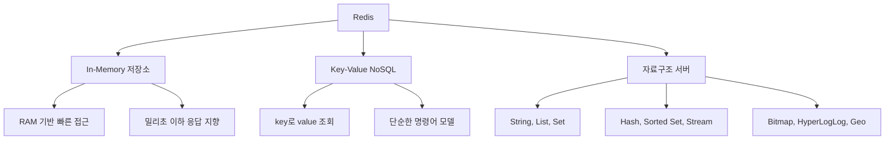

### Redis를 사용하는 대표적인 이유

Redis는 보통 "빠른 캐시"로 먼저 접하지만, 실제 서비스에서는 아래처럼 여러 역할을 맡습니다.

| 사용 사례   | 주로 쓰는 자료구조 | 설명                                                            |
| ----------- | ------------------ | --------------------------------------------------------------- |
| 캐시        | `String`, `Hash`   | DB 조회 결과, API 응답, 세션 정보를 TTL과 함께 저장             |
| 카운터      | `String`           | 조회수, 좋아요 수, 재고 수량을 `INCR`, `DECR`로 원자적으로 변경 |
| 분산 락     | `String`           | `SET key value NX EX seconds`로 잠금 획득 시도                  |
| 작업 큐     | `List`, `Stream`   | 간단한 FIFO 큐는 List, 재처리와 ACK가 필요하면 Stream           |
| 실시간 알림 | `Pub/Sub`          | 구독 중인 클라이언트에게 즉시 메시지 전달                       |
| 랭킹        | `Sorted Set`       | score 기준으로 순위 조회                                        |
| 중복 제거   | `Set`              | 유니크 방문자, 태그, 권한 목록 관리                             |

> - Redis는 빠르지만 모든 데이터를 Redis에 넣는 것이 정답은 아닙니다.
> - 메모리 비용이 높기 때문에 자주 접근하는 Hot Data 위주로 저장해야 합니다.
> - 단일 명령어는 원자적이지만, 여러 명령어를 조합한 비즈니스 로직은 트랜잭션, Lua script, 락 등을 고려해야 합니다.
> - `KEYS`, 큰 범위의 `LRANGE`, 큰 Hash의 `HGETALL`처럼 오래 걸리는 명령은 싱글 이벤트 루프를 막을 수 있습니다.

## In-Memory DB로서의 Redis

Redis가 빠른 가장 직접적인 이유는 데이터를 디스크가 아니라 메모리에 저장한다는 점입니다.

### 장점

- **극도로 빠른 속도**: 일반적인 단순 명령은 매우 낮은 지연 시간으로 처리됩니다.
- **낮은 지연 시간**: 애플리케이션과 Redis가 가까운 네트워크에 있으면 캐시 계층으로 쓰기 좋습니다.
- **높은 처리량**: 명령이 짧고 자료구조 연산이 효율적이면 초당 많은 요청을 처리할 수 있습니다.

### 단점

- **휘발성**: 프로세스가 죽으면 메모리 데이터는 사라질 수 있습니다. 이를 완화하기 위해 RDB snapshot, AOF(Append Only File) 영속화를 사용합니다.
- **메모리 용량 제한**: 디스크보다 RAM은 비싸고 제한적입니다.
- **Hot Data 중심 설계 필요**: 모든 원본 데이터를 Redis에 저장하기보다는 자주 읽는 데이터, 짧게 살아도 되는 데이터, 빠른 응답이 필요한 데이터를 선별하는 편이 좋습니다.

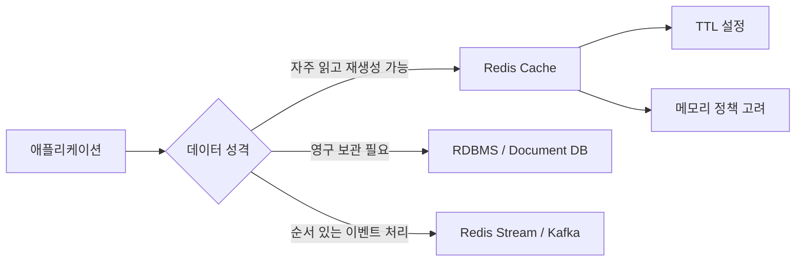

## Redis는 왜 싱글 스레드를 선택했을까?

Redis를 설명할 때 가장 많이 나오는 문장이 "Redis는 싱글 스레드다"입니다. 이 말은 정확히는 **사용자 명령어를 파싱하고 실제 데이터를 읽고 쓰는 핵심 실행 경로가 주로 단일 스레드 이벤트 루프에서 처리된다**는 뜻입니다.

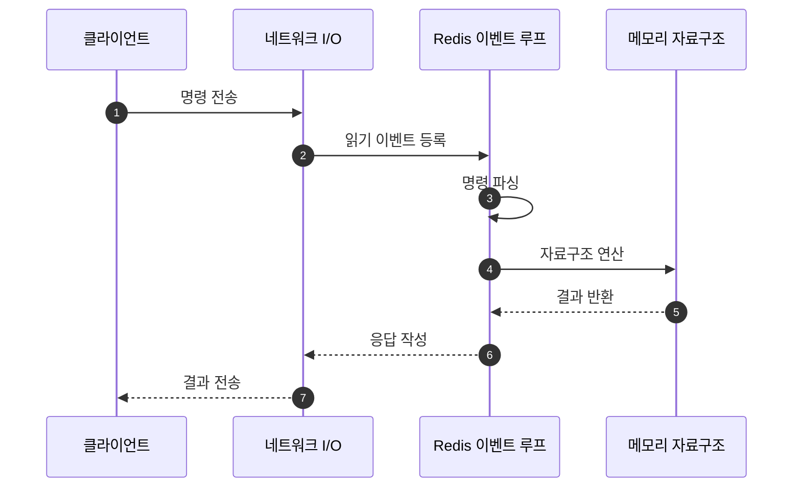

### 싱글 스레드 채택 이유

Redis가 싱글 스레드 모델을 채택한 이유는 단순히 구현이 쉬워서만은 아닙니다.

| 이유                                         | 설명                                                                                                                                                                     |
| -------------------------------------------- | ------------------------------------------------------------------------------------------------------------------------------------------------------------------------ |
| 락 비용 제거                                 | 여러 스레드가 같은 자료구조를 동시에 수정하면 mutex, lock-free 구조, race condition 처리가 필요합니다. Redis는 핵심 명령 실행을 단일 스레드로 처리해 이 비용을 줄입니다. |
| 원자성 보장 단순화                           | 하나의 명령이 실행되는 동안 다른 명령이 끼어들지 않으므로 `INCR`, `DECR`, `LPUSH` 같은 단일 명령의 원자성이 자연스럽게 보장됩니다.                                       |
| CPU보다 메모리/네트워크가 병목인 경우가 많음 | Redis 명령은 대부분 짧고 단순합니다. 많은 워크로드에서 병목은 복잡한 CPU 계산보다 네트워크 왕복, 메모리 접근, 큰 응답 전송입니다.                                        |
| 이벤트 루프와 I/O multiplexing               | `epoll`, `kqueue` 같은 I/O multiplexing으로 많은 커넥션을 하나의 이벤트 루프에서 효율적으로 다룰 수 있습니다.                                                            |
| 예측 가능한 실행 모델                        | 명령 처리 순서가 명확해 디버깅과 성능 추론이 비교적 쉽습니다.                                                                                                            |

### 그러면 Redis는 완전히 싱글 스레드일까?

아닙니다. Redis의 핵심 데이터 조작은 단일 스레드 중심이지만, Redis 전체 프로세스 안팎에는 멀티 스레드 또는 별도 프로세스가 관여하는 부분이 있습니다.

| 영역                                   | 싱글/멀티                       | 설명                                                                                                                                   |
| -------------------------------------- | ------------------------------- | -------------------------------------------------------------------------------------------------------------------------------------- |
| 명령 실행과 데이터 변경                | 주로 싱글 스레드                | `GET`, `SET`, `INCR`, `HSET` 같은 명령의 실제 자료구조 접근과 변경은 메인 이벤트 루프가 처리합니다.                                    |
| 네트워크 I/O                           | Redis 6 이후 선택적 멀티 스레드 | 요청 읽기와 응답 쓰기 일부를 I/O thread로 나눌 수 있습니다. 다만 명령 실행 자체가 여러 스레드에서 동시에 수행되는 것은 아닙니다.       |
| 만료 키 삭제                           | 메인 루프 + 보조 작업           | TTL 만료는 lazy expiration과 active expiration으로 처리됩니다. 큰 객체 삭제는 lazy free 설정에 따라 백그라운드에서 처리할 수 있습니다. |
| 영속화 RDB                             | 별도 프로세스 fork              | RDB snapshot은 보통 자식 프로세스를 fork해 디스크에 기록합니다. 스레드라기보다는 별도 프로세스에 가깝습니다.                           |
| AOF rewrite                            | 별도 프로세스 fork              | AOF 파일 재작성도 자식 프로세스를 사용해 메인 루프 영향을 줄입니다.                                                                    |
| AOF fsync, lazy free 등 background job | 백그라운드 스레드               | 디스크 동기화, 큰 메모리 해제 같은 보조 작업은 background I/O thread가 맡을 수 있습니다.                                               |
| Cluster 노드 간 통신                   | 각 노드 프로세스                | Redis Cluster는 여러 Redis 프로세스가 슬롯을 나눠 갖는 구조입니다.                                                                     |

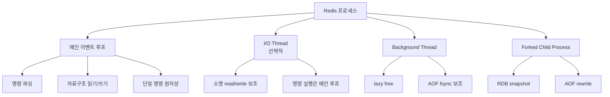

### 싱글 스레드 모델에서 주의할 점

Redis의 장점은 "한 명령을 빨리 끝낸다"는 전제에서 잘 살아납니다. 반대로 한 명령이 오래 걸리면 뒤의 모든 명령이 기다립니다.

| 위험한 패턴               | 이유                                             | 대안                            |
| ------------------------- | ------------------------------------------------ | ------------------------------- |
| `KEYS *`                  | 전체 key space를 훑어 이벤트 루프를 막을 수 있음 | 운영 환경에서는 `SCAN` 사용     |
| 큰 List에 `LRANGE 0 -1`   | 응답 크기와 순회 비용이 큼                       | 페이지 단위 범위 조회           |
| 큰 Hash에 `HGETALL`       | 모든 field/value를 한 번에 가져옴                | `HSCAN`, 필요한 field만 `HMGET` |
| 큰 key 삭제 `DEL big-key` | 메모리 해제가 오래 걸릴 수 있음                  | `UNLINK`, lazy free 고려        |
| Lua script 장시간 실행    | script 실행 중 다른 명령 대기                    | script는 짧고 결정적으로 작성   |

## Redis 배포 구조

Redis는 단일 서버로도 사용할 수 있지만, 가용성이나 확장성이 필요하면 Replica, Sentinel, Cluster를 함께 고려합니다.

### 단일 Redis

가장 단순한 구조입니다. 클라이언트가 하나의 Redis 서버에 직접 연결합니다.


- 장점: 구성과 운영이 단순합니다.
- 단점: Redis 서버 장애 시 서비스가 영향을 받습니다.
- 적합한 경우: 로컬 개발, 작은 서비스, 장애 시 재생성 가능한 캐시.

### Replica 구조

쓰기 요청은 Master로 보내고, Master의 데이터가 Replica로 복제됩니다. 읽기 부하를 Replica로 분산할 수 있지만 복제는 비동기 기반이므로 복제 지연을 고려해야 합니다.

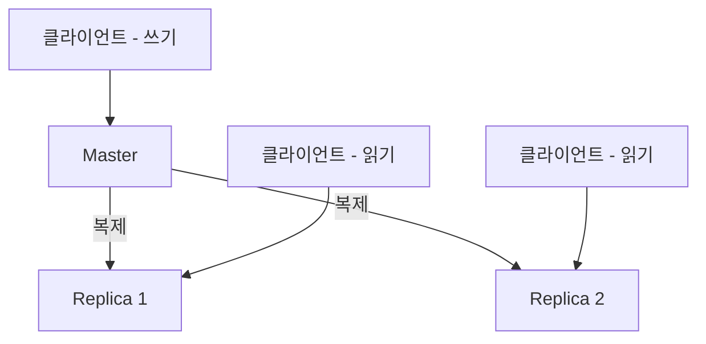

### Sentinel 구조

Sentinel은 Redis Master와 Replica를 모니터링하다가 Master 장애를 감지하면 Replica 중 하나를 새 Master로 승격합니다. 직접 데이터를 저장하는 서버라기보다 **고가용성을 위한 감시자와 조정자**에 가깝습니다.

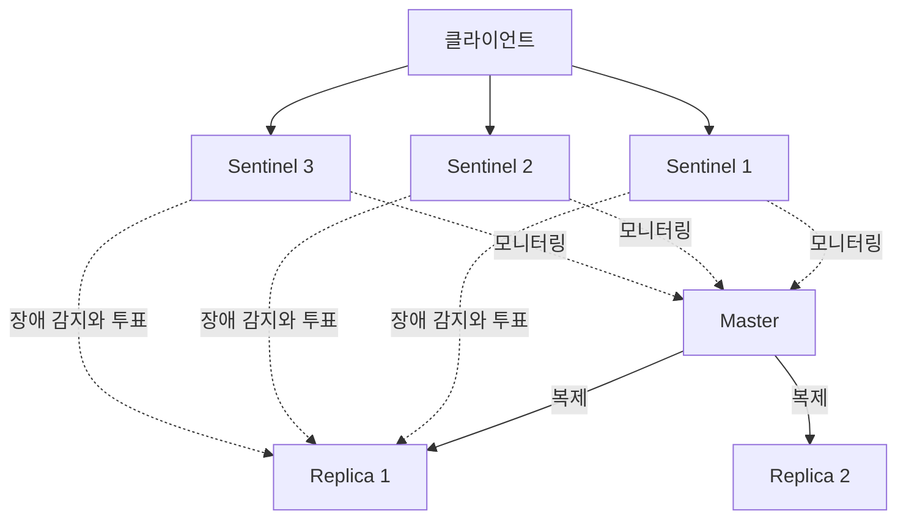

### Cluster 구조

Cluster는 데이터를 여러 Master에 나누어 저장합니다. Redis Cluster는 전체 key space를 `0 ~ 16383`의 hash slot으로 나누고, 각 Master가 일부 slot을 담당합니다.

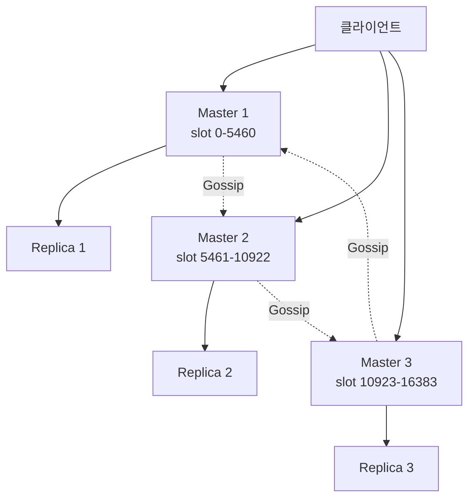

- 장점: 데이터를 여러 노드에 분산해 메모리 용량과 처리량을 확장할 수 있습니다.
- 단점: 멀티 key 명령은 같은 hash slot에 있는 key끼리만 자연스럽게 처리됩니다. 필요하면 hash tag를 사용해야 합니다.
- 예시: `user:{100}:profile`, `user:{100}:cart`처럼 `{100}` 부분을 같게 하면 같은 slot으로 배치할 수 있습니다.

## Redis와 다른 저장소 비교

| 비교               | Redis                                            | 상대 저장소                                                       |
| ------------------ | ------------------------------------------------ | ----------------------------------------------------------------- |
| Redis vs 관계형 DB | 메모리 기반 Key-Value 접근, 자료구조 명령 중심   | 관계형 DB는 디스크 기반 영속성, SQL, 트랜잭션, 복잡한 조회에 강함 |
| Redis vs MongoDB   | 실시간 캐시, 카운터, 큐, 랭킹에 강함             | MongoDB는 문서 저장과 유연한 질의에 강함                          |
| Redis vs Memcached | 다양한 자료구조, 영속성 옵션, 복제/클러스터 기능 | Memcached는 단순 String 캐시에 집중하고 멀티 스레드 모델을 사용   |

### 대안 비교

| 선택지    | 장점                                                   | 단점                                                             |
| --------- | ------------------------------------------------------ | ---------------------------------------------------------------- |
| Redis     | 다양한 자료구조, TTL, 원자 명령, Stream, Cluster 지원  | 메모리 비용, 큰 명령 실행 시 이벤트 루프 지연                    |
| Memcached | 단순 캐시에 가볍고 멀티 스레드 처리에 강점             | 자료구조가 단순하고 영속성/복제 기능이 제한적                    |
| RDBMS     | 정합성, 복잡한 쿼리, 영속성, 트랜잭션에 강함           | 캐시나 초고속 카운터 용도로는 Redis보다 지연 시간이 커질 수 있음 |
| Kafka     | 대규모 이벤트 스트리밍, 긴 보관, consumer group에 강함 | 단순 캐시나 빠른 key-value 조회에는 과함                         |

## Redis 캐시 전략

Redis를 캐시로 사용할 때 가장 중요한 선택은 "읽기와 쓰기 중 어느 시점에 캐시를 갱신할 것인가"입니다. 같은 Redis를 사용하더라도 캐시 갱신 책임을 애플리케이션이 갖는지, DB 쓰기와 캐시 쓰기를 동기화하는지, DB 반영을 나중으로 미루는지에 따라 장애 처리와 정합성 특성이 달라집니다.

이 절에서 다루는 조건은 다음과 같습니다.

- 원본 데이터 저장소는 DB라고 가정한다.
- Redis는 원본 DB 앞단의 캐시로 사용한다.
- 읽기 성능, 쓰기 지연 시간, 데이터 정합성 사이의 trade-off를 비교한다.
- 샘플 프로젝트의 `RedisStrategyService`와 `http/strategy.http` 흐름을 기준으로 예제를 연결한다.

| 전략                         | 읽기 흐름                                                     | 쓰기 흐름                                          | 장점                                                 | 단점                                                                    | 적합한 상황                                            |
| ---------------------------- | ------------------------------------------------------------- | -------------------------------------------------- | ---------------------------------------------------- | ----------------------------------------------------------------------- | ------------------------------------------------------ |
| Look-aside 또는 Cache-aside  | 애플리케이션이 캐시를 먼저 보고 miss면 DB 조회 후 캐시에 적재 | DB를 먼저 갱신하고 캐시는 삭제하거나 갱신          | 구현이 단순하고 장애 격리가 쉽습니다.                | cache miss 시 DB 부하가 튈 수 있고, 캐시 무효화 누락에 주의해야 합니다. | 일반적인 API 응답 캐시, 게시글 상세, 사용자 프로필     |
| Write-through                | 쓰기 요청 시 캐시와 DB를 함께 갱신                            | 캐시와 DB를 동기적으로 함께 갱신                   | 쓰기 직후 캐시가 최신 상태일 가능성이 높습니다.      | 쓰기 지연 시간이 늘고, 둘 중 하나 실패 시 보상 처리가 필요합니다.       | 읽기 직후 최신성이 중요한 설정, 사용자 요약 정보       |
| Write-back 또는 Write-behind | 읽기는 캐시 중심                                              | 먼저 캐시에 쓰고 큐에 적재한 뒤 DB는 비동기로 반영 | 쓰기 응답이 빠르고 burst write를 흡수할 수 있습니다. | 큐 유실, flush 실패, 장애 시 데이터 손실 위험을 관리해야 합니다.        | 로그성 데이터, 지연 반영 가능한 통계, write burst 완충 |

### Look-aside(Cache-aside)

Look-aside는 애플리케이션이 캐시 조회와 DB 조회를 직접 제어하는 전략입니다. 읽을 때 Redis를 먼저 조회하고, 캐시에 없으면 DB에서 읽어 Redis에 다시 넣습니다.

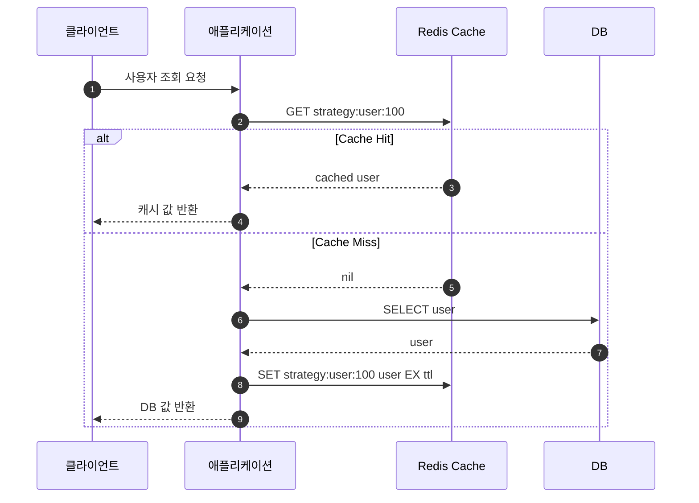

쓰기에서는 보통 DB를 먼저 갱신하고 캐시를 삭제합니다.

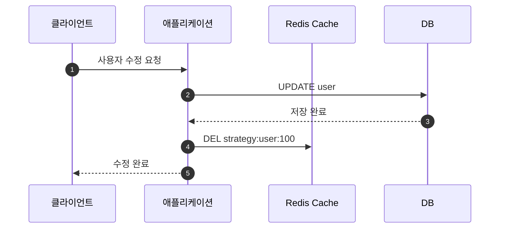

샘플 프로젝트에서는 다음 API가 이 흐름을 보여줍니다.

```http
GET http://localhost:8080/strategy/cache-aside/user?userId=100
Content-Type: application/json
```

```http
PUT http://localhost:8080/strategy/cache-aside/user
Content-Type: application/json

{
  "userId": 100,
  "name": "홍길동-수정",
  "email": "hong-updated@test.com",
  "age": 31
}
```

시간 복잡도는 cache hit이면 Redis `GET` 중심이라 보통 `O(1)`입니다. cache miss이면 Redis 조회 `O(1)`에 DB 조회 비용이 추가됩니다. 공간 복잡도는 캐시에 저장하는 key 수와 value 크기에 비례해 `O(N * V)`입니다.

> - cache miss가 동시에 몰리면 cache stampede가 발생할 수 있습니다.
> - update 후 캐시 삭제가 실패하면 오래된 캐시가 남을 수 있습니다.
> - TTL을 너무 길게 잡으면 stale data 위험이 커지고, 너무 짧게 잡으면 DB 부하가 커집니다.

### Write-through

Write-through는 쓰기 요청이 들어왔을 때 DB와 Redis를 함께 갱신하는 전략입니다. 쓰기 응답이 느려질 수 있지만, 쓰기 직후 읽기에서 최신 데이터를 캐시에서 얻기 쉽습니다.

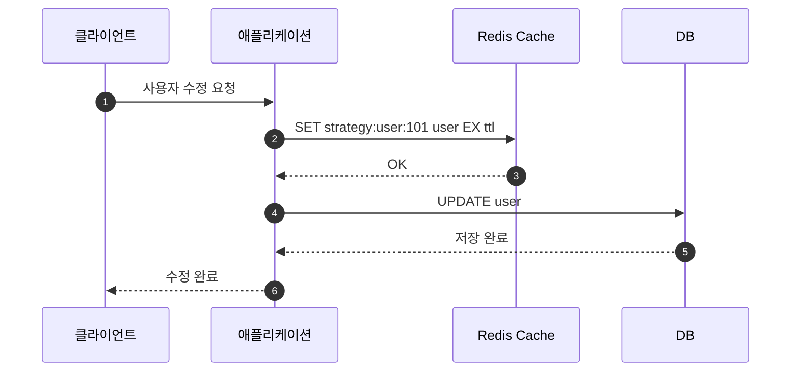

샘플 프로젝트에서는 `updateUserByWriteThrough`가 `redis.setData()` 후 `fakeDb.save()`를 수행합니다.

```java
public Mono<StrategyUserResponse> updateUserByWriteThrough(StrategyUserRequest req) {
    StrategyUser user = toUser(req);
    return redis.setData(userCacheKey(user.getId()), user)
            .then(fakeDb.save(user))
            .map(saved -> response("write-through", "cache+db", saved, redis.getDefaultExpireTime(), false, "캐시와 DB를 함께 갱신했습니다."));
}
```

HTTP 예제는 다음과 같습니다.

```http
PUT http://localhost:8080/strategy/write-through/user
Content-Type: application/json

{
  "userId": 101,
  "name": "김철수",
  "email": "kim@test.com",
  "age": 28
}
```

```http
GET http://localhost:8080/strategy/write-through/user?userId=101
Content-Type: application/json
```

시간 복잡도는 Redis 쓰기 기준으로 보통 `O(1)`이고, 여기에 DB write 비용이 더해집니다. 공간 복잡도는 캐시된 row 수에 비례합니다.

> - Redis 갱신은 성공했지만 DB 저장이 실패하면 정합성 문제가 생길 수 있습니다.
> - DB 저장은 성공했지만 Redis 갱신이 실패하는 반대 상황도 고려해야 합니다.
> - 중요한 데이터라면 재시도, 보상 트랜잭션, outbox 패턴을 함께 검토하는 것이 좋습니다.

### Write-back 또는 Write-behind

Write-back은 먼저 캐시에 쓰고, DB 반영은 뒤로 미루는 전략입니다. Redis 캐시가 일시적으로 쓰기의 front buffer처럼 동작합니다. 샘플 프로젝트에서는 이 전략을 `write-behind`라는 이름으로 구현합니다.

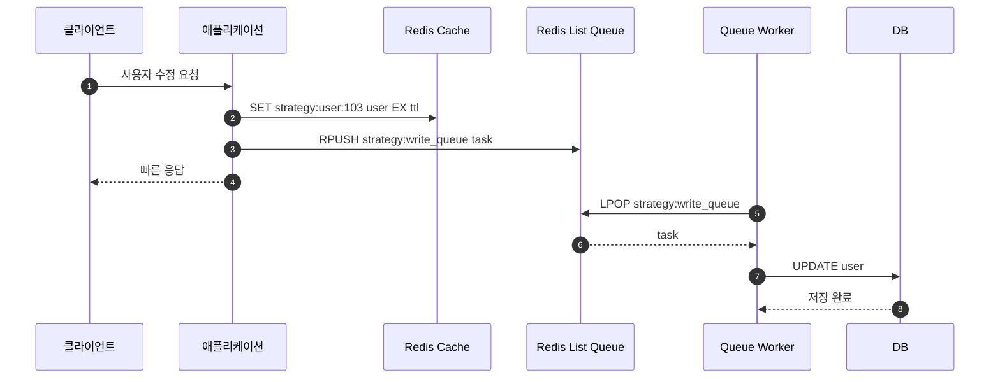

샘플 코드에서는 Redis에 최신 값을 저장하고, DB에 나중에 반영할 작업을 List queue에 넣습니다.

```java
public Mono<StrategyUserResponse> updateUserByWriteBehind(StrategyUserRequest req) {
    StrategyUser user = toUser(req);
    StrategyWriteBehindTask task = new StrategyWriteBehindTask("update_user", user.getId(), user);

    return redis.setData(userCacheKey(user.getId()), user)
            .then(redis.enqueue(WRITE_BEHIND_QUEUE_KEY, task))
            .map(queueSize -> new StrategyUserResponse(
                    "write-behind",
                    "cache+queue",
                    user,
                    toSeconds(redis.getDefaultExpireTime()),
                    null,
                    false,
                    true,
                    queueSize,
                    "DB 반영은 큐 처리 API에서 수행됩니다."
            ));
}
```

HTTP 예제는 다음과 같습니다.

```http
PUT http://localhost:8080/strategy/write-behind/user
Content-Type: application/json

{
  "userId": 103,
  "name": "이영희",
  "email": "lee@test.com",
  "age": 26
}
```

큐에 쌓인 작업을 DB에 반영합니다.

```http
POST http://localhost:8080/strategy/write-behind/process-next
Content-Type: application/json
```

시간 복잡도는 요청 처리 시 Redis `SET`과 `RPUSH`가 중심이라 보통 `O(1)`입니다. DB 쓰기 비용은 비동기 worker 쪽으로 이동합니다. 공간 복잡도는 캐시 데이터와 대기 중인 queue task 수에 비례합니다.

> - 큐가 유실되면 DB에 반영되지 않은 쓰기가 사라질 수 있습니다.
> - Redis 장애가 곧 쓰기 유실로 이어질 수 있으므로 AOF, replication, durable queue 대안을 검토해야 합니다.
> - 같은 key에 여러 쓰기가 빠르게 들어오면 순서 보장과 중복 반영 정책이 필요합니다.
> - 돈, 주문 확정, 재고 확정처럼 강한 정합성이 필요한 데이터에는 신중해야 합니다.

### 캐시 전략 대안 비교

| 대안          | 장점                                                                                         | 단점                                                                                                                              |
| ------------- | -------------------------------------------------------------------------------------------- | --------------------------------------------------------------------------------------------------------------------------------- |
| Look-aside    | 가장 흔하고 단순합니다. Redis 장애 시 DB fallback이 쉽습니다.                                | cache miss 폭증, stale cache, 무효화 실패를 관리해야 합니다.                                                                      |
| Write-through | 쓰기 직후 캐시 최신성이 좋습니다. 읽기 경로가 단순해집니다.                                  | 쓰기 지연 시간이 늘고, Redis/DB 부분 실패 처리가 필요합니다.                                                                      |
| Write-back    | 쓰기 응답이 빠르고 burst를 흡수할 수 있습니다.                                               | 유실과 지연 반영 위험이 있어 운영 난이도가 높습니다.                                                                              |
| Read-through  | 애플리케이션이 loader만 정의하고 캐시 계층이 DB 로딩을 담당하는 형태로 추상화할 수 있습니다. | 일반 Redis만으로는 완전한 read-through cache abstraction이 자동 제공되는 것은 아니므로 애플리케이션/라이브러리 설계가 필요합니다. |
| Refresh-ahead | 만료 전에 미리 갱신해 cache miss를 줄일 수 있습니다.                                         | 불필요한 refresh가 생길 수 있고 구현이 복잡합니다.                                                                                |

## Redis 자료구조 및 명령어 실행
Redis는 자료구조별로 명령어가 나뉩니다. 자료구조를 잘 고르면 애플리케이션 코드에서 직접 구현해야 할 정렬, 중복 제거, 원자적 증가, 큐 연산을 Redis 명령 하나로 처리할 수 있습니다.

| 자료구조     | 대표 명령어                                | 자주 쓰는 상황                 | 주요 복잡도                                      |
| ------------ | ------------------------------------------ | ------------------------------ | ------------------------------------------------ |
| `String`     | `SET`, `GET`, `INCR`, `MGET`               | 캐시, 카운터, 락, 단일 값 저장 | `GET/SET`: `O(1)`, `MGET`: `O(N)`                |
| `List`       | `LPUSH`, `RPUSH`, `LPOP`, `RPOP`, `LRANGE` | 큐, 스택, 최근 목록            | 양끝 push/pop: `O(1)`, range: `O(S+N)`           |
| `Set`        | `SADD`, `SREM`, `SISMEMBER`, `SINTER`      | 중복 제거, 집합 연산           | 단일 add/remove/check: 평균 `O(1)`               |
| `Sorted Set` | `ZADD`, `ZRANGE`, `ZREVRANGE`, `ZINCRBY`   | 랭킹, 우선순위 큐              | add/remove: `O(log N)`, range: `O(log N + M)`    |
| `Hash`       | `HSET`, `HGET`, `HMGET`, `HGETALL`         | 객체 필드 저장                 | field 단일 접근: 평균 `O(1)`                     |
| `Stream`     | `XADD`, `XREAD`, `XREADGROUP`, `XACK`      | 이벤트 로그, durable queue     | append: 보통 `O(1)`, range/read는 조회 개수 영향 |

> - 복잡도에서 `N`은 대상 원소 수, `M`은 반환되는 원소 수를 의미합니다.
> - Redis 명령의 시간 복잡도는 명령어 문서에 따라 달라지므로 운영에서 많이 쓰는 명령은 반드시 별도로 확인하는 것이 좋습니다.
> - `O(1)` 명령이라도 value 크기가 매우 크면 네트워크 전송과 메모리 할당 비용이 커질 수 있습니다.

## 자료구조별 실제 유스케이스

Redis 자료구조는 "어떤 모양으로 저장할 수 있는가"보다 "어떤 접근 패턴을 서버 명령 하나로 처리할 수 있는가"가 더 중요합니다. 예를 들어 단순히 JSON을 저장할 수 있다는 이유만으로 모든 데이터를 `String`에 넣으면, 특정 필드만 바꾸거나 집합 연산을 해야 할 때 애플리케이션 코드가 복잡해집니다.

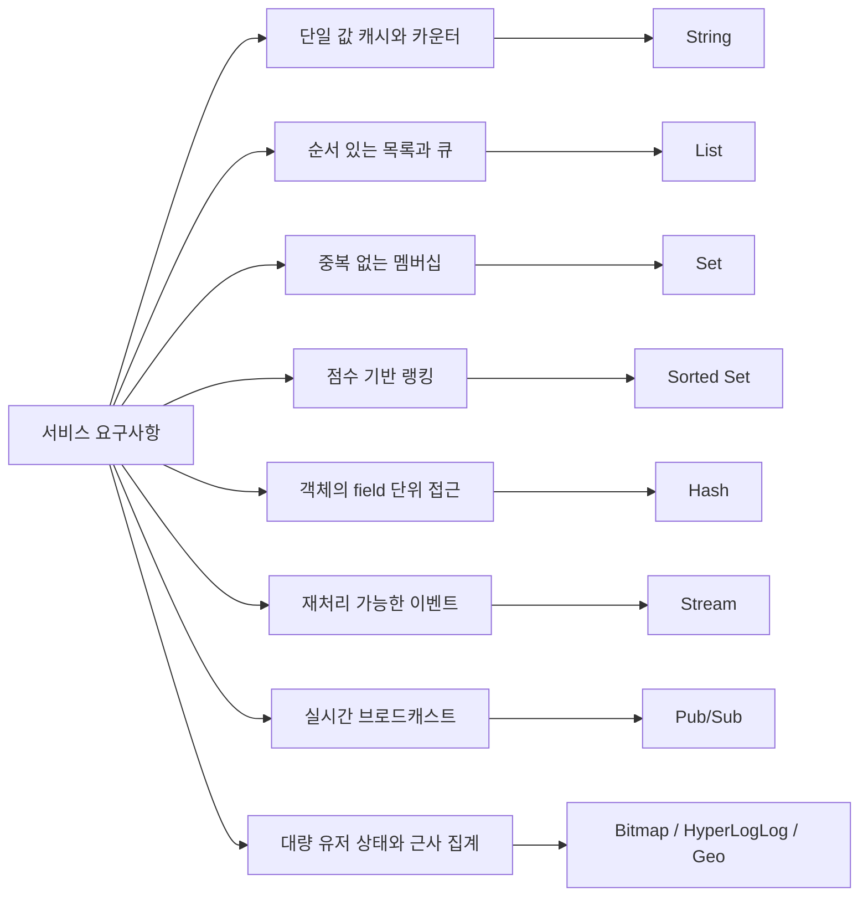

| 자료구조      | 실제 유스케이스                                                                                              | 예시 key                                              | 왜 적합한가                                                                                                    | 주의사항                                                                                                                                   |
| ------------- | ------------------------------------------------------------------------------------------------------------ | ----------------------------------------------------- | -------------------------------------------------------------------------------------------------------------- | ------------------------------------------------------------------------------------------------------------------------------------------ |
| `String`      | API 응답 캐시, 세션 토큰, 인증 코드, 조회수, 좋아요 수, 재고 수량, 분산 락, rate limit counter               | `cache:article:100`, `view:post:100`, `lock:order:1`  | 단일 값 저장이 단순하고 `EX`, `NX`, `INCR`, `DECR` 같은 원자 명령을 바로 사용할 수 있습니다.                   | 값이 너무 크면 네트워크 전송과 삭제 비용이 커집니다. 객체 일부만 자주 바꾸면 `Hash`가 더 나을 수 있습니다.                                 |
| `List`        | 최근 본 상품 목록, 간단한 작업 큐, 알림 목록, 채팅방 최근 메시지, stack/queue                                | `recent:user:1`, `queue:email`                        | 양끝 삽입과 삭제가 빠릅니다. `LPUSH/RPOP`, `RPUSH/LPOP` 조합으로 큐를 만들기 쉽습니다.                         | 메시지 ACK와 재처리가 필요하면 `Stream`이 더 안전합니다. 중간 인덱스 접근과 큰 범위 조회는 조심해야 합니다.                                |
| `Set`         | 유니크 방문자, 게시글 좋아요 사용자 목록, 태그 집합, 권한 목록, 친구 관계, 추천 후보 중복 제거               | `like:post:100`, `role:admin:users`, `tags:article:1` | 중복을 자동 제거하고 멤버 존재 여부를 빠르게 확인할 수 있습니다. 교집합, 합집합, 차집합도 서버에서 처리합니다. | 순서가 없습니다. 랭킹이나 시간순 정렬이 필요하면 `Sorted Set`을 고려해야 합니다.                                                           |
| `Sorted Set`  | 랭킹 보드, 인기 게시글, 우선순위 큐, 만료 인덱스, 스케줄러, 시간 범위 조회                                   | `rank:game:daily`, `popular:posts`, `expire:index`    | member에 score를 붙여 정렬된 상태로 관리합니다. score 기준 상위 N개, 범위 조회, 순위 조회가 쉽습니다.          | score 설계가 중요합니다. 동점 처리, 오래된 데이터 정리, 큰 range 조회 비용을 고려해야 합니다.                                              |
| `Hash`        | 사용자 프로필, 상품 요약 정보, 장바구니 항목 수량, 세션 속성, 설정 묶음                                      | `user:100`, `product:100`, `cart:user:1`              | 하나의 key 아래 field를 나눠 저장하므로 특정 field만 읽고 쓸 수 있습니다. 작은 객체를 묶어 관리하기 좋습니다.  | 기본 TTL은 Hash key 전체에 적용됩니다. field별 TTL이 필요하면 Redis 7.4 이상의 Hash Field Expiration 또는 별도 key 분리를 고려해야 합니다. |
| `Stream`      | 주문 이벤트, 결제 이벤트, 알림 발송 작업, audit log, outbox 후속 처리, 여러 consumer가 나눠 처리하는 작업 큐 | `stream:orders`, `stream:payment-events`              | 메시지를 append-only 로그로 보관하고 consumer group, pending entry, ACK를 지원합니다.                          | Kafka 같은 장기 보관 대용으로 무조건 쓰기보다는 보관 기간, trimming, 장애 복구 전략을 정해야 합니다.                                       |
| `Pub/Sub`     | 실시간 알림 fan-out, WebSocket 서버 간 이벤트 전달, 캐시 무효화 신호, 간단한 내부 broadcast                  | `channel:notice`, `channel:cache-invalidate`          | 구독 중인 클라이언트에게 즉시 메시지를 전달합니다. 구조가 단순하고 지연 시간이 낮습니다.                       | 메시지를 저장하지 않습니다. 구독자가 잠시 끊겨 있으면 메시지를 놓칠 수 있으므로 중요한 이벤트에는 `Stream`이 더 적합합니다.                |
| `Bitmap`      | 일별 출석 체크, 기능 사용 여부, 유저별 플래그, DAU 계산                                                      | `attendance:2025-02-12`, `feature-used:2025-02-12`    | bit 단위로 상태를 저장하므로 많은 boolean 값을 매우 작게 표현할 수 있습니다.                                   | user id처럼 offset으로 쓸 값의 범위가 너무 크면 메모리 낭비가 생길 수 있습니다.                                                            |
| `HyperLogLog` | 대략적인 UV, 검색어별 유니크 사용자 수, 이벤트별 유니크 참여자 수                                            | `uv:2025-02-12`, `uv:post:100`                        | 정확한 목록이 아니라 유니크 개수 추정만 필요할 때 메모리를 크게 절약합니다.                                    | 근사치입니다. 정확한 사용자 목록이나 정확한 카운트가 필요하면 `Set`이 맞습니다.                                                            |
| `Geo`         | 주변 매장 검색, 근처 기사/라이더 조회, 위치 기반 추천                                                        | `geo:stores`, `geo:riders`                            | 좌표를 저장하고 반경 기반 조회를 Redis 명령으로 처리할 수 있습니다.                                            | 복잡한 지리 질의나 정교한 공간 인덱싱은 전문 검색 엔진이나 공간 DB가 더 적합할 수 있습니다.                                                |

### 유스케이스별 선택 예시

#### 1. 게시글 상세 API 캐시

게시글 상세 API 응답을 짧게 캐싱하려면 `String`이 가장 단순합니다.

```sh
SET cache:post:100 '{"id":100,"title":"Redis"}' EX 300
GET cache:post:100
```

- 시간 복잡도: `SET`, `GET` 모두 보통 `O(1)`입니다.
- 공간 복잡도: 저장한 JSON 문자열 크기에 비례해 `O(V)`입니다.
- 대안: 조회 응답 전체가 아니라 조회수, 제목, 작성자처럼 일부 필드만 자주 바뀌면 `Hash`를 사용할 수 있습니다.

#### 2. 조회수와 좋아요 수

동시 요청이 많은 카운터는 `String`의 `INCR`, `DECR`, `INCRBY`가 잘 맞습니다.

```sh
INCR view:post:100
INCRBY like:post:100 1
DECRBY stock:product:100 1
```

애플리케이션에서 `GET -> 계산 -> SET`을 직접 구현하면 race condition이 생길 수 있습니다. Redis의 카운터 명령은 단일 명령으로 원자적으로 실행됩니다.

- 시간 복잡도: `O(1)`입니다.
- 공간 복잡도: key 수에 비례해 `O(N)`입니다.
- 대안: 정확한 증가 이력까지 남겨야 하면 `Stream`에 이벤트를 append하고 별도 집계기를 둘 수 있습니다.

#### 3. 최근 본 상품

사용자별 최근 본 상품은 순서가 중요하고 오래된 항목을 잘라내야 하므로 `List`를 사용할 수 있습니다.

```sh
LPUSH recent:user:1 product:100
LTRIM recent:user:1 0 19
LRANGE recent:user:1 0 19
```

- 시간 복잡도: `LPUSH`는 `O(1)`, `LTRIM`과 `LRANGE`는 범위 크기에 영향을 받습니다.
- 공간 복잡도: 사용자 수와 보관할 상품 수에 비례합니다.
- 대안: 중복 제거와 최신순이 동시에 필요하면 `Sorted Set`에 상품 id를 member, 조회 시각을 score로 저장하는 방식이 더 좋습니다.

#### 4. 게시글 좋아요 사용자 목록

어떤 사용자가 이미 좋아요를 눌렀는지 확인해야 한다면 `Set`이 적합합니다.

```sh
SADD like:post:100 user:1
SISMEMBER like:post:100 user:1
SCARD like:post:100
```

- 시간 복잡도: `SADD`, `SISMEMBER`, `SCARD`는 평균적으로 `O(1)`입니다.
- 공간 복잡도: 좋아요를 누른 사용자 수에 비례해 `O(N)`입니다.
- 대안: 좋아요를 누른 시간순 목록이 필요하면 `Sorted Set`에 timestamp를 score로 저장합니다.

#### 5. 게임 랭킹과 인기 게시글

score 기반 정렬이 필요하면 `Sorted Set`을 사용합니다.

```sh
ZINCRBY rank:game:daily 50 user:1
ZREVRANGE rank:game:daily 0 9 WITHSCORES
ZREVRANK rank:game:daily user:1
```

- 시간 복잡도: score 갱신은 보통 `O(log N)`, 상위 N개 조회는 `O(log N + M)`입니다.
- 공간 복잡도: member 수에 비례해 `O(N)`입니다.
- 대안: 정렬이 필요 없고 단순 참여자 중복 제거만 필요하면 `Set`이 더 단순합니다.

#### 6. 사용자 프로필과 장바구니

객체의 일부 field만 자주 읽거나 갱신한다면 `Hash`가 좋습니다.

```sh
HSET user:100 name "kim" age "30" grade "VIP"
HGET user:100 grade
HSET user:100 grade "VVIP"
```

장바구니도 상품 id를 field로 두면 수량만 갱신하기 쉽습니다.

```sh
HINCRBY cart:user:1 product:100 1
HGETALL cart:user:1
```

- 시간 복잡도: 단일 field 접근은 평균 `O(1)`입니다.
- 공간 복잡도: field 수와 value 크기에 비례합니다.
- 대안: 객체 전체를 한 번에 읽고 쓰는 패턴이면 `String`에 JSON으로 저장하는 편이 더 단순할 수 있습니다.

#### 7. 주문 이벤트 처리

주문 생성 후 결제, 알림, 재고 차감 같은 후속 처리를 여러 consumer가 나눠 처리해야 한다면 `Stream`이 적합합니다.

```sh
XADD stream:orders * orderId 100 userId 1 status CREATED
XGROUP CREATE stream:orders order-processors 0 MKSTREAM
XREADGROUP GROUP order-processors consumer-1 COUNT 10 STREAMS stream:orders >
XACK stream:orders order-processors 1750000000000-0
```

- 시간 복잡도: `XADD`는 보통 `O(1)`, 읽기는 반환 개수에 영향을 받습니다.
- 공간 복잡도: 보관하는 이벤트 수와 field 크기에 비례합니다.
- 대안: 이벤트 유실이 괜찮은 단순 실시간 알림이면 `Pub/Sub`이 더 간단합니다. 장기 보관과 대규모 스트리밍이 중요하면 Kafka가 더 적합할 수 있습니다.

#### 8. 캐시 무효화와 실시간 알림

서버 여러 대에 "이 key를 지워라" 같은 신호만 빠르게 보내면 `Pub/Sub`을 사용할 수 있습니다.

```sh
PUBLISH cache:invalidate "post:100"
SUBSCRIBE cache:invalidate
```

- 시간 복잡도: publish는 구독자 수에 영향을 받습니다.
- 공간 복잡도: 메시지를 저장하지 않으므로 Redis에 누적되는 데이터는 거의 없습니다.
- 대안: 메시지를 반드시 처리해야 하면 `Stream`을 사용합니다.

#### 9. 일별 출석 체크와 유니크 방문자

정확한 사용자 목록이 필요하지 않고 출석 여부만 필요하면 `Bitmap`이 유용합니다.

```sh
SETBIT attendance:2025-02-12 1001 1
GETBIT attendance:2025-02-12 1001
BITCOUNT attendance:2025-02-12
```

정확한 목록 없이 유니크 방문자 수만 대략 알고 싶다면 `HyperLogLog`를 사용할 수 있습니다.

```sh
PFADD uv:2025-02-12 user:1 user:2 user:3
PFCOUNT uv:2025-02-12
```

- 시간 복잡도: 단일 bit 접근은 보통 `O(1)`, `PFADD/PFCOUNT`도 매우 작고 안정적인 비용으로 동작합니다.
- 공간 복잡도: Bitmap은 최대 offset에 영향받고, HyperLogLog는 매우 작은 고정 크기 구조로 근사 집계를 수행합니다.
- 대안: 정확한 사용자 목록과 정확한 수가 필요하면 `Set`을 사용합니다.

### String (문자열)

String은 Redis에서 가장 기본적인 자료구조입니다. 이름은 문자열이지만 실제로는 **binary safe**한 byte sequence입니다. 즉 텍스트뿐 아니라 숫자, JSON, 직렬화된 객체, 이미지 조각 같은 바이너리 데이터도 저장할 수 있습니다.

String의 핵심은 다음과 같습니다.

- 가장 기본적인 Key-Value 저장 타입입니다.
- Redis String은 binary safe이므로 문자열 끝을 `\0` 같은 문자에 의존해 판단하지 않습니다.
- 값 하나의 최대 크기는 512MB입니다.
- 카운터, 분산 락, 캐시, 토큰 저장소처럼 단일 값 중심의 요구사항에 잘 맞습니다.
- 너무 큰 value는 네트워크 전송, 메모리 복사, 삭제 비용이 커지므로 작은 값 중심으로 설계하는 것이 좋습니다.

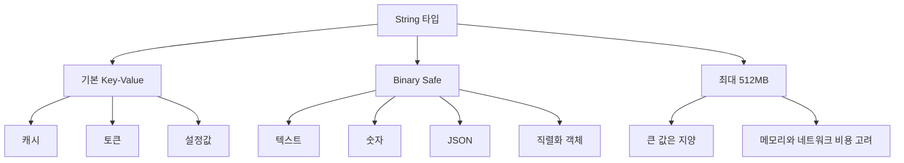

#### String 내부 구조: SDS와 인코딩

Redis는 C 문자열을 그대로 쓰지 않고 SDS(Simple Dynamic String)를 사용합니다.

SDS는 개념적으로 다음 정보를 함께 관리합니다.

| 필드                | 의미                                           |
| ------------------- | ---------------------------------------------- |
| `len`               | 실제 문자열 길이                               |
| `free` 또는 `alloc` | 추가로 사용할 수 있는 여유 공간 또는 할당 크기 |
| `buf`               | 실제 데이터가 저장되는 byte 배열               |

SDS를 쓰면 문자열 길이를 매번 순회하지 않고 `O(1)`에 알 수 있고, append 시 매번 새 메모리를 할당하지 않도록 여유 공간을 둘 수 있습니다. 또한 binary safe이므로 중간에 null byte가 있어도 데이터로 저장할 수 있습니다.

Redis 객체의 String value는 상황에 따라 인코딩이 달라집니다.

| 인코딩   | 사용 상황                    | 특징                                                                 |
| -------- | ---------------------------- | -------------------------------------------------------------------- |
| `int`    | 정수로 표현 가능한 값        | 숫자 연산에 효율적입니다.                                            |
| `embstr` | 짧은 문자열                  | Redis object와 SDS를 연속 메모리에 한 번에 할당해 캐시 친화적입니다. |
| `raw`    | 긴 문자열 또는 수정된 문자열 | Redis object와 SDS가 분리되어 더 유연하게 크기 변경을 처리합니다.    |

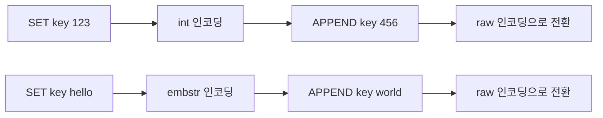

`embstr`는 짧고 읽기 중심인 문자열에 유리하지만 수정이 발생하면 `raw`로 바뀔 수 있습니다. 따라서 같은 String 타입이라도 내부 표현은 값의 크기와 변경 방식에 따라 달라집니다.

#### SET과 GET

`SET`은 key에 value를 저장합니다. key가 없으면 새로 만들고, 이미 있으면 기존 값을 덮어씁니다. 기본 `SET`은 성공하면 `OK`를 반환합니다.

`GET`은 String key의 값을 조회합니다. key가 없으면 `nil`을 반환합니다. key가 존재하지만 타입이 String이 아니면 WRONGTYPE 에러가 발생합니다.

- 명령어
```sh
SET key "hello"         # key에 "hello" 저장
GET key                 # key 값 조회
INCR counter            # 숫자 증가 (counter 값이 없으면 1부터 시작)
DECR counter            # 숫자 감소
APPEND key "!!!"        # key 값에 문자열 추가 (hello!!!)
DEL key                 # key 삭제
```

- 실행 결과 예시


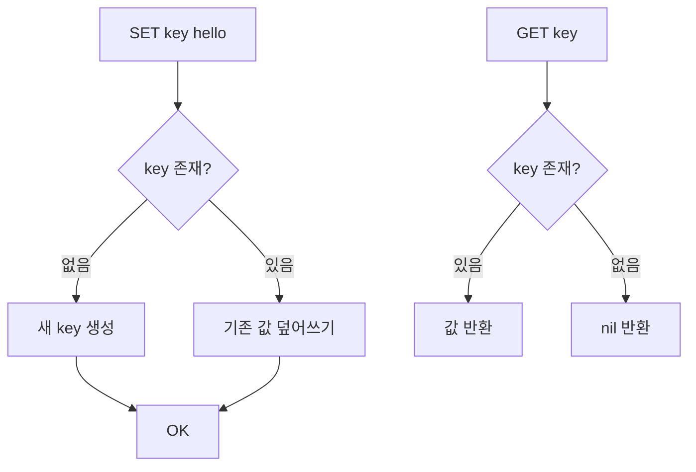

#### INCR와 DECR

`INCR`, `DECR`, `INCRBY`, `DECRBY`는 String value를 숫자로 해석해 증가 또는 감소시킵니다. 이 명령들은 단일 Redis 명령으로 실행되므로 원자적입니다. 여러 요청이 동시에 `INCR page_views`를 호출해도 lost update가 발생하지 않습니다.

```sh
SET page_views 10
INCR page_views
INCRBY page_views 5
DECR page_views
DECRBY page_views 3
GET page_views
```

활용 예시는 다음과 같습니다.

| 명령어   | 의미   | 예시                     |
| -------- | ------ | ------------------------ |
| `INCR`   | 1 증가 | 조회수 증가              |
| `DECR`   | 1 감소 | 임시 카운터 감소         |
| `INCRBY` | N 증가 | 포인트 적립              |
| `DECRBY` | N 감소 | 재고 차감, 다운로드 제한 |

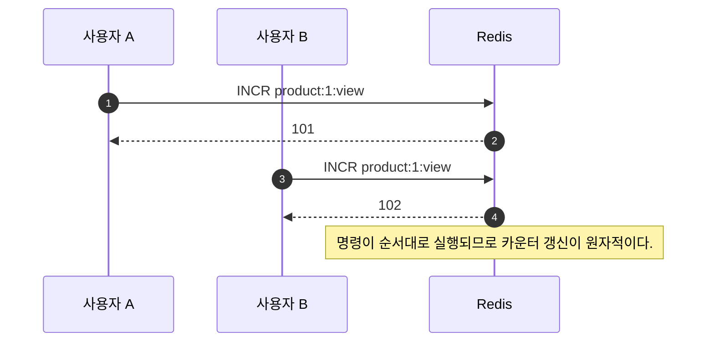

#### MSET과 MGET

`MSET`은 여러 key-value를 한 번에 저장하고, `MGET`은 여러 key 값을 한 번에 조회합니다. 여러 번의 `SET`, `GET` 요청을 각각 보내는 것보다 네트워크 RTT를 줄일 수 있습니다.

```sh
MSET user:1:name "kim" user:2:name "lee" user:3:name "park"
MGET user:1:name user:2:name user:3:name
```

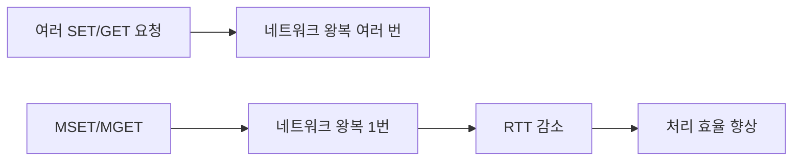

단, `MGET`으로 너무 많은 key를 한 번에 조회하면 응답 payload가 커질 수 있습니다. 대량 key는 적절히 batch 크기를 나누는 편이 안전합니다.

#### SETEX, SETNX, SET 옵션

`SETEX`는 value 저장과 TTL 설정을 한 번에 수행합니다. `SETNX`는 key가 없을 때만 저장합니다. 요즘은 `SET` 명령의 옵션을 함께 사용하는 형태를 더 자주 봅니다.

```sh
# TTL과 함께 저장
SET cache:user:1 "{...}" EX 300

# key가 없을 때만 저장
SET lock:order:1 "request-123" NX EX 10

# key가 있을 때만 갱신
SET cache:user:1 "{...}" XX EX 300

# 밀리초 단위 TTL
SET token:abc "payload" PX 5000
```

| 옵션              | 의미                 |
| ----------------- | -------------------- |
| `EX seconds`      | 초 단위 TTL          |
| `PX milliseconds` | 밀리초 단위 TTL      |
| `NX`              | key가 없을 때만 저장 |
| `XX`              | key가 있을 때만 저장 |

분산 락의 최소 형태는 아래와 같습니다.

```sh
SET lock:payment:1001 "request-id-1" NX EX 10
```

이 명령은 "락 key가 없으면 값을 저장하고 10초 뒤 자동 만료"를 하나의 원자 명령으로 처리합니다. 다만 실제 분산 락은 락 해제 시 value 검증, 만료 시간, clock drift, 장애 상황까지 고려해야 합니다.

### List (리스트)

List는 순서가 있는 문자열 목록입니다. 양 끝에서 삽입과 삭제가 빠르므로 큐나 스택을 만들 때 자주 사용합니다.

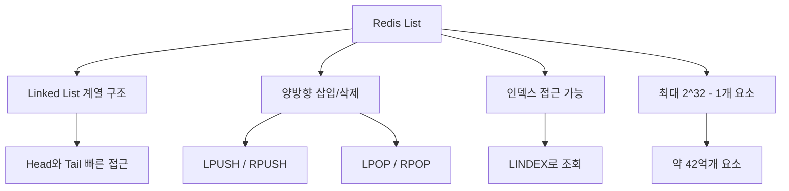

#### List 구현체는 Redis 버전에 따라 달라졌다

바로 위 다이어그램에서 List를 "Linked List 계열"로 표현했지만, Redis 내부 구현은 버전에 따라 꽤 많이 바뀌었습니다. 결론부터 정리하면 **`skiplist`는 Redis List의 구현체가 아니라 Sorted Set의 일반 인코딩**입니다. Redis List는 과거에 `ziplist`와 `linkedlist`를 크기에 따라 바꿔 사용했고, 이후 `quicklist`로 통합되었습니다.

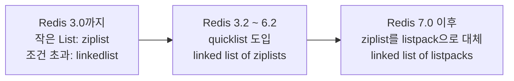

| Redis 버전      | List 인코딩                         | 크기별 전환 여부                                                        | 주요 설정                                            | 설명                                                                                                                                                                                    |
| --------------- | ----------------------------------- | ----------------------------------------------------------------------- | ---------------------------------------------------- | --------------------------------------------------------------------------------------------------------------------------------------------------------------------------------------- |
| Redis 3.0까지   | `ziplist` 또는 `linkedlist`         | 예                                                                      | `list-max-ziplist-entries`, `list-max-ziplist-value` | List가 작고 각 element가 작으면 `ziplist`를 사용했습니다. element 수나 value 크기가 임계값을 넘으면 `linkedlist`로 변환했습니다. 기본값은 보통 entries `512`, value `64 bytes`였습니다. |
| Redis 3.2 ~ 6.2 | `quicklist`                         | 전체 List 인코딩을 `ziplist`와 `linkedlist` 사이에서 바꾸는 방식이 아님 | `list-max-ziplist-size`, `list-compress-depth`       | `quicklist`가 List의 기본 구조가 되었습니다. quicklist는 여러 `ziplist` 노드를 linked list처럼 연결한 구조입니다.                                                                       |
| Redis 7.0 이후  | `quicklist`, 내부 노드는 `listpack` | 전체 List는 주로 `quicklist`; 내부 노드 크기를 조절                     | `list-max-listpack-size`, `list-compress-depth`      | `ziplist`가 더 안전하고 단순한 `listpack`으로 대체되었습니다. 즉 최신 Redis List는 개념적으로 `linked list of listpacks`에 가깝습니다.                                                  |

Redis 3.0까지의 크기 기반 전환은 다음처럼 이해할 수 있습니다.

```mermaid
flowchart TD
    A["Redis 3.0까지 List"] --> B{"작은 List인가?"}
    B -->|"element 수 <= list-max-ziplist-entries<br/>각 value <= list-max-ziplist-value"| C["ziplist"]
    B -->|"조건 초과"| D["linkedlist"]
    C --> E["메모리 절약"]
    D --> F["큰 List에서 삽입/삭제 부담 완화"]
```

Redis 3.2 이후의 `quicklist`는 양쪽의 장점을 섞은 구조입니다.

```mermaid
flowchart LR
    A["quicklist"] --> N1["node 1<br/>ziplist/listpack"]
    N1 --> N2["node 2<br/>ziplist/listpack"]
    N2 --> N3["node 3<br/>ziplist/listpack"]
    N3 --> N4["node 4<br/>ziplist/listpack"]

    A --> B["linked list처럼 노드 연결"]
    A --> C["각 노드 내부는 연속 메모리 compact encoding"]
    B --> D["Head/Tail push/pop에 유리"]
    C --> E["포인터 오버헤드 감소"]
```

`list-max-ziplist-size` 또는 `list-max-listpack-size`는 "전체 List를 ziplist/listpack으로 만들지 말지"를 결정하는 설정이 아니라, **quicklist 내부의 각 노드가 어느 정도 크기까지 element를 담을지**를 정하는 설정입니다. 음수 값은 대략적인 byte 크기 기준이고, 양수 값은 노드당 element 개수 기준입니다. 예를 들어 Redis 설정의 기본값 `-2`는 보통 내부 노드 목표 크기를 약 8KB로 잡는 의미입니다.

> - Redis List에 `skiplist`가 쓰인다고 이해하면 안 됩니다. `skiplist`는 Sorted Set의 일반 인코딩입니다.
> - 오래된 Redis에서는 작은 List가 `ziplist`, 큰 List가 `linkedlist`로 바뀌는 크기 기반 전환이 있었습니다.
> - Redis 3.2 이후에는 List가 `quicklist` 중심으로 바뀌었고, Redis 7.0 이후에는 quicklist 내부 compact node가 `ziplist`에서 `listpack`으로 바뀌었습니다.
> - `OBJECT ENCODING key`로 현재 key의 내부 인코딩을 확인할 수 있지만, Redis 버전과 데이터 크기, 설정에 따라 결과가 달라질 수 있습니다.

헷갈리기 쉬운 인코딩을 함께 보면 다음과 같습니다. 이 표는 "자료구조의 논리 타입"과 "Redis 내부 인코딩"이 다르다는 점을 보여주기 위한 요약입니다.

| 자료구조   | Redis 6.2까지의 대표 compact 인코딩     | Redis 7.x 이후 변화                                   | 일반 인코딩         | 전환 기준                                                                             |
| ---------- | --------------------------------------- | ----------------------------------------------------- | ------------------- | ------------------------------------------------------------------------------------- |
| List       | `ziplist`를 담은 `quicklist`            | Redis 7.0부터 `quicklist` 내부 노드가 `listpack` 기반 | `quicklist`         | `list-max-ziplist-size` 또는 `list-max-listpack-size`로 quicklist 내부 노드 크기 조절 |
| Hash       | `ziplist`                               | Redis 7.0부터 작은 Hash는 `listpack`                  | `hashtable`         | `hash-max-ziplist-entries/value` 또는 `hash-max-listpack-entries/value`               |
| Sorted Set | `ziplist`                               | Redis 7.0부터 작은 Sorted Set은 `listpack`            | `skiplist` + `dict` | `zset-max-ziplist-entries/value` 또는 `zset-max-listpack-entries/value`               |
| Set        | 정수만 있는 작은 Set은 `intset`         | Redis 7.2부터 non-integer 작은 Set도 `listpack` 가능  | `hashtable`         | `set-max-intset-entries`, `set-max-listpack-entries`, `set-max-listpack-value`        |
| Stream     | 내부 macro node에 compact encoding 사용 | radix tree + `listpack` 구조                          | `stream`            | `stream-node-max-bytes`, `stream-node-max-entries`                                    |

따라서 `skiplist`는 "List가 커지면 skiplist로 바뀐다"가 아니라, **Sorted Set이 일반 구조로 전환될 때 사용하는 정렬 인덱스**라고 보는 것이 맞습니다.

```mermaid
flowchart LR
    A["Redis 자료구조 내부 인코딩"] --> B["List"]
    A --> C["Hash"]
    A --> D["Set"]
    A --> E["Sorted Set"]

    B --> B1["Redis 3.2+ quicklist"]
    B1 --> B2["Redis 7.0+ quicklist of listpacks"]

    C --> C1["Redis <= 6.2 ziplist"]
    C --> C2["Redis >= 7.0 listpack"]
    C --> C3["커지면 hashtable"]

    D --> D1["정수만 있으면 intset"]
    D --> D2["Redis >= 7.2<br/>작은 문자열 Set은 listpack"]
    D --> D3["커지면 hashtable"]

    E --> E1["Redis <= 6.2 ziplist"]
    E --> E2["Redis >= 7.0 listpack"]
    E --> E3["커지면 skiplist + dict"]
```

특히 Set은 Redis 7.2 이후에 기억할 내용이 하나 더 생겼습니다. 과거에는 작은 정수 Set이면 `intset`, 그 외 일반적인 Set이면 `hashtable`로 이해해도 대체로 충분했습니다. Redis 7.2부터는 문자열 Set이라도 원소 수와 원소 크기가 작으면 `listpack`으로 저장해 메모리를 줄일 수 있습니다. 기본 설정 예시는 `set-max-intset-entries 512`, `set-max-listpack-entries 128`, `set-max-listpack-value 64`입니다.

#### OBJECT ENCODING 실습: Redis 컨테이너에서 내부 인코딩 확인하기

`OBJECT ENCODING`은 key의 논리 타입이 아니라 Redis가 실제로 선택한 내부 인코딩을 보여줍니다. 샘플 프로젝트의 `docker-compose.yml`은 Redis `7.2.4`를 사용하므로, Set의 `listpack` 인코딩까지 확인하기 좋습니다.

```sh
docker run --rm --name redis-encoding-lab -d redis:7.2.4
docker exec -it redis-encoding-lab redis-cli
```

Redis CLI에 들어간 뒤 다음 명령을 실행합니다.

```sh
FLUSHDB

SET str:int 123
OBJECT ENCODING str:int

SET str:embstr hello
OBJECT ENCODING str:embstr

SET str:raw abcdefghijklmnopqrstuvwxyzabcdefghijklmnopqrstuvwxyz
OBJECT ENCODING str:raw

LPUSH list:sample a b c
OBJECT ENCODING list:sample

HSET hash:small name kim age 30
OBJECT ENCODING hash:small

SADD set:int 1 2 3
OBJECT ENCODING set:int

SADD set:string red blue green
OBJECT ENCODING set:string

ZADD zset:small 1 a 2 b
OBJECT ENCODING zset:small
```

Redis 7.2.4 기준으로는 대략 다음과 같은 결과를 기대할 수 있습니다. 정확한 결과는 Redis 버전과 설정에 따라 달라질 수 있습니다.

```text
OBJECT ENCODING str:int      -> int
OBJECT ENCODING str:embstr   -> embstr
OBJECT ENCODING str:raw      -> raw
OBJECT ENCODING list:sample  -> quicklist
OBJECT ENCODING hash:small   -> listpack
OBJECT ENCODING set:int      -> intset
OBJECT ENCODING set:string   -> listpack
OBJECT ENCODING zset:small   -> listpack
```

작은 문자열 Set이 `listpack`에서 `hashtable`로 바뀌는 것도 확인할 수 있습니다.

```sh
for i in $(seq 1 130); do
  docker exec redis-encoding-lab redis-cli SADD set:string "member:$i" > /dev/null
done

docker exec redis-encoding-lab redis-cli SCARD set:string
docker exec redis-encoding-lab redis-cli OBJECT ENCODING set:string
```

기본 설정에서는 `set-max-listpack-entries`가 `128`이므로, 원소 수가 임계값을 넘으면 `hashtable`로 전환됩니다.

```text
133
hashtable
```

> - `OBJECT ENCODING` 결과를 외워서 고정된 규칙처럼 사용하면 위험합니다. 같은 명령이라도 Redis 버전, 설정, 원소 수, 원소 크기에 따라 결과가 달라집니다.
> - compact encoding은 메모리를 아끼는 대신 큰 범위 순회나 중간 원소 탐색에서 비용이 커질 수 있습니다.
> - 운영 중 인코딩 전환은 지연 시간에 영향을 줄 수 있으므로, 큰 key를 한 번에 만드는 패턴은 피하는 편이 안전합니다.

```mermaid
flowchart LR
    A["LPUSH"] --> L["List"]
    L --> B["RPOP"]
    C["RPUSH"] --> L
    L --> D["LPOP"]
```

활용 방식은 두 가지로 나눌 수 있습니다.

| 패턴  | 명령 조합                              | 설명                            |
| ----- | -------------------------------------- | ------------------------------- |
| Queue | `LPUSH` + `RPOP` 또는 `RPUSH` + `LPOP` | 먼저 넣은 값을 먼저 꺼냅니다.   |
| Stack | `LPUSH` + `LPOP` 또는 `RPUSH` + `RPOP` | 나중에 넣은 값을 먼저 꺼냅니다. |

#### List 명령어 흐름

```mermaid
flowchart LR
    A["LPUSH key value"] --> B["List Head에 요소 추가"]
    B --> C["왼쪽에서 삽입"]
    C --> D["O(1)"]

    E["RPUSH key value"] --> F["List Tail에 요소 추가"]
    F --> G["오른쪽에서 삽입"]
    G --> D
```

```mermaid
flowchart LR
    A["LPOP key"] --> B["List Head에서 요소 제거"]
    B --> C["왼쪽에서 꺼내기"]
    C --> D["제거된 값 반환"]

    E["RPOP key"] --> F["List Tail에서 요소 제거"]
    F --> G["오른쪽에서 꺼내기"]
    G --> D
```

```mermaid
flowchart LR
    A["LRANGE key start stop"] --> B["지정 범위 요소 조회"]
    B --> C["0부터 시작하는 인덱스"]
    B --> D["음수 인덱스 지원"]
    C --> E["LRANGE mylist 0 2<br/>처음 3개"]
    D --> F["LRANGE mylist -3 -1<br/>마지막 3개"]
```

```mermaid
flowchart LR
    A["List 정보 조회"] --> B["LLEN"]
    A --> C["LINDEX"]
    B --> D["길이 조회"]
    D --> E["O(1)"]
    E --> F["즉시 반환"]
    C --> G["특정 요소 조회"]
    G --> H["O(N)"]
    H --> I["인덱스까지 순회 필요"]
```

```mermaid
flowchart LR
    A["List 활용"] --> B["Queue 구조"]
    A --> C["Stack 구조"]
    B --> B1["RPUSH + LPOP<br/>FIFO"]
    B --> B2["LPUSH + RPOP<br/>FIFO"]
    B1 --> B3["Producer / Consumer"]
    C --> C1["LPUSH + LPOP<br/>LIFO"]
    C --> C2["RPUSH + RPOP<br/>LIFO"]
    C1 --> C3["최근 이력 관리"]
```

- 명령어
```sh
LPUSH fruits "apple"      # 왼쪽에서 삽입
RPUSH fruits "banana"     # 오른쪽에서 삽입
LPUSH fruits "grape"      # 왼쪽에서 삽입
LRANGE fruits 0 -1        # 모든 요소 조회
LPOP fruits               # 왼쪽에서 요소 제거
RPOP fruits               # 오른쪽에서 요소 제거
LLEN fruits               # 리스트 길이 확인
```

- 실행 결과 예시


시간 복잡도는 양끝 삽입과 삭제가 `O(1)`입니다. 다만 `LRANGE fruits 0 -1`처럼 전체를 가져오는 명령은 원소 수에 비례합니다.

### Set (집합)

Set은 중복 없는 집합입니다. 순서는 보장하지 않습니다. 특정 값이 이미 존재하는지 확인하거나, 여러 집합의 교집합/합집합/차집합을 구할 때 유용합니다.

```mermaid
flowchart TD
    A["Set"] --> B["중복 제거"]
    A --> C["멤버 존재 확인"]
    A --> D["집합 연산"]
    D --> D1["SINTER"]
    D --> D2["SUNION"]
    D --> D3["SDIFF"]
```

```mermaid
flowchart TD
    A["Redis Set"] --> B["중복 없는 컬렉션"]
    A --> C["순서 없음"]
    A --> D["O(1) 멤버십 체크"]
    A --> E["집합 연산 지원"]
    B --> B1["유일한 값만 저장"]
    C --> C1["삽입 순서 보장 안 됨"]
    D --> D1["매우 빠른 검색"]
    E --> E1["SUNION / SINTER / SDIFF"]
```

#### Set 명령어 흐름

```mermaid
flowchart LR
    A["Set 요소 관리"] --> B["SADD"]
    A --> C["SREM"]
    B --> D["요소 추가"]
    D --> E["중복 무시<br/>유일성 보장"]
    E --> F["추가된 개수 반환"]
    C --> G["요소 제거"]
    G --> H["존재하는 요소만 제거"]
    H --> I["제거된 개수 반환"]
```

```mermaid
flowchart LR
    A["Set 조회"] --> B["SMEMBERS"]
    A --> C["SISMEMBER"]
    B --> D["모든 요소 조회"]
    D --> E["전체 요소 배열 반환"]
    E --> F["O(N)"]
    C --> G["존재 확인"]
    G --> H["1 또는 0 반환"]
    H --> I["O(1)"]
```

```mermaid
flowchart LR
    A["집합 연산"] --> B["SINTER"]
    A --> C["SUNION"]
    A --> D["SDIFF"]
    B --> B1["교집합"]
    B1 --> B2["공통 요소만"]
    B2 --> B3["AND 연산"]
    C --> C1["합집합"]
    C1 --> C2["모든 요소<br/>중복 제거"]
    C2 --> C3["OR 연산"]
    D --> D1["차집합"]
    D1 --> D2["첫 Set에만 있는 요소"]
    D2 --> D3["MINUS 연산"]
```

- 명령어
```sh
SADD colors "red" "blue" "green"  # 값 추가
SREM colors "blue"                # 값 제거
SMEMBERS colors                   # 모든 값 조회
SISMEMBER colors "red"            # 특정 값 존재 확인 (1: 존재, 0: 없음)
SISMEMBER colors "black"          # 특정 값 존재 확인 (1: 존재, 0: 없음)
SCARD colors                      # 집합 크기 확인
```

- 실행 결과 예시


### Sorted Set (정렬된 집합)

Sorted Set은 member마다 score를 함께 저장하고, score 기준으로 정렬하는 자료구조입니다. 랭킹, 우선순위 큐, 시간 기반 인덱스에 잘 맞습니다.

```mermaid
flowchart LR
    A["member"] --> B["score"]
    B --> C["score 기준 정렬"]
    C --> D["랭킹 조회"]
    C --> E["범위 조회"]
```

```mermaid
flowchart LR
    A["Redis Sorted Set"] --> B["점수 기반 정렬"]
    A --> C["중복 없는 요소"]
    A --> D["O(log N) 삽입/삭제"]
    A --> E["범위 조회 지원"]
    B --> B1["score로 자동 정렬"]
    C --> C1["Set의 유일성"]
    D --> D1["Skip List + Hash Table"]
    E --> E1["순위 / 랭킹 시스템"]
```

#### Sorted Set 명령어 흐름

```mermaid
flowchart LR
    A["ZADD key score member"] --> B["요소 추가 또는 업데이트"]
    B --> C["새 요소 삽입"]
    B --> D["기존 요소 score 변경"]
    C --> E["O(log N)"]
    D --> E
    E --> F["자동 정렬 위치 조정"]
```

```mermaid
flowchart LR
    A["범위 조회"] --> B["ZRANGE"]
    A --> C["ZREVRANGE"]
    B --> B1["오름차순"]
    B1 --> B2["낮은 score부터 높은 score로"]
    C --> C1["내림차순"]
    C1 --> C2["높은 score부터 낮은 score로"]
    B2 --> D["O(log N + M)"]
    C2 --> D
```

```mermaid
flowchart LR
    A["순위 조회"] --> B["ZRANK"]
    A --> C["ZREVRANK"]
    B --> B1["오름차순 순위"]
    B1 --> B2["낮은 score 0부터 시작"]
    C --> C1["내림차순 순위"]
    C1 --> C2["높은 score 0부터 시작"]
    B2 --> D["O(log N)"]
    C2 --> D
```

```mermaid
flowchart LR
    A["ZINCRBY key increment member"] --> B["score 증가"]
    B --> C["양수/음수 모두 가능"]
    C --> D["증가 또는 감소"]
    B --> E["원자적 연산"]
    E --> F["Race Condition 방지"]
```

```mermaid
flowchart LR
    A["ZREM key member"] --> B["지정 요소 삭제"]
    B --> C["여러 요소 동시 삭제 가능"]
    C --> D["O(M * log N)"]
    B --> E["삭제된 개수 반환"]
    E --> F["존재하는 요소만 카운트"]
```

- 명령어
```sh
ZADD rankings 100 "A"            # A 점수 100 추가
ZADD rankings 200 "B"            # B 점수 200 추가
ZADD rankings 150 "C"            # C 점수 150 추가
ZRANGE rankings 0 -1             # 점수 낮은 순으로 조회
ZRANGE rankings 0 -1 WITHSCORES  # 점수와 함께 조회
ZREVRANGE rankings 0 -1          # 점수 높은 순으로 조회
ZREM rankings "A"                # 특정 값 삭제
ZCARD rankings                   # 요소 개수 확인
ZRANK rankings B                 # 요소 index 반환
ZPOPMIN rankings 2               # 2개만큼 요소 조회 및 삭제
```

- 실행 결과 예시


대표 복잡도는 `ZADD`가 `O(log N)`, score 범위 조회가 `O(log N + M)`입니다. `M`은 반환되는 원소 수입니다.

### Hash (해시)

Hash는 하나의 Redis key 아래에 여러 field-value를 저장하는 자료구조입니다. 객체 하나를 Redis에 저장할 때 `String`에 JSON 전체를 넣는 방식과 `Hash`로 field를 나누는 방식 중 선택할 수 있습니다.

```mermaid
flowchart LR
    A["user:1"] --> B["name = kim"]
    A --> C["age = 30"]
    A --> D["role = admin"]
```

```mermaid
flowchart LR
    A["Redis Hash"] --> B["Field-Value 쌍 저장"]
    A --> C["객체 표현에 최적화"]
    A --> D["메모리 효율적"]
    A --> E["부분 업데이트 가능"]
    B --> B1["Key 내부의 Key-Value"]
    C --> C1["사용자 정보 / 상품 정보"]
    D --> D1["압축 인코딩 지원"]
    E --> E1["필드별 개별 접근"]
```

| 방식               | 장점                                          | 단점                                                              |
| ------------------ | --------------------------------------------- | ----------------------------------------------------------------- |
| String에 JSON 저장 | 애플리케이션 객체 그대로 직렬화하기 쉽습니다. | 특정 field만 변경해도 전체 JSON을 다시 써야 합니다.               |
| Hash 사용          | field 단위 조회/수정이 쉽습니다.              | 객체 구조가 복잡하거나 중첩이 많으면 관리가 번거로울 수 있습니다. |

#### Hash 명령어 흐름

```mermaid
flowchart LR
    A["Hash 기본 명령어"] --> B["HSET"]
    A --> C["HGET"]
    B --> D["필드 설정"]
    D --> E["단일/다중 필드 설정"]
    E --> F["O(1) per field"]
    C --> G["필드 조회"]
    G --> H["단일 필드 값 반환"]
    H --> F
```

```mermaid
flowchart LR
    A["다중 필드 작업"] --> B["HMSET"]
    A --> C["HMGET"]
    B --> D["여러 필드 설정"]
    D --> E["HSET으로 대체됨"]
    E --> F["하위 호환성 유지"]
    C --> G["여러 필드 조회"]
    G --> H["배열로 값 반환"]
    H --> I["필드 순서 보존"]
```

```mermaid
flowchart LR
    A["필드 증가 명령어"] --> B["HINCRBY"]
    A --> C["HINCRBYFLOAT"]
    B --> D["정수 증가"]
    D --> E["64비트 정수 범위"]
    C --> F["실수 증가"]
    F --> G["배정밀도 부동소수점"]
    E --> H["원자적 연산"]
    G --> H
```

```mermaid
flowchart LR
    A["Hash 정보 조회"] --> B["HEXISTS"]
    A --> C["HKEYS"]
    A --> D["HVALS"]
    B --> E["필드 존재 확인"]
    E --> F["O(1)"]
    F --> G["빠른 체크"]
    C --> H["모든 필드명"]
    D --> I["모든 값"]
    H --> J["O(N)"]
    I --> J
    J --> K["큰 Hash 주의"]
```

- 명령어
```sh
HSET user:1 name "gil dong"     # 필드(name) 설정
HSET user:1 age "30"            # 필드(age) 설정
HGET user:1 name                # 특정 필드 값 가져오기
HGETALL user:1                  # 모든 필드와 값 가져오기
HDEL user:1 age                 # 특정 필드 삭제
HEXISTS user:1 name             # 필드 존재 확인 (1: 존재, 0: 없음)
HEXISTS user:1 age              # 필드 존재 확인 (1: 존재, 0: 없음)
HLEN user:1                     # 필드 개수 확인
```

- 실행 결과 예시


#### Redis 7.4 Hash Field Expiration

Redis 7.4부터는 Hash 전체 key가 아니라 **Hash 내부 field 단위로 TTL을 설정**할 수 있습니다. 이전에는 `EXPIRE user:1 60`처럼 Hash key 전체에만 TTL을 걸 수 있었기 때문에, field마다 만료 시간이 달라야 하는 세션, 이벤트, 인증 상태를 표현하려면 별도 key로 분리하거나 애플리케이션이 직접 만료 메타데이터를 관리해야 했습니다.

```mermaid
flowchart TD
    A["Hash field별 TTL 필요"] --> B{"Redis 버전"}
    B -->|"Redis 7.4 이전"| C["우회 전략 필요"]
    C --> C1["field를 별도 key로 분리"]
    C --> C2["Hash + ZSet expireAt 인덱스"]
    C --> C3["애플리케이션 스케줄러로 HDEL"]

    B -->|"Redis 7.4 이후"| D["Hash Field Expiration"]
    D --> D1["HEXPIRE / HPEXPIRE"]
    D --> D2["HTTL / HPTTL"]
    D --> D3["HPERSIST"]
```

대표 명령은 다음과 같습니다.

| 명령어         | Redis 버전 | 설명                                                | 시간 복잡도               |
| -------------- | ---------- | --------------------------------------------------- | ------------------------- |
| `HEXPIRE`      | 7.4+       | field TTL을 초 단위로 설정                          | `O(N)`, N은 지정 field 수 |
| `HPEXPIRE`     | 7.4+       | field TTL을 밀리초 단위로 설정                      | `O(N)`                    |
| `HEXPIREAT`    | 7.4+       | field 만료 시각을 Unix timestamp 초 단위로 설정     | `O(N)`                    |
| `HPEXPIREAT`   | 7.4+       | field 만료 시각을 Unix timestamp 밀리초 단위로 설정 | `O(N)`                    |
| `HTTL`         | 7.4+       | field TTL을 초 단위로 조회                          | `O(N)`                    |
| `HPTTL`        | 7.4+       | field TTL을 밀리초 단위로 조회                      | `O(N)`                    |
| `HEXPIRETIME`  | 7.4+       | field 만료 시각을 초 단위 timestamp로 조회          | `O(N)`                    |
| `HPEXPIRETIME` | 7.4+       | field 만료 시각을 밀리초 단위 timestamp로 조회      | `O(N)`                    |
| `HPERSIST`     | 7.4+       | field TTL 제거                                      | `O(N)`                    |

예를 들어 활성 세션을 하나의 Hash에 모으되, 각 session field마다 TTL을 다르게 줄 수 있습니다.

```sh
HSET active:sessions session:1 "{userId:100}" session:2 "{userId:200}"
HEXPIRE active:sessions 1800 FIELDS 1 session:1
HEXPIRE active:sessions 600 FIELDS 1 session:2
HTTL active:sessions FIELDS 2 session:1 session:2
```

반환값은 field별 배열로 내려옵니다. 설정 계열 명령에서는 `1`이 TTL 설정 성공, `0`이 조건 불만족, `2`가 즉시 삭제, `-2`가 key 또는 field 없음입니다. 조회 계열인 `HTTL`, `HPTTL`에서는 양수가 남은 TTL, `-1`이 field는 있지만 TTL 없음, `-2`가 field 없음입니다.

```mermaid
sequenceDiagram
    autonumber
    participant App as 애플리케이션
    participant Redis as Redis 7.4+

    App->>Redis: HSET active:sessions session:1 payload
    Redis-->>App: 1
    App->>Redis: HEXPIRE active:sessions 1800 FIELDS 1 session:1
    Redis-->>App: [1]
    App->>Redis: HTTL active:sessions FIELDS 1 session:1
    Redis-->>App: [남은 TTL]
    Redis-->>Redis: TTL 만료 시 session:1 field 자동 삭제
```

조건 옵션도 `EXPIRE` 계열과 비슷하게 제공합니다.

| 옵션 | 의미                                    |
| ---- | --------------------------------------- |
| `NX` | TTL이 없는 field에만 만료 설정          |
| `XX` | 이미 TTL이 있는 field에만 만료 갱신     |
| `GT` | 기존 TTL보다 새 TTL이 더 클 때만 갱신   |
| `LT` | 기존 TTL보다 새 TTL이 더 작을 때만 갱신 |

Hash Field Expiration은 다음 use case에 잘 맞습니다.

| Use case              | 예시 key/field                              | 이유                                                       |
| --------------------- | ------------------------------------------- | ---------------------------------------------------------- |
| 활성 세션 추적        | `active:sessions` / `session:{id}`          | `HLEN`으로 활성 세션 수를 세면서 session field는 자동 만료 |
| 시간 창 이벤트 카운터 | `fraud:user:100` / `2026-05-22T10`          | 시간대별 counter field를 일정 기간 뒤 자동 제거            |
| 기기별 상태 캐시      | `user:100:devices` / `device:{id}`          | 사용자별 묶음은 유지하고 기기 상태만 개별 만료             |
| 일회성 인증 상태      | `verify:email:{userId}` / `code`, `attempt` | code와 시도 횟수의 TTL을 field 단위로 관리                 |

```sh
docker run --rm --name redis-hfe-lab -d redis:7.4
docker exec -it redis-hfe-lab redis-cli
```

Redis 7.4 이상 컨테이너에서는 다음처럼 field TTL을 직접 확인할 수 있습니다.

```sh
HSET active:sessions session:1 "{userId:100}" session:2 "{userId:200}"
HEXPIRE active:sessions 30 FIELDS 1 session:1
HTTL active:sessions FIELDS 2 session:1 session:2
HPERSIST active:sessions FIELDS 1 session:1
HTTL active:sessions FIELDS 2 session:1 session:2
```

예상 흐름은 다음과 같습니다.

```text
HSET                                      -> 2
HEXPIRE session:1                        -> [1]
HTTL session:1 session:2                 -> [30에 가까운 양수, -1]
HPERSIST session:1                       -> [1]
다시 HTTL session:1 session:2            -> [-1, -1]
```

> - 샘플 프로젝트의 Redis 컨테이너는 `redis:7.2.4`이므로 `HEXPIRE`는 사용할 수 없습니다. 실습하려면 Redis 7.4 이상 컨테이너를 별도로 띄우거나 docker-compose 이미지를 7.4 이상으로 바꿔야 합니다.
> - `HSET`처럼 field 값을 삭제하거나 덮어쓰는 명령은 해당 field의 기존 TTL을 제거할 수 있습니다. 값을 갱신한 뒤에도 TTL이 필요하면 다시 `HEXPIRE`를 호출해야 합니다.
> - `HINCRBY`처럼 값을 개념적으로 변경하지만 field를 새 값으로 덮어쓰지 않는 연산은 TTL을 유지하는 동작으로 이해하면 됩니다.
> - Redis 7.4의 `HSET` + `HEXPIRE`는 두 명령입니다. 값 저장과 TTL 설정 사이의 실패 구간이 치명적이면 Redis 8.0의 `HSETEX` 또는 Lua script, transaction을 검토해야 합니다.

대안도 함께 비교해보면 선택 기준이 선명해집니다.

| 방식                     | 장점                                              | 단점                                                             |
| ------------------------ | ------------------------------------------------- | ---------------------------------------------------------------- |
| Redis 7.4+ `HEXPIRE`     | Hash 구조를 유지하면서 field별 TTL을 Redis가 관리 | Redis 7.4 이상 필요, 값 저장과 TTL 설정이 두 명령일 수 있음      |
| field를 별도 key로 분리  | 기존 `SET EX`, `EXPIRE`를 그대로 사용 가능        | 논리적 그룹이 흩어지고 전체 field 목록/개수 조회가 번거로움      |
| Hash + ZSet expire index | Redis 7.4 이전에도 Hash 구조 유지 가능            | 스케줄러, 정리 실패, Hash와 ZSet 정합성 관리가 애플리케이션 책임 |
| Redis 8.0+ `HSETEX`      | field 값 저장과 TTL 설정을 단일 명령으로 처리     | Redis 8.0 이상과 클라이언트 지원 여부 확인 필요                  |

#### Redis 8.0 HSETEX, HGETEX, HGETDEL

Redis 8.0은 Redis 7.4의 Hash Field Expiration을 한 단계 더 쓰기 쉽게 만드는 명령을 추가했습니다. 핵심은 자주 함께 쓰는 Hash 작업을 하나의 Redis 명령으로 묶는 것입니다.

```mermaid
flowchart TD
    A["Redis 7.4 Hash Field Expiration"] --> B["HSET + HEXPIRE"]
    A --> C["HGET + HEXPIRE"]
    A --> D["HGET + HDEL"]

    E["Redis 8.0 Hash 편의 명령"] --> F["HSETEX<br/>저장 + TTL 설정"]
    E --> G["HGETEX<br/>조회 + TTL 갱신/제거"]
    E --> H["HGETDEL<br/>조회 + 삭제"]

    B --> F
    C --> G
    D --> H
```

| 명령어    | Redis 버전 | 문법 요약                                 | 설명                                                         | 시간 복잡도               |
| --------- | ---------- | ----------------------------------------- | ------------------------------------------------------------ | ------------------------- |
| `HSETEX`  | 8.0+       | `HSETEX key ... FIELDS n field value ...` | Hash field 값을 저장하면서 TTL도 함께 설정하거나 유지합니다. | `O(N)`, N은 설정 field 수 |
| `HGETEX`  | 8.0+       | `HGETEX key ... FIELDS n field ...`       | Hash field 값을 조회하면서 TTL을 새로 설정하거나 제거합니다. | `O(N)`, N은 조회 field 수 |
| `HGETDEL` | 8.0+       | `HGETDEL key FIELDS n field ...`          | Hash field 값을 반환한 뒤 해당 field를 삭제합니다.           | `O(N)`, N은 지정 field 수 |

`HSETEX`는 "값 저장"과 "field TTL 설정"을 하나의 명령으로 처리합니다. Redis 7.4의 `HSET` + `HEXPIRE` 사이에 생길 수 있는 실패 구간을 줄일 수 있어 세션, 인증 코드, 임시 상태 저장에 유용합니다.

```sh
HSETEX active:sessions EX 1800 FIELDS 1 session:1 "{userId:100}"
HTTL active:sessions FIELDS 1 session:1
HGET active:sessions session:1
```

조건 옵션도 제공합니다.

| 옵션           | 의미                                          |
| -------------- | --------------------------------------------- |
| `FNX`          | 지정한 field가 하나도 존재하지 않을 때만 저장 |
| `FXX`          | 지정한 field가 모두 이미 존재할 때만 저장     |
| `EX`, `PX`     | 초 또는 밀리초 단위 TTL 설정                  |
| `EXAT`, `PXAT` | Unix timestamp 기준 만료 시각 설정            |
| `KEEPTTL`      | 기존 field TTL 유지                           |

예를 들어 일회성 이메일 인증 코드를 저장할 때는 다음처럼 사용할 수 있습니다.

```sh
HSETEX verify:email:100 EX 300 FIELDS 2 code "123456" attempt "0"
HTTL verify:email:100 FIELDS 2 code attempt
```

`HGETEX`는 "조회하면서 TTL을 갱신"해야 하는 sliding session에 잘 맞습니다. 사용자가 세션을 읽을 때마다 만료 시간을 다시 30분으로 연장할 수 있습니다.

```sh
HGETEX active:sessions EX 1800 FIELDS 1 session:1
HTTL active:sessions FIELDS 1 session:1
```

반대로 조회하면서 TTL을 제거하고 영구 field로 바꾸고 싶다면 `PERSIST`를 사용합니다.

```sh
HGETEX active:sessions PERSIST FIELDS 1 session:1
HTTL active:sessions FIELDS 1 session:1
```

`HGETDEL`은 "읽고 지우기"를 하나의 명령으로 처리합니다. 인증 코드, 초대 토큰, nonce처럼 한 번 읽으면 사라져야 하는 값에 잘 맞습니다.

```sh
HSETEX verify:email:100 EX 300 FIELDS 1 code "123456"
HGETDEL verify:email:100 FIELDS 1 code
HGET verify:email:100 code
```

예상 흐름은 다음과 같습니다.

```text
HSETEX verify:email:100 ...     -> 1
HGETDEL ... code                -> ["123456"]
HGET ... code                   -> nil
```

실습은 Redis 8.0 이상 컨테이너에서 확인할 수 있습니다.

```sh
docker run --rm --name redis-hash-8-lab -d redis:8.0
docker exec -it redis-hash-8-lab redis-cli
```

Redis CLI에서 다음 명령을 실행합니다.

```sh
FLUSHDB

HSETEX active:sessions EX 1800 FIELDS 1 session:1 "{userId:100}"
HGETEX active:sessions EX 1800 FIELDS 1 session:1
HTTL active:sessions FIELDS 1 session:1

HSETEX verify:email:100 EX 300 FIELDS 1 code "123456"
HGETDEL verify:email:100 FIELDS 1 code
HGET verify:email:100 code
```

```mermaid
sequenceDiagram
    autonumber
    participant App as 애플리케이션
    participant Redis as Redis 8.0+

    App->>Redis: HSETEX active:sessions EX 1800 FIELDS 1 session:1 payload
    Redis-->>App: 1
    App->>Redis: HGETEX active:sessions EX 1800 FIELDS 1 session:1
    Redis-->>App: [payload], TTL 갱신
    App->>Redis: HGETDEL verify:email:100 FIELDS 1 code
    Redis-->>App: [code], field 삭제
```

세 명령의 반환값은 다음처럼 이해하면 됩니다.

| 명령어    | 반환값                                                                                       |
| --------- | -------------------------------------------------------------------------------------------- |
| `HSETEX`  | 모든 field가 저장되면 `1`, `FNX`/`FXX` 조건이 맞지 않아 저장되지 않으면 `0`                  |
| `HGETEX`  | 요청한 field 순서대로 value 배열 반환, 없는 field는 `nil`                                    |
| `HGETDEL` | 삭제한 field의 value 배열 반환, 없는 field는 `nil`; 삭제 후 Hash가 비면 key도 제거될 수 있음 |

Redis 8.0 명령을 use case 기준으로 고르면 다음처럼 정리할 수 있습니다.

| Use case                              | 추천 명령                 | 이유                                                 |
| ------------------------------------- | ------------------------- | ---------------------------------------------------- |
| 세션 저장과 TTL 설정을 항상 함께 처리 | `HSETEX`                  | `HSET`과 `HEXPIRE` 사이의 실패 구간을 줄임           |
| 세션 조회 시 만료 시간 연장           | `HGETEX EX seconds`       | `HGET`과 `HEXPIRE`를 한 번에 처리                    |
| field를 영구 값으로 전환              | `HGETEX PERSIST`          | 값을 읽으면서 field TTL 제거                         |
| 일회성 인증 코드 소비                 | `HGETDEL`                 | 값을 반환하면서 즉시 삭제                            |
| 여러 field를 같은 TTL로 저장          | `HSETEX ... FIELDS n ...` | 여러 field-value 쌍을 한 번에 저장하고 같은 TTL 적용 |

> - Redis 8.0 명령은 Redis 서버뿐 아니라 클라이언트 라이브러리 지원도 확인해야 합니다. 클라이언트가 고수준 API를 제공하지 않으면 raw command 또는 낮은 수준 connection API를 사용해야 할 수 있습니다.
> - `HSETEX`의 `EX`, `PX`, `EXAT`, `PXAT`, `KEEPTTL`은 서로 함께 사용할 수 없습니다.
> - `HSETEX`의 `FNX`와 `FXX`는 field 존재 조건을 걸기 위한 옵션입니다. 단순히 "일부만 새로 저장"하는 옵션이 아니라 지정 field 묶음 전체의 조건으로 이해해야 합니다.
> - `HGETDEL`은 값을 읽은 뒤 field를 삭제하므로 감사 로그나 재처리가 필요한 데이터에는 맞지 않을 수 있습니다.

대안은 다음과 같습니다.

| 방식                                    | 장점                                                      | 단점                                                               |
| --------------------------------------- | --------------------------------------------------------- | ------------------------------------------------------------------ |
| Redis 8.0 `HSETEX`, `HGETEX`, `HGETDEL` | 단일 명령으로 흔한 Hash TTL 패턴을 단순화                 | Redis 8.0 이상 필요, 클라이언트 지원 확인 필요                     |
| Redis 7.4 `HSET` + `HEXPIRE`            | Redis 7.4에서도 field TTL 사용 가능                       | 두 명령 사이 실패 구간이 있음                                      |
| Lua script                              | Redis 7.4 이전 또는 복잡한 조건도 원자적으로 묶을 수 있음 | script 관리와 테스트가 필요하고 오래 실행되면 Redis를 막을 수 있음 |
| 별도 String key + `SET EX` / `GETDEL`   | 가장 단순하고 오래된 Redis에서도 쓰기 쉬움                | Hash로 묶어 관리하는 장점을 잃음                                   |

#### Spring Data Redis와 Lettuce 지원 버전

Hash Field Expiration을 Spring 애플리케이션에서 사용할 때는 Redis 서버 버전만 보면 부족합니다. 실제로는 **Redis Server**, **Java Redis client(Lettuce)**, **Spring Data Redis 추상화**, **Spring Boot BOM**을 함께 확인해야 합니다.

```mermaid
flowchart LR
    A["애플리케이션 코드"] --> B["Spring Data Redis"]
    B --> C["Lettuce"]
    C --> D["Redis Server"]

    B --> B1["HashOperations API 제공 여부"]
    C --> C1["명령 전송 지원 여부"]
    D --> D1["명령 자체 지원 여부"]
```

| 목표                                          | Redis Server | Lettuce                              | Spring Data Redis                              | Spring Boot 기준       | 사용 가능한 API/명령                                                                                                              |
| --------------------------------------------- | ------------ | ------------------------------------ | ---------------------------------------------- | ---------------------- | --------------------------------------------------------------------------------------------------------------------------------- |
| Hash field TTL 설정/조회/해제                 | Redis 7.4+   | Lettuce 6.4+                         | Spring Data Redis 3.5+                         | Spring Boot 3.5.x 계열 | `HEXPIRE`, `HPEXPIRE`, `HTTL`, `HPTTL`, `HPERSIST`; `HashOperations.expire`, `expireAt`, `persist`, `getTimeToLive`, `expiration` |
| Hash 저장 + TTL, 조회 + TTL 갱신, 조회 + 삭제 | Redis 8.0+   | Lettuce 6.6+                         | Spring Data Redis 4.0+                         | Spring Boot 4.0.x 계열 | `HSETEX`, `HGETEX`, `HGETDEL`; `HashOperations.putAndExpire`, `getAndExpire`, `getAndDelete`                                      |
| Spring Data Redis 3.5에서 Redis 8 명령 사용   | Redis 8.0+   | Lettuce 6.6+                         | Spring Data Redis 3.5.x                        | Spring Boot 3.5.x 계열 | 고수준 `HashOperations` 메서드는 부족할 수 있으므로 low-level connection, raw command, Lua script 등을 검토                       |
| 이 글의 샘플 프로젝트 기본 조합               | Redis 7.2.4  | Spring Boot 3.4.4가 관리하는 Lettuce | Spring Boot 3.4.4가 관리하는 Spring Data Redis | Spring Boot 3.4.4      | `HEXPIRE`, `HSETEX` 실습 불가. Redis 서버와 Spring 계열 버전을 올려야 함                                                          |

정리하면, Redis 7.4의 Hash Field Expiration은 Spring Data Redis 3.5부터 고수준 API로 다루기 좋아졌고, Redis 8.0의 `HSETEX`, `HGETEX`, `HGETDEL`은 Spring Data Redis 4.0부터 `putAndExpire`, `getAndExpire`, `getAndDelete`로 자연스럽게 연결됩니다.

```java
// Spring Data Redis 3.5+ / Redis 7.4+
hashOperations.expire(
        "active:sessions",
        Duration.ofMinutes(30),
        List.of("session:1")
);

hashOperations.getTimeToLive(
        "active:sessions",
        List.of("session:1")
);
```

```java
// Spring Data Redis 4.0+ / Redis 8.0+
hashOperations.putAndExpire(
        "active:sessions",
        Map.of("session:1", "{userId:100}"),
        RedisHashCommands.HashFieldSetOption.upsert(),
        Expiration.from(Duration.ofMinutes(30))
);

hashOperations.getAndExpire(
        "active:sessions",
        Expiration.from(Duration.ofMinutes(30)),
        List.of("session:1")
);

hashOperations.getAndDelete(
        "verify:email:100",
        List.of("code")
);
```

Spring Boot를 사용한다면 starter 버전만 올리는 것이 아니라, 실제로 어떤 Spring Data Redis와 Lettuce 버전이 관리되는지도 확인해야 합니다.

```sh
./gradlew dependencyInsight --dependency spring-data-redis --configuration runtimeClasspath
./gradlew dependencyInsight --dependency lettuce-core --configuration runtimeClasspath
```

Maven이라면 다음처럼 확인할 수 있습니다.

```sh
./mvnw dependency:tree -Dincludes=org.springframework.data:spring-data-redis,io.lettuce:lettuce-core
```

> - Lettuce가 명령을 지원해도 Spring Data Redis 고수준 API가 아직 없을 수 있습니다. 이 경우 low-level connection으로 raw command를 보내는 우회가 필요합니다.
> - Spring Data Redis 고수준 API가 있어도 Redis 서버가 7.4 또는 8.0 미만이면 명령은 실패합니다.
> - Spring Boot BOM이 관리하는 버전은 패치 릴리스마다 바뀔 수 있으므로, 운영 프로젝트에서는 문서의 표를 그대로 믿기보다 실제 dependency tree를 확인하는 편이 안전합니다.
> - 샘플 프로젝트의 현재 `redis:7.2.4`는 Set `listpack` 실습에는 좋지만 Hash Field Expiration 실습에는 낮은 버전입니다.

### Stream

Stream은 append-only 로그 형태의 자료구조입니다. `XADD`로 이벤트를 추가하고, `XREAD` 또는 `XREADGROUP`으로 읽습니다. Pub/Sub과 달리 메시지가 저장되며 consumer group과 ACK를 지원합니다.

```mermaid
sequenceDiagram
    autonumber
    participant P as Producer
    participant S as Redis Stream
    participant C1 as Consumer 1
    participant C2 as Consumer 2

    P->>S: XADD orders * product laptop
    C1->>S: XREADGROUP GROUP order-processors consumer-1
    S-->>C1: message id 1
    C1->>S: XACK orders order-processors id
    C2->>S: XREADGROUP GROUP order-processors consumer-2
```

List와 Stream의 차이는 다음처럼 이해하면 쉽습니다.

| 비교           | List Queue     | Stream                        |
| -------------- | -------------- | ----------------------------- |
| 메시지 보관    | pop하면 사라짐 | 로그로 남음                   |
| ACK            | 직접 구현 필요 | `XACK` 지원                   |
| Consumer Group | 없음           | 있음                          |
| 재처리         | 직접 구현 필요 | pending entry 기반 처리 가능  |
| 적합한 상황    | 단순 작업 큐   | 이벤트 처리, 재처리 필요한 큐 |

## Spring WebFlux + Redis 예제

아래 예제는 다음 샘플 프로젝트를 기준으로 설명합니다.

```text
/Users/dongjin/dev/study/sample-repository-example/webflux-with-redis-example
```

샘플 프로젝트는 Spring Boot WebFlux, Spring Data Redis Reactive, Redisson을 사용합니다.

```mermaid
flowchart LR
    A["HTTP 요청"] --> B["RouterFunction"]
    B --> C["Handler"]
    C --> D["AsyncService"]
    D --> E["Repository"]
    E --> F["ReactiveRedisTemplate"]
    F --> G["Redis"]
```

### Redis 실행

샘플 프로젝트의 `docker-compose.yml`은 Redis 7.2.4 컨테이너를 실행합니다.

```yaml
version: "3.9"

services:
  redis:
    image: redis:7.2.4
    container_name: redis-example
    ports:
      - "6379:6379"
```

실행은 샘플 프로젝트 디렉토리에서 수행합니다.

```sh
docker compose up -d
./gradlew bootRun
```

### ReactiveRedisTemplate 설정 흐름

샘플의 `RedisReactiveConfig`는 `ReactiveRedisTemplate`을 구성합니다.

```java
@Bean
public ReactiveRedisTemplate<String, Object> reactiveRedisTemplate(
        ReactiveRedisConnectionFactory factory,
        ObjectMapper redisObjectMapper
) {
    StringRedisSerializer keySerializer = new StringRedisSerializer();
    Jackson2JsonRedisSerializer<Object> valueSerializer =
            new Jackson2JsonRedisSerializer<>(redisObjectMapper, Object.class);

    RedisSerializationContext<String, Object> context = RedisSerializationContext
            .<String, Object>newSerializationContext(keySerializer)
            .value(valueSerializer)
            .build();

    return new ReactiveRedisTemplate<>(factory, context);
}
```

여기서 중요한 점은 key와 value serializer입니다. Redis는 byte 배열을 저장하므로 애플리케이션 객체를 어떤 방식으로 직렬화할지 정해야 합니다. 샘플에서는 key는 문자열, value는 JSON 직렬화를 사용합니다.

### String API 예제

샘플의 String 흐름은 다음과 같습니다.

```mermaid
sequenceDiagram
    autonumber
    participant Client as HTTP Client
    participant Router as StringRouter
    participant Handler as StringHandler
    participant Service as StringAsyncService
    participant Repo as StringRepository
    participant Redis as Redis

    Client->>Router: POST /string/raw-set
    Router->>Handler: route
    Handler->>Service: setRaw(req)
    Service->>Repo: setRaw(key, value, ttl)
    Repo->>Redis: SET key value EX ttl
    Redis-->>Repo: OK
    Repo-->>Service: Mono<Boolean>
    Service-->>Handler: Mono<Void>
    Handler-->>Client: 200 OK
```

Raw String 저장 예제입니다.

```http
POST http://localhost:8080/string/raw-set
Content-Type: application/json

{
  "baseRequest": {
    "key": "page_views"
  },
  "value": "10",
  "ttlSeconds": 300
}
```

카운터 증가 예제입니다.

```http
POST http://localhost:8080/string/increment
Content-Type: application/json

{
  "baseRequest": {
    "key": "page_views"
  },
  "delta": 5
}
```

샘플 코드에서는 `StringRepository`가 `ReactiveRedisTemplate.opsForValue()`를 사용합니다.

```java
public Mono<Long> increment(String key, long delta) {
    if (delta == 1L) {
        return template.opsForValue().increment(key);
    }

    return template.opsForValue().increment(key, delta);
}
```

이 코드는 Redis의 `INCR` 또는 `INCRBY`에 해당합니다. Redis가 단일 명령으로 처리하므로 애플리케이션에서 `GET -> +1 -> SET`을 직접 구현하는 것보다 안전합니다.

잘못된 방식은 아래처럼 읽고 쓴 값을 애플리케이션에서 조합하는 것입니다.

```text
GET page_views
애플리케이션에서 +1
SET page_views newValue
```

동시 요청이 들어오면 두 요청이 같은 값을 읽고 같은 새 값을 저장할 수 있습니다. 반면 `INCRBY page_views 1`은 Redis 내부에서 원자적으로 처리됩니다.

### MSET/MGET 예제

샘플의 `multiSetData`는 여러 값을 한 번에 저장합니다.

```java
public <T> Mono<Boolean> multiSetData(Map<String, T> datas) {
    Map<String, String> jsonMap = new HashMap<>();
    datas.forEach((k, v) -> jsonMap.put(k, gson.toJson(v)));
    return template.opsForValue().multiSet(jsonMap);
}
```

HTTP 예제는 다음과 같습니다.

```http
POST http://localhost:8080/multi-set-collection
Content-Type: application/json

{
  "baseRequest": {
    "key": "test_two"
  },
  "names": ["a", "b", "c"]
}
```

조회는 `MGET` 흐름입니다.

```http
GET http://localhost:8080/string/multi-get?keys=page_views,user:100:name
Content-Type: application/json
```

### SETNX 예제

`setIfAbsent`는 Redis의 `SET NX` 계열 명령과 연결됩니다.

```java
public Mono<Boolean> setIfAbsent(String key, String value, Duration ttl) {
    if (ttl == null) {
        return template.opsForValue().setIfAbsent(key, value);
    }

    return template.opsForValue().setIfAbsent(key, value, ttl);
}
```

HTTP 요청은 다음과 같습니다.

```http
POST http://localhost:8080/string/set-if-absent
Content-Type: application/json

{
  "baseRequest": {
    "key": "config:featureX"
  },
  "value": "enabled",
  "ttlSeconds": 300
}
```

이 방식은 feature flag 초기화, 간단한 중복 처리, 락 획득 시도에 사용할 수 있습니다. 다만 분산 락으로 쓸 때는 lock value를 고유하게 만들고, 해제 시 Lua script로 value를 검증한 뒤 삭제하는 방식이 안전합니다.

### List 예제

샘플의 List API는 `LPUSH`, `LPOP`, `RPOP`, blocking pop 흐름을 다룹니다.

```http
POST http://localhost:8080/list-add-left
Content-Type: application/json

{
  "baseRequest": {
    "key": "list key"
  },
  "name": "1"
}
```

```http
POST http://localhost:8080/list/blocking-left-pop?key=async_queue&timeoutSeconds=5
Content-Type: application/json
```

List를 작업 큐처럼 쓸 때는 blocking pop을 사용하면 소비자가 polling을 반복하지 않아도 됩니다. 다만 작업 실패 후 재처리나 ACK가 중요하면 Stream이 더 적합합니다.

### Set 예제

Set은 중복 없는 멤버를 저장합니다.

```http
POST http://localhost:8080/set/add
Content-Type: application/json

{
  "baseRequest": {
    "key": "fruits"
  },
  "members": ["apple", "banana", "orange"]
}
```

교집합 조회 예시입니다.

```http
GET http://localhost:8080/set/intersection?keys=numbers,numbers2
Content-Type: application/json
```

Set은 팔로워 관계, 태그, 권한, 유니크 방문자처럼 중복 제거와 멤버십 체크가 중요한 곳에 잘 맞습니다.

### Hash 예제

Hash는 객체의 field를 나눠 저장합니다.

```http
POST http://localhost:8080/put-hashes
Content-Type: application/json

{
  "baseRequest": {
    "key": "hash key"
  },
  "field": "one",
  "name": "field one"
}
```

```http
GET http://localhost:8080/hash/all?key=hash key
Content-Type: application/json
```

Hash는 특정 field만 읽거나 수정할 수 있어 편리합니다. 다만 Hash 전체 TTL은 key 단위입니다. field별 TTL이 필요하면 Redis 7.4 이상의 Hash Field Expiration 또는 별도 key 분리 전략을 고려해야 합니다.

### Sorted Set 예제

Sorted Set은 score 기반 순위 관리에 적합합니다.

```http
POST http://localhost:8080/sorted-set--collection
Content-Type: application/json

{
  "baseRequest": {
    "key": "sortedset key"
  },
  "name": "one",
  "score": "1"
}
```

상위 N개 조회 예시입니다.

```http
GET http://localhost:8080/get-sorted-set-by-top?key=sortedset key&n=5
Content-Type: application/json
```

score 증가 예시입니다.

```http
POST http://localhost:8080/sorted-set/increment-score
Content-Type: application/json

{
  "baseRequest": {
    "key": "sortedset key"
  },
  "name": "one",
  "delta": 10
}
```

랭킹 시스템에서는 `ZINCRBY`로 점수를 올리고 `ZREVRANGE`로 상위 랭킹을 조회하는 패턴이 흔합니다.

### Stream 예제

Stream은 주문, 알림, 이벤트 처리처럼 "나중에 읽고 ACK해야 하는 데이터"에 적합합니다.

```http
POST http://localhost:8080/stream/add
Content-Type: application/json

{
  "baseRequest": {
    "key": "orders"
  },
  "fields": {
    "product": "laptop",
    "quantity": "1",
    "price": "1500000"
  }
}
```

Consumer Group 생성 예시입니다.

```http
POST http://localhost:8080/stream/group
Content-Type: application/json

{
  "baseRequest": {
    "key": "orders"
  },
  "group": "order-processors",
  "offset": "0-0"
}
```

읽고 ACK하는 흐름은 다음과 같습니다.

```http
GET http://localhost:8080/stream/group/read?key=orders&group=order-processors&consumer=consumer-1&count=2
Content-Type: application/json
```

```http
POST http://localhost:8080/stream/group/ack
Content-Type: application/json

{
  "baseRequest": {
    "key": "orders"
  },
  "group": "order-processors",
  "recordId": "0-0"
}
```

### Lua script 예제: 재고 차감

Redis 명령 하나는 원자적이지만, 여러 명령을 묶은 로직은 그대로 두면 race condition이 생길 수 있습니다. 예를 들어 재고 차감은 다음 조건을 한 번에 만족해야 합니다.

- 현재 재고를 조회한다.
- 재고가 요청 수량보다 적으면 실패한다.
- 충분하면 재고를 차감한다.
- 조회와 차감 사이에 다른 요청이 끼어들면 안 된다.

샘플의 `stock.lua`는 이 로직을 Redis 서버 안에서 한 번에 실행합니다.

```lua
local key = KEYS[1]
local quantity = tonumber(ARGV[1])

local current = tonumber(redis.call("GET", key))

if current == nil then
    return -1
end

if current < quantity then
    return -1
end

local newStock = current - quantity
redis.call("SET", key, newStock)

return newStock
```

호출 예시는 다음과 같습니다.

```http
POST http://localhost:8080/string/raw-set
Content-Type: application/json

{
  "baseRequest": {
    "key": "product:1001:stock"
  },
  "value": "100"
}
```

```http
POST http://localhost:8080/lua/stock/decrease
Content-Type: application/json

{
  "baseRequest": {
    "key": "product:1001:stock"
  },
  "quantity": 30
}
```

```mermaid
sequenceDiagram
    autonumber
    participant App as 애플리케이션
    participant Redis as Redis

    App->>Redis: EVAL stock.lua product:1001:stock 30
    Redis->>Redis: GET stock
    Redis->>Redis: 재고 검증
    Redis->>Redis: SET stock newStock
    Redis-->>App: 차감 후 재고 또는 -1
```

Lua script는 Redis 이벤트 루프에서 실행되므로 script 실행 중 다른 명령이 끼어들지 않습니다. 대신 script가 오래 실행되면 Redis 전체가 기다리므로 짧고 예측 가능하게 작성해야 합니다.

## 자료구조 선택 기준

Redis를 잘 쓰려면 "어떤 명령을 쓸 수 있는가"보다 "이 데이터의 접근 패턴이 무엇인가"를 먼저 봐야 합니다.

```mermaid
flowchart TD
    A["저장하려는 데이터"] --> B{"단일 값인가?"}
    B -->|"예"| S["String"]
    B -->|"아니오"| C{"field가 있는 객체인가?"}
    C -->|"예"| H["Hash"]
    C -->|"아니오"| D{"순서가 중요한가?"}
    D -->|"삽입 순서"| L["List 또는 Stream"]
    D -->|"점수 순서"| Z["Sorted Set"]
    D -->|"순서 불필요"| E{"중복 제거가 필요한가?"}
    E -->|"예"| Set["Set"]
    E -->|"아니오"| S2["String JSON 또는 Hash 재검토"]
```

| 요구사항                        | 추천 자료구조 | 이유                                           |
| ------------------------------- | ------------- | ---------------------------------------------- |
| 단일 설정값, 토큰, JSON 캐시    | `String`      | 가장 단순하고 TTL 설정이 쉽습니다.             |
| 사용자 객체의 일부 field만 수정 | `Hash`        | field 단위 접근이 가능합니다.                  |
| 조회수, 좋아요 수               | `String`      | `INCR`, `DECR`가 원자적입니다.                 |
| 최근 본 상품 목록               | `List`        | 순서 유지와 양끝 push/pop이 쉽습니다.          |
| 유니크 방문자                   | `Set`         | 중복 제거와 존재 확인이 빠릅니다.              |
| 인기 게시글 랭킹                | `Sorted Set`  | score 기준 정렬과 순위 조회가 편합니다.        |
| 주문 이벤트 처리                | `Stream`      | 메시지 보관, consumer group, ACK를 지원합니다. |

## 성능 관점 정리

Redis 성능은 크게 시간 복잡도, value 크기, 네트워크 왕복 횟수, 만료/삭제 비용의 영향을 받습니다.

### 시간 복잡도

- `GET`, `SET`, `HGET`, `HSET`, `SISMEMBER` 같은 단일 key 또는 field 접근은 보통 `O(1)`에 가깝습니다.
- `ZRANGE`, `ZADD` 같은 Sorted Set 연산은 skip list 기반 정렬 구조 때문에 `O(log N)` 계열 비용이 들어갑니다.
- `MGET`, `LRANGE`, `HGETALL`, `SMEMBERS`처럼 여러 값을 반환하는 명령은 반환 개수에 비례합니다.

### 공간 복잡도

- Redis는 메모리 DB이므로 저장 원소 수와 value 크기에 비례해 메모리를 사용합니다.
- String은 key와 value뿐 아니라 Redis object, SDS, allocator overhead가 붙습니다.
- 작은 Hash, Set, Sorted Set은 내부적으로 compact encoding을 사용해 메모리를 절약할 수 있지만, 크기가 커지면 hash table, skip list 등 일반 구조로 전환됩니다.
- TTL이 걸린 key는 만료 메타데이터도 추가로 관리됩니다.

```mermaid
flowchart LR
    A["Redis 메모리 사용량"] --> B["key 크기"]
    A --> C["value 크기"]
    A --> D["Redis object overhead"]
    A --> E["자료구조 내부 포인터"]
    A --> F["TTL metadata"]
    A --> G["fragmentation"]
```

## 운영 시 주의사항

> - Redis는 빠른 저장소이지만 장애가 나지 않는 저장소는 아닙니다. 캐시로 쓰는지, 원본 저장소로 쓰는지에 따라 영속화와 복제 전략을 달리해야 합니다.
> - TTL 없는 cache key는 시간이 지나며 메모리를 계속 차지할 수 있습니다. 캐시 key에는 가능한 TTL을 설정하는 편이 안전합니다.
> - 큰 key는 조회, 삭제, 복제, RDB/AOF 생성 시 모두 부담이 됩니다.
> - Redis Cluster에서는 멀티 key 명령이 hash slot 제약을 받습니다.
> - Lua script는 원자성을 주지만 오래 실행되면 전체 Redis를 막을 수 있습니다.
> - Reactive Redis를 사용해도 Redis 서버의 단일 명령 실행 모델이 바뀌는 것은 아닙니다. 애플리케이션 스레드를 효율적으로 쓰는 것과 Redis 서버 내부 실행 모델은 구분해야 합니다.

## 정리

Redis는 단순한 캐시가 아니라 **메모리 기반 자료구조 서버**입니다. 빠른 이유는 RAM 저장, 효율적인 자료구조, 단순한 명령 모델, 이벤트 루프 기반 I/O, 그리고 핵심 명령 실행의 싱글 스레드 모델이 맞물려 있기 때문입니다.

싱글 스레드라는 특징은 단점만이 아니라 Redis의 큰 장점입니다. 락과 컨텍스트 스위칭 비용을 줄이고 단일 명령의 원자성을 단순하게 보장합니다. 다만 오래 걸리는 명령 하나가 전체 이벤트 루프를 막을 수 있으므로 자료구조 선택, key 크기, 명령 범위, batch 크기를 신중히 설계해야 합니다.

실전에서는 다음 기준으로 접근하면 좋습니다.

- 단일 값과 TTL 중심이면 `String`
- field 단위 객체 저장이면 `Hash`
- 순서 있는 큐면 `List`
- 재처리 가능한 이벤트 큐면 `Stream`
- 중복 제거면 `Set`
- 랭킹이면 `Sorted Set`
- 여러 명령의 원자성이 필요하면 `Lua script` 또는 Redis transaction 검토

[출처]  
- [https://redis.io/docs/latest/develop/get-started/](https://redis.io/docs/latest/develop/get-started/)
- [https://redis.io/docs/latest/commands/object-encoding/](https://redis.io/docs/latest/commands/object-encoding/)
- [https://github.com/redis/redis/blob/3.0/src/t_list.c](https://github.com/redis/redis/blob/3.0/src/t_list.c)
- [https://github.com/redis/redis/blob/3.0/redis.conf](https://github.com/redis/redis/blob/3.0/redis.conf)
- [https://github.com/redis/redis/blob/3.2/src/t_list.c](https://github.com/redis/redis/blob/3.2/src/t_list.c)
- [https://github.com/redis/redis/blob/3.2/redis.conf](https://github.com/redis/redis/blob/3.2/redis.conf)
- [https://github.com/redis/redis/blob/6.2/src/server.h](https://github.com/redis/redis/blob/6.2/src/server.h)
- [https://github.com/redis/redis/blob/6.2/redis.conf](https://github.com/redis/redis/blob/6.2/redis.conf)
- [https://github.com/redis/redis/blob/7.0/src/server.h](https://github.com/redis/redis/blob/7.0/src/server.h)
- [https://github.com/redis/redis/blob/7.0/redis.conf](https://github.com/redis/redis/blob/7.0/redis.conf)
- [https://raw.githubusercontent.com/redis/redis/7.2/redis.conf](https://raw.githubusercontent.com/redis/redis/7.2/redis.conf)
- [https://github.com/redis/redis/blob/7.2/src/server.h](https://github.com/redis/redis/blob/7.2/src/server.h)
- [https://github.com/redis/redis/blob/7.2/src/t_set.c](https://github.com/redis/redis/blob/7.2/src/t_set.c)
- [https://redis.io/docs/latest/develop/data-types/hashes/](https://redis.io/docs/latest/develop/data-types/hashes/)
- [https://redis.io/docs/latest/commands/hexpire/](https://redis.io/docs/latest/commands/hexpire/)
- [https://redis.io/docs/latest/commands/httl/](https://redis.io/docs/latest/commands/httl/)
- [https://redis.io/docs/latest/commands/hpersist/](https://redis.io/docs/latest/commands/hpersist/)
- [https://redis.io/docs/latest/develop/whats-new/8-0/](https://redis.io/docs/latest/develop/whats-new/8-0/)
- [https://redis.io/docs/latest/commands/hsetex/](https://redis.io/docs/latest/commands/hsetex/)
- [https://redis.io/docs/latest/commands/hgetex/](https://redis.io/docs/latest/commands/hgetex/)
- [https://redis.io/docs/latest/commands/hgetdel/](https://redis.io/docs/latest/commands/hgetdel/)
- [https://github.com/redis/lettuce/releases/tag/6.4.0.RELEASE](https://github.com/redis/lettuce/releases/tag/6.4.0.RELEASE)
- [https://github.com/redis/lettuce/releases/tag/6.6.0.RELEASE](https://github.com/redis/lettuce/releases/tag/6.6.0.RELEASE)
- [https://docs.spring.io/spring-data/data-redis/docs/current/api/org/springframework/data/redis/core/HashOperations.html](https://docs.spring.io/spring-data/data-redis/docs/current/api/org/springframework/data/redis/core/HashOperations.html)
- [https://docs.spring.io/spring-boot/3.5/appendix/dependency-versions/coordinates.html](https://docs.spring.io/spring-boot/3.5/appendix/dependency-versions/coordinates.html)
- [https://docs.spring.io/spring-boot/4.0/appendix/dependency-versions/coordinates.html](https://docs.spring.io/spring-boot/4.0/appendix/dependency-versions/coordinates.html)
- [https://sabarada.tistory.com/134](https://sabarada.tistory.com/134)
- [http://redisgate.kr/redis/sql/select_intro.php](http://redisgate.kr/redis/sql/select_intro.php)
