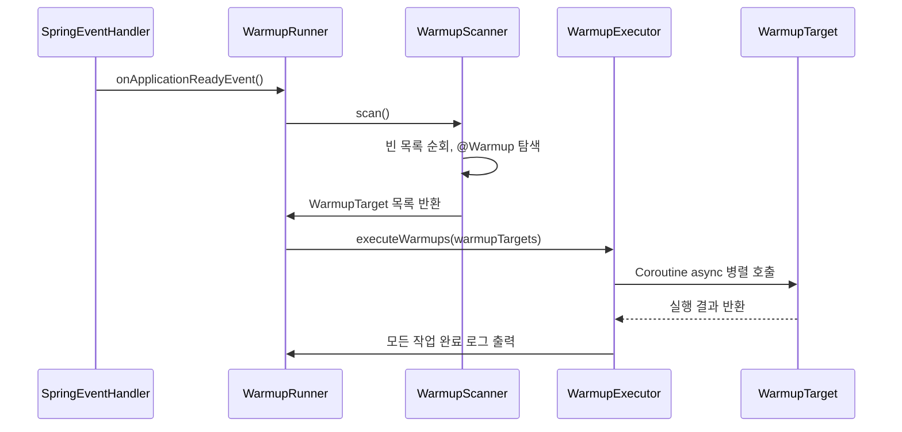

## spring warmup

앞서 [이전글](https://ydj515.github.io/posts/spring-warmup/)의 예제처럼 springboot의 기동시 REST API의 latency를 개선할 수 있었습니다. 이번에는 이 warmup과정을 `Kotlin Coroutine`을 활용해 좀 더 우아하게 개선해보았습니다.

## coroutine

먼저 coroutine이 무엇인지 간략하게 설명합니다.

"Coroutine은 Kotlin에서 제공하는 경량 비동기 프로그래밍 모델입니다. 별도의 쓰레드를 생성하지 않고도 비동기 처리를 효율적으로 작성할 수 있어, Warmup과 같은 반복적이고 독립적인 작업을 처리하기에 적합합니다."

## 기존 Warmup 방식

기존의 warmup 방식은 아래와 같이 단순히 controller의 메소드를 실행하여 진행하였습니다.

```kotlin
@Component
class SpringEventHandler(
    private val productController: ProductController,
    private val userController: UserController,
) {
    @EventListener(ApplicationReadyEvent::class)
    fun onApplicationReadyEvent(event: ApplicationReadyEvent?) {
        println("ApplicationReadyEvent!")
        println("warm up")
        userController.getUsers()
        productController.getProducts()
    }
}
```

그러나, 위의 코드는 다음과 같은 문제점을 가지고 있습니다.

1. 블로킹 방식
   - userController.getUsers(), productController.getProducts()가 순차적으로 실행되기 때문에, 각 메서드가 완료될 때까지 다음 호출이 대기합니다.
   - 호출 대상이 많아질수록 애플리케이션 기동 시간이 길어질 수 있습니다.
2. 리소스 활용 비효율
   - 단일 Thread 내에서 순차적으로 실행되므로, CPU나 네트워크 I/O를 활용하지 못하고 대기 시간이 낭비됩니다.
3. 확장성 부족
   - Warmup 대상이 늘어날 경우, controller 호출을 하나씩 추가하는 방식은 코드 관리가 번거롭고 유지보수에 취약합니다.

이러한 단점을 개선하기 위해, **Kotlin Coroutine을 활용해 Warmup을 비동기적으로 처리해보았습니다.**

## 개선된 Warmup 설계 아이디어

앞서 언급한 문제를 해결하기 위해 저는 아래와 같은 구조로 Warmup을 설계했습니다.


1. 블로킹 방식, 리소스 활용 비효율 -> 비동기 병렬 처리
   - Kotlin Coroutine을 사용해 모든 Warmup 메서드를 병렬로 실행하여 네트워크/DB 응답 대기시간을 최소화합니다.
2. 확장성 부족 -> 어노테이션 기반 자동 탐색
   - @Warmup 어노테이션을 활용해 대상 메서드나 클래스를 마킹, 스캐너가 자동으로 탐색하여 실행 대상을 수집합니다.

이렇게 설계하면 warmup 대상이 추가되더라도 어노테이션만 붙이면 자동으로 실행되므로 코드 유지보수가 훨씬 간결하고 안전합니다.

## 클래스 설계

위에서 설계한 아이디어를 기반으로 필요한 클래스를 설계하였습니다. 


| 클래스명             | 역할 설명                                                               |
| -------------------- | ----------------------------------------------------------------------- |
| `@Warmup`            | Warmup 대상임을 표시하는 커스텀 어노테이션                              |
| `SpringEventHandler` | Spring Boot 기동 완료 이벤트를 받아 Warmup을 시작하는 이벤트 핸들러     |
| `WarmupRunner`       | Warmup 프로세스의 전체 흐름을 관리하는 컨트롤러 역할 클래스             |
| `WarmupScanner`      | `@Warmup` 어노테이션이 붙은 Bean과 메서드를 스캔하여 리스트로 반환      |
| `WarmupExecutor`     | Coroutine을 활용해 Warmup 메서드들을 병렬로 실행하는 실행기 역할 클래스 |
| `WarmupTarget`       | 실제로 실행할 Warmup 대상 정보를 담는 데이터 클래스                     |


> **어노테이션 기반으로 Warmup 대상을 자동으로 탐색하고, Coroutine을 활용해 병렬로 실행하는 구조는 반복적인 코드 수정을 줄이는 동시에, 블로킹 방식과 리소스 활용 비효율, 그리고 확장성 부족 문제를 효과적으로 해결할 수 있습니다.**
{:.prompt-info}

## 클래스간 실행 흐름

위의 설계된 클래스를 토대로 sequenceDiagram을 작성하고, 각 클래스 간의 흐름을 가시화합니다.



## 코드 구현

> kotlin, springboot3.x기준으로 설명합니다.  
> java17과 전체 sample은 [github-sample](https://github.com/ydj515/blog-example/tree/main/warmup-example)를 참조해주세요.

### @Warmup 어노테이션

**이 어노테이션은 클래스나 메서드에 붙여서 warmup 대상임을 나타냅니다.**

```kotlin
@Target(AnnotationTarget.CLASS, AnnotationTarget.FUNCTION)
@Retention(AnnotationRetention.RUNTIME)
annotation class Warmup
```

- @Warmup 어노테이션은 클래스나 메서드에 붙여 사용되며, 이 어노테이션이 붙은 클래스나 메서드는 warmup 대상으로 자동으로 스캔됩니다.
- @Retention(AnnotationRetention.RUNTIME)을 사용하여 런타임에 어노테이션 정보를 활용할 수 있습니다.

### WarmupRunner

**WarmupRunner는 전체 warmup 프로세스를 관리하는 클래스입니다. 이 클래스는 WarmupScanner와 WarmupExecutor를 사용하여 실제 warmup 메서드를 스캔하고 병렬로 실행합니다.**

```kotlin
class WarmupRunner(
    private val applicationContext: ApplicationContext
) {
    fun run() = runBlocking {
        val scanner = WarmupScanner(applicationContext)
        val executor = WarmupExecutor()

        println("Start warmup tasks...")
        val warmups = scanner.scan()
        executor.executeWarmups(warmups)
        println("All warmup tasks completed.")
    }
}
```

- run() 메서드에서 WarmupScanner를 통해 @Warmup 어노테이션이 붙은 메서드를 스캔하고, WarmupExecutor로 이를 병렬 실행합니다.
- 애플리케이션 시작 시점에 warmup 작업을 관리하는 핵심 역할을 담당합니다.

### WarmupScanner

**WarmupScanner 클래스는 @Warmup 어노테이션이 붙은 메서드나 클래스를 찾아서 그 대상들을 스캔하고 목록으로 반환하는 역할을 합니다.**

```kotlin
class WarmupScanner(private val applicationContext: ApplicationContext) {
    data class WarmupTarget(val bean: Any, val methodName: String, val method: () -> Unit)

    fun scan(): List<WarmupTarget> {
        val warmups = mutableListOf<WarmupTarget>()
        val beanNames = applicationContext.beanDefinitionNames

        for (beanName in beanNames) {
            val bean = applicationContext.getBean(beanName)
            val targetClass = AopUtils.getTargetClass(bean)

            // 클래스에 @Warmup이 붙어있으면 모든 public method 추가
            if (targetClass.isAnnotationPresent(Warmup::class.java)) {
                for (method in targetClass.methods) {
                    if (method.declaringClass != Any::class.java && method.parameterCount == 0) { // 테스트를 위해 파라미터 없는것만 filtering
                        warmups.add(WarmupTarget(bean, method.name) {
                            method.invoke(bean)
                        })
                    }
                }
            }

            // 메서드에 @Warmup이 붙은 경우
            for (method in targetClass.declaredMethods) {
                if (method.getAnnotation(Warmup::class.java) != null && method.parameterCount == 0) { // 테스트를 위해 파라미터 없는것만 filtering
                    method.isAccessible = true
                    warmups.add(WarmupTarget(bean, method.name) {
                        method.invoke(bean)
                    })
                }
            }
        }
        return warmups
    }
}
```

- scan() 메서드는 Spring Bean들을 순회하면서 @Warmup 어노테이션이 붙은 클래스와 메서드를 찾아 WarmupTarget 목록을 반환합니다.
- 이 과정에서 메서드의 파라미터가 없는 것만 필터링하여 warmup 대상으로 추가합니다.


### WarmupExecutor

**WarmupExecutor 클래스는 Coroutine을 활용하여 warmup 메서드들을 병렬로 실행하는 역할을 합니다.**
	
    ```kotlin
    class WarmupExecutor {
        suspend fun executeWarmups(warmups: List<WarmupScanner.WarmupTarget>) = coroutineScope {
            val jobs = warmups.map { warmup ->
                async {
                    val time = measureTimeMillis {
                        try {
                            println("Executing: ${warmup.bean::class.simpleName}.${warmup.methodName}")
                            warmup.method()
                            println("Success: ${warmup.methodName}")
                        } catch (e: Exception) {
                            println("Failed: ${warmup.methodName} - ${e.message}")
                        }
                    }
                    println("${warmup.methodName} took ${time}ms")
                }
            }
            jobs.forEach { it.await() }
        }
    }
    ```
- executeWarmups() 메서드는 Coroutine을 사용해 병렬로 warmup 메서드를 실행합니다. async를 활용하여 여러 메서드를 동시에 실행하여 성능을 최적화합니다.
- 각 메서드 실행 결과와 소요 시간을 출력하여, warmup 작업의 진행 상황을 실시간으로 확인할 수 있습니다.

다만 위의 구조는 `jobs.forEach { it.await() }` 에서 전부 완료될 때까지 기다리는 블로킹 구조입니다.

그래서 정확히는 **실행은 비동기적이지만, 전체 warmup이 끝날 때까지 대기하는 구조입니다.** 저는 Warmup이 모두 완료된 후에 애플리케이션이 정상적으로 서비스 요청을 받을 수 있도록 설계하였기 때문에, 해당 방식으로 흐름을 구성하였습니다.


만약 진짜로 애플리케이션 부팅을 막지 않고 background warmup을 원한다면 `coroutineScope {}` 대신 `GlobalScope.launch {}`를 사용할 수 있습니다.

> [github-sample](https://github.com/ydj515/blog-example/blob/main/warmup-example/src/main/kotlin/com/example/warmupexample/warmup/WarmupExecutor.kt)에서 executeWarmupsAsync 메소드를 참조해주세요.

### WarmupTarget

**WarmupTarget은 실제로 실행할 메서드와 그 메서드에 대한 정보를 담는 데이터 클래스입니다. 이 클래스는 WarmupExecutor에서 병렬 실행되는 각 메서드의 정보를 관리하는 역할을 합니다.**

(WarmupScanner class 안에 포함되어 있습니다.)

```kotlin
data class WarmupTarget(val bean: Any, val methodName: String, val method: () -> Unit)
```

### SpringEventHandler

**마지막으로 SpringEventHandler에서 WarmupRunner를 실행시켜 warmup 프로세스를 시작하도록 수정합니다.**

```kotlin
@Component
class SpringEventHandler(
    private val applicationContext: ApplicationContext,
) {
    @EventListener(ApplicationReadyEvent::class)
    fun onApplicationReadyEvent(event: ApplicationReadyEvent?) {
        println("ApplicationReadyEvent!")
        WarmupRunner(applicationContext).run()
    }
}
```

## 결론
Warmup 프로세스는 어노테이션 기반의 유연한 설계와 Coroutine을 활용한 비동기 실행을 통해 개선해보았습니다.  

위 예제에서는 테스트 용도로 파라미터가 없는 메서드만 필터링하여 Warmup을 수행했지만, 실제 환경에서는 필요에 따라 파라미터 처리, 실행 순서 지정, 예외 처리 전략 등을 추가하여 보다 유연하고 확장 가능한 Warmup 구조를 구현할 수 있습니다.
