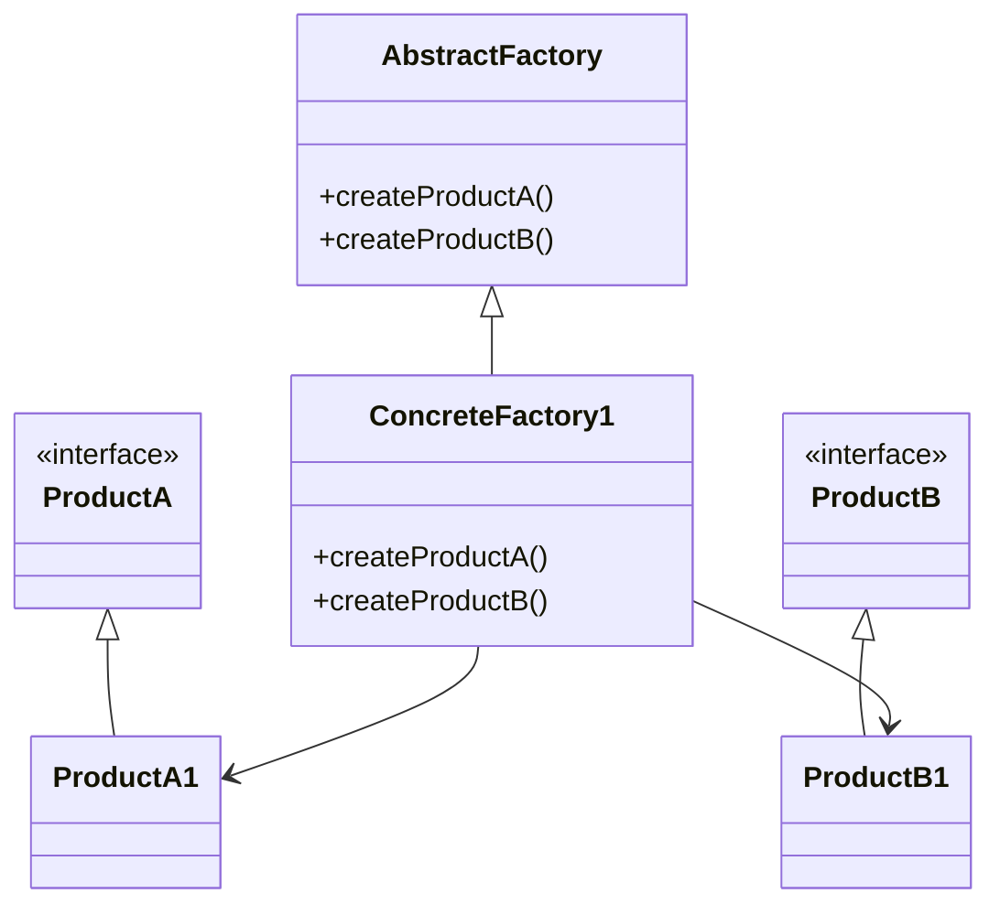
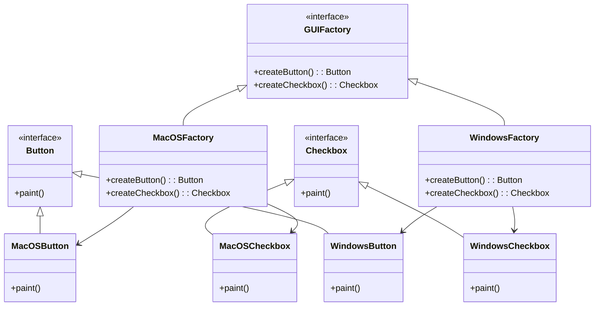
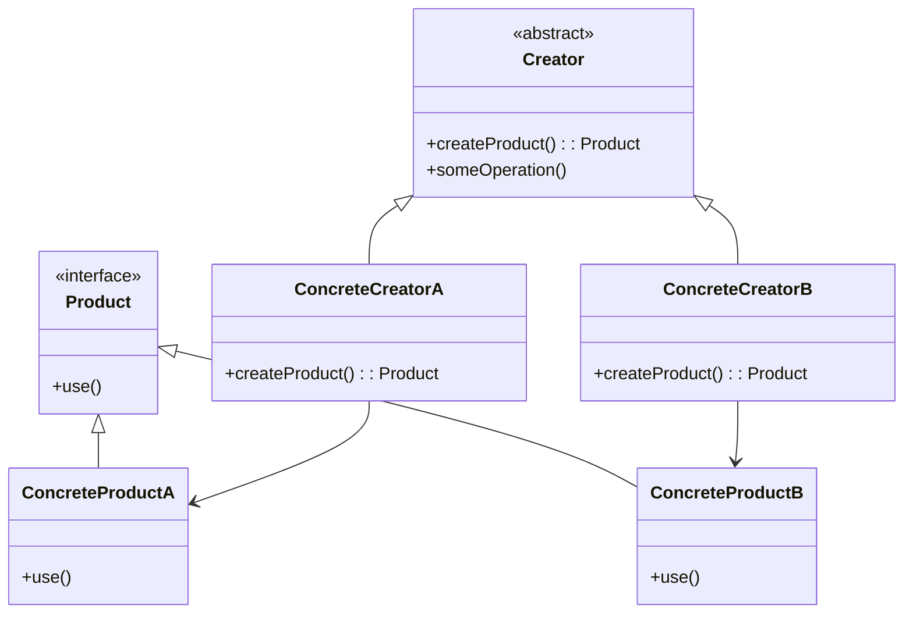

## 정의

관련 객체들의 구상 클래스들을 지정하지 않고도 관련 객체들의 모음을 생성할 수 있도록 하는 생성패턴입니다.

클라이언트는 구체적인 클래스에 의존하지 않고, 인터페이스(혹은 추상 클래스)를 통해 제품을 생성하므로, 코드의 결합도를 낮추고 확장성을 높일 수 있습니다.

## 구현

추상 팩토리는 product를 생성하기 위한 인터페이스를 정의하지만, 실제 product create는 concrete 팩토리에게 위임합니다.

클라이언트 코드는 생성자 호출(new)로 직접 product를 생성하는 대신 팩토리 객체의 생성 메소드를 호출합니다.

## 구성도

- AbstractFactory: 제품을 생성하는 인터페이스
- ConcreteFactory: 실제 제품들을 생성하는 클래스
- ProductA, ProductB: 인터페이스 또는 추상 제품
- ProductA1, ProductA2...: 실제 제품



## 사용 예시

- **운영체제(OS)에 따라 다른 GUI 위젯을 사용해야 할 때 (윈도우 vs 맥)**
- DB 벤더에 따라 SQL 커넥터가 달라야 할 때 (MySQL vs Oracle)
- 특정 "제품군"을 통일된 방식으로 만들어야 할 때 (버튼 + 체크박스 + 텍스트필드 등 UI 컴포넌트)
- **운영체제(OS)에 따라 다른 GUI 위젯을 사용해야 할 때 (윈도우 vs 맥)의 예시**



## java code example

```java
// button: 인터페이스 또는 추상 제품
public interface Button {
    void paint();
}

// 구체화된 제품
public class MacOSButton implements Button {

    @Override
    public void paint() {
        System.out.println("You have created MacOSButton.");
    }
}

// 구체화된 제품
public class WindowsButton implements Button {

    @Override
    public void paint() {
        System.out.println("You have created WindowsButton.");
    }
}

// checkbox : 인터페이스 또는 추상 제품
public interface Checkbox {
    void paint();
}

// 구체화된 제품
public class MacOSCheckbox implements Checkbox {

    @Override
    public void paint() {
        System.out.println("You have created MacOSCheckbox.");
    }
}

// 구체화된 제품
public class WindowsCheckbox implements Checkbox {

    @Override
    public void paint() {
        System.out.println("You have created WindowsCheckbox.");
    }
}

// abstract factory : 행동 정의
public interface GUIFactory {
    Button createButton();
    Checkbox createCheckbox();
}

// concrete factory
public class MacOSFactory implements GUIFactory {

    @Override
    public Button createButton() {
        return new MacOSButton();
    }

    @Override
    public Checkbox createCheckbox() {
        return new MacOSCheckbox();
    }
}

// concrete factory
public class WindowsFactory implements GUIFactory {

    @Override
    public Button createButton() {
        return new WindowsButton();
    }

    @Override
    public Checkbox createCheckbox() {
        return new WindowsCheckbox();
    }
}

// demo
public class Demo {
    private static Application configureApplication() {
        Application app;
        GUIFactory factory;
        String osName = System.getProperty("os.name").toLowerCase();
        if (osName.contains("mac")) {
            factory = new MacOSFactory();
        } else {
            factory = new WindowsFactory();
        }
        app = new Application(factory);
        return app;
    }

    public static void main(String[] args) {
        Application app = configureApplication();
        app.paint();
    }
}
```

## spring에서 사용 예시: AOP Proxy

Spring AOP에서는 프록시 생성 방식(JDK 동적 프록시, CGLIB)을 내부 전략에 따라 결정합니다.

```java
public interface AopProxyFactory {
	AopProxy createAopProxy(AdvisedSupport config) throws AopConfigException;
}

// 간략하게
public class DefaultAopProxyFactory implements AopProxyFactory, Serializable {
	@Override
	public AopProxy createAopProxy(AdvisedSupport config) throws AopConfigException {
		if (config.isOptimize() || config.isProxyTargetClass() || !config.hasUserSuppliedInterfaces()) {
			Class<?> targetClass = config.getTargetClass();
			
			if (targetClass == null || targetClass.isInterface() ||
					Proxy.isProxyClass(targetClass) || ClassUtils.isLambdaClass(targetClass)) {
				return new JdkDynamicAopProxy(config);
			}
			return new ObjenesisCglibAopProxy(config);
		}
		else {
			return new JdkDynamicAopProxy(config);
		}
	}
}
```

## 장점

- 구체 클래스와 결합도 없음 (OCP 원칙 만족)
- 일관된 객체 생성 보장 (제품군 간 불일치 방지)
- 테스트 및 확장에 유리함

## 단점

- 클래스 수 증가
- 새로운 제품군 추가 시 추상 팩토리 변경 필요

## 팩토리 메소드 패턴과 차이점

Factory Method는 **하나의 제품을 만드는 데 집중**하지만,
Abstract Factory는 **여러 제품들을 통일성 있게 묶어서 생성**하는 데 초점이 있습니다.

| 구분    | 팩토리 메소드                 | 추상 팩토리                             |
| ------- | ----------------------------- | --------------------------------------- |
| 제품    | **단일 제품 생성**            | **제품군 생성**                         |
| 구조    | 서브클래스에서 객체 생성 책임 | 여러 객체를 조합해서 생성               |
| 확장성  | 새로운 제품 추가 쉬움         | 제품군을 바꿔치기 쉬움                  |
| 사용 예 | Document 생성기               | 버튼 + 체크박스 + 메뉴 같이 동작하는 UI |

### 팩토리 메소드

