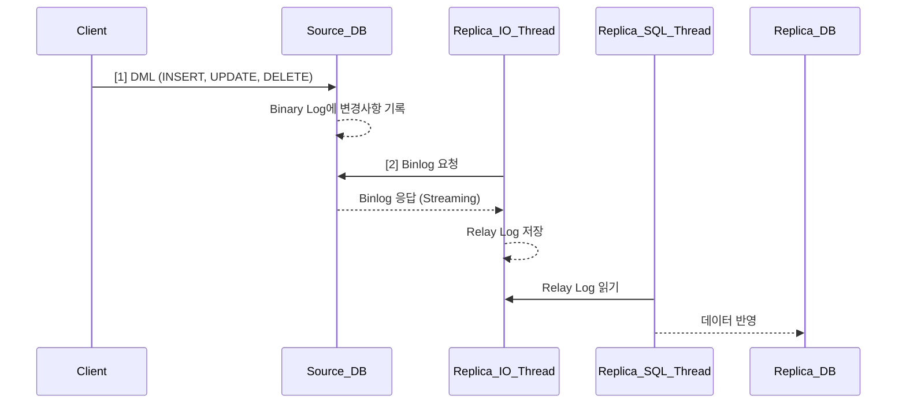

## Binlog & Replication
MySQL의 복제(Replication) 과정은 데이터베이스 고가용성(HA), 확장성(Scale-out), 백업 등의 목적을 위해 자주 활용되는 구조입니다.

복제는 Source(MySQL 8.0 이후 terminology로는 Source, 이전에는 Source)와 Replica(이전에는 Slave) 간의 Binary Log 기반 동기화 메커니즘으로 작동합니다.

Binlog와 Replication에 대해서 설명합니다.

## Binlog
**Binary Log (binlog)**는 MySQL에서 **데이터 변경 이벤트를 이진 형식으로 기록**하는 로그입니다.

`INSERT`, `UPDATE`, `DELETE`와 같은 **쓰기 작업**에 대한 정보를 기록하며, `SELECT` 같은 **읽기 작업**은 기록되지 않습니다.

- **트랜잭션 커밋 시점**에 기록됨  
- **쿼리 자체 또는 변경된 값**을 기록  
- 사람이 직접 읽기 어려운 **이진(Binary)** 형식

### Binlog를 저장하는 이유

이런 Binlog를 저장하는 이유는 `변경 이력 기록하여 복제, 복구`를 히기위해 사용됩니다.

| 목적                   | 설명                                                                                                      |
| ---------------------- | --------------------------------------------------------------------------------------------------------- |
| **복제 (Replication)** | Source에서 실행된 변경 사항을 Slave로 전파하여 **동기화된 복제 환경**을 구성합니다.                       |
| **장애 복구**          | 데이터베이스를 특정 시점으로 되돌릴 수 있어 **point-in-time 복구**에 사용됩니다. (`mysqldump` + `binlog`) |
| **감사 로그 (Audit)**  | 데이터가 언제, 어떻게 변경되었는지 **분석 및 감사** 용도로 활용할 수 있습니다.                            |
| **디버깅**             | 어떤 변경 쿼리가 실행됐는지 추적할 수 있어 **운영 장애 진단**에 유용합니다.                               |

### MVCC에서 사용하는 Undo log와는 어떤게 다른가요?

MySQL의 Binlog 자체는 MVCC와 직접적인 관련은 없습니다. 다만, 이 둘은 서로 다른 목적을 가지고 있으며, 간접적으로 시스템의 일관성과 복구 전략에 기여합니다.

InnoDB 엔진에서 MVCC는 `undo log`를 활용해 트랜잭션 시점의 일관된 데이터를 제공합니다. `Binlog`는 트랜잭션이 commit 이후에 기록됩니다. 즉, binlog는 커밋된 결과만 저장하며 롤백된 쿼리는 기록되지 않습니다.

**따라서 MVCC로 실행 중인 트랜잭션 상태를 Binlog가 기록하는 일은 없습니다.**

- undo log:  트랜잭션 롤백 / MVCC 스냅샷 유지용
- binlog: 복제 / 장애 복구용

## Binlog 저장 방식 (binlog_format)

MySQL에서는 아래 3가지 저장 포맷을 설정할 수 있습니다.

### STATEMENT 기반

**실행된 SQL 문 자체를 기록**하는 방식입니다. 이 로그를 Replica 서버에서 동일하게 실행합니다. 

- 예:
  ```sql
  INSERT INTO users (name) VALUES ('Alice');
  ```

- 장점
  - 로그가 짧고 저장 공간 절약
  - 사람이 읽기 쉬움

- 단점
  - `NOW()`, `UUID()`, `RAND()`, `USER()`, `SYSDATE()` 등 **비결정적 함수**로 인해 복제 결과가 달라질 수 있음
  - **동시성 문제** 발생 가능

위에서 언급했듯이 statement기반의 저장방식은 `NOW()`, `UUID()`, `RAND()`, `USER()`, `SYSDATE()` 같은 비결정적 함수는 실행할 때마다 결과가 달라질 수 있습니다.

| 함수     | 설명                                        |
| -------- | ------------------------------------------- |
| `NOW()`  | 실행 시점에 따라 시간이 다름                |
| `RAND()` | 매번 결과가 달라 복제시 다른 값 저장 가능성 |
| `UUID()` | 전혀 다른 식별자 생성됨                     |
| `USER()` | 호출 위치의 유저명이 다를 수 있음           |

따라서 동일한 SQL이라도 Source와 Replica에서 실행 결과가 달라질 수 있습니다.

예를 들어서 문제 상황입니다. 아래의 쿼리가 Source 서버에서 실행되었습니다.

```sql
-- Source에서 실행
INSERT INTO logs (timestamp) VALUES (NOW());
```

이 시점의 NOW()는 예를 들어 "2024-05-25 10:12:00" 이라고 가정해봅시다. Statement 기반 복제에서는 다음과 같이 binary log에 기록됩니다.

```sql
# Binary Log
INSERT INTO orders (order_time) VALUES (NOW());
```

이 로그가 Replica로 복제되고, Replica 서버에서 실행됩니다. 그런데 Replica가 쿼리를 실행하는 시점은 Source보다 조금 늦습니다.

그러나 Source와 Replica 서버에서는 실행 시점이 다르므로 NOW()가 다른 값이 들어가게됩니다.

```sql
-- NOW()가 다르게 평가됨
INSERT INTO orders (order_time) VALUES ('2024-05-25 10:12:03');
```

결과적으로, Source와 Replica 간의 데이터가 불일치하게 됩니다.

statement기반 저장 방식은 로그에 `NOW()` 함수 자체가 기록되므로 실행될 때 시점이 달라져 **데이터가 불일치**가 있을 수 있음을 유의해야합니다.

이러한 데이터 불일치 문제를 해결하기 위해서는 다음과 같이 해결할 수 있습니다.

1. Row 기반 복제 (binlog_format = ROW) ->  SQL 결과(데이터 변경 내용)를 로그에 저장하므로 이런 문제가 없음.
2. Mixed 방식 -> MySQL이 쿼리를 보고, 문제가 될 가능성이 있으면 자동으로 ROW 방식 사용.
3. 비결정적 함수를 Source에서 미리 평가해서 값으로 치환( INSERT INTO orders (order_time) VALUES ('2024-05-25 10:12:00'); )

### ROW 기반

Row 기반 Binlog는 SQL 쿼리문이 아닌, **실제로 변경된 데이터 행(row)의 값을 그대로 기록**하는 방식입니다. 복제 정확성이 매우 높은 것이 특징입니다. 이런 특징때문에 고정밀 복제가 중요한 서비스 (ex. 금융 서비스), 동기화가 필수인 마스터-슬레이브 구조, 비결정적 함수나 트리거가 많이 사용되는 환경 사용됩니다.

INSERT, UPDATE, DELETE와 같은 변경 SQL이 실행되면, MySQL은 해당 쿼리를 기록하지 않고 변경된 row의 상태를 binlog에 저장합니다.

```sql
-- 실행된 쿼리
INSERT INTO users (name) VALUES ('Alice');

-- Binlog에 기록되는 내용
Table: users
Before: (없음)
After:  (id=1, name='Alice')
```

- 장점
  - SQL 쿼리의 해석 여부와 무관하게 항상 정확하게 복제됨
  - NOW(), UUID() 같은 비결정적 함수 사용 시에도 안전
  - 내부 논리보다 결과만 반영되므로 복잡한 로직에서도 안정성 확보
  - 쿼리를 다시 실행하는 방식이 아니므로, 동시성 이슈 없음

- 단점
  - 데이터 자체를 기록하므로, 대량 데이터 변경 시 binlog 크기가 매우 커짐
  - 사람이 해석하기 어렵고, 복구 시 수작업 분석이 힘듦
  - 변경된 row 데이터를 해석하려면 테이블 구조를 정확히 알고 있어야 함
  - 데이터 자체가 노출되므로 민감한 정보에 대한 별도 보안 조치 필요

다만 위의 binlog 크기가 커지는 문제가 발생하기에 아래의 주의사항을 반드시 살펴야합니다.

- binlog 백업 주기를 짧게 유지하거나, 자동 삭제 정책을 설정해야 합니다.
- mysqlbinlog로 분석 시 데이터 해석이 어려울 수 있으므로, mysqldump와 함께 활용해 시점 복구를 준비하는 것이 좋습니다.
- binlog_row_image=MINIMAL 설정 시 변경된 컬럼만 기록해 로그 사이즈를 줄일 수 있습니다.

```sql
[mysqld]
binlog-format=ROW
binlog_row_image=MINIMAL
```

### MIXED 기반

Mixed 기반 Binlog는 Statement 방식과 Row 방식을 자동으로 혼합하여 사용하는 전략입니다. MySQL이 쿼리의 특성(결정적 여부 등)을 분석한 후, 가장 적절한 방식으로 binlog를 기록합니다.

**기본적으로 STATEMENT 방식으로 로그를 기록합니다. 단, 다음과 같은 비결정적(non-deterministic) 요소(UUID(), NOW(), RAND(), CURRENT_DATE 등 사용자 정의 함수(UDF), 트리거(trigger), 저장 프로시저 등 포함된 경우)가 포함된 SQL 구문은 자동으로 ROW 방식으로 전환됩니다.**


- `STATEMENT`와 `ROW`를 **자동으로 전환**하여 사용
- MySQL이 내부적으로 **비결정성 쿼리 판단** 후 적절한 포맷 선택

- 장점
  - MySQL이 쿼리의 결정성 여부를 판단하여 자동으로 최적 포맷 선택
  - 대부분의 쿼리는 STATEMENT로 기록되므로, 로그 크기를 줄일 수 있음
  - 비결정적/위험한 쿼리만 ROW 방식으로 기록, 복제 불일치 방지
  - 개발자가 별도 판단하지 않아도 되어, 운영 부담 감소

- 단점
  - 자동 전환 로직이 추가되면서 MySQL 내부 동작이 복잡해짐
  - STATEMENT와 ROW 방식이 혼합되므로 binlog 분석이 까다로움
  - 특정 쿼리를 어떤 방식으로 기록할지 명확히 예측하기 어려움

특별한 이유가 없다면 Mixed는 일반적으로 가장 실용적인 선택입니다. 대규모 트랜잭션이 많고, 쿼리 복잡성이 다양한 서비스에서 Mixed 방식이 효과적입니다. 오픈 소스 기반 분석 시스템과 함께 사용할 경우, log 분석 도구가 ROW, STATEMENT 모두를 이해해야 하므로 약간의 도구 호환성 확인이 필요합니다.

```sql
[mysqld]
log-bin=mysql-bin
binlog-format=MIXED
server-id=1
```

## Binlog 설정

`my.cnf` 또는 `my.ini` 파일에 Binglog의 활성화 여부 및 저장방식을 설정합니다.

```ini
[mysqld]
log-bin = mysql-bin              # binlog 활성화
binlog-format = MIXED           # 또는 ROW / STATEMENT
server-id = 1                   # 고유한 서버 ID (복제 구성 시 필수)
expire_logs_days = 7           # 오래된 로그 자동 삭제
sync_binlog = 1                 # 트랜잭션 커밋마다 디스크 flush (안정성 ↑)
```

## Binlog 관련 명령어

- 현재 binlog 파일 및 위치 확인

```sql
SHOW Source STATUS;
```

- binlog 목록 보기

```sql
SHOW BINARY LOGS;
```

- 특정 binlog 파일의 내용 조회

```sql
mysqlbinlog mysql-bin.000001
```

- 현재 포맷 확인

```sql
SHOW VARIABLES LIKE 'binlog_format';
```

## Replication(복제)

MySQL의 복제(Replication) 과정은 데이터베이스 고가용성(HA), 확장성(Scale-out), 백업 등의 목적을 위해 자주 활용되는 구조입니다. 복제는 Source(MySQL 8.0 이후 terminology로는 Source, 이전에는 Master)와 Replica(이전에는 Slave) 간의 Binary Log 기반 동기화 메커니즘으로 작동합니다.

Source 서버에서 데이터 변경 쿼리가 실행되고, 선택된 로그 저장 방식에 따라 Binary log에 기록된 후, Replica 서버의 IO Thread가 Binary log를 읽어와 Replica 서버의 Relay log로 전송합니다.

Relay log는 Replica 서버에서 Source 서버의 Binary log를 저장하는 임시 저장소 역할을 하며, 이곳에 저장된 로그를 기반으로 Replica 서버의 SQL 스레드가 실제 데이터베이스에 변경 사항을 적용합니다. 이 과정은 매우 효율적으로 설계되어 일반적으로 약 100밀리초 이내에 데이터 동기화가 완료됩니다. 이러한 빠른 동기화 속도 덕분에 원본과 복제 서버 간의 데이터 일관성이 실시간에 가깝게 유지될 수 있습니다.

이런 복제 과정에 대해 설명합니다.

### MySQL 복제 과정

1. Source에서 데이터 변경 발생

사용자가 INSERT, UPDATE, DELETE 등의 쓰기 쿼리를 Source 서버에 실행합니다. 이때 MySQL의 Binary Log(binlog) 설정이 활성화되어 있다면, 이 변경 사항이 설정된 binlog 포맷(STATEMENT, ROW, MIXED)에 따라 Binary Log에 기록됩니다.

- STATEMENT: `UPDATE users SET name = 'Alice' WHERE id = 1`
- ROW: 변경된 row의 before/after 값을 직접 기록

2. Replica의 I/O Thread가 binlog 읽기

Replica 서버는 Source에 연결된 I/O Thread를 통해 binlog를 읽습니다. 이 Thread는 Source로부터 Binary Log 파일을 순차적으로 스트리밍합니다.

I/O Thread는 다음을 수행합니다.

- MASTER_LOG_FILE, MASTER_LOG_POS 정보를 사용해 binlog 위치 파악
- Source 서버로부터 binlog를 네트워크를 통해 수신
- 이를 로컬 저장소인 Relay Log에 저장

3. Relay Log 저장

Relay Log는 Replica 서버에 저장되는 중간 형태의 로그입니다. 이것은 Source의 Binary Log를 그대로 로컬로 복제한 것입니다. 이 파일은 디스크에 저장되며, 이름은 일반적으로 relay-log.000001 형태입니다.

4. SQL Thread가 Relay Log 실행

Replica의 SQL Thread는 Relay Log를 읽고, 해당 내용을 실행하여 로컬 DB에 실제 반영합니다. 이 과정은 Source 서버의 쿼리를 그대로 복제하는 과정입니다. binlog-format에 따라 처리 방식이 다릅니다.

- ROW 포맷: 변경된 데이터 적용
- STATEMENT 포맷: 쿼리 실행

트랜잭션이 완료된 순서대로 처리되므로 일관성 유지가 보장됩니다.

### 지연 시간

네트워크 지연, 시스템 부하, 트랜잭션 크기에 따라 달라지며 일반적인 지연 시간은 수십 밀리초 ~ 수백 밀리초 수준입니다. SHOW SLAVE STATUS -> Seconds_Behind_Master를 통해 확인 가능합니다.


### 복제 흐름 요약 (다이어그램)

다음은 복제 흐름의 다이어그램입니다.



### 데이터 일관성 보장 메커니즘

- 트랜잭션 단위로 binlog를 기록 -> 복제 시에도 트랜잭션 단위로 처리합니다.
- 로그의 위치 정보(log_file, log_pos)로 정확한 재실행 보장합니다.
- binlog_format=ROW인 경우 데이터 자체를 복제하므로 높은 정확도를 보여줍니다.

### 관련 설정 예시 (my.cnf)

```ini
# Source 서버
[mysqld]
log-bin=mysql-bin
server-id=1
binlog-format=ROW

# Replica 서버
[mysqld]
server-id=2
relay-log=relay-log
read-only=1
```

이 복제 메커니즘을 이해하면 데이터 일관성 보장, 고가용성 설계, Failover 구조 설계에 큰 도움이 됩니다. 필요시 semi-synchronous replication이나 GTID 기반 복제 등도 함께 고려해 볼 수 있습니다.

## 정리

MySQL의 **Binary Log(binlog)**는 복제 및 장애 복구에 핵심적인 역할을 하며, 기록 방식에 따라 성능과 정확성에 큰 영향을 미칩니다.

| 항목        | STATEMENT         | ROW                   | MIXED     |
| ----------- | ----------------- | --------------------- | --------- |
| 기록 내용   | SQL문             | 변경된 행             | 자동 판단 |
| 공간 효율   | 좋음              | 나쁨                  | 중간      |
| 복제 정확성 | 낮음              | 높음                  | 높음      |
| 권장 상황   | 테스트, 단순 쿼리 | 실서비스, 민감 데이터 | 일반 운영 |

각 방식은 장단점이 뚜렷하므로, 시스템 특성에 따라 적절한 binlog 포맷을 선택하는 것이 중요합니다. 일반적으로는 ROW 방식이 복제 정확성 면에서 안전하며, 공간 효율까지 고려하고 싶다면 MIXED 방식을 선택하는 것이 좋다고 볼 수 있습니다.


[출처]
- [MySQL Binary Log 공식 문서](https://dev.mysql.com/doc/refman/8.0/en/binary-log.html)
- [MySQL Replication Formats](https://dev.mysql.com/doc/refman/8.0/en/replication-formats.html)
