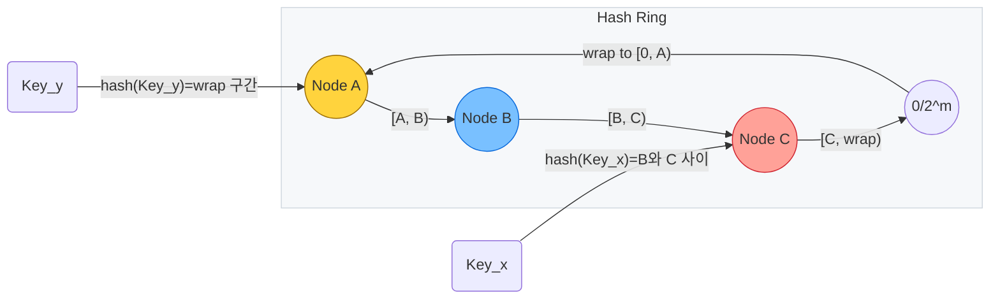
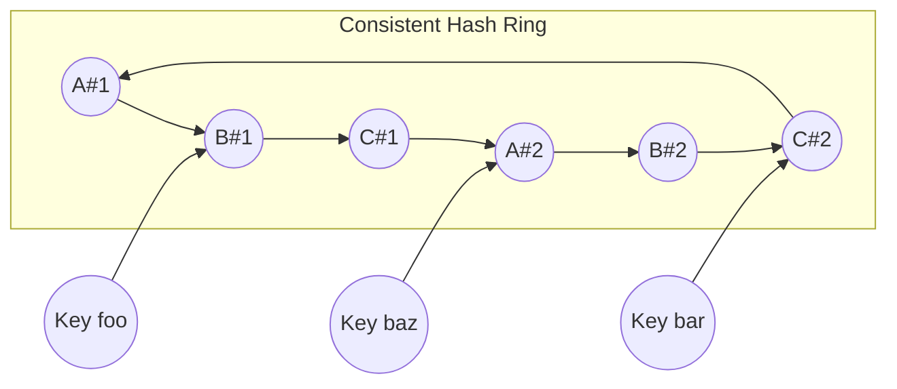

## 왜 안정 해시(Consistent Hashing)가 필요한가?

분산 캐시, 분산 키-값 저장소, 메시지 큐 등 수평 확장이 필수인 시스템은 노드를 자유롭게 추가하고 제거할 수 있어야 합니다. 하지만 일반적인 모듈러 해시(`hash(key) % N`) 방식은 노드 수 `N`이 변할 때 전체 키의 재분배가 일어나 캐시에 저장된 대부분의 데이터를 무효화합니다. 안정 해시는 **노드 변경 시 재배치되는 키 수를 최소화**해, 확장성과 가용성을 동시에 확보할 수 있도록 설계된 해싱 전략입니다.

### 전통적인 모듈러 해시의 문제

- `N`이 4에서 5로 늘어날 때 모든 키의 목적지가 뒤틀려 캐시 미스가 폭증합니다.
- 데이터 마이그레이션이 필요한 동안 읽기/쓰기에 지연이 발생하거나 트래픽 스파이크가 발생합니다.
- 동일한 데이터가 여러 노드로 이동하면서 네트워크 비용과 운영 복잡도가 커집니다.

안정 해시의 핵심 아이디어는 **키와 노드를 동일한 해시 공간에 투영해 순환(ring) 구조를 만들고**, 각 키를 오른쪽(시계 방향)에서 만나는 첫 번째 노드에 할당하는 것입니다. 노드의 증감은 링에서 일부 구간만 영향을 받기 때문에 전체 키 재배치 없이 동작합니다.

## 안정 해시의 핵심 개념

1. **균일한 해시 공간**: 일반적으로 `0`에서 `2^32-1` 범위를 사용하며, 키와 노드 모두 이 범위로 해싱합니다.
2. **원형 링(Ring)**: 해시 공간의 시작과 끝을 연결해 원형 구조를 만들고, 시계 방향으로 가장 가까운 노드를 선택합니다.
3. **가상 노드(Virtual Node)**: 실제 노드 하나를 해시 공간에 여러 번 매핑해 특정 구간에 키가 몰리는 현상을 줄입니다.

## 해시 링(Hash Ring) 구조

해시 링은 균일한 해시 공간을 원으로 감아 붙인 뒤, 그 둘레에 노드와 키를 함께 배치한 논리 모델입니다.

- **좌표계**: 해시 함수는 키와 노드를 `0`부터 `2^m-1` 사이의 정수 좌표로 사상합니다. `2^32` 또는 `2^64` 범위를 자주 선택합니다.
- **링 감싸기**: 해시 공간의 끝과 시작을 연결해 원형으로 만들면, 가장 큰 값 다음에는 다시 0이 나타납니다. 이 덕분에 wrap-around 처리가 자연스럽습니다.
- **구간(Arc) 할당**: 링을 시계 방향으로 순회할 때 만나는 노드 사이의 구간이 해당 노드가 담당하는 키 범위입니다. 예를 들어 노드 B 직전에 있는 노드 A는 `[A, B)` 구간을 책임집니다.
- **거리 계산**: 두 순간 `x`, `y`의 링 상 거리 `dist(x, y)`는 `((y - x + 2^m) % 2^m)`로 정의합니다. `y`가 `x`보다 작아도 음수가 되지 않도록 모듈러 연산을 사용합니다.



해시 링을 데이터 구조로 표현할 때는 다음 요소들을 고려합니다.

1. **정렬된 노드 목록**: 해시값 기준으로 정렬돼 있어야 가장 가까운 후속 노드를 빠르게 찾을 수 있습니다.
2. **구간 탐색**: `ceiling` 연산이 가능한 트리 구조(`TreeMap`, `B-Tree`, `skip list`)를 사용하면 `O(log N)` 시간에 구간을 찾습니다.
3. **랭크 질의**: 통계 정보를 위해 특정 구간에 속한 키 개수나 비중을 추정해야 할 때 랭크/셀렉트 연산을 추가로 설계합니다.



## 기본 알고리즘 동작

1. **노드 등록**: 각 노드를 해시 함수(예: `SHA-256`, `MurmurHash3`)로 해시해 링 위의 위치를 결정합니다. 가상 노드를 사용할 경우 `nodeId#i` 형태로 여러 위치를 생성합니다.
2. **키 탐색**: 키를 동일한 해시 함수로 해시하고, 정렬된 링 상에서 해당 해시값 이상인 첫 노드를 선택합니다.
3. **시계 방향 순환**: 키 해시가 링에서 마지막 노드보다 크면 가장 첫 노드로 순환합니다.

수학적으로는 다음과 같이 표현할 수 있습니다.

$$
node = \mathrm{successor}\Bigl(\mathrm{hash}(key)\Bigr)
$$

여기서 `successor(x)`는 해시 순서에서 `x`보다 같거나 큰 가장 작은 노드를 반환하되, 없다면 첫 번째 노드를 선택합니다.

## 작은 예제로 살펴보기

- 노드 A, B, C 세 대가 있습니다. (각각 3개의 가상 노드를 사용합니다)
- 키 `foo`, `bar`, `baz`, `qux`를 저장하려고 합니다.

| 항목 | 해시 결과(모듈로 360) | 배치되는 노드 |
| --- | --- | --- |
| A#1 | 45 | A |
| B#1 | 120 | B |
| C#1 | 210 | C |
| A#2 | 275 | A |
| B#2 | 310 | B |
| C#2 | 330 | C |
| foo | 130 | B (B#1) |
| bar | 320 | C (C#2) |
| baz | 260 | A (A#2) |
| qux | 50 | A (A#1) |

노드 C를 제거하면 `bar`와 `baz` 키만 재배치되어 A 또는 B로 이동하고, 나머지 키는 영향을 받지 않습니다.

## 가상 노드(Virtual Node)의 역할

가상 노드는 특정 노드에 키가 집중되는 현상을 줄이는 핵심 장치입니다.

- 노드 수가 적을수록 해시 공간이 넓게 비게 되는데, 가상 노드는 이 공백을 촘촘히 메웁니다.
- 노드 용량에 따라 가상 노드 수를 다르게 설정해 **가중치 기반 분배**를 쉽게 구현할 수 있습니다.
- 일반적으로 `100~200`개의 가상 노드를 사용하면 분산 편차가 3% 이하로 줄어듭니다.

## 가중치와 노드 용량 반영

노드의 CPU, 메모리, 네트워크 대역폭을 반영해 노드마다 서로 다른 가상 노드 개수를 부여할 수 있습니다. 예를 들어 A는 200개, B는 100개, C는 50개로 설정하면 링에서 A 구간이 가장 넓어져 더 많은 키를 담당합니다. 이는 Dynamo, Cassandra 등 주요 분산 시스템이 채택한 방식입니다.

## 데이터 이동량 분석

안정 해시는 노드가 추가되거나 제거될 때도 전체 키 가운데 일부만 이동하도록 설계되었습니다.

- 노드 추가 시: 신규 노드가 담당하는 구간에 속한 키만 옮깁니다. 기대 이동량은 전체 키의 `1 / (노드 수 + 1)` 수준입니다.
- 노드 제거 시: 해당 노드가 담당하던 구간만 다음 노드로 이동합니다. 이동량은 전체 키의 `1 / (노드 수)`에 해당합니다.

이 덕분에 캐시 미스율 상승과 대규모 재해시 비용을 피할 수 있습니다.

## 구현 시 고려 사항

- **해시 함수 선택**: 균일한 분포와 빠른 속도를 모두 고려해야 합니다. MurmurHash3, xxHash 등이 자주 사용됩니다.
- **정렬된 자료구조**: 링을 표현하기 위해 `TreeMap`, `SkipList`, `SortedList`를 사용하면 후속 노드를 빠르게 찾을 수 있습니다.
- **메타데이터 전파**: 분산 환경에서는 노드 목록과 가상 노드 정보가 모든 참여자에게 일관되게 전달돼야 합니다. 지연 전파를 줄이기 위해 Gossip 프로토콜 또는 중앙 레지스트리를 활용합니다.
- **키 복제(Replication)**: 단일 노드 장애에 대비해 시계 방향으로 `R`개의 노드에 추가 복제본을 저장합니다.

```kotlin
class ConsistentHash(
    private val replicas: Int,
    private val hashFn: (String) -> Long
) {
    private val ring = java.util.TreeMap<Long, String>()

    fun addNode(nodeId: String) {
        repeat(replicas) { replica ->
            val hash = hashFn("$nodeId#$replica")
            ring[hash] = nodeId
        }
    }

    fun removeNode(nodeId: String) {
        val iterator = ring.entries.iterator()
        while (iterator.hasNext()) {
            val entry = iterator.next()
            if (entry.value == nodeId) iterator.remove()
        }
    }

    fun locate(key: String): String {
        if (ring.isEmpty()) error("ring is empty")
        val hash = hashFn(key)
        val entry = ring.ceilingEntry(hash) ?: ring.firstEntry()
        return entry.value
    }
}
```

위 예시는 매우 단순화된 구현으로, 스레드 안전성과 노드 메타데이터 전파, 키 복제, 노드 용량 가중치 등을 별도로 처리해야 합니다.

## 실제 활용 사례

- **분산 캐시**: Memcached, Redis Cluster는 가상 노드와 안정 해시를 활용해 노드 증감 시에도 높은 캐시 적중률을 유지합니다.
- **분산 저장소**: Amazon Dynamo, Apache Cassandra는 소유권 파티션을 안정 해시로 결정하고, 링 상에서 복제본을 관리합니다.
- **CDN/프록시**: Akamai, Cloudflare와 같은 CDN은 지리적으로 흩어진 엣지 서버에 요청을 배치할 때 안정 해시를 응용합니다.
- **샤딩 라우터**: 데이터베이스 샤딩 프록시나 메시지 큐 브로커(예: Kafka의 partition reassignment)에서도 안정 해시를 변형해 사용합니다.

## Redis Cluster는 어떻게 활용할까?

Redis Cluster는 16,384개의 해시 슬롯(hash slot)을 기준으로 데이터를 분산합니다. 키는 `CRC16(key) % 16384`로 슬롯을 계산하고, 각 슬롯은 특정 노드(마스터)의 책임입니다. 실제 구현은 **고정 크기 가상 슬롯을 활용한 안정 해시**로 볼 수 있으며, 클러스터링 레이어가 슬롯 이동과 장애 처리 로직을 담당합니다.

### 데이터 파티션과 슬롯 재배치

Redis Cluster는 노드를 추가할 때 `CLUSTER MEET`로 핸드셰이크를 수행하고, 관리자는 각 노드에 `CLUSTER ADDSLOTS` 혹은 `CLUSTER SETSLOT` 명령으로 슬롯 범위를 할당합니다. 슬롯은 설계상 균등하지만, 운영 중에는 키 접근 패턴 탓에 일부 슬롯에 핫스팟이 생기기도 합니다.

- **슬롯 계산과 해시 태그**: 기본적으로 키 전체를 해싱하지만, `{...}` 패턴이 있으면 해당 부분만 해시합니다. `user:{42}:profile`과 `cart:{42}`는 같은 슬롯을 공유하여 다중 키 연산을 원자적으로 실행할 수 있습니다.
- **슬롯 재분배 절차**: `redis-cli --cluster reshard`는 내부적으로 `CLUSTER SETSLOT slot MIGRATING dest` → `MIGRATE` 명령으로 키 전송 → `CLUSTER SETSLOT slot NODE dest` 순서로 진행합니다. 이동 중에는 출발 노드가 `ASK` 리다이렉트를 보내며, 클라이언트는 일시적으로 `ASKING` 명령을 포함한 파이프라인으로 새 노드를 호출합니다.
- **슬롯 테이블 업데이트**: `MOVED` 리다이렉트는 슬롯이 영구적으로 다른 노드로 옮겨졌음을 의미합니다. 대부분의 클러스터 클라이언트는 이 응답을 받으면 내부 라우팅 테이블(슬롯→노드 매핑)을 즉시 갱신합니다.
- **키 분포 관찰**: `CLUSTER SLOTS`와 `CLUSTER KEYSLOT key`로 현재 구조를 확인하고, `redis-cli --cluster info`를 사용하면 슬롯당 키 수와 재분배 진행 상황을 관찰할 수 있습니다.

### 다중화(Replication)와 동기 메커니즘

각 마스터는 0개 이상의 replica를 갖습니다. replica는 동일한 슬롯 범위를 추적하면서 복제를 수행하고, 장애 발생 시 마스터 자리를 인계받을 준비를 합니다.

- **PSYNC 기반 복제**: Redis 2.8 이후 도입된 PSYNC는 전송 중단 시 복제 backlog(서버당 1~512MB 기본값)에서 누락분을 보강합니다. backlog 범위를 넘어선다면 RDB 스냅샷 전체를 다시 전송합니다.
- **Diskless 복제**: `repl-diskless-sync yes`로 활성화하면, 마스터가 임시 파일을 만들지 않고 직접 소켓 스트림으로 스냅샷을 전송합니다. 대규모 클러스터에서 디스크 I/O 부담을 줄이기 위해 활용합니다.
- **Replica 동작 제어**: `replica-read-only yes`가 기본이며, 읽기를 허용하려면 `no`로 바꿉니다. `replica-serve-stale-data yes` 설정 시 마스터와 연결이 끊겨도 최신 데이터라는 보장 없이 요청을 처리합니다.
- **쓰기 보조 조건**: `min-replicas-to-write`와 `min-replicas-max-lag` 조합으로 “정상 replica가 최소 N개, 지연 M초 이하일 때만 쓰기를 허용”하도록 강제할 수 있습니다.

### 일관성 모델과 트레이드오프

Redis Cluster는 단일 슬롯 내에서는 순차적 커맨드 처리와 복제 로그를 통해 **쓰기 후 읽기(Read-after-write)** 일관성을 보장하지만, replica 동기화가 비동기라 전체 시스템 관점에서는 **eventual consistency** 모델을 제공합니다.

- **쓰기 일관성**: 클라이언트는 기본적으로 마스터에게 쓰기를 수행하고 즉시 성공을 반환받습니다. `WAIT numreplicas timeout`을 사용하면 지정한 replica 수가 ACK할 때까지 블로킹해 “동기 쓰기”처럼 동작합니다. 단, timeout이 지나면 replica 반영 여부와 무관하게 결과를 반환하기 때문에 완전한 강한 일관성은 아닙니다.
- **읽기 일관성**: replica에서 읽기를 허용하면 지연 복제로 인해 과거 값을 제공할 수 있습니다. 트래픽 분산이 필요하다면 “읽기는 replica, 쓰기는 마스터” 정책을 적용하되 캐시 미스나 TTL 기반 데이터에 국한하는 것이 보통입니다. 선형 일관성이 필요한 경우에는 마스터에만 읽기를 보냅니다.
- **다중 키 연산**: 서로 다른 슬롯에 속한 키는 `MGET`, `EVAL`, `MULTI/EXEC` 등을 실행할 수 없습니다. 해시 태그로 키를 같은 슬롯에 묶는 것이 유일한 해결책입니다.
- **비동기 이벤트와 메시지 큐**: Pub/Sub, Stream과 같은 기능도 슬롯 기반으로 동작합니다. 특정 소비자 그룹이 여러 슬롯에 걸쳐 있다면 데이터의 시간 순서가 보장되지 않습니다.

### 장애 감지, 선출, 복구 절차

Redis Cluster의 장애 처리 로직은 노드 간 Gossip과 투표 기반 합의를 이용합니다.

- **상태 감시**: 각 노드는 초당 수십 번씩 Cluster Bus(TCP 16379)로 `PING`/`PONG`을 교환하며, 응답이 `cluster-node-timeout`을 초과하면 상대를 `PFAIL`(possible fail)로 표시합니다.
- **집단 판단**: 다른 마스터들에서 동일한 노드에 대한 `FAIL` 표가 일정 수 이상 누적되면, 대상 노드는 `FAIL` 상태가 되고 슬롯이 비게 됩니다. 표 개수는 클러스터 규모와 timeout에 따라 달라집니다.
- **자동 승격**: 가장 적합한 replica(최신 replication offset, 높은 `replica-priority`)가 `FAILOVER AUTH`를 요청하고, 다수결로 승인되면 `SLAVEOF NO ONE`을 실행해 마스터로 승격됩니다. 승격 시 `config-epoch`가 증가해 슬롯 소유권 충돌을 방지합니다.
- **재합류**: 살아난 기존 마스터는 replica로 내려오거나 스스로 클러스터에서 탈퇴합니다. 운영자는 `CLUSTER RESET` 후 다시 `CLUSTER MEET`하여 재편입시키는 것이 보통입니다.
- **부분 장애와 쓰기 제한**: `cluster-require-full-coverage yes`로 설정하면 모든 슬롯이 커버되지 않는 한 쓰기 명령을 거부해 데이터 손실을 막습니다. 반대로 `no`라면 커버되지 않는 슬롯을 제외하고 나머지 데이터는 계속 제공합니다.

### 운영 및 튜닝 Tips

- **구성 파일 관리**: 각 노드는 `nodes.conf`에 슬롯과 토폴로지 정보를 저장합니다. 컨테이너나 Kubernetes 환경에서는 퍼시스턴트 볼륨으로 `nodes.conf` 손실을 막아야 합니다.
- **모니터링**: `INFO replication`, `INFO cluster`, `CLUSTER INFO`로 지연, 오프셋, 슬롯 상태를 주기적으로 확인하고, `min-slaves-max-lag` 경고를 알람과 연동합니다.
- **노드 추가/삭제 자동화**: `redis-cli --cluster create/reshard/add-node` 외에도 Redis 7의 `cluster manager API` 혹은 Kubernetes Operator를 이용해 토폴로지 변화를 자동화할 수 있습니다.
- **네트워크 요구 사항**: 데이터 포트(기본 6379)뿐 아니라 Cluster Bus 포트(6379+10000)도 방화벽에 허용되어야 합니다. 두 채널 모두 안정적이어야 Gossip 신호가 정상 작동합니다.
- **백업과 복구**: 클러스터 노드 각각이 `RDB` 또는 `AOF`를 유지하므로, 장애 복구 시 동일 슬롯을 가진 노드의 데이터를 우선적으로 복원해야 합니다. 재시작 후 `CLUSTER REPLICATE`로 replica 연결을 즉시 복구합니다.

## 한계와 보완 아이디어

- **핫 키(Hot Key)**: 특정 키가 압도적으로 인기 있는 경우 여전히 단일 노드에 부하가 집중될 수 있습니다. 키 복제, 읽기 부하 분산 전략이 필요합니다.
- **동적 가중치 조정**: 실시간 리소스 사용량을 반영해 가상 노드 개수를 조절하면 더 균형 잡힌 분배가 가능하지만 구현 난이도가 높습니다.
- **네트워크 파티션**: 일부 노드가 링에서 떨어져 나가면 일시적으로 키 분배가 불균등해질 수 있으므로 장애 감지와 빠른 재조정이 중요합니다.

## 정리

안정 해시는 노드를 자유롭게 늘리고 줄이는 환경에서 **최소한의 데이터 이동으로 부하를 고르게 분산**시키는 강력한 방법입니다. 가상 노드와 가중치 조정을 통해 편차를 줄이고, 복제 전략과 결합해 고가용성까지 확보할 수 있습니다. 시스템 특성에 맞는 해시 함수, 메타데이터 전파 방식, 장애 대응 전략을 더해 실무 환경에 맞게 튜닝하면 분산 시스템의 중추 역할을 담당할 수 있습니다.
