## 4장이 던지는 핵심 질문

1. MySQL 서버는 어떤 계층과 구성 요소로 나뉘고, 이들은 어떻게 협력합니까?
2. InnoDB·MyISAM 같은 스토리지 엔진과 로그 시스템은 어떤 방식으로 엔진 계층과 맞물립니까?
3. 컴포넌트/플러그인, 핸들러 API, 스레드 풀 같은 확장 구조가 필요한 이유는 무엇입니까?

아래는 위 질문을 중심으로 MySQL 엔진 구조 → 스토리지 엔진 → 로그 시스템 순으로 정리한 내용입니다.

## 전체 그림: 두 축과 다섯 구성

MySQL 서버는 크게 **SQL 처리 계층(MySQL 엔진)** 과 **데이터 저장 계층(스토리지 엔진)** 으로 나뉘며, 이 둘을 가로지르는 **로그/컴포넌트/스레딩 인프라**가 안정성을 뒷받침합니다.

| 계층/요소            | 설명                              | 대표 구성                                               |
| -------------------- | --------------------------------- | ------------------------------------------------------- |
| 네트워크·커넥션 계층 | 접속 수립, 인증/인가, 스레드 관리 | 커넥션 핸들러, 인증 플러그인, 스레드 풀                 |
| SQL 처리 계층        | 구문 해석, 권한 검증, 최적화      | 파서, 전처리기, 옵티마이저, 실행기                      |
| 핸들러 계층          | 스토리지 엔진 호출 인터페이스     | 핸들러 API, 트랜잭션 매니저, 메타데이터 락              |
| 스토리지 엔진        | 실제 데이터 I/O                   | InnoDB, MyISAM, Memory, NDB 등                          |
| 로그/컴포넌트/모듈   | 감사·복구·확장 인프라             | binlog, InnoDB redo/undo, Component, Performance Schema |

아래 다이어그램은 각 층이 어떻게 연결되는지를 시각화한 것입니다.

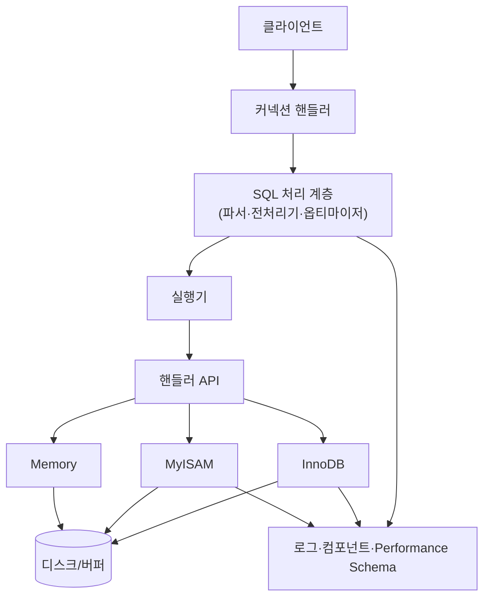

## MySQL 엔진 아키텍처

### 1) 쿼리 실행 구조 (파서 → 전처리기 → 옵티마이저 → 실행기)

아래 다이어그램처럼 MySQL 엔진은 쿼리를 여러 단계로 나누어 처리합니다.

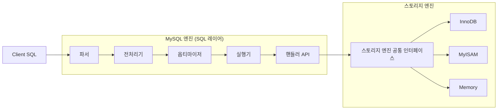

- **파서(Parser)**: SQL 텍스트를 토큰 단위로 분해해 AST(Abstract Syntax Tree)를 만들고, 구문 오류를 검출하며, 프리페어드 스테이트먼트를 위해 자리표시자를 정규화합니다.
- **전처리기(Preprocessor)**: AST를 바탕으로 실제 객체 이름을 해석하고(스키마/테이블/칼럼 존재 여부), 뷰·CTE·서브쿼리를 평탄화하며, 객체 권한과 데이터 타입 호환성을 점검해 실행 가능한 상태로 맞추는 역할을 합니다.
- **옵티마이저(Optimizer)**: 통계(`ANALYZE TABLE`), 히스토그램, 힌트, 비용 모델을 사용해 조인 순서·인덱스 선택·엑세스 방식을 결정하고, 필요 시 MRR/ICP/하위 계획 캐시 등 최적화 기법을 적용해 최종 실행 계획을 산출합니다. 8.0부터는 `EXPLAIN ANALYZE` 로 실제 시간과 계획을 함께 검증할 수 있습니다.
- **실행기(Executor)**: 옵티마이저 계획을 따라 핸들러 API를 호출하고, WHERE/LIMIT/ORDER BY 등의 실행 시 조건을 적용하며, 결과 집합을 버퍼링해 클라이언트로 전송합니다. 필요한 경우 임시 테이블 생성, 정렬, 중복 제거 같은 런타임 작업을 주관합니다.

#### MySQL 엔진 vs 스토리지 엔진 역할 구분

하나의 쿼리 작업은 여러 하위 단계로 나뉘는데, 각 단계가 **MySQL 엔진 영역**인지 **스토리지 엔진 영역**인지 구분하면 병목 지점을 빠르게 찾을 수 있습니다.

| 하위 단계                                | 담당 영역     | 설명                                                                                      |
| ---------------------------------------- | ------------- | ----------------------------------------------------------------------------------------- |
| SQL 파싱, 전처리, 권한 검증              | MySQL 엔진    | SQL 텍스트를 AST로 만들고 객체 존재 여부, 권한, 뷰 전개 등을 처리                         |
| 비용 계산, 조인 순서/인덱스 선택         | MySQL 엔진    | 옵티마이저가 통계 정보를 바탕으로 테이블 접근 순서와 핸들러 호출 전략을 결정              |
| 핸들러 호출(`handler::index_read`, …)    | 양쪽 경계     | 실행기가 핸들러 API를 호출하며, 호출 자체는 엔진 영역이지만 실 데이터 I/O는 스토리지 영역 |
| 레코드 읽기/쓰기, 잠금, MVCC             | 스토리지 엔진 | InnoDB·MyISAM 등이 인덱스를 탐색하고 페이지를 로드/갱신하며 트랜잭션 규칙을 적용          |
| 로그(redo/undo) 반영, 더티 페이지 플러시 | 스토리지 엔진 | 엔진별 로그 구조와 버퍼 관리가 담당                                                       |

예를 들어 `SELECT * FROM orders WHERE customer_id = 7 ORDER BY created_at DESC LIMIT 10;` 이 실행될 때:

1. **MySQL 엔진**이 구문을 해석하고 `orders` 테이블, `customer_id` 칼럼 권한을 점검합니다.
2. 옵티마이저가 `customer_id` 인덱스를 사용하고, 정렬을 인덱스 역순으로 처리하겠다는 실행 계획을 수립합니다.
3. 실행기가 계획대로 `handler::index_read_map` 을 호출하여 조건을 만족하는 첫 페이지를 요청합니다.
4. **스토리지 엔진(InnoDB)** 이 실제 인덱스/데이터 페이지를 버퍼 풀에서 찾거나 디스크에서 읽어 레코드를 반환합니다.
5. 실행기는 다시 MySQL 엔진 영역에서 LIMIT 을 적용하고 클라이언트에게 결과를 전달합니다.

대부분의 “계획 변경”, “조인 순서”, “정렬 처리” 문제는 엔진 영역에서, “디스크 I/O”, “잠금 경합” 문제는 스토리지 엔진 영역에서 조정해야 한다는 점을 기억해 두면 튜닝 방향을 정하기 쉽습니다.

### 2) 핸들러 요청과 핸들러 API

SQL 실행기는 실제로 데이터를 읽거나 쓸 때마다 스토리지 엔진에 "핸들러 요청(handler request)" 을 보냅니다. 이 요청을 수행하는 표준 인터페이스가 바로 핸들러 API입니다. 예시 함수는 다음과 같습니다.

| 함수                      | 역할                                    |
| ------------------------- | --------------------------------------- |
| `handler::open`           | 테이블/인덱스를 연다                    |
| `handler::index_read_map` | 특정 인덱스 키 조건으로 레코드를 찾는다 |
| `handler::read_next`      | 다음 레코드를 읽는다                    |
| `handler::write_row`      | 새 레코드를 쓴다                        |
| `handler::update_row`     | 레코드를 갱신한다                       |

InnoDB, MyISAM, Memory 엔진은 모두 이 동일한 API를 구현하기 때문에 SQL 계층은 엔진 종류를 의식할 필요가 없습니다. 또한 실행 중인 핸들러 호출 횟수와 상태는 `SHOW GLOBAL STATUS LIKE 'Handler%';` 명령으로 확인할 수 있습니다.

예를 들어 `Handler_read_first`, `Handler_read_next` 는 인덱스 스캔이 얼마나 자주 일어나는지 보여 주고, `Handler_update`, `Handler_write` 는 DML 빈도를 파악하는 데 활용됩니다. 특정 핸들러 값이 비정상적으로 높거나 낮으면 옵티마이저 계획이나 인덱스 사용 여부를 재검토할 수 있습니다.

### 3) 스레딩 구조와 스레드 풀

MySQL 서버는 스레드 기반으로 동작합니다. 개념을 단순화하면 아래와 같은 구조입니다.

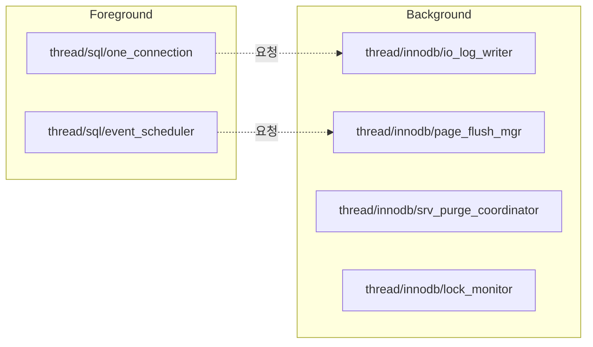

#### 포그라운드 스레드

포그라운드 스레드는 서버에 접속된 클라이언트 수만큼 존재하며, 각 사용자가 보낸 쿼리를 곧바로 처리합니다. 대표 스레드는 다음과 같습니다.

- `thread/sql/one_connection`: 각 커넥션과 1:1로 묶여 SQL 파싱부터 실행까지 담당합니다. 커넥션이 종료되면 스레드 캐시(`thread_cache_size`)로 반환돼 재사용됩니다. 스레드 캐시에 유지할 수 있는 최대 스레드 개수는 `thread_cache_size` 로 제어합니다.
- `thread/sql/event_scheduler`: EVENT 오브젝트를 실행하는 전용 포그라운드 스레드입니다.

포그라운드 스레드는 클라이언트와 직접 통신하므로 I/O 대기, 네트워크 지연, SQL 실행 시간이 그대로 노출됩니다.

#### 백그라운드 스레드

스토리지 엔진의 유지보수·I/O 작업은 백그라운드 스레드가 비동기적으로 처리해 포그라운드 스레드의 응답성을 높입니다. 주요 스레드는 아래와 같습니다.

- `thread/innodb/io_log_writer`: Redo 로그를 디스크에 기록해 WAL을 보장합니다.
- `thread/innodb/page_flush_mgr`: 더티 페이지를 디스크에 쓰는 Page Cleaner 스레드입니다.
- `thread/innodb/srv_purge_coordinator`: Undo 로그를 정리해 공간을 회수합니다.
- `thread/innodb/ibuf_merge`: Insert Buffer(Change Buffer)을 병합합니다.
- `thread/innodb/lock_monitor`: 락/데드락 상태를 감시합니다.

백그라운드 스레드 수는 설정에 따라 가변적입니다. `thread/innodb/io_read_thread/0`, `thread/innodb/io_read_thread/1` 처럼 이름 뒤에 번호가 붙으면 `innodb_read_io_threads`, `innodb_write_io_threads`, `innodb_page_cleaners` 등의 설정으로 여러 스레드를 병렬로 띄웠다는 뜻입니다. MySQL 5.5부터는 읽기·쓰기 I/O 스레드를 2개 이상 지정할 수 있으며, 각각 `innodb_read_io_threads`, `innodb_write_io_threads` 로 조정합니다. 더 많은 병렬 I/O가 필요하면 값을 늘려 디스크 대역폭을 충분히 활용합니다.

> InnoDB에서도 데이터를 읽는 작업은 주로 클라이언트 스레드에서 처리되기 때문에 읽기 스레드는 많이 설정할 필요가 없지만 쓰기 스레드는 아주 많은 작업을 백그라운드로 처리하기 때문에 일반적인 내장 디스크를 사용할 때는 2~4 정도, DAS나 SAN 같은 스토리지를 사용할 때는 디스크를 최적으로 활용할 수 있을 만큼 충분히 설정해야 합니다.
{:.prompt-info}

#### 스레드 풀 플러그인

접속 수가 매우 많을 때는 “커넥션 수 ≠ 스레드 수” 구조가 필요하므로 스레드 풀을 사용합니다. 요청 큐를 두고 제한된 스레드가 작업을 당겨 가도록 만들어 문맥 전환 비용을 줄입니다.

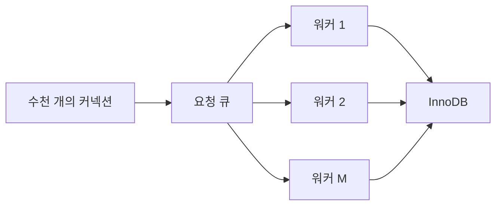

스레드 풀은 CPU 코어 수에 맞춰 워커 개수를 제한하고, 큐에 쌓인 작업을 가져오면서 우선순위와 타임아웃을 제어해 전체 응답성을 유지합니다.

> MySQL **Enterprise Edition** 에는 오라클이 제공하는 공식 Thread Pool 플러그인이 포함되어 있지만, Community Edition에는 포함되지 않습니다. 커뮤니티 사용자는 Percona Server나 MariaDB처럼 자체 스레드 풀 구현을 포함한 배포판을 선택하거나, ProxySQL/Haproxy로 커넥션을 분산해 유사한 효과를 얻어야 합니다.
{:.prompt-info}

Enterprise 에서 스레드 풀을 적용하려면 보통 다음 순서로 진행합니다.

1. (필요 시) `INSTALL PLUGIN thread_pool SONAME 'thread_pool.so';` 로 플러그인을 로드합니다. EE 번들에서는 기본 제공되므로 `thread_pool_size` 등을 설정하고 서버를 재기동하면 활성화됩니다.
2. `thread_pool_size` 로 워커 그룹 수를 지정합니다(보통 CPU 코어 수와 동일하게 설정). 각 그룹마다 하나의 요청 큐와 최소 1개의 워커 스레드가 있습니다.
3. `thread_pool_max_threads`, `thread_pool_stall_limit`, `thread_pool_oversubscribe` 등을 조정해 최대 스레드 수, 큐 적체 허용 시간, 긴급 워커 생성 여부를 제어합니다.

동작 방식은 다음과 같습니다.

| 단계            | 설명                                                                                                                                 |
| --------------- | ------------------------------------------------------------------------------------------------------------------------------------ |
| 커넥션 수신     | 포그라운드 스레드는 쿼리를 받아 thread-pool에 “작업”으로 등록합니다.                                                                 |
| 작업 큐(그룹별) | 각 스레드 그룹은 자체 큐를 갖고 있으며, 커넥션/트랜잭션을 그룹 해시로 분산합니다.                                                    |
| 워커 스레드     | 그룹당 1개 이상의 워커가 큐에서 작업을 꺼내 실행합니다. 과부하 시 `thread_pool_max_threads` 한도를 넘지 않는 선에서 워커를 늘립니다. |
| 페어니스        | `thread_pool_stall_limit` 값보다 오래 대기한 작업이 있으면 우선적으로 실행해 기아 현상을 줄입니다.                                   |
| 커넥션 축소     | 부하가 줄면 여분의 워커는 종료되고, 최소 워커만 유지해 컨텍스트 스위치 비용을 최소화합니다.                                          |

이러한 구조 덕분에 수천 개의 유휴 커넥션을 유지하면서도 CPU/메모리 오버헤드를 크게 줄일 수 있지만, Community Edition은 지원하지 않으므로 배포판 선택 단계에서 고려해야 합니다.

현재 스레드를 확인하려면 다음 쿼리를 사용합니다.

```sql
SELECT thread_id, name, type, processlist_user, processlist_host
FROM performance_schema.threads
ORDER BY type, thread_id;
```

예시 결과

```text
+----------+--------------------------------------+-----------+
| thread_id| name                                 | type      |
+----------+--------------------------------------+-----------+
|        9 | thread/sql/one_connection            | FOREGROUND|
|       11 | thread/sql/event_scheduler           | FOREGROUND|
|       17 | thread/innodb/io_log_writer          | BACKGROUND|
|       18 | thread/innodb/page_flush_mgr         | BACKGROUND|
|       19 | thread/innodb/srv_purge_coordinator  | BACKGROUND|
|       21 | thread/innodb/buf_dump_thread        | BACKGROUND|
+----------+--------------------------------------+-----------+
```

- `thread/sql/one_connection` 만이 실제 클라이언트 요청을 처리하는 핵심 포그라운드 스레드입니다.
- 백그라운드 스레드 수는 설정에 따라 가변적이며 `thread/innodb/io_read_thread/0`, `thread/innodb/io_read_thread/1` 처럼 동일한 이름에 번호가 붙는 경우는 `innodb_read_io_threads`, `innodb_write_io_threads`, `innodb_page_cleaners` 등의 설정으로 여러 스레드를 병렬로 띄운 결과입니다.

### 4) 메모리 할당 및 사용 구조

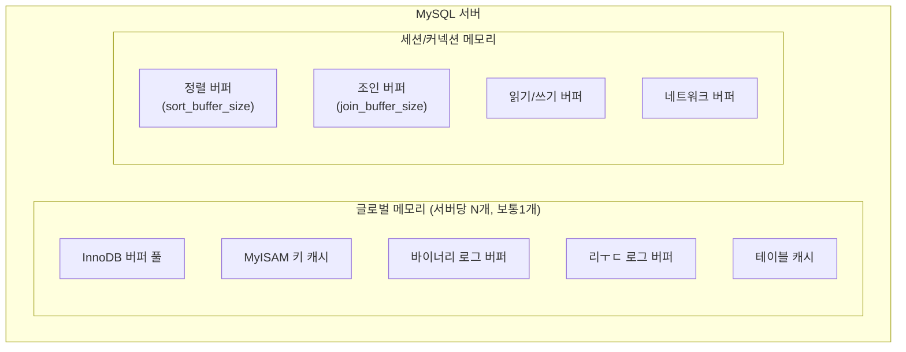

- **글로벌 메모리**: 서버마다 1개의 영역만 존재하며 클라이언트 스레드 수와 무관하게 모든 세션이 공유합니다. 때로는 N개로 구성할 수 있지만 클라이언트 스레드 수와는 무관합니다. N개로 글로벌 영역이 구성되더라도 모든 스레드에 의해 공유됩니다. 커넥션 버퍼, 스레드 캐시, Performance Schema 버퍼, binlog 캐시, InnoDB 딕셔너리 캐시 등이 포함되며, 한 세션이 사용하면 즉시 전체에 영향을 미치므로 용량 조정 시 전체 인스턴스를 고려해야 합니다.
- **세션/커넥션 메모리**: 각 커넥션이 독립적으로 보유하는 영역입니다. 각 커넥션별로 절대 공유되어 사용되지 않습니다. 정렬 버퍼(`sort_buffer_size`), 조인 버퍼(`join_buffer_size`), 읽기/쓰기 버퍼, 네트워크 버퍼 등이 포함되며, 쿼리 복잡도에 따라 일시적으로 늘어났다 커넥션 종료 시 해제됩니다.

#### (사라진) 쿼리 캐시

MySQL 5.x 에서는 SELECT 결과를 재활용하는 **쿼리 캐시**가 있었지만, 하나의 테이블만 수정돼도 관련 캐시 엔트리가 모두 무효화되어 동시성 병목이 심했습니다. 8.0에서는 완전히 제거되었으며, 대신 ProxySQL, Redis, memcached 같은 애플리케이션 계층 캐시를 사용해 결과를 캐싱하는 방식을 권장합니다.

### 5) 컴포넌트 프레임워크는 왜 등장했나?

MySQL 5.x 시절까지는 대부분의 확장 기능이 **플러그인 API** 로만 제공됐습니다. 플러그인은 서버가 기동될 때 `mysql.plugin` 테이블이나 `plugin-load-add` 설정을 통해 로딩되며, `plugin_init()` 에서 필요한 전역 리소스를 확보하고 `plugin_deinit()` 에서 정리하는 단순한 생명주기를 가집니다. 예컨대 비밀번호 정책을 검사하는 `validate_password` 도 플러그인으로 로딩해 `INSTALL PLUGIN validate_password SONAME 'validate_password.so';` 처럼 별도 명령으로 올려야 했고, 플러그인끼리 서로 기능을 호출하거나 권한을 세분화하는 장치는 없었습니다.

이처럼 모듈 간 의존성과 권한 제어가 어려웠기 때문에 MySQL 8.0의 **Component** 프레임워크가 도입되었습니다. `validate_password` 는 대표적인 전환 사례로, 8.0부터는 컴포넌트 형태로 제공되어 필요한 서비스 인터페이스만 명시적으로 요청하고, 서버 재기동 없이 설치/제거하면서도 다른 모듈과 안전하게 협업할 수 있게 되었습니다.

컴포넌트 프레임워크는 다음 문제를 해결합니다.

1. **명시적 의존성**: 컴포넌트 간 제공/요청 인터페이스를 선언하여 로딩 순서를 제어합니다.
2. **세분화된 권한**: 컴포넌트별 고유 서비스에 권한을 부여할 수 있어 보안이 강화됩니다.
3. **동적 로딩**: 서버를 재기동하지 않고 설치/제거할 수 있습니다.

예를 들어 `validate_password` 기능은 8.0부터 플러그인이 아닌 컴포넌트로 제공됩니다.

```sql
INSTALL COMPONENT 'file://component_validate_password';
```

컴포넌트 덕분에 인증/모니터링/백업 같은 기능을 필요할 때만 안전하게 붙였다 뗄 수 있습니다.

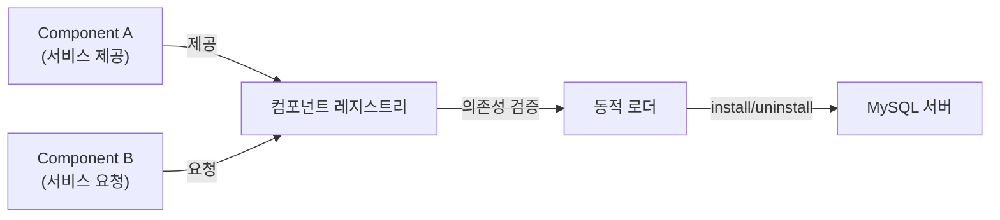

위 구조 덕분에 컴포넌트는 서로의 의존성을 명시하고, 레지스트리가 이를 검증한 뒤 필요할 때만 서버에 로딩됩니다.

### 6) 플러그인 스토리지 엔진 모델

핵심 계층이 핸들러 API로 추상화되어 있기 때문에, MySQL은 스토리지 엔진을 **플러그인(Plugin)** 으로 취급합니다. 즉, 엔진 코드는 MySQL 서버 바이너리 밖(공유 라이브러리)이나 안(정적 링크) 어느 쪽에서든 로딩될 수 있으며, 로딩된 순간부터 핸들러 API를 통해 SQL 계층과 통신합니다. MySQL 엔진을 재빌드하지 않고도 InnoDB, MyISAM, NDB, Memory 같은 엔진을 조합할 수 있는 이유가 바로 이 “플러그인 스토리지 엔진 모델” 입니다.

- **등록/상태 관리**: 로딩된 플러그인은 `INFORMATION_SCHEMA.PLUGINS` 나 `SHOW PLUGINS` 로 확인합니다. `PLUGIN_LIBRARY`, `PLUGIN_STATUS`, `PLUGIN_TYPE`(예: `STORAGE ENGINE`) 열을 보면 어떤 공유 객체가 어느 상태(OFF, DISABLED, ACTIVE)로 구동 중인지 알 수 있습니다.
- **설치/제거**: `INSTALL PLUGIN ngram SONAME 'libngram_parser.so';` 처럼 동적으로 추가하거나, `UNINSTALL PLUGIN ...` 으로 제거할 수 있습니다. 서버 시작 시 자동 로딩하려면 `plugin-load-add='ha_example=ha_example.so'` 를 설정 파일에 넣거나 `mysql.plugin` 시스템 테이블에 기록합니다.
- **수명 주기와 의존성**: 플러그인이 로딩되면 `plugin_init()`, 언로딩될 때 `plugin_deinit()` 훅이 실행됩니다. 스토리지 엔진 플러그인은 메타데이터 락, 트랜잭션 매니저, 보조 로그 모듈 등 MySQL 엔진이 제공하는 서비스에 의존하며, 반대로 MySQL 엔진은 핸들러 API 이외의 내부 구조를 알 필요가 없습니다.
- **설정/모니터링**: 각 스토리지 엔진은 고유 시스템 변수와 상태 변수를 제공하며, `SHOW ENGINE <engine> STATUS` 형식의 진단 명령을 노출합니다. 필요할 때만 엔진을 로딩하면 리소스를 절약하고, 불필요한 기능을 제거해 공격 표면도 줄일 수 있습니다.

이 모델 덕분에 운영자는 테이블 단위로 다른 엔진을 섞어 쓰거나, 제3자가 개발한 스토리지 엔진을 안전하게 추가해 성능/특성을 확장할 수 있습니다. 실험적인 엔진을 테스트할 때도 서버 전체를 교체하지 않고 플러그인만 교체하면 되므로, MySQL이 “플러그형 스토리지 엔진 아키텍처” 라는 평가를 받게 된 것입니다.

#### `SHOW PLUGINS` 로 확인할 수 있는 대표 플러그인

`SHOW PLUGINS;` 혹은 `SELECT PLUGIN_NAME, PLUGIN_STATUS, PLUGIN_TYPE FROM INFORMATION_SCHEMA.PLUGINS;` 로 활성화된 플러그인을 확인할 수 있습니다. 예시:

| PLUGIN_NAME             | TYPE             | STATUS | 설명                           |
| ----------------------- | ---------------- | ------ | ------------------------------ |
| `InnoDB`                | STORAGE ENGINE   | ACTIVE | 기본 트랜잭션 스토리지 엔진    |
| `MEMORY`                | STORAGE ENGINE   | ACTIVE | 메모리 기반 임시/소규모 테이블 |
| `MyISAM`                | STORAGE ENGINE   | ACTIVE | 전통적 비트랜잭션 엔진         |
| `caching_sha2_password` | AUTHENTICATION   | ACTIVE | 8.0 기본 인증 플러그인         |
| `mysql_native_password` | AUTHENTICATION   | ACTIVE | 호환성용 전통 인증 플러그인    |
| `validate_password`     | COMPONENT/PLUGIN | ACTIVE | 패스워드 정책 검사             |
| `connection_control`    | AUDIT            | ACTIVE | 로그인 실패 제어 플러그인      |
| `ngram`                 | FTS PARSER       | ACTIVE | ngram 기반 Fulltext Parser     |

서버 빌드/설정에 따라 더 많은 플러그인이 나열될 수 있으며, 필요한 기능만 ON/OFF 하여 공격 표면과 리소스 사용량을 조절할 수 있습니다.

### 7) 트랜잭션 지원 메타데이터(데이터 딕셔너리)

운영자가 “데이터베이스나 테이블이 깨졌다”고 표현하는 상황의 상당수는 **메타데이터 파일과 실제 데이터 파일이 불일치**할 때 발생합니다. MySQL 5.7까지는 테이블 구조를 `.frm`, 파티션 정의를 `.par`, 트리거를 `.TRG/.TRN`, InnoDB 테이블 상태를 `.ibd/.isl` 같은 파일에 분산 저장했습니다. 이러한 파일 기반 메타데이터는 생성/변경 작업이 **트랜잭션을 보장하지 않아**, DDL 도중 서버가 비정상 종료되면 구조 파일만 기록되고 실제 데이터 파일은 롤백되거나 반대로 남아 있는 등 불일치가 쉽게 발생했습니다. 그 결과 “테이블을 열 수 없다”, “FRM과 데이터 파일이 맞지 않는다”는 메시지가 나타났고, 수동으로 파일을 삭제하거나 `DROP TABLE ... IMPORT TABLESPACE` 같은 복구 절차를 거쳐야 했습니다.

MySQL 8.0에서는 이러한 문제를 해결하기 위해 **트랜잭션 데이터 딕셔너리(Transactional Data Dictionary)** 를 도입했습니다.

- 모든 메타데이터(스키마, 테이블, 뷰, 저장 프로그램, 권한 등)를 InnoDB의 전용 시스템 테이블에 저장하고, InnoDB redo/undo 로그로 보호합니다.
- DDL 역시 InnoDB 트랜잭션으로 수행되므로, 생성·삭제·변경 작업이 원자적으로 커밋/롤백됩니다. 즉, DDL 중단으로 스키마가 “반만 적용”되는 일이 없습니다.
- `.frm` 파일이 사라지고, `mysql` 시스템 스키마 내 `dict_*`, `dd_*` 테이블을 통해 메타데이터가 일관되게 관리됩니다. `information_schema` 뷰도 이 트랜잭션 딕셔너리를 직접 참조하도록 재작성되었다.
- 백업/복구 시에도 메타데이터와 데이터가 동일한 redo LSN에 묶여 있으므로, 순간 정합성(consistency)을 확보하기 쉽습니다.

결과적으로 “테이블이 깨졌다”는 전통적 장애를 대부분 피할 수 있고, DDL이 잦은 환경에서도 메타데이터 일관성을 유지할 수 있게 됩니다.

## InnoDB 스토리지 엔진 아키텍처

InnoDB는 ACID 트랜잭션, MVCC, 외래 키, 크래시 복구를 지원하는 기본 스토리지 엔진입니다.

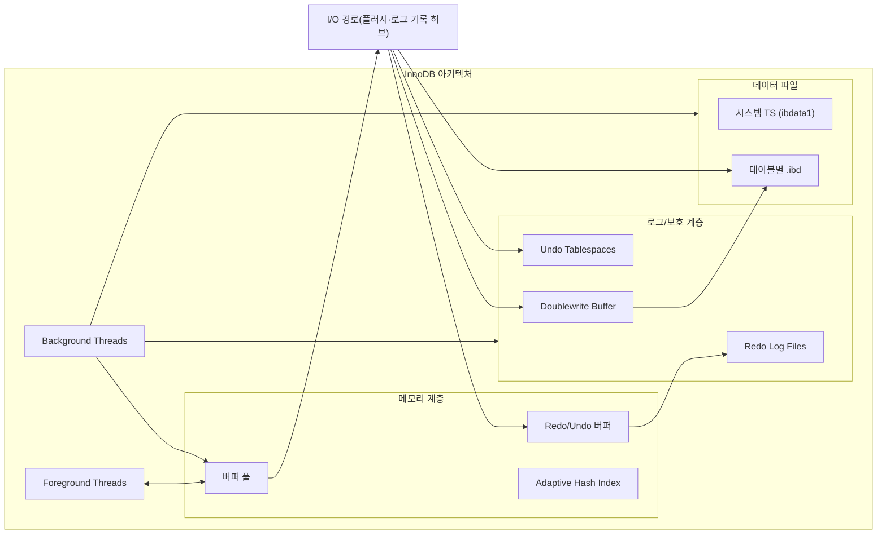

#### InnoDB 핵심 특성

- **기본 키(Primary Key)에 의한 클러스터링**: 모든 데이터 페이지가 기본 키 순서로 정렬된 클러스터드 인덱스 구조를 유지합니다. 따라서 기본 키 범위 조회가 곧 데이터 접근이 되며, `ROWID` 같은 별도 포인터가 필요 없습니다. 기본 키를 변경하면 레코드가 이동하므로 PK 설계를 신중히 해야 합니다.
- **세컨더리 인덱스**: 비클러스터드 인덱스는 리프 페이지에 기본 키 값을 함께 저장해(‘PK 포함 인덱스’) 실제 레코드를 찾아갑니다. 덕분에 세컨더리 인덱스만으로도 커버링 쿼리를 만들 수 있지만, PK가 길면 세컨더리 인덱스 크기도 커지므로 PK 길이를 최소화하는 편이 좋습니다.
- **외래 키 지원**: 외래 키 제약을 트랜잭션 단위로 검증하며, 부모/자식 테이블 모두 InnoDB여야 합니다. 지연 체크나 CASCADE 옵션을 통해 참조 무결성을 자동 유지할 수 있습니다.
- **자동 데드락 감지**: 전용 백그라운드 스레드가 대기 그래프를 주기적으로 분석해 순환을 발견하면 희생자를 선정해 `ERROR 1213 (40001)` 로 롤백합니다. 이때, 먼저 강제 종료할 트랜잭션을 판단하는 기준은 트랜잭션의 언두 로그 양이며, 언두 로그 레코드를 더 적게 가진 트랜잭션이 일반적으로 롤백의 대상이 됩니다.(롤백 양이 적기 때문에 서버 부하도 덜하기 때문) `innodb_print_all_deadlocks` 로 감지 결과를 에러 로그에 남길 수 있습니다. 구글 사례처럼 PK 기반 조회·변경이 초고빈도로 실행되고 동시 트랜잭션 수가 많은 서비스에서는 이 감지 스레드가 잠금 대기 그래프를 계속 훑느라 CPU를 크게 소비해 성능 병목이 될 수 있습니다. 이런 워크로드는 `innodb_deadlock_detect=OFF` 로 감지를 끄고 `innodb_lock_wait_timeout` 기반 타임아웃 동작과 비교 테스트를 해보는 것도 선택지입니다.
- **자동화된 장애 복구**: 서버가 비정상 종료되면 재기동 시 redo/undo 로그를 재생해 일관성을 복원합니다. Doublewrite Buffer 덕분에 페이지 절반만 기록된 상태(Partial Write)도 감지하고 복원할 수 있습니다. 복구 과정이 실패하면 `innodb_force_recovery` 로 단계별로 기능을 제한해 최소한의 읽기 전용 접근을 시도할 수 있습니다.

`innodb_force_recovery` 단계별 동작(값이 커질수록 더 많은 기능을 차단하고 “읽기 전용”에 가까워지며, 데이터 손상 위험도 커지므로 백업 목적 외에는 사용하지 않는다):

| 값  | 비활성화되는 기능/목적                                                                  | 사용 시점 예시                                        |
| --- | --------------------------------------------------------------------------------------- | ----------------------------------------------------- |
| 1   | Background Master Thread 일부 정지(Insert Buffer merge 중단)                            | Insert Buffer 손상 추정, 최소한의 읽기 확보 필요      |
| 2   | Crash Recovery 중 REDO 적용만 허용, Background Thread 거의 모두 정지                    | Purge 관련 손상 의심, 읽기 전용 덤프 시도             |
| 3   | Undo 롤백 비활성화(변경 내용은 그대로, Clean up 안 함)                                  | Undo 손상으로 롤백이 무한 대기할 때                   |
| 4   | Insert Buffer 불허 + Undo 롤백 비활성화                                                 | Insert Buffer 및 Undo 모두 신뢰 불가                  |
| 5   | Redo 재생 없이 테이블스페이스를 읽기 모드로만 열기                                      | Redo 손상, 최소한의 데이터 덤프가 필요할 때           |
| 6   | InnoDB 거의 모든 기능 비활성화, Secondary Index 사용 불가, Data Dictionary 만 읽기 가능 | 마지막 수단. 테이블 데이터 덤프 후 InnoDB 재생성 필요 |

> 절대 Production 서비스 상태에서 장시간 사용하면 안 되며, 3 이상은 데이터 손상 위험이 큽니다. 일반적으로 1→2→… 순으로 값을 올려가며 서버를 기동해 봅니다. 읽기 가능한 최소 단계에서 필요한 덤프/백업을 진행하고 즉시 서버를 내린 뒤 새로운 인스턴스로 복원하는 편이 안전합니다.
{:.prompt-info}

### 1) 스토리지 레이아웃

| 구성                              | 설명                                                                  |
| --------------------------------- | --------------------------------------------------------------------- |
| 시스템 테이블스페이스 (`ibdata1`) | 데이터 딕셔너리, 언두 세그먼트, Doublewrite Buffer 등 핵심 메타데이터 |
| 파일-퍼-테이블(`.ibd`)            | `innodb_file_per_table=ON`이 기본, 테이블 단위로 공간 관리            |
| 일반 테이블스페이스               | `CREATE TABLESPACE` 로 여러 테이블을 묶어 특정 스토리지에 배치        |
| 언두 테이블스페이스               | 최대 128개까지 분리 생성, 언두 로그를 분산 저장                       |

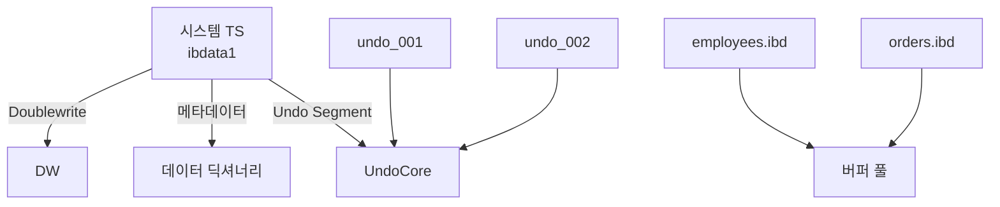

위 그림처럼 시스템 테이블스페이스는 공용 메타데이터를 저장하고, 각 테이블은 독립 `.ibd` 파일로 분리되며, 언두 전용 테이블스페이스가 여러 개 붙어 언두 로드를 분산합니다.

### 2) 버퍼 풀과 페이지 관리

버퍼 풀은 InnoDB 성능과 내구성을 동시에 책임지는 가장 큰 메모리 구조입니다. 모든 데이터/인덱스 페이지는 16KB 단위로 버퍼 풀에 적재되고, 버퍼 풀에서 수정된 페이지는 Redo/Undo 로그와 연동돼 결국 디스크에 반영됩니다.

#### 버퍼 풀 크기와 (비)정적 특성

- `innodb_buffer_pool_size` 가 전체 크기를 결정합니다. 전용 DB 서버라면 OS 여유분을 제외한 메모리의 60~80%를 버퍼 풀에 할당하는 것이 일반적인 출발점입니다. 여러 서비스가 공존한다면 워크로드별 메모리 사용량을 계측한 뒤 50% 안팎부터 점진적으로 늘려야 합니다.
- MySQL 5.7부터는 **온라인 리사이징**이 가능해 `SET GLOBAL innodb_buffer_pool_size = ...;` 로 런타임에 늘리거나 줄일 수 있습니다. 단, 내부적으로 `innodb_buffer_pool_chunk_size`(기본 128MB) 단위로 증감하므로 원하는 값이 chunk × instance 수의 배수인지 확인해야 합니다.
- 버퍼 풀은 완전히 “정적”이지도, “즉각적”으로 커지지도 않습니다. 리사이징 명령 이후 백그라운드 스레드가 청크 단위로 메모리를 재분배하므로 수 초~수 분의 지연이 있으며, 축소 시에는 더티 페이지를 먼저 디스크에 밀어내야 해서 시간이 더 걸립니다.

#### 내부 구조 (인스턴스/리스트)

- `innodb_buffer_pool_instances` 로 버퍼 풀을 여러 인스턴스로 분할하면(권장: 1개당 최소 1GB) LRU latch 경합을 줄일 수 있습니다. 크기가 1GB 미만이면 1개 인스턴스로 고정됩니다.
- 각 인스턴스에는 **Free List → LRU List(young/old 영역) → Flush List** 가 있으며, 페이지 해시는 특정 페이지가 이미 적재돼 있는지 빠르게 찾는 데 사용됩니다.
  - LRU List 는 중간 삽입(midpoint insertion) 알고리즘을 사용합니다. 새로 읽어온 페이지는 OLD sublist에 먼저 들어가고, 일정 횟수 이상 참조되면 YOUNG sublist로 승급됩니다. 이는 대량 순차 읽기가 버퍼 풀 전체를 오염시키는 것을 방지합니다.
  - Flush List 는 더티 페이지를 LSN 순으로 정렬해두는 연결 리스트입니다. 페이지가 수정될 때마다 Redo LSN이 함께 붙고, checkpoint 시점에는 Flush List 의 가장 오래된 LSN부터 디스크로 밀어내며 Redo 공간을 확보합니다.

#### 버퍼 풀 ↔ Redo 로그 연계
InnoDB의 버퍼풀은 서버의 메로리가 허용하는 만큼 크게 설정하면 할수록 쿼리 성능이 빨라집니다. 물론, 이ㅣㅁ 디스크의 모든 데이터 파틸이 버퍼풀에 적재될 정도의 버퍼풀 공간이라면 더는 버퍼풀 크기를 늘려도 성능에 도움이 되지 않습니다. InnoDB 버퍼풀은 데이터 베이스 서버 성능 향상을 위해 데이터 캐시와 쓰기 버퍼링 두가지 용도가 있는데, 버퍼풀의 메모리 공간만 단순히 늘리는 것은 데이터 캐시 기능만 향상 시키는 것입니다.

InnoDB의 버퍼풀의 쓰기 버퍼링 기능 까지 향상시키려면 버퍼 풀 ↔ Redo 로그와의 관례를 이해해야합니다.

- 모든 더티 페이지는 버퍼 풀에만 존재하며, 디스크에는 아직 반영되지 않습니다. 대신 Redo 로그가 페이지 변경 내용을 WAL 형태로 보관합니다. 따라서 **Redo 로그가 가득 차기 전에** 해당 LSN보다 오래된 더티 페이지를 플러시해야 합니다.
- 체크포인트(Checkpoint LSN)는 “Redo 로그에서 이미 디스크에 반영된 마지막 지점”을 의미하고, 이것을 앞당기는 주체가 버퍼 풀 플러시입니다. Redo 용량이 작거나 더티 비율이 과도하면 checkpoint age가 급격히 늘고, 결국 쓰기 요청이 Redo 가득 참 → 강제 플러시 → 지연 폭증 순으로 이어집니다.
- 반대로 버퍼 풀 크기를 크게 잡으면 같은 양의 데이터가 버퍼 풀에 머무는 시간이 길어져 디스크 쓰기를 묶음 처리할 수 있지만, 그만큼 Redo 로그도 넉넉해야 checkpoint 압박을 줄일 수 있습니다. 즉, `innodb_buffer_pool_size` 조정 시에는 `innodb_log_file_size × innodb_log_files_in_group` 도 함께 검토해야 합니다.

#### 버퍼 풀 플러시 전략

- **Page Cleaner 스레드** 가 Flush List 와 LRU List 를 스캔해 더티 페이지를 디스크로 내보냅니다. `innodb_page_cleaners` 로 스레드 수를 조정할 수 있으며 기본값은 인스턴스 수와 동일합니다.
- 플러시는 세 가지 트리거로 나뉩니다.
  1. **Flush List Flush**: `innodb_max_dirty_pages_pct`(기본 75) 또는 checkpoint age 한계에 근접하면 오래된 LSN 순으로 강제 플러시합니다.
  2. **LRU Flush**: Free List 에 적재할 페이지가 부족할 때 LRU의 OLD 영역부터 페이지를 내보냅니다. 순차 스캔이 몰릴 때 자주 발생합니다.
  3. **Adaptive Flush**: 리두 LSN 증가율과 더티 비율을 감시하며 폭증 조짐이 보이면 선제적으로 플러시량을 늘립니다. `innodb_adaptive_flushing`(기본 ON) 이 이를 제어합니다.
- **LRU Flush 세부 흐름**
  - 버퍼 풀에 빈 슬롯이 없어 새로운 페이지를 읽어올 수 없을 때 `innodb_lru_scan_depth` 만큼 OLD sublist 를 훑어 victim 페이지를 선정하고, 더티 페이지는 먼저 디스크에 기록한 뒤 Free List 로 이동합니다.
  - `innodb_lru_scan_depth` 값을 지나치게 높이면 CPU가 LRU를 훑느라 시간을 허비하고, 너무 낮으면 Free List 가 자주 고갈되어 IO 폭주가 발생할 수 있습니다. 일반적으로 인스턴스당 1,000~2,000 사이에서 벤치마크로 최적값을 찾습니다.
  - 순차 스캔/풀 테이블 스캔이 빈번하면 OLD sublist 가 급속히 채워지므로 `innodb_buffer_pool_size` 대비 적절한 `read_ahead_threshold` 조합과 쿼리 튜닝으로 LRU Flush 빈도를 낮출 수 있습니다.
- **Flush List Flush 세부 흐름**
  - Flush List 는 “더티 페이지가 처음 더러워졌을 때”의 LSN 순으로 정렬됩니다. Page Cleaner 는 헤드에서부터 디스크에 기록하고, 성공하면 항목을 제거하면서 체크포인트 LSN을 전진시킵니다.
  - `innodb_max_dirty_pages_pct` 와 `innodb_max_dirty_pages_pct_lwm`(Low Water Mark) 값이 플러시 속도를 결정합니다. LWM을 낮추면(예: 50→35%) 더티 비율이 커지기 전에 선제적으로 Flush List Flush 가 가속됩니다.
  - 실제 I/O 속도는 `innodb_io_capacity`/`innodb_io_capacity_max` 에 묶여 있으므로, 장비 IOPS 를 기준으로 현실적인 값을 넣지 않으면 Flush List 가 뒤처져 checkpoint age 가 급증할 수 있습니다.
  - 로그에 `Log sequence number is xxx` 식의 경고가 반복되면 Flush List Flush 가 제때 수행되지 못한 것이므로, LOG 섹션(혹은 Performance Schema `innodb_buffer_pool_stats`)에서 더티 페이지 비율과 flush batch 크기를 확인하며 버퍼 풀/redo/IO 파라미터를 함께 조정해야 합니다.
- 수동으로 플러시를 유도하려면 `FLUSH TABLES`, `ALTER INSTANCE FLUSH REDO LOG`, `SET GLOBAL innodb_buffer_pool_dump_at_shutdown=ON` 같은 옵션을 활용해 서버 재시작 시 Warm-up 시간을 줄일 수 있습니다.
- 플러시 비용이 높다면 빠른 스토리지, `innodb_flush_neighbors=0`(SSD), `innodb_io_capacity`/`innodb_io_capacity_max` 의 현실적인 값 설정, 더티 비율 모니터링으로 병목을 완화합니다.

#### 버퍼 풀 덤프/복구와 상태 점검

- **덤프/로드 자동화**: `innodb_buffer_pool_dump_at_shutdown=ON`, `innodb_buffer_pool_load_at_startup=ON` 을 설정하면 종료 시 버퍼 풀 메타데이터를 `datadir/ib_buffer_pool` 파일에 저장하고 기동 시 즉시 다시 적재해 워밍업 시간을 크게 줄일 수 있습니다.
- **수동 제어**: 즉시 덤프하거나 로드하려면 `SET GLOBAL innodb_buffer_pool_dump_now = ON;`, `SET GLOBAL innodb_buffer_pool_load_now = ON;` 을 실행합니다. 진행 상태는 `SHOW STATUS LIKE 'Innodb_buffer_pool_dump_status';` 로 확인합니다.
- **부분 덤프**: `innodb_buffer_pool_dump_pct` 로 상위 N% 페이지만 덤프할 수 있습니다(기본 25%). 대용량 버퍼 풀에서 덤프 시간이 길 때 유용합니다.
- **상태 확인**: 전반적인 사용량은 `SHOW GLOBAL STATUS LIKE 'Innodb_buffer_pool_%';` 로 확인하고, 어떤 페이지가 적재돼 있는지는 `INFORMATION_SCHEMA.INNODB_BUFFER_PAGE`, `INNODB_BUFFER_PAGE_LRU`, Performance Schema `memory_summary_global_by_event_name` 등을 조회합니다. 예)

```sql
SELECT table_name, index_name, COUNT(*) pages
FROM information_schema.innodb_buffer_page
WHERE table_name LIKE 'app/%'
GROUP BY table_name, index_name
ORDER BY pages DESC
LIMIT 10;
```

- **sys 스키마 활용**: `sys.schema_table_statistics_with_buffer` 뷰는 버퍼 풀 히트율과 IO 비율을 한 번에 보여주므로, 특정 테이블/인덱스가 워밍업 리스트에 포함됐는지 빠르게 확인할 수 있습니다.

이 구조 덕분에 버퍼 풀은 빈번한 읽기를 메모리에서 처리하면서도 Redo 로그와 연동해 내구성을 유지하고, 다양한 플러시 경로로 디스크 쓰기 폭탄을 제어합니다.

### 3) 로그와 체크포인트

| 구성               | 역할                              | 비고                                                             |
| ------------------ | --------------------------------- | ---------------------------------------------------------------- |
| Redo Log           | 커밋된 변경 내용을 순차 기록(WAL) | `innodb_log_file_size`, `innodb_log_files_in_group` 로 용량 조절 |
| Undo Log           | 롤백, MVCC 버전 관리              | 언두 세그먼트에 저장, Purge 스레드가 정리                        |
| Doublewrite Buffer | 부분 페이지 쓰기 방지             | 2MB 버퍼에 먼저 기록 후 실제 데이터 파일 반영                    |
| 체크포인트         | 재시작 시간 단축                  | Fuzzy 방식으로 서비스 중에도 지속 반영                           |

`SHOW ENGINE INNODB STATUS` 의 LOG 섹션에서 LSN과 체크포인트 간격을 확인합니다.

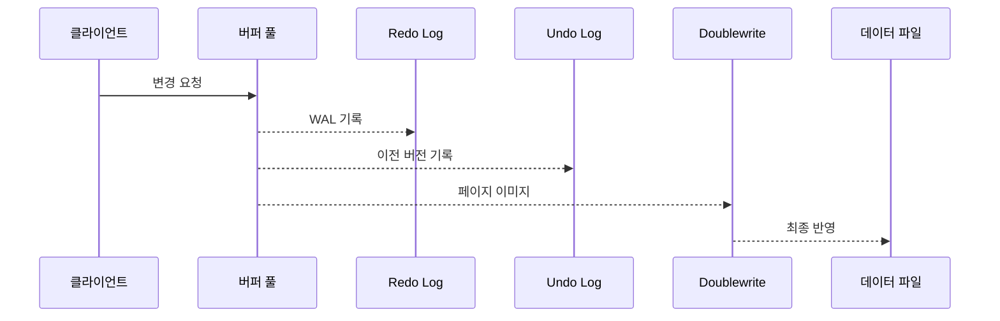

Redo/Undo/DW 흐름을 한꺼번에 보면, 먼저 버퍼 풀에서 작업이 처리되고, WAL 순서대로 Redo에 기록되며, MVCC를 위해 Undo에 과거 버전이 남고, Doublewrite를 거쳐 최종 파일에 반영됩니다.

#### Doublewrite Buffer 심화

- 구조: InnoDB는 128개(2MB)의 연속 페이지 슬롯을 가진 전용 영역(시스템 테이블스페이스 혹은 전용 파일)에 변경 페이지를 먼저 기록한 뒤, 해당 페이지를 실제 데이터 파일에 두 번째로 기록합니다.
- 목적: 전원 장애로 인해 16KB 페이지가 절반만 디스크에 써진 경우(Partial Page Write)에도 Doublewrite 영역의 완전한 이미지를 이용해 복구할 수 있습니다.
- 동작: Page Cleaner 가 더티 페이지를 flush 할 때 `memcpy` 로 Doublewrite 버퍼에 모아 순차적으로 기록 → fsync → 다시 실제 Tablespace 로 scatter write. SSD 환경에서도 Doublewrite 로 인한 추가 쓰기보다 데이터 무결성 이득이 훨씬 크므로 비활성화( `innodb_doublewrite=0` ) 는 특별한 벤치마크 목적 외에는 권장되지 않습니다.
- 병렬화: MySQL 8.0.30+ 에서는 `innodb_flush_method=O_DIRECT_NO_FSYNC` 와 `innodb_doublewrite_files` 로 Doublewrite 파일을 여러 개 두어 병목을 줄일 수 있습니다.
- 모니터링: `SHOW ENGINE INNODB STATUS` 의 FILE 섹션이나 Performance Schema `innodb_doublewrite` 지표(`innodb_rows_written`, `dblwr_writes`)로 대기 시간을 추적할 수 있습니다.

### 4) 동시성과 최적화

- **잠금 구조**: 레코드 락, 갭 락, 넥스트키 락, 자동 증가 락으로 팬텀 리드와 쓰기 충돌을 제어합니다.
- **Adaptive Hash Index**: 자주 반복되는 인덱스 탐색을 해시화하여 O(1)에 가까운 속도로 검색합니다.
- **Change Buffer**: 보조 인덱스 페이지를 즉시 로드하지 않고 버퍼에 저장해 랜덤 I/O를 줄입니다.
- **Purge/Page Cleaner/IO Thread**: 백그라운드에서 언두 정리, 더티 페이지 플러시, 비동기 I/O를 수행합니다.

#### Adaptive Hash Index 튜닝

- `innodb_adaptive_hash_index` 는 기본 ON 상태에서 B+Tree 탐색 횟수가 임계치를 넘으면 해당 키 범위를 해시 엔트리로 승격시킵니다. 동일한 인덱스를 같은 조건으로 반복 조회하는 워크로드에서 큰 효과가 있습니다.
- 파티셔닝: 8.0부터는 `innodb_adaptive_hash_index_parts`(기본 8, 최대 512) 로 해시를 샤딩해 latch 경합을 완화합니다. 버퍼 풀 인스턴스 수와 비슷한 값으로 맞추는 것이 일반적입니다.
- 비활성화 조건: 워크로드가 전형적인 순차 스캔/범위 스캔 위주이거나, 해시 락 경합이 심해 `wait/synch/mutex/innodb/adaptive_hash_search` 가 눈에 띄게 증가한다면 `SET GLOBAL innodb_adaptive_hash_index = OFF;` 로 끌 수 있습니다(재기동 필요).
- 모니터링: Performance Schema `table_io_waits_summary_by_index_usage` 로 특정 인덱스가 AHI benefit 을 받는지 확인하고, `SHOW ENGINE INNODB STATUS` 의 INSERT BUFFER AND ADAPTIVE HASH INDEX 섹션에서 검색/삭제 통계를 점검합니다.
- **효과적인 시나리오**
  - 동일한 WHERE 절이 높은 빈도로 반복되고(B+Tree 탐색 패턴이 안정적) 워킹셋이 버퍼 풀에 상주하는 온라인 트랜잭션 처리(OLTP) 환경.
  - 특정 secondary index 에 대한 point lookup 이 많아 B+Tree 깊이를 매번 타는 비용이 부담될 때.
- **효과가 낮은 시나리오**
  - 대량 범위 스캔/순차 스캔, 배치 리포트처럼 access pattern 이 계속 변해 해시 엔트리가 재활용되지 않을 때.
  - 버퍼 풀이 작거나 churn 이 심해 AHI 엔트리가 자주 제거되고, 해시 락(`adaptive_hash_searches`, `adaptive_hash_page_lock`) 경쟁이 IO보다 더 큰 부하가 될 때.

> HI 는 메모리에 이미 올라온 페이지를 더 빠르게 찾게 해주는 구조일 뿐이므로, 데이터 페이지를 디스크에서 읽어오는 랜덤 IO 자체를 줄여주지는 않습니다. 버퍼 풀 미스가 잦다면 AHI 대신 버퍼 풀 크기/쿼리 튜닝을 먼저 고려해야 합니다.
{:.prompt-danger}

#### Change Buffer(Insert Buffer) 상세

- 목적: 보조 인덱스 페이지를 즉시 디스크에서 읽어오지 않고, 변경 내용을 Change Buffer 영역(버퍼 풀/시스템 테이블스페이스)에 기록했다가 페이지가 필요해지는 시점에 병합해 랜덤 IO 를 줄입니다.
- 대상: PRIMARY KEY 혹은 UNIQUE 인덱스에는 적용되지 않고, 보조 인덱스(Non-Unique) 페이지에만 쓰입니다.
- 제어: `innodb_change_buffering` 값으로 `all`(기본), `inserts`, `deletes`, `purges`, `none` 등을 선택할 수 있으며, Change Buffer 가 버퍼 풀의 최대 몇 % 를 차지할지 `innodb_change_buffer_max_size`(기본 25) 로 제한합니다.
- 병합(Merge): 페이지가 버퍼 풀에 로드되거나 백그라운드 Merge 스레드가 기동되면 Change Buffer 레코드를 실제 페이지에 적용합니다. 장시간 버퍼 풀에 올라오지 않는 인덱스 페이지가 많으면 Merge backlog 로 인해 복구 시간도 늘어날 수 있습니다.
- 모니터링: `information_schema.innodb_metrics` 의 `ibuf` 계열 지표(예: `ibuf_used_cells`, `ibuf_size`)와 `SHOW ENGINE INNODB STATUS` 를 함께 확인해 Change Buffer 가 과도하게 커지지 않았는지 확인합니다.

#### MVCC와 Non-locking Consistent Read

InnoDB는 Undo 로그에 이전 버전을 남기고, 각 트랜잭션이 **Read View**(스냅샷)를 통해 데이터의 일관된 시점을 봅니다. 이 구조가 바로 MVCC(Multi-Version Concurrency Control)이며, 일반 `SELECT` 는 잠금을 걸지 않는 **Non-locking Consistent Read** 로 동작합니다.

예시 시나리오:

1. 트랜잭션 T1이 `UPDATE accounts SET balance = balance - 100 WHERE id = 1;` 을 실행합니다. 버퍼 풀에는 새 값이 기록되고, Undo 로그에는 이전 버전(예: 1,000원)이 저장됩니다.
2. 트랜잭션 T2가 `SELECT balance FROM accounts WHERE id = 1;` 을 실행하면, T1이 아직 커밋되지 않았을 경우 T2의 Read View는 Undo 체인을 따라가 마지막으로 커밋된 버전(1,000원)을 읽습니다. 이때 T2는 레코드에 어떤 잠금도 걸지 않습니다.
3. T1이 커밋하면 Undo 레코드는 Purge 스레드가 더 이상 참조가 없다고 판단할 때까지 유지되었다가 정리됩니다.

`REPEATABLE READ` 격리 수준에서는 트랜잭션이 시작될 때 생성된 Read View가 트랜잭션 종료까지 유지되므로, 동일 트랜잭션 내 조회 결과가 변하지 않습니다. `READ COMMITTED` 격리 수준에서는 매 SELECT 마다 새로운 Read View를 만들어 최신 커밋 데이터를 봅니다. 두 경우 모두 Non-locking Consistent Read 덕분에 읽기 작업이 쓰기 잠금을 기다리지 않고 동작합니다.

단, `SELECT ... FOR UPDATE` 나 `SELECT ... LOCK IN SHARE MODE` 처럼 명시적으로 잠금을 요구하는 문장은 MVCC 스냅샷 대신 현재 버전(그리고 잠금)을 사용하여 쓰기 충돌을 예방합니다. 이러한 차이를 이해하면 “읽기 지연” 문제의 원인이 락 대기인지, Undo 체인 탐색 비용인지 구분해 튜닝할 수 있습니다.

#### Undo/Binlog/Redo 로그 심화

위에서 언급한 mvcc에서 사용하는 undo log와 헷갈릴 수 있는 log에 대해서 정리하였습니다.

**Undo Log (InnoDB 전용)**

- 변경 전 레코드의 “이전 버전”을 보관하는 버전 체인으로 Undo Tablespace에 저장됩니다.
- 주요 목적: 롤백(트랜잭션 실패/ROLLBACK 시 이전 상태로 복귀), MVCC 일관 읽기(과거 스냅샷 제공), Purge(사용이 끝난 오래된 버전 삭제).
- 흐름: (1) 레코드 변경 → 변경 전 값 Undo 기록 → (2) 커밋 후에도 다른 트랜잭션이 과거 스냅샷을 보고 있으면 Undo 유지 → (3) 참조가 끝나면 Purge 스레드가 정리.
- 긴 트랜잭션은 Undo를 계속 잡고 있어 `History List Length` 를 키우고 Purge 지연·공간 낭비를 초래합니다. INSERT-Undo는 쉽게 폐기되지만 UPDATE-Undo는 스냅샷이 사라질 때까지 남습니다.
- 대용량의 데이터를 처리하는 트랜잭션뿐만 아니라 트랜잭션이 오래 시간 동안 실행될 때도 언두로그의 양은 급격히 증가합니다.(백업을 위해 이전 상태를 알고 있어야하기 때문에)
- **Insert Undo vs Update/Delete Undo 분리**
  - Insert Undo(Insert Rollback Segment)는 새로 삽입한 레코드를 롤백하기 위해서만 사용됩니다. 아직 커밋되지 않은 행은 다른 트랜잭션에서 보이지 않으므로 MVCC 스냅샷 유지에 필요 없고, 커밋과 동시에 즉시 폐기할 수 있어 빠르게 재사용됩니다.
  - Update/Delete Undo(Update Rollback Segment)는 기존 레코드의 “직전 버전”을 보관해 MVCC가 참조할 수 있도록 해야 하므로 커밋 후에도 Purge 스레드가 더 이상 참조가 없다고 판단할 때까지 유지됩니다.
  - 용도와 생명 주기가 전혀 달라서 InnoDB는 두 Undo 세그먼트를 분리했습니다. 이렇게 하면 Insert Undo 는 Purge 대기열에 쌓이지 않아 공간을 빠르게 회수할 수 있고, Update Undo 는 History List Length 로만 관리하여 일관 읽기와 복구 절차를 단순화할 수 있습니다.

**Binlog (서버 레이어)**

- SQL 레이어에서 데이터 변경을 논리적 이벤트로 기록하며 STATEMENT/ROW/MIXED 포맷을 지원합니다.
- 복제(Primary→Replica)와 시점 복구(PITR)의 근간이며, 서버 크래시 복구 역할은 하지 않습니다.
- 주요 설정: `binlog_format`(ROW 권장), `sync_binlog`(1이면 매 커밋 fsync, 내구성↑), binlog group commit, 보관/회전 정책.
- Binlog를 끄면 복제/PITR이 불가능하고, 대량 변경 시 파일 용량 관리가 중요합니다.

**Redo Log (InnoDB)**

- 서버가 비정상 적으로 종료되었을때 데이터 파일에 기록되지 못한 데이터를 잃지않게 해주는 안전장치입니다.
- 대부분의 DB는 데이터의 변경 내용을 로그로 먼저 기록하고 데이터를 쓰는데, 비정상 종료가 발생하면 리두로그의 내용을 이용해 데이터 파일을 다시 서버가 종료 직전의 상태로 복구합니다.
- 커밋됐지만 데이터 파일에 기록되지 않은 데이터는 리두 로그에 저장된 데이터를 데어터 파일에 다시 복사 하기만 하면 됩니다.
- 롤백됐지만 데이터파일에 이미 기록된 데이터의 경우에도 그 변경이 커밋되었는지 록백되었는지 트랜잭션 실행 중간 상태였는지 확인하기 위해 리두로그가 필요합니다.
- 데이터 페이지의 물리적 변경을 순차 기록하는 WAL로 InnoDB redo log files(순환 구조)에 저장됩니다.
- 커밋 내구성과 크래시 리커버리를 담당합니다. 버퍼 풀 변경 → Redo 버퍼 → 파일 쓰기 → 체크포인트가 진행되며 데이터 파일 반영 순으로 흘러갑니다.
- `innodb_flush_log_at_trx_commit` 으로 fsync 정책을 조절한다(1: 강한 내구성, 2/0: 성능↑). Redo 용량이 작으면 체크포인트 압박으로 쓰기 성능이 급락할 수 있습니다.
- Doublewrite Buffer, LSN/체크포인트가 Redo와 함께 페이지 손상을 방지하고 재생 범위를 관리합니다.

##### Redo Log Buffer와 Flush 정책

- `innodb_log_buffer_size` 는 커밋 전까지 Redo 레코드를 보관하는 메모리 공간입니다. 기본 16MB이지만 대용량 트랜잭션(대규모 UPDATE/LOB)에서는 빈번한 flush 를 줄이기 위해 64~256MB 까지 늘리기도 합니다.
- Flush 트리거:
  1. 트랜잭션 커밋 (`innodb_flush_log_at_trx_commit` 값에 따라 fsync 여부 결정)
  2. 1초마다 백그라운드 쓰기
  3. 버퍼가 50% 이상 찼을 때
- 모니터링: `SHOW GLOBAL STATUS LIKE 'Innodb_log_%';` 로 버퍼 플러시 빈도/대기 시간을 확인하고, Performance Schema `events_waits_summary_global_by_event_name` 에서 `innodb_log_flush` 를 추적합니다.
- Redo 파일 용량은 `innodb_log_file_size × innodb_log_files_in_group` 으로 계산하며, 8.0.30+ 부터는 `innodb_redo_log_capacity`(기본 100MB) 로 전체 용량을 한 번에 지정할 수도 있습니다.

##### Redo Log 아카이빙

- 8.0.30 이후 `innodb_redo_log_archive_enabled=ON` 으로 설정하면 체크포인트가 지난 redo 블록을 `innodb_redo_log_archive_dirs` 에 순차적으로 복사해 장기 보관/외부 백업 도구(XtraBackup 등)와 연동할 수 있습니다.
- `innodb_redo_log_archive_dirs='/backups/redo/archive1,/backups/redo/archive2'` 처럼 여러 경로를 지정할 수 있으며, 각 경로에는 InnoDB 가 자동으로 서브 디렉터리를 만듭니다.
- `innodb_redo_log_archive_timeout` 으로 아카이브 배치 주기를 제어하고, `mysqladmin flush-logs` 또는 `ALTER INSTANCE ROTATE INNODB REDO LOG` 와 함께 사용하면 원하는 시점까지 redo 를 확보할 수 있습니다.
- 아카이브는 체크포인트 이전 LSN 을 보관하는 것이므로 기본 redo 파일이 손상되었을 때 또는 백업본 + redo 아카이브로 point-in-time 복구를 수행할 때 활용합니다.

##### Redo 로그 활성/비활성화 (Bulk Load 시)

- `SET GLOBAL innodb_redo_log_enabled = OFF;` 로 임시로 비활성화하면 대량 INSERT/LOAD 작업에서 redo 쓰기를 생략해 속도를 높일 수 있습니다. 단, MySQL 재시작이나 크래시 시 복구가 불가능하므로 **일시적** 으로만 사용해야 하며, 변경 직후 `FLUSH TABLES` 와 백업을 확보한 상태에서 진행합니다.
- 비활성화 요건: 인스턴스가 read-only 모드가 아니고, replication/GTID 환경에서는 사용을 피하는 것이 좋습니다. 비활성화 중에는 DDL/DDL 로그, 테이블스페이스 생성 등 일부 기능이 제한되며, `innodb_redo_log_enabled` 를 다시 ON 으로 돌린 후 즉시 `CHECK TABLE` 이나 응용 테스트로 데이터 무결성을 검증해야 합니다.
- 비활성화 후에는 반드시 `SET GLOBAL innodb_redo_log_enabled = ON;` → `ALTER INSTANCE FLUSH REDO LOG;` 로 redo 파일을 재초기화하고, `SHOW GLOBAL STATUS LIKE 'Innodb_redo_log_enabled';` 로 상태를 확인합니다.

##### Undo 로그 모니터링과 테이블스페이스 관리

- **History List Length(HLL)**: `SHOW ENGINE INNODB STATUS` 의 TRANSACTIONS 섹션 또는 `information_schema.innodb_metrics` 의 `trx_rseg_history_len` 으로 조회합니다. 긴 트랜잭션이나 느린 Purge 로 HLL 이 수만~수십만 이상으로 치솟으면 언두 테이블스페이스가 비대해지고 복구 시간이 늘어납니다.
- **활성 트랜잭션 점검**: `INFORMATION_SCHEMA.INNODB_TRX`, `PERFORMANCE_SCHEMA.events_transactions_current` 를 통해 오래 실행 중인 트랜잭션을 찾아 종료/분할합니다. `sys.schema_lock_waits` 도 잠금 원인을 빠르게 보여줍니다.
- **Undo Tablespace 구성**: `innodb_undo_tablespaces`(기본 2) 와 `innodb_undo_directory` 를 사용해 언두 로그를 별도 디스크로 분리할 수 있습니다. 새 언두 TS 는 `CREATE UNDO TABLESPACE undo_003 ADD DATAFILE 'undo_003.ibu';` 로 추가하고, 필요 시 `ALTER UNDO TABLESPACE undo_001 SET INACTIVE;` → Purge 완료 후 `DROP UNDO TABLESPACE` 순으로 제거합니다.
- **공간 회수**: `innodb_undo_log_truncate=ON`(기본) 상태면 HLL 이 LWM 아래로 내려갈 때 InnoDB 가 비활성 언두 TS 를 자동으로 축소합니다. 추가로 `innodb_purge_rseg_truncate_frequency` 로 truncate 주기를 세밀하게 조정할 수 있습니다.
- **모니터링 뷰**: `INFORMATION_SCHEMA.INNODB_TABLESPACES` 에서 언두 TS 의 크기/상태를, `INFORMATION_SCHEMA.INNODB_METRICS` 에서 `undo` 계열 카운터(allocate, free, segment) 를 확인해 어떤 TS 가 병목인지 파악합니다.

**세 로그 비교**

| 항목        | UNDO LOG                 | BINLOG                    | REDO LOG                       |
| ----------- | ------------------------ | ------------------------- | ------------------------------ |
| 레벨        | InnoDB (스토리지 엔진)   | MySQL 서버(SQL 레이어)    | InnoDB (스토리지 엔진)         |
| 기록 내용   | 변경 이전 버전           | 논리적 이벤트(문/행)      | 물리적 페이지 변경(WAL)        |
| 주 용도     | 롤백, MVCC, Purge        | 복제, 시점 복구           | 크래시 복구, 내구성            |
| 크래시 복구 | 간접(일관성 유지)        | X                         | O (체크포인트 이후 재생)       |
| 커밋 관계   | 커밋 후에도 남을 수 있음 | 커밋 시 기록 + fsync 정책 | 커밋 시 fsync 정책에 따라 기록 |
| 리스크      | 긴 트랜잭션 → Undo 증가  | 용량·회전 관리 필요       | 용량 부족 시 체크포인트 압박   |

트랜잭션 커밋은 **2단계(prepare → binlog → commit)** 로 진행돼 Binlog와 Redo의 정합성을 맞춥니다. 일반 흐름은 `InnoDB prepare (Redo 기록)` → `Binlog 기록/동기화` → `InnoDB commit` 순으로, 크래시 시에도 데이터와 복제 로그가 어긋나지 않도록 보장합니다(XA 2-phase commit 유사).

**실무 팁**

- 긴 트랜잭션을 피하고 대용량 배치 DML은 커밋을 쪼개 Undo/Purge 압박을 줄입니다.
- 복제·백업이 필수라면 `binlog_format=ROW`, `sync_binlog=1`(또는 최소 주기), binlog 보관 정책을 설정합니다.
- 내구성 우선 워크로드는 `innodb_flush_log_at_trx_commit=1`; 비핵심 워크로드는 2/0으로 완화해 성능을 높일 수 있습니다.
- Redo 용량을 넉넉히 확보하고 `History List Length`, 체크포인트 age, binlog 크기/회전을 지속 모니터링합니다.

## MyISAM 스토리지 엔진 아키텍처

MyISAM은 트랜잭션을 지원하지 않는 경량 엔진으로, 읽기 위주 테이블이나 전체 텍스트 검색, 시스템 테이블에 여전히 사용됩니다.

| 영역      | 설명                                                                                       |
| --------- | ------------------------------------------------------------------------------------------ |
| 파일 구조 | 하나의 테이블이 `.frm`, `.MYD`, `.MYI` 파일로 구성됩니다.                                  |
| 키 캐시   | 인덱스 페이지만 메모리에 유지(`key_buffer_size`). `CACHE INDEX` 로 테이블별 캐시 분리 가능 |
| 동시성    | 테이블 락 기반. `concurrent_insert=2` 로 읽기 중에도 말단에 INSERT 가능                    |
| 복구      | 로그가 없어 크래시 시 `myisamchk --recover` 혹은 `REPAIR TABLE` 필요                       |
| 장점      | 낮은 오버헤드, 빠른 읽기, `myisampack` 압축, 레거시 FTS                                    |
| 단점      | 트랜잭션/외래 키 미지원, 테이블 락으로 확장성 제한, 크래시 복구 취약                       |

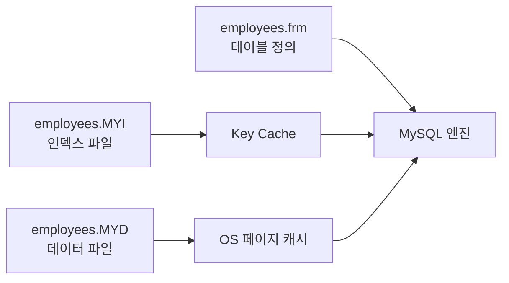

MyISAM은 인덱스만 자체 키 캐시에 보관하고, 데이터는 OS 페이지 캐시에 의존한다는 점이 InnoDB와의 가장 큰 차이입니다.

## MySQL 로그/감시 서브시스템

엔진·스토리지 레이어 위에서 동작을 추적하고 복구하는 것이 로그 서브시스템입니다.

| 로그             | 기본 위치                      | 주요 내용                                           | 활용                       |
| ---------------- | ------------------------------ | --------------------------------------------------- | -------------------------- |
| 에러 로그        | `--log-error`                  | 서버 시작/종료, 경고, 크래시 스택, InnoDB 복구 결과 | 운영 모니터링, 장애 분석   |
| 일반 쿼리 로그   | `general_log`                  | 모든 SQL, 접속/해제 이벤트                          | 디버깅, 감사(성능 영향 큼) |
| 슬로우 쿼리 로그 | `slow_log`                     | `long_query_time` 이상 SQL, 비인덱스 풀 스캔        | 성능 튜닝                  |
| 바이너리 로그    | `binlog.*`                     | DDL/DML 이벤트, GTID                                | 복제, PITR                 |
| 릴레이 로그      | `relay-log.*`                  | 레플리카가 받은 binlog                              | 복제 적용                  |
| InnoDB Redo/Undo | `ib_logfile*`, undo tablespace | 페이지 변경, 롤백/버전 관리                         | 크래시 복구, MVCC          |

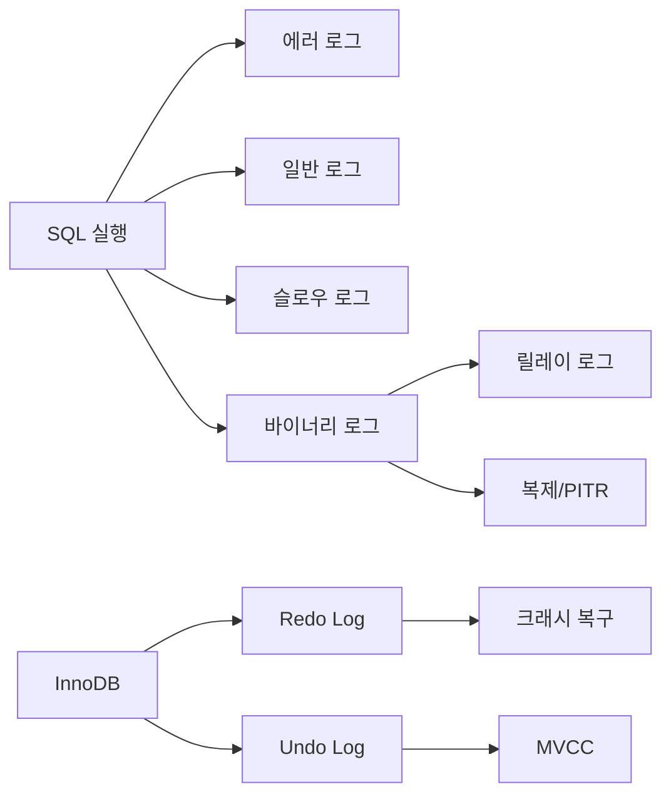

하나의 DML이 실행되면 위와 같이 여러 로그로 동시에 흘러 들어가며, 각 로그가 서로 다른 목적\(장애 분석, 감사, 복제, MVCC\)을 담당합니다.

### 설정 예시

```ini
[mysqld]
log-error = /var/log/mysql/mysqld.err
slow_query_log = ON
long_query_time = 1
log_output = TABLE
binlog_format = ROW
sync_binlog = 1
gtid_mode = ON
enforce_gtid_consistency = ON
server_id = 101
binlog_expire_logs_seconds = 604800
```

### 점검 루틴

1. 에러 로그에서 재시작, 크래시, 권한 오류를 우선 확인합니다.
2. 슬로우 쿼리 로그는 `pt-query-digest` 로 분석하면 쿼리별 응답시간/빈도/잠금/인덱스 사용 패턴을 한눈에 볼 수 있습니다.

```bash
pt-query-digest /var/log/mysql/slow.log --limit=5 --since '2025-11-08 00:00:00'
```

예시 결과

```text
# 1  35.2%  12.34s avg  200ms min  1.8s max  55.0% total  select app.order
#    Databases: app  Users: app_ro@10.0.%  Load: 1.44k qps
#    Rows examine: med 50.0k  Rows send: low 5
#    Full scan: 92%   Tmp table: 68%   Tmp disk: 12%   QC hit: 0%
#    Query_time distribution
#       1us
#     10us
#    100us  2.2%
#      1ms  8.5%
#     10ms  21.2%
#    100ms  51.7%  ##################
#       1s  16.4%  ####
SELECT /* trace_id=xxx */ o.id, o.status FROM orders o
WHERE o.created_at BETWEEN ? AND ? AND o.status = 'READY'
ORDER BY o.created_at DESC LIMIT 200;
```

위처럼 쿼리 텍스트와 응답 시간 분포, 풀스캔 여부 등이 요약되므로 인덱스 미스나 정렬/임시 테이블 사용 여부를 빠르게 파악할 수 있습니다. `--filter`, `--group-by`, `--output=json` 옵션을 이용해 특정 DB·사용자·쿼리 유형만 골라보는 것도 가능합니다.
3. `mysqlbinlog --start-datetime --stop-datetime` 으로 바이너리 로그를 조회해 감사/PITR 정보를 확보합니다.
4. `SHOW ENGINE INNODB STATUS`, Performance Schema 뷰로 redo/undo 상태를 모니터링합니다.
5. `mysqladmin flush-logs` 혹은 logrotate로 정기적인 로그 로테이션을 수행하고, `PURGE BINARY LOGS` 로 binlog 용량을 관리합니다.

---

MySQL 엔진의 쿼리 파이프라인과 핸들러 인터페이스, 스레드 풀·컴포넌트 프레임워크 같은 확장 구조를 이해하면 스토리지 엔진(InnoDB/MyISAM)과 로그 시스템이 왜 그렇게 설계되었는지 자연스럽게 연결됩니다. 이 흐름을 염두에 두고 4장의 나머지 내용을 읽어 두면 추후 튜닝이나 장애 대응 시 “어느 계층에서 문제를 살펴봐야 하는지” 훨씬 빨리 판단할 수 있습니다.
