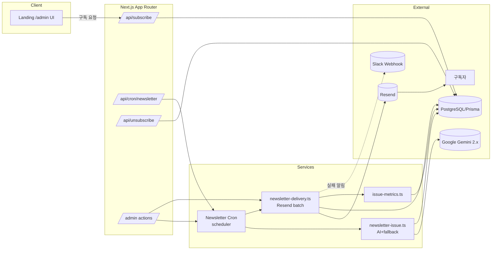

## Intro

> "내 관심 분야(Backend, Frontend, DevOps...)에 딱 맞는 질문이나 기술 토픽을 매일 아침 배달해 준다면 어떨까?"

이 아이디어를 빠르게 만들며 요즘 유행한느 vibe coding으로 한번 시도해보았습니다.

**Next.js, Prisma, Resend**, 그리고 **Google Gemini 2.0 Flash**를 엮여 'Dev Letter'라는 서비스를 만들었습니다. 이번 포스팅에서는 단순한 구현기를 넘어, AI를 프로덕션 레벨로 끌어올리기 위해 고민했던것을 적어보려고합니다.

## 1. 아키텍처 그려보기

vibe coding을 시작하기 앞서 Dev Letter가 어떻게 돌아가는지 큰 그림을 그렸습니다.

먼저 TODO리스트를 뽑고, AI와 대화하며 단계별로 구현해보기로했습니다. TODO를 잘 뽑아내면 AI가 구현은 잘 해줄 것이라고 생각했습니다. AI와 내가 생각하는 서비스를 구체화하며 TODO list, 아키텍처를 작성해나갔습니다.

```md
# Newsletter Automation TODO

## Phase 0: Groundwork

- [ ] 정의: 하루에 카테고리별 한 건 발행 → 총 `INTEREST_CATEGORIES.length` 만큼 일별 순환 여부 결정
- [ ] 현재 구독 정보(`Subscriber.interests`) 분석 및 중복 케이스 수집
- [ ] Resend 요금제·발송 한도 확인하고 대량 발송 전략(배치/레이트 리밋) 정리
- [ ] Gemini 사용 시 예상 토큰/비용 산정, 프롬프트 설계 가이드 초안 작성

## Phase 1: 데이터 모델링 & 마이그레이션

- [ ] Prisma 스키마 확장
  - [ ] `NewsletterIssue`: 카테고리별 발행 콘텐츠를 저장하며 생성/발송 상태를 추적 (`publishDate` 유니크 제약 포함)
  - [ ] `IssueDelivery`: 특정 이슈가 어떤 구독자에게 발송되었는지와 성공/실패 로그를 기록 (`status`, `sentAt`, 오류 메시지)
  - [ ] `Subscriber` 확장: 최근 발송 시각과 선호 발송 시간 필드를 도입하고 발송 로그 관계 설정
- [ ] 마이그레이션 작성 및 샘플 데이터 삽입 스크립트 준비
- [ ] Prisma 클라이언트 업데이트 및 타입 영향도 점검

## Phase 2: AI 콘텐츠 생성 파이프라인

- [ ] 카테고리별 프롬프트 템플릿 정의(질문 수, 톤, 포맷 포함)
- [ ] Gemini 호출 유틸(`/lib/ai.ts` 등) 구현: 재시도·타임아웃·코스트 로깅
- [ ] 생성 결과 정규화(JSON→배열) 및 필요 시 후처리(길이, 금칙어 필터)
- [ ] `NewsletterIssue` 생성 서비스 작성
  - [ ] 일자/카테고리 기준 중복 생성 방지
  - [ ] 실패 시 fallback 컨텐츠/재시도 전략 마련
- [ ] 질문/답변 세트(qaPairs)로 콘텐츠 저장 및 후처리 로직 보완
- [ ] 인수 테스트: 목킹된 Gemini로 안정성 검증

## Phase 3: 스케줄링 & 잡 인프라

- [ ] 일별 카테고리 선택 규칙 구현(예: 순환, 고정 시간표, 사용자 맞춤)
- [ ] Vercel Cron 또는 외부 워커 선택 및 환경 구성
  - [ ] cron 잡이 Prisma/Resend에 접근할 수 있도록 환경 변수 주입
- [ ] 잡 실행 플로우
  1. 전일 미발송 이슈 확인 및 재시도
  2. 오늘 발송 대상 카테고리 이슈 생성 및 저장
  3. 구독자 필터링(관심사 포함 + 구독 가능 상태)
  4. 발송 큐 등록
- [ ] 로컬에서 스케줄러 수동 실행 스크립트(`npm run cron:send`) 추가

## Phase 4: 이메일 템플릿 & 발송 로직

- [ ] React Email 기반 `DailyNewsletter` 템플릿 작성(카테고리, 질문 리스트, CTA 포함)
- [ ] HTML + 텍스트 버전 렌더링 & 스팸 필터 대응 설정
- [ ] Resend 발송 유틸 구축(배치 처리, 오류 로깅, 재시도 정책)
- [ ] 발송 결과를 `IssueDelivery`에 기록하고 실패 시 재발송 큐 재등록
- [ ] 수신 거부 링크 연결(구독 취소 API + 추적 토큰)

## Phase 5: 관리 도구 & 관측성

- [ ] 관리자용 대시보드/페이지(Next.js) 구축: 생성된 이슈 미리보기·승인·재발송·즉시 콘텐츠 생성
- [ ] 로그/알림: Slack 혹은 이메일로 실패 알림 전송
- [ ] Metrics 수집(발송 성공률, 오픈/클릭 추후 추가 가능)
- [ ] 감사 로그: 누가 어떤 이슈를 수동으로 보냈는지 기록

## Phase 6: 테스트 & 운영 준비

- [ ] 유닛 테스트: AI 유틸, 스케줄러, 발송 유틸 Mock 기반 검증
- [ ] 통합 테스트: 테스트 DB + Resend mock 서버 연동
- [ ] QA 체크리스트 작성(템플릿 깨짐, 시간대 검증, 구독 취소 플로우)
- [ ] 문서화 업데이트(README에 자동 발행 섹션, 운영 가이드)
- [ ] 점진적 롤아웃 계획 수립(내부 계정 → 제한된 사용자 → 전체)
```

핵심은 **"Cron이 트리거하고, AI가 컨텐츠를 생성하며, Resend가 배달한다"**는 단순한 파이프라인입니다.



### Flow Highlight
1.  **Trigger**: 매일 자정 Vercel Cron이 `/api/cron/newsletter`를 찌릅니다.
2.  **Generate**: `IssueSvc`가 오늘의 카테고리를 결정하고 Gemini에게 질문 생성을 요청합니다.
3.  **Queue**: 생성된 이슈를 DB에 저장하고, 해당 카테고리를 구독한 유저들을 찾아 발송 대기열(`IssueDelivery`)에 넣습니다.
4.  **Send**: `DeliverySvc`가 Resend API를 통해 이메일을 배치(Batch)로 발송합니다.
5.  **Audit**: 성공/실패 결과는 즉시 집계되어 관리자 대시보드와 Slack으로 전파됩니다.

이 흐름 속에서 가장 중요하게 고민했던 **4가지 기술적 포인트**를 하나씩 적어보았습니다.

## 2. Vibe Coding

아키텍처를 그린 뒤에는 본격적으로 'Vibe Coding'을 시작했습니다.

Vibe Coding이란 단순히 AI에게 코드를 짜달라고 하는 것을 넘어, **AI와 핑퐁하며 점진적으로 완성도를 높여가는 협업 방식**입니다.

### 2.1 TODO.md를 잘 작성해보자.

가장 먼저 한 일은 코딩이 아니라 `TODO.md`를 작성하는 것이었습니다.
이 문서는 저에게는 진행 상황판이었지만, **AI에게는 가장 중요한 프롬프트 컨텍스트**였습니다.

- "Phase 2의 `NewsletterIssue` 생성 로직을 짜줘."
- "Phase 3의 스케줄링 룰을 구현해줘."

이렇게 명확한 챕터(Phase)와 과업이 정의되어 있으니, AI도 길을 잃지 않고 정확한 모듈을 구현해낼 수 있었습니다.

### 2.2 Director vs. Implementer

이 과정에서 제 역할은 **구현자(Implementer)**에서 **감독(Director)**으로 바뀌었습니다.

- **Human (Director)**: "이 모듈은 재시도 로직이 필요해.", "여기서 JSON 파싱 에러가 나면 어떻게 복구할 거야?", "이 함수는 너무 기니 분리하자."
- **AI (Implementer)**: 실제 TypeScript 코드 작성, 테스트 케이스 생성, 리팩토링 수행.

오타나 문법 에러 같은 사소한 문제에서 해방되니, 오히려 **"비즈니스 로직의 허점은 없는가?", "사용자가 불편할 상황은 없는가?"** 같은 본질적인 고민에 더 집중할 수 있었습니다.

## 3. 프롬프트 엔지니어링 설정

가장 큰 챌린지는 **"어떻게 AI가 매번 고품질의 질문을 뽑아내게 할까?"**였습니다. 단순히 "좋은 질문 만들어줘"라고 하면 AI는 뻔한 질문만 내뱉습니다.

저는 `PROMPT_TEMPLATES`라는 상수 객체를 정의하여 각 카테고리(Backend, Network 등)마다 **페르소나(Persona), 톤(Tone), 초점(Focus)**을 다르게 설정했습니다.

```typescript
// src/lib/prompt-templates.ts

export const PROMPT_TEMPLATES: Record<InterestCategory, PromptTemplate> = {
  [InterestCategory.Backend]: {
    ...DEFAULT_TEMPLATE,
    label: "Backend",
    tone: "실무형", 
    focus: "대규모 분산 시스템, 트래픽 급증 대응, 장애 복구 전략",
    guidelines: [
      "데이터 일관성, 스케일링(수평/수직) 전환 사례를 포함한다.",
    ],
  },
  [InterestCategory.Network]: {
    ...DEFAULT_TEMPLATE,
    label: "Network",다.
    tone: "위기대응", // 네퉈워크 관련은 위기 대응 톤을 부여합니다.
    focus: "멀티 리전 네트워크 설계, CDN, 보안 사고 대응",
  },
  // ...
};
```

이렇게 설정을 분리해 두면, "요즘 백엔드 질문이 좀 싱거운데?" 싶을 때 **코드 로직을 건드리지 않고 프롬프트 설정값(`guidelines`)만 튜닝**하면 됩니다. 프롬프트도 관리해야 할 '코드'이자 '설정'인 셈입니다.

## 4. JSON 파싱

AI에게 `OUTPUT FORMAT STRICTLY: JSON`이라고 윽박질러도, 가끔은 말을 안 듣습니다.
- 마크다운 코드 블록(` ```json `)을 씌워서 주거나
- JSON 뒤에 사족("Here is the result...")을 붙이거나
- 아예 JSON 형식이 깨져서 오기도 합니다.

이를 해결하기 위해 **이중 파싱 전략(Dual Parsing Strategy)**을 도입했습니다.

1.  **1차 시도**: `JSON.parse`로 깔끔하게 파싱 시도.
2.  **2차 시도**: 실패하면 정규식(`parseBlockPairs`)을 사용해 텍스트에서 '질문(Q)'과 '답변(A)' 패턴을 강제로 뜯어냅니다.

```typescript
// src/lib/qa.ts

export function normalizeQaPairs(raw: string, options: NormalizeQaOptions) {
  // 1. JSON 파싱 시도
  const jsonPairs = parseJsonPairs(raw);
  if (jsonPairs.length > 0) {
    return jsonPairs;
  }

  // 2. 실패 시 텍스트 블록 파싱 (정규식 기반)
  return parseBlockPairs(raw);
}
```

이 로직 덕분에 AI가 가끔 이상한 포맷을 던져줘도, 서비스는 멈추지 않고 찰떡같이 데이터를 발라내어 저장할 수 있었습니다. **"AI 출력을 믿지 말고, 검증하고 복구."** 해야한 다는 것을 알 수 잇었습니다.

## 5. fallback 적용

새벽 3시에 Gemini API가 점검 중이거나, 토큰 한도가 초과되면 어떻게 될까요?
구독자들에게 "오늘 AI가 아파서 쉽니다"라는 메일을 보낼 수는 없습니다.

그래서 **fallback**을 구현했습니다. AI 생성(`geminiClient.generateText`)이 실패하거나 결과가 불충분하면, 미리 준비된 **정적 콘텐츠(Static Backup)**가 나갑니다.

> 추후에는 여러 모델로 시도할 수 있게 fallback을 구현하고 마지막 fallback으로 static backup을 사용할 예정입니다.

```typescript
// src/services/newsletter-issue.ts

try {
  // ... AI 생성 시도 ...
  source = "ai";
} catch (error) {
  console.warn("AI generation failed, switching to fallback");
}

if (!qaPairs) {// 
  qaPairs = buildFallbackQaPairs(template.label, template.questionCount);
  source = "fallback";
}
```

이 `buildFallbackQaPairs` 함수는 각 카테고리별로 가장 클래식하고 중요한 질문들(예: "장애 복구 사례", "트레이드오프 경험")을 담고 있습니다. 덕분에 시스템은 장애없이 뉴스레터를 발행할 수 있습니다.

## 6. Scheduling

> "오늘은 무슨 날이지?"

단순 랜덤으로 카테고리를 고르면, 'Backend'만 3일 연속으로 나가거나 'DevOps'가 한 달 동안 안 나갈 수도 있습니다. 뉴스레터는 **예측 가능**해야 합니다.

그래서 `YYYY-MM-DD` 날짜를 기준으로 절대 변하지 않는 **로테이션 인덱스**를 계산했습니다.

```typescript
// src/lib/category-rotation.ts

export function getDailyCategorySchedule(date = new Date()) {
  const diffMs = publishDate.getTime() - cycleStart.getTime();
  const offsetDays = Math.trunc(diffMs / MS_PER_DAY);
  
  // 날짜가 같으면 무조건 같은 인덱스(카테고리)가 나옵니다.
  const rotationIndex = mod(offsetDays, ROTATION.length);
  
  return { category: ROTATION[rotationIndex].category, ... };
}
```

이 방식의 장점은 **Stateless**하다는 점입니다. DB에 "어제 뭐 보냈지?"라고 물어볼 필요 없이, 오늘 날짜만 알면 오늘 보낼 카테고리가 정해집니다. 덕분에 서버가 재시작되어도, 스케줄러가 여러 번 실행되어도 중복 발행 위험이 없습니다.

## 7. 운영관점

오늘 AI가 쓴 글이 너무 별로라서 관리자가 업데이트를 직접할 수도 있게, 실제로 발송이 되었는지 체크할 수 있는 admin 페이지가 필요했습니다.

1.  **이슈 즉시 생성**: 스케줄러를 기다리지 않고 버튼 클릭으로 이슈 생성.
2.  **재발송(Resend)**: 특정 이슈를 수정하고 다시 전송.
3.  **감사 로그(Audit Log)**: 누가, 언제, 왜 버튼을 눌렀는지 기록.


```js
model AdminActionLog {
  id        String   @id @default(cuid())
  actor     String   // 누가?
  action    String   // 무엇을? (resend_issue, approve_issue)
  metadata  Json?    // 상세 내용
  createdAt DateTime @default(now())
}
```


## 마치며: Vibe Coding의 즐거움

단순히 "AI 붙여서 서비스 만들었다"가 아니라, **"AI의 불확실성을 어떻게 엔지니어링으로 제어했는가"**가 이 프로젝트의 핵심이었습니다.

- 아키텍처 기반의 워크플로우
- 프롬프트 템플릿화
- json 파싱
- Fallback
- 스케줄링

Dev Letter는 지금도 매일 아침 조용하고 확실하게 저에게 이메일을 보내주고 있습니다. AI를 활용해서 다양한 것을 만들고, 자동화를 하다보면 시간도 아끼고, 어떻게 AI와 대화해야하는지도 자연스럽게 배울 수 있는 기회였습니다.
