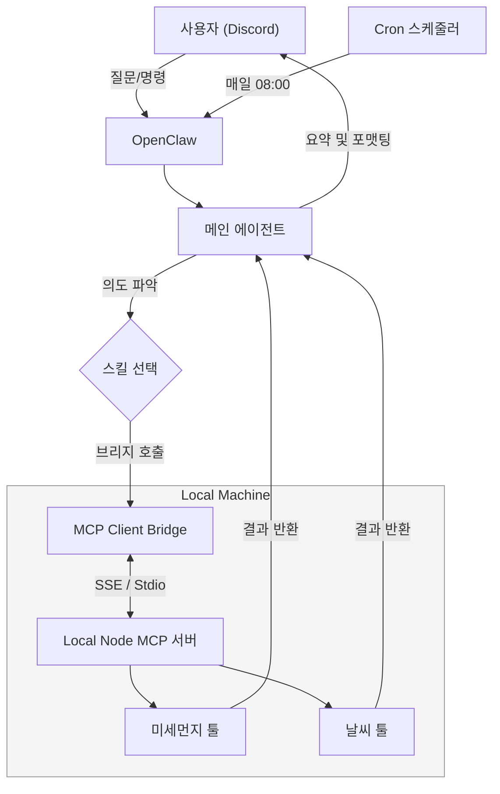
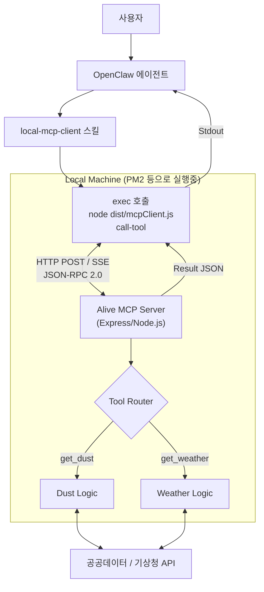

## 1. 개요: 왜 로컬 에이전트인가?

많은 AI 서비스가 클라우드 기반으로 동작하지만, 내 로컬 환경의 스크립트를 실행하거나 민감한 데이터를 다룰 때는 한계가 있습니다. **OpenClaw**는 이런 문제를 풀기 위한 게이트웨이로 꽤 매력적이었습니다.

> **"매일 아침 8시, 디스코드에서 오늘 날씨와 미세먼지 정보를 브리핑받자."**


이 글은 공공데이터포털 API와 기상청 API를 이용해, OpenClaw와 Local MCP를 연결하고 매일 아침 날씨와 미세먼지 정보를 자동으로 브리핑해주는 개인화된 AI 에이전트를 구성해본 기록입니다.

요즘은 GPT 구독만으로도 예약 작업을 어느 정도 만들 수 있습니다. 그럼에도 OpenClaw를 따로 써본 이유는 두 가지였습니다. 하나는 Discord 채널에 붙여 여러 사람이 함께 사용할 수 있다는 점이고, 다른 하나는 로컬 파일시스템, 로컬 네트워크, 개인 스크립트에 직접 접근하면서 더 다양한 자동화를 실험해볼 수 있다는 점이었습니다.

이를 위해 다음과 같은 기술 스택을 사용했습니다.

- **Interface**: Discord
- **Gateway**: OpenClaw
- **Bridge / Agent Logic**: Local Node.js Wrapper + MCP Client
- **Tools**: 공공데이터포털 API, 기상청 API

## 2. Local MCP를 붙이려 했는데, 이게 맞나?: OpenClaw는 왜 Local MCP를 바로 붙이지 못할까?

처음에는 "Claude Desktop처럼 OpenClaw에도 로컬 MCP 서버를 그냥 등록하면 되겠지?"라고 생각했습니다. 그런데 실제로는 그렇게 단순하지 않았습니다.

2026년 3월 8일 기준으로 확인해보면, OpenClaw의 공식 확장 포인트는 **Skills**와 **Exec** 중심입니다.

- 공식 [Creating Skills 문서](https://docs.openclaw.ai/tools/creating-skills)는 스킬을 새 기능 추가의 기본 단위로 설명합니다.
- 공식 [Exec Tool 문서](https://docs.openclaw.ai/tools/exec)는 워크스페이스에서 셸 명령을 실행하는 방식을 기본 도구로 안내합니다.
- 공식 [Default AGENTS.md 문서](https://docs.openclaw.ai/reference/AGENTS.default)에서도 `mcporter`를 외부 스킬 백엔드를 다루는 핵심 스킬로 소개합니다.

반면, 제가 확인한 공식 문서 범위에서는 Claude Desktop처럼 **로컬 MCP 서버를 직접 등록하고 OpenClaw가 프로세스를 상주시켜 관리하는 가이드**를 찾지 못했습니다.

> 추가로 OpenClaw의 ACP 계층이 `mcpCapabilities`에서 `http`, `sse`를 `false`로 두고, 세션 생성 시 전달한 `mcpServers`를 무시한다라는 [github issue](https://github.com/openclaw/openclaw/issues/5085)도 존재합니다.

그래서 OpenClaw를 **MCP 호스트**라기보다, **스킬과 명령 실행을 오케스트레이션하는 게이트웨이**로 이해하니, Local MCP를 붙이려면 중간 번역층이 필요했습니다.

### 2.1. 그래서 어떤 번역층이 필요한가?

핵심은 OpenClaw가 이해하기 쉬운 형태로 Local MCP를 감싸는 것입니다. 즉, MCP 서버를 OpenClaw에 그대로 꽂는 대신 **OpenClaw의 Skill/Exec 계층 위에 번역층을 하나 올리는 구조**가 필요했습니다.

제가 사용한 최종 구조는 `MCP Client Bridge` 방식입니다. `Exec` 방식도 가능하지만, 둘의 비교와 제가 최종적으로 `Bridge`를 선택한 이유는 뒤의 `4장`에서 따로 정리하겠습니다.

## 3. 전체 아키텍처 (The Flow)

시스템 흐름은 아래처럼 보는 편이 실제 구현과 가장 가깝습니다. 사용자가 디스코드에 질문하거나, 정해진 시간에 Cron이 트리거를 보내면 OpenClaw가 스킬을 선택하고, 그다음부터는 MCP 브리지가 실제 로컬 도구 호출을 처리합니다.



이 구조의 핵심은 **인터페이스와 로직의 분리**와 **프로토콜 번역층의 추가**입니다. 디스코드는 대화창이고, OpenClaw는 메시지 라우팅과 스킬 선택을 맡고, 실제 로컬 작업은 `MCP Client Bridge`가 받아서 처리합니다.

## 4. 왜 최종적으로 MCP Bridge를 선택했나?

OpenClaw에 Local MCP를 붙이는 방법은 크게 두 가지였습니다. 하나는 스크립트를 바로 실행하는 `Exec` 방식이고, 다른 하나는 상주 중인 MCP 서버 앞에 `MCP Client Bridge`를 두는 방식입니다.

### 4.1. 방법 1: Exec 방식 (가장 현실적인 첫 단계)

OpenClaw가 필요할 때마다 `node runScript.js` 명령어로 스크립트를 단발성으로 실행하는 방식입니다.

- **작동 원리**: 요청 -> 프로세스 생성 -> 실행 -> 표준 출력으로 결과 반환 -> 프로세스 종료
- **장점**: 구현이 가장 단순합니다. OpenClaw의 공식 확장 방식인 Skill + Exec 흐름과 잘 맞습니다.
- **단점**: 매번 프로세스를 새로 띄우므로 무겁고, 상태를 유지할 수 없습니다.

제 예제 코드의 `src/runDust.ts`가 이 방식입니다.

```typescript
// runDust.ts (Exec 방식)
// 1. 실행 시 인자를 받음
const args = process.argv[2];
// 2. 로직 수행 (API 호출 등)
const result = await dustApi.get(args);
// 3. 표준 출력(stdout)으로 JSON을 뱉고 종료
console.log(JSON.stringify(result));
```

### 4.2. 방법 2: MCP Client Bridge 방식

계속 떠 있는 MCP 서버에 OpenClaw가 직접 붙는 대신, **중간 브리지 클라이언트**가 붙는 방식입니다.

- **작동 원리**: OpenClaw -> Bridge Client (`mcpClient.ts`) -> MCP Server (SSE / Stdio)
- **장점**: MCP 프로토콜을 유지할 수 있고, 서버를 계속 띄워둔 채 연결을 재사용할 수 있습니다.
- **단점**: 서버와 브리지 스크립트를 둘 다 관리해야 하므로 처음엔 번거롭습니다.

저는 `mcp-claude-test` 리포지토리에 `src/mcpClient.ts`를 구현해두었습니다. 이 클라이언트가 OpenClaw와 실제 MCP 서버 사이의 통역 역할을 맡습니다.

```bash
# 사용 예시
node dist/mcpClient.js call-tool "get_weather" '{"city": "seoul"}'
```



### 4.3. 그래서 왜 Bridge를 택했나?

이 프로젝트에서는 `Exec`보다 `Bridge` 쪽이 더 적합했습니다. 표준을 지키고 싶어서이기도 하고, 실제 운영 조건에서 이점이 더 컸기 때문입니다.

1. **상태를 유지할 수 있습니다.**
   `Exec` 방식은 요청마다 새 프로세스를 띄우므로 매번 초기화가 필요합니다. 반면 `Bridge` 방식은 뒤에 있는 MCP 서버를 계속 띄워둘 수 있어 세션, 연결, 캐시 같은 상태를 유지하기 쉽습니다.
2. **도구가 늘어날수록 구조가 덜 무너집니다.**
   처음엔 `runDust.js`, `runWeatherShort.js` 정도면 충분하지만, 툴이 많아질수록 실행 스크립트가 늘어나고 인자 규약도 제각각 되기 쉽습니다. 브리지 방식은 MCP 서버 안에 툴 목록과 스키마를 모아둘 수 있어 확장 시 관리가 더 편합니다.
3. **MCP 표준에 더 가깝습니다.**
   나중에 OpenClaw가 네이티브 MCP를 더 잘 지원하게 되거나, 다른 MCP 클라이언트로 옮기더라도 브리지 뒤의 서버 구조는 대부분 유지할 수 있습니다. 즉, 브리지는 임시 우회이면서도 장기적으로 덜 버리는 선택입니다.
4. **성능과 운영 측면에서 유리합니다.**
   외부 API 호출이 많아지거나 DB, 파일 인덱스, 사내 API 같은 리소스를 붙이기 시작하면 매 요청마다 프로세스를 띄우는 비용이 거슬리기 시작합니다. 이때는 상주 서버를 두는 편이 응답 속도와 운영 안정성에서 유리합니다.

#### 어떤 방식을 써야 할까?

Exec 방식과 MCP Client Bridge 방식을 정리해보았습니다.

| 특징 | Exec 방식 | MCP Client Bridge 방식 |
| :--- | :--- | :--- |
| **난이도** | 쉬움 (입문용) | 중간 (실전용) |
| **성능** | 낮음 (매번 프로세스 생성) | 높음 (서버 상주) |
| **상태 유지** | 불가능 | 가능 |
| **표준 MCP 활용도** | 낮음 | 높음 |
| **추천 대상** | 간단한 스크립트, 크롤링 | 복잡한 앱, DB 연동, 장기 운영 |

저는 처음에 Exec 방식으로 시작했다가, 응답 속도와 확장성 때문에 MCP Client Bridge 방식으로 넘어갔습니다. 처음 시도라면 Exec로 빨리 성공 경험을 만들고, 병목이 생기면 Bridge 구조로 옮기는 순서를 추천합니다.

## 5. 핵심 구현: Local MCP Server와 Skill 구성

앞에서 구조를 정리했으니, 이제 실제 구현 요소만 간단히 보겠습니다. 로컬에서는 **MCP(Model Context Protocol)**를 사용해 도구 호출 구조를 정리했습니다.

### 5.1. MCP 서버 구성 (`mcp-claude-test-server`)

Node.js와 Express를 사용해 SSE 기반의 MCP 서버를 구축했습니다.

- **서버 초기화**: `McpServer` 클래스로 서버를 띄우고 capabilities를 정의합니다.
- **툴 등록**: `registerAllTools(server)`를 통해 날씨/미세먼지 툴을 연결합니다.
- **통신**: `/mcp` 엔드포인트에서 클라이언트와 요청을 주고받습니다.

```typescript
// src/server.ts
const server = new McpServer({
  name: "mcp-claude-test-server",
  version: "1.0.0"
});

// Express로 HTTP 서버 구동
app.post("/mcp", async (req, res) => {
  // 세션 처리 및 MCP 요청 핸들링
});
```

### 5.2. 실전 툴 구현 (Skills)

에이전트가 사용할 스킬을 정의합니다. `skill.md` 파일에 자연어 매핑 규칙을 적어두면, 사용자의 한국어 질문을 적절한 도구 호출로 연결할 수 있습니다.

> OpenClawsms 사용자와 interaction을 할때, 적당히 skill.md를 스스로 작성하며 작업합니다. 그리고 prompt에 메시지로 받을 템플릿도 지정해주고 "skill로 등록해. 혹은 다음부터 이렇게 나한테 메시지 주면돼. 기억해." 등의 명령을 내리면, OpenClaw가 알아서 skill.md를 작성하고, 템플릿을 지정하고, 기억합니다.

**예시 시나리오**

- 사용자: "오늘 부산 날씨 어때?"
- 에이전트: "지역은 부산, 날짜는 오늘이군. 날씨 툴을 호출하자."

**주요 툴**

1. **DustTool (미세먼지)**
   - 공공데이터포털의 시도별 대기오염 API를 호출합니다.
   - 입력: `{ "sidoName": "서울" }`
   - 출력: PM10, 통합대기지수 등을 포함한 JSON 데이터
2. **WeatherForcastShortTermTool (단기예보)**
   - 기상청 단기예보 API를 호출합니다.
   - 사용자 친화적 요약을 위해 체감 온도, 옷차림 추천 같은 문장으로 후처리합니다.

## 6. 자동화의 완성: Discord & Cron

### 6.1. Discord 연동

OpenClaw 설정을 통해 디스코드 봇 토큰을 연결했습니다. 이제 폰이나 PC 어디서든 디스코드를 켜면 내 전용 AI 비서와 대화할 수 있습니다.

### 6.2. Cron을 이용한 자동화

OpenClaw 자체 Cron기능을 이용해 매일 아침 10시에 작업을 자동화할 수 있습니다.

그러면 Cron에 등록한 작업이 수행되어 메시지 채널로 사용자한테 보내줍니다.

> **2026-02-14(토) 모닝 브리핑**
>
> **체감 정리**
> - 아침: 2도, 꽤 쌀쌀해요. 코트 꼭 챙기세요.
> - 점심: 8도, 산책하기 좋은 날씨입니다.
> - 미세먼지: 서울 전역 보통. 큰 부담 없이 외출 가능합니다.


## 7. 마치며: 나만의 AI 시스템 구축하기

이번 글에서는 OpenClaw를 설치하고, Discord와 Cron을 연동해 간단한 개인용 자동화를 직접 구성해보았습니다. 그 과정에서 가장 흥미로웠던 점은 OpenClaw가 로컬 도구를 다루는 방식이었습니다.

처음에는 Claude Desktop처럼 Local MCP를 바로 붙이는 구조를 기대했지만, 실제로는 Skill과 Exec를 중심으로 기능을 연결하고, 필요할 때 그 위에 MCP 브리지를 얹는 쪽이 더 자연스럽다는 점을 확인할 수 있었습니다. 이 차이를 이해하고 나니, 왜 간단한 자동화는 `Exec`로 빠르게 시작하고, 도구가 많아지거나 상태 유지가 필요해지면 `Bridge` 구조가 더 유리한지도 훨씬 분명해졌습니다.

앞으로는 지금 만든 날씨 브리핑을 시작점으로 삼아, 파일 처리나 내부 API 호출 같은 더 복잡한 작업도 하나씩 붙여볼 생각입니다.

> 공식 기능은 앞으로 달라질 수 있으니, 이 글을 읽는 시점에 OpenClaw가 Local MCP를 네이티브로 지원하게 되었는지도 함께 확인해보시길 권합니다.
{:.prompt-info}

## 참고 자료

- [OpenClaw Creating Skills](https://docs.openclaw.ai/tools/creating-skills)
- [OpenClaw Exec Tool](https://docs.openclaw.ai/tools/exec)
- [OpenClaw Default AGENTS.md](https://docs.openclaw.ai/reference/AGENTS.default)
- [OpenClaw Testing](https://docs.openclaw.ai/help/testing)
- [Community note: OpenClaw Can't Use MCP Servers Natively — How We Solved It](https://gist.github.com/Rapha-btc/527d08acc523d6dcdb2c224fe54f3f39)
