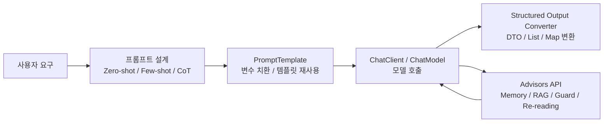

> 이 글은 **Spring AI 시리즈**의 1편입니다.
>
> - 1편: Spring AI Basic — Prompt, Template, Structured Output (현재 글)
> - 2편: [Spring AI Advisors API — 메모리, RAG, 가드, 로깅](/posts/spring-ai-advisor/)
> - 3편: [Spring AI Tool Calling과 MCP](/posts/spring-ai-tool-mcp/)
> - 4편: [Spring AI Multimodal — 이미지, 오디오](/posts/spring-ai-multimodal/)
> - 5편: [Spring AI Embedding과 RAG 심화](/posts/spring-ai-rag/)

Spring AI를 처음 공부하면 개념이 비슷해 보여서 헷갈리는 지점이 많습니다.  
`PromptTemplate`, `Structured Output Converter`, `Advisor`가 각각 따로 노는 기능처럼 보이기 때문입니다.

그런데 실제로는 이 개념들이 하나의 흐름으로 연결됩니다.

- 프롬프트를 어떻게 설계할 것인가
- 그 프롬프트를 코드에서 어떻게 재사용할 것인가
- 응답을 어떻게 안정적으로 구조화할 것인가

이 글은 그 기초 흐름을 정리한 1편입니다. Advisor, Tool Calling/MCP, Multimodal, RAG 같은 확장 주제는 시리즈 2~5편에서 이어집니다.

중간중간 위키독스의 [Memory 활용 대화 에이전트 실습](https://wikidocs.net/323541)도 함께 참고했습니다.

> springboot3 + java sample은 [github-sample](https://github.com/ydj515/sample-repository-example/tree/main/spring-ai-example)를 참조해주세요.

## 전체 그림 먼저 보기

Spring AI의 학습 흐름은 아래 그림처럼 이해하면 편합니다.



이 글(1편)에서 다루는 범위는 위 그림의 **프롬프트 설계 → PromptTemplate → ChatClient → Structured Output** 까지입니다.  
이후 흐름은 다음 글들에서 이어집니다.

- 2편: 메모리/RAG/가드/로깅 정책을 분리하는 `Advisors API`
- 3편: 모델이 외부 기능을 호출하게 만드는 `Tool Calling`과 표준 연결 계층 `MCP`
- 4편: 텍스트 바깥의 입출력 — `Multimodal`(Vision)과 `Audio`(TTS/STT)
- 5편: 의미 기반 검색을 활용하는 `Embedding`/`VectorStore`/`RAG`

즉, 단순히 모델을 호출하는 데서 끝나는 것이 아니라 다음 순서로 발전합니다.

1. 프롬프트를 잘 쓴다.
2. 그 프롬프트를 템플릿으로 관리한다.
3. 응답을 DTO처럼 구조화해서 받는다.
4. 메모리나 RAG 같은 정책을 Advisor로 분리한다.
5. Tool Calling과 MCP로 외부 세계와 연결한다.

## 1. Prompt Engineering: Zero-shot, Few-shot, Chain-of-Thought

Spring AI를 잘 쓰려면 API보다 먼저 프롬프트 감각을 잡아야 합니다.  
공식 문서도 `Zero-shot`, `Few-shot`, `Role Prompting`, `Step-Back Prompting`, `Chain-of-Thought`, `Self-Consistency`, `ReAct` 같은 패턴을 별도로 설명하고 있습니다.

### 가장 먼저 해볼 최소 예시

프롬프트 패턴을 보기 전에, `ChatClient`가 어떻게 동작하는지 가장 작은 예시를 먼저 한 번 보는 편이 흐름상 자연스럽습니다.

```java
ChatClient chatClient = ChatClient.create(chatModel);

String answer = chatClient.prompt()
    .user("Spring AI의 PromptTemplate이 왜 필요한지 한 문단으로 설명해줘.")
    .call()
    .content();
```

이 예시는 "사용자 질문 하나를 모델에 전달하고, 문자열 응답 하나를 받는다"는 가장 기본적인 흐름입니다.  
즉 이후에 나오는 `few-shot`, `system message`, `PromptTemplate`, `Structured Output`, `Advisor`, `Tool Calling`은 모두 이 기본 흐름 위에 하나씩 확장되는 요소라고 생각하면 이해가 쉬워집니다.

### Zero-shot

가장 기본적인 방식입니다. 예시 없이 바로 지시합니다.

```text
다음 사용자 리뷰를 POSITIVE, NEUTRAL, NEGATIVE 중 하나로 분류하라.
리뷰: 배송은 빨랐지만 포장이 조금 아쉬웠다.
```

장점은 단순하고 빠르다는 것입니다.  
단점은 애매한 작업일수록 출력 포맷이 흔들리거나, 기대한 판단 기준이 모델에 정확히 전달되지 않을 수 있다는 점입니다.

### Few-shot

예시를 먼저 보여주고, 그다음에 새 입력을 넣는 방식입니다.

```text
입력: 정말 만족스러웠어요.
출력: POSITIVE

입력: 그냥 무난했어요.
출력: NEUTRAL

입력: 다시는 사고 싶지 않아요.
출력: NEGATIVE

입력: 배송은 빠른데 품질은 애매해요.
출력:
```

이 방식은 분류, 포맷 강제, 답변 톤 통일에 특히 강합니다.  
실무에서는 `응답 형식 맞추기`, `사내 문체 통일`, `에러 메시지 요약 형식 고정` 같은 작업에서 매우 유용합니다.

### Chain-of-Thought

많이 헷갈리는 부분인데, `Chain-of-Thought`는 Spring AI의 별도 전용 API라기보다 **추론을 유도하는 프롬프트 패턴**으로 이해하는 편이 정확합니다.

예를 들면 다음과 같이 씁니다.

```text
문제를 단계별로 분석하고, 마지막에 결론만 간단히 정리하라.
```

또는

```text
차근차근 생각해보고, 핵심 근거를 3개만 요약하라.
```

중요한 점은 두 가지입니다.

- 단순 질의응답에는 Zero-shot이 더 간단하고 충분할 수 있습니다.
- 복잡한 분해, 계획, 비교 판단이 필요한 작업은 CoT 스타일이 더 안정적일 수 있습니다.

다만 CoT를 항상 길게 쓰는 것이 정답은 아닙니다.  
실서비스에서는 내부 추론을 장황하게 출력시키는 것보다, **중간 체크리스트나 최종 구조화 결과를 요구하는 방식**이 더 유지보수하기 쉬운 경우가 많습니다.

### Spring AI에서 이 개념들이 어떻게 연결될까?

Spring AI에서는 위 패턴들이 보통 아래 조합으로 구현됩니다.

- `ChatClient` 또는 `ChatModel`로 기본 호출
- `PromptTemplate`로 프롬프트 재사용
- `Advisor`로 반복되는 프롬프트 보강 정책 분리
- `Structured Output`으로 결과를 안전하게 후처리

즉, 프롬프트 엔지니어링은 문장 몇 줄의 스킬이 아니라, 점점 코드 구조로 승격됩니다.

## 2. PromptTemplate: 문자열이 아니라 관리 가능한 프롬프트 자산

처음에는 아래처럼 문자열을 바로 넣고 싶은 유혹이 있습니다.

```java
String result = chatClient.prompt()
    .user("Spring AI의 핵심 개념을 설명해줘")
    .call()
    .content();
```

이 방식은 간단하지만, 프롬프트가 길어지고 변수도 늘어나면 금방 관리가 어려워집니다.  
이때 `PromptTemplate`이 필요해집니다.

공식 문서 기준으로 Spring AI의 `PromptTemplate`은 `TemplateRenderer`를 사용해 템플릿을 렌더링합니다. 기본 구현은 `StTemplateRenderer`이며, 기본 변수 구분자는 `{}` 입니다.

예를 들어 아래처럼 템플릿을 분리할 수 있습니다.

```java
String systemTemplate = """
너는 Spring AI 학습을 도와주는 시니어 개발자다.
설명 수준은 {level} 이고, 예제는 {language} 기준으로 제공하라.
""";

String userTemplate = """
다음 주제를 정리해줘: {topic}
반드시 핵심 개념, 사용 시점, 주의점 순서로 설명하라.
""";
```

이 방식의 장점은 분명합니다.

- 프롬프트를 코드와 분리할 수 있습니다.
- 변수 주입이 명확해집니다.
- 같은 템플릿을 여러 요청에서 재사용할 수 있습니다.
- 테스트 시에도 어떤 입력으로 어떤 프롬프트가 생성됐는지 추적하기 쉽습니다.

### JSON 프롬프트를 많이 쓸 때 주의할 점

실무에서는 JSON 예시를 프롬프트에 넣는 경우가 많습니다.  
그런데 기본 구분자 `{}` 는 JSON 중괄호와 충돌할 수 있습니다.

이 경우 공식 문서처럼 `StTemplateRenderer`의 구분자를 `< >` 등으로 바꿔두면 훨씬 편합니다.

```java
PromptTemplate promptTemplate = PromptTemplate.builder()
    .renderer(StTemplateRenderer.builder()
        .startDelimiterToken('<')
        .endDelimiterToken('>')
        .build())
    .template("""
        다음 내용을 JSON으로 정리하라.
        topic: <topic>
        """)
    .build();
```

이런 디테일이 바로 "프롬프트를 문자열로 쓰는 것"과 "프레임워크 안에서 관리하는 것"의 차이입니다.

## 3. Structured Output Converter: 문자열을 DTO로 바꾸는 순간

LLM 결과를 문자열로만 받으면 결국 파싱 지옥이 옵니다.

- `"title: ..."` 형식이 조금만 바뀌어도 파싱이 깨집니다.
- 줄바꿈 하나만 달라져도 후처리 코드가 지저분해집니다.
- downstream 로직이 늘어날수록 예외 처리가 복잡해집니다.

Spring AI는 이 문제를 `Structured Output Converter`로 풀 수 있게 해줍니다.

공식 문서에서 제공하는 대표 구현은 다음과 같습니다.

- `BeanOutputConverter`
- `MapOutputConverter`
- `ListOutputConverter`

고수준 API에서는 더 간단하게 `.entity()`를 쓸 수 있습니다.

```java
record StudyOutline(String title, List<String> keyPoints) {}

StudyOutline outline = ChatClient.create(chatModel).prompt()
    .user("Spring AI 핵심 개념을 3개로 정리해줘")
    .call()
    .entity(StudyOutline.class);
```

이렇게 하면 결과를 바로 DTO처럼 받을 수 있습니다.  
즉, LLM을 단순 텍스트 생성기가 아니라 **애플리케이션의 데이터 공급자**처럼 다루게 됩니다.

### 내부적으로 무슨 일이 일어날까?

`BeanOutputConverter`는 크게 두 단계를 수행합니다.

1. 호출 전에 출력 형식을 설명하는 가이드를 프롬프트에 추가합니다.
2. 응답 후에는 결과를 JSON 기반으로 변환하여 자바 객체로 매핑합니다.

공식 문서에서 특히 중요한 표현은 `best effort`입니다.  
즉, structured output conversion은 매우 유용하지만 모델이 항상 완벽한 형식을 지켜준다고 보장하지는 않습니다.

그래서 운영 환경에서는 아래 전략을 같이 고민해야 합니다.

- DTO 검증
- 재시도
- fallback 응답
- schema 단순화

### Native Structured Output

최근 모델들은 JSON Schema 기반의 native structured output을 직접 지원합니다.  
Spring AI는 `AdvisorParams.ENABLE_NATIVE_STRUCTURED_OUTPUT`를 통해 이 기능을 사용할 수 있게 해줍니다.

```java
record StudyNote(String title, List<String> sections) {}

StudyNote note = ChatClient.create(chatModel).prompt()
    .advisors(AdvisorParams.ENABLE_NATIVE_STRUCTURED_OUTPUT)
    .user("Spring AI 학습 순서를 정리해줘")
    .call()
    .entity(StudyNote.class);
```

이 방식의 장점은 다음과 같습니다.

- 포맷 지시문을 프롬프트에 길게 붙이지 않아도 됩니다.
- 모델이 스키마에 맞춘 응답을 더 안정적으로 보장합니다.
- 출력 후처리 코드가 단순해집니다.

단, 공식 문서 기준으로 일부 모델은 **최상위 배열 객체**를 네이티브 구조화 출력으로 잘 처리하지 못할 수 있으므로, 이런 경우는 객체 래핑을 고려하는 편이 안전합니다.

## 4. Advisors API는 어디로 갔나?

기존 통합 글에서 가장 길었던 **Advisors API** (메모리, RAG 주입, advisor 순서, advisor-context, `ChatMemory.CONVERSATION_ID`, `CallAdvisor`/`BaseAdvisor` 직접 구현) 섹션은 양이 많아 별도 글로 분리했습니다.

> Advisor는 ChatClient 위에 끼우는 "정책 레이어"입니다. 메모리/RAG/가드/로깅을 모두 이 레이어에서 다루기 때문에, 이번 시리즈에서도 한 글을 통째로 할애했습니다.

이어서 학습할 글:

- [2편 — Spring AI Advisors API](/posts/spring-ai-advisor/)

## 5. 설정값: 기본 연결, Chat Options, Retry

Spring AI를 공부하다 보면 `ChatClient` 기본 호출 흐름은 이해했는데, 정작 `application.yml`에는 무엇을 써야 할지 막막한 경우가 많습니다.  
이 섹션에서는 **basic 흐름에서 실제로 자주 쓰는 `application.yml` 설정값**을 한곳에 정리해보겠습니다.

MCP 관련 설정은 [3편 — Tool Calling과 MCP](/posts/spring-ai-tool-mcp/),  
이미지/오디오 옵션은 [4편 — Multimodal](/posts/spring-ai-multimodal/),  
VectorStore/Chat Memory 설정은 [5편 — RAG](/posts/spring-ai-rag/)에서 다룹니다.

먼저 전체 그림을 보는 용도로 아래 같은 예시를 두고 시작하면 이해가 쉽습니다.

```yaml
spring:
  ai:
    model:
      chat: openai
    openai:
      api-key: ${OPENAI_API_KEY}
      base-url: https://api.openai.com
      chat:
        base-url: https://api.openai.com
        completions-path: /v1/chat/completions
        options:
          model: gpt-4o-mini
          temperature: 0.2
          max-tokens: 800
          response-format:
            type: JSON_OBJECT
    retry:
      max-attempts: 5
      backoff:
        initial-interval: 2s
        multiplier: 2
        max-interval: 30s
      on-client-errors: false
```

물론 모든 프로젝트가 이 값을 다 쓰는 것은 아닙니다.  
하지만 위 예시는 "모델 연결", "생성 옵션", "재시도"가 어디에 위치하는지를 한눈에 보여줍니다.

아래 예시는 **OpenAI를 대표 예시로 든 것**입니다.  
Anthropic, Ollama, Vertex AI 등 다른 모델을 쓰면 접두사만 바뀌고, 사고방식은 거의 비슷합니다.

### 5.1. 기본 연결 설정

가장 기본은 "어떤 채팅 모델 구현을 쓸지"와 "어느 엔드포인트에 어떤 키로 붙을지"를 정하는 것입니다.

```yaml
spring:
  ai:
    model:
      chat: openai
    openai:
      api-key: ${OPENAI_API_KEY}
      base-url: https://api.openai.com
      chat:
        options:
          model: gpt-4o-mini
          temperature: 0.2
```

여기서 핵심 프로퍼티는 다음과 같습니다.

| 프로퍼티 | 의미 | 언제 조정하나 |
| --- | --- | --- |
| `spring.ai.model.chat` | 어떤 chat auto-configuration을 활성화할지 결정합니다. 공식 문서 기준 `openai`로 활성화하고, `none`이면 비활성화됩니다. | 여러 모델 구현을 실험하거나, 특정 환경에서 chat model 자동 설정을 끄고 싶을 때 |
| `spring.ai.openai.api-key` | OpenAI API 키입니다. | 로컬, 스테이징, 운영 환경 분리 시 |
| `spring.ai.openai.base-url` | OpenAI 기본 엔드포인트입니다. | 프록시, 게이트웨이, 호환 API를 붙일 때 |
| `spring.ai.openai.chat.api-key` | chat 전용 API 키 override 입니다. | 임베딩/채팅 키를 분리 관리할 때 |
| `spring.ai.openai.chat.base-url` | chat 전용 base URL override 입니다. | 채팅 요청만 별도 프록시를 타게 할 때 |
| `spring.ai.openai.chat.completions-path` | chat 요청 path 입니다. 기본값은 `/v1/chat/completions` 입니다. | OpenAI 호환 서버가 다른 path 규약을 가질 때 |

이 설정에서 가장 중요한 포인트는 `spring.ai.model.chat`입니다.  
예전에는 provider별 `enabled` 플래그를 많이 봤지만, 공식 문서 기준 최근 Spring AI는 상위 레벨의 `spring.ai.model.chat` 속성으로 chat auto-configuration을 제어하는 흐름을 사용합니다.

### 5.2. Chat Options 설정값

실무에서는 아래 옵션들을 가장 많이 만집니다.

```yaml
spring:
  ai:
    openai:
      chat:
        options:
          model: gpt-4o-mini
          temperature: 0.2
          max-tokens: 800
          response-format:
            type: JSON_OBJECT
          parallel-tool-calls: true
          internal-tool-execution-enabled: true
```

각 값은 아래처럼 이해하면 됩니다.

| 프로퍼티 | 의미 | 실무 팁 |
| --- | --- | --- |
| `spring.ai.openai.chat.options.model` | 사용할 모델 이름입니다. 공식 문서 예시 기본값은 `gpt-4o-mini` 입니다. | 빠른 응답이 중요하면 경량 모델, 복잡한 추론이 중요하면 상위 모델 |
| `spring.ai.openai.chat.options.temperature` | 출력의 무작위성과 창의성을 조절합니다. | 요약, 분류, 추출은 `0.0 ~ 0.3`, 아이디어 생성은 더 높게 |
| `spring.ai.openai.chat.options.maxTokens` | 비추론형 모델에서 생성 토큰 수 상한입니다. | 응답이 너무 길어질 때 |
| `spring.ai.openai.chat.options.maxCompletionTokens` | reasoning model에서 completion 상한입니다. `maxTokens`와 동시에 쓰면 안 됩니다. | `o1`, `o3`, `o4-mini` 계열처럼 reasoning 모델을 쓸 때 |
| `spring.ai.openai.chat.options.responseFormat.type` | `JSON_OBJECT` 또는 `JSON_SCHEMA` 기반 응답 형식을 지정합니다. | structured output을 더 강하게 강제하고 싶을 때 |
| `spring.ai.openai.chat.options.parallel-tool-calls` | 여러 도구를 병렬 호출할지 여부입니다. 기본값은 `true` 입니다. | 도구 간 의존성이 없고 latency를 줄이고 싶을 때 |
| `spring.ai.openai.chat.options.internal-tool-execution-enabled` | Spring AI가 tool call을 내부에서 처리할지 여부입니다. 기본값은 `true` 입니다. | tool execution을 애플리케이션 바깥으로 위임하거나 클라이언트 측에서 직접 처리할 때 |

여기서 자주 헷갈리는 값이 `responseFormat.type`입니다.

- `JSON_OBJECT`: "유효한 JSON"을 요구하는 수준
- `JSON_SCHEMA`: "정해진 스키마를 반드시 따르라"는 수준

그래서 DTO 매핑 안정성이 중요하면 `JSON_SCHEMA` 쪽이 더 강력합니다.  
다만 실제 사용성은 모델 지원 여부와 호출 방식에 따라 차이가 있으므로, Spring AI의 `.entity()`나 native structured output과 함께 검증하는 것이 좋습니다.

### 5.3. Retry 설정값

개발 단계에서는 잘 안 보이지만 운영에 들어가면 `retry`가 생각보다 중요합니다.  
순간적인 네트워크 장애, rate limit, upstream 불안정성이 실제로 자주 발생하기 때문입니다.

```yaml
spring:
  ai:
    retry:
      max-attempts: 5
      backoff:
        initial-interval: 2s
        multiplier: 2
        max-interval: 30s
      on-client-errors: false
```

공식 문서 기준 주요 속성은 아래와 같습니다.

| 프로퍼티 | 기본값 | 의미 |
| --- | --- | --- |
| `spring.ai.retry.max-attempts` | `10` | 최대 재시도 횟수 |
| `spring.ai.retry.backoff.initial-interval` | `2s` | 첫 재시도 대기 시간 |
| `spring.ai.retry.backoff.multiplier` | `5` | exponential backoff 배수 |
| `spring.ai.retry.backoff.max-interval` | `3m` | 최대 대기 시간 |
| `spring.ai.retry.on-client-errors` | `false` | `4xx`도 재시도 대상으로 볼지 여부 |
| `spring.ai.retry.exclude-on-http-codes` | empty | 재시도에서 제외할 HTTP 코드 |
| `spring.ai.retry.on-http-codes` | empty | 특정 HTTP 코드를 재시도 대상으로 강제 지정 |

실무적으로는 아래처럼 생각하면 편합니다.

- 인증 오류, 잘못된 요청 본문 같은 `4xx`는 보통 재시도해도 의미가 없습니다.
- `429`, `503` 같은 일시적 오류는 재시도 가치가 높습니다.
- 재시도 횟수만 높이는 것보다, backoff를 현실적으로 잡는 것이 더 중요합니다.

### 5.4. 설정값을 읽는 실무 순서

`application.yml`을 처음 볼 때는 프로퍼티가 너무 많아서 압도되기 쉽습니다.  
그래서 저는 보통 아래 순서로 읽는 편을 추천합니다.

1. `spring.ai.model.chat`
2. `spring.ai.<provider>.api-key`, `base-url`
3. `spring.ai.<provider>.chat.options.*`
4. `spring.ai.retry.*`
5. `spring.ai.mcp.*` *(3편에서 다룸)*
6. `spring.ai.<provider>.image.*` / `audio.*` *(4편에서 다룸)*
7. `spring.ai.vectorstore.*`, `spring.ai.chat.memory.*` *(5편에서 다룸)*

왜 이 순서가 좋냐면,

- 먼저 어떤 모델 provider를 쓸지 정하고
- 그 다음 연결 정보를 맞추고
- 그 다음 생성 품질을 조정하고
- 마지막에 외부 도구 연결과 통신 방식을 붙이게 되기 때문입니다

실제로 장애가 났을 때도 보통 이 순서로 확인하면 원인을 빠르게 좁힐 수 있습니다.

- 호출 자체가 안 된다 -> `model.chat`, `api-key`, `base-url`
- 응답 품질이 이상하다 -> `chat.options.*`
- 간헐적으로 실패한다 -> `retry.*`
- MCP 도구가 안 보인다 -> `mcp.client.*` 또는 `mcp.server.*` *(자세한 설명은 [3편](/posts/spring-ai-tool-mcp/))*

### 5.5. 반대로, 프로퍼티보다 코드 설정이 더 중요한 영역도 있다

여기서 한 가지를 꼭 구분해야 합니다.  
Spring AI의 모든 것이 `application.yml`로 해결되지는 않습니다.

특히 아래는 **코드 설정 비중이 큰 영역**입니다.

#### Structured Output 설정

structured output은 호출 시점의 의도가 중요합니다.

```java
record Answer(String title, List<String> points) {}

Answer answer = ChatClient.create(chatModel).prompt()
    .advisors(AdvisorParams.ENABLE_NATIVE_STRUCTURED_OUTPUT)
    .user("Spring AI 학습 포인트를 정리해줘")
    .call()
    .entity(Answer.class);
```

여기서 핵심은 DTO 타입, schema 구조, call 단위 옵션입니다.  
즉, 이 영역은 설정 파일보다는 **호출 시점의 의도와 타입 설계**가 더 중요합니다.

#### Advisor 조합도 코드 영역

`MessageChatMemoryAdvisor`, `QuestionAnswerAdvisor`, `ReReadingAdvisor` 같은 Advisor 조합도 보통 Bean 또는 `ChatClient.builder()` 안에서 조립합니다. 자세한 내용은 [2편 — Advisors API](/posts/spring-ai-advisor/)에서 다룹니다.

그래서 실무에서는 보통 이렇게 나눠서 생각합니다.

- `application.yml`: 연결, provider 선택, 모델 기본 옵션, 재시도, MCP transport
- Java/Kotlin 코드: Advisor 조합, memory 전략, structured output schema, tool wiring

이 구분이 머리에 들어오면 Spring AI 설정 체계가 훨씬 명확해집니다.

## 6. 그러면 어떤 순서로 학습하는 게 좋을까?

이 시리즈는 다음 순서로 학습하는 것을 추천합니다.

1. **(이 글)** `ChatClient`와 zero-shot, few-shot, system message로 가장 단순한 호출 흐름을 익힙니다.
2. **(이 글)** `PromptTemplate`로 문자열 하드코딩을 템플릿 자산으로 바꿉니다.
3. **(이 글)** `Structured Output`으로 응답을 DTO나 리스트로 구조화합니다.
4. [2편 — Advisors API](/posts/spring-ai-advisor/): 메모리/RAG/가드/로깅을 advisor 레이어로 분리하고, `CallAdvisor`/`BaseAdvisor`를 직접 구현해봅니다.
5. [3편 — Tool Calling과 MCP](/posts/spring-ai-tool-mcp/): 모델이 실제 애플리케이션 기능을 호출하게 만들고, 외부 도구 생태계와 표준 방식으로 연결합니다.
6. [4편 — Multimodal](/posts/spring-ai-multimodal/): 같은 추상화로 이미지·음성 입출력까지 확장합니다.
7. [5편 — RAG 심화](/posts/spring-ai-rag/): `EmbeddingModel` + `VectorStore`로 의미 기반 검색을 다지고, `RetrievalAugmentationAdvisor` + Query Transformer/Expander로 모듈러 RAG 파이프라인을 구성합니다.

이 순서가 좋은 이유는 앞 단계의 산출물이 다음 단계의 입력이 되기 때문입니다.

- 프롬프트를 잘 써야 템플릿화가 의미가 있습니다.
- 템플릿이 정리되어야 구조화 출력이 안정됩니다.
- 구조화 출력과 컨텍스트 흐름이 정리되어야 Advisor와 Tool Calling이 덜 복잡해집니다.
- Tool Calling을 이해한 뒤에 봐야 MCP가 "내부 도구 확장"이 아니라 "외부 표준 통합"이라는 점이 분명해집니다.
- VectorStore와 임베딩 감각이 잡혀야 모듈러 RAG의 컴포넌트들이 의미 있게 보입니다.

즉, Spring AI 학습은 기능 목록을 외우는 순서가 아니라 **단순 호출 -> 구조화 -> Advisor -> 도구 -> 외부 통합 -> 멀티모달 -> RAG**로 올라가는 흐름으로 보는 편이 가장 자연스럽습니다.

## 정리

이번 글(1편)에서 다룬 내용을 한 줄씩 정리하면 다음과 같습니다.

- `Zero-shot / Few-shot / CoT`는 프롬프트 설계의 출발점
- `PromptTemplate`은 그 설계를 재사용 가능한 자산으로 바꾸는 도구
- `Structured Output Converter`는 결과를 애플리케이션 데이터로 바꾸는 장치
- `application.yml`은 모델 연결, 생성 옵션, 재시도 같은 "통신/품질/안정성"의 자리

Spring AI를 "모델 한 번 호출하는 라이브러리"가 아니라, **AI 기능을 애플리케이션 구조 안에 배치하는 프레임워크**로 보는 관점을 1편에서 익히고 나면, 이후 시리즈에서 다룰 Advisor, Tool Calling, MCP, Multimodal, RAG가 모두 이 기본 추상화 위에 얹히는 확장이라는 점이 더 분명하게 보입니다.

## 다음 글

- [2편 — Spring AI Advisors API](/posts/spring-ai-advisor/)
- [3편 — Spring AI Tool Calling과 MCP](/posts/spring-ai-tool-mcp/)
- [4편 — Spring AI Multimodal: 이미지와 오디오](/posts/spring-ai-multimodal/)
- [5편 — Spring AI Embedding과 RAG 심화](/posts/spring-ai-rag/)

## 출처

- [Spring AI Prompt Engineering Patterns](https://docs.spring.io/spring-ai/reference/api/chat/prompt-engineering-patterns.html)
- [Spring AI Prompts / PromptTemplate](https://docs.spring.io/spring-ai/reference/api/prompt.html)
- [Spring AI Chat Client API](https://docs.spring.io/spring-ai/reference/api/chatclient.html)
- [Spring AI Structured Output Converter](https://docs.spring.io/spring-ai/reference/api/structured-output-converter.html)
