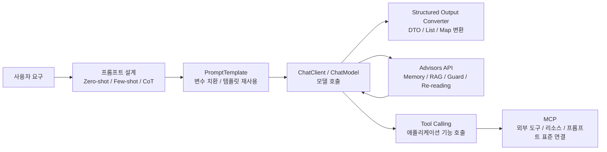
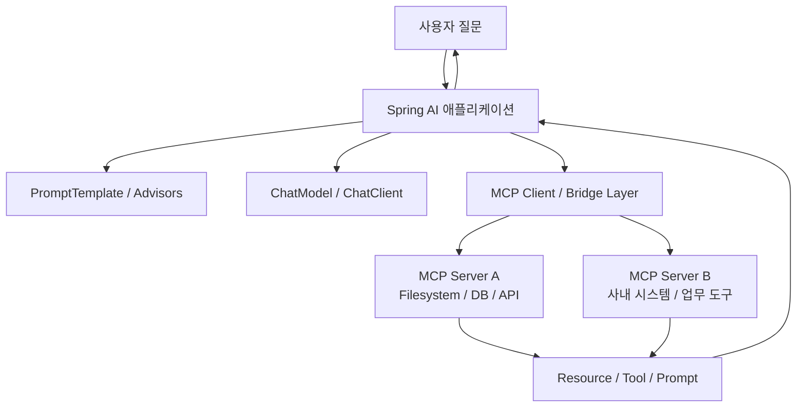

Spring AI를 처음 공부하면 개념이 비슷해 보여서 헷갈리는 지점이 많습니다.  
`PromptTemplate`, `Structured Output Converter`, `Advisor`, `Tool Calling`, `MCP`가 각각 따로 노는 기능처럼 보이기 때문입니다.

그런데 실제로는 이 개념들이 하나의 흐름으로 연결됩니다.

- 프롬프트를 어떻게 설계할 것인가
- 그 프롬프트를 코드에서 어떻게 재사용할 것인가
- 응답을 어떻게 안정적으로 구조화할 것인가
- 메모리, RAG, 안전장치 같은 횡단 관심사를 어디에 붙일 것인가
- 외부 도구와 리소스를 어떤 방식으로 연결할 것인가

이 글은 이 흐름을 Spring AI 기준으로 한 번에 정리한 글입니다.  

중간중간 위키독스의 [Memory 활용 대화 에이전트 실습](https://wikidocs.net/323541)과 MCP 관련 학습 흐름도 함께 참고했습니다.

> springboot3 + java sample은 [github-sample](https://github.com/ydj515/sample-repository-example/tree/main/spring-ai-example)를 참조해주세요.

## 전체 그림 먼저 보기

Spring AI의 학습 흐름은 아래 그림처럼 이해하면 편합니다.



즉, 단순히 모델을 호출하는 데서 끝나는 것이 아니라 다음 순서로 발전합니다.

1. 프롬프트를 잘 쓴다.
2. 그 프롬프트를 템플릿으로 관리한다.
3. 응답을 DTO처럼 구조화해서 받는다.
4. 메모리나 RAG 같은 정책을 Advisor로 분리한다.
5. Tool Calling과 MCP로 외부 세계와 연결한다.

## 1. Prompt Engineering: Zero-shot, Few-shot, Chain-of-Thought

Spring AI를 잘 쓰려면 API보다 먼저 프롬프트 감각을 잡아야 합니다.  
공식 문서도 `Zero-shot`, `Few-shot`, `Role Prompting`, `Step-Back Prompting`, `Chain-of-Thought`, `Self-Consistency`, `ReAct` 같은 패턴을 별도로 설명하고 있습니다.

### 가장 먼저 해볼 최소 예시

프롬프트 패턴을 보기 전에, `ChatClient`가 어떻게 동작하는지 가장 작은 예시를 먼저 한 번 보는 편이 흐름상 자연스럽습니다.

```java
ChatClient chatClient = ChatClient.create(chatModel);

String answer = chatClient.prompt()
    .user("Spring AI의 PromptTemplate이 왜 필요한지 한 문단으로 설명해줘.")
    .call()
    .content();
```

이 예시는 "사용자 질문 하나를 모델에 전달하고, 문자열 응답 하나를 받는다"는 가장 기본적인 흐름입니다.  
즉 이후에 나오는 `few-shot`, `system message`, `PromptTemplate`, `Structured Output`, `Advisor`, `Tool Calling`은 모두 이 기본 흐름 위에 하나씩 확장되는 요소라고 생각하면 이해가 쉬워집니다.

### Zero-shot

가장 기본적인 방식입니다. 예시 없이 바로 지시합니다.

```text
다음 사용자 리뷰를 POSITIVE, NEUTRAL, NEGATIVE 중 하나로 분류하라.
리뷰: 배송은 빨랐지만 포장이 조금 아쉬웠다.
```

장점은 단순하고 빠르다는 것입니다.  
단점은 애매한 작업일수록 출력 포맷이 흔들리거나, 기대한 판단 기준이 모델에 정확히 전달되지 않을 수 있다는 점입니다.

### Few-shot

예시를 먼저 보여주고, 그다음에 새 입력을 넣는 방식입니다.

```text
입력: 정말 만족스러웠어요.
출력: POSITIVE

입력: 그냥 무난했어요.
출력: NEUTRAL

입력: 다시는 사고 싶지 않아요.
출력: NEGATIVE

입력: 배송은 빠른데 품질은 애매해요.
출력:
```

이 방식은 분류, 포맷 강제, 답변 톤 통일에 특히 강합니다.  
실무에서는 `응답 형식 맞추기`, `사내 문체 통일`, `에러 메시지 요약 형식 고정` 같은 작업에서 매우 유용합니다.

### Chain-of-Thought

많이 헷갈리는 부분인데, `Chain-of-Thought`는 Spring AI의 별도 전용 API라기보다 **추론을 유도하는 프롬프트 패턴**으로 이해하는 편이 정확합니다.

예를 들면 다음과 같이 씁니다.

```text
문제를 단계별로 분석하고, 마지막에 결론만 간단히 정리하라.
```

또는

```text
차근차근 생각해보고, 핵심 근거를 3개만 요약하라.
```

중요한 점은 두 가지입니다.

- 단순 질의응답에는 Zero-shot이 더 간단하고 충분할 수 있습니다.
- 복잡한 분해, 계획, 비교 판단이 필요한 작업은 CoT 스타일이 더 안정적일 수 있습니다.

다만 CoT를 항상 길게 쓰는 것이 정답은 아닙니다.  
실서비스에서는 내부 추론을 장황하게 출력시키는 것보다, **중간 체크리스트나 최종 구조화 결과를 요구하는 방식**이 더 유지보수하기 쉬운 경우가 많습니다.

### Spring AI에서 이 개념들이 어떻게 연결될까?

Spring AI에서는 위 패턴들이 보통 아래 조합으로 구현됩니다.

- `ChatClient` 또는 `ChatModel`로 기본 호출
- `PromptTemplate`로 프롬프트 재사용
- `Advisor`로 반복되는 프롬프트 보강 정책 분리
- `Structured Output`으로 결과를 안전하게 후처리

즉, 프롬프트 엔지니어링은 문장 몇 줄의 스킬이 아니라, 점점 코드 구조로 승격됩니다.

## 2. PromptTemplate: 문자열이 아니라 관리 가능한 프롬프트 자산

처음에는 아래처럼 문자열을 바로 넣고 싶은 유혹이 있습니다.

```java
String result = chatClient.prompt()
    .user("Spring AI의 핵심 개념을 설명해줘")
    .call()
    .content();
```

이 방식은 간단하지만, 프롬프트가 길어지고 변수도 늘어나면 금방 관리가 어려워집니다.  
이때 `PromptTemplate`이 필요해집니다.

공식 문서 기준으로 Spring AI의 `PromptTemplate`은 `TemplateRenderer`를 사용해 템플릿을 렌더링합니다. 기본 구현은 `StTemplateRenderer`이며, 기본 변수 구분자는 `{}` 입니다.

예를 들어 아래처럼 템플릿을 분리할 수 있습니다.

```java
String systemTemplate = """
너는 Spring AI 학습을 도와주는 시니어 개발자다.
설명 수준은 {level} 이고, 예제는 {language} 기준으로 제공하라.
""";

String userTemplate = """
다음 주제를 정리해줘: {topic}
반드시 핵심 개념, 사용 시점, 주의점 순서로 설명하라.
""";
```

이 방식의 장점은 분명합니다.

- 프롬프트를 코드와 분리할 수 있습니다.
- 변수 주입이 명확해집니다.
- 같은 템플릿을 여러 요청에서 재사용할 수 있습니다.
- 테스트 시에도 어떤 입력으로 어떤 프롬프트가 생성됐는지 추적하기 쉽습니다.

### JSON 프롬프트를 많이 쓸 때 주의할 점

실무에서는 JSON 예시를 프롬프트에 넣는 경우가 많습니다.  
그런데 기본 구분자 `{}` 는 JSON 중괄호와 충돌할 수 있습니다.

이 경우 공식 문서처럼 `StTemplateRenderer`의 구분자를 `< >` 등으로 바꿔두면 훨씬 편합니다.

```java
PromptTemplate promptTemplate = PromptTemplate.builder()
    .renderer(StTemplateRenderer.builder()
        .startDelimiterToken('<')
        .endDelimiterToken('>')
        .build())
    .template("""
        다음 내용을 JSON으로 정리하라.
        topic: <topic>
        """)
    .build();
```

이런 디테일이 바로 "프롬프트를 문자열로 쓰는 것"과 "프레임워크 안에서 관리하는 것"의 차이입니다.

## 3. Structured Output Converter: 문자열을 DTO로 바꾸는 순간

LLM 결과를 문자열로만 받으면 결국 파싱 지옥이 옵니다.

- `"title: ..."` 형식이 조금만 바뀌어도 파싱이 깨집니다.
- 줄바꿈 하나만 달라져도 후처리 코드가 지저분해집니다.
- downstream 로직이 늘어날수록 예외 처리가 복잡해집니다.

Spring AI는 이 문제를 `Structured Output Converter`로 풀 수 있게 해줍니다.

공식 문서에서 제공하는 대표 구현은 다음과 같습니다.

- `BeanOutputConverter`
- `MapOutputConverter`
- `ListOutputConverter`

고수준 API에서는 더 간단하게 `.entity()`를 쓸 수 있습니다.

```java
record StudyOutline(String title, List<String> keyPoints) {}

StudyOutline outline = ChatClient.create(chatModel).prompt()
    .user("Spring AI 핵심 개념을 3개로 정리해줘")
    .call()
    .entity(StudyOutline.class);
```

이렇게 하면 결과를 바로 DTO처럼 받을 수 있습니다.  
즉, LLM을 단순 텍스트 생성기가 아니라 **애플리케이션의 데이터 공급자**처럼 다루게 됩니다.

### 내부적으로 무슨 일이 일어날까?

`BeanOutputConverter`는 크게 두 단계를 수행합니다.

1. 호출 전에 출력 형식을 설명하는 가이드를 프롬프트에 추가합니다.
2. 응답 후에는 결과를 JSON 기반으로 변환하여 자바 객체로 매핑합니다.

공식 문서에서 특히 중요한 표현은 `best effort`입니다.  
즉, structured output conversion은 매우 유용하지만 모델이 항상 완벽한 형식을 지켜준다고 보장하지는 않습니다.

그래서 운영 환경에서는 아래 전략을 같이 고민해야 합니다.

- DTO 검증
- 재시도
- fallback 응답
- schema 단순화

### Native Structured Output

최근 모델들은 JSON Schema 기반의 native structured output을 직접 지원합니다.  
Spring AI는 `AdvisorParams.ENABLE_NATIVE_STRUCTURED_OUTPUT`를 통해 이 기능을 사용할 수 있게 해줍니다.

```java
record StudyNote(String title, List<String> sections) {}

StudyNote note = ChatClient.create(chatModel).prompt()
    .advisors(AdvisorParams.ENABLE_NATIVE_STRUCTURED_OUTPUT)
    .user("Spring AI 학습 순서를 정리해줘")
    .call()
    .entity(StudyNote.class);
```

이 방식의 장점은 다음과 같습니다.

- 포맷 지시문을 프롬프트에 길게 붙이지 않아도 됩니다.
- 모델이 스키마에 맞춘 응답을 더 안정적으로 보장합니다.
- 출력 후처리 코드가 단순해집니다.

단, 공식 문서 기준으로 일부 모델은 **최상위 배열 객체**를 네이티브 구조화 출력으로 잘 처리하지 못할 수 있으므로, 이런 경우는 객체 래핑을 고려하는 편이 안전합니다.

## 4. Advisors API: 메모리, RAG, 보안 정책을 프롬프트 밖으로 끌어내기

Spring AI에서 정말 중요한 추상화 중 하나가 `Advisors API`입니다.  
이 레이어는 모델 호출 전후를 가로채어 요청과 응답을 보강합니다.

문서 표현을 빌리면 Advisor는 요청/응답을 `intercept`, `modify`, `enhance`하는 역할을 합니다.

예를 들어 이런 작업을 Advisor로 분리할 수 있습니다.

- 대화 메모리 주입
- RAG 컨텍스트 주입
- 안전성 필터링
- 반복적인 프롬프트 보강
- 요청/응답 로깅

### 메모리 관점에서 보면 더 이해가 쉽다

위키독스의 [Memory 활용 대화 에이전트 실습](https://wikidocs.net/323541)에서는 `ChatMessageHistory`를 프롬프트에 수동으로 넣어 대화 기록을 유지하는 흐름을 보여줍니다.  
핵심 메시지는 단순합니다.

- 기억이 없는 체인은 매번 처음 만나는 안내원처럼 동작합니다.
- 메모리가 있는 체인은 이전 대화를 참고하는 개인 비서처럼 동작합니다.

Spring AI에서는 이 개념이 `ChatMemory`와 `MessageChatMemoryAdvisor`로 자연스럽게 연결됩니다.

```java
ChatMemory chatMemory = MessageWindowChatMemory.builder()
    .maxMessages(20)
    .build();

ChatClient chatClient = ChatClient.builder(chatModel)
    .defaultAdvisors(MessageChatMemoryAdvisor.builder(chatMemory).build())
    .build();
```

즉, 위키독스에서 수동으로 `history`를 프롬프트에 주입하던 패턴을, Spring AI에서는 Advisor 계층으로 끌어올려 재사용 가능한 정책으로 만들 수 있습니다.

### RAG도 같은 패턴으로 이해할 수 있다

메모리가 "이전 대화"를 주입하는 것이라면, RAG는 "외부 지식"을 주입하는 것입니다.  
Spring AI에서는 `QuestionAnswerAdvisor` 같은 Advisor로 이 흐름을 구성할 수 있습니다.

```java
var chatClient = ChatClient.builder(chatModel)
    .defaultAdvisors(
        MessageChatMemoryAdvisor.builder(chatMemory).build(),
        QuestionAnswerAdvisor.builder(vectorStore).build()
    )
    .build();
```

여기서 포인트는 프롬프트 자체를 매번 수작업으로 고치지 않아도 된다는 것입니다.  
메모리, 검색 문맥, 안전성 같은 공통 정책을 Advisor로 분리해두면, 애플리케이션이 커져도 구조가 유지됩니다.

### Advisor 순서가 왜 중요한가?

이 부분은 꼭 한 번 짚고 넘어가야 합니다.  
공식 문서 기준으로 Advisor는 `getOrder()` 값이 낮을수록 **요청(request)에서는 먼저 실행되고**, **응답(response)에서는 나중에 실행**됩니다.

즉 체감상 아래처럼 동작합니다.

- 요청 흐름: 앞에 있는 Advisor -> 뒤에 있는 Advisor -> 모델 호출
- 응답 흐름: 모델 응답 -> 뒤에 있는 Advisor -> 앞에 있는 Advisor

이걸 가장 단순하게 보여주는 예시는 아래와 같습니다.

```java
public class TraceAdvisor implements CallAdvisor {

    private final String name;
    private final int order;

    public TraceAdvisor(String name, int order) {
        this.name = name;
        this.order = order;
    }

    @Override
    public String getName() {
        return this.name;
    }

    @Override
    public int getOrder() {
        return this.order;
    }

    @Override
    public ChatClientResponse adviseCall(ChatClientRequest request, CallAdvisorChain chain) {
        System.out.println("[" + name + "] before");
        ChatClientResponse response = chain.nextCall(request);
        System.out.println("[" + name + "] after");
        return response;
    }
}
```

그리고 다음처럼 등록합니다.

```java
ChatClient chatClient = ChatClient.builder(chatModel)
    .defaultAdvisors(
        new TraceAdvisor("A", 0),
        new TraceAdvisor("B", 100)
    )
    .build();
```

이때 실제 실행 흐름은 아래처럼 됩니다.

1. `A before`
2. `B before`
3. ChatModel 호출
4. `B after`
5. `A after`

즉 Advisor 체인은 리스트처럼 보이지만, 실제 실행은 **스택처럼 감싸는 구조**입니다.  
이 개념이 중요한 이유는 메모리, RAG, 로깅, 가드레일이 서로 영향을 주기 때문입니다.

#### 실제로 순서가 달라지면 어떤 문제가 생길까?

아래와 같은 대화 상황을 생각해보겠습니다.

1. 사용자가 첫 질문에서 `"우리 서비스는 PostgreSQL 기준으로 설명해줘."` 라고 말함
2. 다음 질문에서 `"인덱스 설계 주의점 정리해줘."` 라고 말함

이제 우리는 두 번째 질문을 받을 때,

- 이전 대화 맥락도 반영하고 싶고
- 벡터 스토어에서 관련 문서도 찾고 싶습니다

그래서 보통 이런 구성을 하게 됩니다.

```java
ChatClient chatClient = ChatClient.builder(chatModel)
    .defaultAdvisors(
        MessageChatMemoryAdvisor.builder(chatMemory).build(),
        QuestionAnswerAdvisor.builder(vectorStore).build(),
        new SimpleLoggerAdvisor()
    )
    .build();
```

이 구성이 의도하는 실제 흐름은 아래와 같습니다.

1. `MessageChatMemoryAdvisor`가 이전 대화를 프롬프트에 추가합니다.
2. `QuestionAnswerAdvisor`가 현재 질문 + 이전 대화 맥락을 참고해 벡터 검색을 수행합니다.
3. 검색된 문서가 프롬프트에 포함된 상태로 모델이 호출됩니다.
4. 모델 응답이 돌아오면 `QuestionAnswerAdvisor`가 자신의 컨텍스트를 응답에 반영합니다.
5. 마지막으로 메모리 Advisor가 이번 대화 내용을 메모리에 반영합니다.

이 순서가 중요한 이유는 `QuestionAnswerAdvisor`가 검색할 때 참고하는 입력이 달라지기 때문입니다.

- 메모리 먼저 -> 검색 질문이 `"PostgreSQL 기준 인덱스 설계 주의점"`에 가까워짐
- RAG 먼저 -> 검색 질문이 그냥 `"인덱스 설계 주의점"`에 머무를 가능성이 커짐

즉, 메모리보다 RAG가 먼저 실행되면 **벡터 검색 단계에서 중요한 맥락이 빠질 수 있습니다.**

#### 잘못 배치한 경우

예를 들어 이렇게 구성하면 문제가 생길 수 있습니다.

```java
ChatClient chatClient = ChatClient.builder(chatModel)
    .defaultAdvisors(
        QuestionAnswerAdvisor.builder(vectorStore).build(),
        MessageChatMemoryAdvisor.builder(chatMemory).build()
    )
    .build();
```

이 경우 의도상 흐름은 다음처럼 흘러갑니다.

1. 먼저 `QuestionAnswerAdvisor`가 검색을 시도합니다.
2. 아직 메모리가 붙기 전이라, 검색에는 현재 질문만 반영될 수 있습니다.
3. 그 뒤에 `MessageChatMemoryAdvisor`가 대화 이력을 붙입니다.
4. 모델은 대화 이력이 들어간 프롬프트를 받더라도, **이미 검색은 덜 정확한 상태로 끝난 뒤**일 수 있습니다.

이런 상황에서는 모델이 Postgres보다 MySQL이나 일반적인 DB 문서를 섞어서 답할 가능성이 커집니다.

#### 로깅 Advisor는 어디에 두는 게 좋을까?

`SimpleLoggerAdvisor` 같은 로깅 Advisor도 순서에 따라 보는 정보가 달라집니다.

- 앞쪽에 두면: 거의 원본에 가까운 요청을 먼저 볼 수 있습니다.
- 뒤쪽에 두면: 메모리/RAG가 적용된 뒤의 요청을 볼 수 있습니다.

즉 "무엇을 디버깅하고 싶은가"에 따라 위치가 달라집니다.

- 원본 사용자 입력을 보고 싶다 -> 앞쪽
- 최종적으로 모델에 들어간 완성 프롬프트를 보고 싶다 -> 뒤쪽

그래서 Advisor 순서를 정할 때는 단순히 보기 좋게 나열하는 것이 아니라, **어떤 데이터가 어느 시점에 준비되어 있어야 하는지**를 기준으로 생각해야 합니다.

정리하면 실무에서는 보통 아래 순서 감각이 유용합니다.

1. 원본 요청 검사 / 입력 보강
2. 메모리 주입
3. RAG / 검색 문맥 주입
4. 로깅 또는 응답 후처리

물론 모든 경우의 정답은 아니지만, 적어도 "검색 전에 필요한 컨텍스트가 다 들어왔는가?"를 기준으로 보면 대부분 방향을 잘 잡을 수 있습니다.

### ChatClientResponse와 advise-context는 어디에 쓰는가?

Spring AI 공식 문서에서 `ChatClientRequest`와 `ChatClientResponse`는 둘 다 advisor `context`를 가진다고 설명합니다.  
이 context는 advisor 체인 전체에서 공유되는 내부 상태 저장소처럼 생각하면 됩니다.

핵심은 아래 두 가지입니다.

- `ChatClientRequest.context()`는 요청 단계에서 advisor끼리 상태를 공유할 때 사용합니다.
- `ChatClientResponse.context()`는 응답 단계에서 앞선 advisor가 남긴 상태를 읽을 때 사용합니다.

그리고 이 context는 **기본적으로 immutable**하게 다뤄집니다.  
즉 직접 수정하는 것이 아니라 `mutate().context(...)`로 새 요청/응답 객체를 만들어 넘기는 방식입니다.

예를 들어 `tenantId`, `traceId`, `retrievalCount` 같은 내부 정보를 advisor 체인에서만 돌리고 싶다고 해보겠습니다.

```java
public class TenantTraceAdvisor implements CallAdvisor {

    @Override
    public String getName() {
        return "tenant-trace-advisor";
    }

    @Override
    public int getOrder() {
        return 10;
    }

    @Override
    public ChatClientResponse adviseCall(ChatClientRequest request, CallAdvisorChain chain) {
        ChatClientRequest enrichedRequest = request.mutate()
            .context("tenantId", "acme")
            .context("traceId", "trace-123")
            .build();

        ChatClientResponse response = chain.nextCall(enrichedRequest);

        Integer retrievalCount = (Integer) response.context().getOrDefault("retrievalCount", 0);

        return response.mutate()
            .context("handledBy", "TenantTraceAdvisor")
            .context("retrievalCount", retrievalCount)
            .build();
    }
}
```

이 예시에서 중요한 점은 `tenantId`나 `traceId`를 곧바로 LLM 프롬프트에 넣지 않았다는 것입니다.  
즉 이 값들은 advisor 체인 내부에서만 공유되는 메타데이터로 쓸 수 있습니다.

다른 Advisor가 이 값을 이어서 쓰는 것도 가능합니다.

```java
public class RetrievalCountAdvisor implements CallAdvisor {

    @Override
    public String getName() {
        return "retrieval-count-advisor";
    }

    @Override
    public int getOrder() {
        return 20;
    }

    @Override
    public ChatClientResponse adviseCall(ChatClientRequest request, CallAdvisorChain chain) {
        String tenantId = (String) request.context().get("tenantId");

        // tenantId를 기반으로 다른 vector store, 필터, index를 선택할 수 있음
        ChatClientResponse response = chain.nextCall(request);

        return response.mutate()
            .context("retrievalCount", 3)
            .context("resolvedTenant", tenantId)
            .build();
    }
}
```

이렇게 하면 응답을 꺼내는 쪽에서도 `ChatClientResponse`를 통해 advisor chain 내부 정보를 함께 볼 수 있습니다.

```java
ChatClientResponse response = chatClient.prompt()
    .advisors(
        new TenantTraceAdvisor(),
        new RetrievalCountAdvisor()
    )
    .user("우리 팀 문서 기준으로 Spring AI MCP 도입 포인트를 요약해줘.")
    .call()
    .chatClientResponse();

String answer = response.chatResponse().getResult().getOutput().getText();
String tenantId = (String) response.context().get("resolvedTenant");
Integer retrievalCount = (Integer) response.context().get("retrievalCount");
```

이 패턴은 특히 아래 같은 경우에 유용합니다.

- tenant별 검색 인덱스 선택
- traceId, correlationId 전달
- 내부 감사 로그용 메타데이터 전달
- 응답 후 메트릭 계산

중요한 점은 `advise-context`와 prompt는 다르다는 것입니다.  
advisor context에 저장했다고 해서 자동으로 LLM이 그 값을 보는 것은 아닙니다. 정말 모델에게 보여주고 싶다면 advisor가 직접 prompt를 수정해야 합니다.

즉 아래처럼 구분하면 헷갈림이 줄어듭니다.

| 위치 | 용도 | LLM에 전달되나 |
| --- | --- | --- |
| Prompt 파라미터 | 모델이 읽어야 하는 실제 지시/문맥 | 전달됨 |
| Advisor context | advisor 체인 내부 상태 공유 | 자동 전달되지 않음 |
| ToolContext | tool 실행 시 필요한 내부 정보 | 전달되지 않음 |

### 런타임 advisor 파라미터 예시: `ChatMemory.CONVERSATION_ID`

advisor를 Bean으로 등록해두더라도, 실제 호출마다 바뀌는 값은 런타임에 넘겨야 하는 경우가 많습니다.  
그 대표적인 예시가 `ChatMemory.CONVERSATION_ID`입니다.

공식 문서 기준 `ChatMemory.CONVERSATION_ID`는 advisor context에서 대화 식별자를 꺼내기 위한 키입니다.  
즉 같은 `MessageChatMemoryAdvisor`를 쓰더라도, 어떤 대화방의 메모리를 읽고 쓸지 호출 시점에 정할 수 있습니다.

```java
ChatMemory chatMemory = MessageWindowChatMemory.builder()
    .maxMessages(20)
    .build();

ChatClient chatClient = ChatClient.builder(chatModel)
    .defaultAdvisors(MessageChatMemoryAdvisor.builder(chatMemory).build())
    .build();

String conversationId = "room-42";

String answer = chatClient.prompt()
    .advisors(a -> a.param(ChatMemory.CONVERSATION_ID, conversationId))
    .user("내가 방금 전에 뭐 물어봤는지 기억해?")
    .call()
    .content();
```

이 코드는 의미상 아래처럼 동작합니다.

1. `MessageChatMemoryAdvisor`는 advisor parameter에서 `ChatMemory.CONVERSATION_ID`를 찾습니다.
2. 값이 `room-42`라면 해당 대화방의 메모리만 조회합니다.
3. 응답이 끝나면 같은 `room-42` 메모리에 현재 대화 내용을 저장합니다.

즉 conversation ID를 제대로 분리해야 사용자 A와 사용자 B의 대화가 섞이지 않습니다.

#### 왜 중요한가?

예를 들어 같은 서버에서 여러 사용자의 요청을 처리한다고 해보겠습니다.

- 사용자 A: "내 이름은 철수야"
- 사용자 B: "내 이름은 영희야"

이때 conversation ID를 제대로 분리하지 않으면, 다음 질의에서 메모리가 엉킬 수 있습니다.

```java
String answer = chatClient.prompt()
    .advisors(a -> a.param(ChatMemory.CONVERSATION_ID, "user-a"))
    .user("내 이름이 뭐였지?")
    .call()
    .content();
```

위처럼 사용자별 또는 세션별 conversation ID를 명시해두면, 메모리는 `user-a` 범위 안에서만 조회됩니다.

실무에서는 보통 아래 기준으로 conversation ID를 잡습니다.

- 웹 서비스 채팅창: `sessionId`
- 로그인 사용자 단위: `userId`
- 팀/채널 대화: `workspaceId:channelId`
- 고객 상담 건별: `ticketId`

#### 기본 conversation ID에만 의존하면 왜 위험할까?

`ChatMemory`에는 `DEFAULT_CONVERSATION_ID`도 존재합니다.  
하지만 운영 환경에서는 기본값에만 의존하기보다, **반드시 호출별 conversation ID를 명시적으로 넣는 편이 안전합니다.**

특히 멀티유저 환경에서는 이 값이 빠지면 메모리 분리 전략이 불명확해지고, 대화가 섞일 위험이 생깁니다.

#### 다른 advisor 파라미터와 같이 쓰기

Spring AI에서는 advisor parameter를 여러 개 함께 넣을 수 있습니다.

```java
ActorFilms actorFilms = chatClient.prompt()
    .advisors(a -> a.param(ChatMemory.CONVERSATION_ID, "user-100"))
    .advisors(AdvisorParams.ENABLE_NATIVE_STRUCTURED_OUTPUT)
    .user("Tom Hanks 영화 5개를 actor와 movies 구조로 정리해줘.")
    .call()
    .entity(ActorFilms.class);
```

즉 한 호출 안에서

- 메모리 분리용 advisor 파라미터
- structured output 활성화 파라미터

를 함께 조합할 수 있습니다.

## 5. Tool Calling과 MCP는 무엇이 다를까?

이 부분도 자주 헷갈립니다.  
결론부터 말하면 둘은 비슷한 영역을 다루지만 초점이 다릅니다.

### Tool Calling

Tool Calling은 모델이 애플리케이션에 등록된 기능을 호출하게 만드는 메커니즘입니다.

- 모델은 "도구를 써야겠다"고 판단합니다.
- 애플리케이션은 실제 메서드나 외부 호출을 실행합니다.
- 결과를 다시 모델이나 애플리케이션 로직으로 넘깁니다.

즉, 모델이 직접 세상을 바꾸는 것이 아니라, **애플리케이션이 모델의 요청을 받아 행동을 수행하는 구조**입니다.

### userId 같은 민감한 값은 Prompt가 아니라 ToolContext로 넘긴다

이 부분도 실무에서 정말 중요합니다.  
예를 들어 고객 조회 도구가 있는데, `userId`, `tenantId`, `role` 같은 값은 필요하지만 그 값을 굳이 LLM에게 보여주고 싶지 않을 수 있습니다.

이럴 때 쓰는 것이 `ToolContext`입니다.

공식 문서 기준 `ToolContext`는 tool execution에 필요한 추가 정보를 전달하기 위한 API이고, **여기에 담긴 데이터는 AI 모델로 전송되지 않습니다.**

예를 들어 아래처럼 도구를 만들 수 있습니다.

```java
class CustomerTools {

    @Tool(description = "고객 ID로 고객 정보를 조회한다.")
    public String getCustomerInfo(Long customerId, ToolContext toolContext) {
        String tenantId = (String) toolContext.getContext().get("tenantId");
        String userId = String.valueOf(toolContext.getContext().get("userId"));

        return "tenant=" + tenantId + ", user=" + userId + ", customerId=" + customerId;
    }
}
```

그리고 호출 시점에 `toolContext()`로 값을 넣습니다.

```java
String answer = ChatClient.create(chatModel)
    .prompt("고객 ID 42번의 정보를 조회해서 요약해줘.")
    .tools(new CustomerTools())
    .toolContext(Map.of(
        "tenantId", "acme",
        "userId", "u-1001"
    ))
    .call()
    .content();
```

이때 모델은 `"고객 ID 42번의 정보를 조회해라"` 같은 자연어와 도구 스펙은 알지만,

- `tenantId=acme`
- `userId=u-1001`

같은 내부 값은 직접 보지 못합니다.  
즉 모델은 "무슨 도구를 어떤 인자로 호출할지"를 결정하고, 실제 보안/테넌트/사용자 맥락은 애플리케이션이 `ToolContext`로 안전하게 주입합니다.

#### 언제 특히 유용한가?

- 멀티테넌트 환경에서 tenant 분기
- 로그인 사용자 ID 기반 권한 체크
- 내부 API 토큰, correlation ID 전달
- tool 실행 시 audit metadata 남기기

#### Prompt 파라미터로 넣으면 왜 안 좋을까?

예를 들어 아래처럼 쓰면 좋지 않습니다.

```java
String answer = chatClient.prompt()
    .user("tenantId=acme, userId=u-1001 인 상태에서 고객 42번 정보를 조회해줘.")
    .tools(new CustomerTools())
    .call()
    .content();
```

이 방식은 모델이 tenantId와 userId를 그대로 읽게 되므로, 불필요한 내부 정보 노출이 발생합니다.  
반면 `ToolContext`는 모델에 공개하지 않고 tool 실행 레이어에서만 사용할 수 있으므로 훨씬 안전합니다.

즉 실무에서는 아래처럼 정리하면 좋습니다.

- 모델이 판단해야 하는 정보 -> Prompt
- advisor끼리 공유할 내부 상태 -> Advisor context
- tool 실행 시 필요한 보안/사용자/테넌트 정보 -> ToolContext

여기서 한 가지 주의할 점이 있습니다.  
지금 설명한 `ToolContext`는 **Spring AI Tool Calling 레이어의 `org.springframework.ai.chat.model.ToolContext`** 입니다.  
앞서 MCP stateless 문맥에서 나온 "Tool Context Support" 표현과는 같은 단어를 쓰지만 다른 레이어의 개념입니다.

### ToolContext와 MCP RequestContext는 무엇이 다를까?

이 둘은 이름만 보면 비슷하지만, 실제로는 완전히 다른 레이어에서 쓰입니다.

| 항목 | ToolContext | MCP RequestContext |
| --- | --- | --- |
| 대표 타입 | `ToolContext` | `McpSyncRequestContext`, `McpAsyncRequestContext`, `McpTransportContext` |
| 속한 레이어 | Spring AI Tool Calling | MCP Server Annotation |
| 누가 값을 넣나 | 애플리케이션 코드가 `.toolContext(Map.of(...))`로 전달 | MCP 프레임워크가 요청 처리 중 자동 주입 |
| 주 용도 | tool 실행 시 필요한 내부 보안/사용자/테넌트 정보 전달 | MCP 요청, 세션, client info, progress, sampling, elicitation 접근 |
| LLM에 보이나 | 보이지 않음 | MCP 클라이언트 요청 문맥이며 schema에 노출되지 않음 |
| JSON schema 포함 여부 | tool input schema에 포함되지 않음 | 공식 문서 기준 special parameter로 자동 주입되며 schema에서 제외 |
| 대표 사용 예 | `userId`, `tenantId`, 내부 토큰 | `sessionId()`, `clientInfo()`, `requestMeta()`, `progress()`, `ping()` |

한 문장으로 정리하면 이렇습니다.

- `ToolContext`: "내 Spring AI 애플리케이션 안에서 tool 실행에 필요한 내부 데이터"
- `MCP RequestContext`: "MCP 서버 메서드 안에서 현재 요청과 세션을 다루기 위한 프레임워크 컨텍스트"

#### ToolContext 예시

```java
class BillingTools {

    @Tool(description = "고객 청구 정보를 조회한다.")
    public String getBilling(Long customerId, ToolContext toolContext) {
        String tenantId = (String) toolContext.getContext().get("tenantId");
        String userId = (String) toolContext.getContext().get("userId");

        return "tenant=" + tenantId + ", user=" + userId + ", customerId=" + customerId;
    }
}
```

이 경우 `tenantId`와 `userId`는 애플리케이션이 `.toolContext(...)`로 넣어준 값입니다.

#### MCP RequestContext 예시

MCP Annotation 기반 서버에서는 아래처럼 현재 요청 자체를 다룰 수 있습니다.

```java
@McpTool(name = "advanced-doc-search", description = "문서를 검색한다.")
public String advancedDocSearch(
        McpSyncRequestContext context,
        @McpToolParam(description = "검색어", required = true) String query) {

    String sessionId = context.sessionId();
    String clientInfo = String.valueOf(context.clientInfo());
    String requestInfo = String.valueOf(context.request());

    return "session=" + sessionId + ", client=" + clientInfo + ", request=" + requestInfo + ", query=" + query;
}
```

이 예시는 `ToolContext`와 성격이 완전히 다릅니다.

- `ToolContext`는 우리가 직접 집어넣는 내부 실행 데이터입니다.
- `McpSyncRequestContext`는 MCP 요청으로부터 프레임워크가 자동 주입하는 서버 측 컨텍스트입니다.

#### Stateless 서버에서는 무엇을 쓰나?

공식 문서 기준 stateless MCP 서버에서는 `McpTransportContext`를 쓸 수 있습니다.  
이는 full server exchange 없이 transport 수준의 최소 컨텍스트만 제공하는 가벼운 타입입니다.

```java
@McpTool(name = "stateless-tool", description = "무상태 MCP 도구")
public String statelessTool(
        McpTransportContext context,
        @McpToolParam(description = "입력", required = true) String input) {

    return "Processed in stateless mode: " + input;
}
```

즉 MCP 쪽은 아래처럼 구분하면 됩니다.

- `McpSyncRequestContext` / `McpAsyncRequestContext`: stateful/stateless 모두 아우르는 상위 컨텍스트
- `McpTransportContext`: stateless 위주 경량 컨텍스트

실무적으로는 다음 기준이 편합니다.

- 단순 Tool Calling 내부 보안/사용자 정보 -> `ToolContext`
- MCP 서버 메서드에서 session, client capability, progress, sampling까지 다뤄야 함 -> `McpSyncRequestContext` 또는 `McpAsyncRequestContext`
- stateless MCP 서버에서 최소 컨텍스트만 필요함 -> `McpTransportContext`

### MCP

MCP는 도구 호출 하나만의 문제가 아니라, **외부 도구와 리소스, 프롬프트를 표준 방식으로 연결하는 프로토콜**입니다.

Spring AI 공식 문서 기준으로 MCP는 다음을 구조화합니다.

- Tool discovery / execution
- Resource access / management
- Prompt system interaction
- Client / Server 계층 분리
- STDIO, SSE, Streamable HTTP 같은 다양한 transport

위키독스의 MCP 설명도 비슷한 관점을 취합니다.  
Host와 Server를 분리하고, 중간에 Bridge Layer를 둠으로써 에이전트와 도구를 느슨하게 결합시키는 구조입니다.

### 한 문장으로 비교하면

- Tool Calling: 모델이 내 애플리케이션 기능을 호출하는 방식
- MCP: 내 애플리케이션이 외부 도구/리소스 생태계와 연결되는 표준 계약

그래서 MCP를 "Function Calling의 대체재"라기보다, **Function Calling을 포함해 더 넓은 도구/리소스 연결 문제를 다루는 표준화 계층**으로 이해하면 좋습니다.

## 6. Spring AI에서 MCP가 흥미로운 이유

Spring AI는 MCP를 단순 소개 수준에서 끝내지 않고, 실제 애플리케이션에 붙이기 쉬운 도구를 제공합니다.

- `spring-ai-starter-mcp-client`
- `spring-ai-starter-mcp-server`
- 어노테이션 기반 프로그래밍 모델
- MCP 도구를 Spring AI `ToolCallback`으로 어댑트하는 유틸리티

특히 공식 문서의 MCP Utilities를 보면, MCP 서버가 제공하는 도구를 Spring AI의 툴 시스템으로 가져오는 어댑터가 제공됩니다.  
이 말은 곧, **MCP 생태계의 도구를 Spring AI ChatClient 흐름 안으로 편입시킬 수 있다**는 뜻입니다.

이 구조를 그림으로 보면 아래와 같습니다.



이제 Tool Calling은 단순히 "메서드 하나 호출"이 아니라, 더 큰 표준 생태계 안의 일부가 됩니다.

## 7. 설정값

Spring AI를 공부하다 보면 `ChatClient`, `Advisor`, `Tool Calling`, `MCP` 개념은 이해했는데, 정작 `application.yml`에는 무엇을 써야 할지 막막한 경우가 많습니다.  
그래서 이 섹션에서는 **실제로 자주 쓰는 `application.yml` 설정값**을 한곳에 정리해보겠습니다.

먼저 전체 그림을 보는 용도로 아래 같은 예시를 두고 시작하면 이해가 쉽습니다.

```yaml
spring:
  ai:
    model:
      chat: openai
    openai:
      api-key: ${OPENAI_API_KEY}
      base-url: https://api.openai.com
      chat:
        base-url: https://api.openai.com
        completions-path: /v1/chat/completions
        options:
          model: gpt-4o-mini
          temperature: 0.2
          max-tokens: 800
          response-format:
            type: JSON_OBJECT
          parallel-tool-calls: true
          internal-tool-execution-enabled: true
    retry:
      max-attempts: 5
      backoff:
        initial-interval: 2s
        multiplier: 2
        max-interval: 30s
      on-client-errors: false
    mcp:
      client:
        enabled: true
        type: SYNC
        request-timeout: 20s
        toolcallback:
          enabled: true
        stdio:
          connections:
            filesystem:
              command: npx
              args:
                - -y
                - "@modelcontextprotocol/server-filesystem"
                - /Users/dongjin/dev/study
      server:
        protocol: STREAMABLE
        name: internal-tools-server
        version: 1.0.0
        capabilities:
          tool: true
          resource: true
          prompt: false
          completion: false
        streamable-http:
          mcp-endpoint: /mcp
```

물론 모든 프로젝트가 이 값을 다 쓰는 것은 아닙니다.  
하지만 위 예시는 "모델 연결", "생성 옵션", "재시도", "MCP client", "MCP server"가 어디에 위치하는지를 한눈에 보여줍니다.

여기까지 개념을 이해했다면, 다음으로 많이 궁금해지는 것이 실제 `application.yml`에 어떤 값을 넣어야 하느냐입니다.  
이 부분은 꼭 같이 정리해두는 편이 좋습니다. 왜냐하면 Spring AI는 **일부는 프로퍼티로**, **일부는 코드로** 설정하는 구조이기 때문입니다.

아래 예시는 **OpenAI를 대표 예시로 든 것**입니다.  
Anthropic, Ollama, Vertex AI 등 다른 모델을 쓰면 접두사만 바뀌고, 사고방식은 거의 비슷합니다.

### 7.1. 기본 연결 설정

가장 기본은 "어떤 채팅 모델 구현을 쓸지"와 "어느 엔드포인트에 어떤 키로 붙을지"를 정하는 것입니다.

```yaml
spring:
  ai:
    model:
      chat: openai
    openai:
      api-key: ${OPENAI_API_KEY}
      base-url: https://api.openai.com
      chat:
        options:
          model: gpt-4o-mini
          temperature: 0.2
```

여기서 핵심 프로퍼티는 다음과 같습니다.

| 프로퍼티 | 의미 | 언제 조정하나 |
| --- | --- | --- |
| `spring.ai.model.chat` | 어떤 chat auto-configuration을 활성화할지 결정합니다. 공식 문서 기준 `openai`로 활성화하고, `none`이면 비활성화됩니다. | 여러 모델 구현을 실험하거나, 특정 환경에서 chat model 자동 설정을 끄고 싶을 때 |
| `spring.ai.openai.api-key` | OpenAI API 키입니다. | 로컬, 스테이징, 운영 환경 분리 시 |
| `spring.ai.openai.base-url` | OpenAI 기본 엔드포인트입니다. | 프록시, 게이트웨이, 호환 API를 붙일 때 |
| `spring.ai.openai.chat.api-key` | chat 전용 API 키 override 입니다. | 임베딩/채팅 키를 분리 관리할 때 |
| `spring.ai.openai.chat.base-url` | chat 전용 base URL override 입니다. | 채팅 요청만 별도 프록시를 타게 할 때 |
| `spring.ai.openai.chat.completions-path` | chat 요청 path 입니다. 기본값은 `/v1/chat/completions` 입니다. | OpenAI 호환 서버가 다른 path 규약을 가질 때 |

이 설정에서 가장 중요한 포인트는 `spring.ai.model.chat`입니다.  
예전에는 provider별 `enabled` 플래그를 많이 봤지만, 공식 문서 기준 최근 Spring AI는 상위 레벨의 `spring.ai.model.chat` 속성으로 chat auto-configuration을 제어하는 흐름을 사용합니다.

### 7.2. Chat Options 설정값

실무에서는 아래 옵션들을 가장 많이 만집니다.

```yaml
spring:
  ai:
    openai:
      chat:
        options:
          model: gpt-4o-mini
          temperature: 0.2
          max-tokens: 800
          response-format:
            type: JSON_OBJECT
          parallel-tool-calls: true
          internal-tool-execution-enabled: true
```

각 값은 아래처럼 이해하면 됩니다.

| 프로퍼티 | 의미 | 실무 팁 |
| --- | --- | --- |
| `spring.ai.openai.chat.options.model` | 사용할 모델 이름입니다. 공식 문서 예시 기본값은 `gpt-4o-mini` 입니다. | 빠른 응답이 중요하면 경량 모델, 복잡한 추론이 중요하면 상위 모델 |
| `spring.ai.openai.chat.options.temperature` | 출력의 무작위성과 창의성을 조절합니다. | 요약, 분류, 추출은 `0.0 ~ 0.3`, 아이디어 생성은 더 높게 |
| `spring.ai.openai.chat.options.maxTokens` | 비추론형 모델에서 생성 토큰 수 상한입니다. | 응답이 너무 길어질 때 |
| `spring.ai.openai.chat.options.maxCompletionTokens` | reasoning model에서 completion 상한입니다. `maxTokens`와 동시에 쓰면 안 됩니다. | `o1`, `o3`, `o4-mini` 계열처럼 reasoning 모델을 쓸 때 |
| `spring.ai.openai.chat.options.responseFormat.type` | `JSON_OBJECT` 또는 `JSON_SCHEMA` 기반 응답 형식을 지정합니다. | structured output을 더 강하게 강제하고 싶을 때 |
| `spring.ai.openai.chat.options.parallel-tool-calls` | 여러 도구를 병렬 호출할지 여부입니다. 기본값은 `true` 입니다. | 도구 간 의존성이 없고 latency를 줄이고 싶을 때 |
| `spring.ai.openai.chat.options.internal-tool-execution-enabled` | Spring AI가 tool call을 내부에서 처리할지 여부입니다. 기본값은 `true` 입니다. | tool execution을 애플리케이션 바깥으로 위임하거나 클라이언트 측에서 직접 처리할 때 |

여기서 자주 헷갈리는 값이 `responseFormat.type`입니다.

- `JSON_OBJECT`: "유효한 JSON"을 요구하는 수준
- `JSON_SCHEMA`: "정해진 스키마를 반드시 따르라"는 수준

그래서 DTO 매핑 안정성이 중요하면 `JSON_SCHEMA` 쪽이 더 강력합니다.  
다만 실제 사용성은 모델 지원 여부와 호출 방식에 따라 차이가 있으므로, Spring AI의 `.entity()`나 native structured output과 함께 검증하는 것이 좋습니다.

### 7.3. Retry 설정값

개발 단계에서는 잘 안 보이지만 운영에 들어가면 `retry`가 생각보다 중요합니다.  
순간적인 네트워크 장애, rate limit, upstream 불안정성이 실제로 자주 발생하기 때문입니다.

```yaml
spring:
  ai:
    retry:
      max-attempts: 5
      backoff:
        initial-interval: 2s
        multiplier: 2
        max-interval: 30s
      on-client-errors: false
```

공식 문서 기준 주요 속성은 아래와 같습니다.

| 프로퍼티 | 기본값 | 의미 |
| --- | --- | --- |
| `spring.ai.retry.max-attempts` | `10` | 최대 재시도 횟수 |
| `spring.ai.retry.backoff.initial-interval` | `2s` | 첫 재시도 대기 시간 |
| `spring.ai.retry.backoff.multiplier` | `5` | exponential backoff 배수 |
| `spring.ai.retry.backoff.max-interval` | `3m` | 최대 대기 시간 |
| `spring.ai.retry.on-client-errors` | `false` | `4xx`도 재시도 대상으로 볼지 여부 |
| `spring.ai.retry.exclude-on-http-codes` | empty | 재시도에서 제외할 HTTP 코드 |
| `spring.ai.retry.on-http-codes` | empty | 특정 HTTP 코드를 재시도 대상으로 강제 지정 |

실무적으로는 아래처럼 생각하면 편합니다.

- 인증 오류, 잘못된 요청 본문 같은 `4xx`는 보통 재시도해도 의미가 없습니다.
- `429`, `503` 같은 일시적 오류는 재시도 가치가 높습니다.
- 재시도 횟수만 높이는 것보다, backoff를 현실적으로 잡는 것이 더 중요합니다.

### 7.4. MCP에서 Stateful / Stateless는 무엇인가?

Spring AI 설정값을 보다 보면 특히 MCP 쪽에서 `STREAMABLE`, `STATELESS` 같은 값이 눈에 들어옵니다.  
이 부분은 단순 문자열 옵션이 아니라 **서버가 상태를 유지할 것인지 여부**와 직접 연결됩니다.

공식 문서 기준으로 정리하면 다음처럼 이해하면 됩니다.

여기서 먼저 한 가지를 분리해서 봐야 합니다.

- `spring.ai.mcp.server.protocol`: 서버의 통신 프로토콜과 stateful/stateless 성격
- `spring.ai.mcp.server.type`: 서버 구현의 동기/비동기 실행 방식

즉, `STREAMABLE`/`STATELESS`와 `SYNC`/`ASYNC`는 서로 다른 축입니다.  
예를 들어 `protocol=STATELESS`, `type=ASYNC` 같은 조합도 가능합니다.

#### 비교표: SSE vs STREAMABLE vs STATELESS

여기서는 셋을 한 표로 비교해두는 것이 가장 이해가 빠릅니다.

| 항목 | SSE | STREAMABLE | STATELESS |
| --- | --- | --- | --- |
| 서버 설정값 | `spring.ai.mcp.server.protocol=SSE` 또는 empty | `spring.ai.mcp.server.protocol=STREAMABLE` | `spring.ai.mcp.server.protocol=STATELESS` |
| 클라이언트 설정 | `spring.ai.mcp.client.sse.connections.*` | `spring.ai.mcp.client.streamable-http.connections.*` | `spring.ai.mcp.client.streamable-http.connections.*` |
| 상태 유지 관점 | 별도 세션 기반 상호작용보다 이벤트 스트리밍 중심 | stateful에 가까움 | 명시적 stateless |
| 공식 문서 설명 포인트 | 실시간 업데이트용 SSE transport | SSE를 대체하는 최신 transport | 요청 간 session state를 유지하지 않음 |
| 연결 특성 | 서버가 독립 프로세스로 동작하며 여러 클라이언트 연결 가능 | HTTP GET/POST 기반, 필요 시 SSE 스트리밍 포함 | HTTP 기반 단순 무상태 호출 |
| 적합한 경우 | 기존 SSE 기반 MCP 서버를 빠르게 붙일 때 | 장기적으로 권장되는 일반적인 HTTP MCP 서버 | 마이크로서비스, 수평 확장, 무상태 배포 |
| 제약/메모 | 최신 방향은 Streamable-HTTP 쪽 | 기능 폭이 넓고 유연함 | `elicitation`, `sampling`, `ping` 등 일부 기능 제약 |

한 줄로 요약하면 이렇습니다.

- `SSE`: 초창기/단순 실시간 스트리밍 transport
- `STREAMABLE`: 최신 일반 목적 transport
- `STATELESS`: Streamable-HTTP 계열이지만 세션 상태를 유지하지 않는 경량 서버

#### Stateful에 가까운 쪽: `STREAMABLE`

```yaml
spring:
  ai:
    mcp:
      server:
        protocol: STREAMABLE
```

`spring.ai.mcp.server.protocol=STREAMABLE`은 Streamable-HTTP MCP 서버를 의미합니다.  
Spring AI 문서에서는 이 서버가 **persistent connection management**를 지원한다고 설명합니다. 즉, 클라이언트와 서버가 연결 상태와 세션 맥락을 유지하면서 더 풍부한 상호작용을 할 수 있는 쪽에 가깝습니다.

특징은 아래와 같습니다.

- 여러 클라이언트 연결을 처리할 수 있습니다.
- 도구, 리소스, 프롬프트, completion, logging, progress, ping, root-changes 같은 전체 capability 지원에 적합합니다.
- 도구/리소스/프롬프트 변경 알림을 보내는 시나리오에 잘 맞습니다.
- 연결이 살아 있는 동안 더 풍부한 상호작용을 설계할 수 있습니다.

즉, "클라이언트와 서버 사이에 상호작용이 계속 이어지고, 동적 변경 알림까지 활용하고 싶다"면 `STREAMABLE`이 더 자연스럽습니다.

#### Stateless 쪽: `STATELESS`

```yaml
spring:
  ai:
    mcp:
      server:
        protocol: STATELESS
```

`spring.ai.mcp.server.protocol=STATELESS`는 Stateless Streamable-HTTP MCP 서버를 의미합니다.  
공식 문서는 이를 **session state is not maintained between requests** 라고 설명합니다. 즉, 요청 사이에 서버가 세션 상태를 유지하지 않는 구조입니다.

특징은 아래와 같습니다.

- 요청 간 세션 상태를 유지하지 않습니다.
- 마이크로서비스 아키텍처나 클라우드 네이티브 배포에 잘 맞습니다.
- 배포 구조가 단순해집니다.
- 수평 확장이나 무상태 인스턴스 운영에 유리합니다.

대신 제한도 있습니다.

- stateless 서버는 MCP client 쪽으로 보내는 message request 일부를 지원하지 않습니다.
- 공식 문서 기준 예시로 `elicitation`, `sampling`, `ping` 같은 요청은 지원하지 않습니다.
- 문서에는 stateless 서버에서는 `Tool Context Support is not applicable` 하다고도 설명합니다.

즉, `STATELESS`는 "도구 호출은 제공하되, 세션 유지나 양방향 상호작용은 최소화한 서버"라고 이해하면 됩니다.

#### 어떤 값을 선택해야 할까?

아주 실무적으로 정리하면 아래처럼 판단하면 됩니다.

- `STREAMABLE`: 세션 맥락, 변경 알림, 더 풍부한 capability, 지속 연결이 중요할 때
- `STATELESS`: 단순한 HTTP 기반 MCP 도구 서버, 무상태 배포, 클라우드 확장이 중요할 때

예를 들어,

- 사내 IDE/에이전트가 장시간 붙어서 도구 목록 변경 알림까지 받아야 한다 -> `STREAMABLE`
- 단순한 사내 문서 조회 MCP 서버를 API 서버처럼 가볍게 띄우고 싶다 -> `STATELESS`

#### 클라이언트 쪽 설정은 어떻게 다를까?

여기서 헷갈리기 쉬운 포인트가 하나 있습니다.  
클라이언트에는 보통 `stateful=true`, `stateless=true` 같은 별도 값이 없습니다.

공식 문서 기준 MCP Client는 **`spring.ai.mcp.client.streamable-http` 설정으로 Streamable-HTTP 서버와 Stateless Streamable-HTTP 서버 둘 다 연결**합니다.

즉, 클라이언트 쪽은 보통 이렇게 둡니다.

```yaml
spring:
  ai:
    mcp:
      client:
        streamable-http:
          connections:
            internal-tools:
              url: http://localhost:8090
              endpoint: /mcp
```

그리고 서버 쪽에서

- `protocol: STREAMABLE`이면 stateful에 가까운 streamable 서버
- `protocol: STATELESS`이면 stateless streamable 서버

로 동작이 갈립니다.

#### 설정값 관점에서 기억할 포인트

| 목적 | 설정값 |
| --- | --- |
| stateful에 가까운 streamable 서버 | `spring.ai.mcp.server.protocol=STREAMABLE` |
| stateless 서버 | `spring.ai.mcp.server.protocol=STATELESS` |
| stateless 서버 endpoint | `spring.ai.mcp.server.stateless.mcp-endpoint` |
| stateless 서버 delete 제한 | `spring.ai.mcp.server.stateless.disallow-delete` |
| streamable 서버 endpoint | `spring.ai.mcp.server.streamable-http.mcp-endpoint` |
| streamable 서버 keep alive | `spring.ai.mcp.server.streamable-http.keep-alive-interval` |
| 클라이언트 연결 | `spring.ai.mcp.client.streamable-http.connections.*` |

### 7.5. MCP Client 설정값

MCP Client는 내 Spring AI 애플리케이션이 외부 MCP 서버에 붙는 설정입니다.

#### 공통 설정

```yaml
spring:
  ai:
    mcp:
      client:
        enabled: true
        name: my-mcp-client
        version: 1.0.0
        initialized: true
        request-timeout: 20s
        type: SYNC
        toolcallback:
          enabled: true
```

| 프로퍼티 | 기본값 | 설명 |
| --- | --- | --- |
| `spring.ai.mcp.client.enabled` | `true` | MCP client 자동설정 활성화 여부 |
| `spring.ai.mcp.client.name` | `spring-ai-mcp-client` | MCP 클라이언트 식별 이름 |
| `spring.ai.mcp.client.version` | `1.0.0` | 클라이언트 버전 |
| `spring.ai.mcp.client.initialized` | `true` | 생성 시 클라이언트를 바로 initialize 할지 여부 |
| `spring.ai.mcp.client.request-timeout` | `20s` | MCP 요청 타임아웃 |
| `spring.ai.mcp.client.type` | `SYNC` | `SYNC` 또는 `ASYNC`, 혼합은 지원하지 않음 |
| `spring.ai.mcp.client.root-change-notification` | `true` | root 변경 알림 활성화 |
| `spring.ai.mcp.client.toolcallback.enabled` | `true` | MCP 도구를 Spring AI ToolCallback으로 자동 연결할지 여부 |

여기서 가장 중요한 값은 `type`과 `toolcallback.enabled`입니다.

- `type=SYNC`: 일반적인 MVC 스타일에 무난합니다.
- `type=ASYNC`: reactive 흐름과 궁합이 좋습니다.
- `toolcallback.enabled=true`: MCP 도구를 ChatClient 툴 체계에 편입시키기 쉽습니다.

#### STDIO 연결

로컬 프로세스로 MCP 서버를 띄울 때 자주 씁니다.

```yaml
spring:
  ai:
    mcp:
      client:
        stdio:
          connections:
            filesystem:
              command: npx
              args:
                - -y
                - "@modelcontextprotocol/server-filesystem"
                - /Users/dongjin/dev
```

주요 속성은 다음과 같습니다.

- `spring.ai.mcp.client.stdio.connections.[name].command`
- `spring.ai.mcp.client.stdio.connections.[name].args`
- `spring.ai.mcp.client.stdio.connections.[name].env`

즉, Spring Boot가 외부 프로세스를 실행하고, 그 프로세스와 STDIO로 MCP 통신을 하는 구조입니다.

#### SSE 연결

원격 MCP 서버가 SSE endpoint를 제공한다면 아래처럼 붙일 수 있습니다.

```yaml
spring:
  ai:
    mcp:
      client:
        sse:
          connections:
            weather:
              url: http://localhost:8080
              sse-endpoint: /sse
```

핵심은 `url`과 `sse-endpoint`를 분리하는 것입니다.

- `url`: scheme + host + port
- `sse-endpoint`: 실제 SSE path

예를 들어 `http://localhost:3000/mcp-hub/sse/token123` 같은 전체 URL이 있다면,  
base URL과 endpoint를 쪼개서 넣어야 404를 덜 겪습니다.

#### Streamable HTTP 연결

Spring AI 공식 문서에서는 최신 MCP transport로 `Streamable-HTTP`도 적극 다룹니다.

```yaml
spring:
  ai:
    mcp:
      client:
        streamable-http:
          connections:
            internal-tools:
              url: http://localhost:8090
              endpoint: /mcp
```

`Streamable-HTTP`는 기존 SSE보다 더 표준화된 최신 transport 흐름으로 이해하면 됩니다.

### 7.6. MCP Server 설정값

반대로 Spring 애플리케이션이 MCP 서버가 될 수도 있습니다.

#### STDIO 서버

가장 단순한 형태는 STDIO 서버입니다.

```yaml
spring:
  ai:
    mcp:
      server:
        stdio: true
        name: sample-mcp-server
        version: 1.0.0
```

공식 문서 기준 `spring.ai.mcp.server.stdio=true`로 STDIO transport를 활성화할 수 있습니다.

#### Streamable-HTTP 서버

HTTP 기반으로 외부 클라이언트가 붙게 만들고 싶다면 아래처럼 갑니다.

```yaml
spring:
  ai:
    mcp:
      server:
        protocol: STREAMABLE
        name: streamable-mcp-server
        version: 1.0.0
        type: SYNC
        instructions: "This server provides internal business tools"
        capabilities:
          tool: true
          resource: true
          prompt: true
          completion: false
        tool-change-notification: true
        resource-change-notification: true
        prompt-change-notification: true
        request-timeout: 20s
        streamable-http:
          mcp-endpoint: /mcp
          keep-alive-interval: 30s
```

여기서 중요한 속성은 아래와 같습니다.

| 프로퍼티 | 기본값 | 의미 |
| --- | --- | --- |
| `spring.ai.mcp.server.protocol` | - | `STREAMABLE`, `SSE`, `STATELESS` 등 프로토콜 선택 |
| `spring.ai.mcp.server.name` | `mcp-server` | 서버 식별 이름 |
| `spring.ai.mcp.server.version` | `1.0.0` | 서버 버전 |
| `spring.ai.mcp.server.type` | `SYNC` | 동기/비동기 서버 타입 |
| `spring.ai.mcp.server.instructions` | `null` | 클라이언트에게 서버 사용 방법을 알려주는 설명 |
| `spring.ai.mcp.server.capabilities.tool` | `true` | tool capability 노출 여부 |
| `spring.ai.mcp.server.capabilities.resource` | `true` | resource capability 노출 여부 |
| `spring.ai.mcp.server.capabilities.prompt` | `true` | prompt capability 노출 여부 |
| `spring.ai.mcp.server.capabilities.completion` | `true` | completion capability 노출 여부 |
| `spring.ai.mcp.server.request-timeout` | `20s` | 요청 타임아웃 |
| `spring.ai.mcp.server.streamable-http.mcp-endpoint` | `/mcp` | MCP endpoint path |
| `spring.ai.mcp.server.streamable-http.keep-alive-interval` | `null` | keep alive 간격, 기본은 비활성화 |

실무 감각으로 보면 이렇습니다.

- `instructions`는 단순 설명 같지만, 클라이언트가 이 서버를 어떤 용도로 써야 하는지 전달하는 메타데이터라 꽤 중요합니다.
- `capabilities.*`는 "이 서버가 무엇을 공개할 것인가"를 결정하는 공개 범위 설정입니다.
- `completion`은 필요 없는 경우 꺼두는 편이 표면적을 줄여서 관리가 쉽습니다.

#### Stateless 서버

stateless 서버를 쓰고 싶다면 설정이 조금 달라집니다.

```yaml
spring:
  ai:
    mcp:
      server:
        protocol: STATELESS
        name: stateless-mcp-server
        version: 1.0.0
        type: SYNC
        capabilities:
          tool: true
          resource: true
          prompt: false
          completion: false
        stateless:
          mcp-endpoint: /mcp
          disallow-delete: true
```

공식 문서 기준 stateless 서버에서 별도로 눈여겨볼 값은 아래입니다.

| 프로퍼티 | 기본값 | 의미 |
| --- | --- | --- |
| `spring.ai.mcp.server.protocol` | - | `STATELESS`로 두면 stateless MCP 서버 활성화 |
| `spring.ai.mcp.server.stateless.mcp-endpoint` | `/mcp` | stateless MCP endpoint path |
| `spring.ai.mcp.server.stateless.disallow-delete` | `false` | delete operation 금지 여부 |

즉 streamable 서버와 비교했을 때, stateless는 `keep-alive-interval` 같은 지속 연결 관련 값 대신 더 단순한 endpoint 설정 중심으로 갑니다.

### 7.7. 설정값을 읽는 실무 순서

`application.yml`을 처음 볼 때는 프로퍼티가 너무 많아서 압도되기 쉽습니다.  
그래서 저는 보통 아래 순서로 읽는 편을 추천합니다.

1. `spring.ai.model.chat`
2. `spring.ai.<provider>.api-key`, `base-url`
3. `spring.ai.<provider>.chat.options.*`
4. `spring.ai.retry.*`
5. `spring.ai.mcp.client.*`
6. `spring.ai.mcp.server.*`

왜 이 순서가 좋냐면,

- 먼저 어떤 모델 provider를 쓸지 정하고
- 그 다음 연결 정보를 맞추고
- 그 다음 생성 품질을 조정하고
- 마지막에 외부 도구 연결과 통신 방식을 붙이게 되기 때문입니다

실제로 장애가 났을 때도 보통 이 순서로 확인하면 원인을 빠르게 좁힐 수 있습니다.

- 호출 자체가 안 된다 -> `model.chat`, `api-key`, `base-url`
- 응답 품질이 이상하다 -> `chat.options.*`
- 간헐적으로 실패한다 -> `retry.*`
- MCP 도구가 안 보인다 -> `mcp.client.*` 또는 `mcp.server.*`

### 7.8. 반대로, 프로퍼티보다 코드 설정이 더 중요한 영역도 있다

여기서 한 가지를 꼭 구분해야 합니다.  
Spring AI의 모든 것이 `application.yml`로 해결되지는 않습니다.

특히 아래는 **코드 설정 비중이 큰 영역**입니다.

#### Advisor 설정

예를 들어 `MessageChatMemoryAdvisor`, `QuestionAnswerAdvisor`, `ReReadingAdvisor` 같은 것은 보통 Bean 조합이나 `ChatClient.builder()`에서 조립합니다.

```java
ChatClient chatClient = ChatClient.builder(chatModel)
    .defaultAdvisors(
        MessageChatMemoryAdvisor.builder(chatMemory).build(),
        QuestionAnswerAdvisor.builder(vectorStore).build()
    )
    .build();
```

즉, "메모리를 몇 개까지 유지할 것인가", "어떤 vector store를 붙일 것인가", "어떤 Advisor 순서로 태울 것인가"는 프로퍼티보다 코드 구조가 더 중요합니다.

#### Structured Output 설정

structured output도 마찬가지입니다.

```java
record Answer(String title, List<String> points) {}

Answer answer = ChatClient.create(chatModel).prompt()
    .advisors(AdvisorParams.ENABLE_NATIVE_STRUCTURED_OUTPUT)
    .user("Spring AI 학습 포인트를 정리해줘")
    .call()
    .entity(Answer.class);
```

여기서 핵심은 DTO 타입, schema 구조, call 단위 옵션입니다.  
즉, 이 영역은 설정 파일보다는 **호출 시점의 의도와 타입 설계**가 더 중요합니다.

그래서 실무에서는 보통 이렇게 나눠서 생각합니다.

- `application.yml`: 연결, provider 선택, 모델 기본 옵션, 재시도, MCP transport
- Java/Kotlin 코드: Advisor 조합, memory 전략, structured output schema, tool wiring

이 구분이 머리에 들어오면 Spring AI 설정 체계가 훨씬 명확해집니다.

## 8. 그러면 어떤 순서로 학습하는 게 좋을까?

앞에서 각 개념을 이미 자세히 봤기 때문에, 여기서는 같은 설명을 반복하기보다 **실제 학습 순서만 짧게 정리**하겠습니다.

제가 추천하는 순서는 아래와 같습니다.

1. `ChatClient`와 zero-shot, few-shot, system message로 가장 단순한 호출 흐름을 익힙니다.
2. `PromptTemplate`로 문자열 하드코딩을 템플릿 자산으로 바꿉니다.
3. `Structured Output`으로 응답을 DTO나 리스트로 구조화합니다.
4. `Advisors API`로 메모리, RAG, 로깅, 컨텍스트 전달을 파이프라인으로 분리합니다.
5. `Tool Calling`으로 모델이 실제 기능을 호출하게 만듭니다.
6. 마지막으로 `MCP`와 `application.yml` 설정을 묶어서 외부 도구와 통합 계층을 설계합니다.

이 순서가 좋은 이유는 앞 단계의 산출물이 다음 단계의 입력이 되기 때문입니다.

- 프롬프트를 잘 써야 템플릿화가 의미가 있습니다.
- 템플릿이 정리되어야 구조화 출력이 안정됩니다.
- 구조화 출력과 컨텍스트 흐름이 정리되어야 Advisor와 Tool Calling이 덜 복잡해집니다.
- Tool Calling을 이해한 뒤에 봐야 MCP가 "내부 도구 확장"이 아니라 "외부 표준 통합"이라는 점이 분명해집니다.

즉, Spring AI 학습은 기능 목록을 외우는 순서가 아니라 **단순 호출 -> 구조화 -> 파이프라인 -> 도구 -> 외부 통합**으로 올라가는 흐름으로 보는 편이 가장 자연스럽습니다.

## 9. 정리

Spring AI를 공부하면서 가장 중요한 전환점은 이것이라고 생각합니다.

처음에는

- 프롬프트를 잘 쓰는 법
- 결과를 예쁘게 받는 법

정도에 집중하게 됩니다.

하지만 조금만 더 들어가면 관심사가 바뀝니다.

- 프롬프트를 어떻게 템플릿화할 것인가
- 메모리와 검색을 어디에 붙일 것인가
- 구조화 출력을 어떻게 신뢰할 것인가
- 외부 도구를 어떤 표준으로 연결할 것인가

즉, Spring AI는 "모델 한 번 호출하는 라이브러리"라기보다, **AI 기능을 애플리케이션 구조 안에 배치하는 프레임워크**로 보는 편이 훨씬 정확합니다.

그리고 이 관점에서 보면 아래 연결이 자연스럽습니다.

- `Zero-shot / Few-shot / CoT`는 프롬프트 설계의 출발점
- `PromptTemplate`은 그 설계를 재사용 가능한 자산으로 바꾸는 도구
- `Structured Output Converter`는 결과를 애플리케이션 데이터로 바꾸는 장치
- `Advisor`는 메모리, RAG, 안전성 같은 정책을 끼워 넣는 레이어
- `Tool Calling`은 모델의 행동 능력
- `MCP`는 외부 생태계와 연결하는 표준 계층

결국 Spring AI 학습의 핵심은 API 암기가 아니라, **프롬프트, 메모리, 출력, 도구, 컨텍스트를 하나의 아키텍처로 묶어 보는 관점**을 익히는 데 있습니다.

## 참고 자료

- [Spring AI Prompt Engineering Patterns](https://docs.spring.io/spring-ai/reference/api/chat/prompt-engineering-patterns.html)
- [Spring AI Prompts / PromptTemplate](https://docs.spring.io/spring-ai/reference/api/prompt.html)
- [Spring AI Chat Client API](https://docs.spring.io/spring-ai/reference/api/chatclient.html)
- [Spring AI Structured Output Converter](https://docs.spring.io/spring-ai/reference/api/structured-output-converter.html)
- [Spring AI Advisors API](https://docs.spring.io/spring-ai/reference/api/advisors.html)
- [Spring AI Chat Memory](https://docs.spring.io/spring-ai/reference/api/chat-memory.html)
- [Spring AI MCP Overview](https://docs.spring.io/spring-ai/reference/api/mcp/mcp-overview.html)
- [Spring AI MCP Utilities](https://docs.spring.io/spring-ai/reference/api/mcp/mcp-helpers.html)
- [위키독스 - Memory 활용 대화 에이전트 (실습)](https://wikidocs.net/323541)
- [위키독스 - MCP 및 도구·컨텍스트 연계 구조](https://wikidocs.net/313135)
