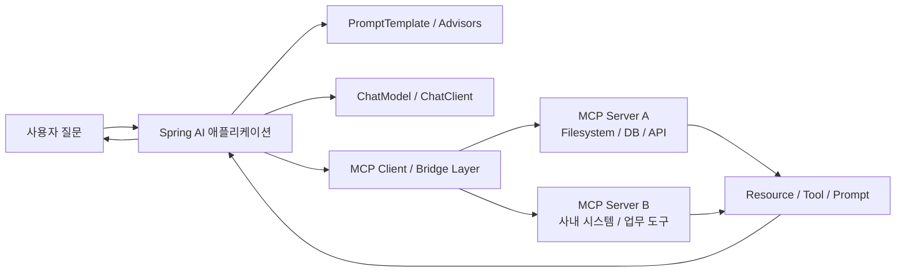

> 이 글은 **Spring AI 시리즈**의 3편입니다.
>
> - 1편: [Spring AI Basic — Prompt, Template, Structured Output](/posts/spring-ai-basic/)
> - 2편: [Spring AI Advisors API](/posts/spring-ai-advisor/)
> - 3편: Spring AI Tool Calling과 MCP (현재 글)
> - 4편: [Spring AI Multimodal — 이미지, 오디오](/posts/spring-ai-multimodal/)
> - 5편: [Spring AI Embedding과 RAG 심화](/posts/spring-ai-rag/)

Spring AI에서 가장 자주 헷갈리는 두 개념이 **Tool Calling**과 **MCP** 입니다.  
"둘 다 모델이 외부 기능을 호출하는 거 아닌가?"라고 생각하기 쉽지만, 실제로는 보는 위치와 책임이 다릅니다.

이 글에서는 다음 흐름으로 정리합니다.

1. Tool Calling의 핵심 추상화와 `ToolContext`
2. `ToolContext`와 MCP `RequestContext`의 차이
3. MCP가 Tool Calling 위에서 어떤 표준화를 더 얹는가
4. Spring AI에서 MCP가 흥미로운 이유
5. MCP Stateful / Stateless의 의미와 `application.yml` 설정값

> springboot3 + java sample은 [github-sample](https://github.com/ydj515/sample-repository-example/tree/main/spring-ai-example)를 참조해주세요.

## 1. Tool Calling과 MCP는 무엇이 다를까?

이 부분도 자주 헷갈립니다.  
결론부터 말하면 둘은 비슷한 영역을 다루지만 초점이 다릅니다.

### Tool Calling

Tool Calling은 모델이 애플리케이션에 등록된 기능을 호출하게 만드는 메커니즘입니다.

- 모델은 "도구를 써야겠다"고 판단합니다.
- 애플리케이션은 실제 메서드나 외부 호출을 실행합니다.
- 결과를 다시 모델이나 애플리케이션 로직으로 넘깁니다.

즉, 모델이 직접 세상을 바꾸는 것이 아니라, **애플리케이션이 모델의 요청을 받아 행동을 수행하는 구조**입니다.

### userId 같은 민감한 값은 Prompt가 아니라 ToolContext로 넘긴다

이 부분도 실무에서 정말 중요합니다.  
예를 들어 고객 조회 도구가 있는데, `userId`, `tenantId`, `role` 같은 값은 필요하지만 그 값을 굳이 LLM에게 보여주고 싶지 않을 수 있습니다.

이럴 때 쓰는 것이 `ToolContext`입니다.

공식 문서 기준 `ToolContext`는 tool execution에 필요한 추가 정보를 전달하기 위한 API이고, **여기에 담긴 데이터는 AI 모델로 전송되지 않습니다.**

예를 들어 아래처럼 도구를 만들 수 있습니다.

```java
class CustomerTools {

    @Tool(description = "고객 ID로 고객 정보를 조회한다.")
    public String getCustomerInfo(Long customerId, ToolContext toolContext) {
        String tenantId = (String) toolContext.getContext().get("tenantId");
        String userId = String.valueOf(toolContext.getContext().get("userId"));

        return "tenant=" + tenantId + ", user=" + userId + ", customerId=" + customerId;
    }
}
```

그리고 호출 시점에 `toolContext()`로 값을 넣습니다.

```java
String answer = ChatClient.create(chatModel)
    .prompt("고객 ID 42번의 정보를 조회해서 요약해줘.")
    .tools(new CustomerTools())
    .toolContext(Map.of(
        "tenantId", "acme",
        "userId", "u-1001"
    ))
    .call()
    .content();
```

이때 모델은 `"고객 ID 42번의 정보를 조회해라"` 같은 자연어와 도구 스펙은 알지만,

- `tenantId=acme`
- `userId=u-1001`

같은 내부 값은 직접 보지 못합니다.  
즉 모델은 "무슨 도구를 어떤 인자로 호출할지"를 결정하고, 실제 보안/테넌트/사용자 맥락은 애플리케이션이 `ToolContext`로 안전하게 주입합니다.

#### 언제 특히 유용한가?

- 멀티테넌트 환경에서 tenant 분기
- 로그인 사용자 ID 기반 권한 체크
- 내부 API 토큰, correlation ID 전달
- tool 실행 시 audit metadata 남기기

#### Prompt 파라미터로 넣으면 왜 안 좋을까?

예를 들어 아래처럼 쓰면 좋지 않습니다.

```java
String answer = chatClient.prompt()
    .user("tenantId=acme, userId=u-1001 인 상태에서 고객 42번 정보를 조회해줘.")
    .tools(new CustomerTools())
    .call()
    .content();
```

이 방식은 모델이 tenantId와 userId를 그대로 읽게 되므로, 불필요한 내부 정보 노출이 발생합니다.  
반면 `ToolContext`는 모델에 공개하지 않고 tool 실행 레이어에서만 사용할 수 있으므로 훨씬 안전합니다.

즉 실무에서는 아래처럼 정리하면 좋습니다.

- 모델이 판단해야 하는 정보 -> Prompt
- advisor끼리 공유할 내부 상태 -> Advisor context
- tool 실행 시 필요한 보안/사용자/테넌트 정보 -> ToolContext

여기서 한 가지 주의할 점이 있습니다.  
지금 설명한 `ToolContext`는 **Spring AI Tool Calling 레이어의 `org.springframework.ai.chat.model.ToolContext`** 입니다.  
뒤이어 나올 MCP stateless 문맥에서 등장하는 "Tool Context Support" 표현과는 같은 단어를 쓰지만 다른 레이어의 개념입니다.

### ToolContext와 MCP RequestContext는 무엇이 다를까?

이 둘은 이름만 보면 비슷하지만, 실제로는 완전히 다른 레이어에서 쓰입니다.

| 항목 | ToolContext | MCP RequestContext |
| --- | --- | --- |
| 대표 타입 | `ToolContext` | `McpSyncRequestContext`, `McpAsyncRequestContext`, `McpTransportContext` |
| 속한 레이어 | Spring AI Tool Calling | MCP Server Annotation |
| 누가 값을 넣나 | 애플리케이션 코드가 `.toolContext(Map.of(...))`로 전달 | MCP 프레임워크가 요청 처리 중 자동 주입 |
| 주 용도 | tool 실행 시 필요한 내부 보안/사용자/테넌트 정보 전달 | MCP 요청, 세션, client info, progress, sampling, elicitation 접근 |
| LLM에 보이나 | 보이지 않음 | MCP 클라이언트 요청 문맥이며 schema에 노출되지 않음 |
| JSON schema 포함 여부 | tool input schema에 포함되지 않음 | 공식 문서 기준 special parameter로 자동 주입되며 schema에서 제외 |
| 대표 사용 예 | `userId`, `tenantId`, 내부 토큰 | `sessionId()`, `clientInfo()`, `requestMeta()`, `progress()`, `ping()` |

한 문장으로 정리하면 이렇습니다.

- `ToolContext`: "내 Spring AI 애플리케이션 안에서 tool 실행에 필요한 내부 데이터"
- `MCP RequestContext`: "MCP 서버 메서드 안에서 현재 요청과 세션을 다루기 위한 프레임워크 컨텍스트"

#### ToolContext 예시

```java
class BillingTools {

    @Tool(description = "고객 청구 정보를 조회한다.")
    public String getBilling(Long customerId, ToolContext toolContext) {
        String tenantId = (String) toolContext.getContext().get("tenantId");
        String userId = (String) toolContext.getContext().get("userId");

        return "tenant=" + tenantId + ", user=" + userId + ", customerId=" + customerId;
    }
}
```

이 경우 `tenantId`와 `userId`는 애플리케이션이 `.toolContext(...)`로 넣어준 값입니다.

#### MCP RequestContext 예시

MCP Annotation 기반 서버에서는 아래처럼 현재 요청 자체를 다룰 수 있습니다.

```java
@McpTool(name = "advanced-doc-search", description = "문서를 검색한다.")
public String advancedDocSearch(
        McpSyncRequestContext context,
        @McpToolParam(description = "검색어", required = true) String query) {

    String sessionId = context.sessionId();
    String clientInfo = String.valueOf(context.clientInfo());
    String requestInfo = String.valueOf(context.request());

    return "session=" + sessionId + ", client=" + clientInfo + ", request=" + requestInfo + ", query=" + query;
}
```

이 예시는 `ToolContext`와 성격이 완전히 다릅니다.

- `ToolContext`는 우리가 직접 집어넣는 내부 실행 데이터입니다.
- `McpSyncRequestContext`는 MCP 요청으로부터 프레임워크가 자동 주입하는 서버 측 컨텍스트입니다.

#### Stateless 서버에서는 무엇을 쓰나?

공식 문서 기준 stateless MCP 서버에서는 `McpTransportContext`를 쓸 수 있습니다.  
이는 full server exchange 없이 transport 수준의 최소 컨텍스트만 제공하는 가벼운 타입입니다.

```java
@McpTool(name = "stateless-tool", description = "무상태 MCP 도구")
public String statelessTool(
        McpTransportContext context,
        @McpToolParam(description = "입력", required = true) String input) {

    return "Processed in stateless mode: " + input;
}
```

즉 MCP 쪽은 아래처럼 구분하면 됩니다.

- `McpSyncRequestContext` / `McpAsyncRequestContext`: stateful/stateless 모두 아우르는 상위 컨텍스트
- `McpTransportContext`: stateless 위주 경량 컨텍스트

실무적으로는 다음 기준이 편합니다.

- 단순 Tool Calling 내부 보안/사용자 정보 -> `ToolContext`
- MCP 서버 메서드에서 session, client capability, progress, sampling까지 다뤄야 함 -> `McpSyncRequestContext` 또는 `McpAsyncRequestContext`
- stateless MCP 서버에서 최소 컨텍스트만 필요함 -> `McpTransportContext`

### MCP

MCP는 도구 호출 하나만의 문제가 아니라, **외부 도구와 리소스, 프롬프트를 표준 방식으로 연결하는 프로토콜**입니다.

Spring AI 공식 문서 기준으로 MCP는 다음을 구조화합니다.

- Tool discovery / execution
- Resource access / management
- Prompt system interaction
- Client / Server 계층 분리
- STDIO, SSE, Streamable HTTP 같은 다양한 transport

위키독스의 MCP 설명도 비슷한 관점을 취합니다.  
Host와 Server를 분리하고, 중간에 Bridge Layer를 둠으로써 에이전트와 도구를 느슨하게 결합시키는 구조입니다.

### 한 문장으로 비교하면

- Tool Calling: 모델이 내 애플리케이션 기능을 호출하는 방식
- MCP: 내 애플리케이션이 외부 도구/리소스 생태계와 연결되는 표준 계약

그래서 MCP를 "Function Calling의 대체재"라기보다, **Function Calling을 포함해 더 넓은 도구/리소스 연결 문제를 다루는 표준화 계층**으로 이해하면 좋습니다.

## 2. Spring AI에서 MCP 붙히기

Spring AI는 MCP를 단순 소개 수준에서 끝내지 않고, 실제 애플리케이션에 붙이기 쉬운 도구를 제공합니다.

- `spring-ai-starter-mcp-client`
- `spring-ai-starter-mcp-server`
- 어노테이션 기반 프로그래밍 모델
- MCP 도구를 Spring AI `ToolCallback`으로 어댑트하는 유틸리티

특히 공식 문서의 MCP Utilities를 보면, MCP 서버가 제공하는 도구를 Spring AI의 툴 시스템으로 가져오는 어댑터가 제공됩니다.  
이 말은 곧, **MCP 생태계의 도구를 Spring AI ChatClient 흐름 안으로 편입시킬 수 있다**는 뜻입니다.

이 구조를 그림으로 보면 아래와 같습니다.



이제 Tool Calling은 단순히 "메서드 하나 호출"이 아니라, 더 큰 표준 생태계 안의 일부가 됩니다.

## 3. MCP에서 Stateful / Stateless는 무엇인가?

Spring AI 설정값을 보다 보면 특히 MCP 쪽에서 `STREAMABLE`, `STATELESS` 같은 값이 눈에 들어옵니다.  
이 부분은 단순 문자열 옵션이 아니라 **서버가 상태를 유지할 것인지 여부**와 직접 연결됩니다.

공식 문서 기준으로 정리하면 다음처럼 이해하면 됩니다.

여기서 먼저 한 가지를 분리해서 봐야 합니다.

- `spring.ai.mcp.server.protocol`: 서버의 통신 프로토콜과 stateful/stateless 성격
- `spring.ai.mcp.server.type`: 서버 구현의 동기/비동기 실행 방식

즉, `STREAMABLE`/`STATELESS`와 `SYNC`/`ASYNC`는 서로 다른 축입니다.  
예를 들어 `protocol=STATELESS`, `type=ASYNC` 같은 조합도 가능합니다.

### 비교표: SSE vs STREAMABLE vs STATELESS

여기서는 셋을 한 표로 비교해두는 것이 가장 이해가 빠릅니다.

| 항목 | SSE | STREAMABLE | STATELESS |
| --- | --- | --- | --- |
| 서버 설정값 | `spring.ai.mcp.server.protocol=SSE` 또는 empty | `spring.ai.mcp.server.protocol=STREAMABLE` | `spring.ai.mcp.server.protocol=STATELESS` |
| 클라이언트 설정 | `spring.ai.mcp.client.sse.connections.*` | `spring.ai.mcp.client.streamable-http.connections.*` | `spring.ai.mcp.client.streamable-http.connections.*` |
| 상태 유지 관점 | 별도 세션 기반 상호작용보다 이벤트 스트리밍 중심 | stateful에 가까움 | 명시적 stateless |
| 공식 문서 설명 포인트 | 실시간 업데이트용 SSE transport | SSE를 대체하는 최신 transport | 요청 간 session state를 유지하지 않음 |
| 연결 특성 | 서버가 독립 프로세스로 동작하며 여러 클라이언트 연결 가능 | HTTP GET/POST 기반, 필요 시 SSE 스트리밍 포함 | HTTP 기반 단순 무상태 호출 |
| 적합한 경우 | 기존 SSE 기반 MCP 서버를 빠르게 붙일 때 | 장기적으로 권장되는 일반적인 HTTP MCP 서버 | 마이크로서비스, 수평 확장, 무상태 배포 |
| 제약/메모 | 최신 방향은 Streamable-HTTP 쪽 | 기능 폭이 넓고 유연함 | `elicitation`, `sampling`, `ping` 등 일부 기능 제약 |

한 줄로 요약하면 이렇습니다.

- `SSE`: 초창기/단순 실시간 스트리밍 transport
- `STREAMABLE`: 최신 일반 목적 transport
- `STATELESS`: Streamable-HTTP 계열이지만 세션 상태를 유지하지 않는 경량 서버

### Stateful에 가까운 쪽: `STREAMABLE`

```yaml
spring:
  ai:
    mcp:
      server:
        protocol: STREAMABLE
```

`spring.ai.mcp.server.protocol=STREAMABLE`은 Streamable-HTTP MCP 서버를 의미합니다.  
Spring AI 문서에서는 이 서버가 **persistent connection management**를 지원한다고 설명합니다. 즉, 클라이언트와 서버가 연결 상태와 세션 맥락을 유지하면서 더 풍부한 상호작용을 할 수 있는 쪽에 가깝습니다.

특징은 아래와 같습니다.

- 여러 클라이언트 연결을 처리할 수 있습니다.
- 도구, 리소스, 프롬프트, completion, logging, progress, ping, root-changes 같은 전체 capability 지원에 적합합니다.
- 도구/리소스/프롬프트 변경 알림을 보내는 시나리오에 잘 맞습니다.
- 연결이 살아 있는 동안 더 풍부한 상호작용을 설계할 수 있습니다.

즉, "클라이언트와 서버 사이에 상호작용이 계속 이어지고, 동적 변경 알림까지 활용하고 싶다"면 `STREAMABLE`이 더 자연스럽습니다.

### Stateless 쪽: `STATELESS`

```yaml
spring:
  ai:
    mcp:
      server:
        protocol: STATELESS
```

`spring.ai.mcp.server.protocol=STATELESS`는 Stateless Streamable-HTTP MCP 서버를 의미합니다.  
공식 문서는 이를 **session state is not maintained between requests** 라고 설명합니다. 즉, 요청 사이에 서버가 세션 상태를 유지하지 않는 구조입니다.

특징은 아래와 같습니다.

- 요청 간 세션 상태를 유지하지 않습니다.
- 마이크로서비스 아키텍처나 클라우드 네이티브 배포에 잘 맞습니다.
- 배포 구조가 단순해집니다.
- 수평 확장이나 무상태 인스턴스 운영에 유리합니다.

대신 제한도 있습니다.

- stateless 서버는 MCP client 쪽으로 보내는 message request 일부를 지원하지 않습니다.
- 공식 문서 기준 예시로 `elicitation`, `sampling`, `ping` 같은 요청은 지원하지 않습니다.
- 문서에는 stateless 서버에서는 `Tool Context Support is not applicable` 하다고도 설명합니다.

즉, `STATELESS`는 "도구 호출은 제공하되, 세션 유지나 양방향 상호작용은 최소화한 서버"라고 이해하면 됩니다.

### 어떤 값을 선택해야 할까?

아주 실무적으로 정리하면 아래처럼 판단하면 됩니다.

- `STREAMABLE`: 세션 맥락, 변경 알림, 더 풍부한 capability, 지속 연결이 중요할 때
- `STATELESS`: 단순한 HTTP 기반 MCP 도구 서버, 무상태 배포, 클라우드 확장이 중요할 때

예를 들어,

- 사내 IDE/에이전트가 장시간 붙어서 도구 목록 변경 알림까지 받아야 한다 -> `STREAMABLE`
- 단순한 사내 문서 조회 MCP 서버를 API 서버처럼 가볍게 띄우고 싶다 -> `STATELESS`

### 클라이언트 쪽 설정은 어떻게 다를까?

여기서 헷갈리기 쉬운 포인트가 하나 있습니다.  
클라이언트에는 보통 `stateful=true`, `stateless=true` 같은 별도 값이 없습니다.

공식 문서 기준 MCP Client는 **`spring.ai.mcp.client.streamable-http` 설정으로 Streamable-HTTP 서버와 Stateless Streamable-HTTP 서버 둘 다 연결**합니다.

즉, 클라이언트 쪽은 보통 이렇게 둡니다.

```yaml
spring:
  ai:
    mcp:
      client:
        streamable-http:
          connections:
            internal-tools:
              url: http://localhost:8090
              endpoint: /mcp
```

그리고 서버 쪽에서

- `protocol: STREAMABLE`이면 stateful에 가까운 streamable 서버
- `protocol: STATELESS`이면 stateless streamable 서버

로 동작이 갈립니다.

### 설정값 관점에서 기억할 포인트

| 목적 | 설정값 |
| --- | --- |
| stateful에 가까운 streamable 서버 | `spring.ai.mcp.server.protocol=STREAMABLE` |
| stateless 서버 | `spring.ai.mcp.server.protocol=STATELESS` |
| stateless 서버 endpoint | `spring.ai.mcp.server.stateless.mcp-endpoint` |
| stateless 서버 delete 제한 | `spring.ai.mcp.server.stateless.disallow-delete` |
| streamable 서버 endpoint | `spring.ai.mcp.server.streamable-http.mcp-endpoint` |
| streamable 서버 keep alive | `spring.ai.mcp.server.streamable-http.keep-alive-interval` |
| 클라이언트 연결 | `spring.ai.mcp.client.streamable-http.connections.*` |

## 4. MCP Client 설정값

MCP Client는 내 Spring AI 애플리케이션이 외부 MCP 서버에 붙는 설정입니다.

### 공통 설정

```yaml
spring:
  ai:
    mcp:
      client:
        enabled: true
        name: my-mcp-client
        version: 1.0.0
        initialized: true
        request-timeout: 20s
        type: SYNC
        toolcallback:
          enabled: true
```

| 프로퍼티 | 기본값 | 설명 |
| --- | --- | --- |
| `spring.ai.mcp.client.enabled` | `true` | MCP client 자동설정 활성화 여부 |
| `spring.ai.mcp.client.name` | `spring-ai-mcp-client` | MCP 클라이언트 식별 이름 |
| `spring.ai.mcp.client.version` | `1.0.0` | 클라이언트 버전 |
| `spring.ai.mcp.client.initialized` | `true` | 생성 시 클라이언트를 바로 initialize 할지 여부 |
| `spring.ai.mcp.client.request-timeout` | `20s` | MCP 요청 타임아웃 |
| `spring.ai.mcp.client.type` | `SYNC` | `SYNC` 또는 `ASYNC`, 혼합은 지원하지 않음 |
| `spring.ai.mcp.client.root-change-notification` | `true` | root 변경 알림 활성화 |
| `spring.ai.mcp.client.toolcallback.enabled` | `true` | MCP 도구를 Spring AI ToolCallback으로 자동 연결할지 여부 |

여기서 가장 중요한 값은 `type`과 `toolcallback.enabled`입니다.

- `type=SYNC`: 일반적인 MVC 스타일에 무난합니다.
- `type=ASYNC`: reactive 흐름과 궁합이 좋습니다.
- `toolcallback.enabled=true`: MCP 도구를 ChatClient 툴 체계에 편입시키기 쉽습니다.

### STDIO 연결

로컬 프로세스로 MCP 서버를 띄울 때 자주 씁니다.

```yaml
spring:
  ai:
    mcp:
      client:
        stdio:
          connections:
            filesystem:
              command: npx
              args:
                - -y
                - "@modelcontextprotocol/server-filesystem"
                - /Users/dongjin/dev
```

주요 속성은 다음과 같습니다.

- `spring.ai.mcp.client.stdio.connections.[name].command`
- `spring.ai.mcp.client.stdio.connections.[name].args`
- `spring.ai.mcp.client.stdio.connections.[name].env`

즉, Spring Boot가 외부 프로세스를 실행하고, 그 프로세스와 STDIO로 MCP 통신을 하는 구조입니다.

### SSE 연결

원격 MCP 서버가 SSE endpoint를 제공한다면 아래처럼 붙일 수 있습니다.

```yaml
spring:
  ai:
    mcp:
      client:
        sse:
          connections:
            weather:
              url: http://localhost:8080
              sse-endpoint: /sse
```

핵심은 `url`과 `sse-endpoint`를 분리하는 것입니다.

- `url`: scheme + host + port
- `sse-endpoint`: 실제 SSE path

예를 들어 `http://localhost:3000/mcp-hub/sse/token123` 같은 전체 URL이 있다면,  
base URL과 endpoint를 쪼개서 넣어야 404를 덜 겪습니다.

### Streamable HTTP 연결

Spring AI 공식 문서에서는 최신 MCP transport로 `Streamable-HTTP`도 적극 다룹니다.

```yaml
spring:
  ai:
    mcp:
      client:
        streamable-http:
          connections:
            internal-tools:
              url: http://localhost:8090
              endpoint: /mcp
```

`Streamable-HTTP`는 기존 SSE보다 더 표준화된 최신 transport 흐름으로 이해하면 됩니다.

## 5. MCP Server 설정값

반대로 Spring 애플리케이션이 MCP 서버가 될 수도 있습니다.

### STDIO 서버

가장 단순한 형태는 STDIO 서버입니다.

```yaml
spring:
  ai:
    mcp:
      server:
        stdio: true
        name: sample-mcp-server
        version: 1.0.0
```

공식 문서 기준 `spring.ai.mcp.server.stdio=true`로 STDIO transport를 활성화할 수 있습니다.

### Streamable-HTTP 서버

HTTP 기반으로 외부 클라이언트가 붙게 만들고 싶다면 아래처럼 갑니다.

```yaml
spring:
  ai:
    mcp:
      server:
        protocol: STREAMABLE
        name: streamable-mcp-server
        version: 1.0.0
        type: SYNC
        instructions: "This server provides internal business tools"
        capabilities:
          tool: true
          resource: true
          prompt: true
          completion: false
        tool-change-notification: true
        resource-change-notification: true
        prompt-change-notification: true
        request-timeout: 20s
        streamable-http:
          mcp-endpoint: /mcp
          keep-alive-interval: 30s
```

여기서 중요한 속성은 아래와 같습니다.

| 프로퍼티 | 기본값 | 의미 |
| --- | --- | --- |
| `spring.ai.mcp.server.protocol` | - | `STREAMABLE`, `SSE`, `STATELESS` 등 프로토콜 선택 |
| `spring.ai.mcp.server.name` | `mcp-server` | 서버 식별 이름 |
| `spring.ai.mcp.server.version` | `1.0.0` | 서버 버전 |
| `spring.ai.mcp.server.type` | `SYNC` | 동기/비동기 서버 타입 |
| `spring.ai.mcp.server.instructions` | `null` | 클라이언트에게 서버 사용 방법을 알려주는 설명 |
| `spring.ai.mcp.server.capabilities.tool` | `true` | tool capability 노출 여부 |
| `spring.ai.mcp.server.capabilities.resource` | `true` | resource capability 노출 여부 |
| `spring.ai.mcp.server.capabilities.prompt` | `true` | prompt capability 노출 여부 |
| `spring.ai.mcp.server.capabilities.completion` | `true` | completion capability 노출 여부 |
| `spring.ai.mcp.server.request-timeout` | `20s` | 요청 타임아웃 |
| `spring.ai.mcp.server.streamable-http.mcp-endpoint` | `/mcp` | MCP endpoint path |
| `spring.ai.mcp.server.streamable-http.keep-alive-interval` | `null` | keep alive 간격, 기본은 비활성화 |

실무 감각으로 보면 이렇습니다.

- `instructions`는 단순 설명 같지만, 클라이언트가 이 서버를 어떤 용도로 써야 하는지 전달하는 메타데이터라 꽤 중요합니다.
- `capabilities.*`는 "이 서버가 무엇을 공개할 것인가"를 결정하는 공개 범위 설정입니다.
- `completion`은 필요 없는 경우 꺼두는 편이 표면적을 줄여서 관리가 쉽습니다.

### Stateless 서버

stateless 서버를 쓰고 싶다면 설정이 조금 달라집니다.

```yaml
spring:
  ai:
    mcp:
      server:
        protocol: STATELESS
        name: stateless-mcp-server
        version: 1.0.0
        type: SYNC
        capabilities:
          tool: true
          resource: true
          prompt: false
          completion: false
        stateless:
          mcp-endpoint: /mcp
          disallow-delete: true
```

공식 문서 기준 stateless 서버에서 별도로 눈여겨볼 값은 아래입니다.

| 프로퍼티 | 기본값 | 의미 |
| --- | --- | --- |
| `spring.ai.mcp.server.protocol` | - | `STATELESS`로 두면 stateless MCP 서버 활성화 |
| `spring.ai.mcp.server.stateless.mcp-endpoint` | `/mcp` | stateless MCP endpoint path |
| `spring.ai.mcp.server.stateless.disallow-delete` | `false` | delete operation 금지 여부 |

즉 streamable 서버와 비교했을 때, stateless는 `keep-alive-interval` 같은 지속 연결 관련 값 대신 더 단순한 endpoint 설정 중심으로 갑니다.

## 정리

Tool Calling과 MCP는 같은 단어("도구")를 쓰지만 책임이 다릅니다.

- **Tool Calling**: 내 애플리케이션 안에서 모델이 호출할 메서드를 노출하는 메커니즘. 보안/사용자 컨텍스트는 `ToolContext`로 격리.
- **MCP**: 도구·리소스·프롬프트를 외부와 표준 방식으로 주고받기 위한 프로토콜. Spring AI는 client/server 양쪽 자동설정과 어노테이션 모델로 통합 비용을 크게 낮춰줍니다.

운영 단계로 가면 결국 두 가지 축으로 의사결정이 좁혀집니다.

- 도구를 내 앱 안에서 끝낼지(`Tool Calling`), 외부 표준으로 노출/소비할지(`MCP`)
- MCP라면 stateful streamable로 갈지(`STREAMABLE`), 무상태 단순 서버로 갈지(`STATELESS`)

이 두 축을 명확히 잡으면 `application.yml`의 MCP 관련 설정은 거의 기계적으로 채울 수 있습니다.

## 다음 글

- [4편 — Spring AI Multimodal: 이미지와 오디오](/posts/spring-ai-multimodal/)
- [5편 — Spring AI Embedding과 RAG 심화](/posts/spring-ai-rag/)

이전 글이 궁금하다면:

- [1편 — Spring AI Basic](/posts/spring-ai-basic/)
- [2편 — Spring AI Advisors API](/posts/spring-ai-advisor/)

## 출처

- [Spring AI Tool Calling](https://docs.spring.io/spring-ai/reference/api/tools.html)
- [Spring AI MCP Overview](https://docs.spring.io/spring-ai/reference/api/mcp/mcp-overview.html)
- [Spring AI MCP Client](https://docs.spring.io/spring-ai/reference/api/mcp/mcp-client-boot-starter-docs.html)
- [Spring AI MCP Server](https://docs.spring.io/spring-ai/reference/api/mcp/mcp-server-boot-starter-docs.html)
- [Spring AI MCP Utilities](https://docs.spring.io/spring-ai/reference/api/mcp/mcp-helpers.html)
- [위키독스 - MCP 및 도구·컨텍스트 연계 구조](https://wikidocs.net/313135)
