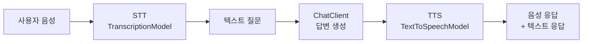

> 이 글은 **Spring AI 시리즈**의 4편입니다.
>
> - 1편: [Spring AI Basic — Prompt, Template, Structured Output](/posts/spring-ai-basic/)
> - 2편: [Spring AI Advisors API](/posts/spring-ai-advisor/)
> - 3편: [Spring AI Tool Calling과 MCP](/posts/spring-ai-tool-mcp/)
> - 4편: Spring AI Multimodal — 이미지, 오디오 (현재 글)
> - 5편: [Spring AI Embedding과 RAG 심화](/posts/spring-ai-rag/)

Spring AI를 "텍스트 LLM 라이브러리"로만 보면 절반만 본 셈입니다.  
이미지 입력, 이미지 생성, TTS, STT까지 **같은 추상화 위에서** 다 묶을 수 있는 게 Spring AI의 진짜 매력입니다.

이 글에서는 다음 흐름으로 정리합니다.

1. 이미지 입력(Vision): `UserMessage` + `Media`
2. 이미지 생성: `ImageModel` + `ImagePrompt`
3. TTS와 스트리밍 TTS
4. STT와 STT → Chat → TTS 묶기

> springboot3 + java sample은 [github-sample](https://github.com/ydj515/sample-repository-example/tree/main/spring-ai-example)를 참조해주세요.

## 1. Multimodal: 이미지 입력과 이미지 생성

Spring AI에서 멀티모달은 두 가지 추상화로 갈립니다.

- **이미지 입력(Vision)**: `ChatClient`의 `UserMessage`에 `Media`를 첨부 → 일반 chat 호출의 확장
- **이미지 생성**: `ImageModel` + `ImagePrompt` + `OpenAiImageOptions` → 별도 모델 호출

### 이미지 분석 (Vision)

샘플 레포의 `MultimodalService.analyzeImage()`는 가장 전형적인 패턴입니다.

```java
public Flux<String> analyzeImage(String question, String contentType, byte[] bytes) {
    Message systemMessage = new SystemMessage(systemPrompt.render());

    // 이미지 바이트를 Media로 래핑
    Media media = Media.builder()
            .mimeType(MimeType.valueOf(contentType))
            .data(new ByteArrayResource(bytes))
            .build();

    // 텍스트 질문 + 첨부 이미지를 같은 UserMessage에 묶어서 전달
    UserMessage userMessage = UserMessage.builder()
            .text(question)
            .media(media)
            .build();

    // 일반 ChatClient.stream()과 호출 구조가 동일
    return this.chatClient.prompt()
            .messages(userMessage, systemMessage)
            .stream()
            .content();
}
```

여기서 중요한 포인트는 다음과 같습니다.

- 이미지를 별도 API로 보내는 게 아니라, **`UserMessage`에 `Media`를 첨부해서 평소처럼 ChatClient를 호출**합니다.
- `mimeType`을 정확히 잡아주는 게 중요합니다. `image/png`, `image/jpeg` 등.
- `byte[]` 형태로 처리할 때는 `ByteArrayResource`로 감싸 메모리에서 바로 흘릴 수 있습니다.

> Vision은 모델 선택에 민감합니다. `gpt-4o`, `gpt-4o-mini`처럼 vision-capable 모델을 명시적으로 골라야 동작합니다. 텍스트 전용 모델로는 이미지가 무시되거나 오류가 납니다.

### 이미지 생성 (ImageModel)

이미지 생성은 ChatClient가 아니라 `ImageModel`을 직접 씁니다.

```java
private ImageResponse generateImage(String prompt, String responseFormat) {
    // 단일 이미지 생성 요청
    ImageMessage imageMessage = new ImageMessage(prompt);

    // OpenAI 이미지 모델 옵션 (DALL·E 3, 1024x1024, URL 또는 base64)
    OpenAiImageOptions imageOptions = OpenAiImageOptions.builder()
            .model("dall-e-3")
            .responseFormat(responseFormat) // "url" 또는 "b64_json"
            .width(1024)
            .height(1024)
            .N(1)
            .build();

    ImagePrompt imagePrompt = new ImagePrompt(List.of(imageMessage), imageOptions);
    return this.imageModel.call(imagePrompt);
}
```

응답 형식은 두 가지 중에서 고릅니다.

| `responseFormat` | 응답 위치 | 적합한 경우 |
| --- | --- | --- |
| `"url"` | `output.getUrl()` | 결과를 외부에서 다운로드해서 쓰는 케이스. 일시적 URL이라 만료 시간이 짧을 수 있음 |
| `"b64_json"` | `output.getB64Json()` | 바로 저장하거나 응답 본문에 실어 보낼 때. URL fetching 부담이 없음 |

> 이미지 생성 모델은 보통 텍스트 모델보다 호출 비용이 비싸고, 응답 시간도 깁니다.  
> 운영에서는 `temperature` 같은 텍스트 옵션 대신 `width/height/quality/style`을 잘 잡는 것이 비용/품질 균형에 더 큰 영향을 줍니다.

### Chat과 Image, 같은 흐름에서 어떻게 묶을까?

샘플 컨트롤러는 같은 `MultimodalController` 아래에 세 흐름을 같이 둡니다.

- 텍스트 → 이미지 URL (`generateImageUrl`)
- 텍스트 → 이미지 base64 (`generateImageBase64`)
- 이미지 + 질문 → 텍스트 분석 (`analyzeImage`)

즉 "텍스트만 처리"가 아니라 "텍스트 ↔ 이미지" 양방향이 같은 컨트롤러에서 자연스럽게 묶입니다.  
실무에서도 보통 다음 두 흐름을 한 화면에서 같이 쓰게 됩니다.

- 사용자가 올린 이미지에 대해 LLM이 설명/분석
- 사용자의 텍스트 입력으로 LLM이 이미지를 생성

### 이미지 관련 설정값

```yaml
spring:
  ai:
    openai:
      api-key: ${OPENAI_API_KEY}
      image:
        options:
          model: dall-e-3
          response-format: url   # 또는 b64_json
          size: 1024x1024
          quality: standard      # 또는 hd
          style: vivid           # 또는 natural
    # 멀티파트 업로드 크기 제한
servlet:
  multipart:
    enabled: true
    max-file-size: 20MB
    max-request-size: 20MB
```

운영 관점에서 자주 손대는 값은 `quality`, `size`, `max-file-size` 입니다.  
큰 이미지 입력을 받을 거라면 `max-file-size`를 충분히 키워야 멀티파트 업로드가 막히지 않습니다.

## 2. Audio: TTS와 STT, 그리고 Chat과 묶기

오디오도 Multimodal과 비슷한 구조입니다.  
Spring AI에서는 두 가지 모델 추상화를 제공합니다.

- `TextToSpeechModel`: 텍스트 → 음성 (TTS)
- `TranscriptionModel`: 음성 → 텍스트 (STT)

### TTS 기본 호출

```java
// 음성 생성 옵션은 모델/목소리/포맷/속도를 builder로 지정
this.speechOptions = OpenAiAudioSpeechOptions.builder()
        .model("gpt-4o-mini-tts")
        .voice(OpenAiAudioApi.SpeechRequest.Voice.NOVA)
        .responseFormat(OpenAiAudioApi.SpeechRequest.AudioResponseFormat.MP3)
        .speed(1.0)
        .build();

public Map<String, String> textToSpeech(String text) {
    // 텍스트와 옵션으로 prompt 생성
    TextToSpeechPrompt speechPrompt = new TextToSpeechPrompt(text, speechOptions);
    // call → byte[] 형태의 음성 데이터
    TextToSpeechResponse response = textToSpeechModel.call(speechPrompt);
    byte[] bytes = response.getResult().getOutput();
    // 응답으로 내려줄 때는 보통 base64 인코딩
    return audioOnlyResponse(bytes);
}
```

핵심 포인트는 `byte[]`로 음성을 받는다는 점입니다.  
HTTP 응답으로 내릴 때는 두 가지 선택지가 있습니다.

- `audio/mpeg` 같은 binary content-type으로 바로 streaming
- base64 인코딩해서 JSON 필드로 응답 (프론트에서 다루기 쉬움)

샘플 컨트롤러는 후자를 사용해 `{"audio": "<base64>"}` 형태로 응답합니다.

### TTS 스트리밍

응답이 긴 경우 한 번에 받지 않고 chunk로 받아 흘릴 수도 있습니다.

```java
public Flux<byte[]> textToSpeechChatStream(String question) {
    // 1) LLM에 질문을 던져 답변 텍스트를 받는다
    String answerText = generateChatAnswer(question);
    TextToSpeechPrompt speechPrompt = new TextToSpeechPrompt(answerText, speechOptions);
    // 2) 답변 텍스트를 stream API로 음성 변환
    return textToSpeechModel.stream(speechPrompt)
            .map(response -> response.getResult().getOutput());
}
```

스트리밍 TTS는 "LLM 답변 → 음성 변환 → 사용자" 흐름의 latency를 줄이는 데 가장 효과적입니다.  
다만 클라이언트에서 chunk를 이어붙여 재생해야 하므로, 프론트 구현 부담이 함께 있다는 점을 같이 고려해야 합니다.

### STT 기본 호출

음성 파일을 텍스트로 변환할 때는 `TranscriptionModel`을 씁니다.

```java
// 음성 변환 옵션
this.transcriptionOptions = OpenAiAudioTranscriptionOptions.builder()
        .model("whisper-1")
        .language("ko")
        .build();

public String speechToText(MultipartFile multipartFile) throws IOException {
    // 멀티파트 업로드 파일을 임시 파일로 옮긴 뒤 모델에 전달
    Path tempFile = createTempAudioFile(multipartFile);
    try {
        multipartFile.transferTo(tempFile);
        Resource audioResource = new FileSystemResource(tempFile);
        AudioTranscriptionPrompt prompt = new AudioTranscriptionPrompt(audioResource, transcriptionOptions);
        AudioTranscriptionResponse response = transcriptionModel.call(prompt);
        return response.getResult().getOutput();
    }
    finally {
        // 사용 후 임시 파일은 반드시 정리
        Files.deleteIfExists(tempFile);
    }
}
```

핵심 포인트는 두 가지입니다.

- `MultipartFile`을 그대로 못 보내고 `Resource`로 감싸야 합니다. 가장 안전한 방법이 임시 파일로 떨어뜨린 뒤 `FileSystemResource`로 감싸는 패턴입니다.
- `language`를 명시하면 정확도가 크게 올라갑니다. 한국어 입력은 반드시 `"ko"`로 지정하는 편이 좋습니다.

### Chat과 묶기: STT → Chat → TTS

오디오 기능은 단독으로 쓰기보다 보통 LLM 호출과 함께 묶입니다.  
샘플 레포의 `speechToTextChatVoice`는 가장 완성도 높은 형태로, 세 단계가 한 흐름에 이어집니다.



즉 "Spring AI는 텍스트 LLM 라이브러리"라는 인식보다, **"같은 추상화로 텍스트/이미지/음성을 다 묶을 수 있는 프레임워크"** 로 보는 편이 더 정확합니다.

> TTS/STT는 응답 latency, 파일 크기, 임시 파일 정리, 보안(개인 음성 데이터) 같은 운영 이슈가 텍스트보다 훨씬 큽니다.  
> 따라서 실제 서비스에서는 임시 파일 cleanup, 업로드 크기 제한(`spring.servlet.multipart.max-file-size`), 응답 mime-type 처리를 반드시 같이 설계해야 합니다.

### 오디오 관련 설정값

```yaml
spring:
  ai:
    openai:
      api-key: ${OPENAI_API_KEY}
      audio:
        speech:
          options:
            model: gpt-4o-mini-tts
            voice: NOVA
            response-format: mp3
            speed: 1.0
        transcription:
          options:
            model: whisper-1
            language: ko
```

`voice`(NOVA, ALLOY, ECHO 등)와 `speed`는 사용자가 가장 먼저 체감하는 값입니다.  
한국어 콘텐츠가 많은 서비스라면 `transcription.options.language: ko`를 반드시 명시해두는 편이 안전합니다.

## 정리

Spring AI의 멀티모달은 결국 두 가지 패턴으로 압축됩니다.

- **ChatClient 위에 얹기**: `UserMessage.media`로 이미지/오디오 첨부 → 평소 chat 흐름의 확장
- **전용 모델 추상화 사용**: `ImageModel`, `TextToSpeechModel`, `TranscriptionModel` → 별도 호출

운영에서 신경 써야 할 포인트는 거의 동일합니다.

- 모델 선택(vision-capable, audio-capable 여부)
- 응답 포맷(`url` vs `b64_json`, MP3 vs WAV, base64 vs binary)
- 멀티파트 업로드 한도와 임시 파일 cleanup
- 비용/Latency가 높은 모델임을 감안한 캐싱·재시도 정책

## 다음 글

- [5편 — Spring AI Embedding과 RAG 심화](/posts/spring-ai-rag/)

이전 글이 궁금하다면:

- [1편 — Spring AI Basic](/posts/spring-ai-basic/)
- [2편 — Spring AI Advisors API](/posts/spring-ai-advisor/)
- [3편 — Spring AI Tool Calling과 MCP](/posts/spring-ai-tool-mcp/)

## 출처

- [Spring AI Multimodality / Vision](https://docs.spring.io/spring-ai/reference/api/multimodality.html)
- [Spring AI Image Generation](https://docs.spring.io/spring-ai/reference/api/image.html)
- [Spring AI Audio (TTS / STT)](https://docs.spring.io/spring-ai/reference/api/audio.html)
- [OpenAI Image API](https://platform.openai.com/docs/guides/images)
- [OpenAI Audio API](https://platform.openai.com/docs/guides/text-to-speech)
