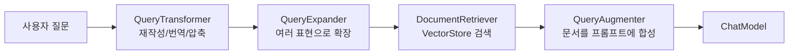

> 이 글은 **Spring AI 시리즈**의 5편입니다.
>
> - 1편: [Spring AI Basic — Prompt, Template, Structured Output](/posts/spring-ai-basic/)
> - 2편: [Spring AI Advisors API](/posts/spring-ai-advisor/)
> - 3편: [Spring AI Tool Calling과 MCP](/posts/spring-ai-tool-mcp/)
> - 4편: [Spring AI Multimodal — 이미지, 오디오](/posts/spring-ai-multimodal/)
> - 5편: Spring AI Embedding과 RAG 심화 (현재 글)

RAG(Retrieval-Augmented Generation)는 처음 보면 "검색 + LLM"이라는 단순한 개념이지만, 실제로 만들어보면 컴포넌트가 빠르게 늘어납니다.

- 임베딩 모델은 뭘 쓸 것인가
- 어디에 저장할 것인가
- 검색 결과를 어떻게 프롬프트에 끼워 넣을 것인가
- 멀티턴 대화에서 대명사 질문은 어떻게 해결할 것인가
- 다국어 입력은?

Spring AI는 이 흐름을 **모듈러 컴포넌트의 조합**으로 풀어냅니다.  
이 글은 그 조립 흐름을 한 글에 정리한 글입니다.

> springboot3 + java sample은 [github-sample](https://github.com/ydj515/sample-repository-example/tree/main/spring-ai-example)를 참조해주세요.

## 1. Embedding과 VectorStore: RAG의 기초 체력

RAG를 이해하려면 먼저 두 가지 추상화가 머리에 들어와야 합니다.

- **EmbeddingModel**: 문장을 벡터로 바꾸는 모델
- **VectorStore**: 벡터를 저장하고 유사도로 검색하는 저장소

Spring AI에서는 다행히도 우리가 두 가지를 직접 짤 일이 거의 없습니다.  
보통은 `VectorStore` 추상화만 쓰고, 내부에서 자동으로 `EmbeddingModel`이 호출됩니다.

### 가장 단순한 흐름: 텍스트 → 임베딩 → 검색

샘플 레포의 `TextEmbeddingModelService`는 이 흐름을 그대로 보여줍니다.

```java
@Service
public class TextEmbeddingModelService {

    private final VectorStore vectorStore;

    // 회사 규정 같은 정적인 텍스트 데이터
    List<Document> documents = List.of(
            new Document("출근 시간은 9시 입니다.", Map.of("key", "regulation")),
            new Document("퇴근 시간은 6시 입니다.", Map.of("key", "regulation")),
            new Document("야근은 없습니다.", Map.of("key", "regulation")));

    public TextEmbeddingModelService(VectorStore vectorStore) {
        this.vectorStore = vectorStore;
    }

    public String addData() {
        // add(documents) 한 줄로 임베딩 + 저장이 동시에 일어남
        vectorStore.add(documents);
        return " Add Completed";
    }

    public String deleteDate() {
        // 메타데이터 기반 필터 표현식으로 일괄 삭제 가능
        vectorStore.delete("key == 'regulation'");
        return "Delete Completed ";
    }

    public List<Document> similaritySearch(String question) {
        return vectorStore.similaritySearch(question);
    }
}
```

여기서 가장 중요한 점은 `vectorStore.add(documents)` 한 줄에 다음이 다 들어 있다는 것입니다.

1. 각 `Document`의 텍스트가 `EmbeddingModel`로 임베딩됨
2. 임베딩 벡터와 원본 텍스트, 메타데이터가 함께 PGVector 같은 저장소에 저장됨

> `EmbeddingModel`은 OpenAI라면 기본적으로 `text-embedding-ada-002` 계열이 자동 적용됩니다.  
> 운영에서는 차원 수(dimension)와 비용을 고려해 적절한 임베딩 모델을 명시적으로 고르는 편이 좋습니다.

### 메타데이터 필터: similaritySearch는 단순 검색이 아니다

`HotelEmbeddingModelService`는 메타데이터 필터를 본격적으로 보여줍니다.

```java
List<Document> documents = List.of(
        new Document("호텔 입실 시간은 오후 3시 입니다.", Map.of("section", "regulation", "name", "hotel1")),
        new Document("호텔 입실 시간은 오후 2시 입니다.", Map.of("section", "regulation", "name", "hotel2")),
        new Document("호텔 조식 시간은 오전 7시부터 오전 9시까지 입니다.", Map.of("section", "restaurant", "name", "hotel1")),
        // ...
);

public List<Document> similaritySearch(String question, String section, String name) {
    return vectorStore.similaritySearch(
            SearchRequest.builder()
                    .query(question)
                    .topK(1)                // 최대 후보 1개만
                    .similarityThreshold(0.5) // 유사도 0.5 미만은 버림
                    // 메타데이터 필터: hotel1의 regulation 섹션만 검색 대상
                    .filterExpression("section == '%s' and name == '%s'".formatted(section, name))
                    .build());
}
```

`FilterExpressionBuilder`를 쓰면 더 안전합니다.

```java
public List<Document> similaritySearch(String question, String director, int year) {
    FilterExpressionBuilder b = new FilterExpressionBuilder();
    return vectorStore.similaritySearch(
            SearchRequest.builder()
                    .query(question)
                    .topK(1)
                    .similarityThreshold(0.5)
                    // director == ? AND year >= ? 형태의 타입 안전 표현식
                    .filterExpression(b.and(b.eq("director", director), b.gte("year", year)).build())
                    .build());
}
```

실무에서는 `topK`, `similarityThreshold`, `filterExpression` 세 가지를 다 같이 잡는 편이 안전합니다.

- `topK`: 최종 결과 개수 제한. 임계치를 통과한 최종 후보들 중 유사도가 가장 높은 순서대로 상위 K개만 선택하여 최종 반환합니다. 너무 많은 후보를 LLM에 넣으면 컨텍스트 낭비 → 보통 3~5
- `similarityThreshold`: 1차 필터링된 후보군 중 벡터 유사도 점수가 설정된 임계치 이상인 문서들만 선별하고 무관한 결과를 걸러냅니다. 무관한 결과 차단 → 도메인에 따라 0.5~0.7
- `filterExpression`: 벡터 유사도 계산을 수행하기 전에 메타데이터 조건을 기준으로 검색 후보군을 먼저 격리하고 1차 필터링합니다. 테넌트/문서종류/기간 분리 → 멀티테넌트 RAG의 필수

> 세 가지 설정의 작동 우선순위는 **1. filterExpression, 2. similarityThreshold, 3. topK 순으로 동작**합니다.  
> 메타데이터를 필터링 하고, 유사도 임계치를 필터링한 후 상위 K개만 반환합니다
{: .prompt-info }

### Chat Memory를 어디에 저장할까: JDBC vs VectorStore

대화 히스토리도 결국 "어딘가에 저장"해야 합니다.  
샘플 레포는 두 가지 저장 전략을 함께 보여줍니다.

#### JDBC 기반: 정확한 윈도우 메모리

```java
@Service
public class ChatJdbcService {

    private final ChatClient chatClient;
    private final JdbcChatMemoryRepository jdbcChatMemoryRepository;

    public ChatJdbcService(ChatClient.Builder chatClientBuilder,
                           JdbcChatMemoryRepository jdbcChatMemoryRepository) {
        this.jdbcChatMemoryRepository = jdbcChatMemoryRepository;

        // 최근 N개의 메시지만 윈도우 형태로 유지
        ChatMemory chatMemory = MessageWindowChatMemory.builder()
                .chatMemoryRepository(this.jdbcChatMemoryRepository)
                .maxMessages(30)
                .build();

        this.chatClient = chatClientBuilder
                // MessageChatMemoryAdvisor: 대화 내역을 메시지 모음으로 프롬프트에 포함
                .defaultAdvisors(MessageChatMemoryAdvisor.builder(chatMemory).build())
                .build();
    }

    public String chat(String question, String conversationId) {
        return chatClient.prompt()
                .system("질문에 대한 답변을 한국어로 친절하게 답변해야 합니다.")
                // conversation 단위로 메모리 분리
                .advisors(advisor -> advisor.param(ChatMemory.CONVERSATION_ID, conversationId))
                .user(question)
                .call()
                .content();
    }
}
```

#### VectorStore 기반: 의미 기반 메모리

```java
@Service
public class ChatPgvectorService {

    private final ChatClient chatClient;
    private final PgVectorStore pgVectorStore;

    public ChatPgvectorService(ChatClient.Builder chatClientBuilder,
                               JdbcTemplate jdbcTemplate, EmbeddingModel embeddingModel) {
        // 대화 메모리 전용 테이블을 PGVector로 생성
        this.pgVectorStore = PgVectorStore.builder(jdbcTemplate, embeddingModel)
                .initializeSchema(false)
                .schemaName("public")
                .vectorTableName("chat_pgvector")
                .build();

        this.chatClient = chatClientBuilder
                // VectorStoreChatMemoryAdvisor: 대화 내역을 벡터로 임베딩 후, 유사한 과거만 검색해서 system message에 추가
                .defaultAdvisors(VectorStoreChatMemoryAdvisor.builder(this.pgVectorStore).build())
                .build();
    }
}
```

두 방식의 차이를 한 표로 정리하면 다음과 같습니다.

| 항목          | JDBC 기반 (`MessageChatMemoryAdvisor`) | VectorStore 기반 (`VectorStoreChatMemoryAdvisor`) |
| ------------- | -------------------------------------- | ------------------------------------------------- |
| 저장 방식     | RDB 테이블에 row 단위 저장             | 벡터 테이블에 임베딩으로 저장                     |
| 가져오는 방식 | 최근 N개 윈도우                        | 현재 질문과 의미적으로 가까운 과거                |
| 정확성        | "방금 한 말을 정확히 기억"에 강함      | "예전에 비슷한 얘기를 했었지"에 강함              |
| 성장성        | 대화가 길어지면 윈도우만큼만 사용      | 무한히 누적, 임베딩 비용/저장 비용 증가           |
| 적합한 경우   | 챗봇, 고객 상담 등 단기 맥락 중요      | 장기 사용자 컨텍스트, 개인화                      |

> 두 방식은 배타적이지 않습니다. 단기 메모리는 JDBC, 장기 메모리는 VectorStore로 분리하는 하이브리드 구성도 흔합니다.

### VectorStore / Chat Memory 설정값

```yaml
spring:
  datasource:
    url: jdbc:postgresql://${PGVECTOR_HOST:localhost}:${PGVECTOR_PORT:5432}/${PGVECTOR_DB:mydatabase}
    username: ${PGVECTOR_USER:myuser}
    password: ${PGVECTOR_PASSWORD:mypassword}
    driver-class-name: org.postgresql.Driver
  ai:
    vectorstore:
      pgvector:
        initialize-schema: true   # PGVector 테이블 자동 생성
    chat:
      memory:
        repository:
          jdbc:
            initialize-schema: always # JDBC Chat Memory 스키마 자동 생성
```

운영 단계에서는 `initialize-schema`는 처음 한 번만 켜고 끄는 편이 안전합니다. 자동 마이그레이션이 데이터에 영향을 줄 수 있기 때문입니다.

## 2. RAG 심화: Advisor 기반 RAG 파이프라인

Spring AI의 RAG는 `spring-ai-rag` 모듈을 중심으로 **모듈러 컴포넌트의 조합** 으로 설계됩니다.

핵심 컴포넌트는 다음 네 가지입니다.

| 컴포넌트            | 역할                                                      |
| ------------------- | --------------------------------------------------------- |
| `QueryTransformer`  | 사용자 질문 자체를 변형 (압축, 번역, 재작성)              |
| `QueryExpander`     | 질문을 여러 개로 확장 (다양한 표현으로 검색하여 회수율 ↑) |
| `DocumentRetriever` | 변형/확장된 질문으로 벡터 스토어에서 후보 문서 검색       |
| `QueryAugmenter`    | 검색된 문서를 최종 프롬프트에 합성                        |

이 네 단계가 모두 들어가면 다음 흐름이 됩니다.



그리고 이 모든 흐름이 단 하나의 advisor — **`RetrievalAugmentationAdvisor`** — 안에 들어갑니다.

### 2.1. RAG ETL 파이프라인: 데이터를 먼저 넣는다

RAG가 동작하려면 먼저 **외부 문서를 VectorStore에 넣어야** 합니다.  
샘플 레포의 `RagEtlPipelineService`가 이 과정을 보여줍니다.

```java
@Service
public class RagEtlPipelineService {

    private final VectorStore vectorStore;

    public String addVectorStore(String type, MultipartFile attach) throws IOException {
        // 1) 업로드된 파일의 contentType에 따라 적절한 Reader로 Document 추출
        List<Document> documents = textExtraction(attach, attach.getContentType());
        if (documents == null) {
            return "파일을 입력 하세요";
        }

        // 2) 모든 Document에 메타데이터 부여 (검색 시 filterExpression에서 사용)
        for (Document doc : documents) {
            doc.getMetadata().put("type", type);
            doc.getMetadata().put("name", attach.getOriginalFilename());
        }

        // 3) Token 단위로 적절히 분할 (LLM 컨텍스트 길이 제한 회피)
        TokenTextSplitter tokenTextSplitter = new TokenTextSplitter();
        List<Document> transformedDocuments = tokenTextSplitter.apply(documents);

        // 4) Vector Store에 일괄 저장 (내부적으로 임베딩 + insert)
        vectorStore.add(transformedDocuments);
        return "ETL완료";
    }

    private List<Document> textExtraction(MultipartFile attach, String contentType) throws IOException {
        Resource resource = new ByteArrayResource(attach.getBytes());
        // 파일 종류별 Document Reader 선택
        return switch (contentType) {
            case "text/plain"      -> new TextReader(resource).read();
            case "application/pdf" -> new PagePdfDocumentReader(resource).read();
            case "wordprocessingml" -> new TikaDocumentReader(resource).read();
            default                 -> null;
        };
    }
}
```

ETL 단계에서 중요한 포인트는 다음과 같습니다.

- `Document Reader`는 파일 종류별로 다릅니다. PDF는 `PagePdfDocumentReader`, Office 계열은 Tika가 안전합니다.
- `TokenTextSplitter`는 LLM 토큰 한도를 고려해 chunk로 쪼개줍니다. chunk가 너무 크면 임베딩의 의미가 흐려지고, 너무 작으면 회수율이 떨어집니다.
- 모든 Document에 `type`, `name` 같은 메타데이터를 부여하면, 이후 검색에서 `filterExpression`으로 깔끔하게 잘라낼 수 있습니다.

### 2.2. 가장 기본형: `QuestionAnswerAdvisor`

가장 단순한 RAG는 `QuestionAnswerAdvisor` 하나로 끝납니다.

```java
@Service
public class RagChatService {

    private final ChatClient chatClient;

    public RagChatService(ChatClient.Builder chatClientBuilder, VectorStore vectorStore) {
        QuestionAnswerAdvisor questionAnswerAdvisor = QuestionAnswerAdvisor.builder(vectorStore)
                .searchRequest(SearchRequest.builder()
                        .topK(3)
                        .similarityThreshold(0.6)
                        .build())
                .order(Ordered.HIGHEST_PRECEDENCE)
                .build();

        this.chatClient = chatClientBuilder
                .defaultAdvisors(questionAnswerAdvisor)
                .build();
    }

    public Flux<String> ragChat(String question, String type) {
        return this.chatClient.prompt()
                .user(question)
                // 호출 시점에 filterExpression 주입 (테넌트별/종류별 분리)
                .advisors(a -> a.param(QuestionAnswerAdvisor.FILTER_EXPRESSION,
                        "type == '%s'".formatted(type)))
                .stream()
                .content();
    }
}
```

`QuestionAnswerAdvisor`는 내부적으로 "현재 질문 → VectorStore 검색 → 검색 결과를 system message에 추가 → LLM 호출"을 자동화합니다.

### 2.3. RAG 프롬프트 직접 디자인: `PromptTemplate` 주입

기본 RAG 프롬프트가 마음에 안 들면 `PromptTemplate`을 직접 주입할 수 있습니다.

```java
PromptTemplate customPromptTemplate = PromptTemplate.builder()
        // JSON 충돌 방지를 위해 시작/끝 토큰을 < >로 변경
        .renderer(StTemplateRenderer.builder()
                .startDelimiterToken('<')
                .endDelimiterToken('>')
                .build())
        .template("""
                <query>
                답변 정보는 아래와 같습니다.
                --------------------
                <question_answer_context>
                ---------------------

                답변 정보가 없는 경우, 질문에 답하세요.
                1. 답변 정보가 없는 경우 "죄송하지만 모릅니다!!"라고 말하세요.
                전체적인 답변은 다음 규칙에 따라 답변해줘
                1. "맥락에 따라..." 또는 "제공된 정보..." 또는 "주어진 정보..."와 같은 진술은 피하세요.
                """)
        .build();

QuestionAnswerAdvisor questionAnswerAdvisor = QuestionAnswerAdvisor.builder(vectorStore)
        .promptTemplate(customPromptTemplate)
        .searchRequest(SearchRequest.builder()
                .topK(3)
                .similarityThreshold(0.6)
                .build())
        .order(Ordered.HIGHEST_PRECEDENCE)
        .build();
```

여기서 두 가지가 중요합니다.

- `<query>`는 사용자 질문, `<question_answer_context>`는 검색된 문서가 채워지는 자리 표시자입니다.
- "답이 없으면 답이 없다고 말하라"를 명시해두면 LLM의 환각(hallucination)을 크게 줄일 수 있습니다.

### 2.4. 풀 파이프라인: `RetrievalAugmentationAdvisor`

`QuestionAnswerAdvisor`가 "단순 RAG"라면, `RetrievalAugmentationAdvisor`는 **모듈러 RAG** 입니다.  
Query Transformer/Expander/Augmenter를 자유롭게 조립할 수 있습니다.

```java
retrievalAugmentationAdvisor = RetrievalAugmentationAdvisor.builder()
        .documentRetriever(VectorStoreDocumentRetriever.builder()
                .topK(3)
                .similarityThreshold(0.7)
                .vectorStore(vectorStore)
                .build())
        // 컨텍스트가 비어 있어도 LLM 호출은 계속하라 (모르면 모른다 답하게 함)
        .queryAugmenter(ContextualQueryAugmenter.builder()
                .allowEmptyContext(true)
                .build())
        .build();
```

핵심 옵션은 다음과 같습니다.

- `allowEmptyContext(true)`: 검색 결과가 없을 때도 LLM에 보내서 일반 답변을 받을지 여부
- `VectorStoreDocumentRetriever.FILTER_EXPRESSION`: 호출 시점에 동적으로 필터 주입 가능

### 2.5. Query Transformer

검색 회수율을 높이는 가장 좋은 방법은 "질문을 더 좋은 질문으로 바꾸는 것"입니다.  
Spring AI는 세 종류의 Query Transformer를 제공합니다.

#### Rewrite: 검색에 좋은 형태로 재작성

```java
retrievalAugmentationAdvisor = RetrievalAugmentationAdvisor.builder()
        // 사용자 질문을 LLM이 검색에 적합한 형태로 재작성
        .queryTransformers(RewriteQueryTransformer.builder()
                .chatClientBuilder(chatClientBuilder)
                .build())
        .documentRetriever(VectorStoreDocumentRetriever.builder()
                .topK(5)
                .similarityThreshold(0.6)
                .vectorStore(vectorStore)
                .build())
        .queryAugmenter(ContextualQueryAugmenter.builder()
                .allowEmptyContext(true)
                .build())
        .build();
```

`RewriteQueryTransformer`는 "그거 어떻게 하지?" 같은 모호한 질문을 "Spring AI에서 RAG 구성 방법" 처럼 검색에 강한 형태로 다시 씁니다.

#### Translation: 다국어 입력을 한 언어로 통일

```java
.queryTransformers(TranslationQueryTransformer.builder()
        .chatClientBuilder(chatClientBuilder)
        .targetLanguage("korean")
        .build())
```

VectorStore가 한국어 문서로만 구성되어 있는데 사용자가 영어로 질문하면 검색 회수율이 떨어집니다.  
`TranslationQueryTransformer`로 질문 언어를 검색용 언어로 통일하면 이 문제가 사라집니다.

#### Compression: 멀티턴 대화를 한 줄 질문으로 압축

```java
.queryTransformers(CompressionQueryTransformer.builder()
        .chatClientBuilder(chatClientBuilder)
        .build())
```

`CompressionQueryTransformer`는 chat memory에 쌓인 이전 대화를 함께 보고, 현재 질문을 **자기완결적인 한 줄 질문** 으로 압축합니다.  
대화 중에 "그럼 그건 어떻게 해?" 같은 대명사 질문이 들어와도, 압축 단계에서 "Spring AI의 RetrievalAugmentationAdvisor에서 filterExpression은 어떻게 설정해?" 같은 완전한 질문으로 바꿔서 검색합니다.

> Compression은 `ChatMemory`와 함께 써야 효과가 큽니다. 메모리 없이 쓰면 압축할 맥락이 없어서 별 차이가 없습니다.

### 2.6. Query Expander

`MultiQueryExpander`는 같은 의미의 질문을 표현만 바꿔 여러 개 생성하고, 각각 검색해서 결과를 합칩니다.  
회수율은 크게 올라가지만, **검색 비용이 N배**가 되므로 운영에서는 `numberOfQueries`를 신중히 잡아야 합니다.

```java
retrievalAugmentationAdvisor = RetrievalAugmentationAdvisor.builder()
        .queryExpander(MultiQueryExpander.builder()
                .chatClientBuilder(chatClientBuilder)
                // 원본 질문도 검색 대상에 포함할지 여부 (.includeOriginal)
                .numberOfQueries(3) // 3개의 변형 질문으로 확장
                .build())
        .documentRetriever(VectorStoreDocumentRetriever.builder()
                .topK(5)
                .similarityThreshold(0.6)
                .vectorStore(vectorStore)
                .build())
        .queryAugmenter(ContextualQueryAugmenter.builder()
                .allowEmptyContext(true)
                .build())
        .build();
```

### 2.7. RAG 컴포넌트 조합 가이드

너무 많은 컴포넌트를 한꺼번에 붙이면 latency와 비용이 폭증합니다.  
실무 감각으로는 다음 순서로 단계적으로 도입하는 편이 좋습니다.

| 단계 | 구성                                                        | 적합한 상황                       |
| ---- | ----------------------------------------------------------- | --------------------------------- |
| 1    | `QuestionAnswerAdvisor` only                                | FAQ, 단일 도메인, 단순 검색       |
| 2    | `RetrievalAugmentationAdvisor` + `ContextualQueryAugmenter` | 답이 없을 때도 일반 답변 필요     |
| 3    | 2 + `RewriteQueryTransformer`                               | 사용자 질문이 모호하거나 짧음     |
| 4    | 3 + `MultiQueryExpander`                                    | 회수율이 핵심, 비용 감수 가능     |
| 5    | 4 + `CompressionQueryTransformer` + `ChatMemory`            | 멀티턴 대화, 대명사가 많은 도메인 |
| 6    | 5 + `TranslationQueryTransformer`                           | 다국어 입력 vs 단일 언어 코퍼스   |

> RAG는 "성능 = 검색 품질 + 프롬프트 품질"입니다.  
> Transformer/Expander를 무작정 늘리기보다, `topK`와 `similarityThreshold`를 먼저 잘 잡고, 그래도 부족할 때 한 단계씩 추가하는 편이 더 효과적입니다.

## 정리

RAG는 한 번에 다 만들지 않습니다. 다음 순서로 쌓아 올리면 가장 안전합니다.

1. `VectorStore.add()`로 문서를 넣을 수 있는가?
2. `similaritySearch()`만으로 원하는 결과가 나오는가? (메타데이터 필터, threshold 튜닝 포함)
3. `QuestionAnswerAdvisor`로 단순 RAG가 동작하는가?
4. 답변 형식이 마음에 들지 않으면 `PromptTemplate`을 직접 주입한다.
5. 그래도 부족하면 `RetrievalAugmentationAdvisor`로 갈아타고, Transformer/Expander를 한 단계씩 도입한다.
6. 멀티턴이 핵심이면 `ChatMemory`와 `CompressionQueryTransformer`를 같이 쓴다.

Spring AI의 RAG가 강한 이유는 이 모든 단계가 **같은 ChatClient 추상화 위에서** 점진적으로 확장되기 때문입니다. 시작은 쉽고, 운영 단계로 갈수록 정밀하게 조립할 수 있습니다.

## 시리즈 다른 글

- [1편 — Spring AI Basic](/posts/spring-ai-basic/)
- [2편 — Spring AI Advisors API](/posts/spring-ai-advisor/)
- [3편 — Spring AI Tool Calling과 MCP](/posts/spring-ai-tool-mcp/)
- [4편 — Spring AI Multimodal](/posts/spring-ai-multimodal/)

## 출처

- [Spring AI Embeddings](https://docs.spring.io/spring-ai/reference/api/embeddings.html)
- [Spring AI Vector Databases](https://docs.spring.io/spring-ai/reference/api/vectordbs.html)
- [Spring AI PGVector](https://docs.spring.io/spring-ai/reference/api/vectordbs/pgvector.html)
- [Spring AI Retrieval Augmented Generation (RAG)](https://docs.spring.io/spring-ai/reference/api/retrieval-augmented-generation.html)
- [Spring AI Chat Memory](https://docs.spring.io/spring-ai/reference/api/chat-memory.html)
- [위키독스 - Memory 활용 대화 에이전트 (실습)](https://wikidocs.net/323541)
