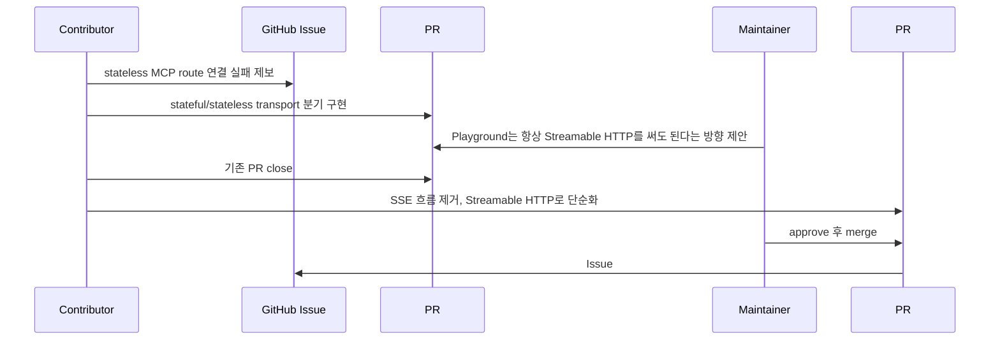

이번 글에서는 [agentgateway](https://github.com/agentgateway/agentgateway)를 사용하다가 발견한 Playground 버그를 GitHub Issue로 등록하고, Pull Request를 올리고, 리뷰 피드백을 반영해 최종적으로 머지되기까지의 과정을 정리합니다.

관련 기록은 아래 3개입니다.

- Issue: [Playground does not support stateless MCP routes #1434](https://github.com/agentgateway/agentgateway/issues/1434)
- 첫 번째 PR: [FIX #1434: support stateless MCP routes in playground #1435](https://github.com/agentgateway/agentgateway/pull/1435)
- 최종 PR: [fix(ui): support stateless MCP routes in playground #1595](https://github.com/agentgateway/agentgateway/pull/1595)


## 전체 흐름

먼저 이번 기여의 흐름을 시간순으로 정리하면 다음과 같습니다.



정리하면 첫 번째 PR은 "기존 동작을 유지하면서 stateless만 추가 지원하자"는 접근이었고, 최종 PR은 "Playground의 MCP 연결은 Streamable HTTP로 통일하자"는 접근이었습니다.

이 차이가 이번 기여에서 가장 중요한 지점이었습니다.

## 문제 상황

agentgateway는 MCP 서버를 연결하고 테스트할 수 있는 Playground UI를 제공합니다. 이 Playground에서 MCP route를 선택하고 연결하면, UI가 MCP 클라이언트처럼 동작하면서 서버의 tool 목록을 조회합니다.

문제는 MCP backend가 `statefulMode: stateless`로 설정되어 있을 때 발생했습니다.

> 여기서 stateless는 서버가 클라이언트별 연결 상태나 세션을 오래 유지하지 않고, 각 요청을 가능한 독립적으로 처리하는 방식을 의미합니다. MCP 맥락에서는 기존 SSE처럼 연결을 열어두고 세션을 이어가는 방식보다, Streamable HTTP endpoint로 필요한 요청을 주고받는 흐름에 더 가깝다고 이해하면 됩니다.

당시 Playground는 MCP route를 항상 기존 SSE transport 기준으로 처리했습니다. 그래서 stateless route를 선택해도 `/mcp`가 아니라 `/sse`로 연결을 시도했습니다.

간단히 표현하면 기대 동작과 실제 동작은 아래와 같았습니다.

| 구분 | 기대 동작 | 실제 동작 |
| --- | --- | --- |
| stateless MCP route | `/mcp` endpoint로 연결 | `/sse` endpoint로 연결 |
| MCP transport | Streamable HTTP | SSE |
| 결과 | Playground에서 tool 조회 가능 | 연결 실패 |

재현 설정의 핵심은 MCP backend가 stateless mode라는 점입니다.

```yaml
routes:
  - backends:
      - mcp:
          statefulMode: stateless
          targets:
            - name: example-mcp
              mcp:
                host: http://localhost:8082/mcp
```

이 설정에서 Playground가 `/sse`로 연결하면 upstream MCP 서버 입장에서는 기대하지 않은 경로와 방식으로 요청이 들어옵니다.

실제로 로그에서도 `/sse`로 요청이 들어간 뒤 `405 Method Not Allowed`가 발생하는 흐름을 확인할 수 있었습니다.

```text
POST /sse?sessionId=... -> 405 Method Not Allowed
```

즉, 버그의 본질은 "Playground가 선택된 MCP route의 transport 특성을 반영하지 못한다"는 것이었습니다.

조금 더 코드 관점에서 보면 문제는 다음 두 가지였습니다.

1. MCP 연결 코드가 `SSEClientTransport`를 사용하도록 고정되어 있었습니다.
2. endpoint를 만들 때 선택된 route의 실제 MCP endpoint를 보지 않고 Playground route endpoint 뒤에 `/sse`를 붙이는 방식이었습니다.

> 즉 stateless MCP route를 선택해도 UI 내부에서는 아래와 같은 흐름으로 연결을 시도했습니다.

```text
selected route endpoint
  -> append /sse
  -> create SSE transport
  -> connect MCP client
```

하지만 stateless MCP route에서 필요한 흐름은 아래에 더 가깝습니다.

```text
selected route endpoint
  -> resolve /mcp endpoint
  -> create Streamable HTTP transport
  -> connect MCP client
```

경로와 transport가 동시에 맞아야 하므로, 단순히 `/sse`를 `/mcp`로 바꾸는 정도로는 부족했습니다. 클라이언트 transport 자체도 SSE에서 Streamable HTTP로 바뀌어야 했습니다.

## 이슈를 어떻게 작성했는가

버그를 발견한 뒤 바로 코드를 고치기보다 먼저 [Issue #1434](https://github.com/agentgateway/agentgateway/issues/1434)를 작성했습니다.

이슈를 작성할때 maintainer에게 최대한 내 실행환경에 대해 자세한 설명을 제공하였습니다. 문제가 발생한 조건, 기대한 동작, 실제 동작, 근거 로그를 최대한 한 번에 판단할 수 있게 정리해서 이슈를 작성하였습니다.

저는 그래서 화면 캡처, 로그, 설정 등의 자세한 정보를 제공하는 이슈를작성하였습니다.

이슈에는 아래 내용을 포함했습니다.

- Summary: 현재상황 요약. (Playground가 MCP route를 항상 legacy SSE transport를 사용한다.)
- Reproduction: `statefulMode: stateless` MCP backend 설정 예시를 제공한다.
- Expected behavior: stateless route에서는 `/mcp`와 Streamable HTTP transport를 사용해야 한다.
- Actual behavior: 여전히 `/sse`로 연결해 실패한다.
- Logs: 실제 요청 경로와 `405 Method Not Allowed` 로그를 첨부한다.
- Root cause: Playground가 MCP backend의 session mode에 따라 transport를 바꾸지 않는다.
- Proposed fix: route의 MCP backend 설정을 보고 적절한 endpoint와 transport를 선택한다.

## 첫 번째 PR: 기존 SSE 흐름을 보존하면서 stateless만 추가 지원

이슈를 올린 뒤 바로 [PR #1435](https://github.com/agentgateway/agentgateway/pull/1435)를 만들었습니다.

첫 번째 접근은 보수적이었습니다.

> **"기존 stateful route는 그대로 SSE를 쓰고, stateless route일 때만 Streamable HTTP를 쓰자"는 방식이었습니다.**

주요 변경 방향은 다음과 같았습니다.

- 선택된 route의 backend type이 MCP인지 확인한다.
- MCP backend의 `statefulMode`를 읽는다.
- `statefulMode: stateless`이면 `/mcp` endpoint를 계산한다.
- stateless route는 `StreamableHTTPClientTransport`를 사용한다.
- stateful route는 기존처럼 `SSEClientTransport`를 사용한다.
- 연결 패널에 실제 연결 endpoint와 session mode를 보여준다.
- 에러 메시지도 항상 `/sse`를 가정하지 않고 실제 endpoint를 기준으로 보여준다.

이 접근은 "기존 동작을 깨지 않으면서 새 케이스를 추가한다"는 점에서는 자연스러웠습니다. 기존 코드가 이미 SSE transport를 전제로 작성되어 있었기 때문에, 저는 stateful route는 그대로 두고 stateless route만 예외적으로 처리하는 방식이 가장 안전하다고 생각했습니다.

하지만 리뷰에서는 제가 예상하지 못한 방향의 제안이 나왔습니다.

> maintainer는 이제 agentgateway 자체가 MCP route에서 Streamable HTTP를 지원할 수 있으므로, Playground UI에서 굳이 SSE 흐름을 유지할 필요가 없다는 의견을 주었습니다.


처음에는 "오픈소스 프로젝트라면 하위 호환성을 최대한 지키는 방향이 더 낫지 않을까?"라고 생각했습니다. 그래서 기존 SSE 흐름을 보존하는 쪽으로 접근했지만, maintainer가 보고 있던 방향은 조금 달랐습니다.

이 프로젝트에서는 Playground가 과거 transport 흐름을 계속 안고 가는 것보다, agentgateway가 앞으로 지원하려는 Streamable HTTP 중심 흐름에 맞춰 UI를 단순화하는 편이 더 적절했습니다.

이 피드백을 통해 오픈소스에서의 호환성은 단순히 "기존 동작을 얼마나 유지하느냐"만의 문제가 아니라, 프로젝트가 앞으로 어떤 방향으로 정리되어야 하는지와 함께 판단된다는 점을 배웠습니다. 직접 maintainer의 판단 기준을 들을 수 있었다는 점에서 좋은 경험이었습니다.

## 피드백 반영: PR을 고치는 대신 새 PR로 정리

리뷰를 받은 뒤 선택지는 두 가지였습니다.

1. 기존 PR에서 코드를 크게 수정한다.
2. 기존 PR을 닫고, 새 방향에 맞는 PR을 다시 만든다.

이번에는 두 번째 방식을 선택했습니다.

첫 번째 PR은 "stateful과 stateless를 분기한다"는 전제 위에서 작성되어 있었습니다. 그런데 리뷰 후 결정된 방향은 "Playground MCP 연결을 Streamable HTTP로 통일한다"였습니다.

전제가 바뀌었기 때문에 기존 PR 위에서 계속 고치기보다, PR을 닫고 변경 의도가 더 분명한 새 PR을 만드는 편이 낫다고 판단했습니다.

그래서 PR #1435는 머지하지 않고 close했습니다.

이 과정에서 배운 점은, 닫힌 PR이 꼭 실패한 PR은 아니라는 것입니다.

첫 번째 PR은 문제를 설명하고 해결 방향을 토론하게 만든 역할을 했습니다. 오픈소스에서는 코드 변경 자체만큼이나 "이 프로젝트에서는 어떤 방향이 맞는가"를 maintainer와 맞춰가는 과정이 중요합니다.

## 최종 PR: Playground MCP 연결을 Streamable HTTP로 통일

이후 [PR #1595](https://github.com/agentgateway/agentgateway/pull/1595)를 새로 만들었습니다.

최종 PR의 핵심은 단순합니다.

Playground에서 MCP 연결을 만들 때 더 이상 `SSEClientTransport`를 사용하지 않고, `StreamableHTTPClientTransport`를 사용하도록 바꾸는 것입니다.

변경 파일은 하나였습니다.

- `ui/src/app/playground/page.tsx`

변경량도 크지 않았습니다.

- 42 lines added
- 24 lines removed
- 1 file changed

하지만 의미는 꽤 분명했습니다. PR의 실제 diff를 보면 핵심은 아래 세 부분입니다.


### 1. SSE transport import 제거

기존 코드는 MCP 연결을 위해 SSE 전용 transport를 import하고 있었습니다.

```text
@modelcontextprotocol/sdk/client/sse.js
```

이 import 자체가 Playground의 MCP 연결이 SSE 기반이라는 전제를 코드에 박아두는 역할을 했습니다.

최종 PR에서는 이를 Streamable HTTP transport import로 바꿨습니다.

```text
@modelcontextprotocol/sdk/client/streamableHttp.js
```

이 변경은 단순한 import 교체처럼 보이지만, 실제로는 Playground가 MCP route를 바라보는 기본 전제를 바꾼 것입니다.

- 기존 전제: MCP 연결은 `/sse` endpoint와 SSE transport를 사용한다.
- 변경 후 전제: MCP 연결은 Streamable HTTP endpoint를 사용한다.

### 2. MCP 연결 endpoint 계산 함수 추가

기존에는 MCP route를 선택했을 때 route endpoint를 그대로 표시하거나, 연결 시점에 `/sse`를 붙였습니다.

이 방식의 문제는 endpoint 형태가 여러 가지일 수 있다는 점입니다.

- 이미 `/mcp`로 끝나는 endpoint일 수 있다.
- 예전 흐름 때문에 `/sse`로 끝나는 endpoint가 들어올 수 있다.
- route match에 exact path가 있을 수 있다.
- 기본 route라면 `/mcp`를 붙여야 할 수 있다.

그래서 최종 PR에서는 MCP 연결 endpoint를 한 곳에서 계산하도록 분리했습니다.

로직을 의사 코드로 표현하면 다음과 같습니다.

```text
if endpoint ends with /sse:
    replace /sse with /mcp
else:
    keep endpoint

if endpoint already ends with /mcp:
    use it

if route has explicit exact path:
    respect it

otherwise:
    append /mcp
```

여기서 중요한 점은 "항상 `/mcp`를 붙인다"가 아니라는 것입니다.

예를 들어 이미 `https://example.com/mcp`인 endpoint에 다시 `/mcp`를 붙이면 `https://example.com/mcp/mcp`가 됩니다. 반대로 exact path로 route가 잡혀 있다면 UI가 임의로 path를 덧붙이는 것이 오히려 잘못된 연결을 만들 수 있습니다.

따라서 endpoint 계산은 작은 유틸 함수처럼 보이지만, 실제로는 route 설정과 UI 연결 사이의 계약을 맞추는 코드였습니다.

### 3. 연결 생성 코드 변경

가장 핵심적인 변경은 연결 생성 부분입니다.

기존 흐름은 다음과 같았습니다.

```text
endpoint + /sse
  -> SSE transport 생성
  -> MCP client connect
```

최종 흐름은 다음과 같습니다.

```text
resolved MCP endpoint
  -> Streamable HTTP transport 생성
  -> MCP client connect
```

개념적으로는 아래와 같은 코드가 되었습니다.

```tsx
const transport = new StreamableHTTPClientTransport(new URL(connectionEndpoint), {
  requestInit: {
    headers,
    credentials: "omit",
    mode: "cors",
  },
});
```

여기서 `connectionEndpoint`는 앞에서 계산한 실제 MCP endpoint입니다.

따라서 Playground는 더 이상 선택된 route에 무조건 `/sse`를 붙이지 않습니다. 대신 MCP backend로 연결할 때 사용할 endpoint를 먼저 계산하고, 그 endpoint를 Streamable HTTP transport에 넘깁니다.

### 4. 표시 endpoint와 에러 메시지도 함께 수정

연결 코드만 바꾸고 UI 표시나 에러 메시지를 그대로 두면 디버깅 경험이 나빠집니다.

기존 에러 메시지는 연결 실패 시 `/sse`를 기준으로 안내할 수 있었습니다. 하지만 실제 연결이 `/mcp`로 바뀌었다면 에러 메시지도 사용자가 확인해야 할 endpoint를 정확히 보여줘야 합니다.

그래서 최종 PR에서는 connection panel의 selected endpoint와 연결 실패 메시지 모두 `connectionEndpoint` 기준으로 바꿨습니다.

수정 전후를 요약하면 다음과 같습니다.

| 영역 | 수정 전 | 수정 후 |
| --- | --- | --- |
| import | SSE client transport | Streamable HTTP client transport |
| MCP URL 계산 | route endpoint 뒤에 `/sse` 추가 | 실제 MCP endpoint를 계산 |
| 연결 transport | SSE | Streamable HTTP |
| UI 표시 endpoint | route endpoint 중심 | 계산된 MCP connection endpoint |
| 에러 메시지 | `/sse` 기준 안내 가능 | 실제 connection endpoint 기준 안내 |

## 테스트

PR 본문에는 아래 테스트를 남겼습니다.

```bash
cd ui
npm run build
```

그리고 수동으로 다음을 확인했습니다.

- Playground MCP connection이 Streamable HTTP를 사용한다.
- 연결 패널에 `/mcp` endpoint가 표시된다.
- transport 표시가 `STREAMABLE HTTP`로 나타난다.

오픈소스 PR에서 테스트 내용을 남기는 것은 생각보다 중요합니다.

단순히 "테스트했습니다"라고 쓰는 것보다 어떤 명령을 실행했고, 어떤 동작을 수동으로 확인했는지 적어두면 리뷰어가 변경 범위를 훨씬 빠르게 이해할 수 있습니다.

## 문제 조건 정리

이번 버그의 조건을 다시 정리하면 다음과 같습니다.

- agentgateway Playground UI에서 MCP route를 선택한다.
- 선택한 route의 backend가 MCP이다.
- MCP backend가 stateless mode로 동작한다.
- stateless MCP endpoint는 Streamable HTTP 방식의 `/mcp` 연결을 기대한다.
- 기존 Playground는 MCP 연결을 SSE 방식의 `/sse`로 가정한다.
- 이 불일치 때문에 Playground에서 MCP server에 연결하지 못한다.

## 주의사항

> - transport를 바꿀 때는 endpoint path만 바꾸면 끝나는 것이 아니라 클라이언트 transport 구현체도 함께 바꿔야 합니다.
> - `/sse`를 `/mcp`로 바꾸는 로직은 쉬워 보이지만, 이미 `/mcp`인 경우나 exact path가 있는 경우를 같이 고려해야 합니다.
> - 기존 동작을 보존하는 접근이 항상 좋은 것은 아닙니다. 프로젝트가 이미 새 표준 방향으로 이동했다면 오래된 분기를 유지하는 것이 오히려 복잡도를 키울 수 있습니다.
> - PR이 닫혔다고 해서 기여가 실패한 것은 아닙니다. 리뷰를 통해 문제 정의와 해결 방향이 더 좋아졌다면 그 PR도 충분히 의미가 있습니다.

## 대안 비교

이번 문제를 해결하는 방법은 몇 가지가 있었습니다.

| 대안 | 설명 | 장점 | 단점 |
| --- | --- | --- | --- |
| stateful/stateless 분기 | stateful은 SSE, stateless는 Streamable HTTP 사용 | 기존 SSE 흐름을 보존할 수 있다 | UI 코드에 transport 분기가 계속 남는다 |
| Streamable HTTP로 통일 | Playground MCP 연결을 항상 Streamable HTTP로 처리 | 코드가 단순해지고 프로젝트 방향과 맞는다 | agentgateway가 모든 케이스에서 Streamable HTTP를 지원한다는 전제가 필요하다 |
| UI에서 transport 선택 옵션 제공 | 사용자가 SSE와 Streamable HTTP 중 선택 | 디버깅과 실험에는 유연하다 | 일반 사용자에게 불필요한 선택지를 노출하고 유지보수 부담이 커진다 |

최종적으로는 두 번째 대안이 선택되었습니다.

이유는 agentgateway가 Streamable HTTP를 지원할 수 있는 상태였고, Playground UI가 예전 SSE 전제를 계속 유지할 필요가 줄어들었기 때문입니다.

## 머지와 이슈 종료

PR #1595는 maintainer의 approve를 받은 뒤 squash merge되었습니다.

이후 `Fixes #1434`에 의해 Issue #1434도 함께 close되었습니다.

흐름을 날짜 기준으로 정리하면 다음과 같습니다.

| 날짜 | 작업 |
| --- | --- |
| 2026-04-02 | Issue #1434 생성 |
| 2026-04-02 | PR #1435 생성 |
| 2026-04-07 | maintainer가 Streamable HTTP 통일 방향 제안 |
| 2026-04-14 | PR #1435 close |
| 2026-04-19 | PR #1595 생성 |
| 2026-04-20 | PR #1595 approve 및 merge |
| 2026-04-20 | Issue #1434 close |

작은 버그처럼 보였지만, 이슈 작성, 재현 조건 정리, 첫 번째 해결안, 리뷰 피드백, 후속 PR, 머지까지 경험할 수 있었습니다.

## 배운 점

이번 기여에서 가장 크게 배운 점은 세 가지입니다.

첫째, 좋은 이슈는 해결의 절반입니다.

재현 가능한 설정, 기대 동작, 실제 동작, 로그가 있으면 maintainer가 문제를 빠르게 이해할 수 있습니다. 특히 오픈소스에서는 내가 겪은 문제를 다른 사람이 재현할 수 있게 만드는 것이 중요합니다.

둘째, 첫 번째 해결책이 최종 해결책일 필요는 없습니다.

처음에는 기존 SSE 흐름을 유지하는 것이 안전하다고 생각했습니다. 하지만 리뷰를 통해 프로젝트가 이미 Streamable HTTP 중심으로 갈 수 있다는 것을 알게 되었습니다. 덕분에 코드는 더 단순해졌고 방향도 명확해졌습니다.

셋째, PR을 닫는 것도 기여 과정의 일부입니다.

PR #1435는 머지되지 않았지만, 문제를 드러내고 방향을 논의하게 만든 계기가 되었습니다. 그 결과 PR #1595가 더 작은 변경으로 더 명확한 해결책을 담을 수 있었습니다.

오픈소스 기여는 코드를 던져놓고 끝나는 과정이 아니라, 프로젝트의 맥락 안에서 문제를 같이 정의하고 해결 방향을 맞춰가는 과정에 더 가깝습니다.

이번 경험은 그 점을 꽤 선명하게 보여준 사례였습니다.

## 참고

- [agentgateway/agentgateway](https://github.com/agentgateway/agentgateway)
- [Issue #1434: Playground does not support stateless MCP routes](https://github.com/agentgateway/agentgateway/issues/1434)
- [PR #1435: FIX #1434: support stateless MCP routes in playground](https://github.com/agentgateway/agentgateway/pull/1435)
- [PR #1595: fix(ui): support stateless MCP routes in playground](https://github.com/agentgateway/agentgateway/pull/1595)
