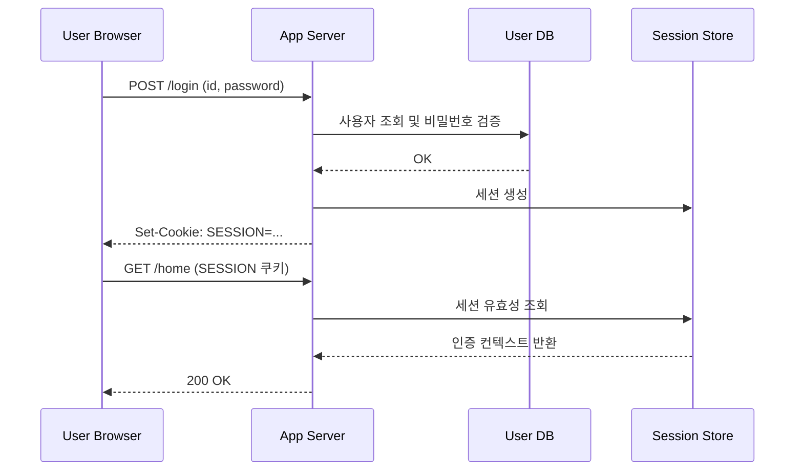
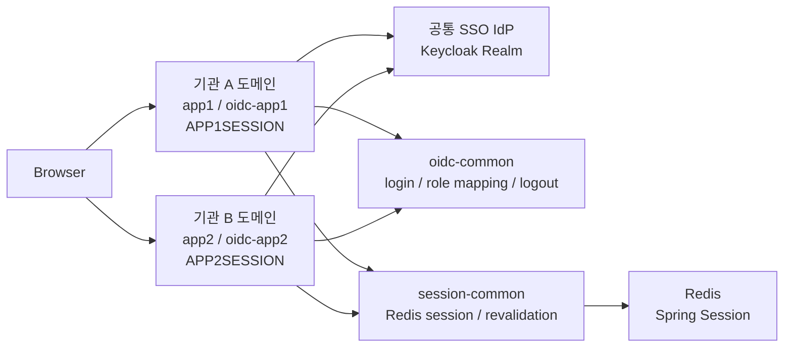
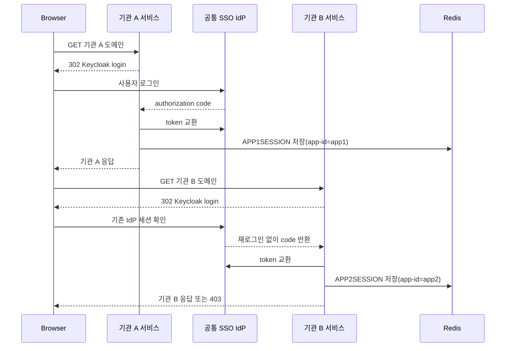
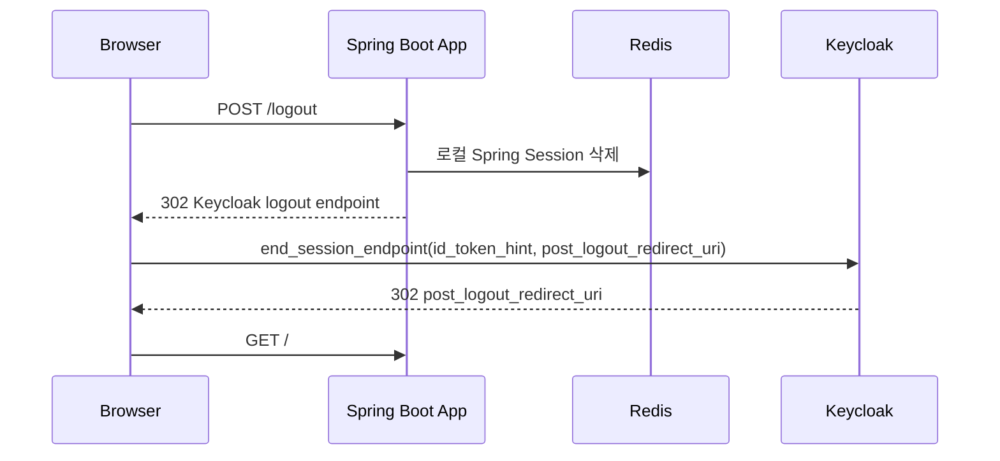

## 이번 작업에서 먼저 정리한 내용

이번 작업은 여러 기관 도메인이 하나의 로그인 체계를 공유하되, 각 서비스의 세션과 권한 경계는 분리하는 구조를 샘플로 정리하는 것에서 시작했습니다. 실제로 구현해 보니 핵심은 "SSO를 하느냐"보다 "어디까지를 공통으로 보고 어디부터를 서비스별로 나누느냐"를 먼저 정하는 일이었습니다.

이번 글에서는 그중 가장 먼저 정리했던 공통 IdP, 기관별 OIDC client, 기관별 세션 쿠키 분리 모델을 기록합니다. Gateway HMAC이나 Backend 내부 호출 검증은 같은 흐름 안에 있지만 관심사가 달라서, 이 단계에서는 제외하고 다음 글로 분리했습니다.

> 시리즈 안내
>
> - `1편`: 지금 보고 있는 글입니다.
> - `2편`: [기관별 도메인 SSO 작업 기록 2: Gateway HMAC과 Backend 세션 검증]()
> - `3편`: [기관별 도메인 SSO 작업 기록 3: 공통 Realm과 서비스별 Realm 비교]()
>
> 1편에서는 공통 IdP, 기관별 OIDC client, 기관별 세션 쿠키와 권한 경계를 먼저 정리합니다.
{:.prompt-tip}

> 이번에 정리한 샘플 코드는 아래 저장소를 기준으로 설명합니다.
>
> - 단일 앱: [oidc-simple-example](https://github.com/ydj515/sample-repository-example/tree/main/oidc-simple-example)
> - 기관별 도메인 SSO 기본형: [oidc-multi-app-example](https://github.com/ydj515/sample-repository-example/tree/main/oidc-multi-app-example)
> - 후속 글: [기관별 도메인 SSO 작업 기록 2: Gateway HMAC과 Backend 세션 검증]()
> - 보충 글: [기관별 도메인 SSO 작업 기록 3: 공통 Realm과 서비스별 Realm 비교]()
{:.prompt-info}

---

## 1. 문제 조건 정리

이번 글에서 다루는 조건은 다음과 같습니다.

- OIDC Provider는 Keycloak을 사용한다.
- 애플리케이션은 Spring Boot 3.5.11, Kotlin, Spring Security OAuth2 Login을 사용한다.
- 로그인 이후에는 Spring Session Redis 기반 서버 세션을 사용한다.
- 단일 앱 예제에서는 `SESSION` 쿠키를 사용한다.
- 기관별 도메인 SSO 예제에서는 `APP1SESSION`, `APP2SESSION`처럼 기관별 서비스 쿠키를 분리한다.
- `app1`, `app2`는 로컬 데모용 기술 모듈명이고, 개념적으로는 각각 `기관 A 민원 포털`, `기관 B 행정 포털`을 의미한다.
- 기관 A와 기관 B는 같은 Keycloak realm을 신뢰하지만 서로 다른 OIDC client를 사용한다.
- SSO는 기관 A 세션을 기관 B가 공유하는 방식이 아니라, 브라우저의 공통 IdP 세션을 재사용해 기관 B용 OIDC 로그인을 이어가는 방식이다.
- 기본 SSO 예제는 `app1`, `app2`, `oidc-common`, `session-common` 4모듈로 구성한다.
- 관리자 강제 로그아웃은 Redis에 저장된 Spring Session을 삭제하는 방식으로 처리한다.

목표는 명확합니다.

- 사용자는 OIDC Provider를 통해 표준 방식으로 로그인한다.
- 기관 서비스는 각자 자기 세션 쿠키와 접근 role을 유지한다.
- 기관 도메인 간 이동 시에는 비밀번호를 다시 묻지 않는 SSO 경험을 제공한다.
- 관리자는 특정 사용자의 세션을 즉시 무효화할 수 있다.
- 여러 기관 도메인으로 확장해도 인증/인가 로직이 복붙으로 흩어지지 않는다.

복잡도 관점에서 보면, 요청 1건의 세션 조회와 재검증은 Redis 조회 또는 로컬 캐시 조회 중심이므로 평균적으로 `O(1)`입니다. 다만 전체 세션 저장소의 공간은 사용자 수를 `U`, 사용자당 평균 동시 세션 수를 `S`라고 할 때 `O(U * S)`로 증가합니다.

---

## 2. 기존 로컬 세션 구조에서 먼저 확인한 한계

전통적인 세션 기반 로그인은 이해하기 쉽고 강력합니다.



단일 애플리케이션에서는 이 방식이 매우 자연스럽습니다. 로그아웃도 서버 세션을 삭제하면 끝납니다.

문제는 기관 서비스가 늘어나는 순간부터입니다.

- 서비스마다 로그인 화면과 세션 정책이 달라진다.
- 사용자는 기관 도메인을 이동할 때마다 다시 로그인해야 할 수 있다.
- 특정 기관의 권한만 위임하거나 회수하는 모델을 만들기 어렵다.
- 관리자 강제 로그아웃을 여러 기관 도메인에 일관되게 반영하기 어렵다.
- 보안 로직이 각 서비스에 복붙되면서 미묘하게 달라진다.

즉, 로컬 세션은 "하나의 앱" 안에서는 단순하지만, 여러 기관 서비스가 같은 신원 체계를 공유해야 하는 순간 운영 비용이 커집니다.

---

## 3. 공통 IdP 세션과 앱 세션을 분리해서 정리했다

기관별 도메인 SSO에서 가장 먼저 분리해서 봐야 하는 것은 `기관 서비스 세션`과 `공통 IdP 세션`입니다.

- 기관 서비스 세션은 `APP1SESSION`, `APP2SESSION`처럼 각 서비스가 직접 만드는 세션입니다.
- 공통 IdP 세션은 Keycloak이 로그인 이후 브라우저에 유지하는 Provider 세션입니다.
- SSO는 기관 A 세션을 기관 B가 그대로 재사용하는 구조가 아니라, 공통 IdP 세션을 기반으로 기관 B용 OIDC 로그인을 다시 수행하되 비밀번호 입력만 생략되는 구조입니다.

운영 도메인 관점으로 바꾸면 아래처럼 읽을 수 있습니다.

| 로컬 데모               | 실제 운영 개념                   |
| ----------------------- | -------------------------------- |
| `http://localhost:8081` | `https://agency-a.example.go.kr` |
| `http://localhost:8082` | `https://agency-b.example.go.kr` |
| `http://localhost:9000` | `https://sso.example.go.kr`      |
| `oidc-app1`             | 기관 A용 OIDC client             |
| `oidc-app2`             | 기관 B용 OIDC client             |
| `APP1SESSION`           | 기관 A 서비스 세션               |
| `APP2SESSION`           | 기관 B 서비스 세션               |

이렇게 보면 SSO의 핵심은 "세션 통합"이 아니라 "신원 확인의 공통화"입니다. 인증은 공통 IdP가 맡고, 각 기관 서비스는 그 결과를 자기 세션과 자기 권한 모델에 맞게 다시 저장하고 해석합니다.

공통 realm 자체를 택할지, 기관별로 realm을 나눌지를 고민하는 경우라면 이 지점에서 [기관별 도메인 SSO 작업 기록 3: 공통 Realm과 서비스별 Realm 비교]()를 함께 보는 편이 좋습니다. 1편은 공통 realm 기반 예시를 전제로 흐름을 설명합니다.

---

## 4. 기본 4모듈 SSO: 기관 A, 기관 B, 공통 IdP

기관별 도메인 SSO를 정리할 때 가장 먼저 만든 샘플은 `oidc-multi-app-example`입니다. 이 저장소는 Gateway 없이 SSO 흐름 자체를 확인하려고 만든 4모듈 기본형입니다.

기본 SSO 예제는 4개의 모듈로 나누었습니다.

| 모듈             | 개념상 역할         | 주요 책임                                            |
| ---------------- | ------------------- | ---------------------------------------------------- |
| `app1`           | 기관 A 민원 포털    | 기관 A 화면/API, 기관 A OIDC client 설정             |
| `app2`           | 기관 B 행정 포털    | 기관 B 화면/API, 기관 B OIDC client 설정             |
| `oidc-common`    | 공통 OIDC 보안 모듈 | OAuth2 Login, role 매핑, logout, 기관 접근 권한 계산 |
| `session-common` | 공통 세션 모듈      | Redis 세션, 재검증, 기관별 세션 태깅, 강제 로그아웃  |

전체 흐름은 다음과 같습니다.



기본형에서는 일부러 Gateway를 제외했습니다. SSO를 설명할 때는 "같은 IdP 세션을 기반으로 각 기관이 자기 client와 자기 cookie를 만든다"는 점이 핵심이고, Gateway HMAC까지 함께 나오면 초점이 흐려지기 쉽기 때문입니다.

기본형의 책임은 이렇게 나눴습니다.

- `oidc-common`은 "사용자가 누구이고 어떤 role을 가졌는가"를 다룹니다.
- `session-common`은 "이 기관 서비스에서 만든 세션이 아직 유효한가"를 다룹니다.
- 기관 서비스는 각자의 client, cookie, access role만 설정하고 공통 로직을 재사용합니다.

운영 모델도 이 구조에 맞춰 비교적 단순하게 가져갈 수 있습니다.

- 중앙 IAM 팀은 공통 Keycloak realm, 공통 로그인 정책, 공통 mapper와 client 표준을 관리합니다.
- 각 기관 서비스 운영자는 자기 애플리케이션의 redirect URI, 접근 role, 세션 강제 만료 같은 앱 운영만 담당합니다.
- 즉 공통 realm 기반 기본형은 "신원 체계는 중앙에서 관리하고, 기관 서비스는 자기 인가와 세션만 운영한다"는 분업이 자연스럽습니다.

즉, 4모듈 기본형만으로도 기관별 도메인 SSO에서 가장 중요한 질문들에 답할 수 있습니다.

- 왜 기관 A에서 로그인한 뒤 기관 B로 넘어갈 때 비밀번호를 다시 묻지 않는가?
- 왜 그래도 기관 A 세션 쿠키와 기관 B 세션 쿠키는 분리되어야 하는가?
- 왜 SSO가 되었더라도 기관 B role이 없으면 `403`이 나오는가?
- 왜 관리자 강제 로그아웃은 각 기관 세션 저장소 기준으로 처리하는 편이 단순한가?

---

## 5. 앱별 client와 세션 쿠키 분리

기관 A와 기관 B는 같은 Keycloak realm을 신뢰하지만 서로 다른 client와 세션 쿠키를 사용합니다.

```yaml
# 기관 A 서비스(app1)
server:
  port: 8081
  servlet:
    session:
      cookie:
        name: APP1SESSION

app:
  session:
    app-id: app1
  security:
    logout-cookie-name: APP1SESSION
    access:
      user-roles:
        - app1-user
      admin-roles:
        - app1-admin
      master-admin-role: master-admin
```

```yaml
# 기관 B 서비스(app2)
server:
  port: 8082
  servlet:
    session:
      cookie:
        name: APP2SESSION

app:
  session:
    app-id: app2
  security:
    logout-cookie-name: APP2SESSION
    access:
      user-roles:
        - app2-user
      admin-roles:
        - app2-admin
      master-admin-role: master-admin
```

이 분리가 있어야 각 기관이 자기 서비스 경계와 권한 모델을 유지할 수 있습니다. 사용자는 "하나의 SSO"를 경험하지만, 실제 서비스 내부에서는 기관 A와 기관 B가 각자 별도 세션을 만들고, 각자 자기 role 기준으로 접근을 판단합니다.

---

## 6. 로그인 흐름: 재로그인 없는 교차 접근은 어떻게 가능한가

다기관 SSO 로그인 흐름은 아래처럼 이해할 수 있습니다.



여기서 "SSO"는 `APP1SESSION` 하나를 기관 B가 그대로 재사용한다는 뜻이 아닙니다. 브라우저가 Keycloak의 IdP 세션을 이미 가지고 있으므로, 기관 B에 접근할 때 다시 비밀번호를 입력하지 않고 기관 B용 OIDC 로그인을 완료한다는 뜻입니다.

즉, 사용자 경험은 "한 번 로그인했더니 다른 기관으로 넘어가도 자연스럽다"이지만, 내부 구조는 "기관별로 다시 OIDC callback을 받고, 기관별로 자기 세션을 만든다"입니다. 이 차이를 이해해야 인가와 로그아웃, 감사 로그 설계가 꼬이지 않습니다.

---

## 7. 기관별 권한과 세션 범위

다기관 예제에서는 사용자 종류를 나누어 SSO와 인가의 차이를 확인할 수 있습니다.

| 사용자         | 기관 A 접근   | 기관 B 접근   | 의미                                    |
| -------------- | ------------- | ------------- | --------------------------------------- |
| `app1-user`    | 가능          | 거부          | 기관 A 전용 사용자                      |
| `app2-user`    | 거부          | 가능          | 기관 B 전용 사용자                      |
| `multi-user`   | 가능          | 가능          | 두 기관 도메인을 오가는 대표 SSO 사용자 |
| `app1-admin`   | 기관 A 관리자 | 기관 B 거부   | 기관 A 범위 관리자                      |
| `app2-admin`   | 기관 A 거부   | 기관 B 관리자 | 기관 B 범위 관리자                      |
| `master-admin` | 가능          | 가능          | 전체 기관 관리자                        |

권한 판단은 `OidcSecurityProperties`에서 기관별 접근 role과 관리자 role을 계산합니다. role 이름은 샘플 구현 편의를 위해 `app1-user`, `app2-user`처럼 유지했지만, 글의 개념상으로는 각각 `기관 A 사용자`, `기관 B 사용자`라고 보면 됩니다.

```kotlin
@ConfigurationProperties(prefix = "app.security")
data class OidcSecurityProperties(
    val endSessionUri: String,
    val logoutCookieName: String = "SESSION",
    val access: AccessProperties = AccessProperties(),
) {
    fun accessAuthorities(): Array<String> {
        return (access.userRoles + access.adminRoles + access.masterAdminRole)
            .mapToAuthorities()
    }

    fun adminAuthorities(): Array<String> {
        return (access.adminRoles + access.masterAdminRole)
            .mapToAuthorities()
    }

    fun isMasterAdmin(authorities: Collection<GrantedAuthority>): Boolean {
        return authorities.any { it.authority == "ROLE_${access.masterAdminRole}" }
    }
}
```

공통 보안 설정에서는 현재 기관 서비스에 접근 가능한 role만 통과시킵니다.

```kotlin
http.authorizeHttpRequests { authorize ->
    authorize
        .requestMatchers("/", "/public", "/error", "/actuator/health").permitAll()
        .requestMatchers(HttpMethod.POST, "/api/admin/**")
        .hasAnyAuthority(*oidcSecurityProperties.adminAuthorities())
        .requestMatchers("/api/**")
        .hasAnyAuthority(*oidcSecurityProperties.accessAuthorities())
        .anyRequest()
        .hasAnyAuthority(*oidcSecurityProperties.accessAuthorities())
}
```

그래서 `app1-user`가 기관 B 도메인으로 이동하면 재로그인 없이 인증은 이어지지만, 기관 B가 요구하는 role이 없기 때문에 인가 단계에서 `403`이 발생합니다. SSO와 인가를 분리해서 설계해야 하는 이유가 바로 여기에 있습니다.

---

## 8. 세션 태깅과 관리자 강제 로그아웃

또 하나 중요한 구현은 세션 태깅입니다. `session-common`은 인증된 요청의 세션에 `app-id`를 기록합니다. 이름은 `app-id`지만, 이 예제에서는 기관 서비스 식별자 역할을 합니다.

```kotlin
class SessionAppTaggingFilter(
    private val sessionPolicyProperties: SessionPolicyProperties,
) : OncePerRequestFilter() {

    override fun doFilterInternal(
        request: HttpServletRequest,
        response: HttpServletResponse,
        filterChain: FilterChain,
    ) {
        val authentication = SecurityContextHolder.getContext().authentication
        val session = request.getSession(false)

        if (session != null &&
            authentication != null &&
            authentication.isAuthenticated &&
            authentication !is AnonymousAuthenticationToken &&
            session.getAttribute(SessionAttributeNames.APP_ID) != sessionPolicyProperties.appId
        ) {
            session.setAttribute(SessionAttributeNames.APP_ID, sessionPolicyProperties.appId)
        }

        filterChain.doFilter(request, response)
    }
}
```

이 태그 덕분에 관리자 강제 로그아웃 범위를 다르게 가져갈 수 있습니다.

```kotlin
@PostMapping("/admin/users/{username}/logout-all")
@ApiSecurityTier(ApiSecurityLevel.P0_CRITICAL)
fun logoutAllSessions(
    @PathVariable username: String,
    authentication: Authentication,
): LogoutResultResponse {
    val masterAdmin = oidcSecurityProperties.isMasterAdmin(authentication.authorities)
    val invalidated = sessionLookupService.invalidateUserSessions(
        principalName = username,
        appId = if (masterAdmin) null else sessionPolicyProperties.appId,
    )
    return LogoutResultResponse(
        app = app1ViewProperties.appName,
        username = username,
        scope = if (masterAdmin) "all-agencies" else sessionPolicyProperties.appId,
        invalidatedSessions = invalidated,
    )
}
```

```kotlin
fun invalidateUserSessions(
    principalName: String,
    appId: String?,
): Int {
    val sessions = sessionRepository.findByPrincipalName(principalName)
        .filterValues { session -> sessionBelongsToApp(session, appId) }

    sessions.keys.forEach { sessionId ->
        sessionRepository.deleteById(sessionId)
        cache.remove(sessionId)
    }
    return sessions.size
}
```

`master-admin`은 `appId = null`로 전체 기관 세션을 지우고, 기관별 관리자는 자기 기관 서비스의 세션만 지웁니다. 이 방식의 장점은 운영자가 이해하기 쉽다는 것입니다. "이 사용자의 서버 세션을 지운다"는 동작이므로, 다음 요청에서 인증이 바로 실패합니다.

---

## 9. OIDC 로그아웃: 로컬 세션과 Provider 세션을 함께 본다

OIDC를 쓰면 로그아웃도 두 층으로 나뉩니다.

- 애플리케이션 로컬 세션 삭제
- OIDC Provider의 로그인 세션 종료

샘플에서는 Spring Security logout 성공 시 Keycloak의 `end_session_endpoint`로 리다이렉트합니다.



핵심 구현은 다음과 같습니다.

```kotlin
class KeycloakLogoutSuccessHandler(
    private val endSessionUri: URI,
) : LogoutSuccessHandler {

    override fun onLogoutSuccess(
        request: HttpServletRequest,
        response: HttpServletResponse,
        authentication: Authentication?,
    ) {
        response.sendRedirect(buildTargetUrl(request, authentication))
    }

    private fun buildTargetUrl(
        request: HttpServletRequest,
        authentication: Authentication?,
    ): String {
        val baseUrl = UriComponentsBuilder
            .newInstance()
            .scheme(request.scheme)
            .host(request.serverName)
            .apply {
                if (request.serverPort != 80 && request.serverPort != 443) {
                    port(request.serverPort)
                }
            }
            .path("/")
            .build()
            .toUriString()

        val builder = UriComponentsBuilder
            .fromUri(endSessionUri)
            .queryParam("post_logout_redirect_uri", baseUrl)

        val idToken = (authentication as? OAuth2AuthenticationToken)
            ?.principal
            ?.let { it as? OidcUser }
            ?.idToken
            ?.tokenValue

        if (!idToken.isNullOrBlank()) {
            builder.queryParam("id_token_hint", idToken)
        }

        return builder.build(true).toUriString()
    }
}
```

> `post_logout_redirect_uri`는 반드시 Keycloak client 설정에 허용된 URI만 사용해야 합니다. 또한 RP-Initiated Logout에서 `post_logout_redirect_uri`를 보낼 때는 `id_token_hint`나 `client_id`처럼 요청한 client를 확인할 수 있는 값도 함께 보내는 편이 안전합니다. 그렇지 않으면 로그아웃 후 리다이렉트가 거부되거나 확인 화면이 추가로 나타날 수 있습니다.
{:.prompt-warning}

---

## 10. 언제 Gateway HMAC 확장형으로 넘어가나

이 4모듈 기본형만으로도 기관별 도메인 SSO의 핵심은 충분히 설명할 수 있습니다. 다만 아래 조건이 생기면 `oidc-multi-app-hmac-gateway-example` 같은 6모듈 확장형으로 넘어가는 편이 맞습니다.

- 기관별 도메인 앞단에 공통 API Gateway를 두고 싶다.
- Backend가 "이 요청이 Gateway가 만든 유효한 HMAC 값을 갖고 있는가"까지 검증해야 한다.
- 외부에서 Backend로 직접 들어오는 경로나 내부 헤더 위조 가능성까지 방어하고 싶다.

이 경우에는 `gateway`, `internal-auth-common`을 추가해서 Gateway가 내부 HMAC 헤더를 만들고 Backend가 다시 검증하는 구조가 필요합니다. 자세한 내용은 후속 글 [기관별 도메인 SSO 작업 기록 2: Gateway HMAC과 Backend 세션 검증]()에서 이어집니다.

---

## 11. 주의사항

> - 기관별 도메인 SSO는 기관 A 세션 하나를 기관 B가 공유하는 구조가 아닙니다.
> - SSO가 되더라도 기관별 role이 없으면 반대편 기관 서비스에서는 `403`이 나와야 정상입니다.
> - 기관 서비스별 세션 쿠키를 하나로 합치면 권한 경계와 감사 로그 경계가 흐려질 수 있습니다.
> - 관리자 강제 로그아웃은 토큰 블랙리스트보다 중앙 세션 삭제가 더 직관적인 경우가 많습니다.
> - `post_logout_redirect_uri`는 Provider에 사전 등록된 URI만 허용하고, 가능하면 `id_token_hint`나 `client_id`와 함께 전달해야 합니다.
> - 로그에는 ID Token, Access Token, 세션 ID 원문을 남기지 않는 것이 좋습니다.

---

## 12. 대안 비교

| 대안                              | 장점                                                       | 단점                                                               |
| --------------------------------- | ---------------------------------------------------------- | ------------------------------------------------------------------ |
| 기관별 독립 로그인                | 각 기관이 빠르게 자율 구축할 수 있다                       | 로그인 경험이 파편화되고 권한/세션 정책이 중복된다                 |
| 기관 간 세션 직접 공유            | 겉보기에는 단순해 보일 수 있다                             | 쿠키 범위, 권한 경계, 감사 로그 경계가 흐려지고 운영 리스크가 크다 |
| OIDC + 기관별 세션 분리           | 공통 IdP 기반 SSO와 기관별 권한 경계를 함께 가져갈 수 있다 | Redis 운영과 세션 재검증 정책을 같이 설계해야 한다                 |
| OIDC + 기관별 세션 + Gateway HMAC | 내부 API 신뢰 경계까지 강화할 수 있다                      | 구조가 더 복잡해지고 Gateway/Backend 규약 관리가 필요하다          |

이번 글의 기본 선택은 세 번째 대안인 `OIDC + 기관별 세션 분리`입니다. SSO는 공통 IdP가 맡고, 기관별 권한/세션 통제는 각 서비스가 유지하는 방식이 기관 서비스 운영 모델과 가장 잘 맞기 때문입니다.

---

## 정리

기관별 도메인 SSO를 구현할 때 가장 중요한 것은 "한 번 로그인했더니 여러 기관을 오갈 수 있다"는 사용자 경험 뒤에 어떤 경계를 남겨둘 것인가입니다.

- 신원 확인은 공통 IdP로 통합한다.
- 기관 서비스는 각자 다른 OIDC client와 세션 쿠키를 유지한다.
- 인가는 기관별 role로 다시 판단한다.
- 강제 로그아웃은 중앙 세션 저장소를 기준으로 통제한다.

이렇게 설계하면 사용자는 자연스러운 SSO를 경험하고, 운영자는 기관별 권한 경계와 세션 통제 지점을 잃지 않을 수 있습니다. 그리고 그 다음 단계에서 내부 API 보호까지 필요해지면, 그때 Gateway HMAC과 Backend 검증을 붙이면 됩니다.

> 시리즈 안내
>
> - `1편`: 지금 보고 있는 글입니다.
> - `2편`: [기관별 도메인 SSO 작업 기록 2: Gateway HMAC과 Backend 세션 검증]()
> - `3편`: [기관별 도메인 SSO 작업 기록 3: 공통 Realm과 서비스별 Realm 비교]()
>
> 다음 글에서는 Gateway가 내부 HMAC 헤더를 붙이고, Backend가 그 요청을 어떻게 다시 검증하는지 이어서 설명합니다.
{:.prompt-tip}

## 출처

- [Keycloak OIDC 구조](https://www.keycloak.org/securing-apps/oidc-layers)
- [OpenID Connect Core 1.0](https://openid.net/specs/openid-connect-core-1_0-final.html)
- [OpenID Connect RP-Initiated Logout 1.0](https://openid.net/specs/openid-connect-rpinitiated-1_0.html)
- [Keycloak Server Administration Guide](https://www.keycloak.org/docs/latest/server_admin/)
- [기관별 도메인 SSO 작업 기록 3: 공통 Realm과 서비스별 Realm 비교]()
- [oidc-simple-example](https://github.com/ydj515/sample-repository-example/tree/main/oidc-simple-example)
- [oidc-multi-app-example](https://github.com/ydj515/sample-repository-example/tree/main/oidc-multi-app-example)
- [oidc-multi-app-hmac-gateway-example](https://github.com/ydj515/sample-repository-example/tree/main/oidc-multi-app-hmac-gateway-example)
