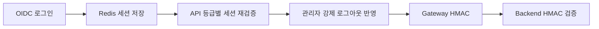
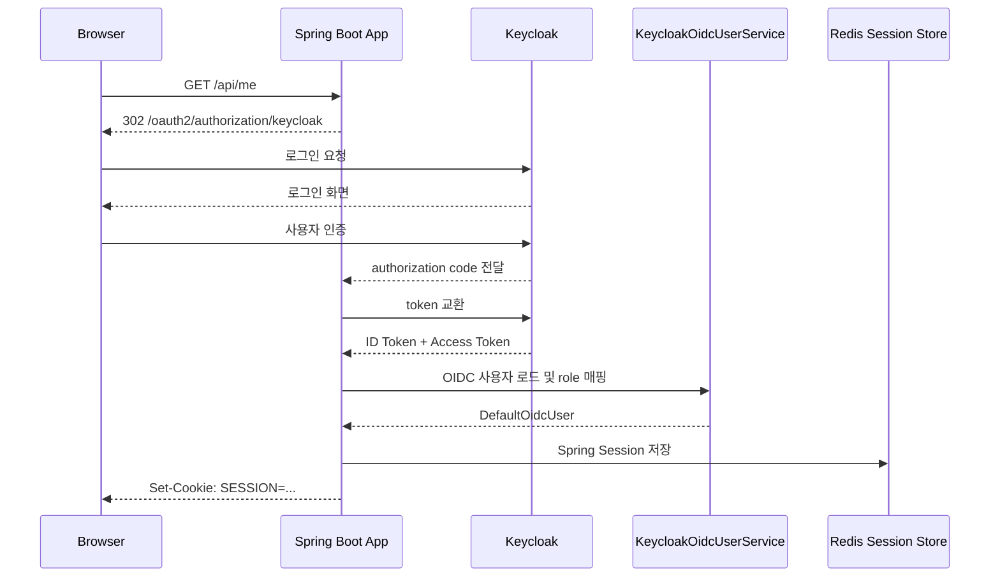
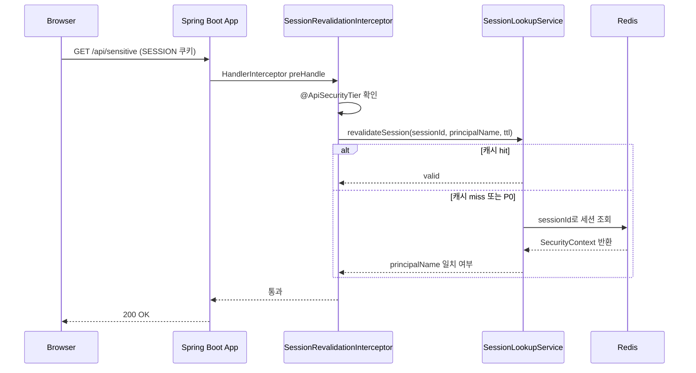
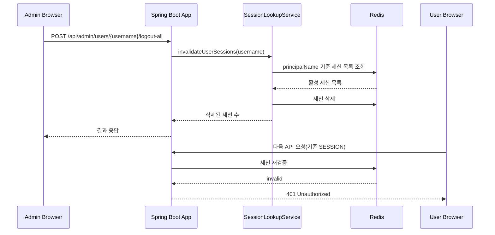
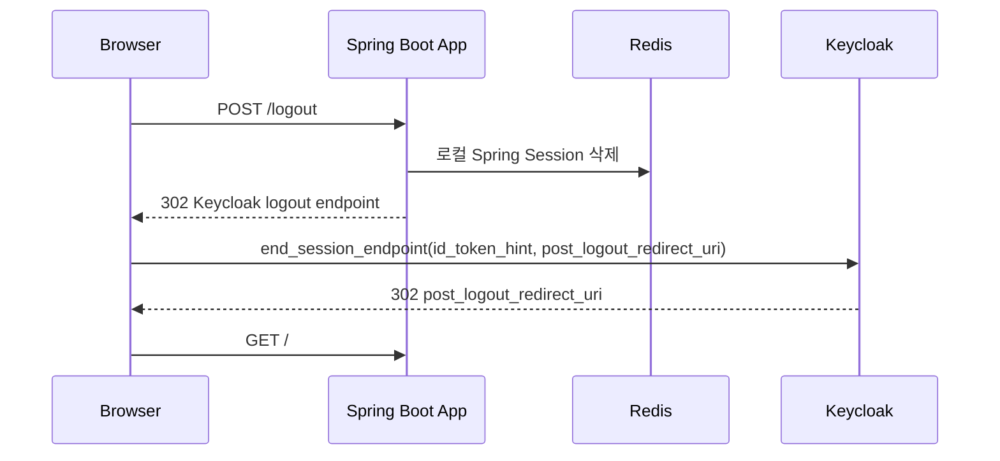
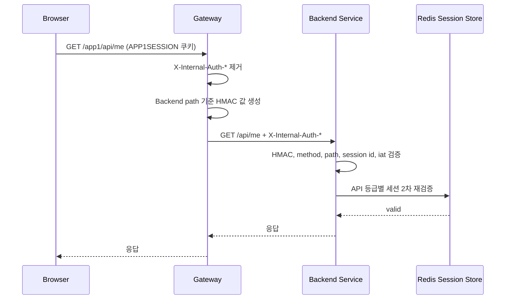

## 이번 단계에서 정리한 작업

이 글은 [기관별 도메인 SSO 작업 기록 1: 공통 IdP와 앱별 세션 분리]()에서 정리한 기본 구조를 확장한 기록입니다. 1편에서 공통 IdP와 앱별 세션 모델을 먼저 만든 뒤, 다음으로 손본 부분은 로그인 이후 요청을 어디까지 신뢰할 것인지였습니다.

브라우저 로그인 자체는 OIDC로 해결되지만, Gateway와 Backend를 나누기 시작하면 세션 검증과 내부 호출 신뢰 경계를 별도로 설계해야 했습니다. 이번 글은 그 과정에서 추가한 Gateway HMAC, Backend 재검증, 강제 로그아웃 연계 방식을 정리합니다.

> 시리즈 안내
>
> - `1편`: [기관별 도메인 SSO 작업 기록 1: 공통 IdP와 앱별 세션 분리]()
> - `2편`: 지금 보고 있는 글입니다.
> - `3편`: [기관별 도메인 SSO 작업 기록 3: 공통 Realm과 서비스별 Realm 비교]()
>
> 먼저 1편에서 공통 IdP와 기관별 세션 모델을 이해한 뒤, 이 글에서 Gateway HMAC과 Backend 재검증으로 확장하면 흐름이 가장 자연스럽습니다.
{:.prompt-tip}

특히 Gateway와 Backend가 분리되고, 관리자가 특정 사용자 세션을 즉시 끊어야 하며, 내부 직접 호출 경로까지 방어해야 하는 요구가 들어오면 OIDC 로그인만으로는 설계가 끝나지 않았습니다.

샘플을 확장하면서 실제로 정리했던 질문은 아래와 같았습니다.

- 로그인 이후 API 요청의 신뢰를 어디서, 어떻게 보장할 것인가?
- 관리자 강제 로그아웃은 Redis 세션 삭제와 API 재검증에 어떻게 연결되는가?
- Gateway와 Backend를 분리한다면 각 계층의 책임은 어디까지인가?
- Gateway를 우회한 직접 호출과 내부 헤더 위조를 Backend에서 어떻게 막을 것인가?
- 매 요청 세션 재검증이 만드는 비용을 어느 수준까지 감당할 것인가?

이 글은 OIDC 로그인 설정 방법보다, **OIDC 로그인 이후 요청을 계속 신뢰할 수 있게 만들기 위해 어떤 구성을 추가했는지**를 기록하는 데 초점을 둡니다.

> 이번 단계에서 정리한 샘플 코드는 아래 저장소를 기준으로 설명합니다.
>
> - 이전 글: [기관별 도메인 SSO 작업 기록 1: 공통 IdP와 앱별 세션 분리]()
> - 단일 앱: [oidc-simple-example](https://github.com/ydj515/sample-repository-example/tree/main/oidc-simple-example)
> - Gateway HMAC 확장형: [oidc-multi-app-hmac-gateway-example](https://github.com/ydj515/sample-repository-example/tree/main/oidc-multi-app-hmac-gateway-example)
> - realm 토폴로지 비교: [기관별 도메인 SSO 작업 기록 3: 공통 Realm과 서비스별 Realm 비교]()
{:.prompt-info}

---

## 1. 문제 조건 정리

이번 글에서 다루는 조건은 다음과 같습니다.

- OIDC Provider는 Keycloak을 사용한다.
- 애플리케이션은 Spring Boot 3.5.11, Kotlin, Spring Security OAuth2 Login을 사용한다.
- 로그인 이후에는 Spring Session Redis 기반 서버 세션을 사용한다.
- API별 중요도에 따라 Redis 세션 재검증 강도를 다르게 적용한다.
- 단일 앱 예제에서는 `SESSION` 쿠키를 사용한다.
- 기관별 도메인 SSO 기본형은 이전 글의 `oidc-multi-app-example` 4모듈을 전제로 한다.
- Gateway HMAC 확장 예제에서는 `app1`, `app2`, `oidc-common`, `session-common` 위에 `gateway`, `internal-auth-common`을 추가하고, `/app1/**`, `/app2/**` API 요청에 HMAC 헤더를 붙인다.
- 확장형 Backend는 `GatewaySignatureValidationFilter`에서 Gateway가 붙인 HMAC을 검증한다.
- 관리자 강제 로그아웃은 Redis에 저장된 Spring Session을 삭제하는 방식으로 처리한다.

목표는 명확합니다.

- 사용자는 OIDC Provider를 통해 표준 방식으로 로그인한다.
- 애플리케이션은 로그인 이후 요청을 자체 세션으로 통제한다.
- 관리자는 특정 사용자의 세션을 즉시 무효화할 수 있다.
- Gateway/Backend 분리 구조로 확장할 때도 내부 API 신뢰 경계를 설명할 수 있다.

복잡도 관점에서 보면, 요청 1건의 세션 재검증은 Redis 조회 또는 로컬 캐시 조회 중심이므로 평균적으로 `O(1)`입니다. 다만 전체 세션 저장소의 공간은 사용자 수를 `U`, 사용자당 평균 동시 세션 수를 `S`라고 할 때 `O(U * S)`로 증가합니다.

---

## 2. 1편에서 가져오는 전제와 이번 글의 추가 범위

1편에서 이미 정리한 결론은 다음과 같습니다.

- 여러 기관 서비스는 공통 Keycloak realm을 신뢰한다.
- 기관 서비스마다 OIDC client와 세션 쿠키는 분리한다.
- SSO는 기관 A의 `APP1SESSION`을 기관 B가 공유하는 방식이 아니라, 브라우저의 공통 IdP 세션을 기반으로 기관 B용 OIDC 로그인을 이어가는 방식이다.
- 인증은 공통 IdP가 맡고, 인가는 기관별 role과 애플리케이션 세션 기준으로 다시 판단한다.

이 글은 그 다음 질문을 다룹니다. 로그인 직후에는 사용자가 정상이어도, 운영 중에는 세션 삭제, 권한 회수, Gateway 우회, 내부 헤더 위조 같은 사건이 생길 수 있습니다. 그래서 2편의 흐름은 `단일 앱 세션 재검증 -> 관리자 강제 로그아웃 -> Gateway HMAC -> Backend 검증` 순서로 이어집니다.



즉 2편의 핵심은 로그인 화면을 다시 만드는 것이 아니라, 로그인 이후 요청을 운영 중에도 계속 신뢰할 수 있게 만드는 통제 지점을 추가하는 것입니다.

---

## 3. OAuth 2.0과 OIDC를 분리해서 봐야 한다

OAuth 2.0과 OIDC를 같은 것으로 생각하면 인증 설계가 흐려집니다.

> OAuth 2.0은 접근 권한을 위임하기 위한 **인가(Authorization)** 프레임워크이고, OIDC는 OAuth 2.0 위에 사용자 신원을 표현하는 **인증(Authentication)** 계층을 얹은 표준입니다.
{:.prompt-warning}

간단히 나누면 다음과 같습니다.

- OAuth 2.0 Access Token은 리소스 접근 권한을 표현한다.
- OIDC ID Token은 로그인한 사용자의 신원을 표현한다.
- OIDC는 ID Token을 통해 `iss`, `sub`, `aud`, `exp`, `nonce` 같은 표준 claim과 검증 규칙을 제공한다.

비유하면 OAuth 2.0 Access Token은 "특정 방에 들어갈 수 있는 카드키"에 가깝습니다. 반면 OIDC ID Token은 "이 사람이 누구인지 확인할 수 있는 신분증"에 가깝습니다.

로그인 시스템을 만들 때는 둘을 섞어 쓰지 않는 것이 중요합니다. Access Token은 보호된 리소스 접근을 위한 credential이고, OAuth 2.0 자체는 Access Token의 내부 형식이나 사용자 신원 claim을 표준화하지 않습니다. 따라서 Access Token만 보고 사용자의 로그인을 추론하는 구현은 Provider별 claim 차이에 쉽게 묶이고, 인증과 인가의 경계도 흐려집니다.

---

## 4. 단일 앱 구현: OIDC 로그인 + Redis 세션

먼저 단일 앱 샘플의 전체 흐름입니다.



샘플의 핵심 의존성은 다음과 같습니다.

```kotlin
dependencies {
    implementation("org.springframework.boot:spring-boot-starter-oauth2-client")
    implementation("org.springframework.boot:spring-boot-starter-security")
    implementation("org.springframework.boot:spring-boot-starter-data-redis")
    implementation("org.springframework.session:spring-session-data-redis")
}
```

Spring Security 설정은 `oauth2Login`을 활성화하고, OIDC 사용자 로딩을 커스터마이징합니다.

```kotlin
@Configuration
@EnableMethodSecurity
class SecurityConfig(
    private val appSecurityProperties: AppSecurityProperties,
    private val keycloakOidcUserService: KeycloakOidcUserService,
) {

    @Bean
    fun securityFilterChain(
        http: HttpSecurity,
        keycloakLogoutSuccessHandler: KeycloakLogoutSuccessHandler,
    ): SecurityFilterChain {
        http
            .authorizeHttpRequests { authorize ->
                authorize
                    .requestMatchers("/", "/public", "/error", "/actuator/health").permitAll()
                    .requestMatchers(HttpMethod.POST, "/api/admin/**").hasRole("admin")
                    .requestMatchers("/api/**").authenticated()
                    .anyRequest().authenticated()
            }
            .oauth2Login { oauth2 ->
                oauth2.userInfoEndpoint { userInfo ->
                    userInfo.oidcUserService(keycloakOidcUserService::loadUser)
                }
            }
            .logout { logout ->
                logout
                    .logoutSuccessHandler(keycloakLogoutSuccessHandler)
                    .invalidateHttpSession(true)
                    .deleteCookies("SESSION")
            }
            .csrf { csrf ->
                csrf.ignoringRequestMatchers("/api/admin/**")
            }
            .oauth2Client(Customizer.withDefaults())

        return http.build()
    }
}
```

Keycloak의 role은 `realm_access.roles`, `resource_access.{clientId}.roles` 아래에 들어올 수 있습니다. 샘플에서는 OIDC 사용자 로딩 시점에 이 값을 Spring Security `ROLE_*` 권한으로 변환합니다.

```kotlin
@Service
class KeycloakOidcUserService {

    private val delegate = OidcUserService()

    fun loadUser(userRequest: OidcUserRequest): OidcUser {
        val user = delegate.loadUser(userRequest)
        val mappedAuthorities = buildSet {
            addAll(user.authorities)
            addAll(extractRealmAuthorities(user))
            addAll(extractClientAuthorities(user, userRequest))
        }
        val nameAttributeKey = if (user.claims.containsKey("preferred_username")) {
            "preferred_username"
        } else {
            "sub"
        }

        return if (user.userInfo != null) {
            DefaultOidcUser(mappedAuthorities, user.idToken, user.userInfo, nameAttributeKey)
        } else {
            DefaultOidcUser(mappedAuthorities, user.idToken, nameAttributeKey)
        }
    }
}
```

Redis 세션은 Spring Session의 indexed repository를 사용합니다. 이 구성이 있어야 `principalName`으로 사용자의 세션 목록을 찾고 강제 로그아웃을 구현하기 쉽습니다.

```kotlin
@Configuration
@ConditionalOnProperty(
    name = ["app.session.redis-enabled"],
    havingValue = "true",
    matchIfMissing = true,
)
@EnableRedisIndexedHttpSession(
    redisNamespace = "oidc-simple-example:session",
)
class SessionConfig
```

설정은 아래처럼 구성했습니다.

```yaml
spring:
  security:
    oauth2:
      client:
        registration:
          keycloak:
            client-id: ${OIDC_CLIENT_ID:oidc-simple-example}
            client-secret: ${OIDC_CLIENT_SECRET:oidc-simple-example-secret}
            authorization-grant-type: authorization_code
            redirect-uri: "{baseUrl}/login/oauth2/code/{registrationId}"
            scope:
              - openid
              - profile
              - email
  session:
    store-type: redis
    redis:
      namespace: oidc-simple-example:session
      repository-type: indexed

server:
  servlet:
    session:
      cookie:
        name: SESSION
        http-only: true
        same-site: lax
      timeout: 30m
```

Docker Compose 환경에서는 브라우저가 `localhost:9000`으로 Keycloak에 접근하고, 애플리케이션 컨테이너는 `keycloak:8080`으로 token/userinfo/jwks endpoint를 호출합니다. 이 차이 때문에 `KC_HOSTNAME`과 `KC_HOSTNAME_BACKCHANNEL_DYNAMIC` 설정이 중요합니다.

```yaml
keycloak:
  image: quay.io/keycloak/keycloak:26.0
  command:
    - start-dev
    - --import-realm
    - --http-port=8080
  environment:
    KEYCLOAK_ADMIN: admin
    KEYCLOAK_ADMIN_PASSWORD: admin
    KC_HOSTNAME: http://localhost:9000
    KC_HOSTNAME_BACKCHANNEL_DYNAMIC: "true"
  ports:
    - "9000:8080"
```

---

## 5. 로그인 이후: API별 세션 재검증

OIDC 로그인에 성공했다고 해서 이후 모든 요청을 무조건 신뢰하면 안 됩니다. 특히 관리자가 사용자를 강제 로그아웃했거나, Redis에서 세션이 삭제되었거나, 기관 간 권한이 바뀐 경우 다음 요청부터 바로 반영되어야 합니다.

단일 앱 샘플은 Spring MVC `HandlerInterceptor`에서 `/api/**` 요청의 세션을 재검증합니다.



API 중요도는 annotation으로 표시합니다.

```kotlin
@Target(AnnotationTarget.CLASS, AnnotationTarget.FUNCTION)
@Retention(AnnotationRetention.RUNTIME)
annotation class ApiSecurityTier(
    val value: ApiSecurityLevel,
)

enum class ApiSecurityLevel {
    P0_CRITICAL,
    P1_SENSITIVE,
    P2_STANDARD,
}
```

컨트롤러에서는 아래처럼 민감도별로 등급을 다르게 지정합니다.

```kotlin
@RestController
@RequestMapping("/api")
class OidcApiController(
    private val sessionLookupService: SessionLookupService,
) {

    @GetMapping("/me")
    @ApiSecurityTier(ApiSecurityLevel.P2_STANDARD)
    fun me(@AuthenticationPrincipal user: OidcUser): UserInfoResponse {
        return UserInfoResponse(
            username = user.preferredUsername ?: user.subject,
            subject = user.subject,
            email = user.email,
            roles = user.authorities.map { it.authority }.sorted(),
        )
    }

    @GetMapping("/sensitive")
    @ApiSecurityTier(ApiSecurityLevel.P1_SENSITIVE)
    fun sensitive(@AuthenticationPrincipal user: OidcUser): SensitiveResponse {
        return SensitiveResponse(
            message = "민감 API 예시입니다.",
            principal = user.preferredUsername ?: user.subject,
        )
    }

    @PostMapping("/admin/users/{username}/logout-all")
    @PreAuthorize("hasRole('admin')")
    @ApiSecurityTier(ApiSecurityLevel.P0_CRITICAL)
    fun logoutAllSessions(@PathVariable username: String): LogoutResultResponse {
        val invalidated = sessionLookupService.invalidateUserSessions(username)
        return LogoutResultResponse(username, invalidated)
    }
}
```

재검증 인터셉터는 등급별 TTL을 다르게 잡습니다. `P0_CRITICAL`은 `Duration.ZERO`라서 사실상 매 요청 Redis를 확인합니다.

```kotlin
class SessionRevalidationInterceptor(
    private val appSecurityProperties: AppSecurityProperties,
    private val sessionLookupService: SessionLookupService,
    private val tierResolver: ApiSecurityTierResolver,
) : HandlerInterceptor {

    override fun preHandle(
        request: HttpServletRequest,
        response: HttpServletResponse,
        handler: Any,
    ): Boolean {
        val authentication = SecurityContextHolder.getContext().authentication ?: return true
        if (!authentication.isAuthenticated) {
            return true
        }

        val sessionId = request.getSession(false)?.id
        if (sessionId.isNullOrBlank()) {
            response.sendError(HttpServletResponse.SC_UNAUTHORIZED, "세션이 존재하지 않습니다.")
            return false
        }

        val ttl = when (tierResolver.resolve(handler)) {
            ApiSecurityLevel.P0_CRITICAL -> Duration.ZERO
            ApiSecurityLevel.P1_SENSITIVE -> appSecurityProperties.revalidation.sensitiveTtl
            ApiSecurityLevel.P2_STANDARD -> appSecurityProperties.revalidation.standardTtl
        }

        val valid = sessionLookupService.revalidateSession(
            sessionId = sessionId,
            principalName = authentication.name,
            cacheTtl = ttl,
        )

        if (!valid) {
            response.sendError(HttpServletResponse.SC_UNAUTHORIZED, "세션이 더 이상 유효하지 않습니다.")
            return false
        }

        return true
    }
}
```

실제 세션 조회는 Spring Session의 `FindByIndexNameSessionRepository`를 사용합니다.

```kotlin
class SessionLookupService(
    private val sessionRepository: FindByIndexNameSessionRepository<out Session>,
) {

    private val cache = ConcurrentHashMap<String, CachedValidation>()

    fun revalidateSession(
        sessionId: String,
        principalName: String,
        cacheTtl: Duration,
    ): Boolean {
        val now = Instant.now()
        val cached = cache[sessionId]
        if (cached != null &&
            cached.principalName == principalName &&
            cached.validUntil.isAfter(now)
        ) {
            return cached.valid
        }

        val valid = lookupSession(sessionId, principalName)
        cache[sessionId] = CachedValidation(
            principalName = principalName,
            valid = valid,
            validUntil = now.plus(cacheTtl),
        )
        return valid
    }

    private fun lookupSession(
        sessionId: String,
        principalName: String,
    ): Boolean {
        val session = sessionRepository.findById(sessionId) ?: return false
        val securityContext = session.getAttribute<SecurityContext>(
            HttpSessionSecurityContextRepository.SPRING_SECURITY_CONTEXT_KEY,
        ) ?: return false

        return securityContext.authentication?.name == principalName
    }
}
```

여기서 중요한 점은 "세션이 존재한다"만 보는 것이 아니라, 세션 안의 `SecurityContext.authentication.name`이 현재 요청의 principal과 일치하는지까지 확인한다는 점입니다.

---

## 6. 관리자 강제 로그아웃

관리자 강제 로그아웃은 토큰 블랙리스트보다 중앙 세션 삭제가 훨씬 직관적입니다.



구현은 단순합니다.

```kotlin
fun invalidateUserSessions(principalName: String): Int {
    val sessions = sessionRepository.findByPrincipalName(principalName)
    sessions.keys.forEach { sessionId ->
        sessionRepository.deleteById(sessionId)
        cache.remove(sessionId)
    }
    return sessions.size
}
```

이 방식의 장점은 운영자가 이해하기 쉽다는 것입니다. "이 사용자의 서버 세션을 지운다"는 동작이므로, 다음 요청에서 인증이 실패합니다.

---

## 7. OIDC 로그아웃: 로컬 세션과 Provider 세션을 함께 본다

OIDC를 쓰면 로그아웃도 두 층으로 나뉩니다.

- 애플리케이션 로컬 세션 삭제
- OIDC Provider의 로그인 세션 종료

샘플에서는 Spring Security logout 성공 시 Keycloak의 `end_session_endpoint`로 리다이렉트합니다.



핵심 구현은 다음과 같습니다.

```kotlin
class KeycloakLogoutSuccessHandler(
    private val endSessionUri: URI,
) : LogoutSuccessHandler {

    override fun onLogoutSuccess(
        request: HttpServletRequest,
        response: HttpServletResponse,
        authentication: Authentication?,
    ) {
        response.sendRedirect(buildTargetUrl(request, authentication))
    }

    private fun buildTargetUrl(
        request: HttpServletRequest,
        authentication: Authentication?,
    ): String {
        val baseUrl = UriComponentsBuilder
            .newInstance()
            .scheme(request.scheme)
            .host(request.serverName)
            .apply {
                if (request.serverPort != 80 && request.serverPort != 443) {
                    port(request.serverPort)
                }
            }
            .path("/")
            .build()
            .toUriString()

        val builder = UriComponentsBuilder
            .fromUri(endSessionUri)
            .queryParam("post_logout_redirect_uri", baseUrl)

        val idToken = (authentication as? OAuth2AuthenticationToken)
            ?.principal
            ?.let { it as? OidcUser }
            ?.idToken
            ?.tokenValue

        if (!idToken.isNullOrBlank()) {
            builder.queryParam("id_token_hint", idToken)
        }

        return builder.build(true).toUriString()
    }
}
```

> `post_logout_redirect_uri`는 반드시 Keycloak client 설정에 허용된 URI만 사용해야 합니다. 또한 Keycloak에서는 `post_logout_redirect_uri`를 사용할 때 `id_token_hint`나 `client_id` 중 하나가 함께 필요합니다. 그렇지 않으면 로그아웃 후 리다이렉트가 거부되거나 확인 화면이 추가로 나타날 수 있습니다.
{:.prompt-warning}

---

## 8. 6모듈 확장: Gateway HMAC 필터와 Backend 검증

Gateway와 Backend가 분리된 구조라면 HMAC 헤더를 두는 편이 더 안전합니다. 이유는 단순합니다. Backend는 "이 요청이 Gateway가 가진 shared secret으로 만들어진 요청인가?"를 독립적으로 확인할 수 있어야 합니다.

다만 이 필터는 OIDC 로그인이나 SSO를 대체하지 않습니다. SSO는 Keycloak IdP 세션과 기관별 OIDC client가 담당하고, Gateway HMAC은 로그인 이후 Backend API 요청이 Gateway와 공유한 규칙으로 계산된 HMAC 값을 갖고 있는지 확인하는 보조 장치입니다.

이 구조는 기본 4모듈 샘플이 아니라 `oidc-multi-app-hmac-gateway-example` 확장 샘플에 구현했습니다. 확장형은 기본 SSO 모듈인 `app1`, `app2`, `oidc-common`, `session-common`에 `gateway`, `internal-auth-common`을 추가한 6모듈 구조입니다. 이 샘플 자체의 README와 UI는 의도적으로 `App1`, `App2` 같은 generic naming을 유지하고, 이 글에서만 그것을 기관 A/B에 대응시켜 설명합니다.

여기서 공통 realm을 쓸지, 서비스별 realm을 쓸지에 대한 선택은 HMAC 구조와는 별개의 설계 문제입니다. 이 글은 공통 realm 기반 예시를 전제로 하고, realm 토폴로지 선택 기준과 SSO 흐름 차이는 [기관별 도메인 SSO 작업 기록 3: 공통 Realm과 서비스별 Realm 비교]()에서 따로 정리했습니다.

### HMAC이란 무엇인가

HMAC은 `Hash-based Message Authentication Code`의 약자입니다. 아주 단순하게 말하면 "Gateway와 Backend만 알고 있는 비밀키로 요청 요약값을 계산해서, 이 요청이 중간에 바뀌지 않았고 정말 우리 편이 만든 요청인지 확인하는 방법"입니다.

중요한 점은 HMAC이 암호화가 아니라는 것입니다. 또한 여기서 말하는 "서명"은 공개키 기반 디지털 서명이 아니라, 공유 secret으로 만든 MAC 값에 가깝습니다. 요청 본문이나 헤더 내용을 숨기는 것이 목적이 아니라, 특정 payload에 대해 같은 secret을 아는 주체만 같은 값을 만들 수 있다는 성질을 이용해 무결성과 secret 보유 여부를 검증합니다.

이 예제에서는 `appId`, `method`, `path`, `sessionId`, `issuedAt`를 한 문자열로 고정한 뒤 HMAC-SHA256 값을 계산합니다. Backend는 같은 규칙으로 다시 계산해 보고, 값이 다르면 "요청 필드가 변조되었거나 shared secret을 모르는 곳에서 온 요청"으로 판단합니다.

| 검증 수단 | 증명하려는 것 | 검증 주체 |
| --- | --- | --- |
| OIDC 로그인 | 사용자가 누구인지, 어떤 role을 가졌는지 | `app1`, `app2` |
| Redis 세션 재검증 | 지금 세션이 아직 살아 있는지 | `session-common` |
| Gateway HMAC | Gateway와 Backend가 공유한 secret으로 계산한 HMAC 값이 유효한지, method/path/session이 중간에 바뀌지 않았는지 | Backend |

### 왜 OIDC만으로는 충분하지 않은가

4모듈 기본형에서는 Browser가 곧바로 각 기관 서비스에 붙기 때문에, OIDC 로그인과 세션 재검증만으로도 설명이 충분합니다. 하지만 운영 구조에서 앞단에 Gateway가 들어오면 질문이 하나 더 생깁니다. "이 요청은 로그인한 사용자의 요청인가?"와 별개로, "이 요청이 Gateway가 가진 shared secret으로 계산한 유효한 HMAC 값을 갖고 있는가?"를 Backend가 알아야 합니다.

예를 들어 내부 네트워크에서 Backend 주소가 노출되어 있거나, 잘못된 프록시 설정으로 직접 접근 경로가 열리거나, 공격자가 `X-Forwarded-*`나 내부용 커스텀 헤더를 흉내 낼 수 있다면 OIDC 세션만으로는 충분하지 않습니다. OIDC는 사용자 인증 문제를 해결해 주지만, Gateway와 Backend 사이의 호출 경계까지 자동으로 보장해 주지는 않기 때문입니다.

그래서 Backend는 "누가 로그인했는가"와 "이 요청이 Gateway가 가진 shared secret으로 계산한 유효한 HMAC 값을 갖고 있는가"를 분리해서 봐야 합니다. 이때 HMAC은 구현 비용이 낮고, method/path/session/시간을 요청 단위로 묶을 수 있어서 Gateway -> Backend 홉을 보호하는 보조 장치로 잘 맞습니다. 다만 HMAC은 네트워크 접근 제어, TLS, secret 관리가 함께 전제될 때 의미가 있습니다.

### 그래서 6모듈 확장형을 따로 둔다

이 글에서 예제를 둘로 나눈 이유도 여기에 있습니다. `oidc-multi-app-example`은 기관별 도메인 SSO 자체를 설명하는 최소 단위이고, `oidc-multi-app-hmac-gateway-example`은 그 위에 운영형 내부 API 보호 계층을 추가한 확장판입니다.

즉, 독자는 먼저 4모듈 예제로 "공통 IdP + 기관별 client + 기관별 세션 쿠키 + role 기반 접근 제어"를 이해하고, 그 다음 6모듈 예제로 "Gateway가 왜 필요한지, Backend가 왜 HMAC을 다시 검증하는지"를 이어서 보면 됩니다. 이 순서로 보면 SSO와 내부 API 보호가 서로 다른 문제라는 점도 자연스럽게 구분됩니다.

| 추가 모듈 | 역할 | 주요 책임 |
| --- | --- | --- |
| `gateway` | 기관 API Gateway | `/app1/**`, `/app2/**` 라우팅, prefix 제거, 내부 HMAC 헤더 생성, 위조 헤더 제거 |
| `internal-auth-common` | 내부 인증 공통 모듈 | Gateway와 Backend가 공유하는 HMAC payload/header/검증 규칙 |

흐름은 다음과 같습니다.



책임을 나누면 다음과 같습니다.

| 계층 | 책임 |
| --- | --- |
| Gateway | 외부 요청 진입점, prefix 제거, 내부 인증 헤더 생성, 위조 헤더 제거 |
| Backend | Gateway HMAC 검증, method/path/session id 검증, API 중요도별 세션 2차 재검증, 도메인 인가 |
| Redis Session Store | 현재 유효한 로그인 상태의 단일 기준 |

이 구조에서 Backend 2차 검증이 필요한 이유는 세 가지입니다.

- Gateway를 우회하는 내부 네트워크 경로가 생길 수 있다.
- 공격자가 `X-Internal-Auth-*` 같은 내부 헤더를 직접 주입할 수 있다.
- Gateway 검증 직후 관리자가 세션을 삭제하는 레이스 컨디션이 생길 수 있다.

단, 이 HMAC은 짧은 시간 창 안에서 요청이 새로 만들어졌는지를 확인할 뿐, 그 자체로 완전한 one-time replay 방어를 제공하지는 않습니다. 내부망에서 패킷 재사용 가능성까지 강하게 줄여야 한다면 TLS/mTLS, 요청 nonce 또는 request id 저장소, secret rotation을 함께 설계해야 합니다.

### 공통 HMAC payload

`internal-auth-common`은 Gateway와 Backend가 같은 문자열로 HMAC 값을 계산하도록 canonical payload를 고정합니다.

```kotlin
data class InternalAuthPayload(
    val appId: String,
    val method: String,
    val path: String,
    val sessionId: String,
    val issuedAtEpochSeconds: Long,
) {
    fun canonicalValue(): String {
        return listOf(
            appId,
            method.uppercase(),
            path,
            sessionId,
            issuedAtEpochSeconds.toString(),
        ).joinToString("\n")
    }
}
```

HMAC 값은 HMAC-SHA256과 URL-safe Base64를 사용합니다.

```kotlin
class InternalAuthSigner(
    secret: String,
) {
    private val signingKey = secret.toByteArray(StandardCharsets.UTF_8)

    fun sign(payload: InternalAuthPayload): String {
        val mac = Mac.getInstance("HmacSHA256")
        mac.init(SecretKeySpec(signingKey, "HmacSHA256"))
        val raw = mac.doFinal(payload.canonicalValue().toByteArray(StandardCharsets.UTF_8))
        return Base64.getUrlEncoder().withoutPadding().encodeToString(raw)
    }

    fun verify(payload: InternalAuthPayload, signature: String): Boolean {
        val expected = sign(payload)
        return MessageDigest.isEqual(
            expected.toByteArray(StandardCharsets.UTF_8),
            signature.toByteArray(StandardCharsets.UTF_8),
        )
    }
}
```

### Gateway: HMAC 헤더 생성

Gateway는 Spring Cloud Gateway WebFlux 기반이고, route 설정에서 `/app1/**`, `/app2/**` prefix를 제거한 뒤 `InternalAuthGatewayFilterFactory`를 적용합니다.

```kotlin
@Bean
fun gatewayRoutes(
    builder: RouteLocatorBuilder,
    gatewayProperties: GatewayProperties,
    internalAuthGatewayFilterFactory: InternalAuthGatewayFilterFactory,
): RouteLocator {
    return builder.routes()
        .route("app1") { route ->
            route
                .path("/app1/**")
                .filters { filters ->
                    filters
                        .stripPrefix(1)
                        .filter(
                            internalAuthGatewayFilterFactory.apply(
                                Config(appId = "app1", sessionCookieName = "APP1SESSION"),
                            ),
                        )
                }
                .uri(gatewayProperties.app1Uri.toString())
        }
        .route("app2") { route ->
            route
                .path("/app2/**")
                .filters { filters ->
                    filters
                        .stripPrefix(1)
                        .filter(
                            internalAuthGatewayFilterFactory.apply(
                                Config(appId = "app2", sessionCookieName = "APP2SESSION"),
                            ),
                        )
                }
                .uri(gatewayProperties.app2Uri.toString())
        }
        .build()
}
```

필터는 기존에 들어온 내부 인증 헤더를 제거하고, Gateway가 계산한 값으로 다시 채웁니다.

```kotlin
class InternalAuthGatewayFilterFactory(
    private val signer: InternalAuthSigner,
) : AbstractGatewayFilterFactory<InternalAuthGatewayFilterFactory.Config>(Config::class.java) {

    override fun apply(config: Config): GatewayFilter {
        return GatewayFilter { exchange, chain ->
            val request = exchange.request
            val sessionId = request.cookies[config.sessionCookieName]
                ?.firstOrNull()
                ?.value
                .orEmpty()
            val issuedAt = Instant.now().epochSecond
            val payload = InternalAuthPayload(
                appId = config.appId,
                method = request.method.name(),
                path = request.uri.rawPath,
                sessionId = sessionId,
                issuedAtEpochSeconds = issuedAt,
            )
            val signature = signer.sign(payload)

            val mutatedRequest = request.mutate()
                .headers { headers ->
                    InternalAuthHeaders.all.forEach(headers::remove)
                    headers.set(InternalAuthHeaders.APP_ID, payload.appId)
                    headers.set(InternalAuthHeaders.METHOD, payload.method)
                    headers.set(InternalAuthHeaders.PATH, payload.path)
                    headers.set(InternalAuthHeaders.SESSION_ID, payload.sessionId)
                    headers.set(InternalAuthHeaders.ISSUED_AT, payload.issuedAtEpochSeconds.toString())
                    headers.set(InternalAuthHeaders.SIGNATURE, signature)
                }
                .build()

            chain.filter(exchange.mutate().request(mutatedRequest).build())
        }
    }
}
```

### Backend: HMAC 검증

Backend의 `session-common`에는 `GatewaySignatureValidationFilter`를 추가했습니다. 이 필터는 다음을 확인합니다.

- `X-Internal-Auth-App`이 현재 기관 서비스의 `app.session.app-id`와 같은가?
- `X-Internal-Auth-Method`가 실제 HTTP method와 같은가?
- `X-Internal-Auth-Path`가 실제 Backend request URI와 같은가?
- `X-Internal-Auth-Session`이 현재 요청의 Spring Session id와 같은가?
- `X-Internal-Auth-Iat`가 허용된 시간 범위 안에 있는가?
- `X-Internal-Auth-Signature`가 같은 secret으로 재계산한 값과 일치하는가?

```kotlin
class GatewaySignatureValidationFilter(
    private val sessionPolicyProperties: SessionPolicyProperties,
) : OncePerRequestFilter() {

    private val signer = InternalAuthSigner(sessionPolicyProperties.internalAuth.secret)

    override fun shouldNotFilter(request: HttpServletRequest): Boolean {
        if (!sessionPolicyProperties.internalAuth.enabled) {
            return true
        }

        val protectedPath = sessionPolicyProperties.internalAuth.protectedPathPatterns
            .any { pattern -> pathMatcher.match(pattern, request.requestURI) }
        if (!protectedPath) {
            return true
        }

        return !sessionPolicyProperties.internalAuth.required && !hasAnyInternalAuthHeader(request)
    }

    override fun doFilterInternal(
        request: HttpServletRequest,
        response: HttpServletResponse,
        filterChain: FilterChain,
    ) {
        val verificationError = verify(request)
        if (verificationError != null) {
            response.sendError(HttpServletResponse.SC_UNAUTHORIZED, verificationError)
            return
        }

        filterChain.doFilter(request, response)
    }
}
```

샘플은 기존 직접 접속 데모를 깨지 않기 위해 기본적으로 `required=false`입니다. 이 상태에서는 HMAC 헤더가 없으면 기존 요청을 통과시키고, HMAC 헤더가 있으면 반드시 검증합니다.

```yaml
app:
  session:
    internal-auth:
      enabled: true
      required: false
      secret: ${APP_SESSION_INTERNAL_AUTH_SECRET:local-dev-internal-auth-secret-change-me}
      max-age: 30s
```

운영처럼 Gateway 경유를 강제하려면 `required=true`로 바꾸면 됩니다.

```bash
APP_SESSION_INTERNAL_AUTH_REQUIRED=true
```

이렇게 하면 `/api/**` 요청은 Gateway HMAC 없이 Backend에 직접 들어올 수 없습니다.

---

## 9. API 등급별 세션 재검증 정책

매 요청마다 Redis를 조회하면 보안은 강해지지만 지연과 비용이 커집니다. 그래서 API 중요도에 따라 재검증 강도를 나누었습니다.

| 등급 | 대상 API 예시 | 세션 재검증 | 캐시 TTL | 실패 시 동작 |
| --- | --- | --- | --- | --- |
| `P0_CRITICAL` | 관리자 강제 로그아웃, 권한 변경, 결제 확정 | 매 요청 강제 재검증 | `0초` | 즉시 `401`, 감사 로그 |
| `P1_SENSITIVE` | 개인정보 조회/수정, 비밀번호 변경 | 매우 짧은 캐시 | `1초` | `401` |
| `P2_STANDARD` | 일반 업무 API, 내 정보 조회 | 짧은 캐시 | `5초` | `401` |

샘플은 `P0`, `P1`, `P2`까지만 구현했습니다. 검색, 통계, 공개성 읽기 API가 많은 서비스라면 `P3_READ_HEAVY`를 추가해 `15~30초` 수준의 캐시를 둘 수도 있습니다. 다만 이때는 강제 로그아웃 반영 지연을 비즈니스 리스크로 수용할 수 있는지 먼저 합의해야 합니다.

현재 샘플 설정은 아래와 같습니다.

```yaml
app:
  session:
    revalidation:
      standard-ttl: 5s
      sensitive-ttl: 1s
```

복잡도는 다음과 같습니다.

- 시간 복잡도(Time Complexity): 요청 1건의 재검증은 캐시 조회 또는 Redis 단건 조회이므로 `O(1)`
- 공간 복잡도(Space Complexity): 로컬 캐시는 인스턴스별 활성 세션 수를 `N`이라고 할 때 최악 `O(N)`
- 중앙 세션 저장소 공간: 사용자 수 `U`, 평균 동시 세션 수 `S` 기준 `O(U * S)`

---

## 10. Provider 선택 시 보는 기준

OIDC Provider는 구현보다 운영 모델이 더 중요합니다. 대표 선택지는 다음과 같습니다.

| 제품 | 운영 모델 | 강점 | 주의할 점 | 추천 상황 |
| --- | --- | --- | --- | --- |
| Keycloak | Self-host / 오픈소스 | 커스터마이징, 내부망 통제, 벤더 종속도 완화 | 업그레이드, HA, DB, 캐시, 보안 패치 운영 부담 | 규제/망분리/온프레미스 요구가 강한 조직 |
| Auth0 | SaaS | 빠른 도입, 풍부한 CIAM 기능, 좋은 DX | 비용 구조와 벤더 종속 고려 필요 | 빠른 출시가 중요한 B2C 서비스 |
| Okta | SaaS | 엔터프라이즈 SSO, 거버넌스, 정책 관리 | 계약/조직 단위 도입 의사결정 필요 | B2E, 사내 계정 통합 |
| Microsoft Entra ID | SaaS | Microsoft 365, AD 연동 강점 | 테넌트와 정책 모델 학습 필요 | Microsoft 중심 조직 |
| Amazon Cognito | SaaS | AWS 인프라와 결합이 쉬움 | 복잡한 UX 커스터마이징은 추가 설계 필요 | AWS 중심 서비스 |

솔루션을 볼 때는 최소한 아래를 확인해야 합니다.

- `/.well-known/openid-configuration` 지원
- Authorization Code + PKCE 지원
- JWKS 기반 ID Token 검증
- RP-Initiated Logout 지원
- Front-Channel 또는 Back-Channel Logout 지원 범위
- 관리자 API를 통한 세션 강제 만료 가능 여부
- 운영 감사 로그와 보안 이벤트 조회 기능

---

## 11. 주의사항

> - Access Token과 ID Token의 목적을 섞으면 인증과 인가 경계가 흐려집니다.
> - `post_logout_redirect_uri`는 Provider에 사전 등록된 URI만 허용하고, 가능하면 `id_token_hint`나 `client_id`와 함께 전달해야 합니다.
> - Redis 세션을 쓰더라도 API 재검증을 생략하면 강제 로그아웃 반영이 늦어질 수 있습니다.
> - 로컬 캐시 TTL을 길게 잡을수록 보안 이벤트 반영도 그만큼 늦어집니다.
> - 다기관 도메인 SSO는 기관 A 세션 하나를 기관 B가 공유하는 것이 아니라, IdP 세션을 통해 기관별 로그인을 자연스럽게 이어가는 구조입니다.
> - 로그에는 ID Token, Access Token, 세션 ID 원문을 남기지 않는 것이 좋습니다.
> - Gateway/Backend 분리 구조에서는 외부에서 들어오는 `X-Internal-Auth-*` 헤더를 반드시 제거하거나 덮어써야 합니다.
> - HMAC의 `issuedAt` 검증은 짧은 시간 창을 제공할 뿐입니다. 재전송 공격까지 엄격히 줄여야 한다면 nonce/request id 저장소, mTLS, secret rotation을 함께 설계해야 합니다.
> - Gateway HMAC은 OIDC, 세션 검증, 네트워크 접근 제어를 대체하지 않습니다. 각 계층의 책임을 분리해서 적용해야 합니다.

---

## 12. 대안 비교

| 대안 | 장점 | 단점 |
| --- | --- | --- |
| 순수 JWT 무상태 구조 | Redis 조회가 없어 지연이 낮고 수평 확장이 쉽다 | 강제 로그아웃과 즉시 권한 회수가 어렵고, 블랙리스트나 짧은 토큰 만료 전략이 필요하다 |
| Gateway 단독 검증 | Backend 구현이 단순하고 인증 로직이 한 곳에 모인다 | Gateway 우회 경로나 설정 실수가 생기면 피해 범위가 커진다 |
| 기관별 독립 세션 | 기관 서비스마다 장애 격리가 쉽고 단순하게 시작할 수 있다 | SSO, 강제 로그아웃, 권한 정책이 기관마다 흩어지기 쉽다 |
| OIDC + 중앙 세션 + 재검증 | 강제 로그아웃과 운영 통제가 쉽고, 다기관 도메인 SSO로 확장하기 좋다 | Redis 운영, TTL 정책, 재검증 비용을 함께 관리해야 한다 |
| OIDC + 중앙 세션 + mTLS/서비스 메시 | Gateway와 Backend 사이의 서비스 신원을 인증서 기반으로 강하게 확인할 수 있다 | 인증서 수명주기, mesh 운영, 로컬 개발 환경 구성이 더 무거워진다 |

이번 샘플의 기본 선택은 `OIDC + 중앙 세션 + 재검증`이고, Gateway/Backend가 분리되는 확장형에서는 여기에 HMAC 검증을 추가했습니다. 이유는 로그인 표준은 OIDC에 맡기고, 운영 통제는 서버 세션으로 가져오는 구조가 관리자 강제 로그아웃과 다기관 도메인 SSO 확장에 가장 설명 가능했기 때문입니다.

---

## 정리

OIDC를 도입한다고 해서 인증 설계가 끝나는 것은 아닙니다. 오히려 중요한 질문은 로그인 이후에 시작됩니다.

- 이 요청은 아직 유효한 세션에서 온 것인가?
- 이 사용자는 현재 기관 서비스에 접근할 권한이 있는가?
- 관리자가 방금 세션을 끊었다면 다음 요청에서 바로 막을 수 있는가?
- 기관 도메인이 늘어나도 같은 정책을 일관되게 적용할 수 있는가?

이전 글의 기관별 도메인 SSO 기본 샘플은 `oidc-common`과 `session-common`을 중심으로 공통 IdP, 기관별 client, 기관별 세션 쿠키, role 기반 접근 제어를 설명합니다. 이 글의 Gateway HMAC 확장 샘플은 그 위에 내부 API 신뢰 경계를 추가해, Backend가 Gateway와 공유한 secret으로 계산한 HMAC 값이 유효한지 한 번 더 확인할 수 있게 합니다. 단일 앱 샘플은 그 사이에서 OIDC 로그인, Redis 세션 저장, API 등급별 재검증, 관리자 강제 로그아웃의 가장 작은 구현 단위를 보여줍니다.

결국 안정적인 인증/인가 구조는 특정 기술 하나로 만들어지지 않습니다. OIDC는 신원 확인의 표준을 제공하고, Redis 세션은 운영 통제 지점을 제공하며, API별 재검증 정책은 보안과 성능 사이의 균형을 잡아줍니다. 이 세 가지를 함께 설계해야 로그인 기능이 아니라 운영 가능한 인증 시스템이 됩니다.

## 출처

- [Keycloak OIDC 구조](https://www.keycloak.org/securing-apps/oidc-layers)
- [OAuth 2.0 Authorization Framework, RFC 6749](https://www.rfc-editor.org/rfc/rfc6749)
- [OpenID Connect Core 1.0](https://openid.net/specs/openid-connect-core-1_0-final.html)
- [OpenID Connect RP-Initiated Logout 1.0](https://openid.net/specs/openid-connect-rpinitiated-1_0.html)
- [HMAC, RFC 2104](https://www.rfc-editor.org/rfc/rfc2104)
- [Keycloak Server Administration Guide](https://www.keycloak.org/docs/latest/server_admin/)
- [Auth0 OpenID Connect 문서](https://auth0.com/docs/authenticate/protocols/openid-connect-protocol)
- [Okta OIDC API 문서](https://developer.okta.com/docs/reference/api/oidc/)
- [Microsoft Entra ID OIDC 문서](https://learn.microsoft.com/en-us/entra/identity-platform/v2-protocols-oidc)
- [Amazon Cognito OIDC 문서](https://docs.aws.amazon.com/cognito/latest/developerguide/cognito-user-pools-oidc-flow.html)
- [기관별 도메인 SSO 작업 기록 1: 공통 IdP와 앱별 세션 분리]()
- [기관별 도메인 SSO 작업 기록 3: 공통 Realm과 서비스별 Realm 비교]()
- [oidc-simple-example](https://github.com/ydj515/sample-repository-example/tree/main/oidc-simple-example)
- [oidc-multi-app-example](https://github.com/ydj515/sample-repository-example/tree/main/oidc-multi-app-example)
- [oidc-multi-app-hmac-gateway-example](https://github.com/ydj515/sample-repository-example/tree/main/oidc-multi-app-hmac-gateway-example)
