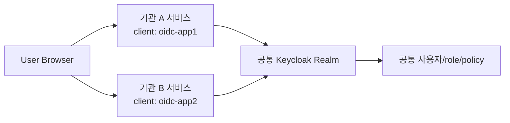
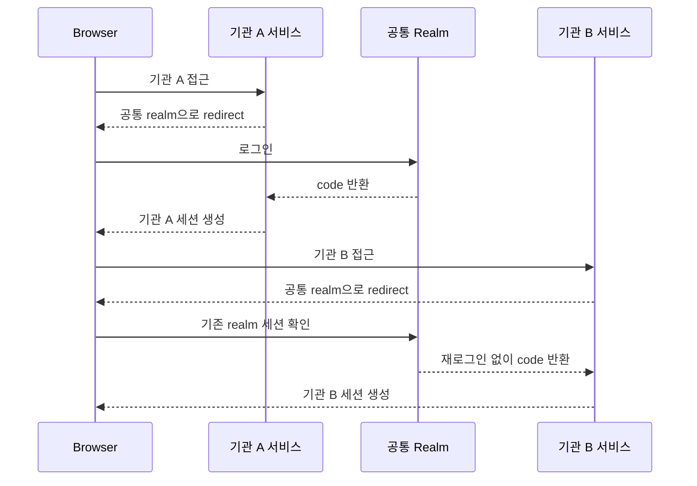
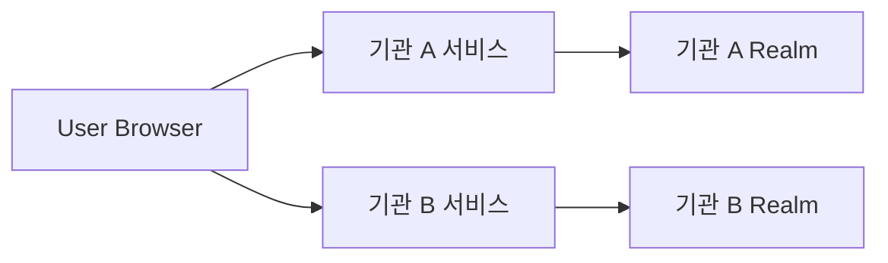
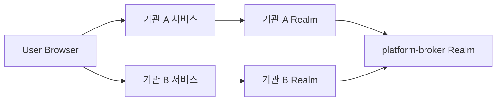
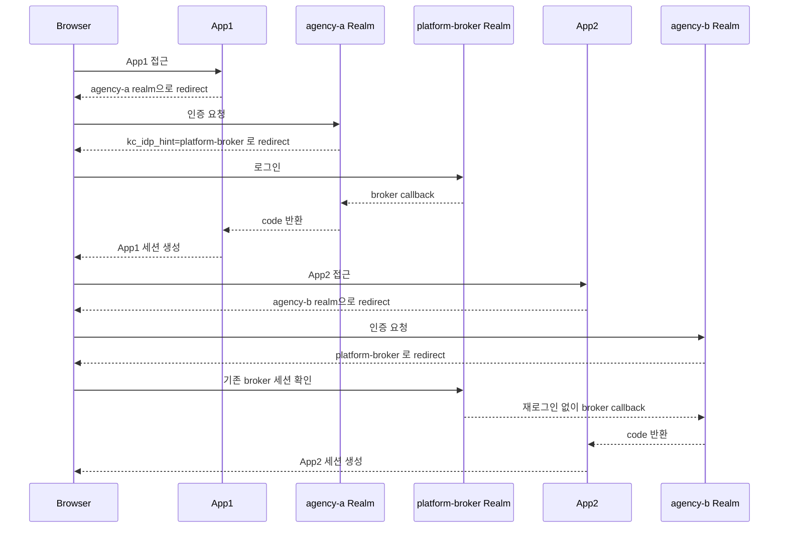
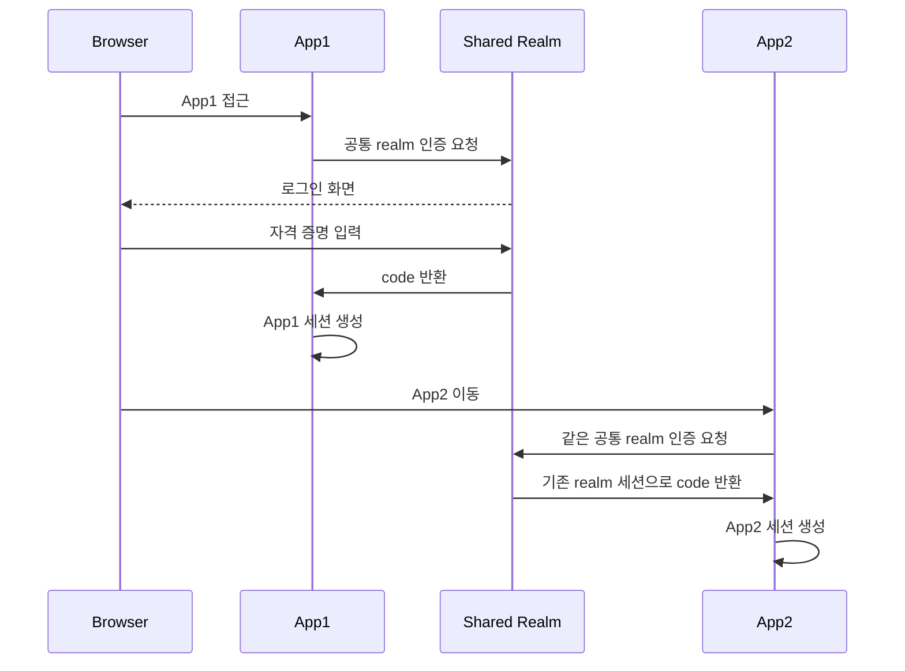
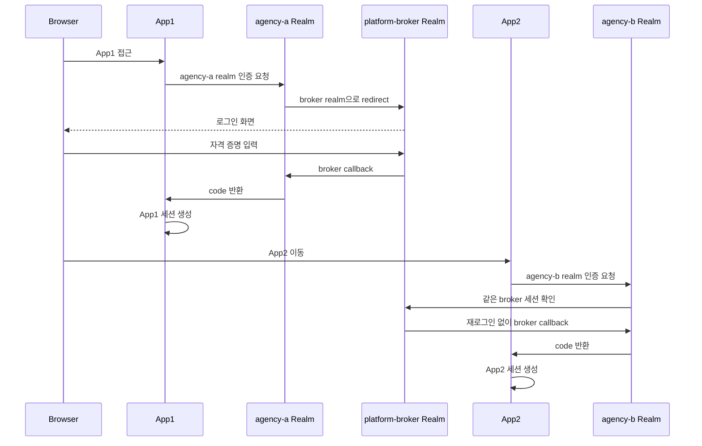
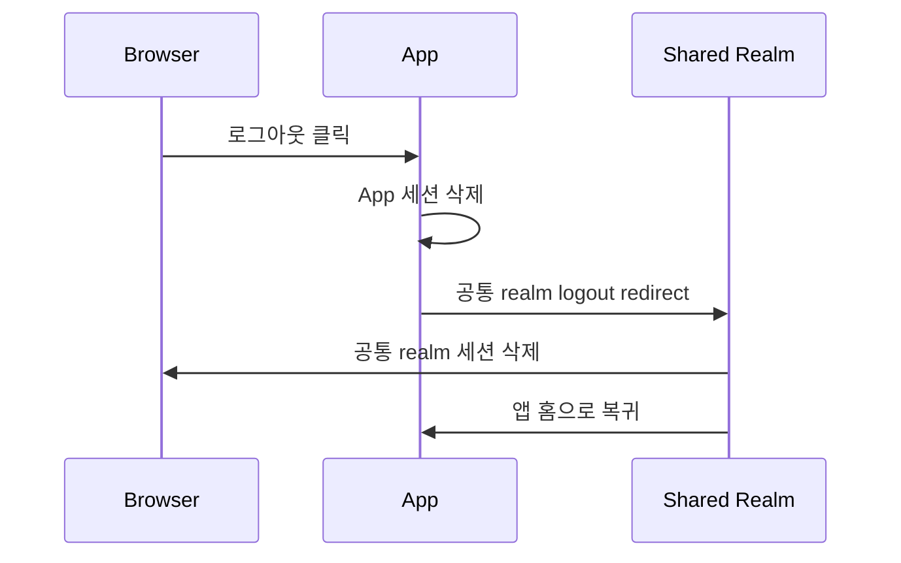
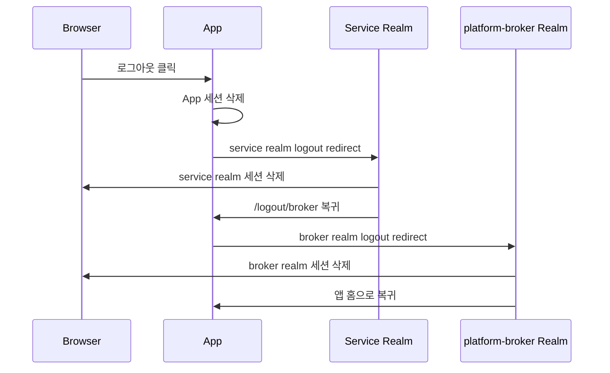

## 이번 비교에서 정리한 범위

1편과 2편 샘플을 정리한 뒤에는 realm 경계를 어디에 둘지가 다음 과제가 됐습니다. 공통 realm 하나로 갈지, 기관별로 realm을 나눌지에 따라 SSO 방식과 운영 책임선이 크게 달라졌기 때문입니다.

이번 글은 그 판단 기준을 작업 메모처럼 정리한 글입니다. 1편이 `공통 IdP + 앱별 세션 쿠키` 모델을 구현한 기록이고, 2편이 그 위에 `Gateway HMAC + Backend 세션 검증`을 얹은 기록이었다면, 3편은 두 글이 전제로 삼고 있는 `신원 경계 자체를 어디서 나눌 것인가`를 따로 비교합니다.

작성 순서대로 읽으면 `1편 -> 2편 -> 3편`이지만, 설계 판단 순서로 다시 읽는다면 `1편 -> 3편 -> 2편`도 자연스럽습니다. 먼저 공통 realm 모델을 이해하고, realm을 나눌지 판단한 뒤, 그 위에 Gateway HMAC 같은 내부 API 보호를 얹는 흐름입니다.

> 시리즈 안내
>
> - `1편`: [기관별 도메인 SSO 작업 기록 1: 공통 IdP와 앱별 세션 분리]()
> - `2편`: [기관별 도메인 SSO 작업 기록 2: Gateway HMAC과 Backend 세션 검증]()
> - `3편`: 지금 보고 있는 글입니다.
>
> 1편과 2편은 공통 realm 기반 예시를 사용합니다. realm을 공통으로 둘지, 서비스별로 나눌지는 이 글에서 따로 비교합니다.
{:.prompt-tip}

> 이 비교는 아래 샘플과 앞선 글을 같이 볼 때 가장 자연스럽습니다.
>
> - 1편: [oidc-multi-app-example](https://github.com/ydj515/sample-repository-example/tree/main/oidc-multi-app-example)
> - 2편: [oidc-multi-app-hmac-gateway-example](https://github.com/ydj515/sample-repository-example/tree/main/oidc-multi-app-hmac-gateway-example)
{:.prompt-info}

---

## 1. 문제 조건 정리

이번 글에서 비교하는 전제는 다음과 같습니다.

- 기관 A, 기관 B처럼 여러 서비스 도메인이 존재한다.
- 모든 서비스는 OIDC 기반 로그인 체계를 사용한다.
- IdP 후보는 Keycloak 같은 self-host OIDC Provider라고 가정한다.
- 서비스는 각자 독립적인 OIDC client와 서비스 세션 쿠키를 가질 수 있다.
- 비교 대상은 `공통 realm + 서비스별 client`와 `서비스별 realm + 필요 시 상위 공통 IdP 브로커링` 두 가지다.
- 목표는 "어느 구성이 더 맞는가"를 SSO 경험, 운영 경계, 관리자 권한, 정책 분리, 확장성 관점에서 판단하는 것이다.

이 비교는 주로 운영 메타데이터 구조를 다루므로, 런타임 복잡도는 항목을 나눠서 보는 편이 정확합니다. 세션 조회나 registration 선택은 보통 평균 `O(1)`이지만, 로그인 이후 role 매핑과 인가 판단은 사용자에게 부여된 role 수를 `r`이라고 할 때 대략 `O(r)`입니다. 세션 저장 공간은 활성 세션 수를 `s`라고 할 때 `O(s)`입니다. 반면 운영 복잡도는 realm 수를 `M`, realm당 client/role/policy 개수를 각각 `C`, `R`, `P`라고 할 때 대략 `O(M * (C + R + P))`까지 커질 수 있습니다. 공통 realm 구조는 같은 관점에서 보통 `O(C + R + P)` 수준으로 관리됩니다.

---

## 2. 비교 기준은 신원 경계를 어디서 나누느냐였다

공통 realm과 서비스별 realm의 차이는 단순히 설정 화면을 몇 개 띄우느냐의 문제가 아닙니다.

- 공통 realm은 "신원 체계는 하나이고, 서비스 접근 경계만 분리한다"는 모델입니다.
- 서비스별 realm은 "기관마다 사실상 다른 신원 경계와 운영 경계를 가진다"는 모델입니다.

즉, 공통 realm은 `하나의 사용자 디렉터리 + 여러 서비스`, 서비스별 realm은 `여러 사용자 디렉터리 또는 여러 신원 테넌트 + 여러 서비스`에 더 가깝습니다.

이 차이 하나가 아래 항목을 전부 바꿉니다.

- SSO가 성립하는 방식
- 관리자 권한 위임 방식
- 사용자 계정 연동과 프로비저닝 방식
- 로그아웃 전파 방식
- 장애와 설정 실수의 영향 범위

---

## 3. 공통 Realm 모델: 하나의 신원 체계 위에 여러 서비스를 두는 방식

공통 realm 모델에서는 기관 A와 기관 B가 같은 realm을 신뢰하고, 서비스별로 OIDC client만 분리합니다.



이 구조의 핵심은 사용자의 로그인 세션이 realm 단위로 유지된다는 점입니다. 따라서 한 번 공통 realm에 로그인하면, 같은 브라우저에서 다른 서비스 client로 이동할 때도 같은 realm 세션을 재사용할 수 있습니다.

이 시리즈의 1편 샘플이 바로 이 구조입니다.

### 현재 `oidc-multi-app-example`이 정확히 무엇을 보여주는가

여기서 먼저 짚고 넘어가야 할 점이 있습니다. `oidc-multi-app-example`은 앱별로 realm이 나뉜 구조가 아닙니다. 하나의 Keycloak realm을 `app1`, `app2`가 공유하고, 그 안에서 분리되는 단위는 realm이 아니라 `OIDC client`, `client role`, `세션 쿠키`입니다.

구조를 요약하면 아래와 같습니다.

```text
Keycloak realm: oidc-multi-app-example
├─ client: oidc-app1
│  ├─ app1에서 사용
│  ├─ client role: app1-user, app1-admin
│  └─ session cookie: APP1SESSION
└─ client: oidc-app2
   ├─ app2에서 사용
   ├─ client role: app2-user, app2-admin
   └─ session cookie: APP2SESSION
```

그리고 아래의 사항들이 공통 realm 모델에 기반하여 적용되어 있습니다.

- 하나의 Keycloak realm을 두 개의 독립 Spring Boot 앱이 신뢰합니다.
- `infra/keycloak/realm-export.json`의 realm 이름은 하나만 있고, 값은 `oidc-multi-app-example`입니다.
- 같은 파일 안에 `oidc-app1`, `oidc-app2` 두 개의 client가 정의되어 있습니다.
- `app1/src/main/resources/application-local.yaml`, `app2/src/main/resources/application-local.yaml`은 둘 다 `/realms/oidc-multi-app-example/...` 엔드포인트를 사용합니다.
- `app1/src/main/resources/application.yaml`, `app2/src/main/resources/application.yaml`은 각각 `oidc-app1`, `oidc-app2` client id와 `APP1SESSION`, `APP2SESSION` 쿠키를 사용합니다.

즉 현재 샘플은 `공통 realm + 앱별 client 분리` 예제입니다. 이 점을 먼저 명확히 이해해야, "개별 realm으로 가면 무엇이 달라지는가"를 과장 없이 비교할 수 있습니다.

복잡도도 이 구조를 기준으로 보면 비교적 단순합니다. 세션 조회는 보통 평균 `O(1)`이고, 로그인 이후 role 매핑과 접근 권한 판단은 사용자에게 부여된 role 수를 `r`이라고 할 때 대략 `O(r)`입니다. 세션 저장 공간은 활성 세션 수를 `s`라고 할 때 `O(s)`입니다. 즉 현재 샘플의 복잡도는 realm 분리 자체보다 `role 수`와 `활성 세션 수`에 더 민감합니다.

### 공통 realm에서 SSO가 성립하는 흐름



중요한 점은 SSO가 `기관 A 세션 공유`로 성립하는 것이 아니라 `공통 realm 세션 재사용`으로 성립한다는 것입니다. 서비스 세션은 여전히 각 서비스가 따로 만듭니다.

### `app1-user`가 `app2`에서 재로그인 없이도 `403`이 나는 이유

현재 샘플의 인가 모델도 공통 realm 구조를 잘 보여줍니다. `app1-user`는 같은 realm 세션을 재사용해서 `app2` 로그인 콜백까지는 통과할 수 있지만, `app2` 접근 권한까지 자동으로 얻지는 못합니다.

흐름을 단계로 풀면 이렇습니다.

1. 사용자가 `app1`에서 로그인하면 Keycloak 공통 realm 세션이 브라우저에 생깁니다.
2. 같은 브라우저로 `app2`에 접근하면 `app2`는 같은 realm으로 다시 리다이렉트합니다.
3. Keycloak은 기존 realm 세션을 확인하고 비밀번호 입력 없이 `app2`용 authorization code를 발급합니다.
4. `app2`는 code를 token으로 교환합니다.
5. 이때 `KeycloakOidcUserService`는 현재 client id 기준으로 `resource_access[clientId].roles`를 읽어 authority를 만듭니다.
6. `app2` 설정의 `app.security.access.user-roles=app2-user` 조건과 비교했을 때 `app1-user`에게는 `app2-user`가 없으므로 인가가 실패합니다.
7. 결과적으로 인증은 성공하지만 인가에서 막혀 `403` 또는 접근 거부 페이지로 이동합니다.

현재 샘플의 핵심 코드도 이 흐름을 그대로 반영합니다.

```kotlin
private fun extractClientAuthorities(
    claims: Map<String, Any>,
    clientId: String,
): Set<GrantedAuthority> {
    val resourceAccess = claims[RESOURCE_ACCESS] as? Map<String, Any?> ?: return emptySet()
    val clientEntry = resourceAccess[clientId] as? Map<String, Any?> ?: return emptySet()
    val roles = clientEntry[ROLES] as? Collection<*> ?: return emptySet()
    return roles
        .mapNotNull { it?.toString() }
        .mapTo(linkedSetOf()) { SimpleGrantedAuthority("ROLE_$it") }
}
```

```kotlin
authorize
    .requestMatchers("/api/**")
    .hasAnyAuthority(*oidcSecurityProperties.accessAuthorities())
    .anyRequest()
    .hasAnyAuthority(*oidcSecurityProperties.accessAuthorities())
```

이 구조는 "인증은 공유되지만, 인가는 앱별 role로 다시 판단한다"는 현재 예제의 본질을 드러냅니다.

---

## 4. 서비스별 Realm 모델: 기관마다 신원 경계를 따로 두는 방식

서비스별 realm 모델에서는 기관 A와 기관 B가 각자 자기 realm을 가집니다. 이때 "같은 Keycloak 인스턴스 안에 realm이 여러 개 있다"는 사실만으로는 자동 SSO가 생기지 않습니다.



이 구조는 다음과 같은 상황에서 자주 선택됩니다.

- 기관별로 사용자 저장소를 강하게 분리해야 한다.
- 기관별 관리자와 운영 조직이 다르다.
- 기관별 로그인 정책, MFA, 브로커, 계정 수명주기가 다르다.
- 한 기관의 설정 실수나 사고 영향 범위를 다른 기관과 분리하고 싶다.

문제는 SSO입니다. realm이 다르면 로그인 세션도 기본적으로 realm별로 분리되기 때문에, 별도 장치 없이 `기관 A realm 로그인 -> 기관 B realm 무비밀번호 이동`이 바로 되지 않습니다.

### 서비스별 realm에서는 realm 관리자를 어떻게 둘 것인가

서비스별 realm 구조로 가는 순간 운영 모델도 함께 바뀝니다. 공통 realm에서는 중앙 IAM 팀이 realm 하나를 관리하고 client/role만 서비스별로 나누면 되지만, 서비스별 realm에서는 "누가 어느 realm까지 관리할 수 있는가"를 먼저 정해야 합니다.

실무에서는 대체로 아래처럼 계층을 나눕니다.

| 관리 주체 | 보유 권한 예시 | 관리 범위 |
| --- | --- | --- |
| 중앙 IAM 운영자 | Keycloak 상위 관리자, 상위 공통 IdP 관리, broker 표준 관리 | realm 생성, broker 템플릿, 공통 보안 기준 |
| 서비스별 realm 관리자 | `realm-management`의 `realm-admin`, `manage-users`, `manage-clients`, `view-realm` 등 | 자기 서비스 realm의 사용자, role, client, 로그인 플로우 |
| 애플리케이션 운영 관리자 | 애플리케이션 내부 관리자 API, 세션 강제 로그아웃 등 | 애플리케이션 비즈니스 운영, IdP 설정 변경 아님 |

Keycloak 관점에서 보면, 서비스별 realm 관리자는 보통 자기 realm의 `realm-management` 권한만 위임받고, 상위 공통 IdP나 다른 서비스 realm의 broker 설정은 중앙 IAM 운영자가 관리하는 식으로 분리하는 편이 안전합니다.

이렇게 해야 서비스별 관리자는 자기 기관의 사용자와 client는 다룰 수 있지만, 다른 기관 realm의 정책이나 상위 공통 IdP 설정을 실수로 건드리지는 못합니다.

운영 절차를 예시로 풀면 대개 아래 순서가 됩니다.

1. 중앙 IAM 운영자가 `기관 A realm`, `기관 B realm`을 생성하고 공통 보안 baseline을 적용합니다.
2. 중앙 IAM 운영자가 각 realm에 상위 공통 IdP broker 또는 공통 인증 정책을 연결합니다.
3. 중앙 IAM 운영자가 각 기관 담당자에게 자기 realm의 `realm-management` 권한만 위임합니다.
4. 서비스별 realm 관리자는 자기 realm 안에서 사용자, 그룹, role, client redirect URI, mapper를 관리합니다.

이렇게 역할을 나눠야 "SSO를 위한 공통 기준"과 "기관별 자율 운영"을 동시에 가져갈 수 있습니다.

조금 더 실제 운영 시나리오처럼 풀면 보통 아래 순서로 움직입니다.

1. 신규 기관 온보딩이 결정되면 중앙 IAM 운영자가 `기관 C realm`을 새로 만들고, 비밀번호 정책, OTP 정책, 세션 정책, 감사 기준 같은 공통 baseline을 먼저 적용합니다.
2. 중앙 IAM 운영자가 `platform-broker realm`과의 브로커 연결, redirect URI 표준, logout 정책, 기본 mapper를 붙입니다.
3. 중앙 IAM 운영자가 기관 담당자용 관리 그룹을 만들고, `realm-management`의 `manage-users`, `manage-clients`, `view-realm`, 필요 시 `manage-identity-providers` 같은 권한을 최소 범위로 위임합니다.
4. 기관 realm 관리자는 자기 realm 안에서 사용자 생성, 그룹 편성, `oidc-app1` 같은 client 설정, role 부여, first broker login 정책을 조정합니다.
5. 애플리케이션 운영 관리자는 Keycloak 설정을 직접 바꾸지 않고, 앱 내부 관리자 화면이나 운영 API를 통해 세션 강제 로그아웃, 접근 승인, 사용자 상태 점검만 수행합니다.
6. 운영 중에 로그인 장애가 나면 중앙 IAM 운영자는 broker 연결과 상위 IdP 세션을 보고, 기관 realm 관리자는 local user 연결과 role 부여 상태를 보고, 애플리케이션 운영 관리자는 최종 `403`과 세션 상태를 봅니다.

이렇게 절차를 나누면 장애 분석도 계층별로 나뉩니다. 예를 들어 `기관 B 사용자가 로그인은 했는데 app2에서 403이 난다`면, 중앙 IAM 운영자가 먼저 broker 자체를 의심하는 것이 아니라 기관 B realm 관리자에게 `agency-b realm local user`, `agency-b-user role`, `federated identity link` 상태를 확인하게 하는 식으로 운영 책임선이 분명해집니다.

---

## 5. 서비스별 Realm에서 SSO를 하려면 보통 상위 공통 IdP가 추가된다

서비스별 realm에서도 사용자 경험상 SSO를 만들 수는 있습니다. 다만 그 방식은 보통 "realm끼리 직접 세션을 공유"하는 것이 아니라, 각 realm이 상위 공통 IdP를 브로커로 사용하도록 구성하는 쪽에 가깝습니다.

> 이 상위 공통 IdP를 아예 `platform-broker realm`으로 명시한 전체 샘플은 [oidc-multi-app-realm-broker-example](https://github.com/ydj515/sample-repository-example/tree/main/oidc-multi-app-realm-broker-example)를 참조해주세요.



이때 실제로 재사용되는 세션은 `platform-broker realm 세션`입니다. 기관 A realm과 기관 B realm은 각각 자기 realm 세션을 따로 만들지만, 사용자는 broker realm 세션 덕분에 비밀번호를 다시 입력하지 않게 됩니다.

여기서 빠지면 안 되는 전제가 하나 있습니다. broker realm에서 인증된 사용자가 각 service realm 안에서도 식별 가능해야 한다는 점입니다. 즉 서비스별 realm 구조는 단순히 "브로커를 하나 더 둔다"로 끝나지 않고, 각 realm에 local user를 어떻게 두고 어떤 방식으로 연결할지까지 함께 설계해야 합니다.

### 서비스별 realm + 상위 IdP 브로커링 흐름



즉, 사용자 관점에서는 "SSO처럼 보이지만", 내부 구조는 공통 realm 모델과 다릅니다. 여기서는 우선 "broker realm이 인증을 맡고 각 service realm은 자기 세션을 따로 만든다"는 메커니즘만 기억해두면 충분합니다. 공통 realm과의 나란한 비교는 다음 절에서 다시 정리하겠습니다.

새 샘플에서는 이 흐름을 그대로 드러내기 위해 다음 두 가지를 코드에 추가했습니다.

- `app.security.identity-provider-hint=platform-broker`
- `/logout/broker`를 거쳐 broker realm logout까지 이어지는 후속 redirect 체인

### 서비스별 realm의 local user는 어떻게 준비되는가

service realm SSO에서 가장 자주 빠지는 논점은 "브로커가 인증한 사용자를 각 realm에서 어떤 계정으로 받아들일 것인가"입니다. 보통 아래 세 가지 전략 중 하나를 택합니다.

| 전략 | 방식 | 장점 | 단점 | 언제 적합한가 |
| --- | --- | --- | --- | --- |
| 사전 생성 + federated identity 연결 | 각 service realm에 local user를 미리 만들고 broker identity를 연결 | 권한 모델이 명확하고 데모/운영 재현성이 높다 | 초기 프로비저닝 작업이 필요하다 | 사용자 집합이 비교적 안정적이고 role을 엄격히 통제할 때 |
| first broker login 시 자동 생성 | 첫 로그인 때 local user를 만들고 연결한다 | 초기 온보딩이 쉽다 | 첫 로그인 플로우, 승인 정책, 기본 role 부여를 더 설계해야 한다 | 사용자 수가 많고 사전 생성 비용이 클 때 |
| 승인형 또는 수동 연결 | 브로커 인증 후 운영자 승인 뒤 local user를 연결한다 | 가장 보수적이고 통제력이 높다 | 사용자 경험이 끊기고 운영 개입이 많다 | 높은 규제, 수동 심사, 위탁 운영이 필요한 경우 |

이번에 만든 `oidc-multi-app-realm-broker-example`은 첫 번째 방식을 택했습니다. `agency-a-user`, `agency-b-user`, `multi-user`, `agency-a-admin`, `agency-b-admin`, `master-admin`을 각 service realm에 미리 두고 `platform-broker` federated identity로 연결해, 브로커링 이후 곧바로 앱 인가 단계까지 흐름을 이어갈 수 있게 했습니다.

### 서비스별 realm에서 접근 거부와 로그인 실패는 어디서 달라질까

공통 realm과 서비스별 realm은 둘 다 "로그인은 된 것 같은데 서비스에 들어가지 못하는" 상황이 생길 수 있지만, 막히는 위치가 다릅니다. 공통 realm은 대개 애플리케이션 인가 단계에서 `403`으로 보이고, 서비스별 realm은 local user 연결이나 first broker login 단계에서 애플리케이션까지 오기 전에 실패할 수도 있습니다. 차이를 압축하면 아래 표로 정리할 수 있습니다.

| 비교 항목 | 공통 realm | 서비스별 realm |
| --- | --- | --- |
| 대표 흐름 | 공통 realm 로그인 후 앱 접근 | service realm -> broker realm 로그인 후 앱 접근 |
| 먼저 확인할 지점 | `resource_access[clientId].roles` 또는 app role | local user provisioning, federated identity link, service realm role |
| 실패가 주로 나는 위치 | 애플리케이션 인가 단계 | service realm 계정 연결/first broker login 단계 또는 애플리케이션 인가 단계 |
| 흔한 원인 | `app2-user`가 없는데 `app2`에 접근 | service realm local user 미연결, first broker login 미구성, service realm role 누락 |
| 디버깅 시작점 | `KeycloakOidcUserService` authority 매핑, `OidcSecurityConfigurer` role 규칙 | service realm 사용자 연결 상태 확인 후, 그다음 `KeycloakOidcUserService`와 role 규칙 확인 |

정리하면 공통 realm은 "인증은 됐는데 앱 role이 없다"가 중심이고, 서비스별 realm은 "그 사용자로 이 realm 안에 들어오는 경로가 준비됐는가"를 먼저 봐야 합니다. 그래서 서비스별 realm에서는 `realm 계정 연결 실패`, `first broker login 실패`, `앱 인가 실패`를 꼭 분리해서 설명하는 편이 좋습니다.

---

## 6. 공통 Realm과 서비스별 Realm은 SSO 흐름이 어떻게 달라지는가

가장 큰 차이는 "재로그인 없는 이동이 어디서 성립하느냐"입니다.

앞 절이 "서비스별 realm 브로커링이 어떻게 동작하는가"를 설명했다면, 여기서는 공통 realm과 나란히 놓고 차이를 압축해 보겠습니다.

| 항목 | 공통 Realm | 서비스별 Realm |
| --- | --- | --- |
| 사용자 저장소 | 하나의 realm 안에서 공유 | realm마다 분리 가능 |
| OIDC client | 서비스별 client만 분리 | realm도 분리, client도 분리 |
| 기본 SSO 성립 방식 | 같은 realm 세션 재사용 | 기본적으로는 realm 세션이 분리됨 |
| 재로그인 없는 이동 | 매우 자연스러움 | 상위 공통 IdP나 브로커링 없으면 어렵다 |
| 역할 관리 | 한 realm 안에서 통합 관리 | realm마다 role 중복 관리 가능성 |
| local user / 계정 연결 | 한 realm 안에서 끝나는 편 | realm마다 provisioning, linking, first broker login 전략 필요 |
| 로그아웃 | 상대적으로 단순 | cross-realm logout 설계가 더 복잡 |
| 운영 격리 | 약함 | 강함 |
| 관리자 위임 | 세밀하지만 한 경계 안에서 관리 | realm 단위로 강한 위임/격리 가능 |

이 표에서 사실상 가장 중요한 문장은 두 개입니다.

- 공통 realm에서는 "같은 realm 세션"이 있어서 SSO가 단순합니다.
- 서비스별 realm에서는 "realm이 다르면 기본 세션도 다르기 때문에" 상위 IdP 또는 브로커 설계가 먼저 필요합니다.

### 공통 realm과 realm-broker 샘플의 로그인 비교

공통 realm 샘플인 `[oidc-multi-app-example](https://github.com/ydj515/sample-repository-example/tree/main/oidc-multi-app-example)`과 서비스별 realm 샘플인 `[oidc-multi-app-realm-broker-example](https://github.com/ydj515/sample-repository-example/tree/main/oidc-multi-app-realm-broker-example)`을 나란히 두고 보면 로그인 차이는 더 명확합니다.

공통 realm 샘플:



서비스별 realm + broker 샘플:



겉으로는 둘 다 SSO처럼 보이지만, 실제로 재사용되는 세션의 위치와 전제가 다릅니다.

- 공통 realm 샘플은 `shared realm 세션`이 핵심입니다.
- realm-broker 샘플은 `platform-broker 세션`이 핵심입니다.
- service realm 샘플은 여기서 끝나지 않고 `local user provisioning / account linking` 전제까지 함께 필요합니다.
- 그래서 service realm 샘플에서는 `authorization-uri`, `end-session-uri`, broker hint, local user 연결 전략 같은 설명이 추가됩니다.

### 로그아웃은 서비스별 realm에서 더 복잡해진다

로그인보다 더 크게 달라지는 부분은 로그아웃입니다. 이번에 만든 `oidc-multi-app-realm-broker-example`은 이 차이를 문서만이 아니라 코드와 redirect 체인으로 드러내도록 구현했습니다.

공통 realm 샘플:



서비스별 realm + broker 샘플:



이 구분이 중요한 이유는, `service realm logout`만 해도 브라우저의 `platform-broker` 세션이 남아 있으면 다음 로그인에서 다시 빠르게 브로커링될 수 있기 때문입니다. 그래서 서비스별 realm 구조에서는 아래 세 단계를 명시적으로 구분해 두는 편이 좋습니다.

- `앱 로컬 로그아웃`: 애플리케이션 세션만 삭제
- `서비스 realm 로그아웃`: 해당 realm 세션 삭제
- `broker realm 로그아웃`: 상위 공통 로그인 세션 삭제

이번에 만든 샘플도 이 세 단계를 코드로 분리했지만, `broker realm logout` 단계에서는 Keycloak 확인 화면이 한 번 더 나타날 수 있습니다. 애플리케이션이 직접 보유하는 `id_token`은 service realm 기준이기 때문에, broker realm의 `id_token_hint`까지 바로 넘기는 구조는 아니기 때문입니다. 이 제약은 "realm이 나뉘면 로그아웃도 한 번에 단순해지지 않는다"는 점을 실제로 보여줍니다.

즉 서비스별 realm 구조에서는 로그인보다 로그아웃 UX를 더 먼저 설계해야 합니다.

---

## 7. 어떤 기준으로 선택해야 하나

실무에서는 보통 아래 질문으로 판단하는 편이 좋습니다.

### 공통 Realm이 맞는 경우

- 기관들이 사실상 같은 사용자 풀을 공유한다.
- 서비스 간 SSO 경험이 가장 중요하다.
- 로그인 정책, MFA, 브로커 설정, 세션 정책을 중앙에서 관리하고 싶다.
- role만 나누면 충분하고, realm 수준의 강한 관리자 격리까지는 필요 없다.
- 기관별로 다른 운영 조직이 있더라도 신원 체계는 하나로 묶어도 된다.

### 서비스별 Realm이 맞는 경우

- 기관별 사용자 디렉터리와 관리자 권한을 강하게 분리해야 한다.
- 기관별 로그인 화면, 인증 정책, 외부 IdP 연동이 다르다.
- 한 기관의 설정 실수나 보안 사고 영향 범위를 다른 기관과 분리하고 싶다.
- 규제, 감사, 위탁운영, 데이터 주권 요구가 기관별로 다르다.
- 조직 구조상 realm 단위 운영 위임이 더 자연스럽다.

한 문장으로 줄이면 이렇습니다.

- `공통 realm`: 신원은 하나, 서비스만 여러 개
- `서비스별 realm`: 서비스가 아니라 신원 경계 자체가 여러 개

---

## 8. 운영 관점에서 무엇이 더 달라지는가

공통 realm과 서비스별 realm의 차이는 로그인 순간보다 운영 단계에서 더 크게 드러납니다.

### 공통 Realm에서 단순해지는 것

- 공통 사용자/role/mapper/policy 관리
- 서비스 간 SSO 설명과 디버깅
- logout, 세션, 브라우저 흐름 추적
- 새로운 서비스 client 추가

### 서비스별 Realm에서 복잡해지는 것

- realm별 role/policy/mapper 중복 관리
- 상위 IdP 브로커링과 account linking
- cross-realm logout 또는 세션 정합성 설명
- 프로비저닝과 계정 수명주기 동기화

특히 사용자 식별 문제를 가볍게 보면 안 됩니다. 공통 realm에서는 `sub`가 비교적 일관된 식별자로 동작하기 쉽지만, 서비스별 realm에서는 상위 IdP subject와 각 realm 내부 계정 사이 관계를 어떻게 맺을지까지 설계해야 합니다.

### Spring Security와 샘플 코드에서는 무엇이 실제로 바뀌는가

이 부분이 가장 많이 오해되는 지점입니다. `공통 realm -> 서비스별 realm`으로 간다고 해서 Spring Security 코드 전체를 갈아엎는 것은 아닙니다. 예제 클래스 기준으로 보면, 어떤 것은 설정 파일만 바꾸면 되고 어떤 것은 브로커링 때문에 실제 클래스를 추가하거나 확장해야 합니다.

#### 1. 가장 먼저 바뀌는 것은 provider endpoint와 logout endpoint다

현재 샘플은 `app1`, `app2`가 모두 같은 realm endpoint를 봅니다.

- app1/application-local.yaml

  ```yaml
  # app1/application-local.yaml
  spring:
    security:
      oauth2:
        client:
          registration:
            keycloak:
              provider: keycloak
          provider:
            keycloak:
              authorization-uri: http://localhost:9000/realms/oidc-multi-app-example/protocol/openid-connect/auth
              token-uri: http://localhost:9000/realms/oidc-multi-app-example/protocol/openid-connect/token
              user-info-uri: http://localhost:9000/realms/oidc-multi-app-example/protocol/openid-connect/userinfo
              jwk-set-uri: http://localhost:9000/realms/oidc-multi-app-example/protocol/openid-connect/certs
              user-name-attribute: preferred_username

  app:
    security:
      end-session-uri: http://localhost:9000/realms/oidc-multi-app-example/protocol/openid-connect/logout
  ```

서비스별 realm 구조라면 최소한 아래처럼 앱마다 다른 realm endpoint를 보게 됩니다.

- app1/application-local.yaml
  ```yaml
  # app1/application-local.yaml
  spring:
    security:
      oauth2:
        client:
          registration:
            keycloak:
              provider: keycloak
          provider:
            keycloak:
              authorization-uri: http://localhost:9000/realms/agency-a/protocol/openid-connect/auth
              token-uri: http://localhost:9000/realms/agency-a/protocol/openid-connect/token
              user-info-uri: http://localhost:9000/realms/agency-a/protocol/openid-connect/userinfo
              jwk-set-uri: http://localhost:9000/realms/agency-a/protocol/openid-connect/certs
              user-name-attribute: preferred_username

  app:
    security:
      end-session-uri: http://localhost:9000/realms/agency-a/protocol/openid-connect/logout
      identity-provider-hint: platform-broker
      broker-logout:
        end-session-uri: http://localhost:9000/realms/platform-broker/protocol/openid-connect/logout
        client-id: platform-broker-logout
  ```


- app2/application-local.yaml

  ```yaml
  spring:
    security:
      oauth2:
        client:
          registration:
            keycloak:
              provider: keycloak
          provider:
            keycloak:
              authorization-uri: http://localhost:9000/realms/agency-b/protocol/openid-connect/auth
              token-uri: http://localhost:9000/realms/agency-b/protocol/openid-connect/token
              user-info-uri: http://localhost:9000/realms/agency-b/protocol/openid-connect/userinfo
              jwk-set-uri: http://localhost:9000/realms/agency-b/protocol/openid-connect/certs
              user-name-attribute: preferred_username

  app:
    security:
      end-session-uri: http://localhost:9000/realms/agency-b/protocol/openid-connect/logout
      identity-provider-hint: platform-broker
      broker-logout:
        end-session-uri: http://localhost:9000/realms/platform-broker/protocol/openid-connect/logout
        client-id: platform-broker-logout
  ```

즉 앱이 하나의 realm만 신뢰한다면, Spring Security의 첫 번째 변경점은 대부분 `application-local.yaml`, `application-docker.yaml`, `end-session-uri` 같은 설정 파일입니다. 다만 이번 샘플처럼 broker realm까지 붙이면 `identity-provider-hint`, `broker-logout`처럼 로그인과 로그아웃 체인 관련 속성도 추가됩니다.

#### 2. realm export도 하나에서 여러 개로 쪼개질 가능성이 높다

현재 샘플은 `infra/keycloak/realm-export.json` 하나에 realm, client, user, role이 모두 들어 있습니다. 서비스별 realm 구조라면 보통 아래처럼 분리됩니다.

```text
infra/keycloak/
├─ realm-platform-broker.json
├─ realm-agency-a.json
└─ realm-agency-b.json
```

그리고 `docker-compose.yml`의 Keycloak import는 여러 realm 파일을 함께 읽게 됩니다. 즉 repo 구조 자체도 `공통 realm 예제`에서 `여러 realm + 필요 시 상위 공통 IdP 예제`로 달라집니다.

#### 2-1. 공통 realm 샘플을 실제로 서비스별 realm 샘플로 분리한다면

문서만이 아니라 샘플 저장소도 아예 서비스별 realm 버전으로 따로 두는 편이 더 설명 가능성이 좋습니다. 공통 realm 예제와 서비스별 realm 예제는 "보안 구조의 핵심 가정"이 다르기 때문에, 같은 디렉터리 안에서 조건문으로 버티기보다 샘플 자체를 나누는 편이 독자가 읽기 쉽습니다.

이번에 실제로 만든 새 예제 `oidc-multi-app-realm-broker-example`의 디렉터리 구조는 아래처럼 가져가는 편이 자연스럽습니다.

```text
oidc-multi-app-realm-broker-example/
├─ settings.gradle.kts
├─ docker-compose.yml
├─ README.md
├─ infra/
│  └─ keycloak/
│     ├─ realm-platform-broker.json
│     ├─ realm-agency-a.json
│     └─ realm-agency-b.json
├─ oidc-common/
├─ session-common/
├─ app1/
│  └─ src/main/resources/
│     ├─ application.yaml
│     ├─ application-local.yaml
│     └─ application-docker.yaml
└─ app2/
   └─ src/main/resources/
      ├─ application.yaml
      ├─ application-local.yaml
      └─ application-docker.yaml
```

이 구조에서 각 파일의 책임은 대략 이렇게 나뉩니다.

- `realm-platform-broker.json`: 공통 로그인 허브 realm, broker client, logout client
- `realm-agency-a.json`: 기관 A realm, `oidc-app1` client, broker identity link, 기관 A local user/role
- `realm-agency-b.json`: 기관 B realm, `oidc-app2` client, broker identity link, 기관 B local user/role
- `app1/application-*.yaml`: `agency-a` realm endpoint, `identity-provider-hint`, broker logout endpoint
- `app2/application-*.yaml`: `agency-b` realm endpoint, `identity-provider-hint`, broker logout endpoint

즉 서비스별 realm 예제는 단순히 `client-id`만 바꾸는 버전이 아니라, `Keycloak import 파일 구조`, `운영 권한 위임 모델`, `로그인/로그아웃 플로우 전제` 자체가 달라지는 별도 샘플이라고 보는 편이 맞습니다.

#### 3. `OidcSecurityConfigurer`는 의외로 많이 안 바뀔 수 있다

현재 `OidcSecurityConfigurer`는 아래처럼 `OidcSecurityProperties`가 제공하는 authority만 검사합니다.

```kotlin
.requestMatchers(HttpMethod.POST, "/api/admin/**").hasAnyAuthority(*oidcSecurityProperties.adminAuthorities())
.requestMatchers("/api/**").hasAnyAuthority(*oidcSecurityProperties.accessAuthorities())
.anyRequest().hasAnyAuthority(*oidcSecurityProperties.accessAuthorities())
```

서비스별 realm으로 가더라도 각 앱이 자기 realm 하나만 신뢰하고, 앱마다 필요한 role 이름만 맞춰주면 이 필터 체인 구조 자체는 유지할 수 있습니다. 즉 `app1`이 `agency-a` realm만, `app2`가 `agency-b` realm만 신뢰한다면 authorization rule 자체를 전부 다시 짤 필요는 없습니다.

이번 샘플에서 실제로 새로 추가된 코드는 `보호 규칙`보다 `인증 시작과 로그아웃 체인` 쪽입니다.

```kotlin
authorization.authorizationRequestResolver(
    IdentityProviderHintAuthorizationRequestResolver(
        clientRegistrationRepository = clientRegistrationRepository,
        identityProviderHint = oidcSecurityProperties.identityProviderHint,
    ),
)
```

```kotlin
@GetMapping("/logout/broker")
fun brokerLogout(request: HttpServletRequest): ResponseEntity<Void> {
    val baseUrl = request.baseUrl()
    val brokerLogout = oidcSecurityProperties.brokerLogout
    val targetUrl = UriComponentsBuilder
        .fromUriString(brokerLogout.endSessionUri)
        .queryParam("client_id", brokerLogout.clientId)
        .queryParam("post_logout_redirect_uri", baseUrl)
        .build(true)
        .toUriString()
    return ResponseEntity.status(HttpStatus.FOUND)
        .header(HttpHeaders.LOCATION, targetUrl)
        .build()
}
```

#### 4. 실제 코드가 바뀌는 지점은 claim 매핑 전략이 달라질 때다

현재 `KeycloakOidcUserService`는 다음 두 경로에서 role을 읽습니다.

- `realm_access.roles`
- `resource_access[clientId].roles`

공통 realm 샘플에서 인가 핵심은 두 번째, 즉 현재 client id 기준 `resource_access`입니다. 서비스별 realm으로 가더라도 role 모델을 그대로 client role 중심으로 유지하면 이 코드는 거의 그대로 재사용할 수 있습니다.

하지만 서비스별 realm으로 가면서 role 모델을 바꾸면 이야기가 달라집니다.

- 각 realm에서 `user`, `admin` 같은 `realm role`만 쓰겠다.
- 상위 공통 IdP에서 group/claim을 내려주고 realm 쪽 mapper로만 정리하겠다.
- broker login 후 local role을 별도 부여하겠다.

이 경우에는 `KeycloakOidcUserService`의 claim 해석 방식이 바뀔 수 있습니다. 예를 들어 realm role 중심이라면 `extractRealmAuthorities` 비중이 커지고, custom claim이나 group을 쓰면 별도 mapper 메서드를 추가해야 합니다.

#### 5. 진짜로 복잡해지는 경우는 한 앱이 여러 realm을 동적으로 선택할 때다

현재 샘플은 `app1`은 자기 realm 하나, `app2`는 자기 realm 하나만 보면 됩니다. 이 경우에는 앱마다 `ClientRegistration` 하나면 충분합니다.

하지만 하나의 코드베이스가 여러 도메인을 보고, hostname에 따라 realm을 동적으로 바꿔야 한다면 그때부터는 별도 작업이 필요합니다.

- `ClientRegistration`을 여러 개 둔다.
- `oauth2/authorization/{registrationId}` 선택 로직을 만든다.
- 필요하면 `OAuth2AuthorizationRequestResolver`를 커스터마이징한다.

즉 "서비스별 realm" 자체보다 "한 애플리케이션이 여러 realm을 동적으로 선택해야 하는가"가 Spring Security 복잡도를 더 크게 끌어올립니다.

#### 6. Spring Security 변경 포인트를 예제 클래스 기준으로 압축하면

아래 표는 "공통 realm 샘플에서 출발해 서비스별 realm으로 갈 때" 무엇이 설정만 바뀌는지, 무엇이 실제 코드 수정이 필요한지를 예제 클래스 기준으로 더 직접적으로 정리한 것입니다.

| 예제 파일 / 클래스 | 공통 realm에서 하는 일 | 서비스별 realm으로 갈 때 설정만 변경하면 되는 경우 | 코드 수정 또는 새 클래스 추가가 필요한 경우 |
| --- | --- | --- | --- |
| `app1/src/main/resources/application-local.yaml`<br/>`app2/src/main/resources/application-local.yaml` | 같은 realm의 provider endpoint, logout endpoint를 바라봄 | 앱마다 `agency-a`, `agency-b` realm endpoint와 `end-session-uri`만 바꾸는 경우 | broker 구조를 넣으면서 `identity-provider-hint`, `broker-logout` 속성을 추가해야 하는 경우 |
| `OidcSecurityConfigurer` | URL 보호 규칙과 OAuth2 로그인 흐름을 설정 | 한 앱이 자기 realm 하나만 신뢰하고 role 이름만 다르게 쓰는 경우 | 하나의 앱이 여러 realm을 동적으로 선택하거나, 인증 시작점을 커스터마이징해야 하는 경우 |
| `KeycloakOidcUserService` | `realm_access.roles`, `resource_access[clientId].roles`를 authority로 매핑 | 서비스별 realm이어도 여전히 client role 중심이면 그대로 재사용 가능 | realm role 중심, broker claim 중심, custom claim 중심으로 인가 모델이 바뀌는 경우 |
| `IdentityProviderHintAuthorizationRequestResolver` | 공통 realm 샘플에는 필요 없음 | 해당 없음 | service realm에서 로그인 시작 시 `kc_idp_hint=platform-broker`를 붙여 broker realm으로 바로 보내고 싶을 때 추가 |
| `KeycloakLogoutSuccessHandler` | 현재 realm logout으로 redirect | service realm logout URI만 바꾸면 되는 경우 | service realm logout 뒤에 broker realm logout까지 이어지게 체인을 확장해야 하는 경우 |
| `BrokerLogoutController` | 공통 realm 샘플에는 필요 없음 | 해당 없음 | `/logout/broker` 같은 후속 redirect endpoint를 두어 broker realm logout까지 연결할 때 추가 |
| `ClientRegistration` 구성 | 앱마다 registration 1개 | `app1 -> agency-a`, `app2 -> agency-b`처럼 앱별 realm이 고정이면 registration 값만 변경 | hostname별 다중 realm 선택처럼 registration을 여러 개 두고 resolver를 붙여야 하는 경우 |

예제 기준으로 더 짧게 말하면 이렇습니다.

- `application-*.yaml`은 거의 반드시 바뀝니다.
- `OidcSecurityConfigurer`는 "한 앱-한 realm"이면 생각보다 많이 안 바뀝니다.
- `KeycloakOidcUserService`는 claim 모델을 바꾸지 않으면 그대로 갈 수 있습니다.
- 대신 `IdentityProviderHintAuthorizationRequestResolver`, `BrokerLogoutController` 같은 클래스는 broker realm을 실제로 붙일 때 새로 필요해집니다.

---

## 9. 1편과 2편을 읽을 때 어떻게 연결하면 좋을까

작성 순서대로라면 이 시리즈는 `1편 -> 2편 -> 3편`입니다. 다만 설계 판단 순서로 읽고 싶다면 아래 순서가 더 자연스럽습니다.

1. 1편에서 `공통 IdP + 앱별 세션 쿠키 + role 기반 접근 제어`를 이해한다.
2. 3편에서 "이 공통 realm 구조가 왜 단순한지, 언제 서비스별 realm이 필요한지"를 비교한다.
3. 2편에서 realm 토폴로지와는 별개로 `Gateway HMAC + Backend 재검증`을 읽는다.

즉 3편은 2편을 대체하는 글이 아니라, 1편과 2편이 암묵적으로 전제하고 있는 "realm 토폴로지 선택"을 따로 꺼내서 설명하는 보충편에 가깝습니다. 독자는 구현 흐름을 따라가고 싶으면 작성 순서대로 읽고, 아키텍처 의사결정을 먼저 정리하고 싶으면 `1편 -> 3편 -> 2편`으로 읽으면 됩니다.

---

## 10. 주의사항

> - 서비스별 realm이라고 해서 자동으로 SSO가 되는 것은 아닙니다. 보통은 상위 공통 IdP나 identity brokering이 추가로 필요합니다.
> - 같은 `username`을 쓴다고 해서 cross-realm에서 같은 사용자라고 단정하면 안 됩니다. `sub`, 계정 linking, federation 기준이 더 중요합니다.
> - 공통 realm에서 role 분리만으로 충분한데 realm까지 쪼개면 운영 복잡도만 커질 수 있습니다.
> - 반대로 기관별 관리자, 정책, 감사 경계를 강하게 분리해야 하는데 공통 realm으로 밀어붙이면 나중에 되돌리기 어렵습니다.
> - 2편의 Gateway HMAC은 realm 토폴로지와 별개로 적용할 수 있지만, 어떤 realm 구조를 택하든 먼저 신원 경계를 어디서 자를지 결정해야 합니다.
> - 서비스별 realm에서 로그아웃은 `앱 세션 종료`, `서비스 realm 세션 종료`, `상위 공통 IdP 세션 종료`를 구분해서 설계하지 않으면 사용자 경험이 쉽게 꼬입니다.
> - `post_logout_redirect_uri`는 각 realm의 client 설정에 허용된 URI여야 하고, Keycloak에서는 보통 `id_token_hint`나 `client_id`와 함께 보내야 안전하게 리다이렉트됩니다.

---

## 11. 대안 비교

| 대안 | 장점 | 단점 |
| --- | --- | --- |
| 공통 realm + 서비스별 client | SSO가 단순하고 중앙 관리가 쉽다 | 관리자/정책 격리 경계가 상대적으로 약하다 |
| 서비스별 realm만 분리 | 격리는 강하지만 realm 간 SSO가 기본 제공되지 않는다 | 사용자 경험이 끊기거나 추가 설계가 필요하다 |
| 서비스별 realm + 상위 공통 IdP 브로커링 | 강한 운영 격리와 SSO 경험을 동시에 추구할 수 있다 | account linking, logout, policy 동기화가 복잡해진다 |
| 기관별 완전 독립 IdP | 장애와 정책 영향 범위가 매우 좁다 | 공통 SSO, 통합 운영, 사용자 경험 측면에서 비용이 크다 |

---

## 12. 최종 선택 체크리스트

마지막으로, 실제 설계 논의에서 빠르게 판단하려면 아래 체크리스트로 압축해서 보는 편이 좋습니다.

### `공통 realm + 서비스별 client`가 더 맞는 신호

- 사용자 풀을 사실상 하나로 보고 중앙에서 통합 관리해도 된다.
- 가장 중요한 목표가 "서비스 간 재로그인 없는 이동"과 단순한 운영이다.
- 기관별 차이는 주로 `client`, `role`, `세션 쿠키`, `redirect URI` 수준에서 해결 가능하다.
- realm 관리자까지 기관별로 강하게 분리할 필요는 없다.
- 샘플, PoC, 초기 구축 단계에서 설명 가능성과 구현 단순성이 더 중요하다.

### `서비스별 realm`이 더 맞는 신호

- 기관별로 사용자 디렉터리와 관리자 권한을 분리해야 한다.
- 기관별 로그인 정책, 외부 IdP 연동, MFA 정책이 서로 다르다.
- 한 기관의 설정 실수나 운영 사고 영향 범위를 다른 기관과 강하게 분리해야 한다.
- 규제, 감사, 위탁운영 구조상 realm 단위 권한 위임이 더 자연스럽다.
- "SSO 단순성"보다 "신원 경계와 운영 경계 분리"가 우선이다.

### `서비스별 realm + 상위 공통 IdP 브로커링`이 더 맞는 신호

- 기관별 realm 분리는 필요하지만, 사용자 경험은 여전히 공통 SSO처럼 유지해야 한다.
- 기관별 realm 관리자 위임과 중앙 공통 로그인 허브를 동시에 가져가야 한다.
- local user provisioning, federated identity linking, cross-realm logout 복잡도를 감수할 수 있다.
- 중앙 IAM 팀이 broker realm과 공통 인증 정책을 운영하고, 기관별 realm은 그 위에서 자율 운영하는 모델이 맞다.
- 운영팀이 로그인 장애를 `broker 문제`, `service realm 연결 문제`, `앱 인가 문제`로 구분해 볼 준비가 되어 있다.

체크리스트를 한 문장으로 요약하면 이렇습니다.

- "신원 체계는 하나인데 서비스만 여러 개"라면 `공통 realm`
- "기관마다 신원 경계도 다르고 운영도 분리돼야 한다"면 `서비스별 realm`
- "신원 경계는 분리하되 사용자 경험은 공통 SSO로 유지하고 싶다"면 `서비스별 realm + broker`

---

## 정리

공통 realm과 서비스별 realm의 선택은 화면 배치나 설정 개수의 문제가 아니라, 신원 경계와 운영 경계를 어디에 두느냐의 문제입니다.

- 공통 realm은 SSO가 단순하고 설명 가능성이 높습니다.
- 서비스별 realm은 운영 격리가 강하지만, SSO를 만들려면 보통 상위 공통 IdP나 브로커링이 필요합니다.
- 그래서 어떤 구조가 맞는지는 "서비스가 몇 개인가"보다 "신원 경계를 얼마나 강하게 분리해야 하는가"로 판단하는 편이 맞습니다.

이 시리즈의 1편과 2편은 공통 realm 모델을 전제로 샘플을 설명합니다. 실제 운영에서 realm을 서비스별로 나누고 싶다면, 먼저 이 글의 비교 관점으로 신원 토폴로지를 결정한 뒤 나머지 설계를 얹는 편이 훨씬 덜 흔들립니다.

## 출처

- [기관별 도메인 SSO 작업 기록 1: 공통 IdP와 앱별 세션 분리]()
- [기관별 도메인 SSO 작업 기록 2: Gateway HMAC과 Backend 세션 검증]()
- [Keycloak OIDC 구조](https://www.keycloak.org/securing-apps/oidc-layers)
- [OpenID Connect Core 1.0](https://openid.net/specs/openid-connect-core-1_0-final.html)
- [OpenID Connect RP-Initiated Logout 1.0](https://openid.net/specs/openid-connect-rpinitiated-1_0.html)
- [Keycloak Server Administration Guide](https://www.keycloak.org/docs/latest/server_admin/)
- [Keycloak Identity Brokering](https://www.keycloak.org/docs/latest/server_admin/#_identity_broker)
