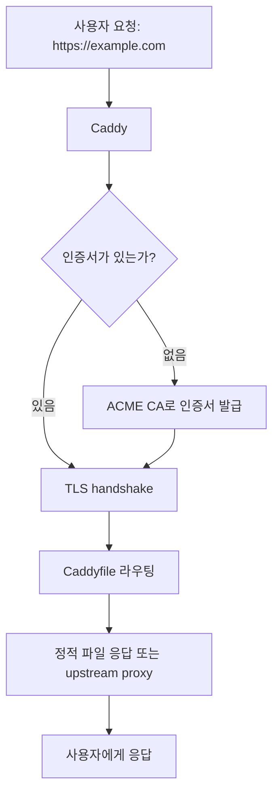
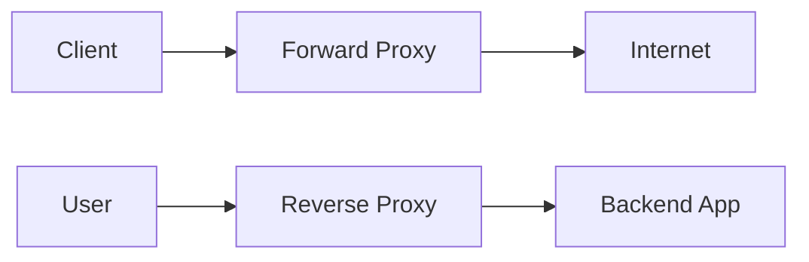
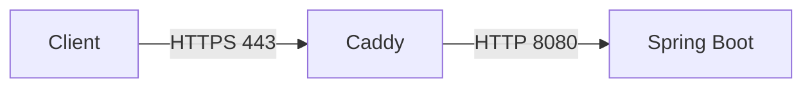

## Caddy를 왜 볼까?

웹 서버나 reverse proxy를 구성한다고 하면 보통 Nginx나 Apache를 먼저 떠올립니다.

Nginx는 고성능 reverse proxy와 정적 파일 서빙에 강하고, Apache는 오래된 생태계와 모듈, `.htaccess` 기반의 유연한 디렉터리별 설정으로 여전히 많이 사용됩니다.

그런데 개인 서버, 작은 서비스, 내부 도구, 사이드 프로젝트, Docker 기반 배포를 하다 보면 매번 비슷한 작업을 반복하게 됩니다.

- 도메인을 서버에 연결한다.
- 80, 443 포트를 열어둔다.
- Nginx나 Apache 설정을 작성한다.
- Let's Encrypt 인증서를 발급한다.
- HTTP를 HTTPS로 리다이렉트한다.
- 인증서 자동 갱신을 설정한다.
- upstream 애플리케이션으로 reverse proxy를 연결한다.

Caddy는 이 반복 작업 중 특히 **HTTPS 설정과 인증서 운영**을 굉장히 과감하게 단순화한 웹 서버입니다. Caddy 공식 문서에서도 기본적으로 사이트를 HTTPS로 제공하고, 공개 DNS 이름은 Let's Encrypt나 ZeroSSL 같은 ACME CA를 통해 인증서를 자동으로 발급한다고 설명합니다.

즉 Caddy의 핵심은 다음 한 문장으로 요약할 수 있습니다.

> "웹 서버와 reverse proxy 설정에서 TLS 운영을 기본값으로 끌어올린 서버"

이 글에서는 Caddy의 주요 특징, Caddyfile 설정법, reverse proxy와 SSL 예시, Docker 구성, 그리고 Nginx/Apache와 비교했을 때 어떤 점이 다른지 정리합니다.

---

## 1. 문제 이해 / 요구사항 정리

이 글에서 다루는 조건은 다음과 같습니다.

- 웹 서버 또는 reverse proxy를 구성해야 한다.
- 정적 파일을 서빙하거나 Spring Boot, Node.js, Go API 같은 애플리케이션 앞단에 proxy를 둔다.
- HTTPS 인증서 발급과 갱신을 자동화하고 싶다.
- Nginx/Apache와 비교했을 때 Caddy를 선택할 이유가 있는지 판단하고 싶다.
- 실제로 사용할 수 있는 Caddyfile 예제가 필요하다.

목표는 다음과 같습니다.

- Caddy의 핵심 특징을 이해한다.
- `Caddyfile` 기본 문법을 익힌다.
- reverse proxy, static file server, SSL, load balancing, Docker 예제를 정리한다.
- Nginx/Apache와의 차이를 운영 관점에서 비교한다.
- Caddy를 쓰면 좋은 경우와 피하는 것이 나은 경우를 구분한다.

---

## 2. Caddy란?

Caddy는 Go로 작성된 오픈소스 웹 서버입니다. 용도만 보면 Nginx나 Apache처럼 사용할 수 있습니다.

- 정적 파일 서버
- reverse proxy
- TLS termination
- HTTP to HTTPS redirect
- load balancing
- response compression
- access logging
- basic authentication
- OpenTelemetry tracing
- Admin API 기반 동적 설정

하지만 Caddy가 다른 웹 서버와 가장 크게 다른 지점은 **자동 HTTPS가 기본 동작**이라는 점입니다.

예를 들어 다음 설정만으로 `example.com`에 대한 HTTPS reverse proxy가 구성됩니다.

```caddyfile
example.com {
    reverse_proxy 127.0.0.1:8080
}
```

Nginx라면 `server_name`, `listen 443 ssl`, `ssl_certificate`, `ssl_certificate_key`, Certbot 설정, HTTP 리다이렉트 서버 블록 등을 별도로 관리하는 경우가 많습니다.

반면 Caddy는 도메인이 공개 DNS로 올바르게 연결되어 있고 80/443 포트에 접근 가능하다면, 인증서 발급과 갱신, HTTP에서 HTTPS로의 리다이렉트를 자동으로 처리합니다.

전체 흐름은 대략 다음과 같습니다.



---

## 3. Caddy의 핵심 특징

### 3.1. 자동 HTTPS

Caddy의 대표 기능은 자동 HTTPS입니다.

공개 도메인으로 사이트를 설정하면 Caddy가 ACME 프로토콜을 통해 인증서를 발급하고 갱신합니다. 또한 HTTP 요청을 HTTPS로 리다이렉트합니다.

```caddyfile
example.com {
    respond "hello caddy"
}
```

이 설정은 단순히 HTTP 서버 하나를 띄우는 것처럼 보이지만, 실제 공개 도메인 환경에서는 HTTPS가 기본으로 켜집니다.

운영 관점에서 이 차이는 꽤 큽니다.

- 인증서 발급 명령을 따로 실행하지 않아도 된다.
- 인증서 갱신 cron을 따로 관리하지 않아도 된다.
- HTTP에서 HTTPS로 보내는 리다이렉트 설정을 반복 작성하지 않아도 된다.
- 안전한 TLS 기본값을 직접 고르지 않아도 된다.

이것 때문에 Caddy는 작은 서비스나 개인 서버에서 특히 편합니다.

### 3.2. Caddyfile의 단순한 문법

Caddy는 내부적으로 JSON 설정을 사용합니다. 하지만 사람이 직접 작성할 때는 보통 `Caddyfile`을 사용합니다.

가장 작은 예시는 다음과 같습니다.

```caddyfile
:8080 {
    respond "hello caddy"
}
```

도메인 기반 설정은 다음처럼 작성합니다.

```caddyfile
example.com {
    root * /var/www/example
    file_server
}
```

여기서 `example.com`은 site block이고, 내부의 `root`, `file_server`는 directive입니다.

Caddyfile은 사람이 읽기 좋지만, 자동화에는 JSON 설정과 Admin API가 더 적합할 수 있습니다. Caddy 공식 문서도 Caddyfile은 설정 adapter이고, 자동화된 배포에서는 native JSON 구조와 API를 고려할 수 있다고 안내합니다.

### 3.3. reverse proxy가 기본 기능으로 강력하다

Caddy의 `reverse_proxy` directive는 여러 upstream, load balancing, health check, header 조작, streaming 등을 지원합니다.

가장 기본적인 reverse proxy는 다음과 같습니다.

```caddyfile
api.example.com {
    reverse_proxy 127.0.0.1:8080
}
```

Spring Boot 애플리케이션이 `localhost:8080`에서 떠 있다면, 외부 사용자는 `https://api.example.com`으로 접근하고 Caddy가 내부 애플리케이션으로 요청을 넘깁니다.

### 3.4. 정적 파일 서버로도 사용할 수 있다

정적 사이트를 서빙할 때는 `root`와 `file_server`를 같이 씁니다.

```caddyfile
example.com {
    root * /var/www/example
    encode zstd gzip
    file_server
}
```

`encode zstd gzip`은 클라이언트가 지원하는 경우 응답 압축을 적용합니다. `file_server`는 지정한 root 아래의 파일을 응답합니다.

### 3.5. 설정 reload가 쉽다

Caddyfile을 수정한 뒤에는 먼저 설정을 검증하고 reload하는 흐름을 추천합니다.

```bash
sudo caddy validate --config /etc/caddy/Caddyfile
sudo systemctl reload caddy
```

직접 `caddy run`으로 실행 중이라면 다음 명령도 사용할 수 있습니다.

```bash
caddy reload --config /etc/caddy/Caddyfile
```

Docker 컨테이너에서는 실행 중인 컨테이너 안에서 `caddy reload`를 호출하는 방식이 일반적입니다.

```bash
docker exec caddy caddy validate --config /etc/caddy/Caddyfile
docker exec caddy caddy reload --config /etc/caddy/Caddyfile
```

### 3.6. Admin API를 제공한다

Caddy는 기본적으로 `localhost:2019`에서 Admin API를 제공합니다.

이 API를 통해 현재 설정을 조회하거나, 새 설정을 로드하거나, JSON 설정의 일부만 변경할 수 있습니다.

```bash
curl http://localhost:2019/config/
```

운영자가 직접 Caddyfile을 수정하는 방식이라면 Admin API를 깊게 쓰지 않아도 됩니다. 하지만 동적으로 라우팅을 추가하는 플랫폼, 내부 PaaS, 여러 서비스의 reverse proxy 설정을 자동으로 생성하는 도구를 만든다면 Admin API가 유용합니다.

> Admin API는 강력한 만큼 접근 범위를 반드시 제한해야 합니다. 기본값은 localhost 바인딩이지만, 외부에 노출하면 설정 탈취나 임의 변경으로 이어질 수 있습니다.

### 3.7. TCP/UDP와 load balancing 지원 범위

Caddy를 볼 때 헷갈리기 쉬운 부분이 TCP 지원입니다.

Caddy는 HTTP/HTTPS 요청을 TCP 위에서 처리합니다. HTTP/3를 켜면 QUIC 때문에 UDP 443도 사용합니다. 그래서 Docker Compose 예제에서도 `443:443/udp`를 열어둡니다.

하지만 이것은 "Caddy 코어가 임의의 raw TCP/UDP 서비스를 reverse proxy한다"는 의미는 아닙니다. 기본 `reverse_proxy` directive는 Caddy의 HTTP app 안에서 동작하는 L7 HTTP reverse proxy입니다. 즉 Spring Boot, Node.js, Go API, 정적 웹 사이트처럼 HTTP 기반 upstream을 다루는 데 적합합니다.

지원 범위를 정리하면 다음과 같습니다.

| 기능 | Caddy 기본 배포판 | 비고 |
| --- | --- | --- |
| HTTP reverse proxy | 지원 | `reverse_proxy` directive |
| HTTP load balancing | 지원 | 여러 upstream, `lb_policy`, active/passive health check |
| HTTPS/TLS termination | 지원 | 자동 HTTPS 포함 |
| HTTP/3 | 지원 | UDP 443 포트 필요 |
| raw TCP proxy | 기본 미지원 | `caddy-l4` 같은 Layer 4 플러그인 필요 |
| raw UDP proxy | 기본 미지원 | `caddy-l4` 같은 Layer 4 플러그인 필요 |
| TCP/UDP load balancing | 기본 미지원 | 플러그인으로 가능하지만 운영 안정성은 별도 검토 필요 |

`caddy-l4`는 Caddy에 TCP/UDP Layer 4 app을 추가하는 플러그인입니다. README에서도 raw TCP/UDP connection을 다룰 수 있다고 설명하지만, 동시에 아직 development 상태이며 breaking change를 예상해야 한다고 안내합니다.

따라서 기준은 이렇게 잡는 편이 좋습니다.

- HTTP reverse proxy와 HTTPS 자동화가 목적이면 Caddy 기본 기능만으로 충분하다.
- TCP/UDP 서비스를 꼭 Caddy 뒤에 두고 싶다면 `caddy-l4`를 포함한 커스텀 빌드를 검토한다.
- TCP/UDP load balancer가 핵심 요구사항이면 HAProxy, Nginx stream, Envoy 같은 L4/L7 proxy를 함께 비교한다.

---

## 4. Caddy 설치

### 4.1. Ubuntu / Debian

공식 패키지 저장소를 사용하는 방식입니다.

```bash
sudo apt install -y debian-keyring debian-archive-keyring apt-transport-https curl
curl -1sLf 'https://dl.cloudsmith.io/public/caddy/stable/gpg.key' \
    | sudo gpg --dearmor -o /usr/share/keyrings/caddy-stable-archive-keyring.gpg
curl -1sLf 'https://dl.cloudsmith.io/public/caddy/stable/debian.deb.txt' \
    | sudo tee /etc/apt/sources.list.d/caddy-stable.list
sudo chmod o+r /usr/share/keyrings/caddy-stable-archive-keyring.gpg
sudo chmod o+r /etc/apt/sources.list.d/caddy-stable.list
sudo apt update
sudo apt install caddy
```

설치 후 systemd 서비스로 실행됩니다.

```bash
sudo systemctl status caddy
sudo systemctl enable caddy
sudo systemctl restart caddy
```

기본 설정 파일 위치는 보통 다음 경로입니다.

```text
/etc/caddy/Caddyfile
```

### 4.2. macOS

Homebrew를 쓴다면 다음처럼 설치할 수 있습니다.

```bash
brew install caddy
```

다만 Caddy 공식 문서 기준으로 Homebrew는 community-maintained 설치 방식입니다. 운영 서버라면 OS별 공식 패키지나 Docker 이미지를 먼저 검토하는 편이 좋습니다.

### 4.3. Docker

Docker에서는 공식 이미지를 사용할 수 있습니다.

```bash
docker pull caddy:2.11.3-alpine
```

2026년 5월 13일 기준 Docker Hub의 Caddy 공식 이미지 최신 stable Alpine 태그는 `2.11.3-alpine`입니다. 플러그인을 빌드할 때 쓰는 builder 이미지도 Alpine 계열로 맞추려면 `2.11.3-builder-alpine`을 사용하면 됩니다.

가장 기본적인 `docker-compose.yml`은 다음과 같습니다.

```yaml
services:
  caddy:
    image: caddy:2.11.3-alpine
    container_name: caddy
    restart: unless-stopped
    ports:
      - "80:80"
      - "443:443"
      - "443:443/udp"
    volumes:
      - ./Caddyfile:/etc/caddy/Caddyfile:ro
      - caddy_data:/data
      - caddy_config:/config

volumes:
  caddy_data:
  caddy_config:
```

여기서 중요한 볼륨은 `/data`입니다. 인증서와 관련된 상태가 저장되므로 컨테이너를 재생성해도 유지되어야 합니다.

---

## 5. Caddyfile 기본 구조

Caddyfile은 보통 다음 형태입니다.

```caddyfile
{
    email admin@example.com
}

example.com {
    root * /var/www/example
    encode zstd gzip
    file_server
}

api.example.com {
    reverse_proxy 127.0.0.1:8080
}
```

맨 위의 `{ ... }` 블록은 global options입니다. 여기서는 ACME 계정 이메일을 설정했습니다.

그 아래의 `example.com { ... }`, `api.example.com { ... }`은 각각 site block입니다.

자주 쓰는 directive는 다음과 같습니다.

| directive | 용도 |
| --- | --- |
| `root` | 정적 파일 root 경로 지정 |
| `file_server` | 정적 파일 응답 |
| `reverse_proxy` | upstream 서버로 요청 전달 |
| `encode` | gzip, zstd 등 응답 압축 |
| `header` | 응답 헤더 설정 |
| `redir` | 리다이렉트 |
| `rewrite` | 내부 경로 재작성 |
| `try_files` | 파일 존재 여부에 따른 rewrite |
| `handle` | 조건별 라우팅 블록 |
| `handle_path` | prefix 제거 후 라우팅 |
| `tls` | TLS 세부 설정 |
| `log` | access log 설정 |
| `basic_auth` | HTTP Basic Auth |

---

## 6. Proxy와 Reverse Proxy 구분

예제로 들어가기 전에 proxy와 reverse proxy의 방향을 먼저 구분하면 이후 설정이 훨씬 잘 읽힙니다.



forward proxy는 클라이언트가 외부로 나갈 때 중간에 둡니다. 회사망에서 외부 인터넷 접근을 제어하거나, 클라이언트 IP를 숨기는 용도에 가깝습니다.

reverse proxy는 서버 앞단에 둡니다. 사용자는 reverse proxy만 보고, reverse proxy가 내부 애플리케이션으로 요청을 전달합니다.

Caddy의 기본 강점은 reverse proxy입니다. 일반적인 forward proxy 서버가 필요하다면 Caddy plugin을 검토하거나, Squid 같은 전용 forward proxy를 고려하는 것이 더 자연스럽습니다.

---

## 7. 예제 1: 정적 파일 서버

정적 HTML, CSS, JS 파일을 `/var/www/blog`에서 서빙하는 예시입니다.

```caddyfile
blog.example.com {
    root * /var/www/blog
    encode zstd gzip
    file_server
}
```

디렉터리 목록을 보여주고 싶다면 `browse`를 붙일 수 있습니다.

```caddyfile
files.example.com {
    root * /srv/files
    file_server browse
}
```

다만 `browse`는 내부 파일 목록을 외부에 노출합니다. 공개 서비스에서는 필요한 경우에만 제한적으로 사용하는 것이 좋습니다.

---

## 8. 예제 2: Spring Boot / Node.js reverse proxy

Spring Boot가 `127.0.0.1:8080`에서 실행 중이라고 가정합니다.

```caddyfile
api.example.com {
    reverse_proxy 127.0.0.1:8080
}
```

Node.js 애플리케이션이 `127.0.0.1:3000`에서 실행 중이라면 다음처럼 바꾸면 됩니다.

```caddyfile
app.example.com {
    reverse_proxy 127.0.0.1:3000
}
```

이 설정만으로 외부는 HTTPS로 받고, 내부 애플리케이션에는 HTTP로 전달하는 구조가 됩니다.



이런 구조에서 애플리케이션은 직접 인증서를 알 필요가 없습니다. TLS는 Caddy가 종료하고, 애플리케이션은 내부 HTTP만 처리합니다.

---

## 9. 예제 3: 하나의 도메인에서 frontend와 API 나누기

SPA frontend는 정적 파일로 제공하고, `/api/*` 요청만 backend로 넘기는 예시입니다.

```caddyfile
example.com {
    encode zstd gzip

    handle_path /api/* {
        reverse_proxy 127.0.0.1:8080
    }

    handle {
        root * /var/www/frontend
        try_files {path} /index.html
        file_server
    }
}
```

여기서 `handle_path /api/*`는 `/api` prefix를 제거한 뒤 내부 backend로 전달합니다.

만약 backend가 `/api/users` 같은 prefix를 그대로 받아야 한다면 `handle_path` 대신 `handle`을 쓰는 편이 낫습니다.

```caddyfile
example.com {
    handle /api/* {
        reverse_proxy 127.0.0.1:8080
    }

    handle {
        root * /var/www/frontend
        try_files {path} /index.html
        file_server
    }
}
```

차이는 다음과 같습니다.

| 설정 | upstream으로 전달되는 경로 |
| --- | --- |
| `handle_path /api/*` | `/api` prefix 제거 |
| `handle /api/*` | 원래 path 유지 |

---

## 10. 예제 4: HTTPS 설정

### 10.1. 기본 자동 HTTPS

대부분의 공개 도메인은 별도 `tls` 설정이 필요 없습니다.

```caddyfile
example.com {
    reverse_proxy 127.0.0.1:8080
}
```

이 설정에서 Caddy는 자동으로 HTTPS를 활성화합니다.

### 10.2. ACME 이메일 설정

전역 이메일을 지정하고 싶다면 global options에 넣습니다.

```caddyfile
{
    email admin@example.com
}

example.com {
    reverse_proxy 127.0.0.1:8080
}
```

### 10.3. 직접 준비한 인증서 사용

회사 내부 인증서나 별도 인증서를 사용해야 한다면 `tls`에 인증서와 개인키 경로를 지정합니다.

```caddyfile
internal.example.com {
    tls /etc/ssl/certs/fullchain.pem /etc/ssl/private/privkey.pem
    reverse_proxy 10.0.0.10:8080
}
```

### 10.4. 내부용 인증서

로컬 개발이나 내부망에서는 Caddy의 internal CA를 사용할 수 있습니다.

```caddyfile
dev.localhost {
    tls internal
    reverse_proxy 127.0.0.1:3000
}
```

이 방식은 내부 테스트에는 편하지만, 클라이언트가 Caddy의 local root CA를 신뢰해야 브라우저 경고 없이 접근할 수 있습니다.

### 10.5. wildcard 인증서와 DNS challenge

`*.example.com` 같은 wildcard 인증서는 보통 DNS challenge가 필요합니다.

```caddyfile
*.example.com {
    tls {
        dns cloudflare {env.CF_API_TOKEN}
    }

    reverse_proxy 127.0.0.1:8080
}
```

주의할 점은 DNS provider 기능이 Caddy 기본 바이너리에 항상 포함되는 것이 아니라는 점입니다. Cloudflare 같은 DNS plugin이 포함된 Caddy를 빌드해야 할 수 있습니다.

### 10.6. Docker Compose로 Cloudflare DNS challenge 구성

이번에는 실제로 따라 할 수 있는 Docker Compose 예시를 정리합니다.

상황은 다음과 같습니다.

- 도메인은 Cloudflare에서 DNS를 관리한다.
- `example.com`, `*.example.com` 인증서를 DNS-01 challenge로 발급한다.
- Caddy는 Docker Compose로 실행한다.
- Cloudflare DNS provider 모듈을 포함한 커스텀 Caddy 이미지를 직접 빌드한다.
- Cloudflare API Token은 `.env` 파일로 컨테이너에 주입한다.

디렉터리 구조는 다음처럼 둡니다.

```text
caddy-cloudflare/
├── Caddyfile
├── Dockerfile
├── compose.yml
└── .env
```

먼저 `Dockerfile`입니다.

```dockerfile
FROM caddy:2.11.3-builder-alpine AS builder

RUN --mount=type=cache,target=/go/pkg/mod \
    --mount=type=cache,target=/root/.cache/go-build \
    xcaddy build \
    --with github.com/caddy-dns/cloudflare

FROM caddy:2.11.3-alpine

COPY --from=builder /usr/bin/caddy /usr/bin/caddy
```

첫 번째 stage에서는 `caddy:2.11.3-builder-alpine` 이미지로 Cloudflare DNS provider가 포함된 Caddy 바이너리를 빌드합니다. 두 번째 stage에서는 `caddy:2.11.3-alpine` 이미지 위에 새로 빌드한 `/usr/bin/caddy`만 덮어씁니다.

다음은 `compose.yml`입니다.

```yaml
services:
  caddy:
    build:
      context: .
      dockerfile: Dockerfile
    image: local/caddy-cloudflare:2
    container_name: caddy
    restart: unless-stopped
    env_file:
      - .env
    ports:
      - "80:80"
      - "443:443"
      - "443:443/udp"
    volumes:
      - ./Caddyfile:/etc/caddy/Caddyfile:ro
      - caddy_data:/data
      - caddy_config:/config
    networks:
      - web

  app:
    image: nginx:alpine
    container_name: sample-app
    restart: unless-stopped
    networks:
      - web

volumes:
  caddy_data:
  caddy_config:

networks:
  web:
    driver: bridge
```

`app` 서비스는 예시용 upstream입니다. 실제 환경에서는 Spring Boot, Node.js, Go API 같은 애플리케이션 서비스로 바꾸면 됩니다.

다음은 `.env`입니다.

```dotenv
CF_API_TOKEN=cloudflare_api_token_value
ACME_EMAIL=admin@example.com
```

Cloudflare API Token은 가능하면 계정 전체 권한이 아니라 특정 zone에 제한된 토큰으로 만드는 것이 좋습니다. `caddy-dns/cloudflare` README 기준으로 단일 토큰 방식은 대상 zone에 대해 `Zone.Zone:Read`, `Zone.DNS:Edit` 권한이 필요합니다.

다음은 `Caddyfile`입니다.

```caddyfile
{
    email {$ACME_EMAIL}
}

example.com, *.example.com {
    tls {
        dns cloudflare {env.CF_API_TOKEN}
        resolvers 1.1.1.1
    }

    @app host app.example.com
    handle @app {
        reverse_proxy app:80
    }

    handle {
        respond "not found" 404
    }
}
```

여기서 중요한 점은 `reverse_proxy app:80`입니다. Docker Compose 안에서는 같은 network에 있는 서비스 이름이 DNS 이름처럼 동작하므로, 컨테이너 IP를 직접 쓰지 않아도 됩니다.

`example.com, *.example.com` site block은 apex domain과 wildcard domain에 대해 DNS challenge를 사용하겠다는 의미입니다. 그 안에서 `@app host app.example.com` matcher로 특정 subdomain만 `app` 컨테이너로 보냅니다.

실행은 다음 순서로 합니다.

```bash
docker compose build caddy
docker compose up -d
docker compose exec caddy caddy list-modules | grep cloudflare
docker compose logs -f caddy
```

`caddy list-modules | grep cloudflare` 결과에 `dns.providers.cloudflare`가 보이면 Cloudflare DNS module이 포함된 바이너리로 실행 중인 것입니다.

Caddyfile을 수정한 뒤에는 다음처럼 검증하고 reload합니다.

```bash
docker compose exec -w /etc/caddy caddy caddy validate
docker compose exec -w /etc/caddy caddy caddy reload
```

DNS challenge가 정상 동작하면 Caddy는 `_acme-challenge.example.com` TXT 레코드를 Cloudflare API로 임시 생성하고, ACME CA 검증이 끝난 뒤 정리합니다.

만약 다음과 같은 오류를 만나면 토큰이 컨테이너에 제대로 주입되지 않았을 가능성이 큽니다.

```text
Invalid request headers
```

이 경우에는 `.env` 파일명, `env_file`, 토큰 값 앞뒤 공백, 컨테이너 내부 환경변수를 확인합니다.

```bash
docker compose exec caddy sh -c 'test -n "$CF_API_TOKEN" && echo "CF_API_TOKEN is set"'
```

또 다른 흔한 오류는 DNS 전파 확인 타임아웃입니다.

```text
timed out waiting for record to fully propagate
```

이 경우 Cloudflare 대시보드에서 `_acme-challenge` TXT 레코드가 실제로 생성되는지 보고, 필요하면 `tls` 블록에 `resolvers 1.1.1.1` 같은 resolver 설정을 둡니다. 위 예제에는 이 값을 미리 넣어두었습니다.

> 운영에서는 `.env` 파일을 git에 커밋하지 않아야 합니다. 예제용 저장소에 올릴 때는 `.env.example`만 커밋하고 실제 토큰은 서버나 배포 시스템의 secret store에서 주입하는 편이 안전합니다.

---

## 11. 예제 5: load balancing과 health check

여러 backend로 요청을 분산하려면 upstream을 여러 개 나열합니다.

```caddyfile
api.example.com {
    reverse_proxy 10.0.1.10:8080 10.0.1.11:8080 {
        lb_policy round_robin
        health_uri /actuator/health
        health_interval 10s
        health_timeout 2s
    }
}
```

이 설정은 두 backend로 round-robin 방식 요청 분산을 수행하고, `/actuator/health`를 이용해 active health check를 수행합니다.

더 단순하게는 다음처럼만 써도 됩니다.

```caddyfile
api.example.com {
    reverse_proxy 10.0.1.10:8080 10.0.1.11:8080
}
```

다만 운영 환경에서는 health check와 timeout 정책을 명시하는 편이 장애 전파를 줄이는 데 도움이 됩니다.

---

## 12. 예제 6: access log와 보안 헤더

```caddyfile
example.com {
    log {
        output file /var/log/caddy/example.access.log {
            roll_size 100MiB
            roll_keep 10
            roll_keep_for 720h
        }
        format json
    }

    header {
        Strict-Transport-Security "max-age=31536000; includeSubDomains; preload"
        X-Content-Type-Options "nosniff"
        X-Frame-Options "DENY"
        Referrer-Policy "strict-origin-when-cross-origin"
    }

    reverse_proxy 127.0.0.1:8080
}
```

`Strict-Transport-Security`는 강력한 설정입니다. 특히 `includeSubDomains`와 `preload`를 넣으면 하위 도메인까지 HTTPS 강제가 적용될 수 있으므로, 모든 하위 도메인이 HTTPS를 안정적으로 지원할 때만 사용해야 합니다.

---

## 13. 예제 7: basic auth로 내부 도구 보호하기

내부 관리자 페이지나 간단한 도구를 보호할 때 `basic_auth`를 사용할 수 있습니다.

먼저 해시된 비밀번호를 생성합니다.

```bash
caddy hash-password
```

그 다음 Caddyfile에 넣습니다.

```caddyfile
admin.example.com {
    basic_auth {
        ydj515 $2a$14$exampleHashedPasswordValue
    }

    reverse_proxy 127.0.0.1:9000
}
```

비밀번호 원문을 Caddyfile에 직접 넣으면 안 됩니다. 반드시 `caddy hash-password`로 생성한 해시를 사용해야 합니다.

---

## 14. Nginx 설정과 비교

같은 reverse proxy를 Nginx로 작성하면 대략 다음과 같습니다.

```nginx
server {
    listen 80;
    server_name api.example.com;

    location / {
        proxy_pass http://127.0.0.1:8080;
        proxy_set_header Host $host;
        proxy_set_header X-Real-IP $remote_addr;
        proxy_set_header X-Forwarded-For $proxy_add_x_forwarded_for;
        proxy_set_header X-Forwarded-Proto $scheme;
    }
}
```

HTTPS까지 포함하면 일반적으로 `listen 443 ssl`, `ssl_certificate`, `ssl_certificate_key`, HTTP to HTTPS redirect 설정이 추가됩니다. Certbot을 사용한다면 Certbot이 Nginx 설정 일부를 자동 수정하기도 합니다.

Caddy에서는 같은 의도가 다음 정도로 줄어듭니다.

```caddyfile
api.example.com {
    reverse_proxy 127.0.0.1:8080
}
```

물론 이것이 항상 Caddy가 더 낫다는 의미는 아닙니다.

Nginx는 다음 상황에서 여전히 강합니다.

- 매우 세밀한 proxy/cache/tuning이 필요하다.
- 이미 조직에 Nginx 운영 표준과 관측 체계가 있다.
- Nginx Plus 또는 Nginx 생태계 기능을 사용한다.
- 트래픽 규모가 크고 기존에 검증된 설정을 그대로 가져가야 한다.

반면 Caddy는 다음 상황에서 강합니다.

- 도메인별 HTTPS reverse proxy를 빠르게 붙이고 싶다.
- 인증서 발급과 갱신 운영 부담을 줄이고 싶다.
- 개인 서버나 작은 팀에서 설정 파일을 단순하게 유지하고 싶다.
- Docker Compose 기반으로 여러 서비스를 쉽게 노출하고 싶다.

---

## 15. Apache 설정과 비교

Apache에서 reverse proxy를 하려면 보통 관련 모듈을 활성화합니다.

```bash
sudo a2enmod proxy
sudo a2enmod proxy_http
sudo a2enmod headers
sudo a2enmod ssl
sudo systemctl restart apache2
```

설정은 대략 다음과 같습니다.

```apache
<VirtualHost *:80>
    ServerName api.example.com

    ProxyPreserveHost On
    ProxyPass / http://127.0.0.1:8080/
    ProxyPassReverse / http://127.0.0.1:8080/
</VirtualHost>
```

Apache는 굉장히 오래된 생태계와 풍부한 모듈을 가지고 있습니다. 공식 문서에서도 Apache httpd는 modular server이며, 기능은 모듈로 확장된다고 설명합니다. 또한 `.htaccess`를 통해 디렉터리별 분산 설정을 할 수 있습니다.

이 특징은 공유 호스팅이나 오래된 PHP 애플리케이션에서는 장점입니다. 반대로 컨테이너 기반 현대 배포에서는 `.htaccess`가 매 요청마다 읽히는 구조나 많은 모듈 조합이 운영 복잡도를 높일 수 있습니다.

Caddy와 비교하면 Apache는 다음 쪽에 더 가깝습니다.

- 오래된 웹 애플리케이션 호환성
- `.htaccess` 기반 분산 설정
- PHP/mod_php 중심의 전통적인 호스팅
- 풍부한 모듈과 오래된 운영 사례

Caddy는 다음 쪽에 더 가깝습니다.

- 간단한 reverse proxy
- 자동 HTTPS
- 단일 바이너리와 간결한 설정
- JSON API 기반 동적 설정
- 컨테이너 기반 배포와 작은 서비스 노출

---

## 16. 확장 방식 비교: Caddy는 .so를 런타임에 붙이는 방식이 아니다

Caddy를 Nginx/Apache와 비교할 때 HTTPS 자동화만큼 중요한 차이가 **모듈 확장 방식**입니다.

Nginx와 Apache는 C 기반 서버이고, 필요한 기능을 shared object 파일로 만들어 로딩하는 방식이 익숙합니다. 반면 Caddy는 Go 기반 서버이고, 공식 문서에서도 "single, self-contained, static binary"를 지향한다고 설명합니다. 즉 Caddy는 기본적으로 필요한 모듈 코드가 **Caddy 바이너리 안에 컴파일되어 있어야** 합니다.

여기서 중요한 차이는 다음과 같습니다.

| 항목 | Caddy | Nginx | Apache |
| --- | --- | --- | --- |
| 확장 단위 | Caddy module, Go module | dynamic module, `.so` | DSO module, `.so` |
| 로딩 방식 | 빌드 시 바이너리에 포함 | `load_module`로 설정에 추가 후 reload | `LoadModule`로 설정에 추가 후 restart/reload |
| 추가 방식 | `xcaddy build --with ...` | 패키지 설치 또는 모듈 빌드 후 `.so` 로딩 | `apxs` 또는 패키지로 `.so` 빌드/설치 |
| 설정 시점 | 설정은 런타임 로드, 모듈 코드는 빌드 타임 포함 | 설정 reload 시 `.so` 로드 가능 | 서버 시작/재시작 시 DSO 로드 |
| 배포 특징 | 커스텀 Caddy 바이너리/이미지 배포 | 바이너리와 모듈 파일 호환성 관리 | httpd와 DSO 모듈 호환성 관리 |

### 16.1. Nginx: `.so` dynamic module을 `load_module`로 로딩

Nginx Open Source에서도 일부 모듈은 dynamic module로 제공됩니다. 공식 문서 기준으로 dynamic module은 shared object, 즉 `.so` 파일이며 `load_module` directive로 설정에 연결합니다.

예를 들어 njs 모듈을 로딩한다면 다음처럼 작성합니다.

```nginx
load_module modules/ngx_http_js_module.so;
load_module modules/ngx_stream_js_module.so;

events {}

http {
    server {
        listen 80;

        location / {
            return 200 "hello nginx module\n";
        }
    }
}
```

그리고 설정 검증 후 reload합니다.

```bash
sudo nginx -t
sudo systemctl reload nginx
```

엄밀히 말하면 "실행 중인 프로세스에 아무 파일이나 즉시 주입한다"기보다는, `nginx.conf`의 main context에 `load_module`을 추가하고 reload하면서 master/worker 프로세스 라이프사이클에 맞춰 로딩하는 방식입니다.

이 방식의 장점은 모듈 파일과 설정을 분리할 수 있다는 점입니다. 단점은 Nginx 버전, 컴파일 옵션, 모듈 ABI 호환성을 신경 써야 한다는 점입니다. 그래서 운영에서는 보통 OS 패키지나 공식 저장소에서 제공하는 모듈을 쓰는 편이 안전합니다.

### 16.2. Apache: DSO 모듈을 `LoadModule`로 로딩

Apache도 Dynamic Shared Object, 즉 DSO 방식으로 모듈을 로딩할 수 있습니다.

예를 들어 proxy 관련 모듈은 다음처럼 로딩합니다.

```apache
LoadModule proxy_module modules/mod_proxy.so
LoadModule proxy_http_module modules/mod_proxy_http.so

<VirtualHost *:80>
    ServerName api.example.com

    ProxyPass / http://127.0.0.1:8080/
    ProxyPassReverse / http://127.0.0.1:8080/
</VirtualHost>
```

서드파티 모듈은 `apxs`를 이용해 Apache 소스 트리 밖에서 DSO로 빌드할 수 있습니다.

```bash
apxs -cia mod_example.c
```

Apache의 장점은 오래된 모듈 생태계와 DSO 방식의 유연성입니다. 다만 모듈 조합이 많아질수록 서버 시작 시점의 의존성, ABI 호환성, 설정 복잡도를 함께 관리해야 합니다.

### 16.3. Caddy: Go module을 포함한 커스텀 바이너리를 빌드

Caddy는 구조가 다릅니다. Caddy의 module은 Go package로 작성되고, 해당 package가 import되면서 `caddy.RegisterModule(...)`로 자신을 등록합니다. 따라서 서드파티 플러그인을 쓰려면 보통 `xcaddy`로 Caddy를 다시 빌드합니다.

예를 들어 Cloudflare DNS challenge 플러그인을 포함한 Caddy를 만들려면 다음처럼 빌드합니다.

```bash
xcaddy build \
  --with github.com/caddy-dns/cloudflare
```

빌드 결과물은 플러그인이 포함된 새로운 `caddy` 바이너리입니다.

```bash
./caddy list-modules | grep cloudflare
```

Docker에서는 보통 multi-stage build를 사용합니다.

```dockerfile
FROM caddy:2.11.3-builder-alpine AS builder

RUN xcaddy build \
    --with github.com/caddy-dns/cloudflare

FROM caddy:2.11.3-alpine

COPY --from=builder /usr/bin/caddy /usr/bin/caddy
```

그리고 Caddyfile에서는 해당 모듈이 이미 바이너리에 들어 있다고 가정하고 설정만 작성합니다.

```caddyfile
{
    email admin@example.com
}

*.example.com {
    tls {
        dns cloudflare {env.CF_API_TOKEN}
    }

    reverse_proxy 127.0.0.1:8080
}
```

만약 `cloudflare` DNS provider 모듈이 포함되지 않은 기본 Caddy 바이너리에서 위 설정을 사용하면, Caddy는 해당 모듈을 알 수 없어서 설정 로드에 실패합니다.

핵심은 다음입니다.

> Caddy는 설정을 런타임에 reload할 수 있지만, 새로운 플러그인 코드는 런타임에 `.so`처럼 추가하는 것이 아니라 빌드 타임에 바이너리에 포함해야 한다.

이 방식의 장점은 배포 결과물이 단순하다는 점입니다. 필요한 모듈이 들어간 단일 바이너리나 컨테이너 이미지만 배포하면 됩니다. 반대로 단점은 플러그인을 추가하거나 버전을 바꾸려면 바이너리 또는 이미지를 다시 빌드해야 한다는 점입니다.

### 16.4. 그래서 운영 관점에서 무엇이 달라질까?

Caddy에서 서드파티 플러그인을 쓴다면 운영 단위가 `설정 파일 + 모듈 .so`가 아니라 `설정 파일 + 커스텀 Caddy 바이너리`가 됩니다.

예를 들어 Nginx에서는 다음처럼 생각할 수 있습니다.

```text
nginx binary
nginx.conf
modules/ngx_http_js_module.so
modules/ngx_otel_module.so
```

Caddy에서는 다음처럼 생각하는 편이 맞습니다.

```text
custom caddy binary
Caddyfile
```

컨테이너 환경에서는 더 명확합니다.

```text
custom caddy image
├── /usr/bin/caddy
└── /etc/caddy/Caddyfile
```

이 차이를 모르고 Caddy 기본 이미지에 DNS provider 설정만 추가하면 "왜 Caddyfile은 맞는 것 같은데 모듈을 못 찾지?" 같은 상황을 만나기 쉽습니다.

---

## 17. Caddy vs Nginx vs Apache 요약

| 항목 | Caddy | Nginx | Apache |
| --- | --- | --- | --- |
| 기본 철학 | HTTPS 자동화와 쉬운 설정 | 고성능 event-driven reverse proxy | 모듈 기반 범용 웹 서버 |
| 설정 파일 | Caddyfile 또는 JSON | nginx.conf | httpd.conf, VirtualHost, .htaccess |
| HTTPS | 기본 자동화 | 별도 인증서/Certbot 구성 일반적 | 별도 인증서/Certbot 구성 일반적 |
| reverse proxy | 간결하고 강력함 | 매우 강력하고 널리 검증됨 | 모듈 기반으로 가능 |
| HTTP load balancing | 기본 지원 | 기본 지원 | `mod_proxy_balancer`로 지원 |
| TCP/UDP proxy | 기본 미지원, `caddy-l4` 같은 플러그인 필요 | `stream` 모듈로 지원 가능 | 범용 L4 proxy 용도는 주력 아님 |
| TCP/UDP load balancing | 기본 미지원, 플러그인 영역 | `stream` 모듈 또는 Nginx Plus로 지원 | 일반적으로 별도 L4 proxy를 고려 |
| 정적 파일 | 가능 | 매우 강함 | 가능 |
| 동적 설정 | Admin API 제공 | 오픈소스 기본판은 제한적 | 일반적으로 파일 기반 |
| 플러그인/모듈 | Go module을 포함해 커스텀 바이너리 빌드 | `.so` dynamic module을 `load_module`로 로딩 가능 | `.so` DSO module을 `LoadModule`로 로딩 가능 |
| 러닝 커브 | 낮음 | 중간 | 중간에서 높음 |
| 좋은 사용처 | 개인 서버, 작은 팀, 빠른 HTTPS proxy | 대규모 reverse proxy, 캐시, 표준화된 운영 | 레거시/PHP/공유 호스팅 |

---

## 18. 운영 체크리스트

Caddy를 운영에 올릴 때는 다음을 확인하는 것이 좋습니다.

- DNS의 A/AAAA 레코드가 Caddy 서버를 바라보는지 확인한다.
- 서버 방화벽과 클라우드 보안 그룹에서 80, 443 포트를 열어둔다.
- Docker 사용 시 `/data` 볼륨을 반드시 영속화한다.
- Caddyfile 수정 후 `caddy validate`를 먼저 실행한다.
- reload 전에 access log와 error log 위치를 확인한다.
- CDN 뒤에 둘 경우 `trusted_proxies` 설정을 검토한다.
- wildcard 인증서가 필요하면 DNS challenge plugin 포함 여부를 확인한다.
- 서드파티 플러그인을 쓰는 경우 기본 Caddy 바이너리가 아니라 커스텀 빌드인지 확인한다.
- Admin API를 외부에 노출하지 않는다.
- HSTS preload는 충분히 검증한 뒤 적용한다.

CDN이나 L4/L7 load balancer 뒤에 Caddy를 둘 때는 실제 client IP 처리도 중요합니다.

```caddyfile
{
    servers {
        trusted_proxies static 10.0.0.0/8 172.16.0.0/12 192.168.0.0/16
    }
}

example.com {
    reverse_proxy 127.0.0.1:8080
}
```

위 예시는 사설망 proxy를 신뢰하는 형태입니다. Cloudflare 같은 CDN을 쓴다면 해당 CDN의 IP range를 기준으로 설정해야 합니다.

---

## 19. 주의사항

> - Caddy의 자동 HTTPS는 도메인이 올바르게 서버를 바라보고 80/443 포트가 열려 있어야 정상 동작한다.
> - wildcard 인증서나 일부 DNS challenge는 provider plugin이 포함된 Caddy 빌드가 필요할 수 있다.
> - Caddy의 서드파티 플러그인은 Nginx/Apache의 `.so`처럼 설정 파일에서 바로 로딩하는 방식이 아니라, 보통 `xcaddy`로 커스텀 바이너리를 다시 빌드해야 한다.
> - Caddy 기본 `reverse_proxy`는 HTTP reverse proxy이므로, MySQL, PostgreSQL, SSH, MQTT 같은 raw TCP 서비스를 그대로 프록시하려면 `caddy-l4` 같은 Layer 4 플러그인이나 별도 L4 proxy를 검토해야 한다.
> - Docker에서 `/data` 볼륨을 날리면 인증서 상태도 함께 사라질 수 있으므로 반드시 영속화해야 한다.
> - Admin API는 설정을 바꿀 수 있는 강력한 엔드포인트이므로 외부에 노출하지 않는 것이 기본이다.
> - `handle_path`는 prefix를 제거하므로 backend가 원래 path를 기대한다면 `handle`을 사용해야 한다.
> - HSTS의 `includeSubDomains`와 `preload`는 되돌리기 어려운 운영 영향을 만들 수 있으므로 충분히 검증한 뒤 적용해야 한다.
> - Caddyfile은 사용하기 쉽지만 directive 정렬 규칙이 있으므로 실행 순서를 강하게 제어해야 한다면 `route`를 검토해야 한다.

---

## 20. 대안

### 대안 1. Nginx

장점은 다음과 같습니다.

- 대규모 트래픽 운영 사례가 많다.
- reverse proxy, cache, rate limiting, buffering 등 세밀한 튜닝 자료가 많다.
- 조직 표준으로 채택된 경우 운영 인력이 익숙하다.

단점은 다음과 같습니다.

- HTTPS와 인증서 자동 갱신은 별도 도구나 설정이 필요하다.
- 간단한 서비스 하나를 붙일 때도 설정이 길어질 수 있다.
- 일부 동적 설정은 오픈소스 기본 기능만으로는 불편할 수 있다.

### 대안 2. Apache HTTP Server

장점은 다음과 같습니다.

- 오래된 웹 애플리케이션과 호환성이 좋다.
- `.htaccess`로 디렉터리별 설정 위임이 가능하다.
- 모듈 생태계가 오래되고 풍부하다.

단점은 다음과 같습니다.

- 현대적인 reverse proxy 전용 구성에서는 Nginx나 Caddy보다 설정이 무겁게 느껴질 수 있다.
- `.htaccess`는 편하지만 요청마다 설정 파일을 확인하는 비용과 운영 복잡도를 만들 수 있다.
- HTTPS 자동화는 별도 구성이 필요하다.

### 대안 3. Traefik

장점은 다음과 같습니다.

- Docker, Kubernetes 같은 동적 인프라와 잘 맞는다.
- service discovery와 label 기반 라우팅이 편하다.
- Let's Encrypt 자동화도 지원한다.

단점은 다음과 같습니다.

- 단일 서버에서 간단한 Caddyfile 하나로 끝낼 수 있는 상황에서는 오히려 개념이 많다.
- 정적 설정과 동적 설정의 구분을 이해해야 한다.
- Kubernetes/컨테이너 중심이 아니라면 학습 비용이 크게 느껴질 수 있다.

---

## 21. 언제 Caddy를 선택하면 좋을까?

Caddy는 다음 상황에서 특히 좋습니다.

- 개인 서버에서 여러 서비스를 도메인별로 노출한다.
- Docker Compose로 여러 앱을 띄우고 HTTPS를 간단히 붙이고 싶다.
- Nginx 설정과 Certbot 설정을 반복 작성하는 것이 부담스럽다.
- 작은 팀에서 운영 복잡도를 줄이고 싶다.
- 내부 도구나 사이드 프로젝트를 빠르게 HTTPS로 배포하고 싶다.
- reverse proxy 앞단에서 TLS termination만 안정적으로 처리하고 싶다.

반대로 다음 상황이라면 다른 선택지가 나을 수 있습니다.

- 이미 Nginx 기반 운영 표준과 수많은 튜닝 설정이 있다.
- 고급 캐싱, WAF, 상용 지원, 복잡한 traffic shaping이 중요하다.
- Apache의 `.htaccess` 호환성이 반드시 필요하다.
- Kubernetes ingress controller나 service discovery 중심의 동적 라우팅이 핵심이다.

개인적으로는 다음 기준이 가장 실용적이라고 생각합니다.

> "HTTPS reverse proxy를 쉽고 안전하게 붙이는 것이 목적이면 Caddy부터 보고, 복잡한 대규모 트래픽 제어가 목적이면 Nginx/전용 LB를 검토한다."

---

## 22. 마무리

Caddy는 Nginx나 Apache를 완전히 대체하는 "상위 호환"이라기보다는, 운영자가 자주 반복하던 HTTPS reverse proxy 설정을 훨씬 단순하게 만들어주는 웹 서버에 가깝습니다.

특히 다음 설정의 인상이 강합니다.

```caddyfile
example.com {
    reverse_proxy 127.0.0.1:8080
}
```

이 정도 설정으로 공개 도메인 HTTPS, 인증서 발급, 갱신, HTTP to HTTPS 리다이렉트까지 처리된다는 점은 Caddy의 가장 큰 차별점입니다.

Nginx와 Apache는 여전히 강력하고, 대규모 운영 경험도 훨씬 풍부합니다. 하지만 작은 서비스, 개인 서버, Docker Compose 기반 배포, 내부 도구 노출 같은 상황에서는 Caddy가 설정 복잡도를 확실히 줄여줍니다.

---

## 참고 자료

- [Caddy Automatic HTTPS](https://caddyserver.com/docs/automatic-https)
- [Caddy reverse_proxy directive](https://caddyserver.com/docs/caddyfile/directives/reverse_proxy)
- [Caddy file_server directive](https://caddyserver.com/docs/caddyfile/directives/file_server)
- [Caddyfile Directives](https://caddyserver.com/docs/caddyfile/directives)
- [Caddy Install](https://caddyserver.com/docs/install)
- [Caddy Admin API](https://caddyserver.com/docs/api)
- [Caddy Architecture](https://caddyserver.com/docs/architecture)
- [Caddy Extending Caddy](https://caddyserver.com/docs/extending-caddy)
- [Caddy Build from source](https://caddyserver.com/docs/build)
- [Caddy Docker Official Image](https://hub.docker.com/_/caddy)
- [caddy-dns/cloudflare](https://github.com/caddy-dns/cloudflare)
- [mholt/caddy-l4](https://github.com/mholt/caddy-l4)
- [NGINX Reverse Proxy](https://docs.nginx.com/nginx/admin-guide/web-server/reverse-proxy)
- [NGINX Dynamic Modules](https://docs.nginx.com/nginx/admin-guide/dynamic-modules/dynamic-modules/)
- [NGINX TCP and UDP Load Balancing](https://docs.nginx.com/nginx/admin-guide/load-balancer/tcp-udp-load-balancer/)
- [Apache HTTP Server MPM](https://httpd.apache.org/docs/current/en/mpm.html)
- [Apache Configuration Files](https://httpd.apache.org/docs/current/configuring.html)
- [Apache Dynamic Shared Object Support](https://httpd.apache.org/docs/current/dso.html)
- [Apache mod_proxy_balancer](https://httpd.apache.org/docs/2.4/en/mod/mod_proxy_balancer.html)
