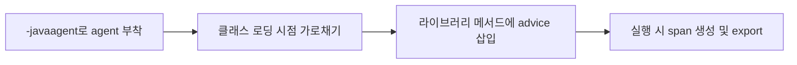
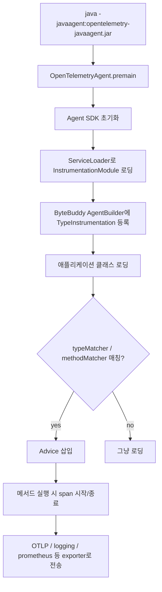

## OpenTelemetry Java Agent란

OpenTelemetry는 애플리케이션의 trace, metric, log 같은 관측 데이터를 수집하고 내보내기 위한 표준과 구현체입니다. 그중 OpenTelemetry Java Agent는 Java 애플리케이션을 실행할 때 `-javaagent` 옵션으로 붙여, 애플리케이션 코드를 직접 수정하지 않고도 자동계측을 수행하게 해주는 런타임 에이전트입니다.

쉽게 말해, 개발자가 코드 곳곳에 OpenTelemetry API를 직접 넣지 않아도 Spring MVC, Servlet, JDBC 같은 널리 쓰이는 라이브러리의 실행 지점을 가로채서 span 같은 telemetry 데이터를 만들어 주는 도구입니다. 흔히 말하는 zero-code instrumentation이 이 방식입니다.

이 글에서는 특히 trace와 span이 어떻게 자동으로 만들어지는지에 집중합니다. 목표는 두 가지입니다.

1. OpenTelemetry Java Agent가 Spring Boot 요청을 어떻게 HTTP, Controller, JDBC span으로 나누어 잡는지 이해한다.
2. 그 원리를 바탕으로 CUBRID 같은 미지원 JDBC 드라이버를 추가할 때 어디를 확장해야 하는지 판단한다.

자동 계측의 흐름을 짧게 요약하면 다음과 같습니다.

1. JVM이 애플리케이션 `main()`보다 먼저 OpenTelemetry Java Agent를 로딩합니다.
2. agent가 ByteBuddy를 이용해 Spring MVC, Servlet, JDBC 같은 라이브러리의 특정 클래스와 메서드를 찾습니다.
3. 클래스가 JVM에 로딩되는 시점에, 그 메서드 앞뒤로 span 시작/종료 로직을 담은 코드를 삽입합니다.
4. 이후 실제 요청이 들어와 해당 메서드가 실행되면, 삽입된 코드가 span을 만들고 exporter로 내보냅니다.

즉 핵심은 "애플리케이션 소스를 직접 바꾸는 것"이 아니라 "JVM에 올라가는 라이브러리 바이트코드를 로딩 시점에 변환하는 것"입니다.

아주 작게 요약하면 흐름은 아래처럼 볼 수 있습니다.



예를 들어 Spring Boot 애플리케이션에 `opentelemetry-javaagent.jar`를 붙이면, 코드 수정 없이도 HTTP 요청, Controller 실행, JDBC 쿼리 같은 흐름이 span으로 잡힙니다.

```bash
java \
  -javaagent:/opt/otel/opentelemetry-javaagent.jar \
  -Dotel.service.name=order-api \
  -Dotel.traces.exporter=otlp \
  -Dotel.exporter.otlp.endpoint=http://localhost:4317 \
  -jar build/libs/order-api.jar
```

위 과정을 실제로 구현할 때 핵심적으로 쓰이는 도구가 ByteBuddy입니다.

> **ByteBuddy란?**  
> Java 바이트코드를 런타임에 생성하거나 수정할 수 있게 해주는 라이브러리입니다. OpenTelemetry Java Agent는 ByteBuddy를 이용해 `DispatcherServlet`, `HandlerAdapter`, `Statement` 같은 라이브러리 클래스의 메서드 진입/종료 지점에 계측 코드를 삽입합니다.
{:.prompt-info}

이제 이 흐름을 조금 확대해서, agent가 어떤 순서로 모듈을 찾고 클래스에 advice를 넣는지 보겠습니다.

## 전체 그림

큰 그림은 다음과 같습니다.



여기서 핵심은 `ServiceLoader`, `InstrumentationModule`, `TypeInstrumentation`, `Advice`입니다.

> **ServiceLoader란?**  
> Java 표준 SPI 로딩 메커니즘입니다. `META-INF/services/<인터페이스명>` 파일에 구현 클래스 이름을 적어두면, 런타임에 해당 구현체들을 찾아 로딩할 수 있습니다. OpenTelemetry Java Agent는 이 방식으로 여러 `InstrumentationModule`을 발견합니다.
{:.prompt-info}

OpenTelemetry Java Agent 안에는 여러 instrumentation 모듈이 들어 있습니다.

- `jdbc`
- `servlet`
- `spring-webmvc`
- `spring-webflux`
- `spring-data`
- `hibernate`
- `mybatis`
- `hikaricp`
- `tomcat`
- `kafka`

즉 Spring Boot를 통째로 해석하는 것이 아니라, Spring Boot가 사용하는 하위 라이브러리들을 각각 알고 있기 때문에 자동계측이 됩니다.

## Java Agent는 언제 실행될까

JVM은 `-javaagent` 옵션이 있으면 애플리케이션의 `main()`보다 먼저 agent의 `premain()`을 호출합니다.

OpenTelemetry Java Instrumentation 레포에서는 이 시작점이 다음 클래스입니다.

```java
public final class OpenTelemetryAgent {
  public static void premain(String agentArgs, Instrumentation inst) {
    startAgent(inst, agentArgs, true);
  }
}
```

실제 파일 기준으로는 다음 위치입니다.

```text
javaagent-bootstrap/src/main/java/io/opentelemetry/javaagent/OpenTelemetryAgent.java
```

여기서 중요한 인자는 `Instrumentation inst`입니다. 이 객체는 JVM이 javaagent에게 주는 훅입니다. agent는 이 객체를 통해 클래스 파일 변환기를 등록할 수 있습니다.

> **javaagent란?**  
> JVM이 애플리케이션 `main()` 실행 전에 먼저 호출하는 에이전트입니다. `premain()`에서 `Instrumentation` API를 받아 클래스 로딩/재변환 훅을 등록할 수 있고, 이 덕분에 애플리케이션 코드 수정 없이도 바이트코드 계측이 가능합니다.
{:.prompt-tip}

즉 흐름은 다음과 같습니다.

1. JVM이 `opentelemetry-javaagent.jar`를 먼저 로딩한다.
2. `OpenTelemetryAgent.premain()`을 호출한다.
3. agent가 ByteBuddy 기반 transformer를 JVM에 등록한다.
4. 이후 애플리케이션 클래스가 로딩될 때마다 transformer가 개입할 수 있다.

## InstrumentationModule은 무엇인가

OpenTelemetry Java Agent는 모든 계측 로직을 하나의 거대한 if 문으로 처리하지 않습니다. 라이브러리별로 `InstrumentationModule`을 나눕니다.

JDBC 계측 모듈은 대략 이런 구조입니다.

```java
@AutoService(InstrumentationModule.class)
public class JdbcInstrumentationModule extends InstrumentationModule {
  public JdbcInstrumentationModule() {
    super("jdbc");
  }

  @Override
  public List<TypeInstrumentation> typeInstrumentations() {
    return asList(
        new ConnectionInstrumentation(),
        new DriverInstrumentation(),
        new PreparedStatementInstrumentation(),
        new StatementInstrumentation());
  }
}
```

핵심은 두 가지입니다.

- `@AutoService(InstrumentationModule.class)`  
  컴파일 시점에 `META-INF/services/...InstrumentationModule` 파일을 만들어 줍니다. agent는 `ServiceLoader`로 이 파일을 읽고 모듈을 찾습니다.

- `typeInstrumentations()`  
  실제로 어떤 Java 타입을 바이트코드 변환할지 나열합니다.

`InstrumentationModule`은 "이 라이브러리를 계측하기 위한 묶음"이고, `TypeInstrumentation`은 "그중 어떤 클래스의 어떤 메서드를 바꿀지"를 설명합니다.

> **InstrumentationModule / TypeInstrumentation 차이**  
> `InstrumentationModule`은 하나의 라이브러리 계측 단위입니다. 예를 들어 `jdbc` 모듈 하나가 `Driver`, `Connection`, `Statement`, `PreparedStatement` 계측을 함께 묶습니다. 반면 `TypeInstrumentation`은 그중 실제로 변환할 클래스 하나와 메서드 매칭 규칙을 정의합니다.
{:.prompt-info}

## TypeInstrumentation과 Advice

예를 들어 Spring MVC 6 계측 모듈은 `DispatcherServlet`과 `HandlerAdapter`를 대상으로 잡습니다.

구조를 축약하면 다음과 같습니다.

```java
public class SpringWebMvcInstrumentationModule extends InstrumentationModule {
  public SpringWebMvcInstrumentationModule() {
    super("spring-webmvc", "spring-webmvc-6.0");
  }

  @Override
  public List<TypeInstrumentation> typeInstrumentations() {
    return asList(
        new DispatcherServletInstrumentation(),
        new HandlerAdapterInstrumentation());
  }
}
```

그리고 `HandlerAdapterInstrumentation`은 Spring MVC의 handler 실행 지점을 찾습니다.

```java
class HandlerAdapterInstrumentation implements TypeInstrumentation {
  @Override
  public ElementMatcher<TypeDescription> typeMatcher() {
    return implementsInterface(named("org.springframework.web.servlet.HandlerAdapter"));
  }

  @Override
  public void transform(TypeTransformer transformer) {
    transformer.applyAdviceToMethod(
        isPublic()
            .and(nameStartsWith("handle"))
            .and(takesArgument(0, named("jakarta.servlet.http.HttpServletRequest")))
            .and(takesArguments(3)),
        getClass().getName() + "$ControllerAdvice");
  }
}
```

이 코드는 다음 의미입니다.

- `HandlerAdapter` 인터페이스를 구현한 클래스를 찾는다.
- public이고 이름이 `handle`로 시작하는 메서드를 찾는다.
- 첫 번째 인자가 `HttpServletRequest`인 메서드를 찾는다.
- 그 메서드 앞뒤에 `ControllerAdvice`를 삽입한다.

이제 실제 Controller 호출이 발생하면 advice가 실행됩니다.

```java
public static class ControllerAdvice {
  @Advice.OnMethodEnter(suppress = Throwable.class, inline = false)
  public static AdviceScope onEnter(
      @Advice.Argument(0) HttpServletRequest request,
      @Advice.Argument(2) Object handler) {
    return AdviceScope.start(request, handler);
  }

  @Advice.OnMethodExit(onThrowable = Throwable.class, suppress = Throwable.class, inline = false)
  public static void onExit(
      @Advice.Argument(2) Object handler,
      @Advice.Thrown Throwable throwable,
      @Advice.Enter AdviceScope scope) {
    if (scope != null) {
      scope.end(handler, throwable);
    }
  }
}
```

즉 자동계측은 "런타임에 Spring 코드를 해석해서 알아서 추적한다"라기보다는, "Spring MVC가 반드시 지나가는 안정적인 실행 지점에 span 시작/종료 코드를 삽입한다"에 가깝습니다.

> **Advice란?**  
> ByteBuddy에서 대상 메서드의 앞, 뒤, 예외 발생 지점 등에 끼워 넣는 작은 코드 조각입니다. OpenTelemetry instrumentation에서는 보통 `@Advice.OnMethodEnter`에서 span을 시작하고, `@Advice.OnMethodExit`에서 span을 종료합니다.
{:.prompt-info}

## Spring Boot 요청 하나가 들어오면 어떤 span이 생길까

다음과 같은 Controller가 있다고 가정해보겠습니다.

```java
@RestController
@RequestMapping("/orders")
public class OrderController {

  private final JdbcTemplate jdbcTemplate;

  public OrderController(JdbcTemplate jdbcTemplate) {
    this.jdbcTemplate = jdbcTemplate;
  }

  @GetMapping("/{id}")
  public OrderResponse findOne(@PathVariable long id) {
    return jdbcTemplate.queryForObject(
        "select id, name from orders where id = ?",
        (rs, rowNum) -> new OrderResponse(rs.getLong("id"), rs.getString("name")),
        id);
  }
}
```

애플리케이션 코드는 OpenTelemetry API를 전혀 호출하지 않습니다.

그런데 다음처럼 실행하면:

```bash
java \
  -javaagent:./opentelemetry-javaagent.jar \
  -Dotel.service.name=order-api \
  -Dotel.traces.exporter=logging \
  -Dotel.semconv-stability.opt-in=database \
  -Dotel.metrics.exporter=none \
  -Dotel.logs.exporter=none \
  -jar build/libs/order-api.jar
```

개념적으로는 이런 trace가 만들어질 수 있습니다.

```text
GET /orders/{id}
  └─ OrderController.findOne
      └─ SELECT orders
```

logging exporter로 보면 span 하나가 보통 한 줄로 찍힙니다. 아래는 `GET /orders/1` 요청을 한 번 보냈을 때의 대표적인 출력 예시입니다. trace id와 span id는 설명을 위해 고정된 값으로 적었습니다.

이 예시는 `-Dotel.semconv-stability.opt-in=database`를 켠 상태, 즉 stable database semantic convention 기준입니다.

여기서는 자동계측 구조를 이해하는 것이 목적이므로, JDBC span 예시는 일반적인 지원 드라이버 기준으로 먼저 보겠습니다. CUBRID 출력은 뒤쪽 확장 섹션에서 다시 다룹니다.

```text
May 13, 2026 5:40:01 AM io.opentelemetry.exporter.logging.LoggingSpanExporter export
INFO: 'GET /orders/{id}' : 4bf92f3577b34da6a3ce929d0e0e4736 00f067aa0ba902b7 SERVER [tracer: io.opentelemetry.tomcat-10.0:2.x.x-alpha] AttributesMap{data={http.request.method=GET, url.scheme=http, server.address=localhost, server.port=8080, url.path=/orders/1, http.route=/orders/{id}, http.response.status_code=200}, capacity=128, totalAddedValues=7}

May 13, 2026 5:40:01 AM io.opentelemetry.exporter.logging.LoggingSpanExporter export
INFO: 'OrderController.findOne' : 4bf92f3577b34da6a3ce929d0e0e4736 7c9e2d0f5d1a7a44 INTERNAL [tracer: io.opentelemetry.spring-webmvc-6.0:2.x.x-alpha] AttributesMap{data={code.namespace=com.example.order.OrderController, code.function=findOne}, capacity=128, totalAddedValues=2}

May 13, 2026 5:40:01 AM io.opentelemetry.exporter.logging.LoggingSpanExporter export
INFO: 'SELECT orders' : 4bf92f3577b34da6a3ce929d0e0e4736 a3f1c2e8d7b69012 CLIENT [tracer: io.opentelemetry.jdbc:2.x.x-alpha] AttributesMap{data={db.system.name=postgresql, db.namespace=orderdb, server.address=localhost, server.port=5432, db.query.summary=SELECT orders, db.query.text=select id, name from orders where id = ?}, capacity=128, totalAddedValues=6}
```

> **logging exporter 출력 읽는 법**  
> `INFO: '<span name>' : <traceId> <spanId> <kind> [tracer: <instrumentation scope>] <attributes>` 순서로 보면 됩니다. 위 세 줄은 trace id가 모두 같으므로 하나의 요청에서 파생된 span들입니다. 반대로 span id는 각각 다르기 때문에 HTTP 서버 span, controller span, JDBC client span을 구분할 수 있습니다.
{:.prompt-info}

각 span은 서로 다른 instrumentation 모듈에서 만들어집니다.

| 구간             | 관여하는 instrumentation         | 원리                                                        |
| ---------------- | -------------------------------- | ----------------------------------------------------------- |
| HTTP 서버 요청   | servlet / tomcat / spring-webmvc | Servlet Filter, DispatcherServlet, HandlerAdapter 지점 계측 |
| Controller 실행  | spring-webmvc                    | HandlerAdapter의 `handle...` 메서드에 advice 삽입           |
| JDBC 쿼리        | jdbc                             | `Statement.execute...`, `PreparedStatement.execute...` 계측 |
| 커넥션 풀 metric | hikaricp / tomcat-jdbc 등        | 커넥션 풀 객체의 상태나 JMX/라이브러리 API 계측             |

Spring Boot 전용 마법이 아니라, Spring Boot가 사용하는 하위 계층의 공통 실행 지점들을 agent가 알고 있는 것입니다.

### `otel.semconv-stability.opt-in`은 무엇인가

위 logging exporter 예시는 `-Dotel.semconv-stability.opt-in=database`를 켠 상태, 즉 stable database semantic convention 기준입니다. OpenTelemetry의 semantic convention은 span attribute 이름 규약입니다. JDBC span 기준으로 보면 old 이름인 `db.system`, `db.name`, `db.statement` 계열과 stable 이름인 `db.system.name`, `db.namespace`, `db.query.text`, `db.query.summary` 계열이 있습니다.

핵심은 이름이 바뀌면 dashboard, alert, 검색 쿼리도 같이 영향을 받는다는 점입니다. 그래서 Java agent는 마이그레이션용 플래그를 제공합니다.

```bash
-Dotel.semconv-stability.opt-in=database
```

환경변수로는 `OTEL_SEMCONV_STABILITY_OPT_IN=database`입니다. 설정별 의미는 아래처럼 보면 됩니다.

| 설정           | 출력 방식               | 용도                    |
| -------------- | ----------------------- | ----------------------- |
| 설정 없음      | old 이름만 출력         | 기존 쿼리/대시보드 유지 |
| `database`     | stable 이름만 출력      | 새 규약으로 전환        |
| `database/dup` | old + stable 둘 다 출력 | 마이그레이션 기간       |

자주 보는 차이는 아래 정도만 기억하면 충분합니다.

| 의미        | old 이름            | stable 이름        |
| ----------- | ------------------- | ------------------ |
| DBMS 식별자 | `db.system`         | `db.system.name`   |
| DB 이름     | `db.name`           | `db.namespace`     |
| SQL 원문    | `db.statement`      | `db.query.text`    |
| SQL 요약    | `db.operation` 계열 | `db.query.summary` |

운영에서는 바로 `database`로 가기보다 `database/dup`로 한동안 old/stable을 같이 내보낸 뒤 전환하는 편이 안전합니다.

## JDBC는 어떻게 자동계측될까

Spring Boot 자동계측 설명에서 마지막으로 봐야 할 축은 JDBC입니다. OpenTelemetry의 JDBC javaagent 모듈은 다음 타입들을 계측합니다.

```java
public List<TypeInstrumentation> typeInstrumentations() {
  return asList(
      new ConnectionInstrumentation(),
      new DriverInstrumentation(),
      new PreparedStatementInstrumentation(),
      new StatementInstrumentation());
}
```

### 1. Driver.connect에서 Connection에 DB 정보를 붙인다

`DriverInstrumentation`은 `java.sql.Driver`를 구현한 클래스를 찾습니다.

```java
class DriverInstrumentation implements TypeInstrumentation {
  @Override
  public ElementMatcher<TypeDescription> typeMatcher() {
    return implementsInterface(named("java.sql.Driver"));
  }

  @Override
  public void transform(TypeTransformer transformer) {
    transformer.applyAdviceToMethod(
        nameStartsWith("connect")
            .and(takesArgument(0, String.class))
            .and(takesArgument(1, Properties.class))
            .and(returns(named("java.sql.Connection"))),
        getClass().getName() + "$DriverAdvice");
  }
}
```

그리고 `connect(url, props)`가 끝난 뒤 JDBC URL을 파싱해서 `Connection`에 DB 정보를 저장합니다.

```java
public static void addDbInfo(String url, Properties props, Connection connection) {
  if (connection == null) {
    return;
  }

  DbInfo dbInfo = JdbcConnectionUrlParser.parse(url, props);
  JdbcData.CONNECTION_INFO.set(connection, JdbcData.intern(dbInfo));
}
```

여기서 `DbInfo`에는 대략 다음 값들이 들어갑니다.

- `db.system.name`
- `db.namespace`
- `server.address`
- `server.port`
- `db.user`
- `db.connection_string`

### 2. prepareStatement에서 SQL을 기억한다

`ConnectionInstrumentation`은 `prepare...` 계열 메서드를 계측합니다.

```java
transformer.applyAdviceToMethod(
    nameStartsWith("prepare")
        .and(takesArgument(0, String.class))
        .and(returns(implementsInterface(named("java.sql.PreparedStatement")))),
    getClass().getName() + "$PrepareAdvice");
```

이 지점에서 원본 SQL을 `PreparedStatement`에 연결해 둡니다.

### 3. execute 시점에 span을 만든다

`StatementInstrumentation`은 `execute...` 계열 메서드를 계측합니다.

```java
transformer.applyAdviceToMethod(
    nameStartsWith("execute")
        .and(takesArgument(0, String.class))
        .and(isPublic()),
    getClass().getName() + "$StatementAdvice");
```

그리고 메서드 진입 시 span을 시작하고, 메서드 종료 시 span을 닫습니다.

```java
@Advice.OnMethodEnter
public static Object[] onEnter(String sql, Statement statement) {
  return new Object[] {
      JdbcAdviceScope.startStatement(CallDepth.forClass(Statement.class), sql, statement),
      sql
  };
}

@Advice.OnMethodExit(onThrowable = Throwable.class)
public static void stopSpan(Throwable throwable, Object[] enterResult) {
  JdbcAdviceScope scope = (JdbcAdviceScope) enterResult[0];
  if (scope != null) {
    scope.end(throwable);
  }
}
```

그래서 JDBC 표준 인터페이스를 구현하는 드라이버라면, 드라이버 이름이 무엇이든 기본적인 SQL span 생성은 가능합니다.

이 지점이 나중에 CUBRID 추가 방식을 판단할 때의 핵심 전제가 됩니다.

> **JDBC 계측의 핵심**  
> 드라이버별로 SQL 실행 코드를 새로 만드는 것이 아니라, `java.sql.*` 표준 인터페이스를 기준으로 공통 실행 지점을 잡습니다. 그래서 CUBRID처럼 표준 JDBC 흐름을 따르는 드라이버는 기존 `jdbc` instrumentation을 먼저 활용할 수 있습니다.
{:.prompt-tip}

여기까지가 첫 번째 질문, 즉 "OpenTelemetry Java Agent는 어떻게 Spring Boot를 자동 계측할까?"에 대한 설명입니다.

핵심은 Spring Boot 자체를 특별 취급하는 것이 아니라, Spring MVC와 JDBC 같은 공통 라이브러리의 안정적인 실행 지점에 advice를 삽입한다는 점입니다.

## 그래서 CUBRID 같은 미지원 JDBC 드라이버를 추가하려면

이제 앞에서 본 JDBC 계측 원리를 CUBRID에 대입해보겠습니다.

결론부터 말하면, CUBRID가 표준 JDBC 흐름을 따른다면 먼저 새 span 생성기를 만들 필요는 없습니다. 기존 JDBC instrumentation이 이미 SQL 실행 지점은 잡고 있으므로, 우선 확인해야 할 것은 `jdbc:cubrid:` URL을 해석해 DB attribute를 정확히 채울 수 있는지입니다.

### 판단 기준: span을 새로 만들 문제인가, attribute를 보정할 문제인가

CUBRID JDBC 드라이버도 `java.sql.Driver`, `java.sql.Connection`, `java.sql.Statement`, `java.sql.PreparedStatement` 흐름을 따릅니다.

그러면 이미 있는 JDBC 계측이 다음 일을 해줍니다.

- `Driver.connect()` 결과로 나온 `Connection`에 DB 정보를 붙인다.
- `Connection.prepareStatement(sql)`에서 SQL을 기억한다.
- `Statement.execute...()` 또는 `PreparedStatement.execute...()`에서 span을 만든다.
- 예외가 발생하면 span에 error 상태를 기록한다.

문제는 `JdbcConnectionUrlParser`가 `jdbc:cubrid:`를 모르면 DB 정보를 정확히 채우지 못한다는 점입니다.

CUBRID 공식 JDBC URL 형식은 다음과 같습니다.

```text
jdbc:cubrid:<host>:<port>:<db-name>:[user-id]:[password]:[?<property> [& <property>]]
```

예를 들면:

```text
jdbc:cubrid:localhost:33000:demodb:public::
```

이 URL은 일반적인 `jdbc:mysql://host:port/db`나 `jdbc:postgresql://host:port/db` 형태가 아닙니다. `:`를 구분자로 쓰기 때문에 generic URL parser가 잘 해석하기 어렵습니다.

따라서 CUBRID가 표준 JDBC 경로만 필요하다면 새 advice를 만들기보다 `jdbc` 모듈 안에 CUBRID URL parser를 추가하는 편이 맞습니다. 문제를 나누면 다음처럼 정리됩니다.

| 필요한 것                              | 담당 영역                                    |
| -------------------------------------- | -------------------------------------------- |
| SQL span 생성                          | 기존 JDBC instrumentation                    |
| `host`, `port`, `db name`, `user` 추출 | 새 CUBRID URL parser                         |
| CUBRID 전용 broker/API 정보            | 별도 instrumentation 모듈 또는 Extension JAR |

### 확장 방식 선택

선택지는 크게 세 가지입니다.

| 방식                          | 역할                              | 적합한 상황                                     |
| ----------------------------- | --------------------------------- | ----------------------------------------------- |
| 방법 A: 기존 `jdbc` 모듈 확장 | CUBRID URL parser 추가            | 표준 JDBC span은 이미 잡히고 attribute만 부족함 |
| 방법 B: 별도 CUBRID 모듈 추가 | CUBRID 구현체의 고유 메서드 계측  | broker 정보, 드라이버 전용 API를 보고 싶음      |
| 방법 C: Extension JAR         | 사내 전용 계측을 빠르게 실험/배포 | upstream 반영 전 검증이나 내부 전용 attribute   |

기본 선택은 방법 A입니다. 방법 B는 CUBRID 고유 API를 별도로 보고 싶을 때, 방법 C는 사내에서 빠르게 검증하고 싶을 때 검토하는 보조 선택지에 가깝습니다.

즉 CUBRID가 표준 JDBC 흐름을 잘 따른다면, 먼저 할 일은 새 SQL span 생성기를 만드는 것이 아니라 `jdbc:cubrid:` URL에서 host, port, db name, user, DB system name을 정확히 뽑는 것입니다.

구현 전에 확인할 포인트는 아래 정도입니다.

1. Maven coordinate는 다음을 기준으로 맞춘다.

```kotlin
implementation("org.cubrid:cubrid-jdbc:11.3.2.0053")
```

그래서 `muzzle` 예시도 다음처럼 맞추는 편이 안전합니다.

> **muzzle이란?**  
> OpenTelemetry Java Instrumentation에서 `muzzle`은 "이 instrumentation이 어떤 라이브러리 버전에서 안전하게 동작할 수 있는가"를 검증하는 장치입니다. 쉽게 말해, 계측 코드가 참조하는 클래스와 메서드가 대상 라이브러리 버전에 실제로 존재하는지 확인해서, 호환되지 않는 버전에 잘못 적용되는 일을 줄여 줍니다.
{:.prompt-info}

```kotlin
muzzle {
  pass {
    group.set("org.cubrid")
    module.set("cubrid-jdbc")
    versions.set("[11.3.2.0053,)")
    assertInverse.set(true)
  }
}

dependencies {
  library("org.cubrid:cubrid-jdbc:11.3.2.0053")
}
```

더 오래된 사내 전용 jar를 쓰고 있다면 upstream `muzzle` 대상으로 잡기 어렵기 때문에, 그 경우는 extension 방식이 더 현실적일 수 있습니다.

2. `db.system.name`의 `cubrid`는 well-known 목록이 아니라 custom DB system name으로 설명하는 편이 정확하다.

```text
db.system.name은 CUBRID를 식별할 수 있도록 "cubrid" 커스텀 값을 사용한다.
OpenTelemetry semantic conventions는 well-known 목록에 없는 DBMS에 대해 커스텀 값을 허용한다.
```

3. Extension JAR의 역할은 "기존 parser registry 확장"과 분리한다.

| 목표                                              | 권장 방식                                                                     |
| ------------------------------------------------- | ----------------------------------------------------------------------------- |
| `jdbc:cubrid:` URL parser를 기존 JDBC 계측에 추가 | OpenTelemetry Java Instrumentation 레포 수정 후 agent 재빌드 또는 upstream PR |
| CUBRID 전용 메서드에 별도 span/attribute 추가     | 새 instrumentation 모듈 또는 Extension JAR                                    |
| 사내에서만 빠르게 CUBRID 전용 정보를 추가         | Extension JAR                                                                 |

4. 방법 B에서 `execute...`를 직접 다시 계측하면 span 중복이 날 수 있으므로 역할을 분리해야 한다.

- 기존 JDBC span은 그대로 두고, 현재 span에 CUBRID 전용 attribute만 추가한다.
- 기존 `jdbc` instrumentation을 끄고 CUBRID 전용 instrumentation으로 대체한다.
- JDBC 표준으로 잡히지 않는 CUBRID 고유 API만 계측한다.

보통은 첫 번째나 세 번째가 더 안전합니다.

이 기준을 바탕으로, 가장 추천하는 방법 A부터 구현 관점에서 보겠습니다.

## 방법 A: CUBRID URL Parser 추가

가장 추천하는 방식은 `instrumentation/jdbc/library`에 parser를 추가하는 것입니다.

추가/수정할 파일은 다음과 같습니다.

| 파일                                                                                                                         | 작업                            |
| ---------------------------------------------------------------------------------------------------------------------------- | ------------------------------- |
| `instrumentation/jdbc/library/src/main/java/io/opentelemetry/instrumentation/jdbc/internal/parser/CubridUrlParser.java`      | 신규                            |
| `instrumentation/jdbc/library/src/main/java/io/opentelemetry/instrumentation/jdbc/internal/JdbcConnectionUrlParser.java`     | parser registry에 `cubrid` 추가 |
| `instrumentation/jdbc/library/src/test/java/io/opentelemetry/instrumentation/jdbc/internal/JdbcConnectionUrlParserTest.java` | URL parser 테스트 추가          |

parser 예시는 다음처럼 잡을 수 있습니다.

> **다음은 실제 클래스 시그니처가 아닌 의사코드입니다**  
> 실제 OpenTelemetry Java Instrumentation 레포의 `JdbcConnectionUrlParser`는 enum 기반 구조이며, 본문의 `JdbcUrlParser` 인터페이스나 `ParseContext` API가 그대로 존재하지는 않습니다. 아래에서 보여주는 `typeParsers.put("cubrid", ...)` 식의 registry 등록도 실제 코드 형태와 다릅니다. 이 코드는 "CUBRID URL을 어떤 단계로 해석해 어떤 attribute에 채워야 하는가"의 논리 흐름을 보여주기 위한 것이므로, 실제 PR을 보낼 때는 작업 시점의 `instrumentation/jdbc/library/.../JdbcConnectionUrlParser.java`를 열어 enum 상수 추가 형식과 메서드 시그니처에 맞춰야 합니다.
{:.prompt-warning}

```java
package io.opentelemetry.instrumentation.jdbc.internal.parser;

public final class CubridUrlParser implements JdbcUrlParser {

  private static final String SYSTEM = "cubrid";
  private static final int DEFAULT_PORT = 33000;

  public static final CubridUrlParser INSTANCE = new CubridUrlParser();

  private CubridUrlParser() {}

  @Override
  public void parse(String jdbcUrl, ParseContext ctx) {
    ctx.system(SYSTEM);
    ctx.applyUserProperty();

    String tail = jdbcUrl.substring("cubrid:".length());

    int queryIndex = tail.indexOf('?');
    String connectionPart = queryIndex >= 0 ? tail.substring(0, queryIndex) : tail;

    String[] tokens = connectionPart.split(":", -1);

    if (tokens.length >= 1 && !tokens[0].isEmpty()) {
      ctx.host(tokens[0]);
    }

    if (tokens.length >= 2 && !tokens[1].isEmpty()) {
      Integer port = UrlParsingUtils.parsePort(tokens[1]);
      ctx.port(port != null ? port : DEFAULT_PORT);
    } else {
      ctx.port(DEFAULT_PORT);
    }

    if (tokens.length >= 3 && !tokens[2].isEmpty()) {
      ctx.databaseName(tokens[2]);
    }

    if (tokens.length >= 4 && !tokens[3].isEmpty()) {
      ctx.user(tokens[3]);
    }

    // tokens[4]는 password이므로 span attribute로 노출하지 않는다.
  }
}
```

그리고 `JdbcConnectionUrlParser`의 static registry에 추가합니다.

```java
import io.opentelemetry.instrumentation.jdbc.internal.parser.CubridUrlParser;

// ...
typeParsers.put("cubrid", CubridUrlParser.INSTANCE);
```

테스트는 다음 의도를 검증해야 합니다.

```java
private static Stream<Arguments> cubridArguments() {
  return args(
      arg("jdbc:cubrid:localhost:33000:demodb:public::")
          .setShortUrl("cubrid://localhost:33000")
          .setSystem("cubrid")
          .setHost("localhost")
          .setPort(33000)
          .setUser("public")
          .setName("demodb")
          .build(),
      arg("jdbc:cubrid:db.example.com::mydb:::")
          .setShortUrl("cubrid://db.example.com:33000")
          .setSystem("cubrid")
          .setHost("db.example.com")
          .setPort(33000)
          .setName("mydb")
          .build());
}
```

검증 명령은 작게 시작하는 편이 좋습니다.

```bash
./gradlew :instrumentation:jdbc:library:test \
  --tests '*JdbcConnectionUrlParserTest.testCubridParsing*'

./gradlew :instrumentation:jdbc:library:test
./gradlew :instrumentation:jdbc:javaagent:test
./gradlew :javaagent:assemble
```

이 방식의 결과는 "새로운 span 종류가 생긴다"가 아닙니다.

기존 JDBC span의 attribute가 더 정확해집니다.

예상되는 변화는 이런 식입니다.

```text
수정 전:
db.system.name = other_sql
db.connection_string = cubrid:
server.address = null
server.port = null

수정 후:
db.system.name = cubrid
db.namespace = demodb
server.address = localhost
server.port = 33000
db.connection_string = cubrid://localhost:33000
```

## 방법 B: 별도 CUBRID instrumentation 모듈

별도 모듈은 CUBRID 드라이버 구현체의 고유 메서드를 직접 계측할 때 사용합니다.

예시 구조는 다음처럼 잡을 수 있습니다.

```text
instrumentation/
└── cubrid-jdbc-11.3/
    ├── javaagent/
    │   ├── build.gradle.kts
    │   └── src/main/java/io/opentelemetry/javaagent/instrumentation/cubridjdbc/v11_3/
    │       ├── CubridJdbcInstrumentationModule.java
    │       └── CubridConnectionInstrumentation.java
    └── metadata.yaml
```

`InstrumentationModule`은 다음 형태입니다.

```java
@AutoService(InstrumentationModule.class)
public class CubridJdbcInstrumentationModule extends InstrumentationModule {

  public CubridJdbcInstrumentationModule() {
    super("cubrid-jdbc", "cubrid-jdbc-11.3");
  }

  @Override
  public List<TypeInstrumentation> typeInstrumentations() {
    return Collections.singletonList(new CubridConnectionInstrumentation());
  }
}
```

`TypeInstrumentation`은 대상 구현체를 직접 지정합니다.

```java
class CubridConnectionInstrumentation implements TypeInstrumentation {

  @Override
  public ElementMatcher<ClassLoader> classLoaderOptimization() {
    return hasClassesNamed("cubrid.jdbc.driver.CUBRIDConnection");
  }

  @Override
  public ElementMatcher<TypeDescription> typeMatcher() {
    return named("cubrid.jdbc.driver.CUBRIDConnection");
  }

  @Override
  public void transform(TypeTransformer transformer) {
    transformer.applyAdviceToMethod(
        isPublic()
            .and(named("setAutoCommit"))
            .and(takesArgument(0, boolean.class)),
        getClass().getName() + "$SetAutoCommitAdvice");
  }
}
```

이 방식은 강력하지만, CUBRID 드라이버 내부 클래스명과 메서드 시그니처에 의존합니다. 그래서 `muzzle` 검증이 중요합니다.

```bash
./gradlew :instrumentation:cubrid-jdbc-11.3:javaagent:muzzle
./gradlew :instrumentation:cubrid-jdbc-11.3:javaagent:test
```

다만 단순히 SQL query span만 필요하다면 이 방식은 과합니다. 이미 `jdbc` instrumentation이 그 일을 하고 있기 때문입니다.

## 방법 C: Extension JAR

사내 전용으로 빠르게 배포하고 싶다면 extension 방식이 실용적입니다.

```bash
java \
  -javaagent:/path/to/opentelemetry-javaagent.jar \
  -Dotel.javaagent.extensions=/path/to/cubrid-otel-extension.jar \
  -jar app.jar
```

extension 안에도 `InstrumentationModule`을 넣을 수 있습니다.

하지만 앞에서 말한 것처럼 기존 `JdbcConnectionUrlParser` registry에 parser를 자연스럽게 추가하는 용도는 아닙니다. extension은 "새로운 계측 모듈을 추가"하거나 "기존 span을 후처리/커스터마이징"하는 데 더 적합합니다.

예를 들어 다음 요구라면 extension이 좋습니다.

- CUBRID 구현체의 특정 메서드 실행 시간을 별도 span으로 보고 싶다.
- 현재 span에 CUBRID broker 관련 attribute를 추가하고 싶다.
- upstream에 PR을 보내기 전에 사내에서 먼저 검증하고 싶다.

반대로 다음 요구라면 agent 코드를 직접 수정해야 합니다.

- 기존 JDBC instrumentation의 URL parser registry에 `cubrid`를 추가하고 싶다.
- 공식 agent 하나만으로 CUBRID URL attribute가 정확히 나오게 만들고 싶다.

## 실제 확인용 샘플

CUBRID 연결만 빠르게 확인하고 싶다면 다음처럼 시작할 수 있습니다.

```java
import java.sql.Connection;
import java.sql.DriverManager;
import java.sql.ResultSet;
import java.sql.Statement;

public class CubridDemo {
  public static void main(String[] args) throws Exception {
    Class.forName("cubrid.jdbc.driver.CUBRIDDriver");

    try (Connection connection =
            DriverManager.getConnection("jdbc:cubrid:localhost:33000:demodb:public::");
        Statement statement = connection.createStatement();
        ResultSet resultSet = statement.executeQuery("select 1")) {

      while (resultSet.next()) {
        System.out.println(resultSet.getInt(1));
      }
    }
  }
}
```

실행은 다음처럼 합니다.

```bash
java \
  -javaagent:javaagent/build/libs/opentelemetry-javaagent.jar \
  -Dotel.service.name=cubrid-demo \
  -Dotel.traces.exporter=logging \
  -Dotel.semconv-stability.opt-in=database \
  -Dotel.metrics.exporter=none \
  -Dotel.logs.exporter=none \
  -cp "CubridDemo.jar:cubrid-jdbc-11.3.2.0053.jar" \
  CubridDemo
```

성공 기준은 logging exporter에 SQL span이 찍히고, parser 추가 후 다음 attribute가 채워지는 것입니다.

```text
db.system.name = cubrid
db.namespace = demodb
server.address = localhost
server.port = 33000
```

실제 logging exporter 출력으로는 다음 차이를 확인하면 됩니다.

parser를 추가하기 전에는 `jdbc:cubrid:` URL을 정확히 해석하지 못해서 DBMS와 접속 대상 정보가 빈약하게 나올 수 있습니다.

```text
May 13, 2026 5:45:10 AM io.opentelemetry.exporter.logging.LoggingSpanExporter export
INFO: 'SELECT' : 21d6f7b7119a4d3c99c4d6a6f884c114 2e8c4b7a9f601d3a CLIENT [tracer: io.opentelemetry.jdbc:2.x.x-alpha] AttributesMap{data={db.system.name=other_sql, db.query.summary=SELECT, db.query.text=select 1}, capacity=128, totalAddedValues=3}
```

parser를 추가한 뒤에는 같은 SQL span이라도 CUBRID 관련 attribute가 더 정확해집니다.

```text
May 13, 2026 5:46:02 AM io.opentelemetry.exporter.logging.LoggingSpanExporter export
INFO: 'SELECT' : 21d6f7b7119a4d3c99c4d6a6f884c114 89f3d21a5c6b47e0 CLIENT [tracer: io.opentelemetry.jdbc:2.x.x-alpha] AttributesMap{data={db.system.name=cubrid, db.namespace=demodb, server.address=localhost, server.port=33000, db.query.summary=SELECT, db.query.text=select 1}, capacity=128, totalAddedValues=6}
```

여기서 중요한 점은 span 이름이나 span 개수가 크게 바뀌는 것이 아니라는 점입니다. CUBRID parser 추가의 주효과는 기존 JDBC span이 갖는 DB attribute의 품질을 높이는 것입니다.

> **검증할 때 볼 핵심**  
> `otel.semconv-stability.opt-in` 설정에 따라 attribute 이름은 달라질 수 있습니다. 그래도 확인해야 할 본질은 같습니다. `other_sql`처럼 뭉개지던 DBMS 식별값이 `cubrid`로 바뀌고, host/port/database 정보가 채워지는지 보면 됩니다.
{:.prompt-info}

샘플 출력까지 확인했다면 마지막으로 운영 비용과 선택지를 정리해보겠습니다.

## 시간 복잡도 / 공간 복잡도

자동계측의 비용은 크게 네 구간으로 나눠 볼 수 있습니다.

| 구간                        | 시간 복잡도 | 공간 복잡도 | 설명                                                                                                          |
| --------------------------- | ----------- | ----------- | ------------------------------------------------------------------------------------------------------------- |
| 클래스 로딩 시 matcher 검사 | 대략 `O(M)` | `O(1)`      | 로딩되는 클래스마다 관련 instrumentation matcher가 평가됩니다. `classLoaderOptimization()`으로 많이 줄입니다. |
| 바이트코드 변환             | `O(B)`      | `O(B)`      | 매칭된 클래스의 bytecode 크기를 `B`라고 할 때 변환 비용이 발생합니다. 보통 최초 로딩/재변환 시점 비용입니다.  |
| 요청 처리 중 span 생성      | `O(1)`      | `O(A)`      | span 하나를 만들고 attribute를 붙이는 비용입니다. `A`는 attribute 개수입니다.                                 |
| JDBC URL parsing            | `O(L)`      | `O(L)`      | URL 길이를 `L`이라고 할 때 문자열 분리/파싱 비용이 듭니다. 보통 connection 생성 시점에 발생합니다.            |

Spring MVC 요청 1건만 보면 Controller span과 JDBC span 생성 자체는 대부분 상수 시간 비용에 가깝습니다. 다만 전체 애플리케이션 관점에서는 생성되는 span 수, exporter 전송량, collector 처리량이 성능에 더 큰 영향을 줍니다.

## 주의사항

> - 자동계측은 "코드 수정 없음"이지 "비용 없음"이 아닙니다. 클래스 로딩 시점 변환 비용과 요청 처리 중 span 생성 비용이 있습니다.
> - CUBRID처럼 JDBC 표준 인터페이스를 따르는 드라이버는 기존 JDBC instrumentation으로 SQL span이 만들어질 가능성이 높습니다. 새 모듈을 만들기 전에 URL parser 추가로 충분한지 먼저 확인해야 합니다.
> - password는 절대 span attribute로 노출하면 안 됩니다. CUBRID URL의 다섯 번째 토큰은 의도적으로 무시해야 합니다.
> - `JdbcConnectionUrlParser`는 현재 URL을 lowercase 처리합니다. DB 이름이나 사용자 이름의 대소문자 보존이 중요한 환경에서는 이 동작의 영향도 확인해야 합니다.
> - Extension JAR는 기존 agent 내부 static registry를 확장하는 공식 API가 아닙니다. JDBC URL parser 추가는 agent 소스 수정 또는 upstream PR이 더 자연스럽습니다.
> - 별도 CUBRID 모듈로 `execute...` 계열 메서드를 다시 계측하면 기존 JDBC span과 중복될 수 있습니다.

## 대안 비교

| 대안                                          | 장점                                             | 단점                                       | 추천 상황                                           |
| --------------------------------------------- | ------------------------------------------------ | ------------------------------------------ | --------------------------------------------------- |
| 기존 `jdbc` 모듈에 CUBRID URL parser 추가     | 코드량이 작고 기존 JDBC span을 재사용할 수 있음  | agent 재빌드 또는 upstream PR 필요         | CUBRID가 표준 JDBC 호출만 쓰는 경우                 |
| 별도 `cubrid-jdbc` instrumentation 모듈 추가  | CUBRID 고유 API와 attribute를 세밀하게 계측 가능 | 구현량이 많고 중복 span 위험이 있음        | CUBRID 전용 broker/driver 정보를 추적해야 하는 경우 |
| Extension JAR                                 | 사내 전용 배포가 빠르고 upstream 대기 없음       | 기존 JDBC parser registry 수정에는 부적합  | 실험, 사내 전용 attribute, 특정 메서드 추가 계측    |
| 애플리케이션 코드에 수동 instrumentation 추가 | 원하는 지점을 가장 명확하게 제어 가능            | zero-code 장점이 사라지고 코드 침투가 생김 | 비즈니스 span, 도메인 이벤트, 아주 특수한 계측      |

내 추천은 다음 순서입니다.

1. 먼저 CUBRID URL parser(방법 A)를 추가한다.
2. logging exporter로 실제 JDBC span attribute가 원하는 형태인지 확인한다.
3. 부족한 CUBRID 전용 정보가 있으면 방법 B 또는 C를 추가로 검토한다.

## 정리

OpenTelemetry Java Agent는 JVM `javaagent`와 ByteBuddy로, Spring Boot가 사용하는 라이브러리의 안정적인 실행 지점에 계측 코드를 삽입합니다.

- HTTP 요청은 Servlet/Tomcat/Spring WebMVC 계층에서 잡는다.
- Controller 실행은 Spring MVC의 `HandlerAdapter` 지점에서 잡는다.
- SQL 실행은 JDBC의 `Statement`/`PreparedStatement` 지점에서 잡는다.
- DB 접속 정보는 `Driver.connect()` 결과의 `Connection`에 붙인다.

CUBRID 같은 미지원 JDBC 드라이버도 이 원리를 그대로 적용하면 됩니다. 표준 JDBC 인터페이스를 잘 따른다면 새 span 생성기보다 `jdbc:cubrid:` URL parser를 먼저 추가하는 쪽이 맞고, 별도 instrumentation 모듈이나 extension은 그 다음 단계에서 검토하면 됩니다.

## 출처

- [OpenTelemetry Java Agent 공식 문서](https://opentelemetry.io/docs/zero-code/java/agent/)
- [OpenTelemetry Java Agent Extensions 공식 문서](https://opentelemetry.io/docs/zero-code/java/agent/extensions/)
- [OpenTelemetry database semantic conventions](https://opentelemetry.io/docs/specs/semconv/db/database-spans/)
- [OpenTelemetry database semantic convention stability migration guide](https://opentelemetry.io/docs/specs/semconv/non-normative/db-migration/)
- [CUBRID 11.4 JDBC Driver 문서](https://www.cubrid.org/manual/en/11.4/api/jdbc.html)
- [CUBRID JDBC Maven 의존성 안내](https://www.cubrid.com/index.php?document_srl=3849879&listStyle=viewer&mid=faq&order_type=desc&page=6&sort_index=title)
- `opentelemetry-java-instrumentation/javaagent-bootstrap/src/main/java/io/opentelemetry/javaagent/OpenTelemetryAgent.java`
- `opentelemetry-java-instrumentation/javaagent-tooling/src/main/java/io/opentelemetry/javaagent/tooling/instrumentation/InstrumentationLoader.java`
- `opentelemetry-java-instrumentation/instrumentation-api/src/main/java/io/opentelemetry/instrumentation/api/internal/SemconvStability.java`
- `opentelemetry-java-instrumentation/instrumentation/spring/spring-webmvc/spring-webmvc-6.0/javaagent/...`
- `opentelemetry-java-instrumentation/instrumentation/jdbc/javaagent/src/main/java/io/opentelemetry/javaagent/instrumentation/jdbc/...`
