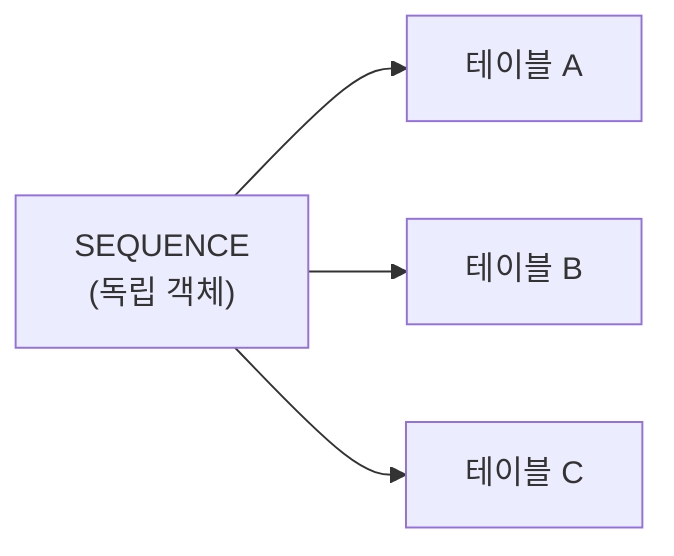
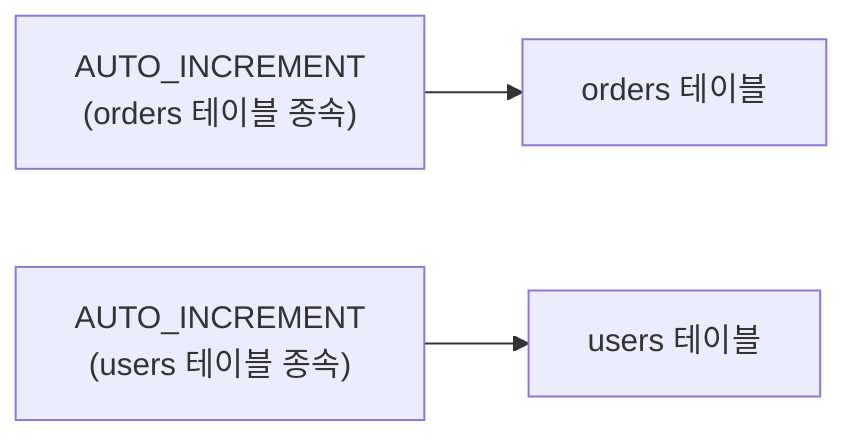
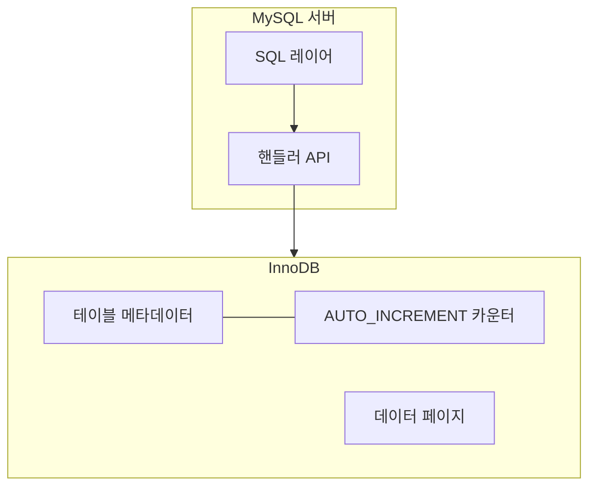

MySQL을 쓰다 보면 한 번쯤 이런 의문이 생깁니다. **왜 MySQL에는 CREATE SEQUENCE가 없을까?**

```sql
-- Oracle, PostgreSQL, SQL Server에서는 동작하지만 MySQL에서는 에러
CREATE SEQUENCE order_seq START WITH 1 INCREMENT BY 1;
SELECT NEXTVAL('order_seq');
```

MySQL은 최신 버전까지도 독립적인 SEQUENCE 객체를 지원하지 않고, 대신 `AUTO_INCREMENT`를 사용합니다. 이 글에서는 왜 이런 선택을 했는지, SEQUENCE와 AUTO_INCREMENT가 어떻게 다른지, 그리고 다른 RDBMS나 MariaDB에서는 어떻게 다루는지 정리합니다.

> 이 글은 "왜 MySQL에는 SEQUENCE가 없는가"에 집중합니다. **MySQL에서 실제 ID 전략을 어떻게 설계할 것인가**(시퀀스 테이블 우회, Snowflake/UUIDv7, JPA/Hibernate 통합, `innodb_autoinc_lock_mode` 등)는 후속 글 [MySQL에서 ID 전략 설계 - 시퀀스 우회부터 Snowflake/UUIDv7까지]()에서 다룹니다.
{:.prompt-info}

---

## 1. SEQUENCE란 무엇인가

SEQUENCE는 **테이블과 독립적으로 존재하는 데이터베이스 객체**로, 순차적인 고유 번호를 생성합니다.

ANSI SQL 표준(SQL:2003)에 정의되어 있으며, Oracle, PostgreSQL, SQL Server, MariaDB 등 대부분의 주요 RDBMS가 지원합니다.

```sql
-- PostgreSQL 기준
CREATE SEQUENCE order_seq
    START WITH 1
    INCREMENT BY 1
    MINVALUE 1
    MAXVALUE 9999999999
    CACHE 20
    NO CYCLE;

-- 다음 값 가져오기
SELECT nextval('order_seq');   -- 1
SELECT nextval('order_seq');   -- 2

-- INSERT에 활용
INSERT INTO orders (id, product) VALUES (nextval('order_seq'), 'keyboard');
```

핵심은 SEQUENCE가 **특정 테이블에 종속되지 않는다**는 점입니다.



하나의 SEQUENCE를 여러 테이블에서 공유하거나, INSERT 전에 미리 번호를 채번해서 부모-자식 테이블에 동시에 사용하는 것이 가능합니다.

---

## 2. MySQL의 AUTO_INCREMENT는 어떻게 다른가

MySQL은 SEQUENCE 대신 `AUTO_INCREMENT`라는 컬럼 속성을 제공합니다.

```sql
CREATE TABLE orders (
    id BIGINT NOT NULL AUTO_INCREMENT,
    product VARCHAR(100),
    PRIMARY KEY (id)
);

-- INSERT 시 id를 생략하면 자동으로 증가된 값이 할당
INSERT INTO orders (product) VALUES ('keyboard');
INSERT INTO orders (product) VALUES ('mouse');

-- 마지막으로 생성된 ID 확인
SELECT LAST_INSERT_ID();
```



AUTO_INCREMENT는 **테이블 컬럼에 묶인 속성**입니다. SEQUENCE와 비교하면 다음과 같은 차이가 있습니다.

| 항목         | SEQUENCE                                           | AUTO_INCREMENT                   |
| ------------ | -------------------------------------------------- | -------------------------------- |
| 존재 형태    | 독립적인 데이터베이스 객체                         | 테이블 컬럼의 속성               |
| 테이블 공유  | 여러 테이블에서 공유 가능                          | 해당 테이블에서만 사용           |
| 값 획득 시점 | INSERT 전에 `NEXTVAL`로 미리 획득 가능             | INSERT 실행 시점에 자동 할당     |
| 제한         | 테이블당 개수 제한 없음                            | 테이블당 1개만 허용              |
| 값 제어      | START, INCREMENT, MIN, MAX, CYCLE, CACHE 설정 가능 | 시작값과 증가분 정도만 설정 가능 |
| SQL 표준     | SQL:2003 표준                                      | 비표준 (MySQL 고유)              |

---

## 3. MySQL이 SEQUENCE를 지원하지 않는 이유

MySQL이 SEQUENCE 대신 AUTO_INCREMENT를 택한 것은 기능 부족이라기보다 설계 방향의 결과에 가깝습니다.

### 3.1. 단순함과 사용 편의성 우선

MySQL은 초기부터 **빠르고 단순한 웹 애플리케이션용 데이터베이스**를 지향했고, AUTO_INCREMENT는 그 방향과 잘 맞았습니다.

- 별도 객체를 생성할 필요가 없습니다.
- 별도 권한 관리가 필요 없습니다.
- `NEXTVAL` 같은 추가 SQL 문법을 알 필요가 없습니다.
- 컬럼 정의에 `AUTO_INCREMENT` 한 단어만 추가하면 끝입니다.

```sql
-- AUTO_INCREMENT: 한 줄이면 충분
CREATE TABLE users (
    id BIGINT AUTO_INCREMENT PRIMARY KEY,
    name VARCHAR(50)
);

-- SEQUENCE 방식: 객체 생성 + DEFAULT 연결이 필요
CREATE SEQUENCE user_seq START WITH 1 INCREMENT BY 1;
CREATE TABLE users (
    id BIGINT DEFAULT nextval('user_seq') PRIMARY KEY,
    name VARCHAR(50)
);
```

대부분의 웹 애플리케이션은 "테이블마다 정수 PK 하나"면 충분했고, AUTO_INCREMENT는 그 요구를 가장 간단하게 해결했습니다.

### 3.2. 스토리지 엔진 아키텍처와의 결합

MySQL은 **플러그형 스토리지 엔진 아키텍처**를 갖고 있고, AUTO_INCREMENT 카운터는 엔진 레벨에 붙어 있습니다. InnoDB 기준 장점은 다음과 같습니다.

- 카운터 조회 시 별도 객체 접근이 필요 없어 오버헤드가 낮습니다.
- 데이터와 카운터가 같은 트랜잭션 범위에서 관리됩니다.
- 스토리지 엔진별로 최적화된 동시성 제어가 가능합니다.



반대로 SEQUENCE는 SQL 레벨의 독립 객체라서, MySQL 구조에서는 상태 관리와 엔진 간 일관성 문제가 더 복잡해질 수 있습니다.

### 3.3. 웹 애플리케이션 중심의 사용 패턴

MySQL이 강세였던 시기의 전형적인 웹 애플리케이션은 대체로 다음 패턴이었습니다.

1. 단일 데이터베이스 서버
2. 테이블마다 독립적인 정수 PK
3. INSERT 후 `LAST_INSERT_ID()`로 생성된 ID 확인
4. 다른 테이블과 ID를 공유할 필요가 거의 없음

**이 패턴에서는 SEQUENCE의 장점인 "여러 테이블 간 공유"나 "INSERT 전 미리 채번"이 상대적으로 덜 중요했습니다.**

### 3.4. Oracle 인수 이후에도 변하지 않은 방향

Oracle 인수 이후에도 MySQL에 SEQUENCE가 추가되지 않은 것은, 기존 방향을 유지한 결과로 보는 것이 습니다.

- MySQL과 Oracle Database의 시장 포지셔닝을 분리하려는 전략
- 기존 MySQL 생태계(ORM, 프레임워크, 도구)와의 하위 호환성 유지
- AUTO_INCREMENT로 충분히 동작하는 기존 워크로드에 대한 불필요한 복잡성 배제

---

## 4. AUTO_INCREMENT의 한계와 알려진 문제

AUTO_INCREMENT가 단순하고 편리하지만, 운영 환경에서 몇 가지 주의해야 할 문제가 있습니다.

### 4.1. 값의 갭(Gap) 발생

InnoDB에서 AUTO_INCREMENT 값은 한 번 할당되면 되돌려지지 않습니다. 다음 상황에서 갭이 발생합니다.

- 트랜잭션 롤백
- `INSERT IGNORE`에서 중복 키로 인한 실패
- 벌크 INSERT에서의 사전 할당

```sql
-- 갭 발생 예시
BEGIN;
INSERT INTO orders (product) VALUES ('keyboard');  -- id = 1 할당
ROLLBACK;  -- 롤백되어도 id = 1은 재사용되지 않음

INSERT INTO orders (product) VALUES ('mouse');     -- id = 2 할당
```

> 갭은 정상적인 동작이며 대부분의 경우 문제가 되지 않습니다. 하지만 "빈 번호 없이 연속된 채번"이 비즈니스 요구사항이라면 AUTO_INCREMENT만으로는 해결할 수 없습니다.

또한 MySQL 문서는 innodb_autoinc_lock_mode = 2, 즉 interleaved lock mode에서 동시 실행되는 insert-like 문장 사이에 AUTO_INCREMENT 값 할당이 섞일 수 있고, bulk insert에서는 gap이 생길 수 있다고 설명합니다.  

[공식 문서](https://dev.mysql.com/doc/refman/9.7/en/innodb-auto-increment-handling.html) 기준으로도 핵심은 AUTO_INCREMENT 값의 유일성과 증가성이지, 빈틈 없는 연속 번호 보장이 아닙니다.  

PostgreSQL의 `SEQUENCE`도 이 점에서는 동일합니다. PostgreSQL 공식 문서도 `nextval()`로 얻은 값은 트랜잭션이 롤백되어도 재사용되지 않으며, `ON CONFLICT`, 데이터베이스 crash, sequence cache 설정 등에 의해 gap이 생길 수 있다고 설명합니다.

```sql
-- PostgreSQL sequence에서도 갭 발생
CREATE TABLE orders (
    id BIGSERIAL PRIMARY KEY,
    product TEXT
);

BEGIN;
INSERT INTO orders (product) VALUES ('keyboard');  -- id = 1 할당
ROLLBACK;  -- 롤백되어도 sequence 값은 되돌아가지 않음

INSERT INTO orders (product) VALUES ('mouse');     -- id = 2 할당
```

> 즉 PostgreSQL의 `SERIAL`, `BIGSERIAL`, `GENERATED AS IDENTITY`도 내부적으로 sequence를 사용하므로, 빈틈 없는 연속 번호를 보장하지 않습니다. MySQL AUTO_INCREMENT와 PostgreSQL sequence 모두 핵심 보장은 "고유한 값 발급"이지, "gapless 채번"이 아닙니다.
{:.prompt-info}

### 4.2. MySQL 5.7 이하에서의 카운터 초기화 문제

MySQL 5.7 이하의 InnoDB는 AUTO_INCREMENT 카운터를 디스크에 영속화하지 않고 메모리에서 관리했습니다. 따라서 서버가 재시작된 뒤 테이블이 다시 열리면, InnoDB는 테이블에 실제로 남아 있는 AUTO_INCREMENT 컬럼의 최대값을 기준으로 카운터를 다시 초기화할 수 있었습니다.

이 때문에 마지막으로 발급된 AUTO_INCREMENT 값이 삭제된 상태에서 서버가 재시작되면, 삭제된 값이 다시 발급될 수 있습니다.

```sql
-- MySQL 5.7에서의 문제 시나리오
INSERT INTO users (name) VALUES ('alice');  -- id = 10
DELETE FROM users WHERE id = 10;
-- 서버 재시작
INSERT INTO users (name) VALUES ('bob');    -- id = 10 (재사용!).
-- => id는 동일하지만 다른 데이터임. -> 추후 audit, 외부 시스템에서 문제 발생)
```

이 동작은 동일 테이블의 PRIMARY KEY 제약을 깨지는 않습니다. 이미 id = 10 행이 삭제되었기 때문입니다. 하지만 삭제된 ID가 외부 시스템, 로그, URL, 캐시, 감사 기록 등에 이미 노출된 경우에는 "한 번 사용된 식별자가 다른 엔티티에 재사용되는" 문제가 발생할 수 있습니다.

> MySQL 8.0부터는 InnoDB AUTO_INCREMENT 카운터가 redo log와 data dictionary를 통해 영속화되어, 정상적인 서버 재시작 후 카운터가 테이블의 현재 최대값 기준으로 되돌아가는 문제가 개선되었습니다. 다만 예기치 못한 서버 종료 상황에서 redo log가 디스크에 flush되기 전에 종료되면, 이미 할당된 값의 재사용을 완전히 보장할 수는 없습니다.
{:.prompt-info}

PostgreSQL sequence와 비교하면, 이 문제는 MySQL 5.7 이하 InnoDB의 특수한 카운터 초기화 방식에 가깝습니다. 일반적인 PostgreSQL sequence는 테이블의 `MAX(id)`를 보고 값을 다시 계산하지 않고, 테이블 컬럼 값과 별개의 sequence 객체 상태를 유지합니다.

```sql
-- PostgreSQL에서는 일반적으로 삭제된 마지막 값이 재시작 후 재사용되지 않음
CREATE TABLE users (
    id BIGSERIAL PRIMARY KEY,
    name TEXT
);

INSERT INTO users (name) VALUES ('alice');  -- id = 1
DELETE FROM users WHERE id = 1;

-- 데이터베이스 재시작 후
INSERT INTO users (name) VALUES ('bob');    -- 일반적으로 id = 2
```

물론 PostgreSQL에서도 sequence 값이 절대 재사용되지 않는다고 단정하면 안 됩니다. `setval()`로 값을 수동 조정하거나, `ALTER SEQUENCE ... RESTART`, `TRUNCATE ... RESTART IDENTITY`, `CYCLE` 옵션을 사용하면 이미 사용했던 값이 다시 나올 수 있습니다. 또한 `UNLOGGED SEQUENCE`는 crash-safe하지 않기 때문에 비정상 종료 후 초기 상태로 reset될 수 있습니다.

> 정리하면, PostgreSQL sequence도 gapless 번호를 보장하지는 않지만, MySQL 5.7 이하 InnoDB처럼 "삭제된 마지막 AUTO_INCREMENT 값이 서버 재시작 후 다시 발급될 수 있는" 문제와는 구분해서 이해해야 합니다.
{:.prompt-info}

### 4.3. 테이블당 1개 제한

AUTO_INCREMENT는 테이블당 하나의 컬럼에만 설정할 수 있습니다. 하나의 테이블에 두 개 이상의 독립적인 채번이 필요한 경우(예: 주문번호와 배송번호를 동시에 채번) AUTO_INCREMENT만으로는 대응이 어렵습니다.

### 4.4. 복제 환경에서의 충돌

Master-Master 또는 Multi-Master 복제 구성에서 동일한 AUTO_INCREMENT 값이 여러 노드에서 동시에 생성되면 충돌이 발생할 수 있습니다.

이를 방지하기 위해 `auto_increment_increment`와 `auto_increment_offset`을 노드별로 다르게 설정해야 합니다.

```ini
# 노드 1
auto_increment_increment = 2
auto_increment_offset = 1
# 생성되는 ID: 1, 3, 5, 7, ...

# 노드 2
auto_increment_increment = 2
auto_increment_offset = 2
# 생성되는 ID: 2, 4, 6, 8, ...
```

이 방식은 동작하지만, 노드가 늘어날수록 관리가 복잡해지고 ID 공간(정수 범위. 디스크 저장 공간 x)이 낭비됩니다. Sharding 환경(Vitess, ProxySQL 등)에서는 별도의 글로벌 채번 메커니즘이 필요해지는 것도 같은 맥락입니다.

### 4.5. 여러 테이블 간 ID 공유 불가

AUTO_INCREMENT는 테이블에 종속되므로 여러 테이블에서 하나의 채번 스트림을 공유할 수 없습니다.

예를 들어 `documents` 테이블과 `images` 테이블에서 전역적으로 유일한 `content_id`가 필요한 경우, AUTO_INCREMENT로는 직접 해결이 불가능합니다.

> 위에서 정리한 한계 중 하나라도 운영 요구사항과 충돌한다면 AUTO_INCREMENT 외의 ID 전략이 필요합니다. 시퀀스 테이블 우회, Snowflake/UUIDv7 같은 애플리케이션 레벨 채번, JPA/Hibernate 통합 방식은 [후속 글]()에서 본격적으로 다룹니다.
{:.prompt-info}

---

## 5. 그럼 다른 DB는 어떨까?

| RDBMS      | SEQUENCE 지원   | AUTO_INCREMENT 유사 기능                       | 비고                           |
| ---------- | --------------- | ---------------------------------------------- | ------------------------------ |
| Oracle     | 지원 (초기부터) | 12c부터 IDENTITY 컬럼 추가                     | SEQUENCE가 핵심 ID 생성 방식   |
| PostgreSQL | 지원            | `SERIAL`(내부적으로 SEQUENCE 사용), `IDENTITY` | SERIAL도 결국 SEQUENCE 기반    |
| SQL Server | 지원 (2012부터) | `IDENTITY` 컬럼                                | SEQUENCE와 IDENTITY 공존       |
| MariaDB    | 지원 (10.3부터) | `AUTO_INCREMENT`                               | MySQL 포크이지만 SEQUENCE 추가 |
| MySQL      | **미지원**      | `AUTO_INCREMENT`                               | 유일하게 SEQUENCE 미지원       |

### PostgreSQL은 사실상 SEQUENCE 기반이다

PostgreSQL에서는 SEQUENCE가 ID 생성의 근간입니다. `SERIAL` 타입조차 내부적으로 SEQUENCE를 생성합니다.

```sql
-- 이 두 문장은 동일한 효과
CREATE TABLE users (id SERIAL PRIMARY KEY);

-- 위 문장은 내부적으로 아래와 같이 동작
CREATE SEQUENCE users_id_seq;
CREATE TABLE users (id INTEGER DEFAULT nextval('users_id_seq') PRIMARY KEY);
```

PostgreSQL 10 이후에는 SQL 표준을 따르는 `GENERATED AS IDENTITY`가 권장됩니다.

```sql
CREATE TABLE users (
    id BIGINT GENERATED ALWAYS AS IDENTITY PRIMARY KEY,
    name VARCHAR(50)
);
```

다만 `SERIAL`과 `IDENTITY` 모두 내부적으로 sequence를 사용한다는 점은 같습니다. 따라서 PostgreSQL에서도 ID 값의 유일성은 보장할 수 있지만, 빈틈 없는 연속 번호까지 보장하지는 않습니다.

---

## 6. 그럼 MariaDB로 가면 바로 쓸 수 있을까?

MySQL 계열 안에서 SEQUENCE가 꼭 필요하다면 자연스럽게 MariaDB가 떠오릅니다. MariaDB는 MySQL 포크이지만 10.3부터 독립적인 SEQUENCE를 지원합니다. 그래서 문법만 보면 바로 쓸 수 있습니다. 다만 버전, ORM 설정, 복제 방식은 같이 확인해야 합니다.

### 6.1. MariaDB SEQUENCE의 기본 사용법

MariaDB의 SEQUENCE는 Oracle이나 PostgreSQL의 SEQUENCE와 문법이 거의 동일합니다.

```sql
-- SEQUENCE 생성
CREATE SEQUENCE order_seq
    START WITH 1
    INCREMENT BY 1
    MINVALUE 1
    MAXVALUE 999999999
    CACHE 100
    NO CYCLE;

-- 다음 값 조회
SELECT NEXTVAL(order_seq);   -- 1
SELECT NEXTVAL(order_seq);   -- 2

-- 현재 값 조회
SELECT LASTVAL(order_seq);   -- 2

-- SEQUENCE 수정
ALTER SEQUENCE order_seq RESTART WITH 100;

-- SEQUENCE 삭제
DROP SEQUENCE order_seq;
```

MariaDB가 SEQUENCE를 추가한 이유는 Oracle Database와의 호환성을 높여 Oracle에서의 마이그레이션 장벽을 낮추기 위한 전략적 판단이었습니다.

### 6.2. MySQL에서 MariaDB로 전환 시 확인 사항

전환 시에는 아래 정도를 확인하면 됩니다.

| 확인 항목           | 설명                                                                                                      |
| ------------------- | --------------------------------------------------------------------------------------------------------- |
| MariaDB 버전        | 10.3 이상이어야 `CREATE SEQUENCE` 사용 가능                                                               |
| 기존 AUTO_INCREMENT | 기존 테이블의 AUTO_INCREMENT는 그대로 동작하므로 강제 전환 불필요                                         |
| ORM/프레임워크      | JPA, MyBatis 등에서 SEQUENCE 전략을 사용하려면 Dialect 변경 필요                                          |
| 복제 토폴로지       | MySQL → MariaDB 복제 환경에서는 SEQUENCE DDL이 복제되지 않을 수 있음                                      |
| SEQUENCE 엔진       | MariaDB의 SEQUENCE는 별도 스토리지 엔진으로 구현됨. `SHOW ENGINES`에서 SEQUENCE가 활성 상태인지 확인 필요 |

### 6.3. 점진적 전환 전략

MariaDB로 옮긴다고 모든 AUTO_INCREMENT를 SEQUENCE로 바꿀 필요는 없습니다. 보통은 아래처럼 점진적으로 가는 편이 현실적입니다.

1. 기존 테이블의 AUTO_INCREMENT PK는 그대로 유지합니다.
2. **여러 테이블 간 공유 ID**나 **INSERT 전 채번**이 필요한 신규 테이블에만 SEQUENCE를 적용합니다.
3. 시퀀스 테이블 우회 방식([후속 글의 1장]())으로 구현했던 로직을 SEQUENCE로 교체합니다.

```sql
-- 기존: 시퀀스 테이블 방식
UPDATE sequences SET val = LAST_INSERT_ID(val + 1) WHERE name = 'order_seq';
SELECT LAST_INSERT_ID();

-- 전환 후: MariaDB SEQUENCE
SELECT NEXTVAL(order_seq);
```

---

## 정리

MySQL에 SEQUENCE가 없는 것은 기능 부족이라기보다, `AUTO_INCREMENT` 중심 설계를 오래 유지한 결과에 가깝습니다. MySQL은 테이블마다 정수 PK 하나를 빠르고 단순하게 처리하는 방향에 최적화되어 있었고, 그 관점에서는 독립적인 SEQUENCE 객체가 꼭 필요하지 않았습니다.

다만 여러 테이블 간 공유 ID가 필요하거나, INSERT 전에 ID를 미리 확보해야 하거나, 복제·샤딩·배치 INSERT 성능 같은 요구사항이 붙기 시작하면 AUTO_INCREMENT만으로는 부족해질 수 있습니다. 그런 상황에서 실제로 어떤 ID 전략을 고를지, 그리고 MySQL 안에서 어떻게 우회할지는 후속 글 [MySQL에서 ID 전략 설계 - 시퀀스 우회부터 Snowflake/UUIDv7까지]()에서 이어서 정리합니다.

---

## 출처

- [MySQL 공식 문서 - AUTO_INCREMENT Handling in InnoDB](https://dev.mysql.com/doc/refman/8.0/en/innodb-auto-increment-handling.html)
- [MariaDB 공식 문서 - Sequence Overview](https://mariadb.com/kb/en/sequence-overview/)
- [MariaDB 공식 문서 - Sequence Storage Engine](https://mariadb.com/kb/en/sequence-storage-engine/)
- [PostgreSQL CREATE SEQUENCE](https://www.postgresql.org/docs/current/sql-createsequence.html)
- [PostgreSQL 공식 문서 - Sequence Manipulation Functions](https://www.postgresql.org/docs/current/functions-sequence.html)
- [PostgreSQL 공식 문서 - Identity Columns](https://www.postgresql.org/docs/current/ddl-identity-columns.html)
- [Oracle 공식 문서 - CREATE SEQUENCE](https://docs.oracle.com/en/database/oracle/oracle-database/19/sqlrf/CREATE-SEQUENCE.html)
- [SQL Server 공식 문서 - Sequence Numbers](https://learn.microsoft.com/en-us/sql/relational-databases/sequence-numbers/sequence-numbers)
