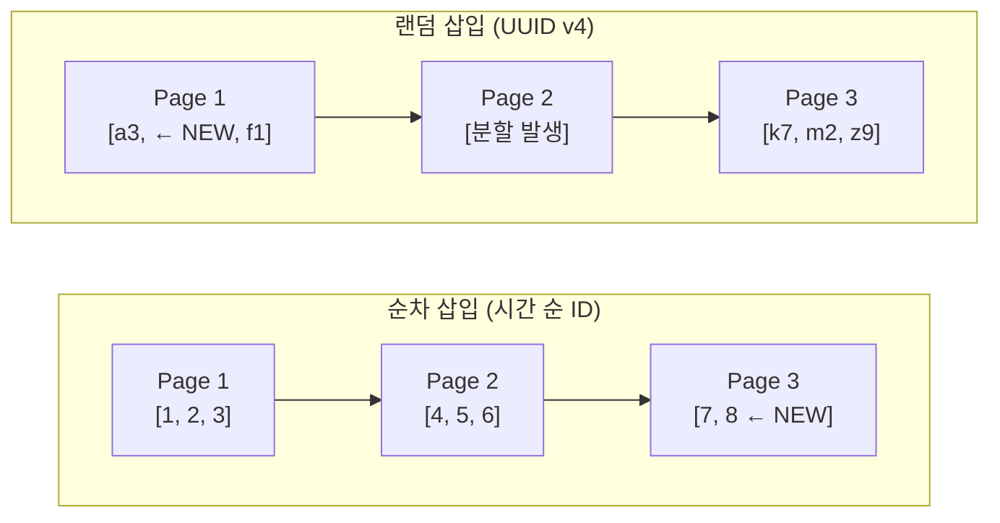
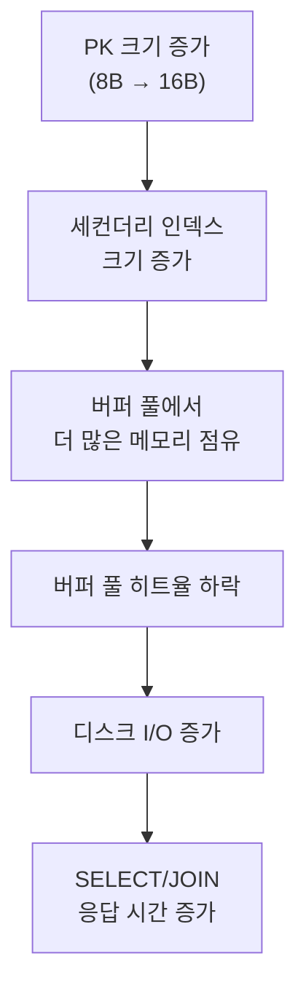
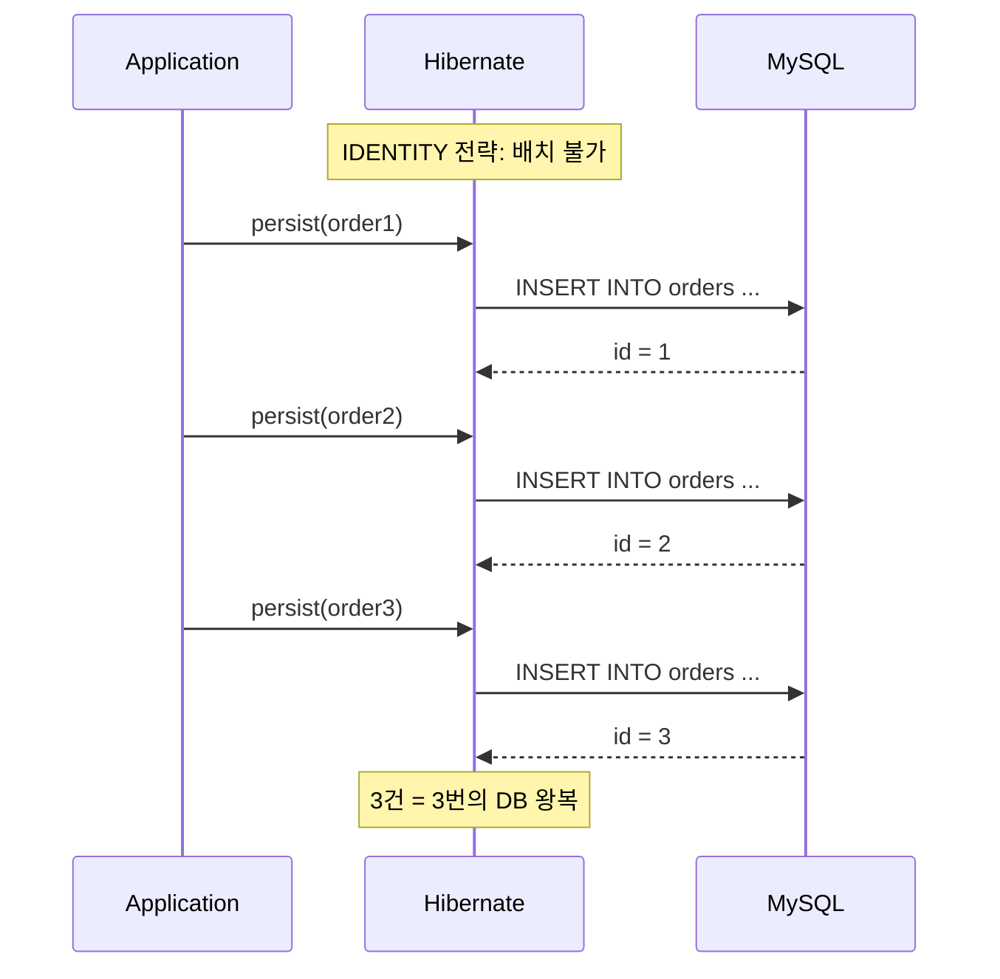
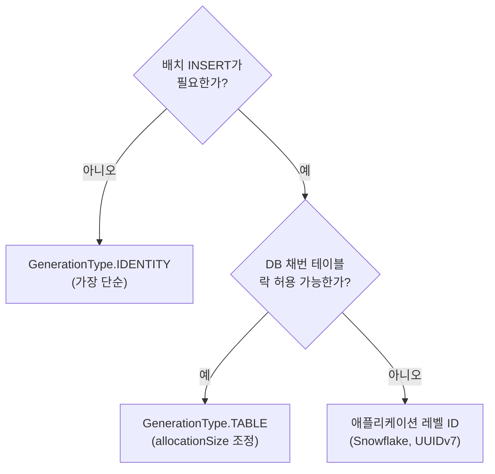
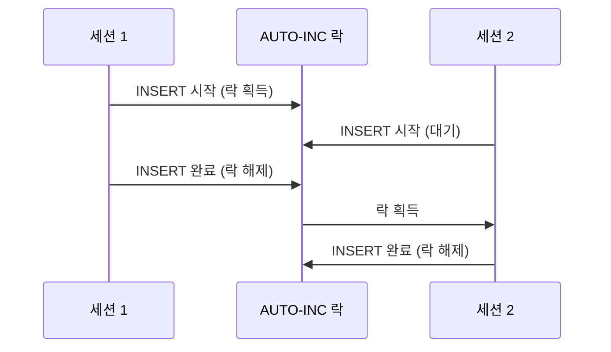

[MySQL은 왜 SEQUENCE를 지원하지 않을까]()의 후속편입니다. 앞선 글에서 SEQUENCE와 AUTO_INCREMENT의 차이, MySQL이 SEQUENCE를 지원하지 않는 배경, AUTO_INCREMENT의 한계를 정리했다면, 이 글은 그 전제를 바탕으로 **MySQL에서 실제로 어떤 ID 전략을 선택할지**를 다룹니다.

다음 상황 중 하나라도 해당된다면 AUTO_INCREMENT만으로 충분하지 않을 가능성이 큽니다.

- 여러 테이블 간 전역 유일 ID가 필요한 경우
- INSERT 전에 미리 ID를 확보해야 하는 경우(부모-자식 동시 삽입 등)
- Master-Master 복제나 Sharding 환경에서 ID 충돌을 방지해야 하는 경우
- JPA 배치 INSERT 성능이 중요한 경우
- 분산 환경에서 노드 간 협의 없이 ID를 생성해야 하는 경우

단순히 후보를 나열하기보다, **실제로 어떤 순서로 판단해야 하는지**에 맞춰 정리했습니다.

- ID를 **데이터베이스 안에서 만들지**, **애플리케이션에서 만들지** 결정
- 애플리케이션에서 만든다면 Snowflake ID와 UUIDv7 중 어떤 특성이 더 중요한지 비교
- JPA/Hibernate와 AUTO_INCREMENT 운영 설정

---

## 1. 첫 번째 분기: ID를 DB 안에서 만들지, 애플리케이션에서 만들지

앞선 글에서 SEQUENCE와 AUTO_INCREMENT의 구조 차이를 봤다면, 여기서의 첫 질문은 더 실무적입니다. **ID를 계속 데이터베이스 안에서 관리할 것인가, 아니면 애플리케이션 밖으로 끌어올 것인가**입니다. 이 분기점이 뒤의 선택지를 거의 결정합니다.

DB 안에서 해결하려면 가장 기본적인 우회 방법은 별도 테이블에 카운터를 두는 방식입니다.

### 1.1 DB 안에서 해결하는 가장 단순한 우회: 전용 테이블 + LAST_INSERT_ID()

MySQL 공식 문서에서도 소개하는 방법입니다. 별도 테이블에 카운터를 저장하고 `LAST_INSERT_ID(expr)`를 활용합니다.

```sql
-- 시퀀스 테이블 생성
CREATE TABLE sequences (
    name VARCHAR(50) NOT NULL PRIMARY KEY,
    val BIGINT UNSIGNED NOT NULL DEFAULT 0
) ENGINE=InnoDB;

-- 시퀀스 초기화
INSERT INTO sequences (name, val) VALUES ('order_seq', 0);
INSERT INTO sequences (name, val) VALUES ('invoice_seq', 1000);
```

다음 값을 가져올 때는 `UPDATE`와 `LAST_INSERT_ID()`를 조합합니다.

```sql
-- 다음 값 획득 (원자적으로 동작)
UPDATE sequences SET val = LAST_INSERT_ID(val + 1) WHERE name = 'order_seq';
SELECT LAST_INSERT_ID();  -- 1
```

`LAST_INSERT_ID(expr)` 형태로 호출하면 MySQL이 현재 커넥션의 `LAST_INSERT_ID` 값을 해당 표현식 결과로 설정합니다. 이 값은 **커넥션별로 독립**이므로 동시 접근에도 안전합니다.

편의를 위해 저장 함수로 감쌀 수 있습니다.

```sql
DELIMITER //

CREATE FUNCTION next_val(seq_name VARCHAR(50))
RETURNS BIGINT UNSIGNED
DETERMINISTIC
BEGIN
    UPDATE sequences
    SET val = LAST_INSERT_ID(val + 1)
    WHERE name = seq_name;
    RETURN LAST_INSERT_ID();
END //

DELIMITER ;

-- 사용
SELECT next_val('order_seq');    -- 2
SELECT next_val('order_seq');    -- 3
SELECT next_val('invoice_seq'); -- 1001
```

> 이 방식은 동시성이 매우 높은 환경에서는 특정 시퀀스 행에 대한 row lock 경합이 발생할 수 있습니다. 초당 수만 건 이상의 채번이 필요하다면 애플리케이션 레벨의 채번(Snowflake ID, UUIDv7 등)을 검토하는 편이 낫습니다.
{:.prompt-warning}

### 1.2 DB 안에서 여러 테이블이 공유하는 ID

위 시퀀스 테이블 방식을 활용하면 여러 테이블에서 하나의 채번 스트림을 공유할 수 있습니다.

```sql
-- 문서와 이미지에서 공통 content_id 사용
INSERT INTO sequences (name, val) VALUES ('content_seq', 0);

-- 문서 삽입
UPDATE sequences SET val = LAST_INSERT_ID(val + 1) WHERE name = 'content_seq';
INSERT INTO documents (content_id, title) VALUES (LAST_INSERT_ID(), 'report');

-- 이미지 삽입
UPDATE sequences SET val = LAST_INSERT_ID(val + 1) WHERE name = 'content_seq';
INSERT INTO images (content_id, url) VALUES (LAST_INSERT_ID(), '/img/photo.jpg');
```

### 1.3 언제 애플리케이션 레벨 ID로 넘어가야 하는가

시퀀스 테이블은 가장 단순한 우회책이지만, 동시성이 높아지거나 분산 환경으로 넘어가면 결국 데이터베이스 밖에서 ID를 생성하는 선택지도 보게 됩니다. 대표적으로는 다음 방식들이 있습니다.

| 방식         | 크기    | 정렬 가능 | 분산 환경 | 비고                             |
| ------------ | ------- | --------- | --------- | -------------------------------- |
| UUID v4      | 128비트 | 불가      | 가능      | 인덱스 성능 저하 우려            |
| UUID v7      | 128비트 | 가능      | 가능      | 시간 기반, v4 대비 인덱스 친화적 |
| Snowflake ID | 64비트  | 가능      | 가능      | 노드 ID 관리 필요                |
| ULID         | 128비트 | 가능      | 가능      | UUID v7과 유사한 접근            |

분산 환경이거나 데이터베이스 채번의 병목이 우려되는 경우에는 이러한 애플리케이션 레벨 방식이 더 적합할 수 있습니다.

여기까지가 첫 번째 분기입니다. **DB 안에서 해결할 수 있으면 시퀀스 테이블 우회로 끝낼 수 있지만, 병목이나 분산 요구가 크다면 애플리케이션 레벨 ID로 넘어가야 합니다.** 이제 그 경우 가장 많이 비교되는 Snowflake ID와 UUIDv7을 InnoDB 관점에서 보겠습니다.

---

## 2. 애플리케이션 레벨 ID 선택: Snowflake ID vs UUIDv7

DB 밖에서 ID를 만들기로 했다면, 시간 순 정렬이 가능한 Snowflake ID와 UUIDv7이 가장 자주 비교됩니다. 여기서는 InnoDB가 어떤 PK를 더 좋아하는지부터 출발해 둘의 차이를 봅니다.

### 2.1 InnoDB가 선호하는 PK 패턴

InnoDB는 테이블 데이터를 **클러스터드 인덱스(PK 기준 B+Tree)**로 저장합니다. PK 값의 순서가 곧 데이터의 물리적 저장 순서입니다.



- **순차 삽입**: 새 행이 항상 B+Tree의 오른쪽 끝에 추가됩니다. 페이지가 가득 차면 새 페이지를 할당합니다.
- **랜덤 삽입**: 새 행이 B+Tree의 중간에 끼어들어야 합니다. 이미 꽉 찬 페이지에 삽입하면 **페이지 분할(page split)**이 발생하여 절반씩 나뉘고 테이블 크기가 거의 두 배로 부풀 수 있습니다.

핵심은 PK가 시간 순으로 증가하느냐입니다.

### 2.2 Snowflake ID와 UUIDv7은 둘 다 순차적이다

Snowflake ID와 UUIDv7은 둘 다 상위 비트에 타임스탬프를 두므로, InnoDB에서는 둘 다 순차 삽입 패턴에 가깝게 동작합니다. 차이는 주로 **크기**와 **세컨더리 인덱스 비용**에서 납니다.

| 항목                 | Snowflake ID                 | UUIDv7                             |
| -------------------- | ---------------------------- | ---------------------------------- |
| 크기                 | 64비트 (8바이트, `BIGINT`)   | 128비트 (16바이트, `BINARY(16)`)   |
| PK 저장 비용         | 행당 8바이트                 | 행당 16바이트                      |
| 세컨더리 인덱스 비용 | 인덱스 엔트리마다 +8바이트   | 인덱스 엔트리마다 +16바이트        |
| 비교 연산            | 정수 비교 (매우 빠름)        | 바이트열 비교 (상대적으로 느림)    |
| 분산 고유성          | 노드 ID(10비트)로 구분       | 랜덤 비트(62비트)로 충돌 확률 극저 |
| 노드 관리            | 데이터센터/워커 ID 할당 필요 | 별도 관리 불필요                   |

InnoDB의 세컨더리 인덱스는 리프 노드에 PK 값을 포함합니다. PK가 8바이트(Snowflake)인 경우와 16바이트(UUIDv7)인 경우, 세컨더리 인덱스가 많은 테이블에서는 전체 인덱스 크기 차이가 누적됩니다.

> Snowflake의 "노드 ID 관리"는 K8s 환경에서 특히 통점입니다. Pod이 동적으로 뜨고 내려가는 환경에서는 hostname hash, Zookeeper 임시 노드, ConfigMap, Pod ordinal(StatefulSet) 등으로 워커 ID를 할당하는 전략을 미리 결정해야 합니다. 같은 워커 ID가 두 인스턴스에서 동시에 사용되면 ID 충돌이 발생합니다.
{:.prompt-warning}

### 2.3 상황별 선택 기준

| 상황                                                                    | 권장                   |
| ----------------------------------------------------------------------- | ---------------------- |
| 세컨더리 인덱스가 많고 저장 공간/메모리가 중요한 경우                   | Snowflake ID (8바이트) |
| 노드 ID 관리 없이 간단하게 분산 ID를 생성하고 싶은 경우                 | UUIDv7                 |
| 기존 시스템이 `BIGINT` PK 기반이고 마이그레이션 비용을 줄이고 싶은 경우 | Snowflake ID           |
| UUID 형태가 외부 API 호환에 필요한 경우                                 | UUIDv7                 |

> UUIDv7을 MySQL에서 사용할 때는 반드시 `BINARY(16)` 또는 MySQL 8.0의 `UUID_TO_BIN(uuid, 1)` 함수를 활용해 저장해야 합니다. `CHAR(36)` 형태로 저장하면 36바이트를 차지하여 인덱스 효율이 크게 떨어집니다.
{:.prompt-warning}

선택 기준을 봤다면, 다음 질문은 "그 차이가 실제 비용으로 얼마나 누적되는가"입니다. 이제 PK 크기 차이가 저장 공간, 버퍼 풀, 조회 성능에 어떻게 반영되는지 보겠습니다.

---

## 3. Snowflake BIGINT vs UUIDv7 BINARY(16): 크기 차이

이번엔 크기(비용) 측면에서 정리합니다.

> 크기 수치는 InnoDB 페이지 구조와 PK 크기를 기반으로 한 **추정치**입니다. 실제 운영 환경에서는 워크로드, 인덱스 구성, 버퍼 풀 크기, 디스크 특성 등에 따라 결과가 달라질 수 있으므로 의사결정 전에 실제 벤치마크를 수행하는 편이 안전합니다.
{:.prompt-info}

### 3.1 INSERT 자체는 큰 차이가 없다

Snowflake ID와 UUIDv7 모두 상위 비트가 타임스탬프이므로, InnoDB B+Tree의 오른쪽 끝에 순차 삽입됩니다. 페이지 분할은 거의 발생하지 않으며, 충전율은 약 94%를 유지합니다.

순수 INSERT 처리량 차이는 크지 않고, 차이는 주로 **PK 크기가 누적되는 영역**에서 나타납니다.

### 3.2 세컨더리 인덱스와 버퍼 풀에서 차이가 누적된다

InnoDB의 세컨더리 인덱스 리프 노드에는 PK 값이 포함됩니다. PK가 8바이트(BIGINT)인 경우와 16바이트(BINARY(16))인 경우, 세컨더리 인덱스 하나당 엔트리마다 8바이트의 차이가 생깁니다.

테이블에 세컨더리 인덱스가 3개 있고 행이 1,000만 건이라고 가정하면 다음과 같은 추산이 나옵니다.

| 항목                            | BIGINT (8B) | BINARY(16) (16B) | 차이        |
| ------------------------------- | ----------- | ---------------- | ----------- |
| PK 컬럼 자체                    | 80 MB       | 160 MB           | +80 MB      |
| 세컨더리 인덱스 3개의 PK 포함분 | 240 MB      | 480 MB           | +240 MB     |
| **합계**                        | **320 MB**  | **640 MB**       | **+320 MB** |

> 위 수치는 PK 바이트 크기만을 기준으로 한 단순 추산입니다. 실제로는 페이지 오버헤드, 레코드 헤더, 가변 길이 컬럼 등이 추가되므로 절대값은 달라질 수 있지만, 비율 차이의 방향성은 동일합니다.
{:.prompt-info}

이 크기 차이는 다음 경로로 성능에 영향을 줍니다.



- **버퍼 풀 효율**: 같은 버퍼 풀 크기에서 BIGINT PK 테이블은 더 많은 인덱스 페이지를 메모리에 유지할 수 있습니다. BINARY(16) PK는 동일 데이터를 올리는 데 약 2배의 메모리가 필요합니다.
- **조회 성능**: 세컨더리 인덱스를 통한 조회 시 PK로 클러스터드 인덱스를 다시 탐색하는데(북마크 룩업), PK 비교 연산이 정수 비교(BIGINT)인 경우와 바이트열 비교(BINARY(16))인 경우 전자가 더 빠릅니다.
- **JOIN 성능**: 외래 키가 PK를 참조하는 경우, FK 컬럼도 16바이트가 되어 JOIN 시 비교 비용과 인덱스 크기가 증가합니다.

### 3.3 결국 데이터 규모와 인덱스 수가 갈림길이다

| 규모                         | 성능 차이 체감                             |
| ---------------------------- | ------------------------------------------ |
| 수만~수십만 건, 인덱스 1~2개 | 거의 차이 없음                             |
| 수백만 건, 인덱스 3개 이상   | 버퍼 풀 히트율과 인덱스 크기에서 차이 발생 |
| 수천만~억 건, 인덱스 다수    | 저장 공간, 메모리, I/O에서 유의미한 차이   |

소규모 서비스에서는 UUIDv7을 `BINARY(16)`으로 사용해도 체감 차이가 거의 없습니다. 하지만 대규모 테이블에 세컨더리 인덱스가 많고, 버퍼 풀 크기가 한정된 환경이라면 `BIGINT` Snowflake ID가 스토리지와 메모리 관점에서 확실히 유리합니다.

---

## 4. JPA/Hibernate에서는 어떤 ID 전략을 택할까

DB 안에서 만들지, 애플리케이션에서 만들지 방향을 정했다면, 이제 ORM에서 그 결정을 어떻게 반영할지가 남습니다. MySQL에서는 JPA의 ID 전략 선택이 성능과 배치 처리 방식에 직접 영향을 줍니다.

### 4.1 GenerationType별 성격

| 전략       | MySQL 사용 가능 | JDBC 배치 INSERT    | 동작 방식                             |
| ---------- | --------------- | ------------------- | ------------------------------------- |
| `IDENTITY` | 가능            | **불가**            | AUTO_INCREMENT 사용, INSERT 즉시 실행 |
| `SEQUENCE` | **불가**        | 가능                | DB SEQUENCE 호출 (MySQL 미지원)       |
| `TABLE`    | 가능            | 가능                | 별도 테이블로 SEQUENCE 시뮬레이션     |
| `AUTO`     | 가능            | Dialect에 따라 다름 | Hibernate가 자동 선택                 |

### 4.2 IDENTITY 전략과 배치 INSERT 제약

가장 흔한 전략은 `GenerationType.IDENTITY`입니다.

```java
@Entity
public class Order {
    @Id
    @GeneratedValue(strategy = GenerationType.IDENTITY)
    private Long id;

    private String product;
}
```

문제는 **JDBC 배치 INSERT가 사실상 꺼진다**는 점입니다. `IDENTITY`에서는 PK를 INSERT 이후에야 알 수 있으므로 Hibernate가 매 INSERT를 즉시 실행해야 하기 때문입니다.



### 4.3 TABLE 전략으로 배치 INSERT 활성화

배치 INSERT가 필요하면 `GenerationType.TABLE` 전략을 사용할 수 있습니다. 이 방식은 별도 테이블에서 ID를 미리 확보하므로 배치가 가능합니다.

```java
@Entity
public class Order {
    @Id
    @GeneratedValue(strategy = GenerationType.TABLE, generator = "order_gen")
    @TableGenerator(
        name = "order_gen",
        table = "id_sequences",       // 채번 테이블 이름
        pkColumnName = "seq_name",    // 시퀀스 이름 컬럼
        valueColumnName = "seq_val",  // 현재 값 컬럼
        pkColumnValue = "order_seq",  // 이 엔티티의 시퀀스 이름
        allocationSize = 50           // 한 번에 50개씩 미리 확보
    )
    private Long id;

    private String product;
}
```

`allocationSize = 50`이면 Hibernate가 한 번에 50개 ID를 확보한 뒤 메모리에서 할당합니다.

> TABLE 전략은 채번 테이블 행에 대한 비관적 락(pessimistic lock)을 사용하므로, 동시성이 극도로 높은 환경에서는 병목이 될 수 있습니다. 대부분의 일반적인 애플리케이션에서는 `allocationSize`를 충분히 크게 잡으면 실질적 영향이 크지 않습니다.
{:.prompt-info}

### 4.4 애플리케이션에서 직접 ID를 할당하는 방식

IDENTITY의 배치 제약과 TABLE의 락 오버헤드를 모두 피하고 싶다면, 애플리케이션에서 Snowflake ID나 UUIDv7을 직접 생성하는 방법이 있습니다.

```java
@Entity
public class Order {
    @Id
    private Long id;  // GeneratedValue 없음

    private String product;

    @PrePersist
    public void generateId() {
        if (this.id == null) {
            // Snowflake ID 생성기 또는 UUIDv7 변환 로직 호출
            this.id = SnowflakeIdGenerator.nextId();
        }
    }
}
```

이 방식은 `persist()` 시점에 이미 ID가 확정되므로 Hibernate가 배치 INSERT를 사용할 수 있고, DB 채번 테이블에 대한 락 경합도 없습니다.

### 4.5 MySQL에서의 JPA ID 전략 선택 기준



| 전략            | 장점                             | 단점                        | 적합한 경우                   |
| --------------- | -------------------------------- | --------------------------- | ----------------------------- |
| IDENTITY        | 설정이 단순, AUTO_INCREMENT 활용 | 배치 INSERT 불가            | 단건 INSERT 위주              |
| TABLE           | 배치 INSERT 가능, DB 독립적      | 채번 테이블 락 오버헤드     | 대량 INSERT + 적정 동시성     |
| 애플리케이션 ID | 배치 가능, DB 부하 없음          | ID 생성 로직 직접 구현 필요 | 고성능 대량 INSERT, 분산 환경 |

여기까지 보면 `AUTO`도 선택지처럼 보일 수 있지만, MySQL + Hibernate 6 조합에서는 암묵 동작이 생각보다 다릅니다. 그래서 `AUTO`는 다음 장에서 별도로 보는 편이 안전합니다.

---

## 5. Hibernate 6에서는 AUTO를 더 조심해서 봐야 한다

여기서 한 걸음 더 들어가면, MySQL에서 JPA 전략을 고를 때 `AUTO`를 그냥 두는 것도 의외로 함정이 됩니다. Hibernate 6에서는 `GenerationType.AUTO`의 동작이 예전과 달라졌기 때문입니다.

### 5.1 AUTO의 기본 동작은 시퀀스 시뮬레이션이다

Hibernate 6에서 `GenerationType.AUTO`를 쓰면, MySQL이 네이티브 SEQUENCE를 지원하지 않아도 **시퀀스 시뮬레이션 방식**을 기본으로 선택합니다.

```java
@Entity
public class Order {
    @Id
    @GeneratedValue(strategy = GenerationType.AUTO)
    private Long id;
}
```

위 코드에서 Hibernate 6는 다음과 같은 테이블을 자동 생성합니다.

```sql
-- Hibernate 6가 자동 생성하는 시퀀스 시뮬레이션 테이블
CREATE TABLE Order_SEQ (
    next_val BIGINT
) ENGINE=InnoDB;
```

테이블 이름은 보통 `{엔티티명}_SEQ` 형태이며 컬럼명은 `next_val`입니다. Hibernate 5에서는 전체 애플리케이션에서 `hibernate_sequence`라는 단일 테이블을 공유했지만, Hibernate 6에서는 **엔티티 계층별로 별도의 시퀀스 테이블**을 생성합니다.

### 5.2 왜 IDENTITY 대신 시퀀스 시뮬레이션을 선택하는가

AUTO가 IDENTITY 대신 이 방식을 고르는 이유는 배치 INSERT를 살리기 쉽기 때문입니다.

| 전략              | ID 확보 시점                               | 배치 INSERT | Hibernate 6 AUTO 기본 |
| ----------------- | ------------------------------------------ | ----------- | --------------------- |
| IDENTITY          | INSERT 실행 후                             | 불가        | 아님                  |
| 시퀀스 시뮬레이션 | INSERT 전 (`allocationSize`만큼 미리 확보) | **가능**    | **기본값**            |

Hibernate 팀은 이식성(portability)과 배치 성능을 우선시하여, DB가 SEQUENCE를 지원하지 않더라도 시퀀스 방식을 기본으로 채택한 것입니다.

### 5.3 Hibernate 5 → 6 마이그레이션 시 무엇이 달라지는가

Hibernate 5에서 6으로 업그레이드할 때 `GenerationType.AUTO`를 사용하던 MySQL 프로젝트에서는 다음 문제가 발생할 수 있습니다.

1. **예상하지 않은 시퀀스 테이블 생성**: `{엔티티명}_SEQ` 형태의 테이블이 자동 생성됩니다. `ddl-auto=validate` 설정을 사용하는 환경에서는 스키마 검증 실패로 기동이 안 될 수 있습니다.
2. **ID 값 불연속**: 시퀀스 시뮬레이션은 `allocationSize`(기본 50) 단위로 값을 미리 확보하므로, 애플리케이션 재시작 시 ID가 50씩 건너뛸 수 있습니다.
3. **기존 데이터와의 충돌**: 기존에 AUTO_INCREMENT로 생성된 ID 범위와 시퀀스 시뮬레이션이 생성하는 ID 범위가 겹칠 수 있습니다.

### 5.4 MySQL에서는 명시적 전략 지정이 안전하다

그래서 Hibernate 6에서 MySQL을 쓴다면 `AUTO`에 기대기보다 **전략을 명시적으로 지정**하는 편이 안전합니다.

```java
// 방법 1: 단순하게 AUTO_INCREMENT를 사용하려면 IDENTITY를 명시
@Id
@GeneratedValue(strategy = GenerationType.IDENTITY)
private Long id;

// 방법 2: 배치 INSERT가 필요하면 TABLE을 명시
@Id
@GeneratedValue(strategy = GenerationType.TABLE, generator = "order_gen")
@TableGenerator(name = "order_gen", allocationSize = 50)
private Long id;

// 방법 3: 애플리케이션에서 직접 ID 할당 (4.4절 참조)
@Id
private Long id;  // @PrePersist에서 Snowflake ID 생성
```

> Hibernate 5에서 6으로 마이그레이션할 때 `GenerationType.AUTO`를 그대로 두면 ID 생성 방식이 암묵적으로 바뀝니다. 운영 환경에서는 반드시 전략을 명시적으로 지정하고, 마이그레이션 전에 테스트 환경에서 DDL 변화와 ID 생성 패턴을 확인해야 합니다.
{:.prompt-warning}

---

## 6. 커스텀 ID 전략을 Hibernate 6에 연결하는 방법

4장에서 애플리케이션 레벨 ID를 선택지로 올렸고, 5장에서는 Hibernate 6에서 `AUTO`에 기대지 않는 편이 안전하다는 점을 봤습니다. 이제 남는 건 구현입니다. Snowflake ID나 UUIDv7 같은 전략을 Hibernate 6에 어떻게 연결할지 정리합니다.

### 6.1 @GenericGenerator보다 @IdGeneratorType

Hibernate 5까지 커스텀 ID 전략의 표준 방법은 `@GenericGenerator`였습니다.

```java
// Hibernate 5 방식 (Deprecated)
@Id
@GeneratedValue(generator = "snowflake-gen")
@GenericGenerator(name = "snowflake-gen", strategy = "com.example.SnowflakeGenerator")
private Long id;
```

Hibernate 6에서 `@GenericGenerator`는 **Deprecated**되었습니다. 대신 **`@IdGeneratorType`** 메타 어노테이션을 사용하는 방식이 도입되었습니다.

### 6.2 Hibernate 6에서 권장하는 연결 패턴

Hibernate 6에서 권장하는 커스텀 ID 전략은 세 단계로 구성됩니다.

**1단계: IdentifierGenerator 구현**

```java
public class SnowflakeIdGenerator implements IdentifierGenerator {

    private final SnowflakeIdWorker worker;

    // Hibernate 6는 어노테이션 인스턴스를 생성자로 전달
    public SnowflakeIdGenerator(SnowflakeId annotation) {
        this.worker = new SnowflakeIdWorker(annotation.workerId());
    }

    @Override
    public Object generate(SharedSessionContractImplementor session, Object object) {
        return worker.nextId();
    }
}
```

**2단계: 커스텀 어노테이션 정의**

```java
@IdGeneratorType(SnowflakeIdGenerator.class)
@Target({ElementType.METHOD, ElementType.FIELD})
@Retention(RetentionPolicy.RUNTIME)
public @interface SnowflakeId {
    long workerId() default 1;
}
```

`@IdGeneratorType`에 Generator 클래스를 지정합니다. 어노테이션의 속성을 통해 워커 ID 같은 설정값을 전달할 수 있습니다.

**3단계: 엔티티에 적용**

```java
@Entity
public class Order {
    @Id
    @SnowflakeId(workerId = 1)
    private Long id;

    private String product;

    // @GeneratedValue 불필요
}
```

즉 Hibernate 6에서는 **커스텀 어노테이션 하나**로 ID 전략을 연결할 수 있습니다.

### 6.3 UUIDv7 Generator 예시

UUIDv7을 `BINARY(16)` 컬럼에 저장하는 Generator도 같은 패턴으로 구현할 수 있습니다.

```java
// Generator 구현
public class UUIDv7Generator implements IdentifierGenerator {

    public UUIDv7Generator(UUIDv7Id annotation) {
        // 별도 설정이 필요 없다면 비어 있어도 됨
    }

    @Override
    public Object generate(SharedSessionContractImplementor session, Object object) {
        return generateUUIDv7();
    }

    private UUID generateUUIDv7() {
        // 실무에서는 검증된 라이브러리 사용을 권장
        // 예: com.fasterxml.uuid.Generators.timeBasedEpochGenerator().generate()
        long timestamp = System.currentTimeMillis();
        long msb = (timestamp << 16) | 0x7000L | (ThreadLocalRandom.current().nextLong() & 0x0FFFL);
        long lsb = 0x8000000000000000L | (ThreadLocalRandom.current().nextLong() & 0x3FFFFFFFFFFFFFFFL);
        return new UUID(msb, lsb);
    }
}

// 어노테이션 정의
@IdGeneratorType(UUIDv7Generator.class)
@Target({ElementType.METHOD, ElementType.FIELD})
@Retention(RetentionPolicy.RUNTIME)
public @interface UUIDv7Id {
}

// 엔티티에 적용
@Entity
public class Document {
    @Id
    @UUIDv7Id
    @Column(columnDefinition = "BINARY(16)")
    private UUID id;

    private String title;
}
```

> 위 비트 조작은 UUIDv7의 version(0111)과 variant(10) 규칙은 충족하지만, 실무에서는 `com.fasterxml.uuid:java-uuid-generator`의 `Generators.timeBasedEpochGenerator()` 같은 검증된 라이브러리를 사용하는 편이 안전합니다. 직접 구현 시 monotonic 보장, 시간 역행 처리, 충돌 회피 같은 세부 규약을 놓치기 쉽습니다.
{:.prompt-warning}

### 6.4 @GenericGenerator에서 @IdGeneratorType으로 마이그레이션

기존 `@GenericGenerator` 코드를 Hibernate 6로 마이그레이션할 때의 대응 관계는 다음과 같습니다.

| Hibernate 5 (Deprecated)              | Hibernate 6 (권장)                                     |
| ------------------------------------- | ------------------------------------------------------ |
| `@GenericGenerator(strategy = "...")` | `@IdGeneratorType(Generator.class)` 메타 어노테이션    |
| `@GenericGenerator`의 `parameters`    | 커스텀 어노테이션의 속성으로 대체                      |
| `@GeneratedValue(generator = "이름")` | 커스텀 어노테이션 직접 적용 (`@GeneratedValue` 불필요) |
| Generator 클래스에서 `configure()`    | Generator 생성자에서 어노테이션 인스턴스 수신          |

> `@GenericGenerator`는 Deprecated 상태이지 제거(removed)된 것은 아닙니다. 기존 코드가 즉시 동작하지 않는 것은 아니지만, 향후 Hibernate 버전에서 제거될 수 있으므로 신규 코드에서는 `@IdGeneratorType`을 사용하는 것이 좋습니다.
{:.prompt-info}

### 6.5 커스텀 ID 전략이 배치 INSERT와 잘 맞는 이유

`@IdGeneratorType` 방식은 `persist()` 호출 시 Generator의 `generate()` 메서드가 즉시 실행되어 ID가 확정됩니다. 따라서 Hibernate가 INSERT를 지연 실행하고 배치로 묶을 수 있습니다.

```yaml
# application.yml - 배치 INSERT 설정
spring:
  jpa:
    properties:
      hibernate:
        jdbc:
          batch_size: 50
        order_inserts: true
```

IDENTITY 전략과 달리 DB 왕복 없이 ID가 생성되므로, 배치 성능이 필요한 MySQL 환경에서 커스텀 ID 전략은 가장 효율적인 선택입니다.

---

## 7. AUTO_INCREMENT를 유지한다면 동시성과 복제 설정을 함께 봐야 한다

반대로 애플리케이션 레벨 ID 대신 AUTO_INCREMENT와 `IDENTITY`를 유지하기로 했다면, 마지막으로 확인할 것은 InnoDB 내부 락 동작입니다. 동시 INSERT에서 이 동작을 좌우하는 값이 `innodb_autoinc_lock_mode`입니다.

> `innodb_autoinc_lock_mode`는 **InnoDB가 AUTO_INCREMENT 값을 할당할 때 어떤 락 방식을 사용할지**를 정하는 시스템 변수입니다. 값은 `0`, `1`, `2(default)`를 가질 수 있으며, 어떤 모드를 선택하느냐에 따라 INSERT 동시성, ID의 연속성, Statement-Based Replication과의 호환성이 달라집니다.
{:.prompt-info}

### 7.1 INSERT 유형 분류

InnoDB는 INSERT 문을 다음 세 가지로 분류하며, 각 유형에 따라 락 동작이 달라집니다.

| INSERT 유형       | 설명                                         | 예시                                                    |
| ----------------- | -------------------------------------------- | ------------------------------------------------------- |
| Simple Insert     | 삽입할 행 수를 사전에 알 수 있는 단일 INSERT | `INSERT INTO t VALUES (...)`                            |
| Bulk Insert       | 삽입할 행 수를 사전에 알 수 없는 INSERT      | `INSERT ... SELECT`, `LOAD DATA`                        |
| Mixed-mode Insert | 일부 행만 AUTO_INCREMENT를 사용하는 INSERT   | `INSERT INTO t (id, name) VALUES (1, 'a'), (NULL, 'b')` |

### 7.2 innodb_autoinc_lock_mode 세 가지 락 모드

| 모드 | 이름        | Simple Insert | Bulk Insert | 동시성   |
| ---- | ----------- | ------------- | ----------- | -------- |
| 0    | Traditional | 테이블 락     | 테이블 락   | 최저     |
| 1    | Consecutive | 경량 뮤텍스   | 테이블 락   | 중간     |
| 2    | Interleaved | 경량 뮤텍스   | 경량 뮤텍스 | **최고** |

#### 모드 0: Traditional

모든 INSERT에 대해 문장이 끝날 때까지 **테이블 레벨 AUTO-INC 락**을 보유합니다. 동시 INSERT가 완전히 직렬화되므로 동시성이 가장 낮습니다.



ID가 엄격하게 연속적으로 보장되지만, 쓰기가 몰리는 환경에서는 병목이 됩니다.

#### 모드 1: Consecutive

Simple Insert에는 **경량 뮤텍스**를 사용하여 ID를 빠르게 할당하고 즉시 해제합니다. Bulk Insert에만 테이블 레벨 락을 사용합니다.

대부분의 OLTP 워크로드는 Simple Insert 위주이므로 모드 0 대비 동시성이 크게 개선됩니다. MySQL 5.7까지의 기본값이었습니다.

#### 모드 2: Interleaved

모든 INSERT 유형에 대해 테이블 락을 사용하지 않고, 항상 **경량 뮤텍스**만 사용합니다. 동시성이 가장 높지만, 여러 세션이 동시에 INSERT할 때 ID가 교차 할당(interleaved)될 수 있어 **단일 `INSERT ... SELECT` 문 내부에서도 ID가 비연속적**으로 생성될 수 있습니다.

이 동작 때문에 모드 2는 **Statement-Based Replication과 호환되지 않습니다**. 소스와 레플리카에서 같은 ID 순서를 재현할 수 없기 때문입니다. 그래서 **MySQL 8.0부터 기본값이 모드 2**로 변경된 것은 같은 버전에서 `binlog_format`의 기본값이 `ROW`로 바뀐 것과 짝을 이루는 결정입니다.

> `binlog_format`은 **바이너리 로그에 변경 내용을 어떤 형태로 기록할지**를 정하는 시스템 변수입니다. `STATEMENT`는 실행한 SQL 문 자체를 기록하고, `ROW`는 실제로 바뀐 행 데이터를 기록하며, `MIXED`는 상황에 따라 둘을 섞어 사용합니다. `ROW(default)`에서는 최종 변경 결과가 그대로 복제되므로 ID 할당 순서가 소스와 레플리카에서 완전히 같지 않아도 되지만, `STATEMENT`에서는 같은 SQL을 다시 실행해 같은 결과를 재현해야 하므로 AUTO_INCREMENT 동작에 더 민감합니다.
{:.prompt-info}

### 7.3 복제 방식과의 관계

`innodb_autoinc_lock_mode`와 `binlog_format`은 밀접하게 연관됩니다.

| binlog_format | 안전한 lock_mode      | 이유                                                                  |
| ------------- | --------------------- | --------------------------------------------------------------------- |
| STATEMENT     | 0 또는 1              | 문장 기반 복제는 소스와 레플리카에서 동일한 순서로 ID가 생성되어야 함 |
| ROW           | 0, 1, **2 모두 가능** | 행 기반 복제는 실제 데이터를 복제하므로 ID 순서가 달라도 무방         |
| MIXED         | 0 또는 1              | STATEMENT로 떨어지는 경우가 있으므로 보수적 설정 필요                 |

> MySQL 8.0의 기본값은 `innodb_autoinc_lock_mode = 2` + `binlog_format = ROW` 조합입니다. 이 조합이 동시성과 복제 안전성을 모두 만족하는 권장 설정입니다. MySQL 5.7 이하에서 업그레이드하거나 Statement-Based Replication을 사용하는 환경에서는 모드를 반드시 확인해야 합니다.
{:.prompt-info}

### 7.4 설정 확인과 변경

```sql
-- 현재 설정 확인
SHOW VARIABLES LIKE 'innodb_autoinc_lock_mode';

-- my.cnf에서 변경 (서버 재시작 필요)
-- [mysqld]
-- innodb_autoinc_lock_mode = 2
```

이 설정은 **동적 변수가 아니므로** 런타임에 변경할 수 없고, `my.cnf` 수정 후 서버를 재시작해야 합니다.

### 7.5 환경별 권장 모드

| 환경                                          | 권장 모드       |
| --------------------------------------------- | --------------- |
| MySQL 8.0 + ROW 복제 (표준 환경)              | 2 (기본값 유지) |
| Statement-Based Replication 필수              | 1               |
| ID의 엄격한 연속성이 비즈니스 요구사항인 경우 | 0 또는 1        |
| 최대 INSERT 동시성이 필요한 경우              | 2               |

---

## 정리

결론부터 정하면, **대부분의 단일 MySQL 서비스에서는 `AUTO_INCREMENT + GenerationType.IDENTITY`를 먼저 선택하면 됩니다.** 구현이 가장 단순하고, MySQL과 Hibernate 양쪽에서 가장 익숙한 방식이며, 단건 INSERT 중심의 일반적인 CRUD 서비스라면 이 선택만으로 충분합니다.

하지만 배치 INSERT 성능이 중요하거나, INSERT 전에 ID를 미리 알아야 하거나, 여러 서버에서 데이터베이스 왕복 없이 ID를 생성해야 한다면 AUTO_INCREMENT를 고집하지 않는 편이 낫습니다. 이 경우에는 **애플리케이션 레벨 ID를 기본 선택지로 두고, 성능과 저장 공간이 중요하면 Snowflake ID를 추천합니다.** `BIGINT` 기반이라 PK와 세컨더리 인덱스 비용이 작고, 기존 MySQL 테이블 구조와도 잘 맞습니다.

반대로 워커 ID 관리가 부담스럽거나, 외부 API/이벤트/다른 시스템과 UUID 형태로 연동해야 한다면 **UUIDv7을 `BINARY(16)`으로 저장하는 방식을 선택하면 됩니다.** UUIDv4처럼 완전히 랜덤한 값이 아니라 시간 순 정렬이 가능하므로 InnoDB의 클러스터드 인덱스에도 비교적 잘 맞습니다. 단, `CHAR(36)`으로 저장하는 방식은 인덱스 비용이 커지므로 피하는 것이 좋습니다.

정리하면 추천 순서는 다음과 같습니다. **일반 서비스는 `AUTO_INCREMENT + IDENTITY`, 배치 INSERT나 분산 채번이 필요하면 `Snowflake BIGINT`, UUID 호환성이 중요하면 `UUIDv7 BINARY(16)`입니다.** Hibernate 6에서는 `GenerationType.AUTO`에 맡기지 말고 전략을 명시해야 하며, AUTO_INCREMENT를 유지한다면 `innodb_autoinc_lock_mode`와 `binlog_format`까지 함께 확인하는 것이 안전합니다.

---

## 출처

- [MySQL 공식 문서 - AUTO_INCREMENT Handling in InnoDB](https://dev.mysql.com/doc/refman/8.0/en/innodb-auto-increment-handling.html)
- [MySQL 공식 문서 - innodb_autoinc_lock_mode](https://dev.mysql.com/doc/refman/8.0/en/innodb-parameters.html#sysvar_innodb_autoinc_lock_mode)
- [MySQL 공식 FAQ - LAST_INSERT_ID()](https://dev.mysql.com/doc/refman/8.0/en/information-functions.html#function_last-insert-id)
- [MySQL 공식 문서 - InnoDB Row Formats](https://dev.mysql.com/doc/refman/8.0/en/innodb-row-format.html)
- [MySQL 공식 문서 - Miscellaneous Functions (`UUID_TO_BIN`, `BIN_TO_UUID`)](https://dev.mysql.com/doc/refman/8.0/en/miscellaneous-functions.html)
- [Hibernate ORM 6 Migration Guide](https://docs.jboss.org/hibernate/orm/6.0/migration-guide/migration-guide.html)
- [Hibernate ORM - @IdGeneratorType](https://docs.jboss.org/hibernate/orm/6.2/userguide/html_single/Hibernate_User_Guide.html#identifiers-generators-IdGeneratorType)
- [Vlad Mihalcea - The best way to use the JPA GenerationType](https://vladmihalcea.com/jpa-entity-identifier-sequence/)
- [Thorben Janssen - JPA GenerationType TABLE](https://thorben-janssen.com/jpa-generate-primary-keys/)
- [RFC 9562 - Universally Unique IDentifiers (UUIDv7 포함)](https://datatracker.ietf.org/doc/html/rfc9562)
- [Twitter Engineering - Announcing Snowflake](https://blog.x.com/engineering/en_us/a/2010/announcing-snowflake)
