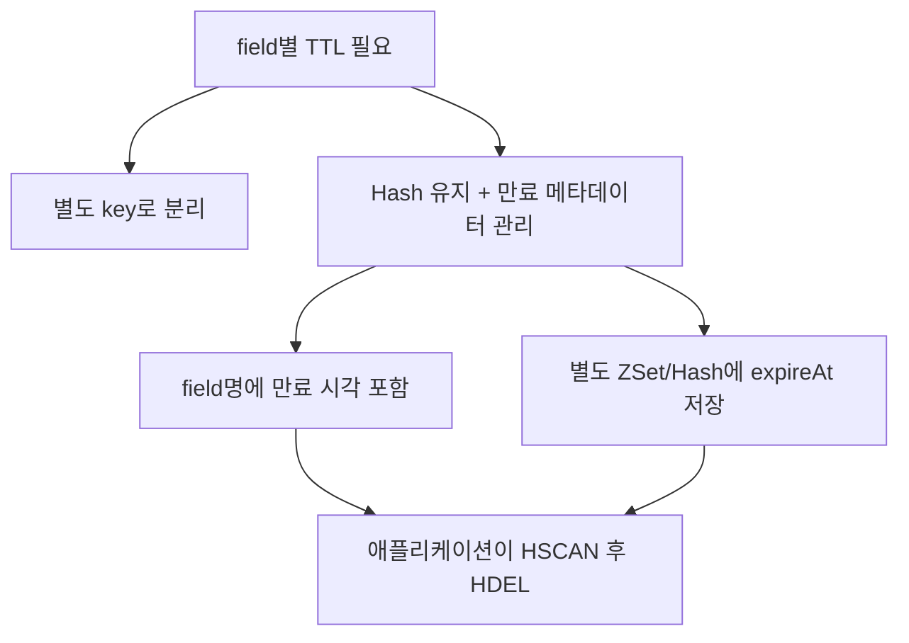

## Redis 7.4부터는 Hash Field별 TTL 설정 가능

Redis에서 TTL은 오랫동안 key 중심의 기능이었습니다. `EXPIRE user:1 60`처럼 특정 key 전체를 만료시키는 방식입니다.
이런 Key 중심의 TTL 방식은 Hash를 사용할 때는 한계가 있는데 바로 Hash 안의 개별 field마다 서로 다른 TTL을 두고 싶은 경우입니다.

예를 들어 사용자별 인증/검증 상태를 하나의 Hash에 모아 관리한다고 해보겠습니다.

```shell
HSET user:123:auth-state email_code "A1B2C3"
HSET user:123:auth-state sms_code "928341"
HSET user:123:auth-state reset_token "{...}"
HSET user:123:auth-state step_up_verified "true"
```

이 모델은 꽤 자연스럽습니다. 같은 사용자의 인증 관련 임시 상태를 한 곳에서 조회하고 관리할 수 있기 때문입니다. 하지만 각 field의 수명은 다를 수 있습니다. 예를 들어 `sms_code`는 3분, `email_code`는 10분, `reset_token`은 30분, `step_up_verified`는 5분 뒤 사라져야 할 수 있습니다.

Redis 7.4 이전의 `EXPIRE`는 field가 아니라 key에 적용되므로 아래 명령은 특정 field 하나만 만료시키는 것이 아니라 `user:123:auth-state` Hash 전체에 TTL을 설정합니다.

```shell
EXPIRE user:123:auth-state 1800
```

그래서 Hash field별 TTL을 설정하고 싶다면 Redis 7.4 이전에는 이 문제를 보통 두 가지 방향으로 우회했습니다.

- field를 별도 key로 분리하고 일반 `EXPIRE`를 사용
- Hash는 유지하되 만료 시각을 애플리케이션에서 따로 관리

Redis 7.4 이전에는 왜 우회가 필요했는지, 7.4 이후에는 `HEXPIRE` 계열 명령으로 무엇이 단순해졌는지, 그리고 Spring Data Redis에서 어디까지 바로 사용할 수 있는지 정리하였습니다.

---

## 1. Redis 7.4 이전: 직접 관리

Redis 7.4 이전에는 보통 아래 두 방향 중 하나를 택했습니다.



### 1.1 별도 key로 분리

가장 단순한 방식은 Hash field를 각각 Redis key로 빼는 것입니다.

```shell
SET user:123:auth-state:email_code "A1B2C3" EX 600
SET user:123:auth-state:sms_code "928341" EX 180
SET user:123:auth-state:reset_token "{...}" EX 1800
```

Spring Data Redis에서는 보통 아래처럼 씁니다.

```kotlin
@Service
class AuthStateKeyCache(
    private val redisTemplate: StringRedisTemplate,
) {
    fun put(userId: String, field: String, value: String, ttl: Duration) {
        val key = "user:$userId:auth-state:$field"

        // Redis key 자체에 TTL을 건다.
        redisTemplate.opsForValue().set(key, value, ttl)
    }
}
```

이 방식은 가장 단순하고 안정적입니다. 대신 하나의 Hash로 묶고 싶던 데이터가 여러 key로 흩어집니다. 그룹 단위 개수나 field 목록이 필요하면 `SCAN`이나 보조 인덱스가 필요합니다.

### 1.2 Hash는 유지하고 expireAt을 따로 둔다

Hash 구조를 유지하려면 TTL을 애플리케이션이 직접 관리해야 했습니다. 보통 값은 Hash에 두고, 만료 시각은 ZSet에 따로 둡니다.

```shell
HSET user:123:auth-state email_code "A1B2C3"
ZADD user:123:auth-state:expire-at 1714719600000 email_code
```

그리고 스케줄러가 주기적으로 만료 대상을 지웁니다.

```kotlin
@Service
class AuthStateExpireJob(
    private val redisTemplate: StringRedisTemplate,
) {
    fun put(userId: String, field: String, value: String, expireAt: Instant) {
        val hashKey = hashKey(userId)
        val expireIndexKey = expireIndexKey(userId)

        redisTemplate.opsForHash<String, String>().put(hashKey, field, value)

        // 만료 시각을 score로 저장한다.
        redisTemplate.opsForZSet()
            .add(expireIndexKey, field, expireAt.toEpochMilli().toDouble())
    }

    fun cleanup(userId: String, now: Instant) {
        val hashKey = hashKey(userId)
        val expireIndexKey = expireIndexKey(userId)

        val expiredFields = redisTemplate.opsForZSet()
            .rangeByScore(expireIndexKey, 0.0, now.toEpochMilli().toDouble())
            .orEmpty()

        if (expiredFields.isEmpty()) {
            return
        }

        redisTemplate.opsForHash<String, String>().delete(hashKey, *expiredFields.toTypedArray())
        redisTemplate.opsForZSet().remove(expireIndexKey, *expiredFields.toTypedArray())
    }

    private fun hashKey(userId: String): String {
        return "user:$userId:auth-state"
    }

    private fun expireIndexKey(userId: String): String {
        return "user:$userId:auth-state:expire-at"
    }
}
```

이 방식은 Hash 구조를 유지할 수 있습니다. 대신 스케줄러, race condition, 정리 실패 시 쓰레기 데이터 누적, ZSet과 Hash 정합성을 애플리케이션이 책임져야 합니다.

### 1.3 field명에 만료 시각을 넣는다

더 단순하게는 field명에 만료 시각을 넣는 방법도 있습니다.

```shell
HSET user:123:auth-state "1714719600000:email_code" "A1B2C3"
```

이 방식은 별도 ZSet 없이도 만료 여부를 판단할 수 있습니다. 대신 Redis가 자동으로 지워주지는 않습니다. 결국 `HSCAN`으로 field를 돌면서 만료된 항목을 `HDEL`해야 합니다.

---

## 2. Redis 7.4 이후: `HEXPIRE`로 해결

Redis 7.4부터는 Hash field 단위 expiration이 들어왔습니다. 이제 Hash 전체가 아니라 특정 field에만 TTL을 걸 수 있습니다.

```shell
HSET user:123:auth-state email_code "A1B2C3"
HSET user:123:auth-state sms_code "928341"

HEXPIRE user:123:auth-state 600 FIELDS 1 email_code
HEXPIRE user:123:auth-state 180 FIELDS 1 sms_code
```

TTL 조회도 field 단위로 할 수 있습니다.

```shell
HTTL user:123:auth-state FIELDS 2 email_code sms_code
```

만료를 없애려면 `HPERSIST`를 씁니다.

```shell
HPERSIST user:123:auth-state FIELDS 1 email_code
```

자주 쓰는 명령은 아래와 같습니다.

| 명령어         | 설명                 | 기준 단위              |
| -------------- | -------------------- | ---------------------- |
| `HEXPIRE`      | field TTL 설정       | 초                     |
| `HPEXPIRE`     | field TTL 설정       | 밀리초                 |
| `HEXPIREAT`    | field 만료 시각 설정 | Unix timestamp, 초     |
| `HPEXPIREAT`   | field 만료 시각 설정 | Unix timestamp, 밀리초 |
| `HTTL`         | field TTL 조회       | 초                     |
| `HPTTL`        | field TTL 조회       | 밀리초                 |
| `HEXPIRETIME`  | field 만료 시각 조회 | Unix timestamp, 초     |
| `HPEXPIRETIME` | field 만료 시각 조회 | Unix timestamp, 밀리초 |
| `HPERSIST`     | field 만료 제거      | 없음                   |

`HEXPIRE`에는 조건 옵션도 있습니다.

```shell
HEXPIRE user:123:auth-state 600 NX FIELDS 1 email_code
HEXPIRE user:123:auth-state 1200 XX FIELDS 1 email_code
HEXPIRE user:123:auth-state 1800 GT FIELDS 1 email_code
HEXPIRE user:123:auth-state 300 LT FIELDS 1 email_code
```

- `NX`: 만료 시간이 없는 field에만 TTL 설정
- `XX`: 이미 만료 시간이 있는 field에만 TTL 설정
- `GT`: 기존 TTL보다 새 TTL이 더 클 때만 갱신
- `LT`: 기존 TTL보다 새 TTL이 더 작을 때만 갱신

`NX`, `XX`, `GT`, `LT`는 함께 쓸 수 없습니다. 또 `GT`, `LT`를 판단할 때 TTL이 없는 field는 무한대 TTL처럼 취급합니다. 그래서 TTL이 없는 field에 `GT`를 주면 조건이 맞지 않고, `LT`는 조건이 맞을 수 있습니다.

반환값은 field별 결과 배열입니다. 다만 설정, 조회, 제거 계열은 의미가 조금씩 달라 표를 나눠서 보는 편이 낫습니다.

`HEXPIRE`, `HPEXPIRE`, `HEXPIREAT`, `HPEXPIREAT`의 반환값은 다음과 같습니다.

| 반환값 | 의미                                            |
| ------ | ----------------------------------------------- |
| `1`    | TTL 설정 또는 갱신 성공                         |
| `0`    | 조건이 맞지 않아 TTL 미설정                     |
| `2`    | TTL이 0이거나 과거 시각이라 field가 즉시 삭제됨 |
| `-2`   | key 또는 field가 없어서 처리하지 못함           |

`HTTL`, `HPTTL`, `HEXPIRETIME`, `HPEXPIRETIME`의 반환값은 다음과 같습니다.

| 반환값 | 의미                    |
| ------ | ----------------------- |
| 양수   | TTL 또는 만료 시각      |
| `-1`   | field는 있지만 TTL 없음 |
| `-2`   | key 또는 field가 없음   |

`HPERSIST`의 반환값은 다음과 같습니다

| 반환값 | 의미                             |
| ------ | -------------------------------- |
| `1`    | TTL 제거 성공                    |
| `-1`   | field는 있지만 제거할 TTL이 없음 |
| `-2`   | key 또는 field가 없음            |

명령 자체는 여기까지 보면 됩니다. 다만 실제로 Spring에서 쓰려면 서버 버전만 맞는다고 끝나지 않습니다.

---

## 3. Spring에서는 어떻게 쓰지?

Spring에서는 Redis Server, Lettuce, Spring Data Redis 세 레이어를 함께 봐야 합니다. 2026-05-13 기준으로 정리하면 아래와 같습니다.

| 레이어              | 필요한 버전                                                    | 이유                                                                                       |
| ------------------- | -------------------------------------------------------------- | ------------------------------------------------------------------------------------------ |
| Redis Server        | Redis 7.4 이상                                                 | `HEXPIRE`, `HTTL`, `HPERSIST` 등 field expiration 명령 제공                                |
| Lettuce             | Lettuce 6.4 이상                                               | Hash Field Expiration 명령을 sync, async, reactive API에서 지원                            |
| Spring Data Redis   | Spring Data Redis 3.5 이상                                     | `HashOperations.expire`, `getTimeToLive`, `persist`, `expiration` API 제공                 |
| Redis 8 helper 명령 | Redis 8.0 이상 + Lettuce 6.6 이상 + Spring Data Redis 4.0 이상 | `HSETEX`, `HGETEX`, `HGETDEL`을 `putAndExpire`, `getAndExpire`, `getAndDelete`로 사용 가능 |

정리하면 `Redis 7.4 + Lettuce 6.4 + Spring Data Redis 3.5`면 `HEXPIRE` 계열을 쓸 수 있습니다. `Redis 8 + Lettuce 6.6 + Spring Data Redis 4.0`이면 `HSETEX`, `HGETEX`, `HGETDEL`까지 Spring API로 다루기 좋습니다. 버전 조건이 맞는다면 그다음은 `RedisTemplate` 기준으로 보면 됩니다.

### 3.1 `RedisTemplate` 예시

고수준 API만 쓰면 `RedisTemplate` 기준 코드는 아래처럼 정리할 수 있습니다.

```kotlin
import org.springframework.data.redis.core.RedisTemplate

@Service
class RedisTemplateHashFieldTtlCache(
    private val redisTemplate: RedisTemplate<String, String>,
) {
    fun putWithTtl(hashKey: String, field: String, value: String, ttl: Duration) {
        val hash = redisTemplate.opsForHash<String, String>()

        hash.put(hashKey, field, value)

        // Redis 7.4+ HEXPIRE key seconds FIELDS 1 field 에 대응한다.
        val changes = hash.expire(hashKey, ttl, listOf(field))

        if (changes == null || !changes.allOk()) {
            throw IllegalStateException("Hash field TTL 설정 실패. hashKey=$hashKey, field=$field")
        }
    }

    fun get(hashKey: String, field: String): String? {
        return redisTemplate.opsForHash<String, String>().get(hashKey, field)
    }

    fun getTtl(hashKey: String, field: String): Duration? {
        val hash = redisTemplate.opsForHash<String, String>()

        val expirations = hash.getTimeToLive(hashKey, listOf(field)) ?: return null

        return expirations.ttlOf(field)
    }

    fun removeTtl(hashKey: String, field: String) {
        val hash = redisTemplate.opsForHash<String, String>()

        // Redis 7.4+ HPERSIST key FIELDS 1 field 에 대응한다.
        hash.persist(hashKey, listOf(field))
    }

    fun delete(hashKey: String, field: String) {
        redisTemplate.opsForHash<String, String>().delete(hashKey, field)
    }
}
```

다음은 서비스 코드 입니다.

```kotlin
@Service
class AuthStateService(
    private val cache: RedisTemplateHashFieldTtlCache,
) {
    fun saveSmsCode(userId: String, code: String) {
        val hashKey = "user:$userId:auth-state"
        cache.putWithTtl(hashKey, "sms_code", code, Duration.ofMinutes(3))
    }

    fun findSmsCode(userId: String): String? {
        val hashKey = "user:$userId:auth-state"
        return cache.get(hashKey, "sms_code")
    }
}
```

실제 Redis 명령 흐름은 아래와 같습니다.

```shell
HSET user:123:auth-state sms_code "928341"
HEXPIRE user:123:auth-state 180 FIELDS 1 sms_code
HGET user:123:auth-state sms_code
HTTL user:123:auth-state FIELDS 1 sms_code
```

여기서 주의할 점은 둘입니다.

- `HSET`과 `HEXPIRE`가 분리되어 있어 중간 실패가 나면 TTL 없는 field가 남을 수 있다.
- `HSET`으로 field 값을 덮어쓰면 기존 TTL이 사라질 수 있으므로, 갱신 뒤 TTL을 다시 설정해야 한다.

위 예시는 Redis 7.4에서 `HEXPIRE`를 쓰는 가장 기본적인 형태입니다. 다만 방금 본 두 가지 주의점이 특히 민감한 곳이 인증 상태 캐시입니다. 인증 코드나 재설정 토큰처럼 저장과 TTL 설정이 항상 함께 가야 하는 데이터는 Redis 8의 `HSETEX`까지 같이 보는 편이 자연스럽습니다.

### 3.2 인증 상태처럼 TTL이 항상 함께 가는 경우

이 경우에는 Redis 8의 `HSETEX`가 더 잘 맞습니다.

Redis 7.4에서는 두 단계로 처리합니다.

```shell
HSET user:123:auth-state reset_token "{...updated...}"
HEXPIRE user:123:auth-state 1800 FIELDS 1 reset_token
```

Redis 8에서는 한 명령으로 묶습니다.

```shell
HSETEX user:123:auth-state EX 1800 FIELDS 1 reset_token "{...updated...}"
```

핵심 차이는 중간 상태가 생기느냐입니다. `HSET`과 `HEXPIRE`를 따로 호출하면 둘 사이에 실패 구간이 생깁니다. `HSETEX`는 값 저장과 TTL 설정을 한 번에 처리합니다. 그래서 재설정 토큰, SMS 인증 코드, 일회성 검증 상태처럼 반드시 만료되어야 하는 데이터에 더 잘 맞습니다.

Redis 7.4에서도 `MULTI`/`EXEC`나 Lua script로 `HSET`과 `HEXPIRE`를 묶을 수는 있습니다. 다만 이 패턴이 반복되면 Redis 8의 `HSETEX`가 더 단순합니다. 참고로 pipeline은 네트워크 최적화일 뿐 원자성을 보장하지 않습니다.

Spring Data Redis 4.0 이상에서는 `HashOperations.putAndExpire`로 이 패턴을 다룰 수 있습니다.

```kotlin
import org.springframework.data.redis.connection.RedisHashCommands
import org.springframework.data.redis.core.RedisTemplate

@Service
class Redis8AuthStateCache(
    private val redisTemplate: RedisTemplate<String, String>,
) {
    fun put(userId: String, field: String, value: String, ttl: Duration) {
        val hash = redisTemplate.opsForHash<String, String>()

        val changed = hash.putAndExpire(
            hashKey(userId),
            mapOf(field to value),
            RedisHashCommands.HashFieldSetOption.upsert(),
            Expiration.from(ttl)
        )

        if (changed != true) {
            throw IllegalStateException("인증 상태 저장 실패. userId=$userId, field=$field")
        }
    }

    fun getAndRefresh(userId: String, field: String, ttl: Duration): String? {
        val hash = redisTemplate.opsForHash<String, String>()

        val values = hash.getAndExpire(
            hashKey(userId),
            Expiration.from(ttl),
            listOf(field)
        )

        return values?.firstOrNull()
    }

    private fun hashKey(userId: String): String {
        return "user:$userId:auth-state"
    }
}
```

정리하면 선택 기준은 다음과 같습니다.

| 상황                                                   | 추천                                                       |
| ------------------------------------------------------ | ---------------------------------------------------------- |
| Redis 7.4를 사용한다                                   | `HSET` 후 `HEXPIRE`, 즉 `HashOperations.put` 후 `expire`   |
| Redis 8을 사용하고 값 저장과 TTL 설정이 항상 함께 간다 | `HSETEX`, 즉 `HashOperations.putAndExpire`                 |
| 조회할 때마다 TTL을 연장하는 임시 검증 상태다          | `HGETEX`, 즉 `HashOperations.getAndExpire`                 |
| TTL이 없는 영구 field와 TTL field가 섞인다             | `HEXPIRE`, `HPERSIST`, `HSETEX KEEPTTL` 여부를 명확히 분리 |

### 3.3 Spring API가 없으면 raw command로 우회

Spring Boot 3.5 계열은 Redis 7.4의 `HEXPIRE` 고수준 API는 제공합니다. 다만 Redis 8의 `HSETEX`, `HGETEX`, `HGETDEL` 고수준 API는 아직 없습니다. 그래도 서버와 클라이언트가 지원하면 raw command로 우회할 수 있습니다.

아래 예시는 `StringRedisTemplate`에서 Redis 8 명령을 직접 호출하는 방식입니다.

```kotlin
import java.nio.charset.StandardCharsets
import java.time.Duration

import org.springframework.data.redis.core.RedisCallback
import org.springframework.data.redis.core.StringRedisTemplate
import org.springframework.stereotype.Component

@Component
class Redis8HashFieldRawCommands(
    private val redisTemplate: StringRedisTemplate,
) {
    fun hsetex(hashKey: String, field: String, value: String, ttl: Duration): Boolean {
        require(!ttl.isZero && !ttl.isNegative) {
            "ttl은 0보다 커야 합니다. ttl=$ttl"
        }

        val result = redisTemplate.execute(RedisCallback<Long> { connection ->
            connection.execute(
                "HSETEX",
                b(hashKey),
                b("EX"),
                b(ttl.seconds.toString()),
                b("FIELDS"),
                b("1"),
                b(field),
                b(value),
            ) as Long?
        })

        return result == 1L
    }

    fun hgetex(hashKey: String, field: String, ttl: Duration): String? {
        require(!ttl.isZero && !ttl.isNegative) {
            "ttl은 0보다 커야 합니다. ttl=$ttl"
        }

        val values = redisTemplate.execute(RedisCallback<List<ByteArray?>> { connection ->
            @Suppress("UNCHECKED_CAST")
            connection.execute(
                "HGETEX",
                b(hashKey),
                b("EX"),
                b(ttl.seconds.toString()),
                b("FIELDS"),
                b("1"),
                b(field),
            ) as List<ByteArray?>
        })

        return values?.firstOrNull()?.let(::s)
    }

    fun hgetdel(hashKey: String, field: String): String? {
        val values = redisTemplate.execute(RedisCallback<List<ByteArray?>> { connection ->
            @Suppress("UNCHECKED_CAST")
            connection.execute(
                "HGETDEL",
                b(hashKey),
                b("FIELDS"),
                b("1"),
                b(field),
            ) as List<ByteArray?>
        })

        return values?.firstOrNull()?.let(::s)
    }

    private fun b(value: String): ByteArray {
        return value.toByteArray(StandardCharsets.UTF_8)
    }

    private fun s(value: ByteArray): String {
        return String(value, StandardCharsets.UTF_8)
    }
}
```

CLI 기준으로는 아래와 같습니다.

```shell
HSETEX user:123:auth-state EX 1800 FIELDS 1 reset_token "{...}"
HGETEX user:123:auth-state EX 1800 FIELDS 1 reset_token
HGETDEL user:123:auth-state FIELDS 1 reset_token
```

raw command는 특정 명령을 먼저 써야 할 때 유용합니다. 대신 비용도 분명합니다.

- 컴파일 타임에 Redis 명령 문법을 검증해주지 않는다.
- 응답 타입을 직접 캐스팅해야 한다.
- serializer 정책을 직접 맞춰야 한다.
- 밀리초 정밀도가 필요하면 `EX` 대신 `PX`를 써야 한다.
- Redis 8 미만 서버에서는 `ERR unknown command`가 난다.
- Spring Data Redis 고수준 API보다 테스트 책임이 커진다.

그래서 서비스 코드 곳곳에서 직접 호출하기보다 작은 adapter로 감싸고 통합 테스트를 붙이는 편이 낫습니다.

### 3.4 Spring Data Redis가 낮고 Lettuce는 높은 경우

Spring Data Redis가 3.5 미만이라 `HashOperations.expire`가 없다면 선택지는 두 가지입니다. 가능하면 Spring Data Redis를 올리고, 어렵다면 Lettuce native API나 raw Redis command를 직접 호출합니다. Lettuce 6.4 이상은 `hexpire`, `httl`, `hpersist` 같은 메서드를 제공합니다.

```kotlin
val commands: RedisCommands<String, String> = connection.sync()

commands.hset("user:123:auth-state", "sms_code", "928341")
val result: List<Long> = commands.hexpire(
    "user:123:auth-state",
    Duration.ofMinutes(3),
    "sms_code"
)
```

다만 추상화를 우회하면 connection lifecycle, serialization, transaction 처리 방식이 달라질 수 있습니다. native API도 adapter로 감싸는 편이 좋습니다.

---

## 4. 적용 전에 확인할 것들

### 4.1 실제 버전은 이렇게 확인한다

여기까지 보면 결국 중요한 것은 "지금 프로젝트가 어떤 조합인지"입니다. 현재 버전은 아래처럼 확인할 수 있습니다.

```shell
./gradlew dependencyInsight --dependency lettuce-core
./gradlew dependencyInsight --dependency spring-data-redis
```

Maven이라면 다음 명령을 사용할 수 있습니다.

```shell
./mvnw dependency:tree | grep -E "lettuce-core|spring-data-redis"
```

Redis 서버 버전은 다음처럼 확인합니다.

```shell
redis-cli INFO server | grep redis_version
```

Spring Boot를 쓴다면 `spring-boot-starter-data-redis` 버전만 보지 말고 실제 resolved dependency도 확인하는 편이 좋습니다. 최소 기준은 아래와 같습니다.

```text
Redis Server >= 7.4
Lettuce >= 6.4
Spring Data Redis >= 3.5
```

Redis 8 helper 명령까지 쓰려면 아래 조합도 확인합니다.

```text
Redis Server >= 8.0
Lettuce >= 6.6
Spring Data Redis >= 4.0
```

### 4.2 Spring Boot BOM 버전 매핑

Spring Boot를 쓴다면 starter 버전만 보면 부족합니다. 실제로 끌려오는 `spring-data-redis`, `lettuce-core` 버전도 같이 봐야 합니다. 2026-05-13 기준 매핑은 아래와 같습니다.

| Spring Boot 기준   | starter 버전                            | Spring Data Redis | Lettuce       | Redis 7.4 `HEXPIRE` 고수준 API                                 | Redis 8 `HSETEX`, `HGETEX`, `HGETDEL` 고수준 API                                          |
| ------------------ | --------------------------------------- | ----------------- | ------------- | -------------------------------------------------------------- | ----------------------------------------------------------------------------------------- |
| Spring Boot 3.5.14 | `spring-boot-starter-data-redis` 3.5.14 | 3.5.11            | 6.6.0.RELEASE | 가능. `HashOperations.expire`, `getTimeToLive`, `persist` 사용 | Spring Data Redis 고수준 API는 4.0부터. 필요하면 raw command 또는 Lettuce native API 검토 |
| Spring Boot 4.0.6  | `spring-boot-starter-data-redis` 4.0.6  | 4.0.5             | 6.8.2.RELEASE | 가능                                                           | 가능. `putAndExpire`, `getAndExpire`, `getAndDelete` 사용                                 |

즉 Spring Boot 3.5 계열만으로도 Redis 7.4의 Hash field expiration은 사용할 수 있습니다. 다만 Redis 8 helper 명령을 Spring API로 쓰려면 Spring Data Redis 4.0 이상이 필요합니다. 또 dependency override가 있으면 BOM 표와 실제 런타임 버전이 다를 수 있으니, 최종 확인은 `dependencyInsight`나 `dependency:tree`로 하는 편이 안전합니다.

### 4.3 라이선스도 같이 봐야 한다

Hash field TTL이 필요하다고 해서 Redis 7.4 이상으로 바로 올리면 안 됩니다. 이유는 단순한 기능 업그레이드가 아니라, Redis 7.4부터 라이선스 조건도 달라졌기 때문입니다.

Redis 7.2.x 이하의 Redis Open Source는 BSD 3-Clause 기준으로 볼 수 있지만, Redis 7.4.x 계열부터는 RSALv2 또는 SSPLv1 중 하나를 선택해야 합니다. 이 두 라이선스는 OSI-approved open source license가 아니므로, 조직의 오픈소스 정책이나 관리형 서비스 제공, 재배포 조건과 충돌하지 않는지 확인해야 합니다.

Redis 8.x부터는 RSALv2, SSPLv1에 더해 AGPLv3 선택지가 추가되었습니다. 따라서 Redis 8은 다시 OSI-approved open source license 선택이 가능해졌다고 볼 수 있습니다. 다만 AGPLv3는 BSD 3-Clause 같은 permissive license가 아니라 network copyleft 성격이 있으므로, 수정한 Redis를 네트워크 서비스로 제공하거나 배포하는 경우 소스 공개 의무를 검토해야 합니다.

정리하면 아래와 같습니다.

| Redis 계열       | 라이선스 기준                  | Hash field TTL                                              | 확인할 점                                                                                                           |
| ---------------- | ------------------------------ | ----------------------------------------------------------- | ------------------------------------------------------------------------------------------------------------------- |
| Redis 7.2.x 이하 | BSD 3-Clause                   | 없음                                                        | 라이선스는 단순하지만 `HEXPIRE`가 없으므로 별도 key, sorted set, 애플리케이션 정리 로직 필요                        |
| Redis 7.4.x 계열 | RSALv2 또는 SSPLv1             | 있음. `HEXPIRE` 사용 가능                                   | OSI-approved open source license가 아니므로 조직 정책, managed service 제공, 재배포 조건 확인 필요                  |
| Redis 8.x 이상   | RSALv2 또는 SSPLv1 또는 AGPLv3 | 있음. `HEXPIRE`, `HSETEX`, `HGETEX`, `HGETDEL` 등 사용 가능 | AGPLv3 선택 가능. 단, AGPLv3는 network copyleft 성격이 있으므로 수정/배포/서비스 제공 정책 확인 필요                |
| Valkey 9.0 이상  | BSD 계열                       | 있음                                                        | Redis 명령 호환성이 높더라도 client, persistence, replication, cluster, managed service 지원, 운영 차이 테스트 필요 |

라이센스별 기준을 보자면 아래와 같습니다.

| 라이선스      | 무료 사용 가능한 경우                                                            | 배포 가능 여부                              | 네트워크 서비스 제공 가능 여부                                            | 관리형 Redis/DBaaS 제공 가능 여부                                                         | 주요 의무/제약                                                                                                  |
| ------------- | -------------------------------------------------------------------------------- | ------------------------------------------- | ------------------------------------------------------------------------- | ----------------------------------------------------------------------------------------- | --------------------------------------------------------------------------------------------------------------- |
| BSD 3-Clause  | 내부 사용, 상용 서비스 사용, 수정 사용 모두 가능                                 | 가능                                        | 가능                                                                      | 가능                                                                                      | 저작권 고지, 라이선스 고지, 보증 부인 문구 유지 필요                                                            |
| RSALv2        | 일반 애플리케이션에서 Redis를 내부 캐시/세션/큐 등으로 사용하는 것은 대체로 가능 | 가능하나 라이선스 범위 확인 필요            | 가능하나 Redis와 경쟁하는 서비스 제공은 제한될 수 있음                    | 제한/금지 성격이 강함                                                                     | 데이터베이스, 캐싱, 스트리밍, 검색, AI feature store 등 Redis와 경쟁하는 관리형 서비스 제공 제한 확인 필요      |
| SSPLv1        | 내부 사용이나 일반 애플리케이션 사용은 가능                                      | 가능하나 SSPL 조건 준수 필요                | 가능하나 서비스 제공 시 소스 공개 의무 리스크 큼                          | 가능하더라도 서비스 운영에 필요한 전체 소스 공개 의무가 발생할 수 있어 실무적으로 부담 큼 | 소프트웨어를 서비스로 제공하는 경우 관리, 운영, 오케스트레이션, 모니터링 등 서비스 제공 코드까지 공개 요구 가능 |
| AGPLv3        | 내부 사용, 상용 애플리케이션에서 사용 가능                                       | 가능하나 수정본 배포 시 소스 공개 의무 발생 | 가능하나 수정한 프로그램을 네트워크로 제공하면 해당 수정본 소스 제공 필요 | 가능 여부는 서비스 구조에 따라 검토 필요                                                  | 수정본의 네트워크 제공 시 소스 공개 의무. BSD처럼 permissive하지 않음                                           |
| 상용 라이선스 | 계약 조건에 따름                                                                 | 계약 조건에 따름                            | 계약 조건에 따름                                                          | 계약 조건에 따름                                                                          | 비용, 사용 범위, 배포 범위, SLA, 지원 조건이 계약에 의해 결정됨                                                 |

이걸 회사에서 사용케이스를 나눠보면 아래와 같습니다.

| 사용 시나리오                                               | BSD 3-Clause / Valkey |      Redis 7.4 RSALv2 |                   Redis 7.4 SSPLv1 |                  Redis 8 AGPLv3 |
| ----------------------------------------------------------- | --------------------: | --------------------: | ---------------------------------: | ------------------------------: |
| 회사 내부 시스템에서 캐시로 사용                            |                  가능 |           대체로 가능 |                               가능 |                            가능 |
| SaaS 백엔드에서 Redis를 세션/캐시로 사용                    |                  가능 |           대체로 가능 |                               가능 |                            가능 |
| Redis를 수정하지 않고 Docker 이미지로 내부 배포             |                  가능 |        가능 범위 확인 |                 가능하나 조건 확인 |                            가능 |
| Redis를 수정해서 사내에서만 사용                            |                  가능 |        가능 범위 확인 |                               가능 |                            가능 |
| Redis를 수정해서 고객에게 제품과 함께 배포                  |                  가능 |        조건 검토 필요 |           소스 공개 의무 검토 필요 | 수정본 소스 공개 의무 검토 필요 |
| Redis를 수정해서 외부 네트워크 서비스로 제공                |                  가능 |        조건 검토 필요 |       서비스 전체 소스 공개 리스크 |           수정본 소스 공개 의무 |
| Redis 호환 managed cache 서비스를 판매                      |                  가능 | 고위험/제한 가능성 큼 | 고위험. 서비스 코드 공개 의무 가능 |              구조에 따라 고위험 |
| AWS ElastiCache 같은 관리형 Redis 서비스를 직접 운영해 판매 |                  가능 | 사실상 법무 검토 필수 |              사실상 법무 검토 필수 |           사실상 법무 검토 필수 |


따라서 Hash field TTL 같은 특정 기능만 보고 Redis 버전을 올리기보다는, 필요한 명령 지원 여부와 함께 라이선스 조건을 먼저 확인해야 합니다. 특히 Redis 7.4 이상은 기존 BSD 3-Clause 기준과 달라지므로, 내부 사용인지, 수정·배포가 있는지, 관리형 서비스 제공 성격이 있는지에 따라 Redis 8, Valkey, 또는 기존 구조 유지 중 어떤 선택이 적절한지 판단해야 합니다.

---

## 5. 그럼 클러스터 환경에서는 어떻게 사용할까?

`HEXPIRE`는 단일 Hash key 명령이라 Cluster에서도 cross-slot 문제는 없습니다. 즉 명령 자체는 그대로 쓸 수 있습니다. 사용자별로 `user:123:auth-state` 같은 Hash를 쓰는 모델이라면 보통 hot key 위험도 크지 않습니다.

트래픽이 작거나 사용자 단위 Hash라면 아래처럼 써도 충분합니다.

```text
user:123:auth-state
```

다만 운영 편의 때문에 많은 사용자의 인증 상태를 테넌트 단위 Hash 하나에 모아두는 모델이라면 특정 slot 하나에 쓰기와 만료 처리가 몰려 hot key가 될 수 있습니다.

```text
tenant:auth-states:{tenant-a}
```

사용자 수가 많고 인증 관련 write가 잦다면 tenant나 bucket 단위로 나누는 편이 낫습니다.

```text
tenant:auth-states:{tenant-a:00}
tenant:auth-states:{tenant-a:01}
tenant:auth-states:{tenant-a:02}
tenant:auth-states:{tenant-b:00}
```

Spring 코드에서는 아래처럼 key를 만들 수 있습니다.

```kotlin
class AuthStateHashKeyResolver {

    fun resolve(tenantId: String, userId: String): String {
        val bucket = Math.floorMod(userId.hashCode(), BUCKET_SIZE)
            .toString()
            .padStart(2, '0')

        // Redis Cluster hash tag는 중괄호 안의 값으로 slot을 계산한다.
        return "tenant:auth-states:{$tenantId:$bucket}"
    }

    companion object {
        private const val BUCKET_SIZE = 64
    }
}
```

이렇게 하면 tenant 안에서도 user id 기준으로 bucket이 나뉘어 부하를 분산할 수 있습니다. 반대로 특정 사용자의 인증 상태와 함께 갱신해야 하는 보조 key가 있다면 같은 hash tag를 써서 같은 slot에 묶어야 합니다.

```text
tenant:auth-states:{tenant-a:03}
tenant:auth-states:index:{tenant-a:03}
```

- 단일 Hash 명령만 사용한다면 cross-slot 걱정은 작다.
- 하나의 거대한 Hash는 특정 slot과 노드에 부하가 몰릴 수 있다.
- 관련 key를 같이 갱신해야 한다면 같은 hash tag를 사용한다.
- 분산이 더 중요하다면 tenant, user, bucket 단위로 Hash key를 쪼갠다.

---

## 6. 그러면 왜 이전에는 Field별 TTL을 지원안했을까?

Hash field TTL은 오래전부터 있으면 좋겠다고 느껴지는 기능인데, 왜 Redis는 7.4가 되서야 기능을 추가해주었는지 찾아봤습니다.

공식 설명을 보면 이건 단순히 명령 하나를 추가하면 끝나는 문제가 아니었습니다. 기존 expire는 top-level keyspace 기준으로 설계되어 있고, Hash field는 key처럼 항상 독립적인 Redis object가 아닙니다. 그래서 key TTL처럼 메타데이터를 바로 붙이기도 어렵고, active expiration과 passive expiration을 모두 지원하면서도 메모리 효율과 latency를 같이 지켜야 했습니다. 결국 "field마다 TTL 하나 저장하면 되지 않을까" 수준보다 훨씬 까다로운 문제였던 셈입니다.

그래서 Redis가 이걸 내부에서 어떻게 풀었는지 조금 더 들여다보면, 왜 이 기능이 늦게 들어왔는지도 같이 이해할 수 있습니다. Redis 8.0.6 소스를 기준으로 보면 hash field expire는 key TTL과 별도 경로로 관리됩니다.

`redisDb`에는 key TTL용 `expires`와 별도로 hash field expiration용 `hexpires`가 있습니다.

```c
typedef struct redisDb {
    kvstore *keys;
    kvstore *expires;
    ebuckets hexpires;
} redisDb;
```

핵심만 보면 아래와 같습니다.

- DB 전역에서는 `hexpires`로 "만료 대상 field를 가진 Hash"를 추적하고, 각 Hash object는 자기 field TTL 메타데이터를 별도로 관리합니다.
- active expire는 background cycle에서 만료 field를 정리합니다.
- passive expire는 `HGET`, `HEXISTS`, `HRANDFIELD` 같은 조회 경로에서도 만료 여부를 확인합니다.
- 실제 삭제는 replica와 AOF에 `HDEL key field` 형태로 전파됩니다. 마지막 field가 지워지면 Hash key도 자연스럽게 사라집니다.
- 내부 인코딩은 `OBJ_ENCODING_LISTPACK_EX`와 `OBJ_ENCODING_HT` 경로로 나뉩니다.

Redis Search를 함께 쓴다면 한 가지를 더 봐야 합니다. Redis 8부터는 query 시작 시점에 유효한 key와 field만 결과 계산에 포함합니다. 하지만 실행 중 active expiration이 일어나면 요청한 수보다 적은 결과가 돌아올 수 있습니다. 그래서 검색 조건에 쓰는 field에 TTL을 걸었다면 업그레이드 전후 검색 결과 차이도 같이 확인하는 편이 좋습니다.

---

## 7. 그럼 비용은 어느 정도일까?

여기까지 보면 기능과 사용 방법은 어느 정도 정리됩니다. 그다음 궁금한 것은 비용입니다. `HEXPIRE`가 들어오면서 구조는 단순해졌지만, field 수가 많아졌을 때 명령 비용이 어떻게 달라지는지 정도는 같이 보고 가는 편이 좋습니다.

### Redis 7.4 이후 `HEXPIRE`를 쓸 때

Hash field 수를 `N`, TTL을 설정할 field 수를 `K`라고 하겠습니다.

- `HGET key field`: 평균 `O(1)`
- `HSET key field value`: 평균 `O(1)`
- `HEXPIRE key seconds FIELDS K field...`: `O(K)`
- `HTTL key FIELDS K field...`: `O(K)`
- `HSETEX key ... FIELDS K field value...`: `O(K)`
- `HGETEX key ... FIELDS K field...`: `O(K)`
- `HGETALL key`: `O(N)`
- 공간 복잡도: Hash field 저장 공간 `O(N)` + field expiration 메타데이터 `O(K)`

대부분의 일반 조회는 기존 Hash와 동일합니다. TTL 설정과 조회는 지정한 field 개수에 비례합니다. 내부적으로는 field TTL을 추적하는 metadata와 ebuckets 비용이 추가됩니다.

## 정리

핵심은 단순합니다. Redis 7.4 이전에는 Hash field별 TTL이 없어서 별도 key로 분리하거나 만료 인덱스를 따로 관리해야 했지만, Redis 7.4부터는 `HEXPIRE`로 이 문제를 Redis 안에서 직접 풀 수 있습니다. Hash 구조를 유지하면서 field마다 다른 TTL이 필요하다면 이 방식이 가장 자연스럽고, Spring에서는 `Redis Server 7.4+`, `Lettuce 6.4+`, `Spring Data Redis 3.5+` 조합부터 확인하면 됩니다.

다만 값 저장과 TTL 설정이 항상 함께 가야 하면 Redis 8의 `HSETEX`와 Spring Data Redis 4.0의 `putAndExpire`까지 같이 보는 편이 좋고, 업그레이드가 어렵다면 Hash + ZSet expire index 같은 우회 방식이 현실적인 대안이 됩니다. 그리고 `HSET` 갱신 시 TTL이 사라질 수 있다는 점, 큰 Hash 하나가 Cluster에서 hot key가 될 수 있다는 점, Redis 7.4+/8.x 도입 시 라이선스와 운영 정책까지 함께 확인해야 한다는 점은 끝까지 같이 가져가야 합니다.

---

## 출처

- [Redis Hashes 문서](https://redis.io/docs/latest/develop/data-types/hashes/)
- [Redis HEXPIRE 명령 문서](https://redis.io/docs/latest/commands/hexpire/)
- [Redis HSETEX 명령 문서](https://redis.io/docs/latest/commands/hsetex/)
- [Redis HGETEX 명령 문서](https://redis.io/docs/latest/commands/hgetex/)
- [Redis HGETDEL 명령 문서](https://redis.io/docs/latest/commands/hgetdel/)
- [Redis Transactions 문서](https://redis.io/docs/latest/develop/using-commands/transactions/)
- [Redis Pipelining 문서](https://redis.io/docs/latest/develop/using-commands/pipelining/)
- [Redis 7.4 What's New](https://redis.io/docs/latest/develop/whats-new/7-4/)
- [Redis Licenses](https://redis.io/legal/licenses/)
- [Redis dual source-available licensing announcement](https://redis.io/blog/redis-adopts-dual-source-available-licensing/)
- [Redis AGPLv3 announcement](https://redis.io/blog/agplv3/)
- [Redis Hash field expiration architecture](https://redis.io/blog/hash-field-expiration-architecture-and-benchmarks/)
- [Redis Key and field expiration behavior](https://redis.io/docs/latest/develop/ai/search-and-query/advanced-concepts/expiration/)
- [Redis 8.0.6 server.h - redisDb hexpires](https://github.com/redis/redis/blob/8.0.6/src/server.h#L1065-L1069)
- [Redis 8.0.6 expire.c - activeExpireHashFieldCycle](https://github.com/redis/redis/blob/8.0.6/src/expire.c#L139-L185)
- [Redis 8.0.6 t_hash.c - HFE 구조 설명](https://github.com/redis/redis/blob/8.0.6/src/t_hash.c#L100-L129)
- [Redis 8.0.6 t_hash.c - passive expire 경로](https://github.com/redis/redis/blob/8.0.6/src/t_hash.c#L723-L800)
- [Redis 8.0.6 t_hash.c - active expire 경로](https://github.com/redis/redis/blob/8.0.6/src/t_hash.c#L1841-L1901)
- [Redis 8.0.6 t_hash.c - HDEL 전파](https://github.com/redis/redis/blob/8.0.6/src/t_hash.c#L3519-L3554)
- [Spring Data Redis HashOperations API](https://docs.spring.io/spring-data/data-redis/docs/current/api/org/springframework/data/redis/core/HashOperations.html)
- [Spring Data Redis ExpireChanges API](https://docs.spring.io/spring-data/redis/docs/current/api/org/springframework/data/redis/core/ExpireChanges.html)
- [Spring Data Redis Expirations API](https://docs.spring.io/spring-data/redis/docs/current/api/org/springframework/data/redis/core/types/Expirations.html)
- [Spring Data Redis 3.5 RedisCommands raw execute API](https://docs.spring.io/spring-data/redis/docs/3.5.x/api/org/springframework/data/redis/connection/RedisCommands.html)
- [Spring Boot 3.5 Managed Dependency Coordinates](https://docs.spring.io/spring-boot/3.5/appendix/dependency-versions/coordinates.html)
- [Spring Boot 4.0 Managed Dependency Coordinates](https://docs.spring.io/spring-boot/4.0/appendix/dependency-versions/coordinates.html)
- [Lettuce New & Noteworthy](https://redis.github.io/lettuce/new-features/)
- [Lettuce 6.4.0 Release Notes](https://github.com/redis/lettuce/releases/tag/6.4.0.RELEASE)
- [Lettuce 6.6.0 Release Notes](https://github.com/redis/lettuce/releases/tag/6.6.0.RELEASE)
- [Valkey introduction](https://valkey.io/topics/introduction/)
- [Valkey HEXPIRE command](https://valkey.io/commands/hexpire/)
