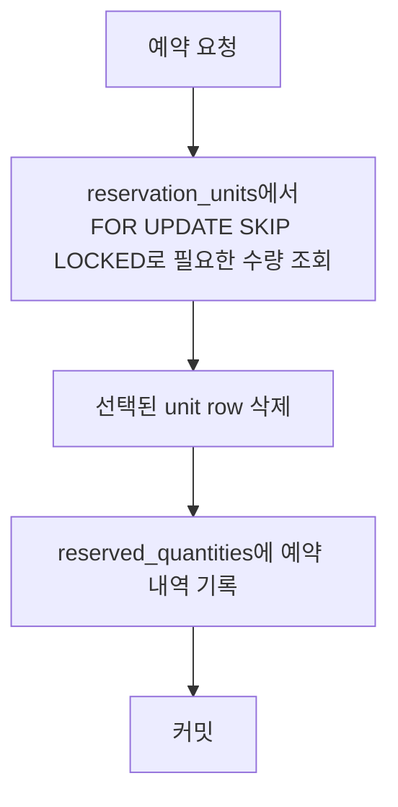

> [Shopify Engineering - We replaced Redis with MySQL for inventory reservations—and it scaled](https://shopify.engineering/scaling-inventory-reservations) 글을 읽고, 원문 흐름을 최대한 유지하면서 해설형으로 재구성한 내용입니다.  
> 원문은 2026년 5월 12일에 공개되었습니다.  
> 원문과 이해하기 위해 덧붙인 해석이나 보충 설명을 해놨으며 `원문 x` 라고 표기한 부분은 원문에 포함되지 않은 내용입니다.

Shopify가 풀고자 한 문제는 단순히 "재고를 빨리 깎는 방법"이 아닙니다. 결제 버튼을 누른 순간, **정말 남아 있는 재고만 정확하게 잡아두고**, 결제가 끝나면 **그 재고를 영구 차감**해야 합니다. 이 과정이 느리면 체크아웃이 지연되고, 이 과정이 틀리면 두 가지 문제가 생깁니다.

- 실제로는 1개뿐인 마지막 재고를 두 명에게 동시에 팔아버리는 `oversell`
- 팔 수 있는 재고가 있는데도 없다고 판단해 판매 기회를 놓치는 `undersell`

Shopify처럼 모든 체크아웃이 재고를 건드리는 환경에서는 이 문제가 단순한 동시성 이슈를 넘어 플랫폼 신뢰성과 매출에 직접 연결됩니다. 원문에서도 2025년 블랙 프라이데이 피크 시점에 분당 510만 달러의 판매가 발생했다고 설명하는데, 이런 규모에서는 작은 오차도 빠르게 누적됩니다.

---

## 1. Shopify가 풀어야 했던 정확한 문제

Shopify가 말하는 oversell protection은 크게 두 동작으로 나뉩니다.

- `Reserve`
  - 결제가 시작되면 재고를 잠깐 홀드합니다.
  - 다른 체크아웃이 같은 재고를 가져가지 못하게 막는 단계입니다.
- `Claim`
  - 결제가 성공하면 홀드했던 재고를 실제 재고 원장에서 영구 차감합니다.

이 두 단계는 모두 빨라야 하지만, 더 중요한 것은 **서로 논리적으로 분리되지 않도록** 만드는 것입니다.

### 문제의 조건 정리

- 피크 트래픽에서도 예약 처리량이 유지되어야 함
- 멀티 로케이션 재고를 고려해야 함
- 예약 정보와 실제 재고 원장 사이에 ACID 보장이 필요함
- oversell도 안 되고, 유실된 reservation도 없어야 함
- 체크아웃 전체 경로의 성능을 해치지 않아야 함

여기서 핵심은 "예약 시스템 하나만 빠르면 된다"가 아니라, **체크아웃이라는 더 큰 처리 흐름 안에서 정합성과 지연 시간을 함께 해치지 않도록 동작해야 한다**는 점입니다.

---

## 2. 기존 Redis 방식은 왜 한계에 부딪혔나

기존 시스템은 Redis를 사용했습니다. 개념은 단순합니다.

- 상품별 수량을 key로 둔다
- 예약할 때는 `DECR`
- 예약 해제할 때는 `INCR`

이 모델은 동시성 제어 자체만 놓고 보면 꽤 잘 동작합니다. Redis는 단일 스레드 기반 명령 처리 특성과 원자 연산 덕분에 이런 카운터 패턴에 강합니다.

그런데 Shopify의 진짜 문제는 "재고 예약"만 있는 것이 아니라, **예약 후 결제가 성공했을 때 실제 재고 원장과 정합성을 맞춰야 한다**는 데 있었습니다.

### Redis 모델의 근본 한계

1. 예약은 Redis에 있음
2. 실제 재고 원장은 MySQL에 있음
3. 결제가 끝나면
   - MySQL 재고 원장을 갱신해야 하고
   - Redis 예약 상태도 정리해야 함
4. 그런데 이 두 작업은 서로 다른 시스템에 있으므로 하나의 ACID 트랜잭션으로 묶을 수 없음

이러면 순서에 따라 두 가지 실패 모드가 생깁니다.

- MySQL 반영은 됐는데 Redis 정리가 안 되면
  - 이미 팔린 재고가 계속 예약된 것처럼 남아 undersell 가능성이 생김
- Redis 정리는 됐는데 MySQL 반영이 안 되면
  - 실제 재고 차감이 누락되어 oversell 가능성이 생김

즉, Redis는 reservation 자체는 잘 처리했지만, **reservation과 source of truth가 분리돼 있었다**는 점이 가장 큰 구조적 문제였습니다.

여기에 추가로 다음 한계도 있었습니다.

- 멀티 로케이션 재고를 자연스럽게 표현하기 어려움
- Redis 클러스터를 따로 운영해야 하는 부담이 있음
- 이전에 MySQL 단일 row의 `quantity` 필드에서 차감하는 방식은 경합이 심해 실패한 경험이 있었음

---

## 3. Shopify의 핵심 아이디어: quantity 1줄이 아니라 unit 여러 줄로 바꾸기

Shopify는 MySQL 8의 `SKIP LOCKED`를 활용해 접근을 완전히 바꿨습니다.

> `SKIP LOCKED`는 `SELECT ... FOR UPDATE` 같은 잠금 조회를 할 때, **다른 트랜잭션이 이미 잠가 둔 row를 기다리지 않고 건너뛰는 기능**입니다. 즉 "잠긴 row 앞에서 줄을 서는 방식"이 아니라, "지금 바로 가져갈 수 있는 row부터 집는 방식"이라고 이해하면 됩니다.
{:.prompt-info }

원문에서는 이 설계가 37signals의 database-backed load distribution 접근에서 영감을 받았다고도 설명합니다. 핵심은 Redis나 별도 coordination layer가 아니라, 데이터베이스의 row locking 자체를 고처리량 분배 장치처럼 활용할 수 있느냐였습니다.

예전처럼 "상품 1개당 row 1개 + quantity 컬럼"으로 두지 않고, **판매 가능한 재고 1개를 row 1개로 표현**했습니다.

- 재고 10개면 row 10개
- 3개 예약이면 row 3개를 잡아 이동

이 방식의 장점은 매우 분명합니다.

- 여러 트랜잭션이 같은 수량 row 하나를 두고 싸우지 않음
- `FOR UPDATE SKIP LOCKED`로 이미 잠긴 row는 건너뛰고 다른 row를 집을 수 있음
- reservation과 inventory ledger를 같은 MySQL 안에 두면 reserve/claim 과정에서 필요한 상태 변경을 각각 같은 데이터베이스 트랜잭션 경계 안에서 원자적으로 처리할 수 있음

> `Reserve -> 결제 처리 -> Claim` 전체를 하나의 긴 데이터베이스 트랜잭션으로 유지한다는 뜻은 아닙니다. 결제 처리는 외부 시스템과 시간이 걸리는 작업이므로, 여기서 중요한 것은 reservation 상태와 inventory ledger 변경이 서로 다른 저장소에 찢어져 있지 않다는 점입니다.
{:.prompt-warning }

아래는 이해를 돕기 위한 단순화된 흐름입니다.

### 왜 `SKIP LOCKED`가 중요한가

일반적인 락 기반 조회라면 다른 트랜잭션이 잡은 row 때문에 기다려야 합니다. 하지만 `SKIP LOCKED`는 이미 잠긴 row를 건너뛰고 다른 사용 가능한 row를 가져옵니다. 그래서 **핫한 재고에 여러 체크아웃이 몰려도 동일 row 대기열이 줄어듭니다.**

이것이 Shopify가 "이전에는 안 되던 MySQL 방식이 이제는 가능해진 이유"로 본 부분입니다.

> `SKIP LOCKED` 계열 기능은 DB마다 도입 시점이 다릅니다. MySQL은 `8.0.1` milestone release에서 `NOWAIT`/`SKIP LOCKED`를 추가했고, PostgreSQL은 `9.5`에서 `SELECT ... FOR UPDATE SKIP LOCKED`를 추가했습니다. MariaDB는 `10.6`에서 `SELECT ... SKIP LOCKED` 문법을 도입했습니다. Oracle은 최소 `11g` 계열 공식 문서에서 이미 `FOR UPDATE SKIP LOCKED`를 확인할 수 있습니다. SQL Server는 동일 문법은 없지만 `READPAST` 힌트가 비슷하게 "잠긴 row를 건너뛴다"는 목적에 사용됩니다.
{:.prompt-info}

---

## 4. 그런데 unit-per-row를 그대로 쓰면 또 다른 문제가 생긴다

여기서 끝이 아닙니다. 재고를 1개당 row 1개로만 관리하면, 재고 수량이 큰 상품에서는 테이블이 지나치게 커집니다.

예를 들어 원문이 든 사례처럼,

- 어떤 상품이 50,000개 있고
- 로케이션이 10개라면

단순 계산으로 관리해야 할 row 수가 매우 커집니다. 이렇게 되면 `SKIP LOCKED` 조회도 점점 비싸집니다.

### Shopify의 보정 아이디어: bounded pool

그래서 Shopify는 "실제 전체 재고를 모두 row로 복제"하지 않고, **item/location 조합별로 최대 1,000개의 사용 가능한 reservation unit pool만 유지**했습니다.

- reserve는 이 bounded pool에서 unit row를 소비
- 별도 replenishment가 inventory ledger를 기준으로 pool을 다시 채움

즉, 전체 재고를 unit row로 영구 표현한 것이 아니라, **예약 처리용으로만 제한된 버퍼를 만든 것**입니다.

### 왜 하필 1,000개였을까

원문 설명에 따르면 이 숫자는 임의로 정한 것이 아니라, 플래시 세일에서 관측한 피크 예약률을 기준으로 정한 값입니다.

- 너무 작으면 순간 트래픽을 못 버팀
- 너무 크면 테이블이 커지고 스캔 비용이 커짐

결국 1,000은 **burst를 흡수할 만큼 충분히 크고, 테이블이 비대해지지 않을 만큼 충분히 작은 값**으로 선택됐습니다.

### pool이 바닥나면 어떻게 하나

핫한 상품에서는 bounded pool이 일시적으로 비어버릴 수 있습니다. 이때 Shopify는 "품절처럼 보이게 하는 것" 대신, **reserve 경로 안에서 inline replenishment를 수행**합니다.

- 단 하나의 트랜잭션만 replenishment를 하도록 lock을 잡음
- 나머지 concurrent reserve는 기다림
- replenishment가 끝나면 다시 진행

이렇게 하면 특정 요청의 지연은 늘 수 있지만, **재고가 실제로 있는데도 놓치는 상황은 막을 수 있습니다.**

---

## 5. 실제 구현에서 중요했던 세부 결정들

원문에서 특히 좋았던 부분은 "SKIP LOCKED 하나 쓰면 끝"이 아니라, 실제로 어떤 설계 포인트가 병목과 데드락을 줄였는지 보여준 점입니다.

### 5.1 Composite Primary Key로 row당 lock 수 줄이기

처음 프로토타입은 auto-increment PK를 썼다고 합니다. 그런데 InnoDB lock 상태를 보니 예약 1건당 row lock이 1개가 아니라 2개씩 보였습니다.

이유는 다음과 같습니다.

- `WHERE` 절에 쓰이는 secondary index를 잠그고
- 실제 clustered index(PK)도 함께 잠갔기 때문

그래서 Shopify는 PK를 아래처럼 composite key로 바꿨습니다.

- `shop_id`
- `inventory_item_id`
- `inventory_group_id`
- `id`

이렇게 하면 조회 조건에 들어가는 컬럼이 PK에 포함되어, lock 수를 줄일 수 있습니다. 이 글의 중요한 포인트 중 하나는 바로 이것입니다.

**이 규모에서는 인덱스 설계가 단순한 조회 성능 문제가 아니라, lock 개수와 처리량에 직접 영향을 준다**는 것입니다.

### 5.2 `READ COMMITTED`로 gap lock 회피

MySQL 기본 격리 수준은 `REPEATABLE READ`입니다. 그런데 빈 pool에 대해 `SELECT ... FOR UPDATE SKIP LOCKED`를 수행하고 곧바로 replenishment가 일어나는 경우, gap lock이나 supremum pseudo-record lock 때문에 insert가 막히고 데드락으로 이어질 수 있었습니다.

그래서 이 트랜잭션에 한해서 격리 수준을 `READ COMMITTED`로 바꿨습니다.

이 변경의 의미는 큽니다.

- 기존 기본값을 그냥 따르지 않았음
- 락 동작을 직접 관찰한 뒤 격리 수준을 조정했음
- 프레임워크 차원에서 transaction별 isolation level 지정도 지원해야 했음

즉, 이 문제는 SQL 문장 하나의 문제가 아니라 **InnoDB 락 모델을 이해하고 트랜잭션 설정까지 건드려야 풀리는 종류의 문제**였습니다.

### 5.3 Lock 순서를 통일해 데드락 제거

Shopify는 reserve와 claim이 서로 다른 테이블을 다른 순서로 건드리면서 데드락도 만났습니다.

- reserve
  - `reserved_quantities`에 `INSERT`
  - `reservation_units`에서 `DELETE`
- claim
  - `reserved_quantities`에서 `DELETE`

이런 식으로 순서가 섞이면 트랜잭션 간 순환 대기가 생길 수 있습니다.

그래서 순서를 통일했습니다.

- reserve는 항상 `reservation_units`를 먼저 `DELETE`
- 그 다음 `reserved_quantities`에 `INSERT`
- claim은 `reserved_quantities`만 처리

핵심은 복잡한 데드락 재시도 로직보다 먼저, **락 획득 순서를 맞춰서 원인을 제거하는 것**입니다.

### 5.4 `UNION ALL`로 여러 line item을 배치 처리

장바구니에 line item이 여러 개 있으면 예약 쿼리도 여러 번 날아갈 수 있습니다. Shopify는 이를 `UNION ALL`로 묶어 한 번에 가져오도록 최적화해 round trip을 줄였습니다.

이것은 거대한 혁신은 아니지만, 고부하에서는 이런 작은 왕복 감소가 실제 latency에 영향을 줍니다.

---

## 6. 그런데 진짜 병목은 쿼리가 아니라 connection이었다

이 글의 가장 흥미로운 부분은 여기입니다.

Shopify는 MySQL 설계를 개선한 뒤에도 목표 처리량보다 낮은 지점에서 ceiling을 만났습니다. 그런데 이상하게도:

- reservation latency는 괜찮았고
- CPU도 꽉 차지 않았고
- 쿼리도 충분히 최적화된 것처럼 보였습니다

즉, 흔히 "DB가 느리다"라고 말할 때 기대하는 신호가 아니었습니다.

원문에 따르면 Shopify는 처음부터 connection hold time을 정답으로 본 것은 아니었습니다. 여러 checkout의 reservation을 하나의 `SKIP LOCKED` 쿼리로 묶어 connection 사용량을 줄이는 실험도 했고, 일부 read load를 replica로 옮기기도 했습니다. 하지만 load test에서는 도움이 되었어도 복잡도가 커졌고, 여전히 설명되지 않는 병목이 남았습니다.

### 관측된 증상

- MySQL 내부에서 thread queue가 생김
- queued work가 실행될 때 CPU가 치솟음
- ProxySQL 계층에서 backend MySQL connection이 고갈됨

문제는 여기서 "connection이 부족하다"는 사실만 알아서는 부족하다는 점입니다. **누가 connection을 오래 잡고 있는지**를 알아야 합니다.

### Shopify가 추가한 관측 방식

애플리케이션과 ProxySQL 양쪽에 관측 포인트를 넣었습니다.

- 애플리케이션
  - 모든 SQL에 비즈니스 프로세스 태그 주석을 붙임
  - 예: `/* conn_tag:checkout_completion */`
- ProxySQL
  - 이 태그를 파싱
  - caller별 connection hold time을 집계

이렇게 해서 "어떤 쿼리가 느린가"가 아니라, **어떤 비즈니스 흐름이 connection을 오래 점유하는가**를 볼 수 있게 됐습니다.

### 실제로 드러난 것

관측 결과, reservation만 문제였던 것이 아니었습니다. 체크아웃의 다른 부분들이 connection을 필요 이상 오래 잡고 있었고, reservation은 그 위에 마지막 압력을 얹는 존재에 가까웠습니다.

즉,

- reservation 쿼리가 느려서 죽은 것이 아니라
- 이미 connection pool이 빡빡한 상태에서
- 다른 코드들이 connection을 오래 쥐고 있었고
- reservation 트래픽이 마지막 한계를 드러낸 것

이 해석이 중요합니다. 성능 문제를 쿼리 latency만 보고 추적하면 놓치기 쉬운 종류의 병목이기 때문입니다.

### 최종적으로 무엇을 고쳤나

원문에 따르면 Shopify는 체크아웃 경로를 정리하면서:

- primary DB에 대한 read를 50% 줄였고
- primary DB 트랜잭션 수를 33% 줄였으며
- 예전 workload를 기준으로 보수적으로 잡혀 있던 InnoDB thread concurrency도 다시 조정했습니다

그 결과 high-volume flash sale에서도:

- writer CPU는 50% 미만
- reader CPU는 16% 미만

수준으로 여유를 확보했다고 설명합니다.

---

## 7. 전환은 한 번에 하지 않았다: shadow mode 컷오버

이런 종류의 시스템은 "오늘부터 Redis 끄고 MySQL 갑니다" 식으로 바꾸기 어렵습니다.

Shopify는 `shadow mode`로 전환했습니다.

- 모든 reservation을 Redis와 MySQL에 동시에 기록
- 하지만 source of truth는 당분간 Redis 유지
- 실서비스 트래픽에서 두 시스템의 결과를 비교
- correctness와 성능이 충분히 검증된 뒤 source of truth를 MySQL로 전환

이 방식의 장점은 큽니다.

- 실제 production traffic으로 검증 가능
- in-flight reservation을 별도 마이그레이션할 필요가 없음
- 문제가 생기면 kill switch로 Redis로 되돌릴 수 있음

그리고 rollout도 한 번에 하지 않고, 트래픽이 적은 pod부터 시작해 점진적으로 확장했습니다.

---

## 8. 복잡도 관점에서 보면

원문은 복잡도를 이야기 하지 않았지만 추론해보았습니다.

### 조건

- 한 item/location 조합에 대해 bounded pool cap을 `C = 1000`으로 둠
- 한 번의 요청이 예약하려는 수량을 `k`라고 둠
- 전체 item/location 조합 수를 `N`이라고 둠

### 시간 복잡도

- reserve 연산: 이상적으로는 `O(k)`에 가깝게 볼 수 있음
  - 필요한 unit row `k`개를 집어 이동해야 하기 때문
  - 다만 잠긴 row를 건너뛰는 과정까지 포함하면 한 item/location pool 안에서 최대 `O(C)` 범위의 탐색이 발생할 수 있음
  - 중요한 점은 검색 대상 pool이 `C = 1000`으로 상한이 있으므로, 전체 재고량에 비례해 스캔 범위가 커지지 않도록 설계됐다는 것임
- replenishment 연산: item/location 하나를 다시 채우는 기준으로 `O(C)`
  - cap만큼 채우는 작업이기 때문

### 공간 복잡도

- reservation unit pool 전체 공간: `O(N * C)`
  - 각 item/location 조합마다 최대 `C`개의 unit row를 유지하기 때문
- naive한 full unit-row 모델이었다면 실제 전체 재고 수량을 `U`라고 할 때 `O(U)`가 되어, 대규모 재고 상품에서 부담이 급격히 커질 수 있음

즉, Shopify의 bounded pool 설계는 단순한 구현 디테일이 아니라, **시간 복잡도와 공간 복잡도를 모두 상한으로 묶기 위한 설계 선택**이라고 볼 수 있습니다.

---

## 9. 주의사항(원문 x)

아래 항목들은 원문 내용을 바탕으로 실제 적용 시 조심해야 할 점을 정리한 것입니다.

> - `SKIP LOCKED`를 쓴다고 자동으로 확장성이 보장되는 것은 아닙니다. PK 설계, 락 개수, 격리 수준, 락 순서까지 같이 설계해야 합니다.
> - unit-per-row 모델은 그대로 쓰면 테이블이 너무 커질 수 있으므로, Shopify처럼 bounded pool 같은 상한 장치가 필요합니다.
> - `READ COMMITTED` 전환은 gap lock 문제를 줄이는 대신 기존 기본 격리 수준과 다른 동작을 받아들이는 결정이므로, 트랜잭션 의미를 충분히 이해해야 합니다.
> - 쿼리 latency가 괜찮아 보여도 connection hold time이 병목일 수 있습니다. 특히 공유 DB 환경에서는 "누가 connection을 오래 잡고 있는가"를 별도로 봐야 합니다.

---

## 10. 가능한 대안과 왜 Shopify는 이 길을 택했는가(원문 x)

원문이 모든 대안을 비교표처럼 제시한 것은 아니지만, 글에서 언급된 제약과 설계 선택을 기준으로 가능한 선택지를 정리해보았습니다.

### 대안 1. Redis reservation + MySQL ledger를 계속 유지

- 장점:
  - Redis 카운터 기반 예약은 단순하고 빠릅니다.
  - 이미 운영 중이라면 큰 구조 변경 없이 유지할 수 있습니다.
- 단점:
  - reservation과 ledger를 하나의 트랜잭션으로 묶을 수 없습니다.
  - 보상 로직과 장애 복구 시나리오가 계속 따라붙습니다.
  - 멀티 로케이션과 운영 복잡성이 누적됩니다.

### 대안 2. MySQL에서 row 1개 + quantity 컬럼만 직접 갱신

- 장점:
  - 데이터 모델이 단순합니다.
  - 저장 공간이 적게 듭니다.
- 단점:
  - 같은 row에 대한 경합이 집중됩니다.
  - 핫 아이템에서 락 대기와 처리량 한계가 빨리 드러납니다.

### 대안 3. 큐 기반 직렬화 또는 별도 조정 레이어

- 장점:
  - 순서를 통제하기 쉬워 correctness를 설명하기 좋습니다.
  - 특정 플로우를 강하게 직렬화할 수 있습니다.
- 단점:
  - 지연 시간이 늘 수 있습니다.
  - 별도 인프라와 운영 복잡성이 증가합니다.
  - checkout 전체 경로에 새로운 병목을 도입할 수 있습니다.

### Shopify가 선택한 방식의 의미

Shopify는 결국 **정합성을 위해 MySQL로 모으되, MySQL의 기본적인 row hot spot 문제는 `SKIP LOCKED`와 bounded pool로 우회**했습니다. 그리고 거기서 끝내지 않고, 실제 운영 병목이 connection 사용량이라는 사실까지 찾아내어 해결했습니다.

즉, 이 사례는 "Redis 대신 MySQL을 썼다"보다 더 정확히 말하면,

- 트랜잭션 경계를 하나의 시스템 안으로 모으고
- 데이터 모델을 contention에 맞게 바꾸고
- 락 동작과 connection 사용량을 끝까지 관찰해서
- 전체 checkout 경로가 안전하게 버티도록 만든 사례

라고 보는 편이 맞습니다.

---

## 11. 정리

이 글에서 가장 크게 남는 메시지는 세 가지입니다.

첫째, **예전에 안 되던 설계가 지금도 안 된다고 단정하면 안 된다**는 점입니다. Shopify는 과거에 실패했던 "MySQL 기반 reservation"을 MySQL 8의 `SKIP LOCKED`라는 새로운 도구를 바탕으로 다시 시도했고, 이전과는 다른 결과를 얻었습니다.

둘째, **작게 만들고 직접 관찰해야 한다**는 점입니다. 원문에서는 작은 Ruby script와 MySQL만으로 프로토타입을 만들고, 큰 프레임워크 없이 InnoDB lock behavior를 직접 관찰한 과정이 중요했다고 설명합니다. 이 과정을 통해 이론만으로는 보기 어려운 row lock 개수, gap lock, deadlock 패턴을 확인할 수 있었습니다.

셋째, **병목은 늘 우리가 제일 열심히 튜닝하는 지점에 있지 않을 수 있다**는 점입니다. Shopify는 락과 쿼리를 한참 다듬은 뒤에야, 진짜 문제는 reservation 쿼리 그 자체보다 checkout 전체가 connection을 어떻게 붙잡고 있는지에 있다는 사실을 발견했습니다.

결국 이 사례가 말하는 것은 단순합니다.

- 빠른 시스템보다 중요한 것은 `정확한 시스템`
- 빠른 쿼리보다 중요한 것은 `전체 경로에서 안전한 시스템`
- 새로운 인프라를 추가하기 전에, 현재 데이터베이스가 정말 어디까지 가능한지 다시 보는 것
- reservation이 cart update, payment processing, order creation 같은 이웃 작업을 방해하지 않는 `좋은 DB 이웃`이 되는 것

재고 예약 같은 고정합성 문제를 다룰 때 이 글은 꽤 좋은 기준점을 줍니다. 특히 `SKIP LOCKED`, InnoDB 락 동작, connection hold time 관측이 한 문제 안에서 어떻게 연결되는지 잘 보여주는 사례라고 생각합니다.

---

## 참고 자료

- [Shopify Engineering - We replaced Redis with MySQL for inventory reservations—and it scaled](https://shopify.engineering/scaling-inventory-reservations)
