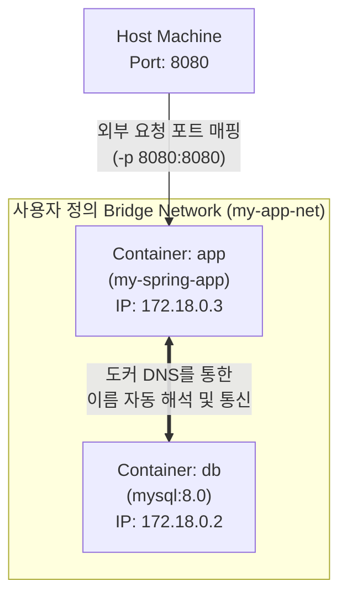

## 1. Docker 개요

과거의 서비스 배포는 '내 개발 환경에서는 잘 되는데 왜 서버에서는 안 되지?'라는 개발 환경과 운영 환경의 불일치 문제에 자주 발생했습니다.

이를 우회하고자 하이퍼바이저 기반의 가상 머신(VM)을 활용했으나, VM은 하드웨어 가상화를 거치고 독립된 게스트 OS를 메모리에 전체 구동해야 하므로 무겁고 느리다는 치명적인 단점이 있었습니다. 

도커는 리눅스 커널의 Namespace와 cgroups(control groups) 기술을 활용하여 프로세스를 논리적으로 완벽히 격리하는 컨테이너 방식을 도입해 이 문제를 해결했습니다. OS 전체를 가상화하는 대신 호스트의 리눅스 커널을 공유하며 필요한 프로세스만 격리하므로 부팅 속도가 빠르고 리소스 낭비가 매우 적습니다.

도커 아키텍처는 클라이언트-서버(Client-Server) 구조를 갖춥니다.

- **Docker Client**: 사용자가 CLI 환경에서 `docker run`, `docker build` 등의 명령을 입력하는 창구입니다.
- **Docker Daemon (dockerd)**: 호스트에서 백그라운드로 실행되는 서버 프로세스입니다. 클라이언트로부터 요청을 수신하여 실제 이미지 빌드, 컨테이너 생성 및 실행 등을 처리합니다.

> macOS 환경의 경우 리눅스 커널 기반이 아니기 때문에 도커가 직접 구동될 수 없습니다. 따라서 macOS용 Docker Desktop은 내부적으로 가상 리눅스 환경(Linux VM)을 경량화하여 백그라운드에 띄우고 그 안에서 도커 데몬을 동작시키는 방식으로 설계되었습니다.
{:.prompt-info }

---

## 2. 기본 실행 흐름

도커 설치 후 제대로 작동하는지 확인하고 컨테이너의 핵심 구동 메커니즘을 파악하기 위해 hello-world 이미지를 활용합니다.

```bash
docker run hello-world
```

이 명령어 한 줄을 수행할 때 도커는 내부적으로 다음 과정을 밟습니다.
1. **로컬 이미지 조회**: 로컬 호스트 PC에 hello-world 이미지가 다운로드되어 있는지 검색합니다.
2. **원격 이미지 풀**: 로컬에 없다면 원격 레지스트리인 도커 허브(Docker Hub)에 접속하여 최신 hello-world 이미지 레이어들을 내려받습니다(Pull).
3. **컨테이너 구동**: 다운로드 완료된 이미지를 템플릿 삼아 격리된 컨테이너 공간을 만들고 프로세스를 실행(Run)합니다. 화면에 안내 문구를 출력하고 프로세스를 정상적으로 마친 후 컨테이너는 종료 상태로 전환됩니다.

---

## 3. 이미지와 컨테이너 명령어

### 이미지 관리
도커 이미지는 컨테이너를 실행하기 위해 필요한 파일 시스템과 실행 설정을 포함하는 읽기 전용 스냅숏입니다. 이미지 관리의 핵심 명령어는 다음과 같습니다.

- **현재 로컬에 저장된 이미지 목록 조회**:
  ```bash
  docker images
  ```

- **원격 저장소에서 특정 이미지 명시적으로 다운로드**:
  ```bash
  docker pull [이미지명]:[태그]
  ```

- **불필요한 로컬 이미지 삭제**:
  ```bash
  docker rmi [이미지ID]
  ```

### Docker Hub 이미지 선택
도커 허브에서 이미지를 선택할 때는 단순 검색 결과에만 의존하지 말고, 프로덕션 신뢰성과 보안 강화를 위해 세 가지 요소를 검증해야 합니다.

1. **Official Image 보증 마크**: 보안 및 유지보수가 공식 단체에 의해 지속적으로 수행되는 공식 배포본을 최우선 선택합니다.
2. **경량화 이미지 태그 활용**: 빌드 결과물의 용량을 최소화하고 보안 공격 표면을 줄이기 위해 일반 태그 대신 최소화된 패키지만 포함하는 `slim` 혹은 `alpine` 계열의 이미지 사용을 고려합니다.

> **Alpine 이미지란?**  
> Alpine은 작은 리눅스 배포판을 베이스로 한 이미지입니다. Ubuntu나 Debian 계열 이미지보다 기본 패키지가 훨씬 적고, 패키지 관리자로 `apk`를 사용하기 때문에 필요한 도구를 선택적으로 설치할 수 있습니다. 즉, 가볍지만 여전히 셸(`sh`)과 패키지 매니저가 있는 "작은 리눅스 환경"에 가깝습니다. 그래서 컨테이너 안에 접속해 파일을 확인하거나 임시 패키지를 설치하며 디버깅하기가 비교적 쉽습니다. 다만 C 표준 라이브러리로 glibc 대신 musl libc를 사용하므로, 일부 네이티브 라이브러리나 런타임에서는 호환성 문제가 생길 수 있습니다.
{:.prompt-info }

> **Distroless 이미지란?**  
> Distroless는 Alpine처럼 "작은 리눅스 배포판"을 제공하는 방식이 아니라, 애플리케이션 실행에 필요한 런타임 파일만 남기고 패키지 매니저(`apt`, `apk` 등), 셸(`bash`, `sh` 등), 기본 유틸리티를 거의 제거한 이미지입니다. 따라서 Alpine보다 컨테이너 내부에서 할 수 있는 일이 더 제한적이고, 그만큼 이미지 크기와 보안 공격으로부터 1차적으로 보호될 수 있습니다.(셸, 패키지 매니저 자체가 없으므로) 반대로 장애가 났을 때 컨테이너에 직접 접속해서 `ps`, `curl`, `cat` 같은 명령으로 확인하는 디버깅은 어렵습니다. 보통 개발·디버깅 단계에서는 `slim`이나 `alpine` 이미지를 쓰고, 운영 배포용 최종 스테이지에서 `distroless`를 사용하는 방식이 현실적입니다.
{:.prompt-info }

1. **명확한 버전 명시 패턴**: `latest` 태그는 시점에 따라 실제 매핑되는 빌드가 달라지므로 운영 환경에서 배포 깨짐을 야기할 수 있습니다. `openjdk:17-slim`과 같이 배포 재현성을 보장하는 고정 태그명을 사용하는 것이 바람직합니다.

### 이미지 레이어와 캐시
도커 이미지는 하나의 큰 바이너리가 아니라, Dockerfile의 명령줄 단위로 구성된 다수의 읽기 전용(Read-Only) 이미지 레이어가 차곡차곡 쌓인 적층형 파일 구조를 취합니다. 

이로 인해 빌드를 재수행할 때 변경되지 않은 상위 레이어는 이전 빌드에서 생성된 결과를 재사용하는 캐시 패턴이 작동하여 빌드 속도가 극대화됩니다.

그러나 이미지 빌드를 수정 및 반복하는 과정에서, 새로 생성된 레이어에 빌드 명칭(Repository 및 Tag)을 양도하고 이름이 유실된 채 방치되는 `<none>:<none>` 형태의 빈 껍데기 레이어가 발생합니다. 이를 **댕글링 이미지(Dangling Image)**라고 부릅니다. 댕글링 이미지는 디스크 공간을 의미 없이 점유하므로 정기적으로 소거해야 합니다.

```bash
docker image prune
```

> **사용하지 않는 모든 이미지까지 지우고 싶다면?**  
> `docker image prune -a` 옵션을 사용하면 댕글링 이미지뿐만 아니라 현재 어떠한 컨테이너도 사용하고 있지 않은 모든 이미지를 일괄 삭제합니다. 디스크 공간 확보에는 탁월하지만, 추후 다시 필요해지면 허브에서 새로 다운로드(Pull)해야 하므로 빌드 시간이 증가할 수 있음을 유의해야 합니다.
{:.prompt-tip }

### 컨테이너 실행 모드
컨테이너를 기동할 때 터미널과의 상호작용 및 세션 유지 방식에 따라 실행 옵션을 선택합니다.

- **포그라운드 모드 (-it)**:
  ```bash
  docker run -it ubuntu /bin/bash
  ```
  `-i`(interactive)와 `-t`(tty) 옵션을 결합하여 호스트의 표준 입출력 세션을 컨테이너 내부 터미널로 바인딩합니다. 주로 직접 디버깅하거나 일회성 커맨드를 실행할 때 사용됩니다.

- **백그라운드 모드 (-d)**:
  ```bash
  docker run -d nginx
  ```
  `-d`(detached) 옵션을 부여하여 컨테이너의 프로세스가 데몬 형태로 보이지 않게 배후에서 동작하도록 제어합니다. 웹 서버나 DB처럼 사용자 요청을 상시 대기해야 하는 서비스에 필수적입니다.

### 생명 주기와 로그
도커 컨테이너는 생성(Create) -> 실행(Start) -> 일시 정지(Pause) -> 중지(Stop) -> 삭제(Rm)의 유기적인 생명 주기를 거칩니다. 백그라운드에서 실행 중인 컨테이너에 이상 징후가 발생했을 때 즉각 상태를 진단하기 위해 실시간 표준 출력 추적이 중요합니다.

```bash
docker logs -f --tail 100 [컨테이너명]
```

`-f`(follow) 옵션은 실시간으로 출력되는 신규 로그를 계속 출력하고, `--tail 100`은 직전에 적재된 100줄을 먼저 가져옵니다.

### 컨테이너 내부 작업
운영 단계에서 가동 중인 컨테이너 인프라와 소통하고 수정을 유도할 때 쓰는 필수 명령어 조합입니다.

- **실행 중인 컨테이너 내부 셸 접속**:
  ```bash
  docker exec -it [컨테이너명] /bin/bash
  ```

- **호스트(접속중인shell)와 컨테이너 사이의 파일 양방향 복사**:
  ```bash
  docker cp [호스트경로] [컨테이너명]:[컨테이너경로]
  ```

- **컨테이너 내부 메타데이터 및 설정 상세 조회**:
  ```bash
  docker inspect [컨테이너명]
  ```

---

## 4. 연결과 데이터 영속성

### 포트와 환경 변수
도커 컨테이너는 호스트 컴퓨터가 격리하여 별도 대여한 사설 가상 네트워크 망 내에 상주하므로 자체 IP만 가지고 존재합니다. 따라서 호스트 바깥에서 웹 브라우저나 외부 요청을 전달받기 위해서는 포트 매핑(Port Mapping)을 지정하여 트래픽 입구를 열어주어야 합니다.

```bash
docker run -d -p 8080:80 nginx
```

`-p [호스트_포트]:[컨테이너_포트]` 구조를 사용하여, 호스트의 8080 포트로 접근을 시도하면 포워딩 장치에 의해 컨테이너 안의 80 포트로 유도됩니다.

또한 소스 코드 내에 DB 비밀번호나 설정 값을 기입하는 방식은 보안 리스크를 안게 됩니다. 컨테이너 배포 시점에 런타임 환경 변수로 이 값을 안전하게 밀어 넣는 방식을 취합니다.

```bash
docker run -d --name my-mysql -e MYSQL_ROOT_PASSWORD=secret -p 3306:3306 mysql:8.0
```

`-e` 옵션을 통하여 컨테이너 환경에 전달할 변수명을 명기한 후 실행합니다. 이후 접속 제어를 확인하기 위해 직접 컨테이너의 MySQL 프롬프트로 붙는 명령어 구조는 다음과 같습니다.

```bash
docker exec -it my-mysql mysql -u root -p
```

### 컨테이너 레이어와 데이터 소멸
도커 컨테이너는 불변인 이미지 레이어 위에 쓰기가 허용되는 얇은 컨테이너 레이어(Container Layer)를 추가하여 실행됩니다. 

컨테이너 가동 중 추가되는 로그 파일, 데이터베이스 트랜잭션 등 모든 데이터는 이 컨테이너 레이어에 축적됩니다. 그러나 도커 컨테이너가 교체되거나 삭제되는 즉시 이 컨테이너 레이어의 실체는 완전히 소멸합니다. 

데이터베이스의 영속 데이터처럼 컨테이너 생명 주기보다 길게 보존되어야 하는 정보를 안전하게 보전하기 위해서는 컨테이너 외부 저장소를 활용하는 영속화 메커니즘을 반드시 수립해야 합니다.

### Bind Mount
이 데이터 유실 문제를 극복하기 위해 물리 호스트 시스템의 특정 절대 경로 디렉터리를 컨테이너 내부의 한 경로와 물리적으로 링크시키는 바인드 마운트(Bind Mount) 패턴을 활용합니다.

```bash
docker run -d -v /path/on/host:/var/log/nginx nginx
```

`-v [호스트경로]:[컨테이너경로]` 옵션을 부여하면 두 경로가 실시간 연계되어 소스 코드 동기화 또는 호스트 단에서의 로그 실시간 모니터링 수집이 간단해집니다.

> **바인드 마운트 시 권한(Permission) 문제 주의**  
> 호스트의 디렉토리를 컨테이너에 마운트할 때, 컨테이너 내부 프로세스를 실행하는 계정(UID)과 호스트 디렉토리의 소유자 권한이 일치하지 않으면 파일 읽기/쓰기 시 권한 거부(Permission Denied) 에러가 흔히 발생합니다. 이 경우 컨테이너 실행 시 사용자 권한을 조정하거나, 호스트 디렉토리의 소유권을 일치시켜주는 사전 조치가 필요합니다.
{:.prompt-warning }

### Named Volume
바인드 마운트는 쉽고 유용하지만 호스트 OS의 파일 시스템 구조에 직접 종속되어, 경로 배포 장비마다 관리 사양이 달라질 경우 이식성이 떨어진다는 문제가 있습니다. 

이를 보완하기 위해 도커가 자체 관리 장비 내부에 독립된 전용 논리 볼륨을 만들고 이름만 바인딩하여 공유하는 **Named Volume** 방식을 프로덕션 환경에서 채택합니다.

```bash
docker volume create db_data
docker run -d -v db_data:/var/lib/mysql mysql:8.0
```

---

## 5. Dockerfile 최적화

### Dockerfile 지시어
Dockerfile은 커스텀 이미지를 생성하기 위한 선언적 스크립트 작성 양식입니다. 핵심 지시어는 다음과 같이 구분됩니다.

- `FROM`: 빌드 기초 토대로 삼을 원본 베이스 이미지를 결정합니다.
- `COPY`: 로컬 개발 호스트 장비의 코드 자산을 이미지 레이어 안으로 복사합니다.
- `RUN`: 이미지 빌드 과정 중에 직접 수행할 컴파일, 설치 등의 셸 명령줄입니다.
- `CMD`: 완성된 이미지가 컨테이너로 부팅할 때 최초로 구동하는 진입 애플리케이션 시작 지시를 내립니다.

### 빌드 캐시와 멀티 스테이지
배포 자동화 인프라의 처리량을 끌어올리고 가벼운 이미지를 유지하기 위해 두 가지 Dockerfile 튜닝 패턴을 반영해야 합니다.

- **빌드 캐싱 최적화 패턴**:
  자주 변경되지 않는 의존성 주입 파일(`package.json`, `pom.xml` 등) 사양 복사 및 패키지 인스톨 프로세스를 Dockerfile 맨 상단에 배치하고, 변경 주기가 가장 잦은 소스 코드 복사를 하단에 두어 레이어 캐시 무효화로 인한 빌드 지연을 원천 방지합니다.

  ```dockerfile
  # [ 캐시 최적화를 적용한 Node.js Dockerfile 예시 ]
  FROM node:18-alpine
  WORKDIR /app
  
  # 1. 의존성 명세 파일만 먼저 복사 (소스 코드가 바뀌어도 캐시 유지)
  COPY package*.json ./
  RUN npm ci
  
  # 2. 실제 소스 코드 복사 (빈번하게 변경되는 레이어)
  COPY . .
  
  CMD ["npm", "start"]
  ```

- **멀티 스테이지 빌드 패턴**:
  빌드 용도의 임시 스테이지와 실제 런타임 용도의 경량화 스테이지를 분리합니다. 컴파일 시점의 도구(JDK, Maven 등)는 빌드 스테이지에서 쓰고 버린 후, 최종 산출물(.jar, compiled html 등)만 가벼운 실행 런타임 이미지(JRE 등)로 전송하여 실 배포 이미지 용량을 극단적으로 감축합니다.

---

## 6. 네트워크와 Compose

### 기본 네트워크 드라이버
도커 엔진은 용도에 맞춰 격리 성능을 달리하는 3가지 기본 네트워크 드라이버를 제공합니다.

- **Bridge**: 기본 값으로 지정되는 네트워크 모델입니다. 호스트 내부에서 가상 스위치 역할을 하는 소프트웨어 브리지를 통해 컨테이너 간의 통신이 가능합니다.
- **Host**: 컨테이너가 네트워크 격리를 수행하지 않고 호스트 컴퓨터의 실제 IP 및 포트 대역을 공유하는 구조입니다. 포트 포워딩 없는 통신이 가능합니다.
- **None**: 루프백 인터페이스 외의 모든 네트워크 통신 장치를 비활성화합니다.

### 사용자 정의 네트워크
기본 브릿지 네트워크 영역에 속한 컨테이너들은 서로 통신하기 위해 동적으로 바뀌는 가상 IP를 조회하여 연결해야 하므로 번거롭습니다. 

이와 달리 사용자가 새롭게 수립한 사용자 정의 브릿지 네트워크(User-defined Bridge)를 생성하고 소속시키면, 컨테이너 이름 자체가 DNS 해석 주소로 인식되어 IP 변동에 상관없이 이름 고정만으로 상호 통신이 가능해집니다.

```bash
docker network create my-app-net
docker run -d --name db --network my-app-net mysql:8.0
docker run -d --name app --network my-app-net my-spring-app
```

위 명령어를 통해 구성된 네트워크와 포트 매핑 통신의 구조를 시각화하면 다음과 같습니다.



### Docker Compose
다중 컨테이너로 구성되는 마이크로서비스 시스템을 CLI 명령줄로 일일이 순서를 지정하며 컨테이너를 올리는 행위는 인프라 관리 장애를 유발하기 쉽습니다. 

이 문제를 해결하기 위해 구성하려는 인프라(서비스 구조, 포트, 볼륨 설정, 네트워크 등) 사양을 단일 명세 파일인 `docker-compose.yml`로 정의하고, 하나의 구동 커맨드로 전체 배포 라이프사이클을 안전하게 오케스트레이션할 수 있게 보조하는 선언식 관리 도구가 바로 Docker Compose입니다.

```yaml
# [ 실무에서 자주 활용되는 docker-compose.yml 패턴 예시 ]
version: '3.8'

eh
services:
  db:
    image: mysql:8.0
    restart: always
    environment:
      MYSQL_ROOT_PASSWORD: ${DB_PASSWORD} # .env 파일 등을 통해 외부에서 안전하게 변수 주입
      MYSQL_DATABASE: my_database
    volumes:
      - db_data:/var/lib/mysql

  app:
    image: my-spring-app:latest
    ports:
      - "8080:8080"
    environment:
      SPRING_DATASOURCE_URL: jdbc:mysql://db:3306/my_database
      SPRING_DATASOURCE_PASSWORD: ${DB_PASSWORD}
    depends_on:
      - db # db 컨테이너가 먼저 구동된 후 app 컨테이너가 실행되도록 기동 순서 제어

volumes:
  db_data:
```

위 예시처럼 `depends_on`을 사용하면 데이터베이스가 먼저 기동된 후 애플리케이션이 실행되도록 순서를 보장할 수 있으며, `environment` 블록과 외부 환경 변수(`${DB_PASSWORD}`)를 결합하여 소스 코드 및 설정 파일 내의 중요 정보 하드코딩을 방지할 수 있습니다.

---

## 7. 이미지 배포

### Docker Hub 배포
로컬 PC에서 완성하여 기능 검증을 통과한 커스텀 이미지를 공용 클라우드나 다른 동료 배포 환경으로 공유하기 위해 도커 공식 허브 저장소에 Push하는 흐름입니다.

```bash
docker login
docker tag my-local-image:1.0 username/my-public-repo:1.0
docker push username/my-public-repo:1.0
```

반드시 자신의 리포지토리 식별 계정 정보가 포함된 이름으로 태깅하여 업로드해야 정상 업로드가 됩니다.

### GHCR 비공개 저장소
공용 서비스 배포 단계에서 기업 비즈니스 로직과 소스 코드가 외부에 노출되는 공용 저장소 배포는 지양되어야 합니다. 

깃허브 환경에 밀착 연계된 GHCR은 Personal Access Token(PAT) 인증 방식을 거쳐 비공개로 프라이빗 컨테이너 이미지를 관리할 수 있으며, GitHub Actions를 통한 CI/CD 배포 자동화 파이프라인 연계성이 매우 우수하여 실무에서 선호되는 구조입니다.

## 정리

Docker의 핵심은 애플리케이션과 실행 환경을 하나의 이미지로 묶고, 컨테이너라는 격리된 단위로 어디서든 동일하게 실행할 수 있게 만드는 데 있습니다. VM처럼 OS 전체를 띄우는 방식이 아니라 호스트 커널을 공유하면서 프로세스와 리소스를 격리하기 때문에, 배포 속도와 자원 효율성을 동시에 확보할 수 있습니다.

실무에서 Docker를 다룰 때는 단순히 `docker run`으로 컨테이너를 실행하는 것보다 이미지 선택, 태그 고정, 레이어 캐시, 볼륨, 네트워크, Compose, 레지스트리 전략까지 함께 봐야 합니다. 특히 운영 환경에서는 `latest` 태그 사용을 피하고, 데이터는 Named Volume이나 외부 저장소로 분리하며, 여러 컨테이너는 Docker Compose로 선언적으로 관리하는 편이 안정적입니다.

결국 Docker를 잘 쓴다는 것은 "컨테이너를 실행할 줄 안다"를 넘어, 재현 가능한 이미지 빌드, 안전한 설정 주입, 데이터 영속성, 서비스 간 통신, 배포 저장소 관리까지 하나의 흐름으로 설계할 수 있다는 뜻입니다. 작은 개발 환경에서는 간단한 명령어부터 시작하고, 운영으로 갈수록 Dockerfile 최적화와 Compose, GHCR 같은 프라이빗 레지스트리 전략을 단계적으로 붙여가는 접근이 가장 현실적입니다.
