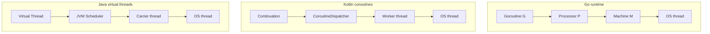
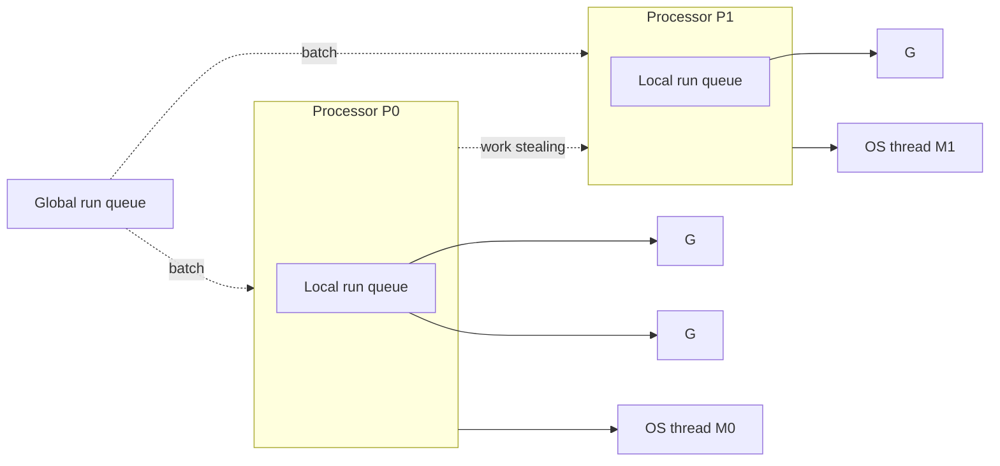
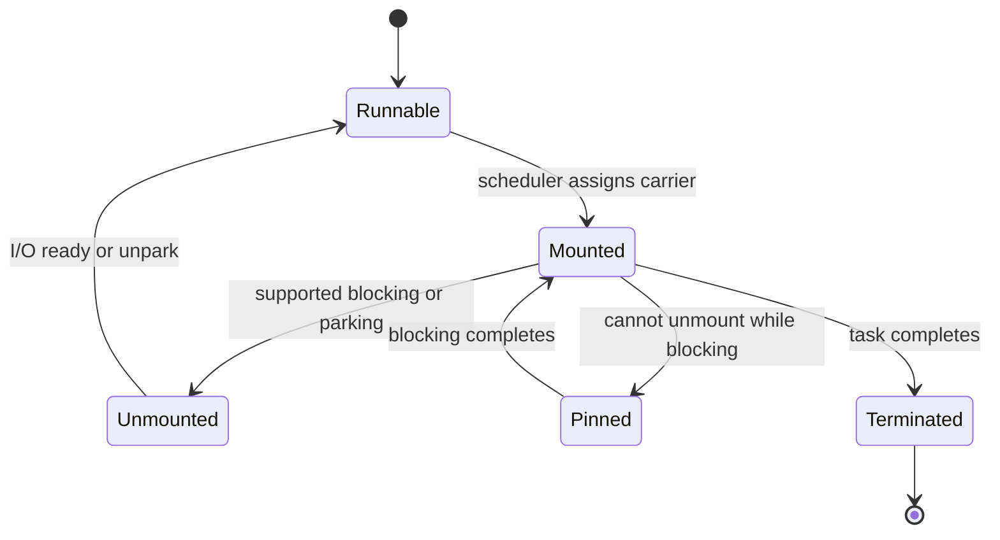

고루틴(goroutine), 코루틴(coroutine), 가상 스레드(virtual thread)는 적은 수의 OS 스레드로 많은 작업을 동시에 처리한다는 공통점이 있습니다. 그래서 세 기술을 모두 "가벼운 스레드"라고 묶어 설명하기도 합니다.

하지만 내부 구현과 프로그래밍 모델은 상당히 다릅니다.

- Go 고루틴은 런타임이 선점형으로 스케줄링하는 스택 기반 실행 단위입니다.
- Kotlin 코루틴은 컴파일러가 상태 머신으로 변환하고 라이브러리 스케줄러가 실행할 스레드를 정하는 중단 가능한 연산입니다.
- Java 가상 스레드는 기존 `Thread` API와 블로킹 코드를 유지하면서, JVM이 많은 가상 스레드를 적은 수의 OS 스레드에 배정할 수 있게 만든 스레드입니다.

세 모델의 차이는 **작업이 대기할 때 무엇이 멈추고, 그동안 OS 스레드 다른 작업을 처리할 수 있는가**에서 분명하게 드러납니다.

이 글에서는 여러 코루틴 구현 가운데 **Kotlin/JVM의 `kotlinx.coroutines`**를 다룹니다.

## 먼저 용어부터 구분하기

세 모델을 비교하기 전에 동시성·병렬성, 동기·비동기, 블로킹·논블로킹의 용어에 대해서 구분할줄 알아야 작업이 대기할 때 실제로 뭐가 멈추는지 알 수 있습니다.

### 동시성과 병렬성

동시성(concurrency)은 여러 작업의 실행 시간이 서로 겹치는 상태를 뜻합니다. 하나의 CPU 코어가 작업 A와 B를 번갈아 실행하더라도 두 작업은 같은 시간대에 함께 진행될 수 있습니다.

병렬성(parallelism)은 둘 이상의 작업을 실제로 같은 순간에 실행하는 것을 뜻합니다. 보통 둘 이상의 CPU 코어와 실행 가능한 스레드가 있어야 합니다.

따라서 고루틴이나 코루틴, 가상 스레드를 10만 개 만들더라도 10만 개가 모두 병렬로 실행되는 것은 아닙니다. 실행할 수 있는 작업 가운데 일부만 OS 스레드에 배정되어 CPU 코어에서 병렬로 실행됩니다.

### 동기·비동기와 블로킹·논블로킹

동기·비동기는 작업 결과가 호출자에게 전달되느냐, 블로킹·논블로킹은 호출이 완료되지 않았을 때 제어권을 곧바로 돌려주는느냐로 나뉩니다.

> 따라서 동기 호출이 반드시 블로킹이 아니며, 비동기 호출이 반드시 논블로킹이다 도 아닙니다.

| 구분              | 의미                                                                   | 예시                                       |
| ----------------- | ---------------------------------------------------------------------- | ------------------------------------------ |
| 동기 + 블로킹     | 호출한 쪽이 작업 완료를 기다리며, 그동안 실행 자원도 점유              | 플랫폼 스레드에서 JDBC 조회                |
| 비동기 + 블로킹   | 호출한 쪽은 즉시 `Future`를 받지만, 별도의 작업 스레드는 결과를 기다림 | 블로킹 I/O를 고정 스레드 풀에 제출         |
| 동기 + 논블로킹   | 현재 상태를 즉시 반환하고, 아직 준비되지 않았다면 더 진행하지 않음     | 논블로킹 `SocketChannel.read()`가 `0` 반환 |
| 비동기 + 논블로킹 | 호출 결과를 나중에 알리며, 대기하는 동안 실행 스레드를 점유하지 않음   | 이벤트 루프 기반 소켓 I/O                  |

여기서 호출한 스레드와 실제 작업을 처리하는 스레드를 따로 봐야 합니다. 비동기 API는 호출한 스레드를 막지 않더라도 내부 작업 스레드를 계속 점유할 수 있습니다. 반대로 가상 스레드에서 호출한 동기·블로킹 API는 작업을 기다리는 동안 캐리어 스레드(carrier thread)를 반납할 수 있습니다. 이 경우 가상 스레드는 대기하지만 OS 스레드까지 함께 멈추지는 않습니다.

> **대표적인 블로킹 모델: Tomcat + Spring MVC**
>
> 전통적인 Tomcat 플랫폼 스레드 실행기와 Spring MVC를 함께 사용하면 요청마다 스레드 하나가 배정됩니다. 요청을 처리하는 스레드는 JDBC 조회나 외부 HTTP 호출이 끝날 때까지 기다립니다. 요청당 스레드(thread-per-request) 방식의 대표적인 블로킹 모델입니다.
>
> 그렇다고 Tomcat이 항상 블로킹 방식으로만 동작하는 것은 아닙니다. Tomcat은 [가상 스레드](https://tomcat.apache.org/tomcat-11.0-doc/config/executor.html)와 Servlet 비동기 I/O를 지원하며, [Spring WebFlux](https://docs.spring.io/spring-framework/reference/web/webflux.html)도 Tomcat 위에서 논블로킹 방식으로 실행할 수 있습니다. 실제 동작 방식은 **웹 기술 스택, 실행기 설정, 사용하는 I/O API**의 조합에 따라 달라집니다.
{:.prompt-info}

### 블로킹될 때 실제로 무엇이 멈추는가

"작업이 블로킹된다"는 말만으로는 무엇이 멈추는지 알 수 없습니다. 요청 처리가 멈춘 것인지, 고루틴이나 코루틴이 멈춘 것인지, OS 스레드까지 멈춘 것인지 구분해야 합니다. 논리적인 작업이 기다리는 동안에도 그 작업을 실행하던 OS 스레드는 다른 일을 처리할 수 있기 때문입니다. 이 글에서는 대기가 발생하는 대상을 다음 네 가지로 나누어 살펴봅니다.

1. 요청이나 함수 같은 논리적 작업
2. 고루틴·코루틴·가상 스레드처럼 사용자 영역에서 관리되는 실행 단위
3. JVM 워커 스레드나 캐리어 스레드 같은 플랫폼 스레드
4. 커널이 스케줄링하는 OS 스레드

채널(channel)에서 값을 기다리는 고루틴은 실행을 멈추지만, 이를 실행하던 OS 스레드까지 함께 멈추는 것은 아닙니다. Go 런타임은 그 스레드에서 다른 고루틴을 실행합니다. Kotlin의 `delay()`도 코루틴의 실행만 중단하며, 워커 스레드는 그동안 다른 코루틴을 처리할 수 있습니다. 가상 스레드 역시 `Socket.read()`에서 대기할 때 캐리어 스레드에서 분리(unmount)할 수 있다면, 해당 캐리어 스레드에서 다른 가상 스레드를 실행할 수 있습니다.

이 글에서 "가볍다"는 표현은 이러한 특성을 가리킵니다. **작업이 대기하는 동안 OS 스레드를 하나씩 붙잡아 둘 필요가 없다**는 뜻입니다.

## 세 실행 모델 한눈에 보기

| 항목             | Go 고루틴                                             | Kotlin 코루틴                          | Java 가상 스레드                            |
| ---------------- | ----------------------------------------------------- | -------------------------------------- | ------------------------------------------- |
| 핵심 추상화      | 런타임이 관리하는 실행 단위                           | 중단 가능한 연산과 `Continuation`      | JVM이 관리하는 `Thread`                     |
| 구현 방식        | 크기가 동적으로 변하는 스택을 가진 작업               | CPS 변환으로 만든 스택 없는 상태 머신  | 힙에 스택 조각을 저장하는 경량 스레드       |
| 스케줄러         | Go 런타임의 G-M-P 스케줄러                            | `CoroutineDispatcher` 구현체           | JVM의 가상 스레드 스케줄러                  |
| 실행 전환 시점   | 런타임 선점, 채널 대기, 시스템 호출, 네트워크 폴링 등 | 중단 지점에서 협력적으로 전환          | JDK 블로킹 지점에서 연결·분리               |
| OS 스레드와 관계 | 많은 G를 더 적은 M에 배정                             | 많은 코루틴을 디스패처의 스레드에 배정 | 많은 가상 스레드를 캐리어 스레드에 배정     |
| `suspend` 전파   | 없음                                                  | 호출 경계를 따라 필요                  | 없음                                        |
| 기존 블로킹 API  | 런타임이 인식하는 I/O와 시스템 호출을 별도로 처리     | 워커 스레드를 막으므로 별도 격리 필요  | 많은 JDK API가 대기 중 캐리어 스레드를 반납 |
| 생명주기 구조화  | 언어 차원에서 자동 제공하지 않음                      | `CoroutineScope`와 `Job`이 기본 제공   | `Thread` 자체는 제공하지 않음               |
| 대표 취소 신호   | `context.Context`                                     | `Job.cancel()`                         | `Thread.interrupt()`                        |



세 모델 모두 많은 작업을 적은 수의 OS 스레드에 배정하는 M:N 구조지만 중단 지점을 누가 만들고, 중단된 실행 상태를 어디에 저장하는지가 다릅니다.

## Go 고루틴: 런타임에 통합된 실행 단위

Go에서 `go f()`를 호출하면 함수 `f`가 새로운 고루틴에서 실행됩니다. Go 런타임은 고루틴을 스케줄러, 네트워크 폴러(network poller), 가비지 컬렉터와 연계해 관리합니다.

### G-M-P 스케줄러

[Go 런타임 소스](https://go.dev/src/runtime/proc.go)는 스케줄러의 핵심 요소를 G, M, P로 설명합니다.

- **G(Goroutine)**: 실행할 함수, 스택, 프로그램 카운터(program counter), 스케줄링 상태를 가집니다.
- **M(Machine)**: Go 코드를 실제로 실행하는 OS 스레드입니다.
- **P(Processor)**: M이 Go 코드를 실행할 때 필요한 논리 프로세서입니다. 지역 실행 대기열과 메모리 할당 캐시처럼 실행에 필요한 자원을 관리합니다.

M은 P를 확보한 뒤 P의 실행 대기열(run queue)에서 G를 꺼내 실행합니다. P의 수는 기본적으로 `GOMAXPROCS` 값과 같으며, Go 코드를 동시에 실행할 수 있는 최대 병렬성을 결정합니다. P와 M의 수가 항상 같은 것은 아닙니다. 시스템 호출이나 cgo를 처리하는 동안에는 P보다 많은 M이 만들어질 수 있습니다.



각 P는 별도의 실행 대기열을 사용하므로 모든 스케줄링 작업이 하나의 전역 잠금에 몰리지 않습니다. 자신의 실행 대기열이 빈 P는 다른 P를 선택해 그 지역 실행 대기열에 있는 G의 절반가량을 가져옵니다. 가져온 G 하나는 바로 실행하고 나머지는 자신의 지역 실행 대기열에 넣습니다. 이것이 작업 훔치기(work stealing)입니다.

작업 훔치기를 사용하면 모든 G를 하나의 전역 실행 대기열에 모으지 않고도 유휴 P에 작업을 분산할 수 있습니다. 다만 이미 실행할 수 있는 G를 P 사이에 재분배하는 방식이므로 `GOMAXPROCS`가 정한 병렬성 자체를 늘리지는 않습니다. 전역 실행 대기열은 새 작업을 배분하고 특정 P에 실행이 치우치지 않도록 조정하는 데 사용합니다.

### 네트워크 I/O와 시스템 호출에서 무엇이 멈추는가

Go의 `net` 패키지로 소켓 I/O를 수행하면 런타임에 통합된 [네트워크 폴러](https://go.dev/src/runtime/netpoll.go)가 epoll, kqueue, IOCP 같은 운영체제의 I/O 통지 기능과 연동합니다.

1. 읽을 데이터가 없으면 현재 G를 대기 상태로 바꿉니다.
2. M은 P를 유지한 채 실행할 수 있는 다른 G를 선택합니다.
3. I/O가 준비되면 폴러는 기다리던 G를 다시 실행 대기열에 넣습니다.

따라서 코드는 동기적인 `conn.Read()` 형태로 작성하더라도 네트워크 응답을 기다리는 동안 OS 스레드를 계속 점유하지 않습니다.

일반적인 블로킹 시스템 호출은 다르게 처리합니다. 시스템 호출에 들어간 M은 P를 반납할 수 있고, 런타임은 그 P를 다른 M에 넘겨 Go 코드를 계속 실행합니다. 이때 프로그램의 다른 고루틴은 계속 실행되지만, 시스템 호출을 수행한 OS 스레드는 호출이 끝날 때까지 멈춰 있을 수 있습니다. cgo나 런타임이 인식하지 못하는 외부 호출도 M을 오래 점유하거나 OS 스레드 수를 늘릴 수 있습니다. 고루틴에서 실행한다는 이유만으로 모든 블로킹 호출이 논블로킹으로 바뀌는 것은 아닙니다.

### 스택 확장과 선점

고루틴은 작은 스택으로 시작해 필요에 따라 크기를 늘리거나 줄입니다. 작업마다 크기가 고정된 OS 스레드 스택을 미리 확보하지 않아도 되므로 많은 고루틴을 만들 수 있습니다. 그렇다고 고루틴의 비용이 0인 것은 아닙니다. 스택 확장, 스케줄러 메타데이터, 힙 객체 참조, 가비지 컬렉터의 스캔에도 자원이 필요합니다.

[Go 1.14](https://go.dev/doc/go1.14)부터는 실행 중인 고루틴도 비동기적으로 선점할 수 있습니다.

> 선점(preemption)이란 Go 런타임이 실행 중인 G를 실행 상태를 안전하게 보존할 수 있는 지점에서 잠시 멈추고, 해당 M이 다른 G를 실행하도록 실행권을 넘기는 동작입니다. 멈춘 G는 종료되거나 취소된 것이 아니며, 나중에 다시 스케줄되어 중단된 지점부터 실행을 이어갑니다.
{:.prompt-info}

비동기 선점은 G가 함수 호출 지점에 도달하거나 `runtime.Gosched()`로 직접 실행권을 넘길 때까지 기다리지 않고 런타임이 실행을 멈출 수 있다는 뜻입니다. 그 결과 함수 호출 없이 오래 실행되는 반복문이 있더라도 다른 고루틴이나 가비지 컬렉터가 실행 기회를 얻을 수 있습니다. 선점 기능이 CPU 코어 수까지 늘려주는 것은 아닙니다. CPU 연산이 많은 G가 늘어나면 결국 `GOMAXPROCS`로 정한 병렬성 범위 안에서 CPU 코어를 두고 경쟁합니다.

### 채널은 통신과 동기화 수단이지 자동 취소 기능이 아니다

버퍼가 없는 채널에서 값을 보내거나 받는 고루틴은 상대편이 준비될 때까지 대기합니다. 그동안 M은 다른 G를 실행할 수 있습니다. 버퍼가 있는 채널에서는 버퍼가 가득 차기 전까지 생산자(producer)가 값을 계속 보낼 수 있으므로, 버퍼 크기 자체가 backpressure 정책의 일부가 됩니다.

```go
package main

import (
	"context"
	"fmt"
	"time"
)

func worker(ctx context.Context, result chan<- string) {
	select {
	case <-time.After(100 * time.Millisecond):
		result <- "done"
	case <-ctx.Done():
		return
	}
}

func main() {
	ctx, cancel := context.WithTimeout(context.Background(), time.Second)
	defer cancel()

	result := make(chan string, 1)
	go worker(ctx, result)

	select {
	case value := <-result:
		fmt.Println(value)
	case <-ctx.Done():
		fmt.Println(ctx.Err())
	}
}
```

어떤 고루틴이 다른 고루틴을 시작했더라도, 시작한 고루틴이 끝났다고 새 고루틴까지 자동으로 취소되지는 않습니다. `context.Context`, 채널 닫기, `WaitGroup` 등을 사용해 두 작업의 생명주기를 직접 연결해야 합니다. `Context` 역시 취소 신호만 전달할 뿐 G를 강제로 종료하지 않습니다. 작업을 수행하는 코드가 `ctx.Done()`을 확인하거나 `Context`를 지원하는 API를 호출해야 실제로 중단됩니다. 이 처리를 빠뜨리면 더 이상 필요하지 않은 고루틴이 계속 남는 고루틴 누수(goroutine leak)가 발생합니다.

## Kotlin 코루틴: 컴파일러가 만든 상태 머신

Kotlin 코루틴의 핵심은 스레드가 아니라 **실행을 중단했다가 이어갈 수 있는 연산**입니다. `suspend` 함수를 선언한다고 새 스레드가 생기는 것은 아니며, 함수를 호출하는 것만으로 비동기 실행이 시작되지도 않습니다.

### CPS 변환과 `Continuation`

[Kotlin 언어 명세](https://kotlinlang.org/spec/asynchronous-programming-with-coroutines.html)에 따르면 컴파일러는 `suspend fun`을 CPS(Continuation Passing Style) 형태로 변환합니다.

```kotlin
suspend fun load(): User {
    val token = fetchToken()
    return fetchUser(token)
}
```

변환된 함수에는 개념적으로 다음과 같이 `Continuation` 매개변수가 추가되며, 반환 방식도 달라집니다.

```kotlin
fun load(continuation: Continuation<User>): Any?
```

- 중단 없이 끝나면 `User` 값을 바로 반환합니다.
- 실행을 중단하면 내부 표식인 `COROUTINE_SUSPENDED`를 반환합니다.
- 중단했던 작업이 완료되거나 실패하면 저장해 둔 `Continuation.resumeWith(Result)`를 호출해 다음 상태부터 실행을 이어갑니다.

컴파일러는 중단 지점(suspension point) 사이에서 유지해야 할 지역 변수와 현재 실행 위치를 `Continuation` 객체의 필드로 옮깁니다. 앞의 예제는 개념적으로 다음과 같은 상태 머신이 됩니다.

```kotlin
class LoadContinuation : Continuation<User> {
    var label: Int = 0
    var token: String? = null

    fun invokeSuspend(result: Any?): Any? = when (label) {
        0 -> {
            label = 1
            fetchToken(this)
        }
        1 -> {
            token = result as String
            label = 2
            fetchUser(token!!, this)
        }
        else -> result as User
    }
}
```

위 코드는 동작 원리를 설명하기 위한 의사 코드입니다. 실제 컴파일 결과는 Kotlin 버전과 최적화 방식에 따라 달라질 수 있습니다. 중요한 점은 코루틴마다 네이티브 스택 전체를 따로 보관하지 않는다는 것입니다. **실행을 이어가는 데 필요한 상태만 객체에 저장**하기 때문에 Kotlin 코루틴은 일반적으로 스택 없는 코루틴(stackless coroutine)으로 분류합니다.

이러한 변환 방식은 함수의 호출 관계에도 영향을 줍니다. 일반 함수는 중단된 호출 상태를 `Continuation`으로 이어갈 수 없으므로 `suspend` 함수를 직접 호출할 수 없습니다. `suspend` 함수는 다른 `suspend` 함수나 코루틴 빌더를 통해 호출해야 하며, 이 제약이 호출 경계를 따라 전파되는 현상을 함수 색칠(function coloring)이라고 합니다.

### 디스패처는 코루틴을 실행할 스레드를 정한다

`CoroutineDispatcher`는 코루틴을 처음 실행하거나 중단된 코루틴을 다시 시작할 때 사용할 스레드를 결정합니다.

- `Dispatchers.Default`: CPU 연산이 많은 작업을 위한 공용 워커 풀
- `Dispatchers.IO`: 블로킹 I/O를 분리하기 위한 탄력적인 공용 스레드 풀
- `Dispatchers.Main`: 사용자 인터페이스를 처리하는 메인 스레드
- 사용자 정의 디스패처: 특정 실행기(executor)나 스레드에 연결

코루틴은 한 스레드에서 중단된 뒤 다른 스레드에서 실행을 이어갈 수 있습니다. 따라서 `ThreadLocal`을 그대로 사용하면 재개된 스레드에서 이전 값을 찾지 못할 수 있습니다. 스레드 지역 값을 유지해야 한다면 `ThreadLocal.asContextElement()`나 별도의 `CoroutineContext.Element`로 명시적으로 전달해야 합니다.

### `CoroutineScheduler`와 블로킹 작업 보상

JVM의 `Dispatchers.Default`와 `Dispatchers.IO`는 내부적으로 같은 [`CoroutineScheduler`](https://github.com/Kotlin/kotlinx.coroutines/blob/master/kotlinx-coroutines-core/jvm/src/scheduling/CoroutineScheduler.kt)와 워커 스레드를 공유합니다. 스케줄러에는 각 워커가 관리하는 지역 대기열과 모든 워커가 공유하는 전역 대기열이 있으며, 전역 대기열은 CPU 작업과 블로킹 작업을 따로 보관합니다. 자신의 대기열에서 실행할 작업을 찾지 못한 워커는 전역 대기열을 확인하거나 다른 워커의 지역 대기열에서 작업을 훔쳐옵니다.

CPU 작업의 병렬성은 기본 워커 수만큼 발급되는 CPU permit(실행 허가)으로 제한합니다. CPU permit을 가진 워커가 블로킹 작업을 만나면 permit을 반납하고, 스케줄러는 대기 중인 CPU 작업을 처리할 다른 워커를 깨우거나 새로 만듭니다. 블로킹 때문에 멈춘 워커를 다른 워커로 보충해 CPU 작업의 병렬성을 유지하는 방식입니다. 다만 스케줄러가 블로킹 작업으로 분류한 경우에만 이러한 보상이 동작합니다. `Dispatchers.Default`에서 직접 호출한 `Thread.sleep()`이나 JDBC 코드는 자동으로 블로킹 작업으로 분류되지 않습니다.

`Dispatchers.IO`는 블로킹 작업이라는 정보를 스케줄러에 전달하는 디스패처입니다. 기본 병렬성은 `64`와 CPU 코어 수 가운데 큰 값으로 제한되지만, `limitedParallelism()`으로 만든 디스패처에는 별도의 병렬성 한도를 지정할 수 있어 전체 스레드 수가 기본 한도를 넘어설 수 있습니다. `limitedParallelism(1)`도 한 번에 실행되는 코드 조각을 하나로 제한할 뿐, 중단된 코루틴까지 포함한 전체 동시 작업 수를 하나로 제한하지는 않습니다. 동시 요청 수 자체를 제한하려면 `Semaphore` 같은 별도의 제어 수단이 필요합니다.

이 내용은 JVM용 `kotlinx.coroutines`의 현재 내부 구현을 기준으로 합니다. `CoroutineScheduler`는 공개 API가 아니므로 세부 구조는 버전에 따라 달라질 수 있습니다.

### `suspend`가 곧 논블로킹을 의미하지는 않는다

다음 함수에는 `suspend`가 붙어 있지만, `Thread.sleep()`을 호출하므로 실제 워커 스레드를 멈춥니다.

```kotlin
suspend fun wrong() {
    Thread.sleep(1_000)
}
```

반면 `delay()`는 타이머에 재개할 작업을 등록하고 현재 코루틴만 중단합니다. 워커 스레드는 그동안 다른 코루틴을 실행할 수 있습니다.

```kotlin
suspend fun right() {
    delay(1_000)
}
```

JDBC나 기존 SDK처럼 블로킹 API를 사용해야 한다면 해당 호출을 `Dispatchers.IO`로 분리할 수 있습니다.

```kotlin
suspend fun findUser(id: Long): User = withContext(Dispatchers.IO) {
    userRepository.findById(id) // 블로킹 JDBC 호출
}
```

이렇게 작성해도 JDBC가 논블로킹 방식으로 바뀌지는 않습니다. 해당 호출을 스케줄러에 블로킹 작업으로 알려 CPU 작업과 분리하고, 필요할 때 보상 워커를 사용할 수 있게 할 뿐입니다. 동시 요청이 계속 늘어나면 스레드 수, 데이터베이스 연결 풀, 하위 시스템의 처리 용량 가운데 하나가 결국 한계에 도달합니다.

### 구조적 동시성과 협력적 취소

Kotlin 코루틴은 `CoroutineScope`와 `Job`으로 부모와 자식 작업의 생명주기를 묶습니다.

- 부모 코루틴은 모든 자식 코루틴이 끝나기 전까지 완료되지 않습니다.
- 일반적인 `coroutineScope`에서는 자식 하나가 실패하면 부모와 다른 자식도 취소됩니다.
- `supervisorScope`를 사용하면 한 자식의 실패가 다른 자식에게 전파되지 않도록 할 수 있습니다.
- 부모를 취소하면 그 아래의 모든 자식에게 취소가 전파됩니다.

```kotlin
import kotlinx.coroutines.async
import kotlinx.coroutines.awaitAll
import kotlinx.coroutines.coroutineScope
import kotlinx.coroutines.delay
import kotlinx.coroutines.runBlocking

suspend fun fetch(name: String): String {
    delay(100)
    return "$name:done"
}

suspend fun fetchAll(): List<String> = coroutineScope {
    listOf("profile", "orders")
        .map { name -> async { fetch(name) } }
        .awaitAll()
}

fun main() = runBlocking {
    println(fetchAll())
}
```

코루틴 취소는 `CancellationException`과 중단 지점을 이용한 협력 방식으로 동작합니다. `cancel()`을 호출해도 CPU를 오래 사용하는 반복문이 중단 지점에 도달하지 않고 `isActive`나 `ensureActive()`로 취소 여부도 확인하지 않는다면 바로 멈추지 않습니다. 운영체제가 워커 스레드의 실행을 선점하더라도 코루틴이 취소 요청을 처리해 주는 것은 아닙니다.

## Java 가상 스레드: 블로킹 코드를 유지하는 M:N 스레드

가상 스레드는 Java 21에서 정식 기능으로 도입되었습니다. `java.lang.Thread`의 한 종류이므로 기존의 스레드 덤프, 스택 추적, `ThreadLocal`, 인터럽트, 블로킹 API를 그대로 사용할 수 있습니다.

```java
import java.time.Duration;
import java.util.concurrent.Executors;

public class VirtualThreadExample {
    private static String fetch(String name) throws InterruptedException {
        Thread.sleep(Duration.ofMillis(100));
        return name + ":done";
    }

    public static void main(String[] args) throws Exception {
        try (var executor = Executors.newVirtualThreadPerTaskExecutor()) {
            var profile = executor.submit(() -> fetch("profile"));
            var orders = executor.submit(() -> fetch("orders"));

            System.out.println(profile.get());
            System.out.println(orders.get());
        }
    }
}
```

`Thread.sleep()`과 `Future.get()`은 모두 블로킹 호출입니다. 이 예제에서 `Thread.sleep()`을 호출하는 쪽은 가상 스레드이므로, 기다리는 동안 캐리어 스레드를 반납합니다. 반면 `Future.get()`을 호출하는 쪽은 `main` 플랫폼 스레드이므로 해당 스레드가 멈춥니다. `Future.get()`도 가상 스레드 안에서 호출하면 가상 스레드만 대기 상태가 되고 캐리어 스레드는 다른 작업을 처리할 수 있습니다.

### 캐리어 스레드에 연결하고 분리하기

[JEP 444](https://openjdk.org/jeps/444)에 따르면 가상 스레드 스케줄러는 작업 훔치기(work stealing)를 사용하는 `ForkJoinPool`이며, 작업 대기열은 FIFO 방식으로 동작합니다. 병렬 스트림 등이 사용하는 공용 풀과는 별도의 풀입니다. 기본 병렬성은 사용 가능한 프로세서 수와 같으며, `jdk.virtualThreadScheduler.parallelism` 속성으로 조절할 수 있습니다.



가상 스레드는 실행을 중단하고 재개하는 과정에서 다른 캐리어 스레드로 옮겨갈 수 있습니다. `Thread.currentThread()`는 현재 연결된 캐리어 스레드가 아니라 가상 스레드 자신을 반환합니다. 두 스레드의 `ThreadLocal` 값과 스택 추적 정보도 서로 분리됩니다.

JDK의 소켓 I/O, `BlockingQueue.take()`, `LockSupport.park()`처럼 가상 스레드를 지원하는 블로킹 지점에서는 가상 스레드를 캐리어 스레드에서 분리합니다. 따라서 개발자는 콜백을 연달아 연결하거나 `suspend` 함수로 코드를 다시 작성하지 않고도 순차적인 블로킹 코드를 유지할 수 있습니다.

### 캐리어 스레드를 붙잡는 피닝

그러나 블로킹이 발생했다고 해서 언제나 가상 스레드를 분리할 수 있는 것은 아닙니다. JVM이 가상 스레드를 캐리어 스레드에서 분리할 수 없는 구간에서 블로킹이 발생하면, 가상 스레드는 캐리어 스레드에 연결된 채 함께 멈춥니다. 이 상태를 피닝(pinning)이라고 합니다.

Java 21에서는 `synchronized`가 대표적인 피닝 원인이었습니다. 특히 다음처럼 모니터를 획득한 상태에서 오래 걸릴 수 있는 I/O를 호출하면, I/O가 끝날 때까지 가상 스레드뿐 아니라 캐리어 스레드도 다른 작업을 실행할 수 없습니다.

```java
synchronized (lock) {
    return socket.getInputStream().read(buffer); // 블로킹될 수 있다
}
```

문제는 `synchronized` 자체가 아니라 모니터를 잡은 채 블로킹 경계를 넘어간다는 데 있습니다. Java 21에서는 모니터를 얻기 위해 기다리거나 `Object.wait()`로 대기할 때도 피닝이 발생할 수 있었습니다. 이런 코드가 드물고 곧 끝난다면 영향은 작지만, 여러 요청에서 반복되거나 외부 I/O 때문에 오래 지속되면 캐리어 스레드가 차례로 묶여 처리량이 제한될 수 있습니다.

Java 21에서 피닝을 줄이려면 우선 모니터가 보호하는 구간을 줄이고, 가능하다면 I/O를 `synchronized` 밖으로 옮겨야 합니다. 블로킹 호출까지 하나의 배타적 구간으로 묶어야 한다면 `ReentrantLock`을 사용할 수 있습니다. `ReentrantLock`은 가상 스레드가 대기할 때 캐리어 스레드를 반납할 수 있지만, 긴 I/O 동안 락을 점유한다는 사실까지 바꾸지는 않으므로 같은 락을 기다리는 작업은 여전히 직렬화됩니다.

Java 24에 반영된 [JEP 491](https://openjdk.org/jeps/491)은 JVM의 모니터 구현을 바꿔 이 문제를 해결했습니다. Java 24 이상에서는 가상 스레드가 `synchronized` 블록이나 메서드 안에서 블로킹되거나, 모니터 진입을 기다리거나, `Object.wait()`를 호출하더라도 캐리어 스레드에서 분리될 수 있습니다. 따라서 가상 스레드를 사용한다는 이유만으로 `synchronized`를 `ReentrantLock`으로 바꿀 필요는 없습니다. 공정한 락, 시간 제한이나 인터럽트가 가능한 락 획득처럼 `ReentrantLock`의 기능이 실제로 필요할 때 선택하면 됩니다.

다만 Java 24에서도 피닝이 완전히 사라진 것은 아닙니다. 네이티브 메서드나 Foreign Function & Memory API(FFM API, 네이티브 함수 호출과 JVM이 관리하지 않는 메모리 접근을 지원하는 API)를 통해 네이티브 코드를 실행하는 동안에는 가상 스레드를 분리할 수 없습니다. 특히 네이티브 코드가 Java 코드를 다시 호출하고 그 코드가 블로킹되면, 네이티브 프레임이 스택에 남아 있어 캐리어 스레드도 함께 멈춥니다.

남아 있는 피닝을 줄이려면 네이티브 호출을 짧게 유지하고, 가능하면 네이티브 프레임이 남아 있는 동안 Java 코드가 블로킹되지 않도록 호출 구조를 바꿔야 합니다. 오래 걸리는 네이티브 블로킹을 피할 수 없다면 크기가 제한된 플랫폼 스레드 전용 실행기로 격리해, 가상 스레드의 캐리어 풀 전체가 고갈되는 것을 막는 방법도 있습니다.

피닝은 JFR의 `jdk.VirtualThreadPinned` 이벤트로 확인할 수 있습니다. Java 21에서는 `-Djdk.tracePinnedThreads=full` 또는 `short`로 문제 구간의 스택을 출력할 수도 있습니다. 이 시스템 속성은 Java 24에서 제거되어 값을 지정해도 효과가 없으므로, Java 24 이상에서는 JFR 이벤트를 사용해야 합니다.

### 가상 스레드 풀로 동시성을 제한하지 않기

가상 스레드는 여러 작업이 돌려 쓰는 워커가 아니라 작업마다 새로 만드는 실행 단위입니다. `newVirtualThreadPerTaskExecutor()`도 정해진 수의 가상 스레드를 재사용하지 않고 작업마다 새로운 가상 스레드를 만듭니다.

하위 시스템에 동시에 20개의 요청만 보내야 한다고 가정해 보겠습니다. 이때 가상 스레드 풀의 크기를 20으로 제한하지 말고, 다음과 같이 실제로 보호할 자원 가까이에 `Semaphore`를 두는 편이 낫습니다. 그러면 가상 스레드 수와 하위 시스템의 동시 요청 한도를 독립적으로 관리할 수 있습니다.

```java
import java.util.concurrent.Semaphore;

public class LimitedClient {
    private final Semaphore permits = new Semaphore(20);

    public String call() throws InterruptedException {
        permits.acquire();
        try {
            return callBlockingService();
        } finally {
            permits.release();
        }
    }

    private String callBlockingService() throws InterruptedException {
        Thread.sleep(100);
        return "done";
    }
}
```

데이터베이스 연결 풀도 이와 비슷하게 동시 요청 수를 제한합니다. 가상 스레드를 많이 만들 수 있다고 해서 데이터베이스 연결, HTTP 연결, 파일 디스크립터, 하위 시스템의 초당 처리량까지 늘어나는 것은 아닙니다.

### CPU 연산이 많은 작업과 `ThreadLocal`

가상 스레드는 코드를 더 빠르게 실행하는 스레드가 아닙니다. [JEP 444](https://openjdk.org/jeps/444)의 가상 스레드 스케줄러는 가상 스레드마다 일정한 실행 시간을 보장하는 타임 슬라이싱(time slicing)을 제공하지 않습니다. 한 가상 스레드가 블로킹 없이 CPU 연산을 계속하면, 대기 상태가 되거나 종료될 때까지 캐리어 스레드에 연결된 채 실행됩니다. 운영체제가 캐리어 스레드를 선점할 수는 있지만, 그렇다고 JVM이 현재 가상 스레드를 분리하고 대기열의 다른 가상 스레드를 연결하는 것은 아닙니다. 따라서 CPU 연산이 많은 작업의 병렬성은 여전히 CPU 코어 수를 기준으로 제한해야 합니다.

가상 스레드는 작업마다 새로 만들어지므로, `ThreadLocal`에 생성 비용이 큰 객체를 넣어 여러 작업에서 재사용하던 방식은 적합하지 않습니다. 요청 ID나 보안 정보처럼 작업마다 필요한 값을 저장하는 데는 사용할 수 있지만, 가상 스레드 수만큼 값이 만들어질 수 있다는 점을 고려해야 합니다. 변경되지 않는 컨텍스트를 전달할 때는 Java 25에서 정식 기능이 된 [`ScopedValue`](https://openjdk.org/jeps/506)를 사용할 수 있습니다.

## 실행 상태가 차지하는 메모리

세 모델 모두 대기 중인 작업마다 고정 크기의 OS 스레드 스택을 할당하지는 않습니다. 그렇다고 대기 상태의 작업이 메모리를 거의 사용하지 않는 것은 아닙니다. 실행을 재개하는 데 필요한 상태와 그 상태가 참조하는 객체는 작업이 끝날 때까지 남을 수 있습니다.

| 모델             | 실행 상태를 저장하는 곳                    | 메모리에 남을 수 있는 것                            |
| ---------------- | ------------------------------------------ | --------------------------------------------------- |
| Go 고루틴        | 크기가 동적으로 변하는 고루틴 스택         | 호출 프레임, 지역 변수, 스택에서 참조하는 힙 객체   |
| Kotlin 코루틴    | `Continuation`과 컴파일러가 만든 상태 머신 | 중단 이후에도 필요한 지역 변수와 연결된 객체 그래프 |
| Java 가상 스레드 | 힙에 저장되는 스택 청크(stack chunk)       | 호출 프레임, 지역 변수, `ThreadLocal` 값            |

Go의 가비지 컬렉터는 고루틴 스택에서 객체 참조를 찾습니다. Kotlin 컴파일러는 중단 이후에 필요한 지역 변수를 `Continuation`의 필드로 옮기므로, 오래 중단된 코루틴은 예상보다 큰 객체 그래프를 계속 참조할 수 있습니다. 가상 스레드의 스택은 [JEP 444](https://openjdk.org/jeps/444)에 설명된 것처럼 힙의 스택 청크 객체로 저장되며 실행 중에 커지거나 줄어듭니다. 가상 스레드 스택은 GC 루트가 아니므로 G1처럼 힙을 동시에 탐색하는 수집기는 그 안의 참조를 전체 중지(stop-the-world) 구간에서 모두 훑지 않아도 됩니다. 플랫폼 스레드처럼 작업마다 큰 네이티브 스택을 미리 확보할 필요는 없지만, 스택 청크와 그 안의 참조는 여전히 힙 사용량과 GC 작업량에 영향을 줍니다.

따라서 실행 단위의 개수만 측정해서는 메모리 한계를 예측하기 어렵습니다. 스택 깊이, 중단 지점에 남은 지역 변수, 요청 버퍼, 타이머, 대기열 노드까지 함께 측정해야 합니다. 취소되거나 제한 시간이 지난 작업이 실제로 종료되어 참조를 놓는지도 확인해야 합니다.

## 같은 "대기"라도 내부 동작은 다르다

세 모델에서 작업이 대기 상태로 들어갔다가 실행을 재개하는 과정은 다음과 같습니다.

```text
고루틴      : G 대기 -> M이 다른 G 실행 -> I/O·시스템 호출 완료 -> G 실행 가능
Kotlin 코루틴: Continuation 저장 -> 워커 반납 -> 콜백 완료 -> 디스패처가 Continuation 재개
가상 스레드 : 대기·분리 -> 캐리어 스레드 반납 -> I/O 완료 -> 다시 연결해 실행 재개
```

Go와 가상 스레드는 일반 함수의 호출 스택을 유지하면서 익숙한 블로킹 방식으로 코드를 작성할 수 있습니다. Kotlin에서는 컴파일러가 중단 지점을 알아야 하므로 `suspend` 경계가 코드에 드러납니다. 대신 코루틴 라이브러리는 `CoroutineContext`, 구조적 동시성, `Flow`처럼 여러 비동기 작업을 조합하고 관리하는 기능을 함께 제공합니다.

## CPU 연산이 길어질 때 스케줄러는 어떻게 동작하는가

I/O 대기가 없는 CPU 작업에서는 실행 단위가 가볍다는 장점이 크게 줄어듭니다. 세 모델 모두 OS가 워커 스레드를 선점할 수 있지만, 런타임이 같은 워커에서 다른 작업으로 교체하는 방식은 다릅니다.

| 모델             | CPU 작업이 오래 실행될 때                                                                          |
| ---------------- | -------------------------------------------------------------------------------------------------- |
| Go 고루틴        | Go 런타임이 실행 중인 G를 비동기적으로 선점하고 다른 G에 실행 기회를 줄 수 있음                    |
| Kotlin 코루틴    | 코루틴이 중단·양보하거나 현재 작업을 마칠 때까지 같은 워커에서 다른 코루틴을 실행하지 못함         |
| Java 가상 스레드 | JVM 스케줄러의 타임 슬라이싱이 없으므로 블로킹·대기·종료 전까지 캐리어 스레드에 연결된 상태로 실행 |

Kotlin 코루틴을 실행하는 워커 스레드와 가상 스레드의 캐리어 스레드는 운영체제에 의해 선점될 수 있습니다. 하지만 이것만으로 Kotlin 코루틴이 중단되거나 가상 스레드가 캐리어에서 분리되는 것은 아닙니다. CPU 작업의 병렬성은 결국 CPU 코어 수에 맞춰 제한해야 하며, 실행 단위를 더 많이 만드는 것으로 처리량을 높일 수는 없습니다.

## 취소, 실패, 컨텍스트 전파 비교

| 항목           | Go 고루틴                                    | Kotlin 코루틴                           | Java 가상 스레드                              |
| -------------- | -------------------------------------------- | --------------------------------------- | --------------------------------------------- |
| 취소 요청      | `Context.Done()` 채널                        | `Job` 취소                              | 인터럽트 상태와 `InterruptedException`        |
| 강제 종료 여부 | 아님, 작업 코드가 신호를 확인해야 함         | 아님, 중단 지점이나 상태 확인 필요      | 아님, 작업 코드가 인터럽트에 반응해야 함      |
| 자식 실패 전파 | 자동으로 연결되는 부모·자식 관계 없음        | 기본 영역에서 부모와 다른 자식에게 전파 | 일반 `Thread`에는 자동으로 연결되는 관계 없음 |
| 구조화 도구    | `Context`, `WaitGroup`, `errgroup` 등을 조합 | `coroutineScope`, `supervisorScope`     | 미리 보기 API인 `StructuredTaskScope`         |
| 컨텍스트       | 명시적 `context.Context` 전달                | `CoroutineContext` 상속                 | `ThreadLocal`, `ScopedValue`                  |

Go의 한 고루틴에서 발생한 panic은 그 고루틴을 시작한 쪽에 반환값처럼 전달되지 않습니다. 가상 스레드에서 처리하지 않은 예외도 해당 스레드를 시작한 스레드로 자동 전파되지 않습니다. `Future.get()`이나 별도의 오류 채널처럼 작업 결과와 실패를 확인할 수단을 직접 연결해야 합니다.

Kotlin 코루틴은 구조적 동시성을 기본으로 사용하므로 부모와 자식의 실패 처리가 생명주기에 함께 묶입니다. 자식 하나의 실패를 다른 자식과 분리해야 하는데 `supervisorScope`를 사용하지 않으면 예상보다 넓은 범위가 취소될 수 있습니다.

Java의 가상 스레드가 구조적 동시성을 자동으로 제공하는 것은 아닙니다. 가상 스레드는 생성 비용이 낮은 실행 단위이고, `StructuredTaskScope`는 여러 작업의 생명주기와 실패 처리 정책을 묶는 별도의 API입니다. Java 26에서도 `StructuredTaskScope`는 미리 보기 기능입니다. 운영 코드에서 사용하려면 미리 보기 기능을 활성화해야 하고, 이후 API가 바뀔 가능성도 고려해야 합니다.

## 어느 모델도 배압을 자동으로 해결해 주지는 않는다

가벼운 실행 단위를 많이 만들 수 있다고 해서 제한 없이 만들어도 되는 것은 아닙니다. 시스템이 안정적으로 처리할 수 있는 동시 작업 수는 대개 가장 처리 용량이 작은 하위 시스템에서 결정됩니다.

- 고루틴: 크기가 제한된 채널, 세마포어, 연결 풀
- Kotlin 코루틴: `Channel` 용량, `Semaphore`, `Flow`의 버퍼와 연산자
- 가상 스레드: `Semaphore`, 연결 풀, 요청 속도 제한기

특히 크기 제한이 없는 대기열은 새 작업을 거부하지 않는 대신 처리하지 못한 작업을 메모리에 계속 쌓습니다. 과부하가 사라지는 것이 아니라 힙으로 옮겨갈 뿐입니다. 제한 시간, 대기열 크기, 요청 거부, 부하 차단(load shedding) 정책을 함께 설계해야 합니다.

## 처리량을 결정하는 비용 모델

I/O 대기가 많은 서비스의 평균 동시 작업 수는 리틀의 법칙(Little's Law)으로 대략 계산할 수 있습니다.

$$
L = \lambda W
$$

- $L$: 시스템 안에서 처리 중인 평균 작업 수
- $\lambda$: 단위 시간당 완료 처리량
- $W$: 평균 응답 시간

평균 응답 시간이 200ms인 하위 시스템을 초당 5,000번 호출하려면 평균적으로 약 1,000개의 요청이 동시에 진행되어야 합니다. 요청마다 플랫폼 스레드를 할당한다면 이 동시 요청 수만큼 스레드가 필요합니다. 반면 고루틴, 중단 가능한 API를 사용하는 코루틴, 캐리어 스레드에서 분리할 수 있는 가상 스레드는 대기 작업마다 OS 스레드를 하나씩 배정하지 않습니다. 같은 수의 OS 스레드로 더 많은 동시 요청을 처리할 수 있는 이유입니다.

OS 스레드의 점유를 줄여도 다음 자원의 처리 용량은 달라지지 않습니다.

- CPU 코어와 실행 대기열
- 데이터베이스 연결 풀과 잠금 경합
- 하위 시스템의 요청 속도 제한
- 소켓과 파일 디스크립터 한도
- 힙에 남아 있는 작업 상태와 버퍼
- 취소되지 않은 대기 작업

따라서 "100만 개를 만들 수 있는가"보다 **목표한 동시 요청 수에서 실행 중인 작업, 대기 중인 작업, 대기열에 쌓인 작업이 각각 몇 개인가**를 측정하는 편이 중요합니다.

## 성능 검증은 무엇을 측정해야 하는가

작업 생성 비용만 측정해서는 실제 서비스에 적용할 만한 결론을 얻기 어렵습니다. 같은 부하를 주고 다음 항목을 함께 관찰해야 합니다.

1. 처리량과 p50/p95/p99 지연 시간
2. 실행 가능한 작업 수와 실제 OS 스레드 수
3. 문맥 교환 횟수, CPU 사용률, 메모리 할당률, GC 중단 시간
4. 연결 풀 대기 시간과 하위 시스템의 포화 여부
5. 제한 시간이 지난 뒤 작업이 실제로 종료되기까지 걸리는 시간
6. Go의 고루틴·블록 프로파일, Kotlin 코루틴 덤프, JVM JFR과 스레드 덤프

CPU 연산 중심의 벤치마크와 I/O 대기 중심의 벤치마크도 따로 실행해야 합니다. 대기 시간이 거의 없다면 가벼운 동시성 모델의 이점은 줄고, 스케줄링과 메모리 할당에 드는 부가 비용이 더 두드러집니다. 반대로 I/O 지연이 크다면 적은 수의 OS 스레드로 많은 대기 작업을 처리하는 효과가 커집니다.

## 운영 환경에서 작업 상태를 관측하는 방법

고루틴, 코루틴, 가상 스레드는 OS 스레드와 1:1로 대응하지 않으므로 OS의 스레드 목록만으로 전체 상태를 파악할 수 없습니다. 런타임이 제공하는 진단 도구로 실행 가능한 작업, 대기 중인 작업, 잠금 경합을 함께 확인해야 합니다.

| 모델             | 주요 도구                                                   | 확인할 수 있는 내용                                            | 주의할 점                                                                                        |
| ---------------- | ----------------------------------------------------------- | -------------------------------------------------------------- | ------------------------------------------------------------------------------------------------ |
| Go 고루틴        | `net/http/pprof`, `go tool pprof`, 실행 추적                | 전체 고루틴 스택, 채널·동기화 대기, 뮤텍스 경합, 스케줄링 지연 | 블록·뮤텍스 프로파일은 기본적으로 비활성화되어 있으며 프로파일링 자체가 실행에 영향을 줄 수 있음 |
| Kotlin 코루틴    | `DebugProbes.dumpCoroutines()`, IntelliJ Coroutine Debugger | 코루틴 상태, 생성 위치, 비동기 스택, `Job` 계층                | `DebugProbes` 계측은 코루틴 실행 비용을 늘리므로 상시 활성화 여부를 측정해야 함                  |
| Java 가상 스레드 | JFR, `jcmd <pid> Thread.dump_to_file`                       | 가상 스레드의 스택과 그룹, I/O 이벤트, 시작·종료·피닝 이벤트   | OS 도구에는 캐리어 스레드만 보이며, 대량의 가상 스레드는 전용 덤프 형식으로 확인해야 함          |

Go의 고루틴 프로파일은 현재 살아 있는 고루틴의 스택을 보여줍니다. 블록 프로파일은 채널 송수신이나 `Mutex`, `WaitGroup` 같은 동기화 지점에서 기다린 시간을 보여주며, 뮤텍스 프로파일은 잠금 경합을 찾는 데 사용합니다. 두 프로파일은 기본적으로 꺼져 있으므로 [`runtime.SetBlockProfileRate`](https://pkg.go.dev/runtime#SetBlockProfileRate)와 [`runtime.SetMutexProfileFraction`](https://pkg.go.dev/runtime#SetMutexProfileFraction)으로 표본 수집을 활성화해야 합니다.

Kotlin의 [`DebugProbes`](https://kotlinlang.org/api/kotlinx.coroutines/kotlinx-coroutines-debug/kotlinx.coroutines.debug/-debug-probes/)는 살아 있는 코루틴과 비동기 스택을 덤프할 수 있지만 모든 코루틴 실행 경로에 계측 비용을 더합니다. Java는 많은 가상 스레드를 평면 목록으로 출력하는 기존 방식 대신 `jcmd <pid> Thread.dump_to_file -format=json <file>` 명령으로 구조화된 덤프를 만들 수 있습니다. JFR에서는 가상 스레드의 시작과 종료, 피닝, 제출 실패 같은 이벤트를 다른 애플리케이션 이벤트와 연결해 분석할 수 있습니다.

## 어떤 모델을 선택할까

선택 기준은 모델 자체의 우열이 아니라 현재 기술 스택과 블로킹이 발생하는 위치입니다. 새로운 추상화를 추가하기 전에 **어디에서 스레드가 멈추는지 확인하고, 호출 경로 전체를 일관된 방식으로 구성하는 것**이 우선입니다.

### Go 서비스라면 고루틴

Go 런타임과 표준 네트워크 라이브러리는 고루틴의 실행과 I/O 대기를 함께 관리합니다. 고루틴, 채널, `Context`를 기본 도구로 사용하되 고루틴 누수, 제한 없이 늘어나는 고루틴, cgo, 블로킹 시스템 호출을 주의 깊게 관찰해야 합니다.

### Kotlin의 `suspend` 생태계라면 코루틴

Ktor, Spring WebFlux 코루틴 어댑터, 논블로킹 클라이언트처럼 `suspend`를 지원하는 API가 호출 경로 전체에 이어진다면 코루틴의 구조적 동시성과 조합성을 충분히 활용할 수 있습니다. JDBC처럼 블로킹 방식의 의존성이 많다면 `Dispatchers.IO`를 이용한 격리와 연결 풀 제한이 중요합니다. 블로킹 호출을 `suspend` 함수로 감쌌다는 이유만으로 논블로킹 방식이 되지는 않습니다.

### Java/Spring MVC와 블로킹 라이브러리가 중심이라면 가상 스레드

JDBC, JPA, 동기 HTTP 클라이언트 등 기존 블로킹 API와 명령형 호출 구조를 유지하면서 많은 I/O 요청을 동시에 처리해야 한다면 가상 스레드로 옮기는 데 드는 비용이 가장 적습니다. 다만 Java 21과 24 이상의 피닝 동작 차이, 네이티브 코드 경계, `ThreadLocal`의 메모리 사용량, 하위 시스템의 처리 용량은 반드시 확인해야 합니다.

### 이미 논블로킹 이벤트 루프를 사용한다면 유지하는 편이 나을 수 있다

Reactor와 Netty 기반 시스템이 안정적으로 동작하고 배압과 실행 컨텍스트도 잘 관리되고 있다면, 가상 스레드로 바꾸는 것만으로 성능이 개선되지는 않습니다. 콜백이나 리액티브 연산자의 연결 구조 때문에 운영과 디버깅이 어렵고 블로킹 의존성이 대부분이라면, 가상 스레드로 실행 방식을 단순화하는 방안을 검토할 수 있습니다.

## 자주 하는 오해

### "`suspend` 함수는 논블로킹이다"

그렇지 않습니다. 실제로 코루틴을 중단하는 API를 호출해야 워커 스레드를 반납합니다. `Thread.sleep`, JDBC, 블로킹 SDK는 `suspend` 함수 안에서 호출하더라도 스레드를 멈춥니다.

### "가상 스레드에서는 블로킹이 사라진다"

가상 스레드 자체는 여전히 대기 상태로 멈춥니다. 많은 JDK API가 대기하는 동안 캐리어 스레드를 반납할 수 있을 뿐입니다. 네이티브 코드에서 발생하는 피닝이나 하위 시스템의 자원 부족까지 해결해 주지는 않습니다.

### "고루틴은 절대로 OS 스레드를 막지 않는다"

Go 런타임은 네트워크 I/O와 스케줄러가 인식하는 대기 작업을 효율적으로 처리합니다. 하지만 시스템 호출과 cgo는 실제 OS 스레드를 멈출 수 있습니다. 런타임은 P를 다른 M에 넘겨 나머지 고루틴을 계속 실행할 수 있지만, 시스템 호출을 수행하는 M은 호출이 끝날 때까지 멈춰 있을 수 있습니다.

### "가벼우므로 제한 없이 생성해도 된다"

각 작업은 스택이나 `Continuation`, 실행 컨텍스트, 타이머, 대기열 노드, 참조 중인 객체를 메모리에 남깁니다. 하위 시스템이 처리하는 속도보다 빠르게 작업을 만들면 어떤 모델을 사용하더라도 메모리 사용량이 늘고 상위 백분위 지연 시간이 악화됩니다.

### "동시성이 높아지면 단일 요청도 빨라진다"

가벼운 실행 단위를 사용하는 주된 목적은 대기 중 낭비되는 자원을 줄여 전체 처리량을 높이는 것입니다. 요청 하나의 응답 시간은 하위 시스템의 지연 시간, 순차적으로 처리해야 하는 호출 관계, CPU 연산량에 따라 결정됩니다. 서로 독립적인 호출을 병렬로 실행해 임계 경로(critical path)를 줄일 때만 단일 요청의 응답 시간이 짧아질 수 있습니다.

## 정리

고루틴, 코루틴, 가상 스레드는 많은 동시 작업을 다룬다는 목적은 비슷하지만, 이를 구현하는 방식은 서로 다릅니다.

- 고루틴은 언어와 런타임이 실행 스케줄링과 I/O 대기를 함께 관리합니다.
- Kotlin 코루틴은 컴파일러가 만든 상태 머신과 라이브러리 디스패처로 실행을 중단하고 재개합니다.
- 가상 스레드는 기존 스레드 API와 블로킹 코드 작성 방식을 유지하면서 작업마다 스레드를 할당할 수 있게 합니다.

세 기술을 비교할 때 가장 유용한 질문은 "무엇이 더 가벼운가"가 아닙니다.

> 이 작업이 기다리는 동안 논리적인 작업, 런타임 워커, OS 스레드 가운데 무엇이 멈추는가? 취소와 과부하는 어느 지점에서 제어하는가?

이 질문에 답할 수 있다면 `suspend`, `go`, `Thread.ofVirtual()` 같은 API의 형태만 비교하는 데서 벗어나 실제 병목과 운영 위험을 판단할 수 있습니다.

## 참고 자료

- [Go runtime scheduler source](https://go.dev/src/runtime/proc.go)
- [Go runtime network poller source](https://go.dev/src/runtime/netpoll.go)
- [Go Concurrency Patterns: Context](https://go.dev/blog/context)
- [Go Diagnostics](https://go.dev/doc/diagnostics)
- [Kotlin language specification: Asynchronous programming with coroutines](https://kotlinlang.org/spec/asynchronous-programming-with-coroutines.html)
- [Kotlin Coroutines basics](https://kotlinlang.org/docs/coroutines-basics.html)
- [Kotlin Dispatchers.IO API](https://kotlinlang.org/api/kotlinx.coroutines/kotlinx-coroutines-core/kotlinx.coroutines/-dispatchers/-i-o.html)
- [Kotlin CoroutineScheduler source](https://github.com/Kotlin/kotlinx.coroutines/blob/master/kotlinx-coroutines-core/jvm/src/scheduling/CoroutineScheduler.kt)
- [Kotlin DebugProbes API](https://kotlinlang.org/api/kotlinx.coroutines/kotlinx-coroutines-debug/kotlinx.coroutines.debug/-debug-probes/)
- [JEP 444: Virtual Threads](https://openjdk.org/jeps/444)
- [JEP 491: Synchronize Virtual Threads without Pinning](https://openjdk.org/jeps/491)
- [JEP 454: Foreign Function & Memory API](https://openjdk.org/jeps/454)
- [JEP 506: Scoped Values](https://openjdk.org/jeps/506)
- [JEP 525: Structured Concurrency (Sixth Preview)](https://openjdk.org/jeps/525)
- [Apache Tomcat Executor](https://tomcat.apache.org/tomcat-11.0-doc/config/executor.html)
- [Spring WebFlux](https://docs.spring.io/spring-framework/reference/web/webflux.html)
